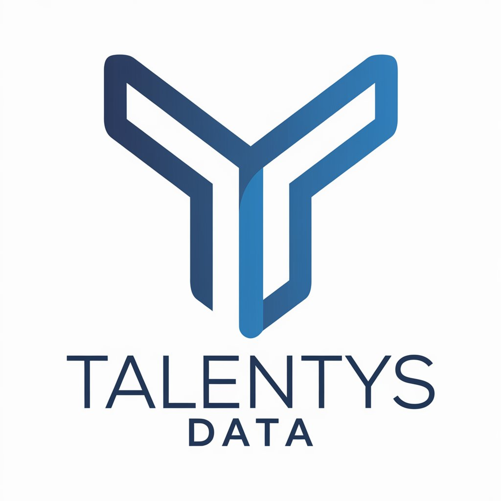
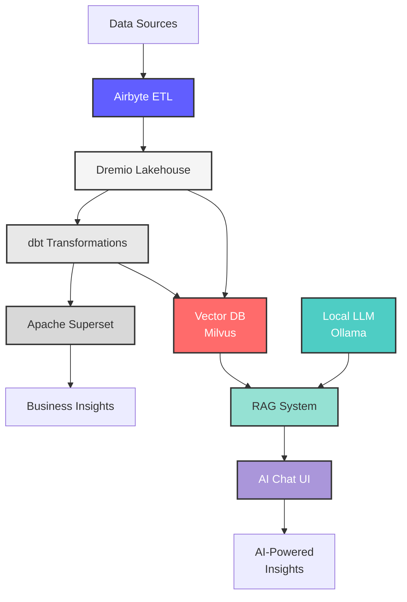

# 🚀 Data Platform - ISO Opensource

**Enterprise Data Lakehouse So**AI Capabilities (NEW):**
- 🤖 Local LLM server with Ollama (Llama 3.1, Mistral, Phi)
- 🧠 Vector database with Milvus for semantic search
- 📚 RAG (Retrieval Augmented Generation) system
- 💬 Interactive Chat UI for querying data with natural language
- 📄 **Document upload support (PDF, Word, Excel, CSV, JSON, TXT, Markdown)**
- 📦 **Automatic S3/MinIO storage for all uploaded documents**
- 🔄 Automatic data ingestion from PostgreSQL/Dremio to vector DB
- 🔒 100% on-premise - no cloud dependencies, complete data privacy

[](CHANGELOG.md)
[](https://python.org)
[](LICENSE)
[](docs/i18n/)

**Created by:** [Mustapha Fonsau](https://www.linkedin.com/in/mustapha-fonsau/) | [GitHub](https://github.com/Monsau)

<p align="center">
  <a href="https://talentys.eu" target="_blank">
    
  </a>
  <br/>
  <em>Supported by <a href="https://talentys.eu">Talentys</a> | <a href="https://www.linkedin.com/company/talentysdata">LinkedIn</a> - Data Engineering & Analytics Excellence</em>
</p>

> 📖 **Main documentation in English.** Translations available in 17 additional languages below.

---

## 🌍 Available Languages

🇬🇧 **English** (You are here) | [🇫🇷 Français](docs/i18n/fr/README.md) | [🇪🇸 Español](docs/i18n/es/README.md) | [🇵🇹 Português](docs/i18n/pt/README.md) | [🇨🇳 中文](docs/i18n/cn/README.md) | [🇯🇵 日本語](docs/i18n/jp/README.md) | [🇷🇺 Русский](docs/i18n/ru/README.md) | [🇸🇦 العربية](docs/i18n/ar/README.md) | [🇩🇪 Deutsch](docs/i18n/de/README.md) | [🇰🇷 한국어](docs/i18n/ko/README.md) | [🇮🇳 हिन्दी](docs/i18n/hi/README.md) | [🇮🇩 Indonesia](docs/i18n/id/README.md) | [🇹🇷 Türkçe](docs/i18n/tr/README.md) | [🇻🇳 Tiếng Việt](docs/i18n/vi/README.md) | [🇮🇹 Italiano](docs/i18n/it/README.md) | [🇳🇱 Nederlands](docs/i18n/nl/README.md) | [🇵🇱 Polski](docs/i18n/pl/README.md) | [🇸🇪 Svenska](docs/i18n/se/README.md)

---

## Overview

**AI-Ready** professional data platform combining **Airbyte**, **Dremio**, **dbt**, **Apache Superset**, and **Local LLM (Ollama)** for enterprise-grade data integration, transformation, quality assurance, business intelligence, and **AI-powered insights**. Built with multilingual support for global teams.



### Key Features

**Data Platform:**
- Data integration with Airbyte 1.8.0 (300+ connectors)
- Data lakehouse architecture with Dremio 26.0
- Automated transformations with dbt 1.10+
- Business intelligence with Apache Superset 3.0
- Comprehensive data quality testing (21 automated tests)
- Real-time synchronization via Arrow Flight
- Multilingual documentation (18 languages)

**AI Capabilities (NEW):**
- 🤖 Local LLM server with Ollama (Llama 3.1, Mistral, Phi)
- 🧠 Vector database with Milvus for semantic search
- 📚 RAG (Retrieval Augmented Generation) system
- 💬 Interactive Chat UI for querying data with natural language
- � **Document upload support (PDF, Word, Excel, CSV, JSON, TXT, Markdown)**
- �🔄 Automatic data ingestion from PostgreSQL/Dremio to vector DB
- 🔒 100% on-premise - no cloud dependencies, complete data privacy

---

## Quick Start

### Prerequisites

- Docker 20.10+ and Docker Compose 2.0+
- Python 3.11 or higher
- Minimum 8 GB RAM (16 GB recommended for AI services)
- 30 GB available disk space (includes LLM models)
- Optional: NVIDIA GPU for faster LLM inference

### One-Command Deployment

Use the **orchestrate_platform.py** script for automatic setup:

```bash
# Full deployment (Data Platform + AI Services)
python orchestrate_platform.py

# Windows PowerShell
$env:PYTHONIOENCODING="utf-8"
python -u orchestrate_platform.py

# Skip AI services if not needed
python orchestrate_platform.py --skip-ai

# Skip infrastructure (if already running)
python orchestrate_platform.py --skip-infrastructure
```

**What it does:**
- ✅ Validates prerequisites
- ✅ Starts all Docker services
- ✅ Deploys AI services (Ollama LLM, Milvus Vector DB, RAG API)
- ✅ Configures Airbyte, Dremio, dbt
- ✅ Runs data transformations
- ✅ Creates Superset dashboards
- ✅ Provides deployment summary with service URLs

### Manual Installation

```bash
# Clone repository
git clone https://github.com/Monsau/data-platform-iso-opensource.git
cd data-platform-iso-opensource

# Install dependencies
pip install -r requirements.txt

# Start infrastructure (Data Platform + AI Services)
docker-compose -f docker-compose.yml -f docker-compose-airbyte-stable.yml -f docker-compose-ai.yml up -d

# Or just data platform (no AI)
docker-compose -f docker-compose.yml -f docker-compose-airbyte-stable.yml up -d

# Or use make commands
make up

# Verify installation
make status

# Run quality tests
make dbt-test
```

### Access Services

**Data Platform:**

| Service | URL | Credentials |
|---------|-----|-------------|
| Airbyte | http://localhost:8000 | airbyte / password |
| Dremio | http://localhost:9047 | admin / admin123 |
| Superset | http://localhost:8088 | admin / admin |
| MinIO Console | http://localhost:9001 | minioadmin / minioadmin123 |
| PostgreSQL | localhost:5432 | postgres / postgres123 |

**AI Services (NEW):**

| Service | URL | Description |
|---------|-----|-------------|
| **AI Chat UI** | http://localhost:8501 | Chat with your data using natural language |
| RAG API | http://localhost:8002 | REST API for AI queries |
| RAG API Docs | http://localhost:8002/docs | Interactive API documentation |
| Ollama LLM | http://localhost:11434 | Local LLM server |
| Milvus Vector DB | localhost:19530 | Vector database for embeddings |
| Embedding Service | http://localhost:8001 | Text-to-vector conversion |

---

## Architecture

### System Components

#### Data Platform

| Component | Version | Port | Description |
|-----------|---------|------|-------------|
| **Airbyte** | 1.8.0 | 8000, 8001 | Data integration platform (300+ connectors) |
| **Dremio** | 26.0 | 9047, 32010 | Data lakehouse platform |
| **dbt** | 1.10+ | - | Data transformation tool |
| **Superset** | 3.0.0 | 8088 | Business intelligence platform |
| **PostgreSQL** | 15 | 5432 | Transactional database |
| **MinIO** | Latest | 9000, 9001 | S3-compatible object storage |
| **Elasticsearch** | 7.17.0 | 9200 | Search and analytics engine |
| **MySQL** | 8.0 | 3307 | OpenMetadata database |

#### AI Services (NEW)

| Component | Version | Port | Description |
|-----------|---------|------|-------------|
| **Ollama** | Latest | 11434 | Local LLM server (Llama 3.1 - 8B parameters) |
| **Milvus** | 2.3.3 | 19530 | Vector database for semantic search |
| **RAG API** | 1.0 | 8002 | RAG orchestration & query API (FastAPI) |
| **Embedding Service** | 1.0 | 8001 | Text-to-vector conversion (all-MiniLM-L6-v2) |
| **AI Chat UI** | 1.0 | 8501 | Natural language query interface (Streamlit) |
| **Data Ingestion** | 1.0 | - | Scheduled data loading service |

### Architecture Diagrams

- [System Architecture with Airbyte](docs/diagrams/architecture-with-airbyte.mmd)
- [Data Flow](docs/diagrams/data-flow.mmd)
- [Airbyte Workflow](docs/diagrams/airbyte-workflow.mmd)
- [Deployment](docs/diagrams/deployment.mmd)
- [User Journey](docs/diagrams/user-journey.mmd)

---

## Multilingual Support

This project provides complete documentation in **18 languages**, covering **5.2B+ people** (70% of global population):

| Language | Documentation | Data Generation | Native Speakers |
|----------|---------------|-----------------|-----------------|
| 🇬🇧 English | [README.md](README.md) | `--language en` | 1.5B |
| 🇫🇷 Français | [docs/i18n/fr/](docs/i18n/fr/README.md) | `--language fr` | 280M |
| 🇪🇸 Español | [docs/i18n/es/](docs/i18n/es/README.md) | `--language es` | 559M |
| 🇵🇹 Português | [docs/i18n/pt/](docs/i18n/pt/README.md) | `--language pt` | 264M |
| 🇸🇦 العربية | [docs/i18n/ar/](docs/i18n/ar/README.md) | `--language ar` | 422M |
| 🇨🇳 中文 | [docs/i18n/cn/](docs/i18n/cn/README.md) | `--language cn` | 1.3B |
| 🇯🇵 日本語 | [docs/i18n/jp/](docs/i18n/jp/README.md) | `--language jp` | 125M |
| 🇷🇺 Русский | [docs/i18n/ru/](docs/i18n/ru/README.md) | `--language ru` | 258M |
| 🇩🇪 Deutsch | [docs/i18n/de/](docs/i18n/de/README.md) | `--language de` | 134M |
| 🇰🇷 한국어 | [docs/i18n/ko/](docs/i18n/ko/README.md) | `--language ko` | 81M |
| 🇮🇳 हिन्दी | [docs/i18n/hi/](docs/i18n/hi/README.md) | `--language hi` | 602M |
| 🇮🇩 Indonesia | [docs/i18n/id/](docs/i18n/id/README.md) | `--language id` | 199M |
| 🇹🇷 Türkçe | [docs/i18n/tr/](docs/i18n/tr/README.md) | `--language tr` | 88M |
| 🇻🇳 Tiếng Việt | [docs/i18n/vi/](docs/i18n/vi/README.md) | `--language vi` | 85M |
| 🇮🇹 Italiano | [docs/i18n/it/](docs/i18n/it/README.md) | `--language it` | 85M |
| 🇳🇱 Nederlands | [docs/i18n/nl/](docs/i18n/nl/README.md) | `--language nl` | 25M |
| 🇵🇱 Polski | [docs/i18n/pl/](docs/i18n/pl/README.md) | `--language pl` | 45M |
| 🇸🇪 Svenska | [docs/i18n/se/](docs/i18n/se/README.md) | `--language se` | 13M |

### Generate Multilingual Test Data

```bash
# Generate French customer data (CSV format)
python config/i18n/data_generator.py --language fr --records 1000 --format csv

# Generate Spanish product data (JSON format)
python config/i18n/data_generator.py --language es --records 500 --format json

# Generate Chinese user data (Parquet format)
python config/i18n/data_generator.py --language cn --records 2000 --format parquet
```

Configuration: [config/i18n/config.json](config/i18n/config.json)

---

## 🤖 AI-Powered Data Insights

The platform includes a complete **AI/LLM stack** for natural language data querying and insights.

### Quick Start with AI

1. **Deploy Platform** (includes AI services):
   ```bash
   python orchestrate_platform.py
   ```

2. **Access AI Chat Interface**:
   - Open http://localhost:8501
   - Use the sidebar to ingest data from your PostgreSQL or Dremio tables

3. **Ingest Your Data** (via sidebar):
   ```
   Option 1: Upload Documents (NEW!)
   - Click "Choose files to upload"
   - Select PDF, Word, Excel, CSV, or other files
   - Add optional tags/source
   - Click "🚀 Upload & Ingest Documents"
   
   Option 2: From Database
   Table: customers
   Text column: description
   Metadata: customer_id,name,segment
   → Click "Ingest PostgreSQL"
   ```

4. **Ask Questions** (examples):
   - "What are the key trends in our sales data?"
   - "Show me customer segments with highest revenue"
   - "Are there any data quality issues in the orders table?"
   - "Generate a SQL query to find recent high-value customers"
   - "Explain the ETL pipeline for product data"

### AI Architecture

```
User Question → Chat UI → RAG API → Query Embedding
                                  ↓
                          Vector Search (Milvus)
                                  ↓
                          Retrieve Context Documents
                                  ↓
                          Build Prompt with Context
                                  ↓
                          Local LLM (Ollama/Llama 3.1)
                                  ↓
                          AI-Generated Answer + Sources
```

### AI Services Available

| Service | URL | Purpose |
|---------|-----|---------|
| **AI Chat UI** | http://localhost:8501 | Interactive Q&A interface |
| **RAG API** | http://localhost:8002 | REST API for AI queries |
| **RAG API Docs** | http://localhost:8002/docs | Interactive API documentation |
| **Ollama LLM** | http://localhost:11434 | Local LLM server (Llama 3.1) |
| **Milvus Vector DB** | localhost:19530 | Semantic search database |
| **Embedding Service** | http://localhost:8001 | Text-to-vector conversion |

### Programmatic Access

**Python Example:**

```python
import httpx

# Ask a question
response = httpx.post(
    "http://localhost:8002/query",
    json={
        "question": "What are our top products?",
        "top_k": 5,
        "model": "llama3.1"
    }
)

result = response.json()
print(f"Answer: {result['answer']}")
print(f"Sources: {len(result['sources'])} documents")
```

**cURL Example:**

```bash
curl -X POST http://localhost:8002/query \
  -H "Content-Type: application/json" \
  -d '{
    "question": "What trends do you see in customer data?",
    "top_k": 5,
    "model": "llama3.1",
    "temperature": 0.7
  }'
```

### Download Additional LLM Models

```bash
# Mistral (faster, good for coding)
docker exec ollama ollama pull mistral

# Phi3 (lightweight, quick responses)
docker exec ollama ollama pull phi3

# CodeLlama (code generation)
docker exec ollama ollama pull codellama

# List available models
docker exec ollama ollama list
```

### AI Features

- ✅ **100% Local**: No cloud APIs, no data leaves your infrastructure
- ✅ **Private**: All processing done on-premise
- ✅ **No API Costs**: No OpenAI/Anthropic bills
- ✅ **Semantic Search**: Vector database (Milvus) with 384-dim embeddings
- ✅ **RAG System**: Retrieval Augmented Generation for context-aware answers
- ✅ **Multiple Models**: Llama 3.1, Mistral, Phi3, CodeLlama
- ✅ **Auto-Ingestion**: Scheduled data updates from PostgreSQL/Dremio
- ✅ **Source Attribution**: See which documents the answer came from

### Comprehensive Guide

For detailed AI services documentation, see:
- [AI Services Guide](AI_SERVICES_GUIDE.md) - Complete guide with architecture, configuration, troubleshooting
- [Quick Start Guide](QUICK_START.md) - Fast AI setup with examples
- [Platform Status](PLATFORM_STATUS.md) - All services including AI

---

## Documentation

### For Different Roles

**Data Engineers**
- [Getting Started](docs/i18n/en/getting-started/)
- [dbt Models](dbt/README.md)
- [Data Quality Tests](reports/phase3/PHASE3_SUCCESS_REPORT.md)

**Data Analysts**
- [Superset Dashboards](reports/superset/SUPERSET_DREMIO_FINAL.md)
- [Query Examples](docs/i18n/en/guides/)
- [Open Data Dashboard](opendata/README.md)

**Developers**
- [API Documentation](docs/i18n/en/api/)
- [Contributing Guide](CONTRIBUTING.md)
- [Architecture](docs/i18n/en/architecture/)

**DevOps**
- [Deployment Guide](docs/i18n/en/architecture/)
- [Docker Configuration](docker-compose.yml)
- [Monitoring Setup](docs/i18n/en/guides/)

---

## Common Commands

```bash
# Infrastructure Management
make up              # Start all services
make down            # Stop all services
make restart         # Restart services
make status          # Check service status
make logs            # View service logs

# Data Transformation (dbt)
make dbt-run         # Run transformations
make dbt-test        # Run quality tests
make dbt-docs        # Generate documentation
make dbt-clean       # Clean artifacts

# Data Synchronization
make sync            # Manual sync Dremio to PostgreSQL
make sync-auto       # Auto sync every 5 minutes

# Testing & Quality
make test            # Run all tests
make lint            # Code quality checks
make format          # Format code

# Deployment
make deploy          # Complete deployment
make deploy-quick    # Quick deployment
```

---

## Project Status

```
Services: 9/9 operational (includes Airbyte)
dbt Tests: 21/21 passing
Dashboards: 3 active
Languages: 18 supported (5.2B+ people coverage)
Documentation: Complete in 18 languages
Status: Production Ready - v1.0
```

---

## Project Structure

```
data-platform-iso-opensource/
├── README.md                       # This file
├── AUTHORS.md                      # Project creators and contributors
├── CHANGELOG.md                    # Version history
├── CONTRIBUTING.md                 # Contribution guidelines
├── CODE_OF_CONDUCT.md              # Community guidelines
├── SECURITY.md                     # Security policies
├── LICENSE                         # MIT License
│
├── docs/                           # Documentation
│   ├── i18n/                       # Multilingual docs (18 languages)
│   │   ├── fr/, es/, pt/, cn/, jp/, ru/, ar/
│   │   ├── de/, ko/, hi/, id/, tr/, vi/
│   │   └── it/, nl/, pl/, se/
│   └── diagrams/                   # Mermaid diagrams (248+)
│
├── config/                         # Configuration
│   └── i18n/                       # Internationalization
│       ├── config.json
│       └── data_generator.py
│
├── dbt/                            # Data transformations
│   ├── models/                     # SQL models
│   ├── tests/                      # Quality tests
│   └── dbt_project.yml
│
├── reports/                        # Documentation reports
│   ├── phase1/                     # Integration reports
│   ├── phase2/                     # Data cleaning reports
│   ├── phase3/                     # Quality testing reports
│   ├── superset/                   # Dashboard guides
│   └── integration/                # Integration guides
│
├── scripts/                        # Automation scripts
│   ├── orchestrate_platform.py
│   ├── sync_dremio_realtime.py
│   └── populate_superset.py
│
└── docker-compose.yml              # Infrastructure definition
```

---

## 🗺️ Roadmap

Our vision for the future of Talentys Data Platform with **monthly releases**:

### 📦 v1.2.0 - November 2025 (Next Release)
**Focus: OpenMetadata Integration Phase 1**

- 🔍 **OpenMetadata**: Complete metadata catalog, data lineage, data quality
- 📝 **Auto-documentation**: LLM-generated dataset descriptions, PII detection

### 📦 v1.2.1 - December 2025
**Focus: OpenMetadata Phase 2 & Enhanced Chat UI**

- 💬 **Enhanced Chat UI**: Persistent history, export capabilities, bookmarks, themes
- � **OpenMetadata**: Smart tagging, column-level metadata

### 📦 v1.3.x - January-March 2026
**Focus: Security & Authentication**

- 🔐 OAuth2/SSO, RBAC, API security (Jan)
- 📊 Real-time analytics dashboard with alerting (Feb)
- 🎨 UI/UX improvements, user management (Mar)

### 📦 v1.4.x - April-June 2026
**Focus: Advanced AI & ML**

- 🤖 MLOps with MLflow, advanced RAG (Apr)
- 🧠 Multi-model LLM support, prompt engineering (May)
- 📊 Predictive analytics, automated insights (Jun)

### 📦 v1.5.x - July-September 2026
**Focus: Cloud Native & Kubernetes**

- ☁️ Helm charts, Kubernetes operators (Jul)
- 🌐 Multi-cloud support (AWS, Azure, GCP), hybrid cloud (Aug)
- 🔄 GitOps with ArgoCD, OpenTelemetry observability (Sep)

### 📦 v1.6.x - October-December 2026
**Focus: Enterprise Features**

- 🏢 Multi-tenancy, white-labeling (Oct)
- 💼 Enterprise governance, audit logging, data masking (Nov)
- 📱 Mobile app (iOS/Android), complete API (Dec)

### 📦 v2.0.0 - 2027
**Focus: Next-Generation Platform**

- 🚀 AI-first platform with natural language to SQL
- 🌊 Real-time streaming with Kafka/Flink
- 🌍 Data Mesh architecture, global scale

📄 **Full roadmap** (18 languages): [English](docs/i18n/en/ROADMAP.md) | [Français](docs/i18n/fr/ROADMAP.md) | [Español](docs/i18n/es/ROADMAP.md) | [All languages](docs/i18n/)

---

## Contributing

We welcome contributions from the community. Please see:
- [Contributing Guidelines](CONTRIBUTING.md)
- [Code of Conduct](CONTRIBUTING.md#code-of-conduct)
- [Development Setup](docs/i18n/en/getting-started/)

### Adding a New Language

1. Add language configuration to `config/i18n/config.json`
2. Create documentation directory: `docs/i18n/[language-code]/`
3. Translate README and guides
4. Update main README language table
5. Submit pull request

---

## License

This project is licensed under the MIT License. See [LICENSE](LICENSE) file for details.

---

## Acknowledgments

**Supported by [Talentys](https://talentys.eu) | [LinkedIn](https://www.linkedin.com/company/talentysdata)** - Data Engineering and Analytics Excellence

Built with enterprise-grade open-source technologies:

**Data Platform:**
- [Airbyte](https://airbyte.com/) - Data integration platform (300+ connectors)
- [Dremio](https://www.dremio.com/) - Data lakehouse platform
- [dbt](https://www.getdbt.com/) - Data transformation tool
- [Apache Superset](https://superset.apache.org/) - Business intelligence platform
- [Apache Arrow](https://arrow.apache.org/) - Columnar data format
- [PostgreSQL](https://www.postgresql.org/) - Relational database
- [MinIO](https://min.io/) - Object storage
- [Elasticsearch](https://www.elastic.co/) - Search and analytics

**AI Services:**
- [Ollama](https://ollama.ai/) - Local LLM server
- [Llama 3.1](https://ai.meta.com/llama/) - Meta's open-source LLM (8B parameters)
- [Milvus](https://milvus.io/) - Vector database for semantic search
- [sentence-transformers](https://www.sbert.net/) - Text embedding models
- [FastAPI](https://fastapi.tiangolo.com/) - Modern web framework for APIs
- [Streamlit](https://streamlit.io/) - App framework for ML/AI projects

---

## 📧 Contact

**Author:** Mustapha Fonsau
- 🏢 **Organization:** [Talentys](https://talentys.eu) | [LinkedIn](https://www.linkedin.com/company/talentysdata)
- 💼 **LinkedIn:** [linkedin.com/in/mustapha-fonsau](https://www.linkedin.com/in/mustapha-fonsau/)
- 🐙 **GitHub:** [github.com/Monsau](https://github.com/Monsau)
- 📧 **Email:** mfonsau@talentys.eu

## Support

For technical assistance:
- 📚 **Documentation:** [docs/i18n/](docs/i18n/)
- 🐛 **Issue Tracker:** [GitHub Issues](https://github.com/Monsau/data-platform-iso-opensource/issues)
- 💬 **Discussions:** [GitHub Discussions](https://github.com/Monsau/data-platform-iso-opensource/discussions)

---

**Version 1.0.0** | **2025-10-16** | **Production Ready**

Made with ❤️ by [Mustapha Fonsau](https://www.linkedin.com/in/mustapha-fonsau/) | Supported by [Talentys](https://talentys.eu) | [LinkedIn](https://www.linkedin.com/company/talentysdata)
