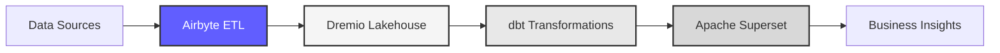

# 🚀 Data Platform

**Enterprise Data Lakehouse Solution**

[](CHANGELOG.md)
[](https://python.org)
[](LICENSE)
[](docs/i18n/)

> 📖 **Main documentation in English.** Translations available in 17 additional languages below.

---

## 🌍 Available Languages

🇬🇧 **English** (You are here) | [🇫🇷 Français](docs/i18n/fr/README.md) | [🇪🇸 Español](docs/i18n/es/README.md) | [🇵🇹 Português](docs/i18n/pt/README.md) | [🇨🇳 中文](docs/i18n/cn/README.md) | [🇯🇵 日本語](docs/i18n/jp/README.md) | [🇷🇺 Русский](docs/i18n/ru/README.md) | [🇸🇦 العربية](docs/i18n/ar/README.md) | [🇩🇪 Deutsch](docs/i18n/de/README.md) | [🇰🇷 한국어](docs/i18n/ko/README.md) | [🇮🇳 हिन्दी](docs/i18n/hi/README.md) | [🇮🇩 Indonesia](docs/i18n/id/README.md) | [🇹🇷 Türkçe](docs/i18n/tr/README.md) | [🇻🇳 Tiếng Việt](docs/i18n/vi/README.md) | [🇮🇹 Italiano](docs/i18n/it/README.md) | [🇳🇱 Nederlands](docs/i18n/nl/README.md) | [🇵🇱 Polski](docs/i18n/pl/README.md) | [🇸🇪 Svenska](docs/i18n/se/README.md)

---

## Overview

Professional data platform combining **Airbyte**, **Dremio**, **dbt**, and **Apache Superset** for enterprise-grade data integration, transformation, quality assurance, and business intelligence. Built with multilingual support for global teams.



### Key Features

- Data integration with Airbyte 1.8.0 (300+ connectors)
- Data lakehouse architecture with Dremio 26.0
- Automated transformations with dbt 1.10+
- Business intelligence with Apache Superset 3.0
- Comprehensive data quality testing (21 automated tests)
- Real-time synchronization via Arrow Flight
- Multilingual documentation (18 languages)

---

## Quick Start

### Prerequisites

- Docker 20.10+ and Docker Compose 2.0+
- Python 3.11 or higher
- Minimum 8 GB RAM
- 20 GB available disk space

### Installation

```bash
# Clone repository
git clone <repository-url>
cd dremiodbt

# Install dependencies
pip install -r requirements.txt

# Start infrastructure
make up

# Verify installation
make status

# Run quality tests
make dbt-test
```

### Access Services

| Service | URL | Credentials |
|---------|-----|-------------|
| Airbyte | http://localhost:8000 | - |
| Dremio | http://localhost:9047 | admin / admin123 |
| Superset | http://localhost:8088 | admin / admin |
| MinIO Console | http://localhost:9001 | minioadmin / minioadmin123 |
| PostgreSQL | localhost:5432 | postgres / postgres123 |

---

## Architecture

### System Components

| Component | Version | Port | Description |
|-----------|---------|------|-------------|
| **Airbyte** | 1.8.0 | 8000, 8001 | Data integration platform (300+ connectors) |
| **Dremio** | 26.0 | 9047, 32010 | Data lakehouse platform |
| **dbt** | 1.10+ | - | Data transformation tool |
| **Superset** | 3.0.0 | 8088 | Business intelligence platform |
| **PostgreSQL** | 15 | 5432 | Transactional database |
| **MinIO** | Latest | 9000, 9001 | S3-compatible object storage |
| **Elasticsearch** | 7.17.0 | 9200 | Search and analytics engine |
| **MySQL** | 8.0 | 3307 | OpenMetadata database |

### Architecture Diagrams

- [System Architecture with Airbyte](docs/diagrams/architecture-with-airbyte.mmd)
- [Data Flow](docs/diagrams/data-flow.mmd)
- [Airbyte Workflow](docs/diagrams/airbyte-workflow.mmd)
- [Deployment](docs/diagrams/deployment.mmd)
- [User Journey](docs/diagrams/user-journey.mmd)

---

## Multilingual Support

This project provides complete documentation in 8 languages:

| Language | Documentation | Data Generation |
|----------|---------------|-----------------|
| English | [docs/i18n/en/](docs/i18n/en/README.md) | `--language en` |
| Français | [docs/i18n/fr/](docs/i18n/fr/README.md) | `--language fr` |
| Español | [docs/i18n/es/](docs/i18n/es/README.md) | `--language es` |
| Português | [docs/i18n/pt/](docs/i18n/pt/README.md) | `--language pt` |
| العربية | [docs/i18n/ar/](docs/i18n/ar/README.md) | `--language ar` |
| 中文 | [docs/i18n/cn/](docs/i18n/cn/README.md) | `--language cn` |
| 日本語 | [docs/i18n/jp/](docs/i18n/jp/README.md) | `--language jp` |
| Русский | [docs/i18n/ru/](docs/i18n/ru/README.md) | `--language ru` |

### Generate Multilingual Test Data

```bash
# Generate French customer data (CSV format)
python config/i18n/data_generator.py --language fr --records 1000 --format csv

# Generate Spanish product data (JSON format)
python config/i18n/data_generator.py --language es --records 500 --format json

# Generate Chinese user data (Parquet format)
python config/i18n/data_generator.py --language cn --records 2000 --format parquet
```

Configuration: [config/i18n/config.json](config/i18n/config.json)

---

## Documentation

### For Different Roles

**Data Engineers**
- [Getting Started](docs/i18n/en/getting-started/)
- [dbt Models](dbt/README.md)
- [Data Quality Tests](reports/phase3/PHASE3_SUCCESS_REPORT.md)

**Data Analysts**
- [Superset Dashboards](reports/superset/SUPERSET_DREMIO_FINAL.md)
- [Query Examples](docs/i18n/en/guides/)
- [Open Data Dashboard](opendata/README.md)

**Developers**
- [API Documentation](docs/i18n/en/api/)
- [Contributing Guide](CONTRIBUTING.md)
- [Architecture](docs/i18n/en/architecture/)

**DevOps**
- [Deployment Guide](docs/i18n/en/architecture/)
- [Docker Configuration](docker-compose.yml)
- [Monitoring Setup](docs/i18n/en/guides/)

---

## Common Commands

```bash
# Infrastructure Management
make up              # Start all services
make down            # Stop all services
make restart         # Restart services
make status          # Check service status
make logs            # View service logs

# Data Transformation (dbt)
make dbt-run         # Run transformations
make dbt-test        # Run quality tests
make dbt-docs        # Generate documentation
make dbt-clean       # Clean artifacts

# Data Synchronization
make sync            # Manual sync Dremio to PostgreSQL
make sync-auto       # Auto sync every 5 minutes

# Testing & Quality
make test            # Run all tests
make lint            # Code quality checks
make format          # Format code

# Deployment
make deploy          # Complete deployment
make deploy-quick    # Quick deployment
```

---

## Project Status

```
Services: 9/9 operational (includes Airbyte)
dbt Tests: 21/21 passing
Dashboards: 3 active
Languages: 8 supported
Documentation: Complete
Status: Production Ready
```

---

## Project Structure

```
dremiodbt/
├── README.md                       # This file
├── CHANGELOG.md                    # Version history
├── CONTRIBUTING.md                 # Contribution guidelines
├── LICENSE                         # MIT License
│
├── docs/                           # Documentation
│   ├── i18n/                       # Multilingual docs (8 languages)
│   │   ├── en/, fr/, es/, pt/
│   │   └── ar/, cn/, jp/, ru/
│   └── diagrams/                   # Mermaid diagrams
│
├── config/                         # Configuration
│   └── i18n/                       # Internationalization
│       ├── config.json
│       └── data_generator.py
│
├── dbt/                            # Data transformations
│   ├── models/                     # SQL models
│   ├── tests/                      # Quality tests
│   └── dbt_project.yml
│
├── reports/                        # Documentation reports
│   ├── phase1/                     # Integration reports
│   ├── phase2/                     # Data cleaning reports
│   ├── phase3/                     # Quality testing reports
│   ├── superset/                   # Dashboard guides
│   └── integration/                # Integration guides
│
├── scripts/                        # Automation scripts
│   ├── orchestrate_platform.py
│   ├── sync_dremio_realtime.py
│   └── populate_superset.py
│
└── docker-compose.yml              # Infrastructure definition
```

---

## Contributing

We welcome contributions from the community. Please see:
- [Contributing Guidelines](CONTRIBUTING.md)
- [Code of Conduct](CONTRIBUTING.md#code-of-conduct)
- [Development Setup](docs/i18n/en/getting-started/)

### Adding a New Language

1. Add language configuration to `config/i18n/config.json`
2. Create documentation directory: `docs/i18n/[language-code]/`
3. Translate README and guides
4. Update main README language table
5. Submit pull request

---

## License

This project is licensed under the MIT License. See [LICENSE](LICENSE) file for details.

---

## Acknowledgments

Built with enterprise-grade open-source technologies:
- [Airbyte](https://airbyte.com/) - Data integration platform (300+ connectors)
- [Dremio](https://www.dremio.com/) - Data lakehouse platform
- [dbt](https://www.getdbt.com/) - Data transformation tool
- [Apache Superset](https://superset.apache.org/) - Business intelligence platform
- [Apache Arrow](https://arrow.apache.org/) - Columnar data format
- [PostgreSQL](https://www.postgresql.org/) - Relational database
- [MinIO](https://min.io/) - Object storage
- [Elasticsearch](https://www.elastic.co/) - Search and analytics

---

## Support

For technical assistance:
- Documentation: [docs/i18n/](docs/i18n/)
- Issue Tracker: [GitHub Issues](https://github.com/yourorg/dremiodbt/issues)
- Discussions: [GitHub Discussions](https://github.com/yourorg/dremiodbt/discussions)
- Email: support@example.com

---

**Version 3.2.0** | **2025-10-16** | **Production Ready**

Made for enterprise data teams worldwide.
