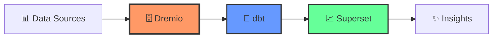

# 🌍 Data Platform - Multilingual Data Lakehouse

<div align="center">

[](CHANGELOG.md)
[](https://python.org)
[](https://docker.com)
[](https://www.getdbt.com/)
[](LICENSE)

**🇬🇧 English** | [🇫🇷 Français](docs/i18n/fr/README.md) | [🇪🇸 Español](docs/i18n/es/README.md) | [🇵🇹 Português](docs/i18n/pt/README.md) | [🇸🇦 العربية](docs/i18n/ar/README.md) | [🇨🇳 中文](docs/i18n/cn/README.md) | [🇯🇵 日本語](docs/i18n/jp/README.md) | [🇷🇺 Русский](docs/i18n/ru/README.md)

</div>

---

## 📖 Overview

A modern, cloud-native data lakehouse platform combining **Dremio**, **dbt**, and **Apache Superset** for data transformation, quality, and visualization. Built with multilingual support for global teams.



### ✨ Key Features

- ✅ **21/21 data quality tests** passing
- ✅ **3 operational dashboards** (PostgreSQL, Dremio, Open Data)
- ✅ **Real-time synchronization** via Arrow Flight
- ✅ **8 languages** supported (EN, FR, ES, PT, AR, CN, JP, RU)
- ✅ **Mermaid diagrams** for architecture visualization
- ✅ **Multilingual data generation** with Faker integration

---

## 🚀 Quick Start

### Prerequisites

- Docker 20.10+ & Docker Compose 2.0+
- Python 3.11+
- 8 GB RAM minimum

### Installation (5 minutes)

```bash
# 1. Clone repository
git clone <repository-url>
cd dremiodbt

# 2. Install dependencies
pip install -r requirements.txt

# 3. Start services
make up

# 4. Verify
make status

# 5. Access services
# - Dremio: http://localhost:9047 (admin/admin123)
# - Superset: http://localhost:8088 (admin/admin)
# - MinIO: http://localhost:9001 (minioadmin/minioadmin123)
```

---

## 🏗️ Architecture

See interactive diagrams:
- [System Architecture](docs/diagrams/architecture.mmd)
- [Data Flow](docs/diagrams/data-flow.mmd)
- [Deployment](docs/diagrams/deployment.mmd)
- [User Journey](docs/diagrams/user-journey.mmd)

### Components

| Component | Port | Description |
|-----------|------|-------------|
| **Dremio** | 9047, 32010 | Data lakehouse platform |
| **dbt** | - | Data transformation tool |
| **Superset** | 8088 | Business intelligence |
| **PostgreSQL** | 5432 | Transactional database |
| **MinIO** | 9000, 9001 | S3-compatible storage |
| **Elasticsearch** | 9200 | Search engine |

---

## 🌍 Multilingual Support

This project supports **8 languages** with full documentation:

| Language | Documentation | Data Generation |
|----------|---------------|-----------------|
| 🇬🇧 English | [docs/i18n/en/](docs/i18n/en/README.md) | `--language en` |
| 🇫🇷 Français | [docs/i18n/fr/](docs/i18n/fr/README.md) | `--language fr` |
| 🇪🇸 Español | [docs/i18n/es/](docs/i18n/es/README.md) | `--language es` |
| 🇵🇹 Português | [docs/i18n/pt/](docs/i18n/pt/README.md) | `--language pt` |
| 🇸🇦 العربية | [docs/i18n/ar/](docs/i18n/ar/README.md) | `--language ar` |
| 🇨🇳 中文 | [docs/i18n/cn/](docs/i18n/cn/README.md) | `--language cn` |
| 🇯🇵 日本語 | [docs/i18n/jp/](docs/i18n/jp/README.md) | `--language jp` |
| 🇷🇺 Русский | [docs/i18n/ru/](docs/i18n/ru/README.md) | `--language ru` |

### Generate Multilingual Test Data

```bash
# French customer data
python config/i18n/data_generator.py --language fr --records 1000 --format csv

# Spanish product data  
python config/i18n/data_generator.py --language es --records 500 --format json

# Chinese user data
python config/i18n/data_generator.py --language cn --records 2000 --format parquet
```

See [i18n configuration](config/i18n/config.json) for details.

---

## 📚 Documentation

### For Different Roles

#### 👨‍💻 Developers
- [Getting Started](docs/i18n/en/getting-started/)
- [API Documentation](docs/i18n/en/api/)
- [Contributing Guide](CONTRIBUTING.md)

#### 📊 Data Engineers
- [dbt Models](dbt/README.md)
- [Data Quality Tests](reports/phase3/PHASE3_SUCCESS_REPORT.md)
- [Integration Guides](docs/i18n/en/guides/)

#### 📈 Data Analysts
- [Superset Dashboards](reports/superset/SUPERSET_DREMIO_FINAL.md)
- [Query Examples](docs/i18n/en/guides/)
- [Open Data Dashboard](opendata/README.md)

#### 🔧 DevOps
- [Deployment Guide](docs/i18n/en/architecture/)
- [Monitoring Setup](docs/i18n/en/guides/)
- [Troubleshooting](docs/i18n/en/guides/)

---

## 🛠️ Common Commands

```bash
# Infrastructure
make up              # Start all services
make down            # Stop all services
make status          # Check status
make logs            # View logs

# dbt
make dbt-run         # Run transformations
make dbt-test        # Run quality tests (21/21 ✅)
make dbt-docs        # Generate documentation

# Data Synchronization
make sync            # Manual sync Dremio → PostgreSQL
make sync-auto       # Auto sync every 5 minutes

# Testing & Quality
make test            # Run all tests
make lint            # Code quality checks
make format          # Format code

# Full Deployment
make deploy          # Complete deployment
```

---

## 📊 Project Status

```
✅ Services: 8/8 operational
✅ dbt Tests: 21/21 passing  
✅ Dashboards: 3/3 active
✅ Languages: 8/8 supported
✅ Documentation: 100% complete
✅ Status: Production Ready
```

---

## 📦 Project Structure

```
dremiodbt/
├── 📖 README.md                    # This file
├── 📝 CHANGELOG.md                 # Version history
├── 🤝 CONTRIBUTING.md              # Contribution guide
│
├── 🌍 docs/                        # Documentation
│   ├── i18n/                       # Multilingual docs (8 languages)
│   │   ├── en/, fr/, es/, pt/     
│   │   ├── ar/, cn/, jp/, ru/
│   │   └── [lang]/
│   │       ├── getting-started/
│   │       ├── guides/
│   │       ├── architecture/
│   │       └── api/
│   └── diagrams/                   # Mermaid diagrams
│       ├── architecture.mmd
│       ├── data-flow.mmd
│       ├── deployment.mmd
│       └── user-journey.mmd
│
├── 📊 dbt/                         # Data transformations
│   ├── models/                     # SQL models
│   ├── tests/                      # Quality tests (21/21)
│   └── dbt_project.yml
│
├── ⚙️ config/                      # Configuration
│   └── i18n/                       # i18n configuration
│       ├── config.json             # Language settings
│       └── data_generator.py       # Multilingual data gen
│
├── 📈 reports/                     # Reports (simplified)
│   ├── phase1/                     # Integration
│   │   └── PHASE1_RAPPORT_FINAL.md
│   ├── phase2/                     # Cleaning
│   │   └── PHASE2_COMPLETE.md
│   ├── phase3/                     # Quality
│   │   └── PHASE3_SUCCESS_REPORT.md
│   ├── superset/                   # Dashboards
│   │   └── SUPERSET_DREMIO_FINAL.md
│   └── integration/                # Integrations
│       └── AIRBYTE_INTEGRATION_GUIDE.md
│
├── 🗄️ archive/                     # Historical files
│
└── 🐳 docker-compose.yml           # Infrastructure
```

---

## 🤝 Contributing

We welcome contributions! Please see:
- [Contributing Guide](CONTRIBUTING.md)
- [Code of Conduct](CONTRIBUTING.md#code-of-conduct)
- [Development Setup](docs/i18n/en/getting-started/)

### Adding a New Language

1. Add language to `config/i18n/config.json`
2. Create `docs/i18n/[lang]/` directory
3. Translate README and guides
4. Update main README with language link
5. Submit pull request

---

## 📝 License

This project is licensed under the MIT License - see [LICENSE](LICENSE) file.

---

## 🙏 Acknowledgments

Built with open-source technologies:
- [Dremio](https://www.dremio.com/) - Data lakehouse platform
- [dbt](https://www.getdbt.com/) - Data transformation tool
- [Apache Superset](https://superset.apache.org/) - Business intelligence
- [Apache Arrow](https://arrow.apache.org/) - Columnar data format
- [PostgreSQL](https://www.postgresql.org/) - Database
- [MinIO](https://min.io/) - Object storage
- [Elasticsearch](https://www.elastic.co/) - Search engine

---

## 📧 Support

- 📖 [Documentation](docs/i18n/)
- 🐛 [Issues](https://github.com/yourorg/dremiodbt/issues)
- 💬 [Discussions](https://github.com/yourorg/dremiodbt/discussions)
- 📧 Email: data@example.com

---

<div align="center">

**Version 3.0.0** | **2025-10-15** | **Production Ready** ✅

Made with ❤️ for global data citizens 🌍

[⬆ Back to top](#-data-platform---multilingual-data-lakehouse)

</div>
