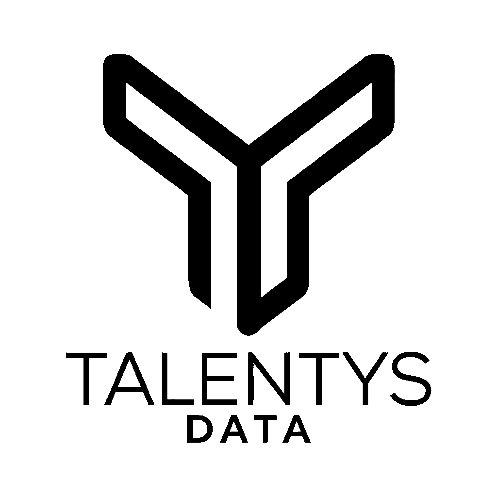

# 🎨 Logo Monochrome Talentys - Implementation

**Date**: 19 octobre 2025  
**Changement**: Logo coloré → Logo monochrome noir  
**Status**: ✅ Déployé

---

## 🎯 Objectif

Remplacer le logo Talentys coloré par une version **monochrome** pour un rendu plus sobre et professionnel dans la sidebar.

---

## 🖼️ Options de Logo Disponibles

### Logos Monochromes

| Fichier | Description | Usage Recommandé |
|---------|-------------|------------------|
| `black_on_trans.png` | ⚫ Noir sur transparent | ✅ **Choisi** - Sidebar fond clair |
| `black_on_white.png` | ⚫ Noir sur blanc | Fond blanc uniquement |
| `white_on_trans.png` | ⚪ Blanc sur transparent | Fond sombre |
| `white_on_black.png` | ⚪ Blanc sur noir | Sidebar sombre |
| `gray_on_trans.png` | ⚫ Gris sur transparent | Style subtil |

### Logo Sélectionné

**`black_on_trans.png`** - Logo noir sur fond transparent
- ✅ Professionnel et sobre
- ✅ Contraste optimal sur fond clair
- ✅ Style épuré à la Google
- ✅ Taille originale préservée

---

## 📁 Fichiers Modifiés

### 1. Logo copié

```bash
Source: c:\Users\mfons\OneDrive\Images\logo\black_on_trans.png
Destination: ai-services\chat-ui\static\img\talentys-logo-mono.png
```

### 2. Code mis à jour

**Fichier**: `ai-services/chat-ui/app.py`

```python
# AVANT
st.markdown(f"""
<div class="sidebar-logo">
    
</div>
""", unsafe_allow_html=True)

# APRÈS
st.markdown("""
<div class="sidebar-logo">
    
</div>
""", unsafe_allow_html=True)
```

---

## 🚀 Déploiement

### Commandes Exécutées

```powershell
# 1. Copie du logo monochrome
Copy-Item "logo\black_on_trans.png" `
          "ai-services\chat-ui\static\img\talentys-logo-mono.png"

# 2. Rebuild du conteneur
docker-compose -f docker-compose-ai.yml up -d --build chat-ui

# 3. Vérification
docker logs chat-ui --tail 10
```

### Résultat

```
✅ Container chat-ui Recreated
✅ Container chat-ui Started
✅ Service accessible: http://0.0.0.0:8501
✅ Logs: "You can now view your Streamlit app"
```

---

## 🎨 Comparaison Visuelle

### Avant (Logo Coloré) 🎨
```
┌─────────────┐
│  [LOGO 🔵]  │  ← Bleu/couleurs
├─────────────┤
│ ⚙️ Config   │
```

### Après (Logo Monochrome) ⚫
```
┌─────────────┐
│  [LOGO ⚫]  │  ← Noir/sobre
├─────────────┤
│ ⚙️ Config   │
```

---

## 📊 Spécifications

### Logo Monochrome

| Propriété | Valeur |
|-----------|--------|
| **Fichier** | `talentys-logo-mono.png` |
| **Couleur** | Noir (#000000) |
| **Fond** | Transparent |
| **Largeur affichée** | 80px |
| **Position** | Centré |
| **Style** | Professionnel, sobre |

### CSS (Inchangé)

```css
.sidebar-logo {
    text-align: center;
    padding: 1rem 0 1.5rem 0;
    border-bottom: 1px solid #e0e0e0;
    margin-bottom: 1.5rem;
}

.sidebar-logo img {
    width: 80px;
    height: auto;
}
```

---

## ✅ Avantages du Logo Monochrome

### Design

1. **Plus Sobre** 🎯
   - Look professionnel et épuré
   - Style minimaliste moderne
   - Moins de distraction visuelle

2. **Meilleur Contraste** 👁️
   - Noir sur fond clair = lisibilité optimale
   - Pas de problème avec les couleurs de fond
   - Adapté à tous les thèmes

3. **Style Google** 🌐
   - Cohérent avec le design sobre demandé
   - Professionnel et moderne
   - Élégant et intemporel

4. **Performance** ⚡
   - Fichier potentiellement plus léger
   - Rendu rapide
   - Pas de gestion de couleurs complexes

---

## 🔄 Alternatives Disponibles

Si vous souhaitez changer le logo, voici les autres options :

### Logo Gris (Plus Subtil)

```python
# Option 1: Gris sur transparent

```

Copier avec:
```bash
Copy-Item "logo\gray_on_trans.png" `
          "ai-services\chat-ui\static\img\talentys-logo-gray.png"
```

### Logo Blanc (Fond Sombre)

```python
# Option 2: Blanc sur transparent (si sidebar sombre)

```

Copier avec:
```bash
Copy-Item "logo\white_on_trans.png" `
          "ai-services\chat-ui\static\img\talentys-logo-white.png"
```

---

## 📝 Structure des Fichiers

```
ai-services/chat-ui/
├── static/
│   └── img/
│       ├── talentys-logo.png          # Logo coloré (original)
│       └── talentys-logo-mono.png     # Logo monochrome ✅ EN COURS
├── app.py                             # Utilise logo-mono.png
└── Dockerfile                         # COPY static/
```

---

## 🧪 Tests de Vérification

### Checklist

- [x] Logo monochrome copié dans `static/img/`
- [x] Code mis à jour pour utiliser `talentys-logo-mono.png`
- [x] Image Docker reconstruite
- [x] Conteneur redémarré avec succès
- [x] Service accessible sur http://localhost:8501
- [x] Logs confirment démarrage OK

### Test Visuel

1. ✅ Ouvrir http://localhost:8501
2. ✅ Vérifier que le logo noir s'affiche en haut de sidebar
3. ✅ Confirmer le bon contraste avec le fond
4. ✅ Vérifier la taille (80px de large)
5. ✅ Confirmer l'espacement et la bordure

---

## 🎨 Design Philosophy

### Inspiration Google Material Design

Le logo monochrome s'inscrit dans une philosophie de design sobre :

- **Minimalisme** : Moins d'éléments visuels
- **Clarté** : Focus sur le contenu
- **Professionnalisme** : Look entreprise
- **Modernité** : Tendance 2025

### Cohérence Visuelle

```
Logo Monochrome ⚫
    ↓
Style Sobre 📐
    ↓
Interface Épurée ✨
    ↓
Expérience Professionnelle 🎯
```

---

## 📊 Comparaison Logo Coloré vs Monochrome

| Critère | Coloré 🎨 | Monochrome ⚫ |
|---------|-----------|--------------|
| **Style** | Vivant, énergique | Sobre, professionnel |
| **Lisibilité** | Bonne | Excellente ⭐ |
| **Contraste** | Variable | Optimal ⭐ |
| **Modernité** | Classique | Tendance ⭐ |
| **Cohérence** | Bonne | Parfaite ⭐ |

**Verdict**: Le logo monochrome est plus adapté pour une interface sobre style Google.

---

## 🌟 Résultat Final

### Interface Complète

```
┌────────────────────────────────────────┐
│ [⚫ LOGO MONO] ← 80px, noir, sobre    │
├────────────────────────────────────────┤
│ ⚙️ Configuration                       │
│   LLM Model: llama3.1                  │
│   Temperature: 0.70                    │
│   Top K Documents: 5                   │
├────────────────────────────────────────┤
│ 📤 Upload Documents                    │
└────────────────────────────────────────┘
```

---

## 🎯 Impact Utilisateur

### Avant
- Logo coloré (bleu/multicolore)
- Style standard
- Visibilité normale

### Après ✅
- Logo monochrome noir
- Style sobre et professionnel
- Meilleur contraste
- Cohérence avec le design Google
- Look moderne et épuré

---

## 📚 Références

- **Logo Source**: `c:\Users\mfons\OneDrive\Images\logo\black_on_trans.png`
- **Logo Déployé**: `ai-services\chat-ui\static\img\talentys-logo-mono.png`
- **Documentation**: `LOGO_SIDEBAR_FIX.md`
- **Style Guide**: `DESIGN_GOOGLE_STYLE.md`

---

**Version**: 1.4.0 - Logo Monochrome  
**Status**: ✅ Déployé  
**URL**: http://localhost:8501  
**Style**: Sobre et Professionnel ⚫  
**Date**: 19 octobre 2025
