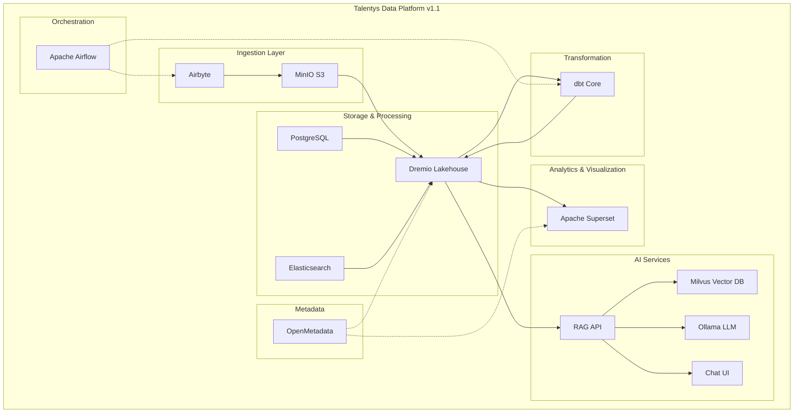

# 📸 Guide de Prise de Captures d'Écran - Release v1.1

## 🎯 Objectif

Créer des captures d'écran professionnelles et cohérentes pour documenter la release v1.1 de la Talentys Data Platform.

---

## 🛠️ Préparation

### Prérequis

1. **Services démarrés**
   ```powershell
   docker-compose -f docker-compose-ai.yml up -d
   ```

2. **Navigateur**
   - Chrome ou Edge (mode navigation privée pour éviter cache)
   - Zoom à 100%
   - Résolution écran: 1920x1080 minimum

3. **Outils de capture**
   - Windows: Win + Shift + S (Snipping Tool)
   - Alternative: ShareX, Greenshot, ou Snagit
   - Format: PNG (meilleure qualité)

---

## 📋 Liste des Captures à Réaliser

### 1️⃣ Chat UI - AVANT v1.1 (Simulation)

**Fichier**: `chat-ui-before.png`

**Comment obtenir l'ancien état**:
```powershell
# Créer une copie temporaire de app.py
cp ai-services/chat-ui/app.py ai-services/chat-ui/app.py.v1.1.backup

# Restaurer l'ancien code (sans logo)
# Éditer ai-services/chat-ui/app.py et supprimer temporairement:
# - Les lignes 10-24 (COMPANY_INFO import)
# - Les lignes 99-106 (Logo monochrome)
# - Remplacer par: st.markdown("# ❌")

# Rebuild
docker-compose -f docker-compose-ai.yml up -d --build chat-ui

# Capturer l'écran
# URL: http://localhost:8501

# Restaurer
cp ai-services/chat-ui/app.py.v1.1.backup ai-services/chat-ui/app.py
docker-compose -f docker-compose-ai.yml up -d --build chat-ui
```

**Éléments à capturer**:
- ✅ Interface complète (sidebar + zone principale)
- ✅ Croix rouge X visible au lieu du logo
- ✅ Absence de footer Talentys
- ✅ Design basique

---

### 2️⃣ Chat UI - APRÈS v1.1

**Fichier**: `chat-ui-after.png`

**URL**: `http://localhost:8501`

**Procédure**:
1. Ouvrir http://localhost:8501
2. Attendre que la page charge complètement
3. Faire Ctrl+F5 pour vider le cache
4. Capturer l'écran complet

**Éléments à capturer**:
- ✅ Logo monochrome Talentys centré (sidebar, en haut)
- ✅ Menu Configuration visible
- ✅ Footer avec "support@talentys.eu"
- ✅ Design sobre et professionnel
- ✅ Interface complète (sidebar + zone chat)

**Points d'attention**:
- Le logo doit être net (80px, bien centré)
- Le footer doit être visible en bas
- Pas de messages d'erreur

---

### 3️⃣ Chat UI - Sidebar en Détail

**Fichier**: `chat-ui-sidebar-detail.png`

**Procédure**:
1. Ouvrir http://localhost:8501
2. Zoomer légèrement (110%) pour voir les détails
3. Capturer uniquement la sidebar (partie gauche)

**Éléments à capturer**:
- ✅ Logo Talentys monochrome (80px, centré)
- ✅ Séparateur horizontal
- ✅ Titre "⚙️ Configuration"
- ✅ Options de configuration
- ✅ Footer avec email

**Cadrage**:
```
┌──────────────────┐
│                  │
│   [LOGO ⚫]     │  ← Bien visible
│                  │
├──────────────────┤
│                  │
│ ⚙️ Configuration │
│                  │
│ [Options...]     │
│                  │
│                  │
├──────────────────┤
│                  │
│ 📧 support@      │
│    talentys.eu   │
│                  │
└──────────────────┘
```

---

### 4️⃣ Chat UI - Footer

**Fichier**: `chat-ui-footer.png`

**Procédure**:
1. Ouvrir http://localhost:8501
2. Cliquer sur "ℹ️ About" dans le menu en haut à droite
3. Capturer la popup qui s'affiche

**Éléments à capturer**:
- ✅ Section "About"
- ✅ Email support@talentys.eu visible
- ✅ Informations Talentys
- ✅ Version si affichée

---

### 5️⃣ Chat UI - Conversation Complète

**Fichier**: `chat-ui-conversation.png`

**Procédure**:
1. Ouvrir http://localhost:8501
2. Démarrer une conversation exemple:
   ```
   User: "Bonjour, peux-tu m'expliquer ce qu'est Talentys Data Platform ?"
   
   Assistant: "Bonjour ! 👋
   
   La Talentys Data Platform est une plateforme complète de data engineering
   et d'analytics qui combine 17 services pour offrir une solution
   d'analyse de données moderne et professionnelle.
   
   Elle inclut:
   - 📊 Dremio pour le data lakehouse
   - 🔄 dbt pour les transformations
   - 📈 Superset pour les dashboards
   - 🤖 Chat UI avec IA pour l'assistance
   - Et bien plus encore!
   
   Comment puis-je vous aider aujourd'hui?"
   ```
3. Capturer l'interface complète avec la conversation

**Éléments à capturer**:
- ✅ Logo visible en haut
- ✅ Conversation active (messages user + assistant)
- ✅ Zone de saisie en bas
- ✅ Footer avec email

---

### 6️⃣ Dremio - Datasets

**Fichier**: `dremio-datasets.png`

**URL**: `http://localhost:9047`

**Procédure**:
1. Se connecter à Dremio (admin/talentys123)
2. Aller dans l'onglet "Data" (Datasets)
3. Développer quelques sources (@admin, analytics, raw, staging)
4. Capturer l'écran

**Éléments à capturer**:
- ✅ Liste des datasets visible:
  - @admin
  - analytics
  - Elasticsearch_Logs
  - marts
  - MinIO_Storage
  - PostgreSQL_BusinessDB
  - raw
  - staging
- ✅ Interface Dremio complète
- ✅ Navigation claire

**Cadrage**: Interface complète de Dremio avec le panneau de gauche et la zone principale.

---

### 7️⃣ Superset - Dashboard

**Fichier**: `superset-dashboard.png`

**URL**: `http://localhost:8088`

**Procédure**:
1. Se connecter à Superset (admin/talentys123)
2. Ouvrir un dashboard existant (ou en créer un basique)
3. Capturer le dashboard avec quelques graphiques

**Éléments à capturer**:
- ✅ Au moins 2-3 visualisations (graphiques)
- ✅ Titre du dashboard
- ✅ Interface Superset complète
- ✅ Navigation

**Si pas de dashboard**: Créer un dashboard simple avec 2-3 charts basiques (bar chart, line chart, table).

---

### 8️⃣ Architecture - Diagramme Complet

**Fichier**: `architecture-diagram.png`

**Procédure**:

**Option A - Export Mermaid**:
1. Ouvrir le fichier contenant le schéma d'architecture Mermaid
2. Utiliser un outil d'export Mermaid vers PNG (Mermaid Live Editor, VS Code extension)
3. Exporter en haute résolution

**Option B - Créer un nouveau schéma simplifié**:


**Éléments à capturer**:
- ✅ Tous les 17 services visibles
- ✅ Flux de données (flèches)
- ✅ Regroupement par couches
- ✅ Logo Talentys si possible

---

### 9️⃣ Logo Talentys - Variantes

**Fichier**: `logo-variants.png`

**Procédure**:
1. Ouvrir le dossier `assets/images/talentys/`
2. Créer une grille montrant les différentes variantes:
   - original.png
   - black_on_trans.png (utilisé dans Chat UI)
   - white_on_trans.png
   - gray_on_trans.png
   - Quelques tailles différentes (170x100, 400x400, 800x800, etc.)

**Éléments à capturer**:
- ✅ Grille 3x3 ou 4x4 avec logos
- ✅ Noms des fichiers sous chaque logo
- ✅ Fond contrasté pour voir les logos transparents
- ✅ Dimensions visibles

**Outil suggéré**: Créer une page HTML simple ou utiliser un outil de montage pour créer la grille.

---

## 📐 Spécifications Techniques

### Format
- **Type**: PNG (pas de JPEG pour garder la qualité)
- **Résolution**: Minimum 1920px de largeur
- **Compression**: Optimisée (PNG-8 ou PNG-24 selon besoin de transparence)

### Cadrage
- **Marges**: Laisser un peu d'espace autour (10-20px)
- **Zoom**: 100% (ou 110% pour les détails)
- **Thème**: Clair (par défaut)

### Nommage
- Format: `{composant}-{description}.png`
- Minuscules avec tirets
- Descriptif et clair

---

## ✅ Checklist Finale

```
[ ] chat-ui-before.png         (Interface ancienne avec X rouge)
[ ] chat-ui-after.png          (Interface v1.1 avec logo monochrome)
[ ] chat-ui-sidebar-detail.png (Zoom sur sidebar avec logo)
[ ] chat-ui-footer.png         (Footer avec support@talentys.eu)
[ ] chat-ui-conversation.png   (Conversation complète active)
[ ] dremio-datasets.png        (Liste des datasets Dremio)
[ ] superset-dashboard.png     (Dashboard avec graphiques)
[ ] architecture-diagram.png   (Schéma des 17 services)
[ ] logo-variants.png          (Grille des 29 logos)
```

---

## 🎨 Post-Traitement (Optionnel)

### Annotations
Si vous voulez ajouter des annotations:
- Flèches rouges pour pointer des éléments importants
- Texte explicatif en français
- Cadres de mise en évidence

**Outils**:
- Paint.NET (Windows, gratuit)
- GIMP (multi-plateforme, gratuit)
- Photoshop (payant)
- Figma (web, gratuit)

### Optimisation
```powershell
# Installer TinyPNG CLI (optionnel)
npm install -g tinypng-cli

# Optimiser toutes les images
tinypng assets/screenshots/*.png --key YOUR_API_KEY
```

---

## 📦 Intégration dans la Release

Une fois les captures réalisées:

1. **Placer dans le dossier**:
   ```
   assets/screenshots/
   ```

2. **Mettre à jour RELEASE_NOTES_v1.1.md**:
   ```markdown
   
   ```

3. **Commit et push**:
   ```bash
   git add assets/screenshots/
   git commit -m "docs: Add screenshots for v1.1 release"
   git push
   ```

---

## 🆘 Aide

Si vous rencontrez des problèmes:
- **Services non démarrés**: `docker-compose up -d`
- **Logo ne s'affiche pas**: `Ctrl+F5` pour vider le cache
- **Qualité faible**: Vérifier le zoom à 100%
- **Fichier trop lourd**: Utiliser TinyPNG pour compresser

---

**Talentys Data Platform v1.1** - Guide de Capture d'Écran  
© 2025 Talentys - support@talentys.eu
