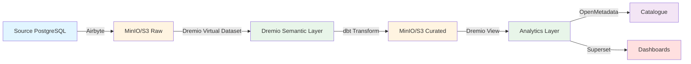

# 🏗️ Architecture

Documentation de l'architecture de la plateforme Data Platform v3.3.1

## 📑 Table des Matières

- [Vue d'Ensemble](#vue-densemble)
- [Composants Principaux](#composants-principaux)
- [Flux de Données](#flux-de-données)
- [Architecture de Déploiement](#architecture-de-déploiement)
- [Ports et Services](#ports-et-services)
- [Diagrammes](#diagrammes)

---

## 🎯 Vue d'Ensemble

La plateforme Data Platform est une solution open-source complète pour :

- **Ingestion** : Airbyte pour connecter 300+ sources de données
- **Stockage** : Dremio comme data lakehouse avec MinIO (S3)
- **Transformation** : dbt pour la modélisation et les transformations SQL
- **Catalogage** : OpenMetadata pour la gouvernance et le lineage
- **Visualisation** : Superset pour les dashboards et analyses
- **Orchestration** : Dagster pour les workflows et pipelines

```
┌─────────────────────────────────────────────────────────────────┐
│                        DATA PLATFORM v3.3.1                      │
└─────────────────────────────────────────────────────────────────┘

   Sources                Ingestion         Lakehouse         Transformation
┌──────────┐           ┌──────────┐      ┌──────────┐       ┌──────────┐
│PostgreSQL│           │          │      │          │       │          │
│  MySQL   │──────────▶│ Airbyte  │─────▶│  Dremio  │◀─────▶│   dbt    │
│  S3/CSV  │           │          │      │  +MinIO  │       │          │
└──────────┘           └──────────┘      └──────────┘       └──────────┘
                            │                  │                  │
                            │                  ▼                  │
                            │            ┌──────────┐             │
                            │            │OpenMeta  │◀────────────┘
                            │            │  data    │
                            │            └──────────┘
                            │                  │
                            ▼                  ▼
                       ┌──────────┐      ┌──────────┐
                       │ Dagster  │      │ Superset │
                       │Orchestr. │      │Dashboards│
                       └──────────┘      └──────────┘
```

---

## 🔧 Composants Principaux

### 1. **Airbyte** (Ingestion de Données)

**Rôle** : Connecteur universel pour synchroniser les données depuis 300+ sources

**Caractéristiques** :
- Connecteurs pré-construits (PostgreSQL, MySQL, S3, APIs REST...)
- Synchronisation incrémentale et full refresh
- CDC (Change Data Capture) pour temps réel
- Transformation légère avec dbt integration

**Endpoints** :
- UI : http://localhost:8000
- API : http://localhost:8000/api/v1

**Volumes** :
- Config : `/airbyte/config`
- Data : `/airbyte/data`

### 2. **Dremio** (Data Lakehouse)

**Rôle** : Couche de requête SQL unifiée sur les données (lakehouse)

**Caractéristiques** :
- Requêtes SQL ANSI sur S3/MinIO sans ETL
- Réflexions (index columnar) pour performances
- Virtual datasets et vues matérialisées
- Connectivité JDBC/ODBC/Arrow Flight

**Endpoints** :
- UI : http://localhost:9047
- ODBC/JDBC : localhost:31010
- Arrow Flight : localhost:32010

**Volumes** :
- Data : `/dremio/data`
- Logs : `/dremio/logs`

### 3. **MinIO** (Stockage S3)

**Rôle** : Stockage objet compatible S3 pour le data lake

**Caractéristiques** :
- Compatible Amazon S3 API
- Haute performance et scalabilité
- Versioning et encryption
- Multi-tenancy

**Endpoints** :
- API : http://localhost:9000
- Console : http://localhost:9001

**Buckets** :
- `dremio-data` : Données Dremio
- `airbyte-storage` : Staging Airbyte
- `dbt-artifacts` : Artefacts dbt

### 4. **dbt** (Transformations)

**Rôle** : Framework de transformation SQL et modélisation

**Caractéristiques** :
- Transformations SQL avec Jinja templating
- Tests automatisés sur les données
- Documentation auto-générée
- Lineage des transformations

**Intégration** :
- Connecté à Dremio via ODBC
- Artefacts stockés dans MinIO
- Orchestré par Dagster
- Métadonnées dans OpenMetadata

### 5. **OpenMetadata** (Catalogage)

**Rôle** : Catalogue de données et gouvernance

**Caractéristiques** :
- Catalogue centralisé des assets
- Data lineage automatique
- Data quality et profiling
- Gestion des glossaires et tags

**Endpoints** :
- UI : http://localhost:8585
- API : http://localhost:8585/api

**Base de données** :
- MySQL : localhost:3306 (`openmetadata_db`)

### 6. **Superset** (Visualisation)

**Rôle** : Plateforme BI et dashboards

**Caractéristiques** :
- Dashboards interactifs
- SQL Lab pour requêtes ad-hoc
- 40+ types de visualisations
- Scheduling et alertes

**Endpoints** :
- UI : http://localhost:8088
- API : http://localhost:8088/api/v1

### 7. **Dagster** (Orchestration)

**Rôle** : Orchestrateur de pipelines et workflows

**Caractéristiques** :
- Pipelines as code (Python)
- Observabilité complète
- Scheduling et retry logic
- Asset-based orchestration

**Endpoints** :
- UI : http://localhost:3000
- GraphQL : http://localhost:3000/graphql

---

## 📊 Flux de Données

### Pipeline Standard



### Phases Détaillées

#### Phase 1 : Ingestion (Airbyte)
1. Connexion à la source (PostgreSQL, MySQL, API...)
2. Extraction des données (full ou incrémental)
3. Staging dans MinIO (`raw/` prefix)
4. Logging et monitoring

#### Phase 2 : Catalogage Brut (Dremio)
1. Création source S3/MinIO dans Dremio
2. Promotion en dataset
3. Création de réflexions pour performance
4. Exposition via SQL endpoint

#### Phase 3 : Transformation (dbt)
1. Lecture depuis Dremio (source)
2. Transformations SQL avec tests
3. Écriture dans MinIO (`curated/` prefix)
4. Génération de documentation et lineage

#### Phase 4 : Catalogage Final (OpenMetadata)
1. Ingestion des métadonnées Dremio
2. Ingestion du lineage dbt
3. Profiling des données
4. Publication dans le catalogue

#### Phase 5 : Visualisation (Superset)
1. Connexion à Dremio (JDBC)
2. Création de datasets
3. Construction de graphiques
4. Assembly des dashboards

#### Phase 6 : Orchestration (Dagster)
1. Définition des assets et jobs
2. Scheduling des runs
3. Monitoring et alertes
4. Gestion des failures/retries

---

## 🚀 Architecture de Déploiement

### Environnement Local (Development)

```
┌─────────────────────────────────────────────────────┐
│                    Docker Host                       │
│                                                       │
│  ┌────────────┐  ┌────────────┐  ┌────────────┐   │
│  │  Airbyte   │  │   Dremio   │  │   MinIO    │   │
│  │  :8000     │  │   :9047    │  │   :9000    │   │
│  └────────────┘  └────────────┘  └────────────┘   │
│                                                       │
│  ┌────────────┐  ┌────────────┐  ┌────────────┐   │
│  │OpenMetadata│  │  Superset  │  │  Dagster   │   │
│  │  :8585     │  │   :8088    │  │   :3000    │   │
│  └────────────┘  └────────────┘  └────────────┘   │
│                                                       │
│  ┌────────────┐  ┌────────────┐                    │
│  │  MySQL     │  │ PostgreSQL │                    │
│  │  :3306     │  │   :5432    │                    │
│  └────────────┘  └────────────┘                    │
│                                                       │
└─────────────────────────────────────────────────────┘
```

**Commande de démarrage** :
```bash
docker-compose up -d
```

### Environnement Production (Kubernetes)

```
┌─────────────────────────────────────────────────────┐
│              Kubernetes Cluster (AKS/EKS/GKE)        │
│                                                       │
│  Namespace: data-platform                            │
│                                                       │
│  ┌──────────────────────────────────────────────┐  │
│  │  Ingress Controller (NGINX)                   │  │
│  │  *.dataplatform.example.com                   │  │
│  └────────────┬─────────────────────────────────┘  │
│               │                                      │
│     ┌─────────┼─────────┬─────────┬────────────┐  │
│     │         │         │         │            │  │
│  ┌──▼──┐  ┌──▼──┐  ┌──▼──┐  ┌──▼──┐  ┌─────▼┐ │
│  │Airbyte│  │Dremio│  │OM   │  │Super│  │Dagstr│ │
│  │ Pod   │  │ Pod │  │ Pod │  │ Pod │  │ Pod  │ │
│  │(x2)   │  │(x3) │  │(x2) │  │(x2) │  │(x2)  │ │
│  └───┬───┘  └───┬─┘  └───┬─┘  └───┬─┘  └───┬──┘ │
│      │          │        │        │        │     │
│  ┌───▼──────────▼────────▼────────▼────────▼──┐ │
│  │         Cloud Storage (S3/Azure Blob)       │ │
│  └─────────────────────────────────────────────┘ │
│                                                    │
│  ┌─────────────────────────────────────────────┐ │
│  │  Managed Database (RDS/Cloud SQL)            │ │
│  │  - MySQL (OpenMetadata)                      │ │
│  │  - PostgreSQL (Airbyte/Superset/Dagster)    │ │
│  └─────────────────────────────────────────────┘ │
│                                                    │
└────────────────────────────────────────────────────┘
```

**Features Production** :
- ✅ High Availability (multiple replicas)
- ✅ Load Balancing (Ingress)
- ✅ Auto-scaling (HPA)
- ✅ Persistent Volumes (PVC)
- ✅ Secrets Management (Vault/KMS)
- ✅ Monitoring (Prometheus/Grafana)
- ✅ Logging (ELK/Loki)

---

## 🔌 Ports et Services

### Tableau Récapitulatif

| Service | Port(s) | Protocole | Description |
|---------|---------|-----------|-------------|
| **Airbyte** | | | |
| - UI/API | 8000 | HTTP | Interface web et API REST |
| - Temporal | 7233 | gRPC | Workflow engine |
| **Dremio** | | | |
| - UI | 9047 | HTTP | Interface web |
| - JDBC/ODBC | 31010 | JDBC | Connexions clients SQL |
| - Arrow Flight | 32010 | gRPC | API haute performance |
| - Zookeeper | 2181 | TCP | Coordination |
| **MinIO** | | | |
| - API | 9000 | HTTP | S3-compatible API |
| - Console | 9001 | HTTP | Interface web admin |
| **OpenMetadata** | | | |
| - UI/API | 8585 | HTTP | Interface et API REST |
| - MySQL | 3306 | TCP | Base de données |
| **Superset** | | | |
| - UI/API | 8088 | HTTP | Interface et API REST |
| - PostgreSQL | 5432 | TCP | Base de données |
| **Dagster** | | | |
| - UI | 3000 | HTTP | Interface Dagit |
| - gRPC | 4000 | gRPC | Code locations |
| - PostgreSQL | 5432 | TCP | Base de données |

### Configuration Docker Compose

```yaml
services:
  airbyte:
    ports:
      - "8000:8000"    # UI/API
      
  dremio:
    ports:
      - "9047:9047"    # UI
      - "31010:31010"  # JDBC
      - "32010:32010"  # Arrow Flight
      
  minio:
    ports:
      - "9000:9000"    # API
      - "9001:9001"    # Console
      
  openmetadata:
    ports:
      - "8585:8585"    # UI/API
      
  superset:
    ports:
      - "8088:8088"    # UI/API
      
  dagster:
    ports:
      - "3000:3000"    # Dagit UI
      - "4000:4000"    # gRPC
```

---

## 📈 Diagrammes

Les diagrammes détaillés sont disponibles dans [../diagrams/](../diagrams/) :

- **[architecture.mmd](../diagrams/architecture.mmd)** - Architecture globale
- **[architecture-with-airbyte.mmd](../diagrams/architecture-with-airbyte.mmd)** - Architecture complète avec Airbyte
- **[data-flow.mmd](../diagrams/data-flow.mmd)** - Flux de données détaillé
- **[deployment.mmd](../diagrams/deployment.mmd)** - Architecture de déploiement
- **[user-journey.mmd](../diagrams/user-journey.mmd)** - Parcours utilisateur
- **[airbyte-workflow.mmd](../diagrams/airbyte-workflow.mmd)** - Workflow Airbyte

### Visualiser les Diagrammes

Les fichiers `.mmd` (Mermaid) peuvent être visualisés avec :
- Extension VS Code : Mermaid Preview
- En ligne : [Mermaid Live Editor](https://mermaid.live/)
- Dans la documentation générée

---

## 🔐 Sécurité

### Authentification

| Service | Méthode | Default Credentials |
|---------|---------|---------------------|
| Dremio | Username/Password | admin / admin123 |
| MinIO | Access Key/Secret | minioadmin / minioadmin |
| Superset | Username/Password | admin / admin |
| OpenMetadata | JWT Token | Bot token required |

### Network Security

- **Isolation** : Tous les services dans le même réseau Docker `data-platform-network`
- **Exposition** : Seuls les ports UI/API exposés sur localhost
- **Production** : Utiliser un reverse proxy (Traefik/NGINX) avec TLS

### Secrets Management

```bash
# Fichier .env (à ne pas committer)
DREMIO_PASSWORD=<strong-password>
MINIO_ROOT_PASSWORD=<strong-password>
SUPERSET_SECRET_KEY=<random-secret>
OPENMETADATA_JWT_TOKEN=<jwt-token>
POSTGRES_PASSWORD=<strong-password>
```

---

## 📊 Monitoring & Observabilité

### Métriques Clés

- **Airbyte** : Jobs success rate, sync duration, records synced
- **Dremio** : Query performance, reflection hits, memory usage
- **dbt** : Model success rate, test failures, run duration
- **OpenMetadata** : Ingestion pipelines status, data quality scores
- **Superset** : Dashboard load time, query performance

### Health Checks

```bash
# Vérifier l'état de tous les services
docker-compose ps

# Health checks individuels
curl http://localhost:8000/api/v1/health  # Airbyte
curl http://localhost:9047/apiv2/login    # Dremio (auth required)
curl http://localhost:9000/minio/health/live  # MinIO
curl http://localhost:8585/api/v1/system/status  # OpenMetadata
curl http://localhost:8088/health         # Superset
```

---

## 📚 Ressources Additionnelles

- **Guide technique** : [../guides/TECHNICAL_DOCUMENTATION.md](../guides/TECHNICAL_DOCUMENTATION.md)
- **APIs** : [../api/README.md](../api/README.md)
- **Guide de déploiement** : Voir `/docker-compose.*.yaml`
- **Développement** : [../development/README.md](../development/README.md)

---

**[← Retour à la documentation](../README.md)**
