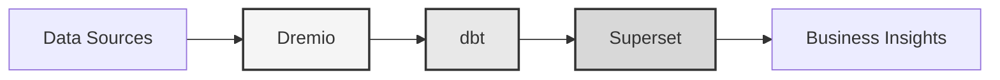

# منصة البيانات

**حل مستودع البيانات للمؤسسات**

**Language**: العربية (AR)  
**Version**: 3.2.5  
**Last Updated**: 2025-10-15

---

## نظرة عامة

منصة بيانات احترافية تجمع بين Dremio و dbt و Apache Superset لتحويل البيانات وضمان الجودة وذكاء الأعمال على مستوى المؤسسات.

توفر هذه المنصة حلاً شاملاً لهندسة البيانات الحديثة، بما في ذلك خطوط أنابيب البيانات الآلية واختبارات الجودة ولوحات المعلومات التفاعلية.



---

## الميزات الرئيسية

- بنية مستودع البيانات مع Dremio
- التحويلات الآلية مع dbt
- ذكاء الأعمال مع Apache Superset
- اختبارات شاملة لجودة البيانات
- المزامنة في الوقت الفعلي عبر Arrow Flight

---

## دليل البدء السريع

### المتطلبات الأساسية

- Docker 20.10 أو أعلى
- Docker Compose 2.0 أو أعلى
- Python 3.11 أو أعلى
- الحد الأدنى 8 جيجابايت من الذاكرة

### التثبيت

```bash
# Install dependencies
pip install -r requirements.txt

# Start services
make up

# Verify installation
make status

# Run quality tests
make dbt-test
```

---

## البنية المعمارية

### مكونات النظام

| المكون | المنفذ | الوصف |
|-----------|------|-------------|
| Dremio | 9047, 31010, 32010 | منصة بحيرة البيانات |
| dbt | - | أداة تحويل البيانات |
| Superset | 8088 | Business intelligence platform |
| PostgreSQL | 5432 | Transactional database |
| MinIO | 9000, 9001 | Object storage (S3-compatible) |
| Elasticsearch | 9200 | Search and analytics engine |

### 📚 وثائق البنية المعمارية

- 📘 [وثائق البنية المعمارية](architecture/) - تصميم النظام التفصيلي
- 🎯 [الدليل المرئي لمنافذ Dremio](architecture/dremio-ports-visual.md) ⭐ **جديد** - دليل مرئي كامل لمنافذ Dremio الثلاثة

---

## التوثيق

### البدء
- [Installation Guide](getting-started/)
- [Configuration](getting-started/)
- [First Steps](getting-started/)

### أدلة المستخدم
- [Data Engineering](guides/)
- [Dashboard Creation](guides/)
- [API Integration](guides/)

### توثيق API
- [REST API Reference](api/)
- [Authentication](api/)
- [Code Examples](api/)

### توثيق البنية المعمارية
- [System Design](architecture/)
- [Data Flow](architecture/)
- [Deployment Guide](architecture/)

---

## اللغات المتاحة

| Language | Code | Documentation |
|----------|------|---------------|
| English | EN | [README.md](../../../README.md) |
| Français | FR | [docs/i18n/fr/](../fr/README.md) |
| Español | ES | [docs/i18n/es/](../es/README.md) |
| Português | PT | [docs/i18n/pt/](../pt/README.md) |
| العربية | AR | [docs/i18n/ar/](../ar/README.md) |
| 中文 | CN | [docs/i18n/cn/](../cn/README.md) |
| 日本語 | JP | [docs/i18n/jp/](../jp/README.md) |
| Русский | RU | [docs/i18n/ru/](../ru/README.md) |

---

## الدعم

For technical assistance:
- Documentation: [Main README](../../../README.md)
- Issue Tracking: GitHub Issues
- Community Forum: GitHub Discussions
- Email: support@example.com

---

**[العودة إلى التوثيق الرئيسي](../../../README.md)**
