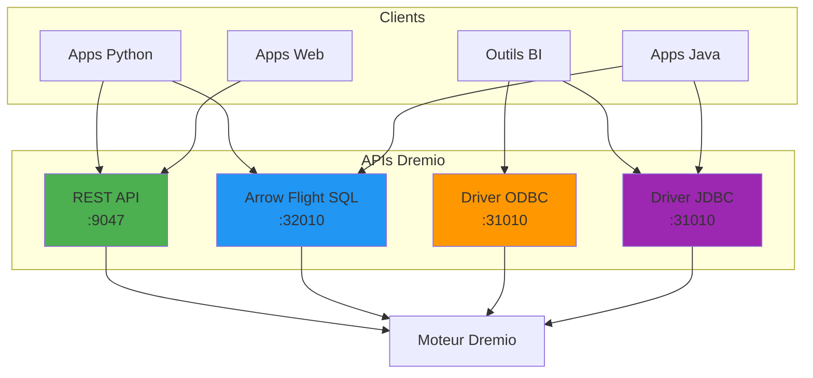

# مرجع واجهة برمجة تطبيقات Dremio

**الإصدار**: 3.2.0  
**آخر تحديث**: 16 أكتوبر 2025  
**اللغة**: الفرنسية

## جدول المحتويات

1. [نظرة عامة](#overview)
2. [المصادقة](#المصادقة)
3. [REST API](#api-rest)
4. [Arrow Flight SQL](#arrow-flight-sql)
5. [ODBC/JDBC](#odbcjdbc)
6. [عميل بايثون](#client-python)
7. [عميل جافا](#java-client)
8. [أمثلة واجهة برمجة التطبيقات](#dapi-examples)

---

## ملخص

يوفر Dremio العديد من واجهات برمجة التطبيقات (APIs) للتفاعل مع مخزن البيانات:

| نوع واجهة برمجة التطبيقات | حالات الاستخدام | ميناء | البروتوكول |
|------------|-------|------|----------|
| ريست API | الإدارة والبيانات الوصفية | 9047 | HTTP/HTTPS |
| سهم فلايت إس كيو إل | استعلامات عالية الأداء | 32010 | جي آر بي سي |
| أودبك | اتصال أداة ذكاء الأعمال | 31010 | أودبك |
| جي دي بي سي | تطبيقات جافا | 31010 | جي دي بي سي |

### بنية واجهة برمجة التطبيقات



---

## المصادقة

### إنشاء رمز المصادقة

**نقطة النهاية**: `POST /apiv2/login`

**طلب** :
```bash
curl -X POST http://localhost:9047/apiv2/login \
  -H "Content-Type: application/json" \
  -d '{
    "userName": "admin",
    "password": "your_password"
  }'
```

**إجابة** :
```json
{
  "token": "eyJhbGciOiJIUzI1NiIsInR5cCI6IkpXVCJ9...",
  "userName": "admin",
  "firstName": "Admin",
  "lastName": "User",
  "expires": 1729209600000
}
```

### استخدم الرمز المميز في الطلبات

```bash
# Set token as variable
TOKEN="eyJhbGciOiJIUzI1NiIsInR5cCI6IkpXVCJ9..."

# Use in subsequent requests
curl -X GET http://localhost:9047/apiv2/catalog \
  -H "Authorization: Bearer $TOKEN"
```

### انتهاء صلاحية الرمز المميز

تنتهي صلاحية الرموز المميزة بعد 24 ساعة بشكل افتراضي. التكوين في `dremio.conf`:

```conf
services.tokens.expiration: 86400000  # 24 hours in milliseconds
```

---

## واجهة برمجة تطبيقات REST

### عنوان URL الأساسي

```
http://localhost:9047/apiv2
```

### الرؤوس المشتركة

```bash
Authorization: Bearer <token>
Content-Type: application/json
```

### إدارة الكتالوج

#### قائمة عناصر الكتالوج

**نقطة النهاية**: `GET /catalog`

```bash
curl -X GET http://localhost:9047/apiv2/catalog \
  -H "Authorization: Bearer $TOKEN"
```

**إجابة** :
```json
{
  "data": [
    {
      "id": "dremio:/",
      "path": [],
      "tag": "root",
      "type": "CONTAINER",
      "children": [
        {
          "id": "source-id-123",
          "path": ["MinIO"],
          "tag": "source-tag-123",
          "type": "SOURCE"
        }
      ]
    }
  ]
}
```

#### احصل على عنصر الكتالوج حسب المسار

**نقطة النهاية**: `GET /catalog/by-path/{path}`

```bash
curl -X GET "http://localhost:9047/apiv2/catalog/by-path/MinIO/bronze/customers" \
  -H "Authorization: Bearer $TOKEN"
```

**إجابة** :
```json
{
  "id": "table-id-456",
  "path": ["MinIO", "bronze", "customers"],
  "tag": "table-tag-456",
  "type": "DATASET",
  "format": {
    "type": "Parquet"
  },
  "fields": [
    {
      "name": "customer_id",
      "type": "INTEGER"
    },
    {
      "name": "name",
      "type": "VARCHAR"
    }
  ]
}
```

### مجموعات البيانات الافتراضية (VDS)

#### إنشاء مجموعة بيانات افتراضية

**نقطة النهاية**: `POST /catalog`

```bash
curl -X POST http://localhost:9047/apiv2/catalog \
  -H "Authorization: Bearer $TOKEN" \
  -H "Content-Type: application/json" \
  -d '{
    "entityType": "dataset",
    "path": ["Production", "Dimensions", "dim_customers"],
    "type": "VIRTUAL_DATASET",
    "sql": "SELECT customer_id, name, email FROM MinIO.bronze.customers WHERE active = true",
    "sqlContext": ["MinIO"]
  }'
```

**إجابة** :
```json
{
  "id": "vds-id-789",
  "path": ["Production", "Dimensions", "dim_customers"],
  "tag": "vds-tag-789",
  "type": "VIRTUAL_DATASET"
}
```

#### تحديث مجموعة بيانات افتراضية

**نقطة النهاية**: `PUT /catalog/{id}`

```bash
curl -X PUT "http://localhost:9047/apiv2/catalog/vds-id-789" \
  -H "Authorization: Bearer $TOKEN" \
  -H "Content-Type: application/json" \
  -d '{
    "path": ["Production", "Dimensions", "dim_customers"],
    "type": "VIRTUAL_DATASET",
    "sql": "SELECT customer_id, UPPER(name) as name, email FROM MinIO.bronze.customers WHERE active = true",
    "tag": "vds-tag-789"
  }'
```

#### حذف مجموعة بيانات

**نقطة النهاية**: `DELETE /catalog/{id}?tag={tag}`

```bash
curl -X DELETE "http://localhost:9047/apiv2/catalog/vds-id-789?tag=vds-tag-789" \
  -H "Authorization: Bearer $TOKEN"
```

### تنفيذ SQL

#### تنفيذ استعلام SQL

**نقطة النهاية**: `POST /sql`

```bash
curl -X POST http://localhost:9047/apiv2/sql \
  -H "Authorization: Bearer $TOKEN" \
  -H "Content-Type: application/json" \
  -d '{
    "sql": "SELECT * FROM Production.Dimensions.dim_customers LIMIT 10"
  }'
```

**إجابة** :
```json
{
  "id": "job-id-abc123",
  "state": "COMPLETED",
  "rowCount": 10,
  "rows": [
    {
      "customer_id": 1,
      "name": "John Doe",
      "email": "john@example.com"
    }
  ]
}
```

### إدارة الوظائف

#### احصل على حالة الوظيفة

**نقطة النهاية**: `GET /job/{jobId}`

```bash
curl -X GET "http://localhost:9047/apiv2/job/job-id-abc123" \
  -H "Authorization: Bearer $TOKEN"
```

**إجابة** :
```json
{
  "id": "job-id-abc123",
  "state": "COMPLETED",
  "user": "admin",
  "startTime": 1729108800000,
  "endTime": 1729108805000,
  "queryType": "UI_RUN",
  "sql": "SELECT * FROM ...",
  "datasetVersion": "1",
  "outputRecords": 10,
  "outputBytes": 1024,
  "accelerationDetails": {
    "accelerated": true,
    "reflectionIds": ["reflection-id-123"]
  }
}
```

#### قائمة الوظائف الأخيرة

**نقطة النهاية**: `GET /jobs`

```bash
curl -X GET "http://localhost:9047/apiv2/jobs?limit=20&sort=startTime&order=desc" \
  -H "Authorization: Bearer $TOKEN"
```

#### إلغاء الوظيفة

**نقطة النهاية**: `POST /job/{jobId}/cancel`

```bash
curl -X POST "http://localhost:9047/apiv2/job/job-id-abc123/cancel" \
  -H "Authorization: Bearer $TOKEN"
```

###تأملات

#### قائمة التأملات

**نقطة النهاية**: `GET /reflections`

```bash
curl -X GET http://localhost:9047/apiv2/reflections \
  -H "Authorization: Bearer $TOKEN"
```

**إجابة** :
```json
{
  "data": [
    {
      "id": "reflection-id-123",
      "name": "raw_customers",
      "type": "RAW",
      "datasetId": "vds-id-789",
      "status": {
        "status": "ACTIVE",
        "lastRefreshTime": 1729108800000
      }
    }
  ]
}
```

#### إنشاء انعكاس

**نقطة النهاية**: `POST /reflections`

```bash
curl -X POST http://localhost:9047/apiv2/reflections \
  -H "Authorization: Bearer $TOKEN" \
  -H "Content-Type: application/json" \
  -d '{
    "name": "agg_daily_revenue",
    "type": "AGGREGATION",
    "datasetId": "vds-id-789",
    "dimensions": [
      {"name": "order_date"}
    ],
    "measures": [
      {"name": "amount", "measureType": ["SUM", "COUNT"]}
    ]
  }'
```

### إدارة المصدر

#### أضف مصدر S3

**نقطة النهاية**: `PUT /source/{name}`

```bash
curl -X PUT "http://localhost:9047/apiv2/source/MinIO" \
  -H "Authorization: Bearer $TOKEN" \
  -H "Content-Type: application/json" \
  -d '{
    "name": "MinIO",
    "type": "S3",
    "config": {
      "credentialType": "ACCESS_KEY",
      "accessKey": "minioadmin",
      "accessSecret": "minioadmin",
      "secure": false,
      "externalBucketList": ["datalake"],
      "enableAsync": true,
      "propertyList": [
        {
          "name": "fs.s3a.endpoint",
          "value": "minio:9000"
        },
        {
          "name": "fs.s3a.path.style.access",
          "value": "true"
        }
      ]
    }
  }'
```

#### تحديث البيانات الوصفية المصدر

**نقطة النهاية**: `POST /source/{name}/refresh`

```bash
curl -X POST "http://localhost:9047/apiv2/source/MinIO/refresh" \
  -H "Authorization: Bearer $TOKEN"
```

---

## سهم الطيران SQL

يوفر Arrow Flight SQL تنفيذ استعلام عالي الأداء (20-50x أسرع من ODBC/JDBC).

### عميل بايثون مع PyArrow

#### منشأة

```bash
pip install pyarrow
```

#### الاتصال والاستعلام

```python
from pyarrow import flight
import pyarrow

# Create Flight client
location = flight.Location.for_grpc_tcp("localhost", 32010)
client = flight.FlightClient(location)

# Authenticate
token_pair = client.authenticate_basic_token(b"admin", b"password")
options = flight.FlightCallOptions(headers=[token_pair])

# Execute query
query = "SELECT * FROM Production.Dimensions.dim_customers LIMIT 10"
flight_info = client.get_flight_info(
    flight.FlightDescriptor.for_command(query.encode('utf-8')),
    options
)

# Read results
reader = client.do_get(flight_info.endpoints[0].ticket, options)
table = reader.read_all()

# Convert to pandas
df = table.to_pandas()
print(df)
```

#### مثال: استعلام باستخدام المعلمات

```python
def query_customers_by_status(status):
    """Query customers filtered by status"""
    query = f"""
        SELECT customer_id, name, email, lifetime_value
        FROM Production.Dimensions.dim_customers
        WHERE status = '{status}'
        ORDER BY lifetime_value DESC
    """
    
    flight_info = client.get_flight_info(
        flight.FlightDescriptor.for_command(query.encode('utf-8')),
        options
    )
    
    reader = client.do_get(flight_info.endpoints[0].ticket, options)
    return reader.read_all().to_pandas()

# Use function
active_customers = query_customers_by_status('active')
print(f"Found {len(active_customers)} active customers")
```

#### معالجة الدفعات

```python
def process_large_query(query, batch_size=10000):
    """Process large queries in batches"""
    flight_info = client.get_flight_info(
        flight.FlightDescriptor.for_command(query.encode('utf-8')),
        options
    )
    
    reader = client.do_get(flight_info.endpoints[0].ticket, options)
    
    for batch in reader:
        # Process each batch
        df = batch.data.to_pandas()
        print(f"Processing batch of {len(df)} rows")
        
        # Your processing logic here
        process_batch(df)

# Example usage
query = "SELECT * FROM Production.Facts.fct_orders WHERE order_date >= '2025-01-01'"
process_large_query(query)
```

### مقارنة الأداء

```python
import time

def benchmark_query(query):
    """Compare REST API vs Arrow Flight performance"""
    
    # Test Arrow Flight
    start = time.time()
    flight_info = client.get_flight_info(
        flight.FlightDescriptor.for_command(query.encode('utf-8')),
        options
    )
    reader = client.do_get(flight_info.endpoints[0].ticket, options)
    table = reader.read_all()
    flight_time = time.time() - start
    
    print(f"Arrow Flight: {flight_time:.2f}s for {len(table)} rows")
    print(f"Throughput: {len(table) / flight_time:.0f} rows/sec")

# Test with large query
query = """
    SELECT *
    FROM Production.Facts.fct_orders
    WHERE order_date >= '2024-01-01'
"""
benchmark_query(query)

# Typical results:
# Arrow Flight: 2.5s for 1,000,000 rows (400,000 rows/sec)
# REST API: 45s for 1,000,000 rows (22,000 rows/sec)
# Speedup: 18x faster
```

---

## أودبك/جدبك

### اتصال ODBC

#### إعداد ويندوز

1. ** تنزيل برنامج تشغيل ODBC **:
   ```
   https://download.dremio.com/odbc-driver/dremio-odbc-1.4.0.1041.msi
   ```

2. **تكوين DSN**:
   ```
   Host: localhost
   Port: 31010
   Authentication Type: Plain
   UID: admin
   PWD: your_password
   ```

3. **سلسلة الاتصال**:
   ```
   DRIVER={Dremio ODBC Driver 64-bit};
   HOST=localhost;
   PORT=31010;
   UID=admin;
   PWD=your_password;
   AuthenticationType=Plain
   ```

#### إعداد لينكس

```bash
# Install driver
tar -xzvf dremio-odbc-1.4.0.1041-1.x86_64.tar.gz
cd dremio-odbc-1.4.0.1041

# Configure odbcinst.ini
cat >> /etc/odbcinst.ini << EOF
[Dremio ODBC Driver 64-bit]
Description=Dremio ODBC Driver 64-bit
Driver=/opt/dremio-odbc/lib64/libdrillodbc_sb64.so
EOF

# Configure odbc.ini
cat >> ~/.odbc.ini << EOF
[Dremio]
Driver=Dremio ODBC Driver 64-bit
HOST=localhost
PORT=31010
UID=admin
PWD=your_password
AuthenticationType=Plain
EOF
```

### اتصال JDBC

#### تنزيل برنامج التشغيل

```bash
wget https://download.dremio.com/jdbc-driver/dremio-jdbc-driver-26.0.0.jar
```

#### سلسلة الاتصال

```java
String url = "jdbc:dremio:direct=localhost:31010";
String username = "admin";
String password = "your_password";

Connection conn = DriverManager.getConnection(url, username, password);
```

#### ملكيات

```properties
jdbc:dremio:direct=localhost:31010;
schema=Production;
authentication=PLAIN;
useEncryption=false
```

---

## عميل بايثون

### المثال الكامل

```python
import pyarrow.flight as flight
import pandas as pd
from typing import Optional

class DremioClient:
    """Dremio client using Arrow Flight SQL"""
    
    def __init__(self, host: str = "localhost", port: int = 32010,
                 username: str = "admin", password: str = "password"):
        """Initialize Dremio client"""
        self.location = flight.Location.for_grpc_tcp(host, port)
        self.client = flight.FlightClient(self.location)
        
        # Authenticate
        token_pair = self.client.authenticate_basic_token(
            username.encode('utf-8'),
            password.encode('utf-8')
        )
        self.options = flight.FlightCallOptions(headers=[token_pair])
    
    def query(self, sql: str) -> pd.DataFrame:
        """Execute SQL query and return pandas DataFrame"""
        flight_info = self.client.get_flight_info(
            flight.FlightDescriptor.for_command(sql.encode('utf-8')),
            self.options
        )
        
        reader = self.client.do_get(flight_info.endpoints[0].ticket, self.options)
        table = reader.read_all()
        
        return table.to_pandas()
    
    def query_stream(self, sql: str):
        """Execute query and yield batches"""
        flight_info = self.client.get_flight_info(
            flight.FlightDescriptor.for_command(sql.encode('utf-8')),
            self.options
        )
        
        reader = self.client.do_get(flight_info.endpoints[0].ticket, self.options)
        
        for batch in reader:
            yield batch.data.to_pandas()
    
    def execute(self, sql: str) -> bool:
        """Execute SQL command (CREATE, DROP, etc.)"""
        try:
            self.query(sql)
            return True
        except Exception as e:
            print(f"Error: {e}")
            return False

# Usage example
if __name__ == "__main__":
    # Connect to Dremio
    dremio = DremioClient()
    
    # Simple query
    df = dremio.query("SELECT * FROM Production.Dimensions.dim_customers LIMIT 10")
    print(df)
    
    # Aggregation query
    revenue = dremio.query("""
        SELECT 
            DATE_TRUNC('month', order_date) as month,
            SUM(amount) as total_revenue,
            COUNT(*) as order_count
        FROM Production.Facts.fct_orders
        WHERE order_date >= '2025-01-01'
        GROUP BY 1
        ORDER BY 1
    """)
    print(revenue)
    
    # Stream large results
    for batch in dremio.query_stream("SELECT * FROM large_table"):
        print(f"Processing batch of {len(batch)} rows")
        # Process batch
```

---

## عميل جافا

### تبعية مافن

```xml
<dependency>
    <groupId>com.dremio.distribution</groupId>
    <artifactId>dremio-jdbc-driver</artifactId>
    <version>26.0.0</version>
</dependency>
```

### المثال الكامل

```java
import java.sql.*;

public class DremioJDBCExample {
    
    private static final String URL = "jdbc:dremio:direct=localhost:31010";
    private static final String USERNAME = "admin";
    private static final String PASSWORD = "your_password";
    
    public static void main(String[] args) {
        try (Connection conn = DriverManager.getConnection(URL, USERNAME, PASSWORD)) {
            
            // Simple query
            simpleQuery(conn);
            
            // Parameterized query
            parameterizedQuery(conn, "2025-01-01");
            
            // Batch insert (if writing enabled)
            // batchInsert(conn);
            
        } catch (SQLException e) {
            e.printStackTrace();
        }
    }
    
    private static void simpleQuery(Connection conn) throws SQLException {
        String sql = "SELECT * FROM Production.Dimensions.dim_customers LIMIT 10";
        
        try (Statement stmt = conn.createStatement();
             ResultSet rs = stmt.executeQuery(sql)) {
            
            while (rs.next()) {
                int id = rs.getInt("customer_id");
                String name = rs.getString("name");
                String email = rs.getString("email");
                
                System.out.printf("Customer: %d, %s, %s%n", id, name, email);
            }
        }
    }
    
    private static void parameterizedQuery(Connection conn, String startDate) 
            throws SQLException {
        String sql = """
            SELECT 
                DATE_TRUNC('month', order_date) as month,
                SUM(amount) as total_revenue,
                COUNT(*) as order_count
            FROM Production.Facts.fct_orders
            WHERE order_date >= ?
            GROUP BY 1
            ORDER BY 1
        """;
        
        try (PreparedStatement pstmt = conn.prepareStatement(sql)) {
            pstmt.setString(1, startDate);
            
            try (ResultSet rs = pstmt.executeQuery()) {
                while (rs.next()) {
                    Date month = rs.getDate("month");
                    double revenue = rs.getDouble("total_revenue");
                    int orders = rs.getInt("order_count");
                    
                    System.out.printf("%s: $%.2f (%d orders)%n", 
                                    month, revenue, orders);
                }
            }
        }
    }
}
```

---

## أمثلة لواجهة برمجة التطبيقات

### مثال 1: إعداد التقارير الآلية

```python
#!/usr/bin/env python3
"""
Daily sales report generation
"""
from datetime import datetime, timedelta
import pandas as pd

def generate_daily_sales_report():
    """Generate and email daily sales report"""
    dremio = DremioClient()
    
    # Query yesterday's sales
    yesterday = (datetime.now() - timedelta(days=1)).strftime('%Y-%m-%d')
    
    query = f"""
        SELECT 
            p.category,
            COUNT(DISTINCT o.customer_id) as unique_customers,
            COUNT(*) as order_count,
            SUM(o.amount) as total_revenue,
            AVG(o.amount) as avg_order_value
        FROM Production.Facts.fct_orders o
        JOIN Production.Dimensions.dim_products p ON o.product_id = p.product_id
        WHERE o.order_date = '{yesterday}'
        GROUP BY 1
        ORDER BY total_revenue DESC
    """
    
    df = dremio.query(query)
    
    # Generate report
    report = f"""
    Daily Sales Report - {yesterday}
    ================================
    
    {df.to_string(index=False)}
    
    Total Revenue: ${df['total_revenue'].sum():,.2f}
    Total Orders: {df['order_count'].sum():,}
    Unique Customers: {df['unique_customers'].sum():,}
    """
    
    print(report)
    # Send email (not shown)

if __name__ == "__main__":
    generate_daily_sales_report()
```

### مثال 2: تصدير البيانات

```python
def export_to_csv(query: str, output_file: str):
    """Export query results to CSV"""
    dremio = DremioClient()
    
    # Stream results for large datasets
    with open(output_file, 'w') as f:
        first_batch = True
        
        for batch in dremio.query_stream(query):
            batch.to_csv(f, index=False, header=first_batch)
            first_batch = False
            
            print(f"Exported {len(batch)} rows")

# Usage
export_to_csv(
    "SELECT * FROM Production.Facts.fct_orders WHERE order_date >= '2025-01-01'",
    "orders_2025.csv"
)
```

### مثال 3: اكتشاف البيانات الوصفية

```python
import requests

def list_all_datasets(token: str):
    """List all datasets in Dremio catalog"""
    headers = {"Authorization": f"Bearer {token}"}
    
    response = requests.get(
        "http://localhost:9047/apiv2/catalog",
        headers=headers
    )
    
    catalog = response.json()
    
    def traverse(item, path=[]):
        """Recursively traverse catalog"""
        current_path = path + [item.get('path', [''])[0]]
        
        if item.get('type') == 'DATASET':
            print(f"Dataset: {'/'.join(current_path)}")
        
        for child in item.get('children', []):
            traverse(child, current_path)
    
    traverse(catalog['data'][0])

# Usage
token = get_auth_token("admin", "password")
list_all_datasets(token)
```

---

## ملخص

يغطي مرجع واجهة برمجة التطبيقات هذا:

- **المصادقة**: مصادقة قائمة على الرمز المميز باستخدام REST API
- **REST API**: الكتالوج، تنفيذ SQL، الوظائف، التأملات
- **Arrow Flight SQL**: استعلامات عالية الأداء (20-50x أسرع)
- **ODBC/JDBC**: اتصال أداة BI
- **عميل بايثون**: استكمال تنفيذ العميل
- **عميل Java**: أمثلة JDBC
- **أمثلة عملية**: إعداد التقارير، والتصدير، واكتشاف البيانات الوصفية

**الوجبات الرئيسية**:
- استخدم Arrow Flight SQL للوصول إلى البيانات عالية الأداء
- استخدم REST API للإدارة والأتمتة
- استخدم ODBC/JDBC لتكامل أدوات ذكاء الأعمال
- استخدم دائمًا رموز المصادقة
- معالجة الاستعلامات الكبيرة على دفعات للحصول على أداء أفضل

**الوثائق ذات الصلة:**
- [دليل إعداد Dremio](../guides/dremio-setup.md)
- [الهندسة المعمارية: تدفق البيانات](../architecture/data-flow.md)
- [دليل تطوير dbt](../guides/dbt-development.md)

---

**الإصدار**: 3.2.0  
**آخر تحديث**: 16 أكتوبر 2025