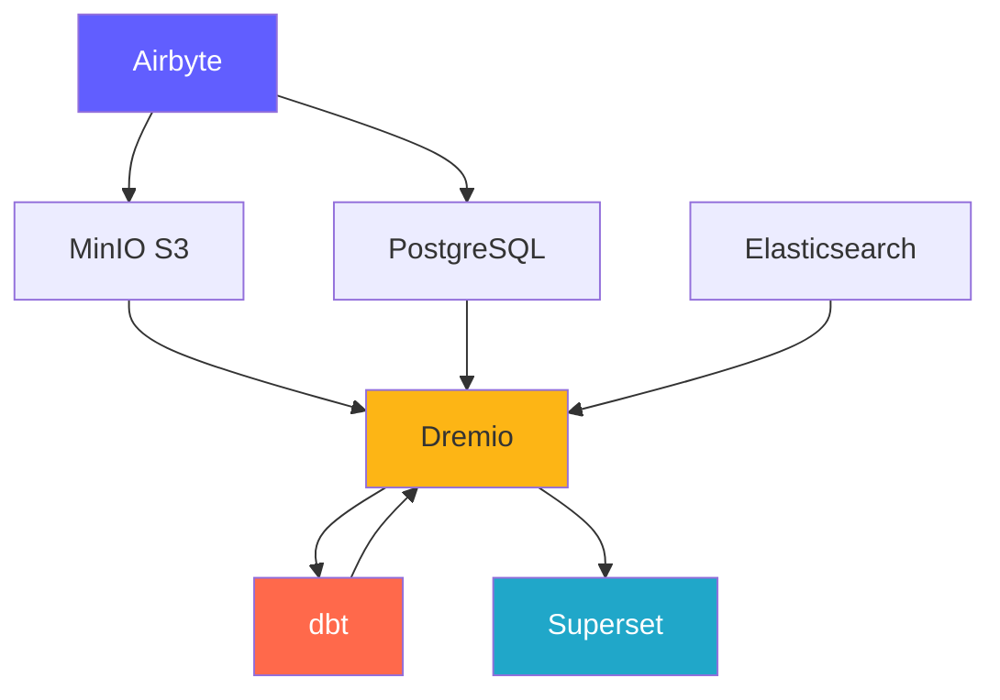
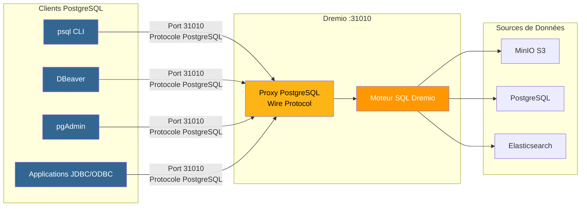
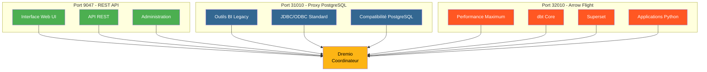
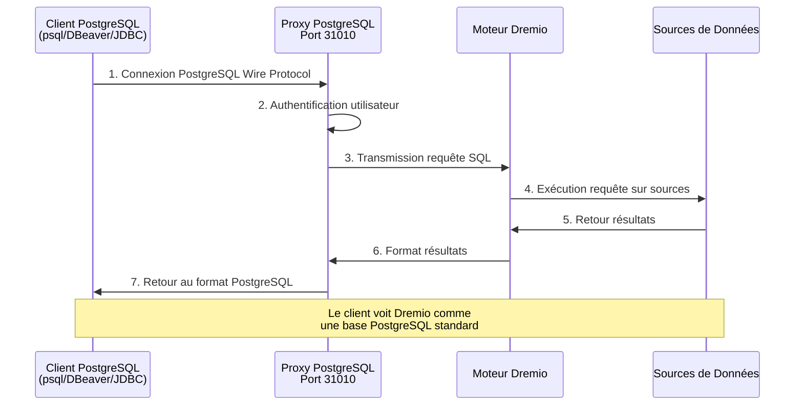
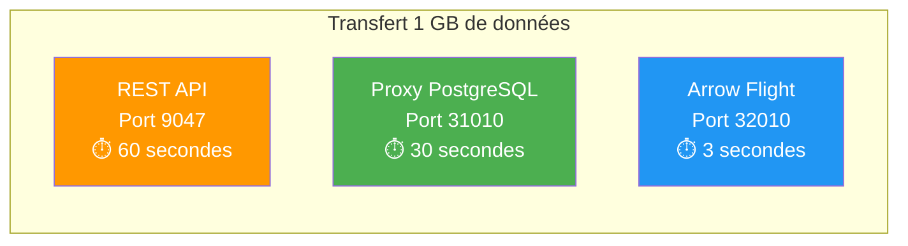

#مكونات المنصة

**الإصدار**: 3.2.0  
**آخر تحديث**: 16-10-2025  
**اللغة**: الفرنسية

---

## نظرة عامة على المكونات

تتكون منصة البيانات من 7 مكونات رئيسية تعمل معًا لتوفير حل كامل.



---

## 1. Airbyte – منصة تكامل البيانات

### ملخص

Airbyte هو محرك تكامل بيانات مفتوح المصدر يعمل على دمج البيانات من مصادر متعددة إلى الوجهات.

**الإصدار**: 0.50.33  
**الترخيص**: معهد ماساتشوستس للتكنولوجيا  
**الموقع الإلكتروني**: https://airbyte.com

### الميزات الرئيسية

- **300+ موصلات مسبقة الصنع**: قواعد البيانات وواجهات برمجة التطبيقات والملفات وتطبيقات SaaS
- ** تغيير التقاط البيانات (CDC) **: النسخ المتماثل للبيانات في الوقت الحقيقي
- **الموصلات المخصصة**: قم بالإنشاء باستخدام Python أو CDK منخفض التعليمات البرمجية
- **التطبيع**: تحويل JSON إلى جداول علائقية
- **التزامن التزايدي**: مزامنة البيانات الجديدة/المعدلة فقط
- **المراقبة**: مزامنة حالة التتبع المتكاملة

### بنيان

```yaml
Composants:
  airbyte-webapp:
    Port: 8000
    Objectif: Interface utilisateur web
    
  airbyte-server:
    Port: 8001
    Objectif: Serveur API REST
    
  airbyte-worker:
    Objectif: Exécuter tâches synchronisation
    Scalabilité: Horizontale
    
  airbyte-temporal:
    Port: 7233
    Objectif: Orchestration workflows
    
  airbyte-db:
    Port: 5432
    Objectif: Stockage métadonnées (PostgreSQL)
```

### حالة الاستخدام

- ** خطوط أنابيب ELT **: سير عمل الاستخراج والتحميل والتحويل
- **النسخ المتماثل لقاعدة البيانات**: حافظ على مزامنة قواعد البيانات
- **تكامل واجهة برمجة التطبيقات**: استخراج البيانات من واجهات برمجة تطبيقات REST
- ** استيعاب Data Lake **: تحميل البيانات إلى S3/MinIO
- **الترحيل السحابي**: نقل البيانات المحلية إلى السحابة

### يثبت

```yaml
# Variables d'Environnement
AIRBYTE_VERSION: "0.50.33"
AIRBYTE_HTTP_PORT: 8000
AIRBYTE_API_PORT: 8001
AIRBYTE_WORKSPACE_ROOT: /tmp/airbyte_local

# Limites Ressources
CPU_LIMIT: "2.0"
MEMORY_LIMIT: "2Gi"
```

### نقاط التكامل

- **المخرجات إلى**: MinIO S3، PostgreSQL، Dremio
- **التنسيق**: يمكن تشغيله عن طريق تدفق الهواء، أيها المحافظ
- **المراقبة**: نقطة نهاية مقاييس بروميثيوس

---

## 2.Dremio – منصة مستودع البيانات

### ملخص

يوفر Dremio واجهة SQL موحدة لجميع مصادر البيانات مع تسريع الاستعلام.

**الإصدار**: 26.0 OSS  
**الترخيص**: أباتشي 2.0  
**الموقع الإلكتروني**: https://www.dremio.com

### الميزات الرئيسية

- **مستودع البيانات**: اجمع بين مرونة البحيرة وأداء المستودعات
- **الأفكار**: تسريع الاستعلام التلقائي (أسرع بما يصل إلى 100 مرة)
- **رحلة السهم**: نقل بيانات عالي الأداء
- **المحاكاة الافتراضية للبيانات**: الاستعلام دون نقل البيانات
- **الطبقة الدلالية**: تعريفات البيانات الملائمة للأعمال
- **السفر عبر الزمن**: الاستعلام عن الإصدارات التاريخية

### بنيان

```yaml
Composants:
  Coordinateur:
    Port: 9047 (HTTP), 31010 (ODBC), 32010 (Arrow Flight)
    Objectif: Planification requêtes, gestion métadonnées
    Mémoire: 8Go heap + 8Go direct
    
  Exécuteur:
    Objectif: Exécution requêtes
    Mémoire: 4Go heap + 8Go direct
    Scalabilité: Horizontale (ajouter plus d'exécuteurs)
    
  Stockage:
    Type: Distribué (MinIO, S3, HDFS)
    Format: Parquet, Iceberg
```

### حالة الاستخدام

- **تحليلات الخدمة الذاتية**: السماح لمستخدمي الأعمال باستكشاف البيانات
- **شبكة البيانات**: الوصول الموحد إلى البيانات
- **تسريع الاستعلام**: تسريع استعلامات لوحة المعلومات
- **كتالوج البيانات**: اكتشاف البيانات وإدارتها
- **تنشيط BI**: Power Tableau، Power BI، Superset

### يثبت

```conf
# dremio.conf
paths.local: "/opt/dremio/data"
services.coordinator.enabled: true
services.executor.enabled: true

services.coordinator.web.port: 9047
services.flight.endpoint.port: 32010

services.executor.cache.pct.max: 70
```

### نقاط التكامل

- **القراءة من**: MinIO S3، وPostgreSQL، وElasticsearch
- **التحويل باستخدام**: dbt
- **تستخدم في**: Superset، Tableau، Power BI

### وكيل PostgreSQL لـ Dremio

يستطيع Dremio محاكاة خادم PostgreSQL، مما يسمح للأدوات المتوافقة مع PostgreSQL بالاتصال بـ Dremio كما لو كانت قاعدة بيانات PostgreSQL قياسية.

#### بنية وكيل PostgreSQL



#### مقارنة بين منافذ دريميو الثلاثة



#### تكوين الوكيل

```yaml
Proxy PostgreSQL:
  Port: 31010 (ODBC/JDBC)
  Protocole: PostgreSQL Wire Protocol
  Compatibilité: Outils compatibles PostgreSQL (psql, pgAdmin, DBeaver)
  
Avantages:
  - Aucune modification du code client
  - Support des pilotes PostgreSQL existants
  - Connexion via JDBC/ODBC standard
  - Compatible avec la plupart des outils BI
```

#### حالات استخدام الوكيل

1. **أدوات BI القديمة**: قم بتوصيل الأدوات التي لا تدعم Arrow Flight
2. ** سهولة الترحيل **: استبدل PostgreSQL بـ Dremio دون تغيير الكود
3. **توافق ODBC/JDBC**: استخدم برامج تشغيل PostgreSQL القياسية
4. **التطوير**: اختبار باستخدام أدوات PostgreSQL المألوفة (psql، pgAdmin)

#### مثال على الاتصال

```bash
# Via psql
psql -h localhost -p 31010 -U admin -d datalake

# Via DBeaver / pgAdmin
Host: localhost
Port: 31010
Database: datalake
Username: admin
Password: <votre-mot-de-passe>

# Chaîne JDBC
jdbc:postgresql://localhost:31010/datalake

# Chaîne ODBC
Driver=PostgreSQL Unicode;
Server=localhost;
Port=31010;
Database=datalake;
Uid=admin;
Pwd=<votre-mot-de-passe>;
```

#### القيود

- **الأداء**: رحلة السهم (المنفذ 32010) أسرع بمعدل 20 إلى 50 مرة
- **الميزات**: بعض وظائف PostgreSQL المتقدمة غير مدعومة
- **التوصية**: استخدم Arrow Flight للإنتاج، ووكيل PostgreSQL للتوافق

#### تدفق الاتصال عبر وكيل PostgreSQL



#### مقارنة البروتوكول

| البروتوكول | ميناء | الأداء | الكمون | حالات الاستخدام |
|---------------|------|-------------|---------|--------|
| **REST API** | 9047 | قياسي | ~50-100 مللي ثانية | واجهة مستخدم الويب، الإدارة |
| **ODBC/JDBC (وكيل PostgreSQL)** | 31010 | جيد | ~20-50 مللي ثانية | أدوات ذكاء الأعمال القديمة، التوافق |
| ** رحلة السهم ** | 32010 | ممتاز (20-50x) | ~5-10 مللي ثانية | الإنتاج، سوبرسيت، دي بي تي |

#### الأداء المقارن



---

## 3.dbt - أداة تحويل البيانات

### ملخص

تسمح dbt (أداة بناء البيانات) للمهندسين التحليليين بتحويل البيانات باستخدام SQL.

**الإصدار**: 1.10+  
**الترخيص**: أباتشي 2.0  
**الموقع الإلكتروني**: https://www.getdbt.com

### الميزات الرئيسية

- **على أساس SQL**: كتابة التحويلات في SQL
- **التحكم في الإصدار**: تكامل Git للتعاون
- **الاختبارات**: اختبارات جودة البيانات المتكاملة
- **التوثيق**: إنشاء قواميس البيانات تلقائيًا
- **النمطية**: وحدات ماكرو وحزم قابلة لإعادة الاستخدام
- **النماذج المتزايدة**: معالجة البيانات الجديدة فقط

### بنيان

```yaml
Composants:
  dbt Core:
    Objectif: Outil CLI pour exécuter transformations
    Langage: Python
    
  Modèles:
    Objectif: Instructions SQL SELECT
    Types: Vues, Tables, Incrémental, Snapshots
    
  Tests:
    Objectif: Validation qualité données
    Types: Unique, Not Null, Relations, Personnalisés
    
  Macros:
    Objectif: Fonctions SQL réutilisables
    Langage: Jinja2
```

### حالة الاستخدام

- **نمذجة البيانات**: إنشاء مخططات نجمية/رقائقية
- **جودة البيانات**: التحقق من سلامة البيانات
- **الأبعاد المتغيرة ببطء**: تتبع التغييرات التاريخية
- **تجميع البيانات**: إنشاء جداول ملخصة
- **توثيق البيانات**: إنشاء كتالوجات البيانات

### يثبت

```yaml
# dbt_project.yml
name: 'dremio_dbt'
version: '1.0.0'
profile: 'dremio'

models:
  dremio_dbt:
    staging:
      +materialized: view
      +schema: staging
    marts:
      +materialized: table
      +schema: marts
```

### نقاط التكامل

- ** القراءة من **: مجموعات بيانات Dremio
- **مكتوب إلى**: دريميو (عبر Arrow Flight)
- **منظم بواسطة**: تدفق الهواء، وكرون، ومزامنة Airbyte بعد

---

## 4. Apache Superset – منصة ذكاء الأعمال

### ملخص

Superset عبارة عن منصة حديثة لاستكشاف البيانات وتصورها.

**الإصدار**: 3.0  
**الترخيص**: أباتشي 2.0  
**الموقع الإلكتروني**: https://superset.apache.org

### الميزات الرئيسية

- **SQL IDE**: محرر SQL المتقدم مع الإكمال التلقائي
- **تصورات غنية**: أكثر من 50 نوعًا من الرسوم البيانية
- **لوحات المعلومات التفاعلية**: التنقل لأسفل، والمرشحات، والتصفية المتقاطعة
- **SQL Lab**: واجهة استعلام مخصصة
- **التنبيهات**: التقارير والتنبيهات المجدولة
- **التخزين المؤقت**: نتائج الاستعلام عن ذاكرة التخزين المؤقت للأداء

### بنيان

```yaml
Composants:
  Serveur Web:
    Port: 8088
    Objectif: Servir interface web
    Framework: Flask
    
  Workers Celery:
    Objectif: Exécution requêtes asynchrone
    File: Redis/RabbitMQ
    
  Celery Beat:
    Objectif: Tâches planifiées (préchauffage cache, alertes)
    
  Base de Données:
    Objectif: Stocker tableaux de bord, utilisateurs, logs requêtes
    Type: PostgreSQL
```

### حالة الاستخدام

- **لوحات المعلومات التنفيذية**: مراقبة مؤشرات الأداء الرئيسية
- **التحليلات التشغيلية**: مراقبة في الوقت الفعلي
- **الخدمة الذاتية لذكاء الأعمال**: تمكين المحللين
- **التحليلات المضمنة**: تكامل iframe في التطبيقات
- **استكشاف البيانات**: تحليل مخصص

### يثبت

```python
# superset_config.py
SQLALCHEMY_DATABASE_URI = 'postgresql://...'
SECRET_KEY = '...'

FEATURE_FLAGS = {
    'DASHBOARD_NATIVE_FILTERS': True,
    'DASHBOARD_CROSS_FILTERS': True,
    'ENABLE_TEMPLATE_PROCESSING': True
}

CACHE_CONFIG = {
    'CACHE_TYPE': 'redis',
    'CACHE_DEFAULT_TIMEOUT': 300
}
```

### نقاط التكامل

- **الطلبات**: Dremio (عبر Arrow Flight)
- **المصادقة**: LDAP، OAuth2، قاعدة البيانات
- **التنبيهات**: البريد الإلكتروني، سلاك

---

## 5. PostgreSQL - قاعدة البيانات العلائقية

### ملخص

PostgreSQL هو نظام متقدم لإدارة قواعد البيانات العلائقية مفتوحة المصدر.

**الإصدار**: 16  
**الترخيص**: ترخيص PostgreSQL  
**الموقع الإلكتروني**: https://www.postgresql.org

### الميزات الرئيسية

- **امتثال ACID**: معاملات موثوقة
- **دعم JSON**: أنواع JSON/JSONB الأصلية
- ** البحث عن النص الكامل **: إمكانيات البحث المتكاملة
- **الامتدادات**: PostGIS، pg_stat_statements، TimescaleDB
- **النسخ المتماثل**: النسخ المتماثل المتدفق، النسخ المتماثل المنطقي
- **التقسيم**: تقسيم الجدول الأصلي

### بنيان

```yaml
Composants:
  Serveur PostgreSQL:
    Port: 5432
    Protocole: Protocole wire PostgreSQL
    
  Bases de Données:
    - dremio_db: Métadonnées Dremio
    - superset_db: Configuration Superset
    - airbyte_db: Métadonnées Airbyte
    
  Connexions:
    Max: 200
    Pooling: PgBouncer (optionnel)
```

### حالة الاستخدام

- **تخزين البيانات الوصفية**: تخزين البيانات التعريفية للنظام
- **أحمال المعاملات**: تطبيقات OLTP
- **الجداول المرحلية**: معالجة البيانات المؤقتة
- **تكوين التخزين**: إعدادات التطبيق
- **سجلات التدقيق**: تتبع تغييرات النظام

### يثبت

```conf
# postgresql.conf
max_connections = 200
shared_buffers = 256MB
effective_cache_size = 1GB
maintenance_work_mem = 64MB
work_mem = 4MB

# Performance
random_page_cost = 1.1
effective_io_concurrency = 200

# Journalisation
log_statement = 'mod'
log_duration = on
```

### نقاط التكامل

- **قراءة بواسطة**: Dremio، Superset، Airbyte
- **تأليف**: Airbyte، dbt، التطبيقات
- **تدار بواسطة**: النسخ الاحتياطي الآلي، والنسخ المتماثل

---

## 6. تخزين الكائنات المتوافقة مع MinIO – S3

### ملخص

MinIO هو نظام تخزين كائنات عالي الأداء ومتوافق مع S3.

**الإصدار**: الأحدث  
**الترخيص**: AGPLv3  
**الموقع الإلكتروني**: https://min.io

### الميزات الرئيسية

- **S3 API**: متوافق بنسبة 100% مع Amazon S3
- **أداء عالي**: إنتاجية متعددة جيجابايت/ثانية
- **ترميز المحو**: بيانات الاستدامة والتوافر
- **الإصدار**: التحكم في إصدار الكائن
- **التشفير**: جانب الخادم وجانب العميل
- **السحابة المتعددة**: النشر في كل مكان

### بنيان

```yaml
Composants:
  Serveur MinIO:
    Port: 9000 (API S3), 9001 (Console)
    Mode: Nœud unique ou distribué
    
  Stockage:
    Format: Erasure coded ou brut
    Redondance: Configurable (ex: 4+2)
    
  Buckets:
    - datalake: Stockage données principal
    - raw-data: Ingestion Airbyte
    - processed-data: Sorties dbt
    - backups: Sauvegardes système
```

### حالة الاستخدام

- **بحيرة البيانات**: تخزين البيانات الأولية والمعالجة
- **تخزين الكائنات**: الملفات والصور ومقاطع الفيديو
- **النسخ الاحتياطي للتخزين**: النسخ الاحتياطية لقاعدة البيانات والنظام
- **الأرشيف**: الاحتفاظ بالبيانات على المدى الطويل
- **تجهيز البيانات**: تخزين مؤقت للمعالجة

### يثبت

```yaml
# Variables d'Environnement
MINIO_ROOT_USER: minioadmin
MINIO_ROOT_PASSWORD: minioadmin123
MINIO_VOLUMES: /data

# Politiques Buckets
- datalake: Lecture-écriture pour plateforme données
- raw-data: Écriture par Airbyte, lecture par Dremio
- processed-data: Écriture par dbt, lecture tous
```

### نقاط التكامل

- **تأليف**: Airbyte، dbt، التطبيقات
- **قراءة بواسطة**: دريميو، علماء البيانات
- **تتم إدارته بواسطة**: mc (عميل MiniIO)، s3cmd

---

## 7. Elasticsearch - محرك البحث والتحليلات

### ملخص

Elasticsearch هو محرك بحث وتحليل موزع مبني على Apache Lucene.

**الإصدار**: 8.15  
**الترخيص**: الترخيص المرن 2.0  
**الموقع الإلكتروني**: https://www.elastic.co

### الميزات الرئيسية

- ** البحث عن النص الكامل **: إمكانيات البحث المتقدمة
- **الفهرسة في الوقت الفعلي**: قرب توفر البيانات في الوقت الفعلي
- **الموزعة**: قابلية التوسع الأفقي
- **التجميعات**: تحليلات معقدة
- **RESTful API**: واجهة برمجة تطبيقات HTTP البسيطة
- **التعلم الآلي**: الكشف عن الحالات الشاذة

### بنيان

```yaml
Composants:
  Nœud Elasticsearch:
    Port: 9200 (HTTP), 9300 (Transport)
    Rôles: Master, Data, Ingest, ML
    
  Index:
    Objectif: Stocker documents recherchables
    Shards: Distribués entre nœuds
    Répliques: Pour haute disponibilité
    
  Cycle de Vie Index:
    Hot: Données récentes (SSD)
    Warm: Données anciennes (HDD)
    Cold: Archive (S3)
```

### حالة الاستخدام

- **السجلات التحليلية**: التسجيل المركزي (مكدس ELK)
- **البحث عن التطبيقات**: كتالوجات المنتجات، البحث في الموقع
- **تحليلات الأمان**: حالات استخدام SIEM
- **قابلية الملاحظة**: المقاييس والآثار
- **تحليلات النص**: البرمجة اللغوية العصبية وتحليل المشاعر

### يثبت

```yaml
# elasticsearch.yml
cluster.name: "dremio-search-cluster"
node.name: "node-1"
network.host: 0.0.0.0
http.port: 9200

# Sécurité
xpack.security.enabled: true
xpack.security.transport.ssl.enabled: false

# Mémoire
bootstrap.memory_lock: true
```

### نقاط التكامل

- ** مفهرسة بواسطة **: Logstash، Filebeat
- **طلب من**: دريميو، كيبانا
- **المراقبة بواسطة**: مراقبة Elasticsearch

---

## مقارنة المكونات

| مكون | اكتب | الاستخدام الرئيسي | قابلية التوسع | الدولة |
|---------------|------|-----------------|-------------|------|
| **ايربايت** | التكامل | استيعاب البيانات | أفقي (عمال) | عديمي الجنسية |
| **دريميو** | محرك الاستعلام | الوصول إلى البيانات | أفقي (المنفذين) | عديمي الجنسية |
| ** دي بي تي ** | التحول | نمذجة البيانات | عمودي (قلوب) | عديمي الجنسية |
| **المجموعة الشاملة** | منصة ذكاء الأعمال | التصور | أفقي (ويب) | عديمي الجنسية |
| ** بوستجريس كيو ال ** | قاعدة بيانات | تخزين البيانات الوصفية | عمودي (+ النسخ المتماثل) | دولة |
| **مينيو** | تخزين الكائنات | بحيرة البيانات | أفقي (موزع) | دولة |
| **البحث المرن** | محرك البحث | بحث عن النص الكامل | أفقي (عنقودي) | دولة |

---

## متطلبات الموارد

### الحد الأدنى من التكوين (التطوير)

```yaml
Total: 8 Go RAM, 4 CPUs, 50 Go Disque

Allocation:
  Airbyte: 1 Go RAM, 0.5 CPU
  Dremio: 2 Go RAM, 1 CPU
  Superset: 1 Go RAM, 0.5 CPU
  PostgreSQL: 1 Go RAM, 0.5 CPU
  MinIO: 1 Go RAM, 0.5 CPU
  Elasticsearch: 2 Go RAM, 1 CPU
```

### التكوين الموصى به (الإنتاج)

```yaml
Total: 64 Go RAM, 16 CPUs, 500 Go SSD

Allocation:
  Airbyte: 4 Go RAM, 2 CPUs
  Dremio: 16 Go RAM, 4 CPUs
  Superset: 8 Go RAM, 2 CPUs
  PostgreSQL: 8 Go RAM, 2 CPUs
  MinIO: 16 Go RAM, 2 CPUs
  Elasticsearch: 12 Go RAM, 4 CPUs
```

---

## مصفوفة توافق الإصدار

| مكون | الافراج | متوافق مع |
|----------|--------|---------------------|
| ايربايت | 0.50+ | جميع الوجهات |
| دريميو | 26.0 | dbt 1.8+، عملاء Arrow Flight |
| دي بي تي | 1.10+ | دريميو 23.0+ |
| سوبرسيت | 3.0+ | دريميو 22.0+، بوستجري إس كيو إل 12+ |
| بوستجرس كيو ال | 16 | جميع المكونات |
| مينيو | الأحدث | عملاء متوافقون مع S3 |
| البحث المرن | 8.15 | دريميو 26.0+، لوغستاش 8.x |

---

**إصدار دليل المكونات**: 3.2.0  
**آخر تحديث**: 16-10-2025  
** تتم صيانته بواسطة **: فريق منصة البيانات