# هندسة تدفق البيانات

**الإصدار**: 3.2.0  
**آخر تحديث**: 16 أكتوبر 2025  
**اللغة**: الفرنسية

## جدول المحتويات

1. [نظرة عامة](#overview)
2. [تدفق البيانات من طرف إلى طرف](#تدفق بيانات من طرف إلى طرف)
3. [طبقة الابتلاع](#طبقة الابتلاع)
4. [طبقة التخزين](#طبقة التخزين)
5. [طبقة المعالجة](#طبقة المعالجة)
6. [طبقة العرض](#طبقة العرض)
7. [نماذج تدفق البيانات](#dataflow-models)
8. [اعتبارات الأداء](#اعتبارات الأداء)
9. [مراقبة تدفق البيانات](#مراقبة تدفق البيانات)
10. [الممارسات الجيدة](#الممارسات الجيدة)

---

## ملخص

يعرض هذا المستند تفاصيل البنية الكاملة لتدفق البيانات في النظام الأساسي، بدءًا من استيعاب البيانات الأولية وحتى الاستهلاك النهائي. يعد فهم هذه التدفقات أمرًا بالغ الأهمية لتحسين الأداء واستكشاف المشكلات وإصلاحها وتصميم خطوط أنابيب بيانات فعالة.

### مبادئ تدفق البيانات

تتبع هندستنا هذه المبادئ الأساسية:

1. **التدفق أحادي الاتجاه**: تتحرك البيانات في اتجاه واضح ويمكن التنبؤ به
2. **المعالجة الطبقية**: تتحمل كل طبقة مسؤولية محددة
3. **المكونات المنفصلة**: تتواصل الخدمات عبر واجهات محددة جيدًا
4. **العجز الجنسي**: يمكن تكرار العمليات بأمان
5. **قابلية الملاحظة**: يتم تسجيل كل خطوة ومراقبتها

### طبقات العمارة


---

## تدفق البيانات من طرف إلى طرف

### تسلسل خط الأنابيب الكامل


### خطوات تدفق البيانات

| خطوة | مكون | مدخل | خروج | الكمون |
|-------|----------|--------|---------|----------|
| **استخراج** | ايربايت | واجهات برمجة التطبيقات/BDs الخارجية | خام JSON/CSV | 1-60 دقيقة |
| ** جاري التحميل ** | طبقة التخزين | ملفات خام | دلاء منسقة | <1 دقيقة |
| **الفهرسة** | دريميو | مسارات التخزين | مجموعات البيانات الافتراضية | <1 دقيقة |
| **التحول** | دي بي تي | طاولات برونزية | طاولات فضية/ذهبية | 5-30 دقيقة |
| **التحسين** | خواطر دريميو | استعلامات أولية | النتائج المخفية | الوقت الحقيقي |
| **التصور** | سوبرسيت | استعلامات SQL | الرسوم البيانية/لوحات المعلومات | <5 ثانية |

---

## طبقة الابتلاع

### استخراج بيانات Airbyte

تدير Airbyte جميع عمليات استيعاب البيانات من مصادر خارجية.

#### تدفق اتصال المصدر


#### طرق استخراج البيانات

**1. تحديث كامل**
```yaml
# Full refresh extrait toutes les données à chaque sync
sync_mode: full_refresh
destination_sync_mode: overwrite

# Cas d'usage:
# - Petits datasets (<1M lignes)
# - Pas de suivi fiable des changements
# - Snapshots complets nécessaires
```

**2. المزامنة التزايدية**
```yaml
# Sync incrémental extrait uniquement les données nouvelles/modifiées
sync_mode: incremental
destination_sync_mode: append_dedup
cursor_field: updated_at

# Cas d'usage:
# - Grands datasets (>1M lignes)
# - Possède champ timestamp ou curseur
# - Optimisation performance sync
```

**3. تغيير التقاط البيانات (CDC)**
```yaml
# CDC utilise les logs de transaction de la base de données
method: CDC
replication_method: LOG_BASED

# Bases de données supportées:
# - PostgreSQL (WAL)
# - MySQL (binlog)
# - MongoDB (change streams)
# - SQL Server (change tracking)
```

### تكامل واجهة برمجة تطبيقات Airbyte

```bash
# Déclencher sync via API
curl -X POST http://localhost:8001/api/v1/connections/sync \
  -H "Content-Type: application/json" \
  -d '{
    "connectionId": "your-connection-id"
  }'

# Vérifier statut sync
curl -X POST http://localhost:8001/api/v1/jobs/get \
  -H "Content-Type: application/json" \
  -d '{
    "id": "job-id"
  }'
```

### أداء الاستخراج

| نوع المصدر | التدفق | التردد الموصى به |
|----------------|-------|----------------------|
| بوستجرس كيو ال | 50-100 ألف خط/ثانية | كل 15-60 دقيقة |
| ريست API | 1-10 كيلو متطلب/ثانية | كل 5-30 دقيقة |
| ملفات CSV | 100-500 ميجابايت/ثانية | يوميا |
| مونغو دي بي | 10-50 ألف مستند/ثانية | كل 15-60 دقيقة |
| ماي إس كيو إل سي دي سي | الوقت الحقيقي | مستمر |

---

## طبقة التخزين

### تخزين MinIO S3

يقوم MiniIO بتخزين البيانات الأولية والمعالجة في هيكل هرمي.

#### تنظيم الدلو


#### بنية مسار البيانات

```
s3://datalake/
├── bronze/                      # Données brutes d'Airbyte
│   ├── postgres/
│   │   ├── customers/
│   │   │   └── date=2025-10-16/
│   │   │       └── data.parquet
│   │   └── orders/
│   │       └── date=2025-10-16/
│   │           └── data.parquet
│   ├── api/
│   │   └── rest_endpoint/
│   │       └── timestamp=20251016_120000/
│   │           └── response.json
│   └── files/
│       └── csv_import/
│           └── batch_001.csv
│
├── silver/                      # Données nettoyées et validées
│   ├── customers/
│   │   └── version=v2/
│   │       └── customers_cleaned.parquet
│   └── orders/
│       └── version=v2/
│           └── orders_enriched.parquet
│
└── gold/                        # Agrégats prêts pour le métier
    ├── daily_revenue/
    │   └── year=2025/month=10/
    │       └── day=16/
    │           └── revenue.parquet
    └── customer_metrics/
        └── snapshot=2025-10-16/
            └── metrics.parquet
```

### استراتيجية تنسيق التخزين

| طبقة | تنسيق | ضغط | التقسيم | السبب |
|--------|--------|-----------|-----------------|--------|
| **البرونزية** | باركيه | لاذع | حسب التاريخ | كتابة سريعة، ضغط جيد |
| **فضية** | باركيه | لاذع | بواسطة مفتاح الأعمال | الاستعلامات الفعالة |
| **الذهب** | باركيه | زستد | حسب الفترة الزمنية | أقصى ضغط |
| **السجلات** | جيسون | غزيب | حسب الخدمة/التاريخ | مقروءة من قبل البشر |

### تخزين البيانات التعريفية لـ PostgreSQL

متاجر PostgreSQL:
- تكوين Airbyte وحالته
- البيانات الوصفية وتاريخ تنفيذ dbt
- لوحات المعلومات والمستخدمين Superset
- سجلات التطبيق والمقاييس

```sql
-- Structure table état Airbyte
CREATE TABLE airbyte_state (
    connection_id UUID PRIMARY KEY,
    state JSONB NOT NULL,
    updated_at TIMESTAMP DEFAULT NOW()
);

-- Historique exécution dbt
CREATE TABLE dbt_run_history (
    run_id UUID PRIMARY KEY,
    project_name VARCHAR(255),
    started_at TIMESTAMP,
    completed_at TIMESTAMP,
    status VARCHAR(50),
    models_run INTEGER,
    tests_run INTEGER,
    metadata JSONB
);
```

### تخزين المستندات Elasticsearch

يقوم Elasticsearch بفهرسة السجلات ويسمح بالبحث عن النص الكامل.

```json
{
  "index": "airbyte-logs-2025.10.16",
  "mappings": {
    "properties": {
      "timestamp": {"type": "date"},
      "level": {"type": "keyword"},
      "service": {"type": "keyword"},
      "message": {"type": "text"},
      "job_id": {"type": "keyword"},
      "connection_id": {"type": "keyword"},
      "records_synced": {"type": "integer"},
      "bytes_synced": {"type": "long"}
    }
  }
}
```

---

## طبقة المعالجة

### المحاكاة الافتراضية لبيانات دريميو

يقوم Drimio بإنشاء عرض موحد عبر جميع مصادر التخزين.

#### إنشاء مجموعة البيانات الافتراضية


#### التسارع عن طريق التأملات

تقوم انعكاسات Dremio بحساب نتائج الاستعلام مسبقًا للحصول على أداء فوري.

```sql
-- Créer réflexion brute (sous-ensemble colonnes)
CREATE REFLECTION raw_customers
ON bronze.customers
USING DISPLAY (customer_id, name, email, created_at);

-- Créer réflexion agrégation
CREATE REFLECTION agg_daily_revenue
ON gold.orders
USING DIMENSIONS (order_date)
MEASURES (SUM(amount), COUNT(*), AVG(amount));

-- Les réflexions se rafraîchissent automatiquement selon la politique
ALTER REFLECTION agg_daily_revenue
SET REFRESH EVERY 1 HOUR;
```

**تأثير التأملات على الأداء:**

| نوع الاستعلام | بلا تأمل | مع الانعكاس | تسريع |
|-----------------|----------------|----------------|---------|
| حدد بسيط | 500 مللي ثانية | 50 مللي ثانية | 10x |
| التجمعات | 5ث | 100 مللي ثانية | 50x |
| الصلات المعقدة | 30 ثانية | 500 مللي ثانية | 60x |
| عمليات المسح الكبيرة | 120 ثانية | 2س | 60x |

### تحويلات دي بي تي

يقوم dbt بتحويل البيانات الأولية إلى نماذج جاهزة للأعمال.

#### تدفق التحول


#### مثال على خط أنابيب التحويل

```sql
-- models/staging/stg_customers.sql
-- Étape 1: Nettoyage et standardisation
WITH source AS (
    SELECT * FROM bronze.raw_customers
),

cleaned AS (
    SELECT
        customer_id,
        TRIM(UPPER(name)) AS customer_name,
        LOWER(email) AS email,
        phone,
        address,
        city,
        state,
        zip_code,
        created_at,
        updated_at
    FROM source
    WHERE customer_id IS NOT NULL
)

SELECT * FROM cleaned;
```

```sql
-- models/intermediate/int_customer_orders.sql
-- Étape 2: Jointure et enrichissement
WITH customers AS (
    SELECT * FROM {{ ref('stg_customers') }}
),

orders AS (
    SELECT * FROM {{ ref('stg_orders') }}
),

joined AS (
    SELECT
        c.customer_id,
        c.customer_name,
        c.email,
        o.order_id,
        o.order_date,
        o.amount,
        o.status
    FROM customers c
    INNER JOIN orders o
        ON c.customer_id = o.customer_id
)

SELECT * FROM joined;
```

```sql
-- models/marts/fct_customer_lifetime_value.sql
-- Étape 3: Agrégation pour métriques métier
WITH customer_orders AS (
    SELECT * FROM {{ ref('int_customer_orders') }}
),

metrics AS (
    SELECT
        customer_id,
        customer_name,
        email,
        COUNT(DISTINCT order_id) AS total_orders,
        SUM(amount) AS lifetime_value,
        AVG(amount) AS average_order_value,
        MIN(order_date) AS first_order_date,
        MAX(order_date) AS last_order_date,
        DATEDIFF('day', MIN(order_date), MAX(order_date)) AS customer_lifespan_days
    FROM customer_orders
    WHERE status = 'completed'
    GROUP BY customer_id, customer_name, email
)

SELECT * FROM metrics;
```

#### تدفق تنفيذ dbt

```bash
# Exécution pipeline complète
dbt run --select staging        # Exécuter modèles staging
dbt test --select staging       # Tester modèles staging
dbt run --select intermediate   # Exécuter modèles intermédiaires
dbt test --select intermediate  # Tester modèles intermédiaires
dbt run --select marts          # Exécuter modèles mart
dbt test --select marts         # Tester modèles mart

# Générer documentation
dbt docs generate
dbt docs serve
```

### إمكانية تتبع نسب البيانات


---

## طبقة العرض

### تدفق تنفيذ الاستعلام


### نماذج الوصول إلى واجهة برمجة التطبيقات

#### 1. لوحات معلومات Superset (BI Interactive)

```python
# Superset exécute SQL via SQLAlchemy
from superset import db

query = """
SELECT 
    order_date,
    SUM(amount) as daily_revenue
FROM gold.fct_daily_revenue
WHERE order_date >= CURRENT_DATE - INTERVAL '30 days'
GROUP BY order_date
ORDER BY order_date
"""

results = db.session.execute(query)
```

#### 2. واجهة برمجة تطبيقات Arrow Flight (الأداء العالي)

```python
# Connexion Arrow Flight directe pour outils analytiques
from pyarrow import flight

client = flight.FlightClient("grpc://localhost:32010")

# Authentification
token = client.authenticate_basic_token("admin", "password123")

# Exécuter requête
descriptor = flight.FlightDescriptor.for_command(
    b"SELECT * FROM gold.customer_metrics LIMIT 1000"
)

flight_info = client.get_flight_info(descriptor)
reader = client.do_get(flight_info.endpoints[0].ticket)

# Lire comme Table Arrow (zero-copy)
table = reader.read_all()
df = table.to_pandas()
```

#### 3. REST API (التكامل الخارجي)

```bash
# API REST Dremio pour automatisation
curl -X POST http://localhost:9047/api/v3/sql \
  -H "Authorization: Bearer $TOKEN" \
  -H "Content-Type: application/json" \
  -d '{
    "sql": "SELECT COUNT(*) FROM gold.customers"
  }'
```

---

## نماذج تدفق البيانات

### النموذج 1: خط أنابيب الدفعة ETL

```mermaid
gantt
    title Planification ETL Batch Quotidien
    dateFormat HH:mm
    axisFormat %H:%M
    
    section Ingestion
    Extraction Airbyte (PostgreSQL)     :01:00, 30m
    Extraction Airbyte (APIs)           :01:30, 45m
    
    section Chargement
    Chargement vers Bronze MinIO        :02:15, 15m
    
    section Transformation
    Modèles Staging dbt                 :02:30, 20m
    Modèles Intermédiaires dbt          :02:50, 30m
    Modèles Mart dbt                    :03:20, 40m
    
    section Tests
    Tests Qualité Données dbt           :04:00, 15m
    
    section Optimisation
    Rafraîchissement Réflexions Dremio  :04:15, 20m
    
    section Présentation
    Préchauffage Cache Tableau de Bord  :04:35, 10m
```



### النموذج 2: البث المباشر


### النموذج 3: التحديثات الإضافية

```sql
-- Modèle incrémental dbt
{{ config(
    materialized='incremental',
    unique_key='order_id',
    on_schema_change='sync_all_columns'
) }}

SELECT
    order_id,
    customer_id,
    order_date,
    amount,
    status,
    updated_at
FROM {{ source('bronze', 'orders') }}


    -- Traiter uniquement les enregistrements nouveaux ou mis à jour
    WHERE updated_at > (SELECT MAX(updated_at) FROM {{ this }})

```

### النموذج 4: بنية Lambda (الدفعة + الدفق)


---

## اعتبارات الأداء

### تحسين الاستيعاب

```yaml
# Configuration connexion Airbyte
sync_mode: incremental
destination_sync_mode: append_dedup
cursor_field: updated_at

# Ajustement performance
batch_size: 10000              # Enregistrements par batch
threads: 4                     # Workers parallèles
timeout_minutes: 60           # Timeout sync
retry_on_failure: true
max_retries: 3

# Optimisation réseau
compression: gzip
buffer_size_mb: 256
```

### تحسين التخزين

```python
# Options écriture Parquet pour compression optimale
import pyarrow.parquet as pq

pq.write_table(
    table,
    'output.parquet',
    compression='snappy',      # Compression rapide
    use_dictionary=True,       # Activer encodage dictionnaire
    row_group_size=1000000,    # 1M lignes par row group
    data_page_size=1048576,    # 1MB taille page
    write_statistics=True      # Activer statistiques pour pruning
)
```

### تحسين الاستعلام

```sql
-- Bonnes pratiques requêtes Dremio

-- 1. Utiliser partition pruning
SELECT * FROM gold.orders
WHERE order_date >= '2025-10-01'  -- Élague partitions
  AND order_date < '2025-11-01';

-- 2. Exploiter les réflexions
-- Créer réflexion une fois, requêtes auto-accélérées
ALTER REFLECTION agg_orders SET ENABLED = TRUE;

-- 3. Utiliser column pruning
SELECT order_id, amount       -- Seulement colonnes nécessaires
FROM gold.orders
LIMIT 1000;

-- 4. Pousser les filtres
SELECT *
FROM gold.customers
WHERE state = 'CA'            -- Filtre poussé vers stockage
  AND lifetime_value > 1000;
```

### تحسين التحولات

```sql
-- Techniques optimisation dbt

-- 1. Modèles incrémentaux pour grandes tables
{{ config(materialized='incremental') }}

-- 2. Tables partitionnées
{{ config(
    materialized='table',
    partition_by={
        'field': 'order_date',
        'data_type': 'date',
        'granularity': 'day'
    }
) }}

-- 3. Tables clusterisées pour meilleures jointures
{{ config(
    materialized='table',
    cluster_by=['customer_id']
) }}
```

### معايير الأداء

| عملية | مجموعة بيانات صغيرة<br/>(مليون سطر) | مجموعة بيانات متوسطة<br/>(100 مليون صف) | مجموعة بيانات كبيرة<br/>(1B سطر) |
|----------------------------|----------------------------|----------------------------------------------|-----------|----------------|
| **مزامنة Airbyte** | دقيقتين | 30 دقيقة | 5 ساعات |
| ** تنفيذ دي بي تي ** | 30 ثانية | 10 دقائق | ساعتين |
| **التأمل البناء** | 10 ثواني | 5 دقائق | 30 دقيقة |
| ** استعلام لوحة المعلومات ** | <100 مللي ثانية | <500 مللي ثانية | <2ث |

---

## مراقبة تدفق البيانات

### المقاييس الرئيسية التي يجب تتبعها

```yaml
# Configuration métriques Prometheus
metrics:
  ingestion:
    - airbyte_records_synced_total
    - airbyte_sync_duration_seconds
    - airbyte_sync_failures_total
    
  storage:
    - minio_disk_usage_bytes
    - minio_objects_total
    - postgres_connections_active
    
  processing:
    - dremio_query_duration_seconds
    - dremio_reflection_refresh_seconds
    - dbt_model_execution_time
    
  serving:
    - superset_dashboard_load_time
    - superset_query_cache_hit_rate
    - api_requests_per_second
```

### لوحة مراقبة


### تجميع السجل

```bash
# Requête Elasticsearch pour surveillance pipeline
curl -X GET "localhost:9200/airbyte-logs-*/_search" \
  -H 'Content-Type: application/json' \
  -d '{
    "query": {
      "bool": {
        "filter": [
          {"range": {"timestamp": {"gte": "now-1h"}}},
          {"term": {"level": "ERROR"}}
        ]
      }
    },
    "aggs": {
      "by_service": {
        "terms": {"field": "service"}
      }
    }
  }'
```

---

## أفضل الممارسات

### تصميم تدفق البيانات

1. ** تصميم للعجز **
   - ضمان إمكانية تكرار العمليات بأمان
   - استخدم مفاتيح فريدة لإلغاء البيانات المكررة
   - تنفيذ المعالجة المناسبة للأخطاء

2. **تنفيذ ضوابط جودة البيانات**
   ```sql
   -- Exemple test dbt
   -- tests/assert_positive_amounts.sql
   SELECT *
   FROM {{ ref('fct_orders') }}
   WHERE amount <= 0
   ```

3. **تقسيم مجموعات البيانات الكبيرة**
   ```python
   # Partitionner par date pour requêtes efficaces
   df.write.partitionBy('order_date').parquet('s3://bucket/orders/')
   ```

4. **استخدم أوضاع المزامنة المناسبة**
   - التحديث الكامل: جداول الأبعاد الصغيرة
   - تزايدي: جداول حقائق كبيرة
   - CDC: متطلبات الوقت الحقيقي

### تعديل الأداء

1. ** تحسين جدولة مزامنة Airbyte **
   ```yaml
   # Équilibrer fraîcheur vs utilisation ressources
   small_tables:
     frequency: every_15_minutes
   
   large_tables:
     frequency: every_6_hours
   
   dimension_tables:
     frequency: daily
   ```

2. **إنشاء أفكار استراتيجية**
   ```sql
   -- Focus sur agrégations fréquemment requêtées
   CREATE REFLECTION common_metrics
   ON gold.orders
   USING DIMENSIONS (product_id, date_trunc('day', order_date))
   MEASURES (SUM(amount), COUNT(*));
   ```

3. ** تحسين نماذج dbt **
   ```yaml
   # models/schema.yml
   models:
     - name: fct_large_table
       config:
         materialized: incremental
         incremental_strategy: merge
         unique_key: id
         partition_by: {field: date, data_type: date}
   ```

### حل المشكلات الشائعة

| مشكلة | العَرَض | الحل |
|---------|--------|----------|
| ** مزامنة Airbyte بطيئة ** | أوقات المزامنة | زيادة حجم الدفعة، استخدم الوضع التزايدي |
| **نقص الذاكرة** | نماذج dbt الفاشلة | تجسيد تدريجي، إضافة التقسيم |
| ** الاستعلامات البطيئة ** | لوحة تحكم المهلة | إنشاء تأملات، إضافة فهرس |
| **التخزين ممتلئ** | فشل الكتابة | تنفيذ الاحتفاظ بالبيانات، وضغط البيانات القديمة |
| **البيانات قديمة** | المقاييس القديمة | زيادة وتيرة المزامنة، والتحقق من الجداول الزمنية |

### الممارسات الأمنية الجيدة

1. **تشفير البيانات أثناء النقل**
   ```yaml
   # docker-compose.yml
   minio:
     environment:
       MINIO_SERVER_URL: https://minio:9000
       MINIO_BROWSER_REDIRECT_URL: https://console.minio.local
   ```

2. **تنفيذ عناصر التحكم في الوصول**
   ```sql
   -- ACLs Dremio
   GRANT SELECT ON gold.customer_metrics TO ROLE analyst;
   GRANT ALL ON bronze.* TO ROLE data_engineer;
   ```

3. **تدقيق الوصول إلى البيانات**
   ```json
   {
     "audit_log": {
       "enabled": true,
       "log_queries": true,
       "log_user_actions": true,
       "retention_days": 90
     }
   }
   ```

---

## ملخص

يعرض هذا المستند تفاصيل البنية الكاملة لتدفق البيانات:

- **طبقة الإدخال**: يستخرج Airbyte البيانات من مصادر مختلفة عبر التحديث الكامل أو التزايدي أو CDC
- **طبقة التخزين**: يقوم MinIO وPostgreSQL وElasticsearch بتخزين البيانات الأولية والمعالجة في طبقات منظمة
- **طبقة المعالجة**: يقوم Dremio بمحاكاة البيانات افتراضيًا ويقوم dbt بتحويلها عبر النماذج المرحلية والوسيطة والسوقية
- **طبقة العرض التقديمي**: توفر لوحات المعلومات وواجهات برمجة التطبيقات Superset إمكانية الوصول إلى البيانات الجاهزة للأعمال

النقاط الرئيسية التي يجب تذكرها:
- تتدفق البيانات في اتجاه واحد من خلال طبقات محددة بوضوح
- كل مكون له مسؤوليات وواجهات محددة
- تم تحسين الأداء من خلال الانعكاسات والتقسيم والتخزين المؤقت
- يتم دمج الرصد والملاحظة في كل طبقة
- الممارسات الجيدة تضمن الموثوقية والأداء والأمان

**الوثائق ذات الصلة:**
- [نظرة عامة على الهندسة المعمارية](./overview.md)
- [المكونات](./components.md)
- [النشر](./deployment.md)
- [دليل تكامل Airbyte](../guides/airbyte-integration.md)
- [دليل تطوير dbt](../guides/dbt-development.md)

---

**الإصدار**: 3.2.0  
**آخر تحديث**: 16 أكتوبر 2025