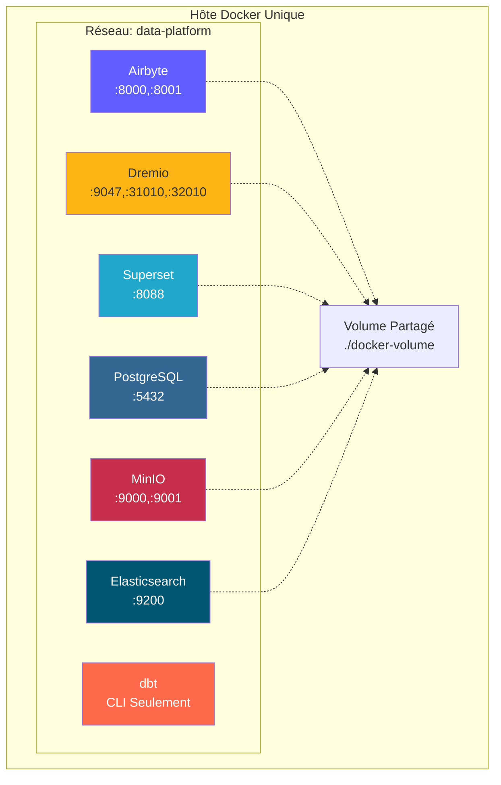
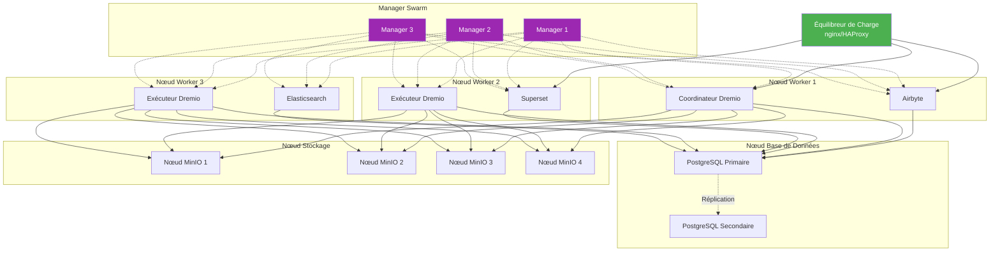
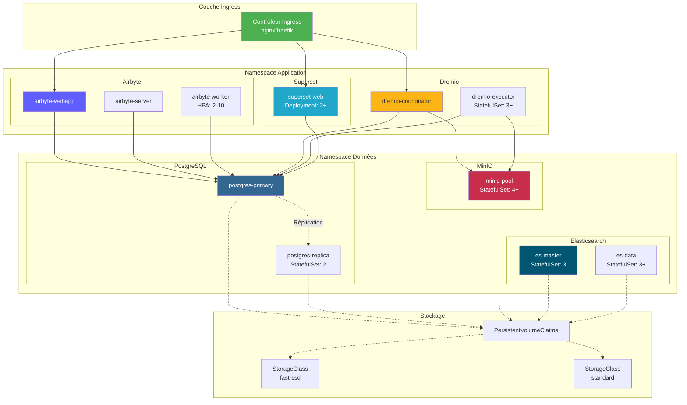
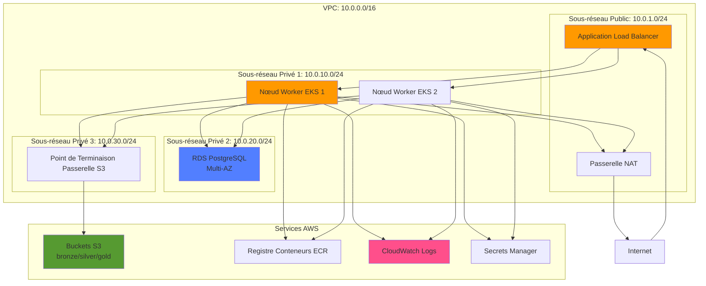
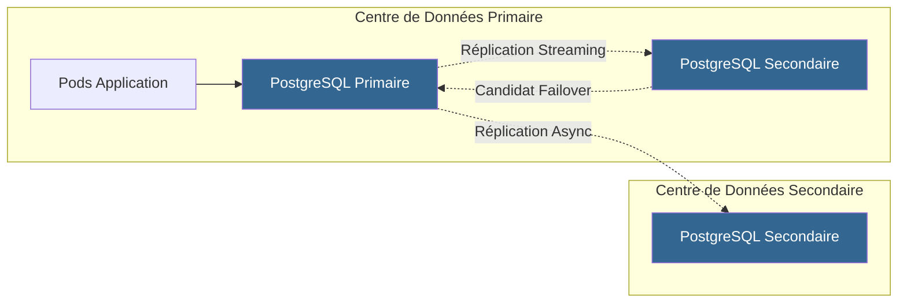

# بنية النشر

**الإصدار**: 3.2.0  
**آخر تحديث**: 16 أكتوبر 2025  
**اللغة**: الفرنسية

## جدول المحتويات

1. [نظرة عامة](#overview)
2. [طبولوجيا النشر](#طبولوجيا النشر)
3. [نشر Docker Compose](#نشر docker-compose)
4. [نشر Kubernetes](#kubernetes-deployment)
5. [عمليات النشر السحابية](#cloud-deployments)
6. [تكوين التوفر العالي](#تكوين التوفر العالي)
7. [استراتيجيات القياس](#استراتيجيات القياس)
8. [تكوين الأمان](#تكوين الأمان)
9. [المراقبة والتسجيل](#المراقبة والتسجيل)
10. [التعافي من الكوارث](#التعافي من الكوارث)
11. [الممارسات الجيدة](#الممارسات الجيدة)

---

## ملخص

توفر هذه الوثيقة إرشادات شاملة حول نشر منصة البيانات عبر بيئات مختلفة، بدءًا من التطوير ووصولاً إلى الإنتاج. نحن نغطي مختلف طبولوجيا النشر واستراتيجيات التنسيق وأفضل الممارسات التشغيلية.

### أهداف النشر

- **الموثوقية**: وقت تشغيل بنسبة 99.9% لأحمال عمل الإنتاج
- **قابلية التوسع**: إدارة النمو بمعدل 10 أضعاف دون إجراء تغييرات هيكلية
- **الأمان**: دفاع متعمق مع طبقات متعددة من الأمان
- **قابلية الصيانة**: تحديثات سهلة وإدارة التكوين
- **الربحية**: تحسين استخدام الموارد

### أنواع البيئة

| البيئة | الهدف | مقياس | التوفر |
|---------------|----------|----------------|--------------|
| **تنمية** | تطوير الميزات واختبارها | عقدة واحدة | <95% |
| ** التدريج ** | التحقق من صحة ما قبل الإنتاج | متعدد العقدة | 95-99% |
| **الإنتاج** | أعباء عمل البيانات المباشرة | متفاوتة | >99.9% |
| **دكتور** | موقع التعافي من الكوارث | مرآة الإنتاج | الاستعداد |

---

## طبولوجيا النشر

### الطوبولوجيا 1: تطوير المضيف الفردي



**حالة الاستخدام**: التطوير المحلي والاختبارات والعروض التوضيحية

**تحديد**:
- وحدة المعالجة المركزية: 4-8 النوى
- الرام: 16-32 جيجابايت
- القرص: 100-500 جيجابايت SSD
- الشبكة: مضيف محلي فقط

**فوائد**:
- تكوين بسيط (إنشاء عامل الإرساء)
- تكلفة منخفضة
- التكرار السريع

**عيوب**:
- لا التكرار
- أداء محدود
- غير صالحة للإنتاج

### الطوبولوجيا 2: Docker Swarm Multi-Host



**حالة الاستخدام**: التدريج وعمليات نشر الإنتاج الصغيرة

**تحديد**:
- عقد المدير: 3x (2 وحدة المعالجة المركزية، 4 جيجابايت من ذاكرة الوصول العشوائي)
- العقد العاملة: 3+ (8-16 وحدة المعالجة المركزية، 32-64 جيجابايت من ذاكرة الوصول العشوائي)
- عقدة قاعدة البيانات: 1-2 (4 وحدة المعالجة المركزية، 16 جيجابايت من ذاكرة الوصول العشوائي، SSD)
- عقد التخزين: 4+ (2 وحدة المعالجة المركزية، 8 جيجابايت من ذاكرة الوصول العشوائي، HDD / SSD)

**فوائد**:
- توافر عالية
- سهولة القياس
- موازنة الحمل المتكاملة
- مراقبة الصحة

**عيوب**:
- أكثر تعقيدًا من المضيف الفردي
- يتطلب مساحة تخزين أو وحدات تخزين مشتركة
- تعقيد تكوين الشبكة

### الطوبولوجيا 3: مجموعة Kubernetes



**حالة الاستخدام**: عمليات نشر الإنتاج على نطاق واسع

**تحديد**:
- مستوى التحكم: أكثر من 3 عقد (مُدارة أو مستضافة ذاتيًا)
- العقد العاملة: أكثر من 10 عقد (16-32 وحدة معالجة مركزية، و64-128 جيجابايت من ذاكرة الوصول العشوائي)
- التخزين: برنامج تشغيل CSI (EBS، GCP PD، Azure Disk)
- الشبكة: البرنامج المساعد CNI (كاليكو، سيليوم)

**فوائد**:
- التنسيق على مستوى المؤسسة
- التحجيم والإصلاح الآلي
- الشبكة المتقدمة (شبكة الخدمة)
- متوافق مع GitOps
- دعم متعدد المستأجرين

**عيوب**:
- التكوين والإدارة المعقدة
- منحنى التعلم أكثر حدة
- ارتفاع النفقات التشغيلية

---

## نشر Docker Compose

### بيئة التطوير

`docker-compose.yml` معيارنا للتنمية المحلية:

```yaml
version: '3.8'

services:
  # Airbyte Platform
  airbyte-server:
    image: airbyte/server:0.50.33
    container_name: airbyte-server
    ports:
      - "8001:8001"
    environment:
      - DATABASE_USER=airbyte
      - DATABASE_PASSWORD=airbyte
      - DATABASE_DB=airbyte
      - DATABASE_HOST=postgres
      - DATABASE_PORT=5432
      - WORKSPACE_ROOT=/tmp/workspace
      - CONFIG_ROOT=/data
      - TRACKING_STRATEGY=logging
    volumes:
      - airbyte-data:/data
      - airbyte-workspace:/tmp/workspace
    depends_on:
      - postgres
    networks:
      - data-platform

  airbyte-webapp:
    image: airbyte/webapp:0.50.33
    container_name: airbyte-webapp
    ports:
      - "8000:80"
    environment:
      - AIRBYTE_SERVER_HOST=airbyte-server
      - AIRBYTE_SERVER_PORT=8001
    depends_on:
      - airbyte-server
    networks:
      - data-platform

  airbyte-worker:
    image: airbyte/worker:0.50.33
    container_name: airbyte-worker
    environment:
      - DATABASE_USER=airbyte
      - DATABASE_PASSWORD=airbyte
      - DATABASE_DB=airbyte
      - DATABASE_HOST=postgres
      - DATABASE_PORT=5432
      - WORKSPACE_ROOT=/tmp/workspace
      - LOCAL_ROOT=/tmp/airbyte_local
    volumes:
      - airbyte-workspace:/tmp/workspace
      - /var/run/docker.sock:/var/run/docker.sock
    depends_on:
      - postgres
      - airbyte-server
    networks:
      - data-platform

  # Dremio Lakehouse
  dremio:
    image: dremio/dremio-oss:26.0
    container_name: dremio
    ports:
      - "9047:9047"   # Web UI
      - "31010:31010" # ODBC/JDBC
      - "32010:32010" # Arrow Flight
    environment:
      - DREMIO_JAVA_SERVER_EXTRA_OPTS=-Xms2g -Xmx4g
    volumes:
      - dremio-data:/opt/dremio/data
      - ./config/dremio.conf:/opt/dremio/conf/dremio.conf
    networks:
      - data-platform

  # Apache Superset
  superset:
    image: apache/superset:3.0.0
    container_name: superset
    ports:
      - "8088:8088"
    environment:
      - SUPERSET_SECRET_KEY=your-secret-key-here
      - SUPERSET_LOAD_EXAMPLES=yes
    volumes:
      - superset-data:/app/superset_home
    command: >
      sh -c "superset db upgrade &&
             superset fab create-admin 
               --username admin 
               --firstname Admin 
               --lastname User 
               --email admin@example.com 
               --password admin &&
             superset init &&
             superset run -h 0.0.0.0 -p 8088"
    depends_on:
      - postgres
    networks:
      - data-platform

  # PostgreSQL Database
  postgres:
    image: postgres:16
    container_name: postgres
    ports:
      - "5432:5432"
    environment:
      - POSTGRES_USER=postgres
      - POSTGRES_PASSWORD=postgres
      - POSTGRES_DB=postgres
      - PGDATA=/var/lib/postgresql/data/pgdata
    volumes:
      - postgres-data:/var/lib/postgresql/data
      - ./scripts/init-databases.sql:/docker-entrypoint-initdb.d/init.sql
    networks:
      - data-platform
    healthcheck:
      test: ["CMD-SHELL", "pg_isready -U postgres"]
      interval: 10s
      timeout: 5s
      retries: 5

  # MinIO Object Storage
  minio:
    image: minio/minio:latest
    container_name: minio
    ports:
      - "9000:9000"  # API
      - "9001:9001"  # Console
    environment:
      - MINIO_ROOT_USER=minioadmin
      - MINIO_ROOT_PASSWORD=minioadmin
    volumes:
      - minio-data:/data
    command: server /data --console-address ":9001"
    networks:
      - data-platform
    healthcheck:
      test: ["CMD", "curl", "-f", "http://localhost:9000/minio/health/live"]
      interval: 30s
      timeout: 20s
      retries: 3

  # Elasticsearch
  elasticsearch:
    image: docker.elastic.co/elasticsearch/elasticsearch:8.15.0
    container_name: elasticsearch
    ports:
      - "9200:9200"
      - "9300:9300"
    environment:
      - discovery.type=single-node
      - xpack.security.enabled=false
      - "ES_JAVA_OPTS=-Xms1g -Xmx1g"
    volumes:
      - es-data:/usr/share/elasticsearch/data
    networks:
      - data-platform
    healthcheck:
      test: ["CMD-SHELL", "curl -f http://localhost:9200/_cluster/health || exit 1"]
      interval: 30s
      timeout: 10s
      retries: 5

volumes:
  airbyte-data:
  airbyte-workspace:
  dremio-data:
  superset-data:
  postgres-data:
  minio-data:
  es-data:

networks:
  data-platform:
    driver: bridge
```

### النفقات العامة للإنتاج في Docker Compose

```yaml
# docker-compose.prod.yml
version: '3.8'

services:
  # Surcharge avec paramètres production
  dremio:
    environment:
      - DREMIO_JAVA_SERVER_EXTRA_OPTS=-Xms8g -Xmx16g
    deploy:
      resources:
        limits:
          cpus: '8'
          memory: 16G
        reservations:
          cpus: '4'
          memory: 8G

  postgres:
    environment:
      - POSTGRES_PASSWORD=${POSTGRES_PASSWORD}  # Depuis .env
    volumes:
      - /mnt/data/postgres:/var/lib/postgresql/data
    deploy:
      resources:
        limits:
          cpus: '4'
          memory: 8G

  minio:
    environment:
      - MINIO_ROOT_USER=${MINIO_ROOT_USER}
      - MINIO_ROOT_PASSWORD=${MINIO_ROOT_PASSWORD}
    volumes:
      - /mnt/data/minio:/data
    deploy:
      replicas: 4  # MinIO distribué
      resources:
        limits:
          cpus: '2'
          memory: 4G
```

**النشر في الإنتاج**:
```bash
docker-compose -f docker-compose.yml -f docker-compose.prod.yml up -d
```

---

## نشر Kubernetes

### تكوين مساحة الاسم

```yaml
# namespaces.yaml
apiVersion: v1
kind: Namespace
metadata:
  name: data-platform
  labels:
    name: data-platform
    environment: production
---
apiVersion: v1
kind: Namespace
metadata:
  name: data-storage
  labels:
    name: data-storage
    environment: production
```

### نشر Airbyte

```yaml
# airbyte-deployment.yaml
apiVersion: apps/v1
kind: Deployment
metadata:
  name: airbyte-server
  namespace: data-platform
spec:
  replicas: 2
  selector:
    matchLabels:
      app: airbyte-server
  template:
    metadata:
      labels:
        app: airbyte-server
    spec:
      containers:
      - name: server
        image: airbyte/server:0.50.33
        ports:
        - containerPort: 8001
        env:
        - name: DATABASE_USER
          valueFrom:
            secretKeyRef:
              name: airbyte-secrets
              key: db-user
        - name: DATABASE_PASSWORD
          valueFrom:
            secretKeyRef:
              name: airbyte-secrets
              key: db-password
        - name: DATABASE_HOST
          value: postgres-service.data-storage.svc.cluster.local
        resources:
          requests:
            memory: "1Gi"
            cpu: "500m"
          limits:
            memory: "2Gi"
            cpu: "1000m"
        livenessProbe:
          httpGet:
            path: /health
            port: 8001
          initialDelaySeconds: 60
          periodSeconds: 30
        readinessProbe:
          httpGet:
            path: /health
            port: 8001
          initialDelaySeconds: 30
          periodSeconds: 10
---
apiVersion: v1
kind: Service
metadata:
  name: airbyte-server
  namespace: data-platform
spec:
  selector:
    app: airbyte-server
  ports:
  - protocol: TCP
    port: 8001
    targetPort: 8001
  type: ClusterIP
```

### StatefulSet Dremio

```yaml
# dremio-statefulset.yaml
apiVersion: apps/v1
kind: StatefulSet
metadata:
  name: dremio-executor
  namespace: data-platform
spec:
  serviceName: dremio-executor
  replicas: 3
  selector:
    matchLabels:
      app: dremio
      role: executor
  template:
    metadata:
      labels:
        app: dremio
        role: executor
    spec:
      containers:
      - name: dremio
        image: dremio/dremio-oss:26.0
        ports:
        - containerPort: 9047
        - containerPort: 31010
        - containerPort: 32010
        env:
        - name: DREMIO_JAVA_SERVER_EXTRA_OPTS
          value: "-Xms8g -Xmx16g"
        - name: DREMIO_COORDINATOR
          value: "false"
        - name: DREMIO_MASTER_HOST
          value: dremio-coordinator.data-platform.svc.cluster.local
        resources:
          requests:
            memory: "16Gi"
            cpu: "4000m"
          limits:
            memory: "32Gi"
            cpu: "8000m"
        volumeMounts:
        - name: dremio-data
          mountPath: /opt/dremio/data
  volumeClaimTemplates:
  - metadata:
      name: dremio-data
    spec:
      accessModes: ["ReadWriteOnce"]
      storageClassName: fast-ssd
      resources:
        requests:
          storage: 100Gi
```

### المقياس التلقائي للجراب الأفقي

```yaml
# hpa.yaml
apiVersion: autoscaling/v2
kind: HorizontalPodAutoscaler
metadata:
  name: airbyte-worker-hpa
  namespace: data-platform
spec:
  scaleTargetRef:
    apiVersion: apps/v1
    kind: Deployment
    name: airbyte-worker
  minReplicas: 2
  maxReplicas: 10
  metrics:
  - type: Resource
    resource:
      name: cpu
      target:
        type: Utilization
        averageUtilization: 70
  - type: Resource
    resource:
      name: memory
      target:
        type: Utilization
        averageUtilization: 80
  behavior:
    scaleUp:
      stabilizationWindowSeconds: 60
      policies:
      - type: Percent
        value: 100
        periodSeconds: 60
    scaleDown:
      stabilizationWindowSeconds: 300
      policies:
      - type: Pods
        value: 1
        periodSeconds: 60
```

### إعداد الدخول

```yaml
# ingress.yaml
apiVersion: networking.k8s.io/v1
kind: Ingress
metadata:
  name: data-platform-ingress
  namespace: data-platform
  annotations:
    kubernetes.io/ingress.class: nginx
    cert-manager.io/cluster-issuer: letsencrypt-prod
    nginx.ingress.kubernetes.io/ssl-redirect: "true"
    nginx.ingress.kubernetes.io/proxy-body-size: "500m"
spec:
  tls:
  - hosts:
    - airbyte.example.com
    - dremio.example.com
    - superset.example.com
    secretName: data-platform-tls
  rules:
  - host: airbyte.example.com
    http:
      paths:
      - path: /
        pathType: Prefix
        backend:
          service:
            name: airbyte-webapp
            port:
              number: 80
  - host: dremio.example.com
    http:
      paths:
      - path: /
        pathType: Prefix
        backend:
          service:
            name: dremio-coordinator
            port:
              number: 9047
  - host: superset.example.com
    http:
      paths:
      - path: /
        pathType: Prefix
        backend:
          service:
            name: superset-web
            port:
              number: 8088
```

### التخزين المستمر

```yaml
# storage-class.yaml
apiVersion: storage.k8s.io/v1
kind: StorageClass
metadata:
  name: fast-ssd
provisioner: kubernetes.io/aws-ebs
parameters:
  type: gp3
  iops: "3000"
  throughput: "125"
  fsType: ext4
allowVolumeExpansion: true
volumeBindingMode: WaitForFirstConsumer
---
apiVersion: storage.k8s.io/v1
kind: StorageClass
metadata:
  name: standard
provisioner: kubernetes.io/aws-ebs
parameters:
  type: gp2
  fsType: ext4
allowVolumeExpansion: true
volumeBindingMode: WaitForFirstConsumer
```

---

## عمليات النشر السحابية

### هندسة AWS



**خدمات AWS المستخدمة**:
- **EKS**: مجموعة Kubernetes المُدارة
- **RDS**: PostgreSQL Multi-AZ للبيانات الوصفية
- **S3**: تخزين الكائنات لبحيرة البيانات
- **ALB**: تطبيق موازن التحميل
- **CloudWatch**: المراقبة والتسجيل
- **مدير الأسرار**: إدارة المعرفات
- **ECR**: سجل الحاوية
- **VPC**: عزل الشبكة

**مثال على التضاريس**:
```hcl
# main.tf
module "eks" {
  source  = "terraform-aws-modules/eks/aws"
  version = "~> 19.0"

  cluster_name    = "data-platform-prod"
  cluster_version = "1.27"

  vpc_id     = module.vpc.vpc_id
  subnet_ids = module.vpc.private_subnets

  eks_managed_node_groups = {
    general = {
      min_size     = 3
      max_size     = 10
      desired_size = 5

      instance_types = ["m5.2xlarge"]
      capacity_type  = "ON_DEMAND"
    }
  }
}

module "rds" {
  source = "terraform-aws-modules/rds/aws"

  identifier = "data-platform-db"

  engine               = "postgres"
  engine_version       = "16.1"
  family               = "postgres16"
  major_engine_version = "16"
  instance_class       = "db.r6g.xlarge"

  allocated_storage     = 100
  max_allocated_storage = 1000

  multi_az               = true
  db_subnet_group_name   = module.vpc.database_subnet_group
  vpc_security_group_ids = [module.security_group.security_group_id]

  backup_retention_period = 30
  backup_window          = "03:00-04:00"
  maintenance_window     = "sun:04:00-sun:05:00"
}

module "s3_bucket" {
  source = "terraform-aws-modules/s3-bucket/aws"

  bucket = "data-platform-datalake-prod"

  versioning = {
    enabled = true
  }

  lifecycle_rule = [
    {
      id      = "bronze-to-glacier"
      enabled = true

      transition = [
        {
          days          = 90
          storage_class = "GLACIER"
        }
      ]
    }
  ]
}
```

### العمارة اللازوردية

**خدمات أزور**:
- **AKS**: خدمة Azure Kubernetes
- **قاعدة بيانات Azure لـ PostgreSQL**: خادم مرن
- **Azure Blob Storage**: Data Lake Gen2
- **بوابة التطبيق**: موازن التحميل
- **Azure Monitor**: المراقبة والتسجيل
- **Key Vault**: الإدارة السرية
- **ACR**: سجل حاوية Azure

### بنية Google Cloud Platform

**خدمات Google Cloud Platform**:
- **GKE**: محرك Google Kubernetes
- **Cloud SQL**: PostgreSQL مع HA
- **التخزين السحابي**: تخزين الكائنات
- **موازنة التحميل السحابي**: موازن التحميل العالمي
- **التسجيل السحابي**: التسجيل المركزي
- **المدير السري**: إدارة المعرفات
- **سجل القطع الأثرية**: سجل الحاوية

---

## تكوين التوفر العالي

### قاعدة بيانات عالية التوفر



** تكوين PostgreSQL HA **:
```yaml
# postgresql.conf pour primaire
wal_level = replica
max_wal_senders = 10
wal_keep_size = 1GB
synchronous_commit = on
synchronous_standby_names = 'standby1'

# pg_hba.conf
host replication replicator standby1-ip/32 md5
host replication replicator standby2-ip/32 md5
```

### تكوين MinIO الموزع

```bash
# MinIO distribué 4 nœuds
docker run -d \
  -p 9000:9000 -p 9001:9001 \
  -e "MINIO_ROOT_USER=admin" \
  -e "MINIO_ROOT_PASSWORD=password" \
  minio/minio server \
  http://minio-{1...4}.example.com/data{1...4} \
  --console-address ":9001"
```

**ترميز المحو**: يقوم MinIO تلقائيًا بحماية البيانات من خلال ترميز المحو (EC:4 لأكثر من 4 عقد).

### تكوين مجموعة Dremio

```conf
# dremio.conf pour coordinateur
coordinator.enabled: true
coordinator.master.enabled: true

# dremio.conf pour exécuteur
coordinator.enabled: false
executor.enabled: true

# Connexion au coordinateur
zookeeper: "coordinator1:2181,coordinator2:2181,coordinator3:2181"
```

---

## استراتيجيات التوسع

### التحجيم العمودي

**متى يتم الاستخدام**: وصول المكونات الفريدة إلى حدود الموارد

| مكون | الأولي | تحجيم | تحسين |
|----------|--------|-----------------|---------|
| منفذ دريميو | 8 وحدة معالجة مركزية، 16 جيجابايت | 16 وحدة معالجة مركزية، 32 جيجابايت | أداء استعلام 2x |
| بوستجرس كيو ال | 4 وحدة معالجة مركزية، 8 جيجابايت | 8 وحدة معالجة مركزية، 16 جيجابايت | خصم المعاملة 2x |
| عامل إيربايت | 2 وحدة المعالجة المركزية، 4 جيجابايت | 4 وحدة معالجة مركزية، 8 جيجابايت | 2x تزامن التوازي |

```yaml
# Mise à jour ressources Kubernetes
kubectl set resources deployment airbyte-worker \
  --limits=cpu=4,memory=8Gi \
  --requests=cpu=2,memory=4Gi
```

### القياس الأفقي

**متى يتم الاستخدام**: تحتاج إلى التعامل مع المزيد من أعباء العمل المتزامنة

```yaml
# Mettre à l'échelle exécuteurs Dremio
kubectl scale statefulset dremio-executor --replicas=6

# Mettre à l'échelle workers Airbyte
kubectl scale deployment airbyte-worker --replicas=5

# Mettre à l'échelle serveurs web Superset
kubectl scale deployment superset-web --replicas=4
```

**سياسة القياس التلقائي**:
```yaml
# Cibler 70% utilisation CPU
kubectl autoscale deployment airbyte-worker \
  --cpu-percent=70 \
  --min=2 \
  --max=10
```

### توسيع نطاق التخزين

**MinIO**: إضافة العقد إلى المجموعة الموزعة
```bash
# Étendre de 4 à 8 nœuds
minio server \
  http://minio-{1...8}.example.com/data{1...4}
```

**PostgreSQL**: استخدم اتصالات التجميع (PgBouncer)
```ini
# pgbouncer.ini
[databases]
* = host=postgres port=5432

[pgbouncer]
listen_addr = *
listen_port = 6432
max_client_conn = 1000
default_pool_size = 25
```

---

## تكوين الأمان

### أمن الشبكات

```yaml
# NetworkPolicy: Restreindre trafic
apiVersion: networking.k8s.io/v1
kind: NetworkPolicy
metadata:
  name: data-platform-network-policy
  namespace: data-platform
spec:
  podSelector:
    matchLabels:
      app: dremio
  policyTypes:
  - Ingress
  - Egress
  ingress:
  - from:
    - podSelector:
        matchLabels:
          app: superset
    - podSelector:
        matchLabels:
          app: airbyte
    ports:
    - protocol: TCP
      port: 9047
    - protocol: TCP
      port: 32010
  egress:
  - to:
    - podSelector:
        matchLabels:
          app: postgres
    ports:
    - protocol: TCP
      port: 5432
  - to:
    - podSelector:
        matchLabels:
          app: minio
    ports:
    - protocol: TCP
      port: 9000
```

### إدارة الأسرار

```yaml
# Secret Kubernetes
apiVersion: v1
kind: Secret
metadata:
  name: data-platform-secrets
  namespace: data-platform
type: Opaque
stringData:
  postgres-password: "change-me-in-production"
  minio-root-password: "change-me-in-production"
  superset-secret-key: "change-me-in-production"
---
# Utiliser dans déploiement
env:
- name: POSTGRES_PASSWORD
  valueFrom:
    secretKeyRef:
      name: data-platform-secrets
      key: postgres-password
```

**مشغل الأسرار الخارجية** (موصى به للإنتاج):
```yaml
apiVersion: external-secrets.io/v1beta1
kind: ExternalSecret
metadata:
  name: data-platform-secrets
spec:
  secretStoreRef:
    name: aws-secrets-manager
    kind: SecretStore
  target:
    name: data-platform-secrets
  data:
  - secretKey: postgres-password
    remoteRef:
      key: prod/data-platform/postgres
      property: password
```

### تكوين TLS/SSL

```yaml
# Certificat cert-manager
apiVersion: cert-manager.io/v1
kind: Certificate
metadata:
  name: data-platform-tls
  namespace: data-platform
spec:
  secretName: data-platform-tls
  issuerRef:
    name: letsencrypt-prod
    kind: ClusterIssuer
  dnsNames:
  - airbyte.example.com
  - dremio.example.com
  - superset.example.com
```

---

## الرصد والتسجيل

### مقاييس بروميثيوس

```yaml
# ServiceMonitor pour Dremio
apiVersion: monitoring.coreos.com/v1
kind: ServiceMonitor
metadata:
  name: dremio-metrics
  namespace: data-platform
spec:
  selector:
    matchLabels:
      app: dremio
  endpoints:
  - port: metrics
    interval: 30s
    path: /metrics
```

### لوحات معلومات جرافانا

**المقاييس الرئيسية**:
- Airbyte: معدل نجاح المزامنة، والتسجيلات المتزامنة، ومدة المزامنة
- دريميو: عدد الطلبات، مدة الطلبات، نضارة التأملات
- PostgreSQL: عدد الاتصالات ومعدل المعاملات ومعدل دخول ذاكرة التخزين المؤقت
- MinIO: معدل الطلب وعرض النطاق الترددي ومعدل الخطأ

### التسجيل المركزي

```yaml
# DaemonSet Fluentd
apiVersion: apps/v1
kind: DaemonSet
metadata:
  name: fluentd
  namespace: kube-system
spec:
  selector:
    matchLabels:
      app: fluentd
  template:
    metadata:
      labels:
        app: fluentd
    spec:
      containers:
      - name: fluentd
        image: fluent/fluentd-kubernetes-daemonset:v1-debian-elasticsearch
        env:
        - name: FLUENT_ELASTICSEARCH_HOST
          value: "elasticsearch.data-storage.svc.cluster.local"
        - name: FLUENT_ELASTICSEARCH_PORT
          value: "9200"
        volumeMounts:
        - name: varlog
          mountPath: /var/log
        - name: varlibdockercontainers
          mountPath: /var/lib/docker/containers
          readOnly: true
      volumes:
      - name: varlog
        hostPath:
          path: /var/log
      - name: varlibdockercontainers
        hostPath:
          path: /var/lib/docker/containers
```

---

## التعافي من الكوارث

### استراتيجية النسخ الاحتياطي

```mermaid
gantt
    title Planification Sauvegarde
    dateFormat HH:mm
    axisFormat %H:%M
    
    section Base de Données
    Sauvegarde Complète           :00:00, 2h
    Sauvegarde Incrémentielle     :06:00, 30m
    Sauvegarde Incrémentielle     :12:00, 30m
    Sauvegarde Incrémentielle     :18:00, 30m
    
    section Stockage Objet
    Snapshot Quotidien            :01:00, 1h
    
    section Métadonnées
    Sauvegarde Configuration      :02:00, 30m
```



** النسخ الاحتياطي PostgreSQL **:
```bash
# Sauvegarde complète avec pg_basebackup
pg_basebackup -h postgres -U postgres -D /backup/full -Ft -z -P

# Archivage continu (WAL)
archive_mode = on
archive_command = 'cp %p /backup/wal/%f'
```

** النسخ الاحتياطي MiniIO **:
```bash
# Réplication bucket vers site DR
mc admin bucket remote add minio/datalake \
  https://dr-minio.example.com/datalake \
  --service replication

mc replicate add minio/datalake \
  --remote-bucket datalake \
  --replicate delete,delete-marker
```

### إجراءات الاسترداد

**أهداف RTO/RPO**:
| البيئة | RTO (هدف وقت الاسترداد) | RPO (هدف نقطة الاسترداد) |
|---------------|------------------------------------------------------|----------------------------------|
| التنمية | 24 ساعة | 24 ساعة |
| التدريج | 4 ساعات | 4 ساعات |
| الإنتاج | 1 ساعة | 15 دقيقة |

**خطوات الاسترداد**:
1. تقييم نطاق الفشل
2. استعادة قاعدة البيانات من النسخة الاحتياطية الأخيرة
3. قم بتطبيق سجلات WAL حتى نقطة الفشل
4. استعادة تخزين الكائنات من اللقطة
5. أعد تشغيل الخدمات بترتيب التبعيات
6. التحقق من سلامة البيانات
7. استئناف العمليات

---

## أفضل الممارسات

### قائمة مراجعة النشر

- [ ] استخدام البنية التحتية كرمز (Terraform/Helm)
- [ ] تنفيذ سير عمل GitOps (ArgoCD/Flux)
- [ ] تكوين فحوصات السلامة لجميع الخدمات
- [ ] تحديد حدود الموارد وطلباتها
- [ ] تمكين القياس التلقائي حيثما كان ذلك مناسبًا
- [ ] تنفيذ سياسات الشبكة
- [ ] استخدام إدارة السرية الخارجية
- [ ] قم بتكوين TLS لجميع نقاط النهاية الخارجية
- [ ] إعداد المراقبة والتنبيهات
- [ ] تنفيذ تجميع السجل
- [ ] تكوين النسخ الاحتياطية الآلية
- [ ] اختبار إجراءات التعافي من الكوارث
- [ ] توثيق أدلة التشغيل للمشكلات الشائعة
- [ ] إعداد خطوط أنابيب CI/CD
- [ ] تنفيذ عمليات النشر باللونين الأزرق والأخضر أو ​​الكناري

### تعديل الأداء

**دريميو**:
```conf
# Augmenter mémoire pour grandes requêtes
services.coordinator.master.heap_memory_mb: 16384
services.executor.heap_memory_mb: 32768

# Ajuster rafraîchissement réflexion
reflection.refresh.threads: 8
reflection.refresh.schedule.interval: 3600000  # 1 heure
```

** بوستجري إس كيو إل **:
```conf
# Optimiser pour charge de travail lecture intensive
shared_buffers = 4GB
effective_cache_size = 12GB
work_mem = 64MB
maintenance_work_mem = 1GB

# Pooling connexions
max_connections = 200
```

** مينيو **:
```bash
# Définir classe stockage optimale pour objets
mc mb --with-lock minio/datalake
mc retention set --default GOVERNANCE 30d minio/datalake
```

### تحسين التكلفة

1. **حجم الموارد بشكل صحيح**: مراقبة الاستخدام الفعلي وضبط الحدود
2. **استخدم المثيلات الموضعية/الاستباقية**: لأحمال العمل غير الحرجة
3. **تنفيذ سياسات دورة حياة البيانات**: انقل البيانات الباردة إلى مستويات تخزين أرخص
4. **التخطيط لتوسيع نطاق الموارد**: قم بالتقليل خلال ساعات الذروة
5. **استخدام المثيلات المحجوزة**: للسعة الأساسية (توفير 40-60%)

---

## ملخص

يغطي دليل بنية النشر هذا ما يلي:

- **الطوبولوجيات**: تطوير مضيف واحد، Docker Swarm متعدد المضيفين، مجموعة Kubernetes
- **التنسيق**: Docker Compose للتطوير، وKubernetes للإنتاج
- **عمليات النشر السحابية**: البنى المرجعية لـ AWS وAzure وGCP
- **التوفر العالي**: النسخ المتماثل لقاعدة البيانات، والتخزين الموزع، والخدمات المجمعة
- **القياس**: استراتيجيات القياس الرأسي والأفقي مع القياس التلقائي
- **الأمان**: سياسات الشبكة، وإدارة الأسرار، وتكوين TLS/SSL
- **المراقبة**: مقاييس Prometheus ولوحات معلومات Grafana والتسجيل المركزي
- **التعافي من الكوارث**: استراتيجيات النسخ الاحتياطي وأهداف RTO/RPO وإجراءات الاسترداد

النقاط الرئيسية التي يجب تذكرها:
- البدء البسيط (مضيف واحد) والتوسع حسب الحاجة
- يوفر Kubernetes مرونة أكبر في الإنتاج
- تنفيذ المراقبة الكاملة من اليوم الأول
- أتمتة كل شيء باستخدام البنية التحتية كرمز
- اختبار إجراءات التعافي من الكوارث بانتظام

**الوثائق ذات الصلة:**
- [نظرة عامة على الهندسة المعمارية](./overview.md)
- [المكونات](./components.md)
- [تدفق البيانات](./data-flow.md)
- [دليل التثبيت](../getting-started/installation.md)

---

**الإصدار**: 3.2.0  
**آخر تحديث**: 16 أكتوبر 2025