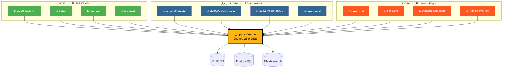
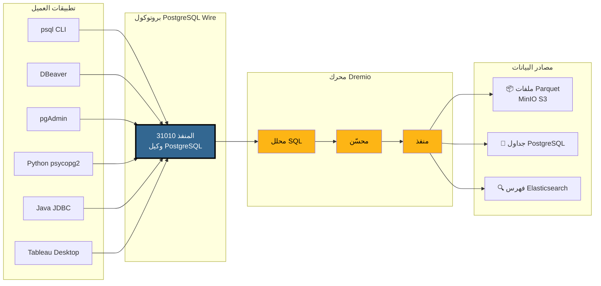
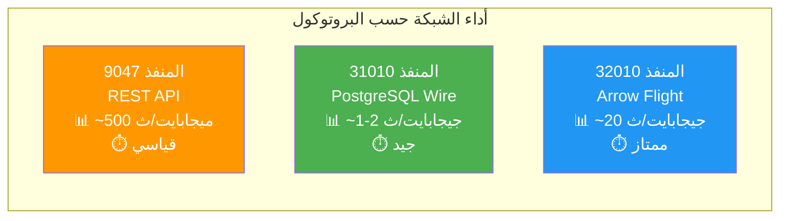
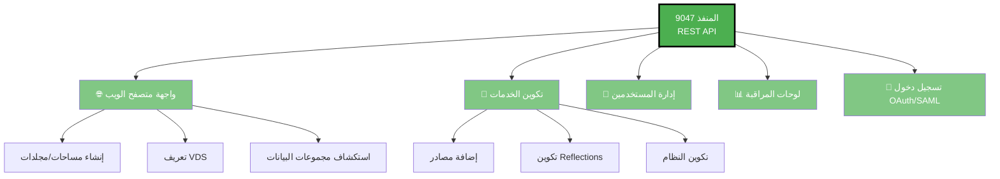
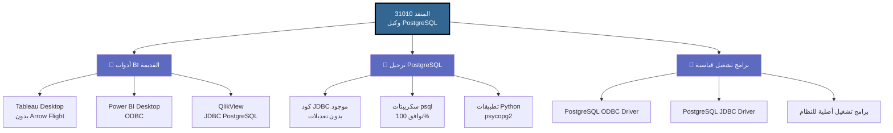
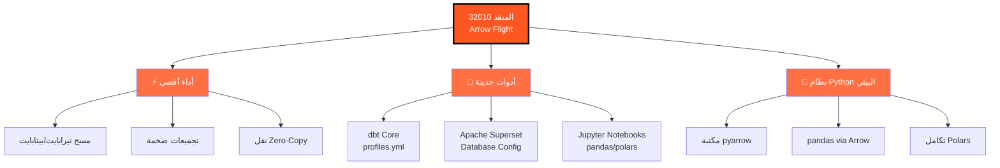
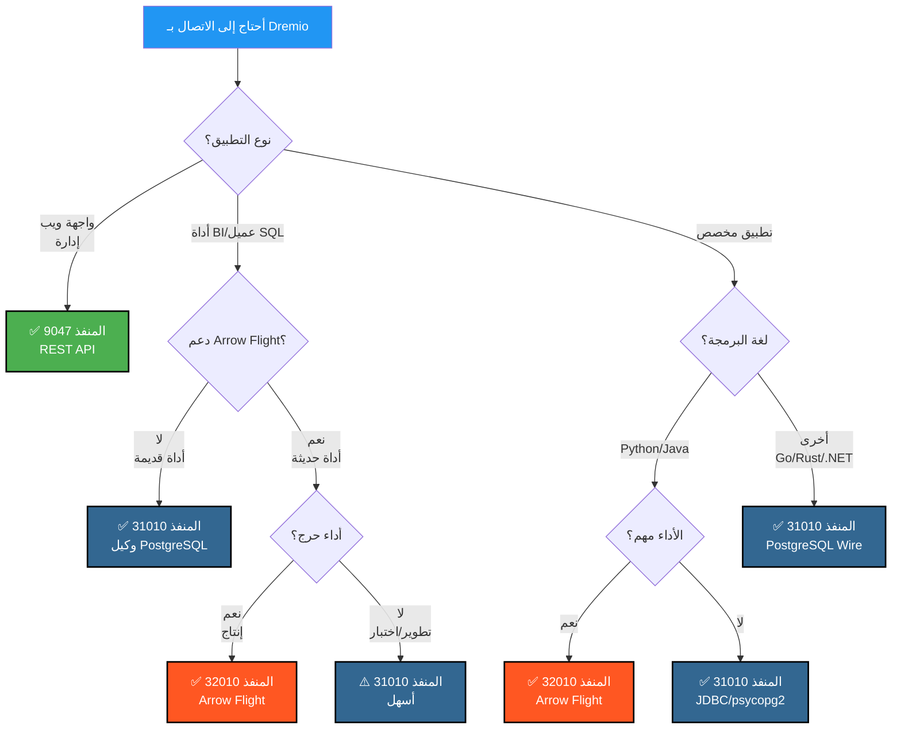
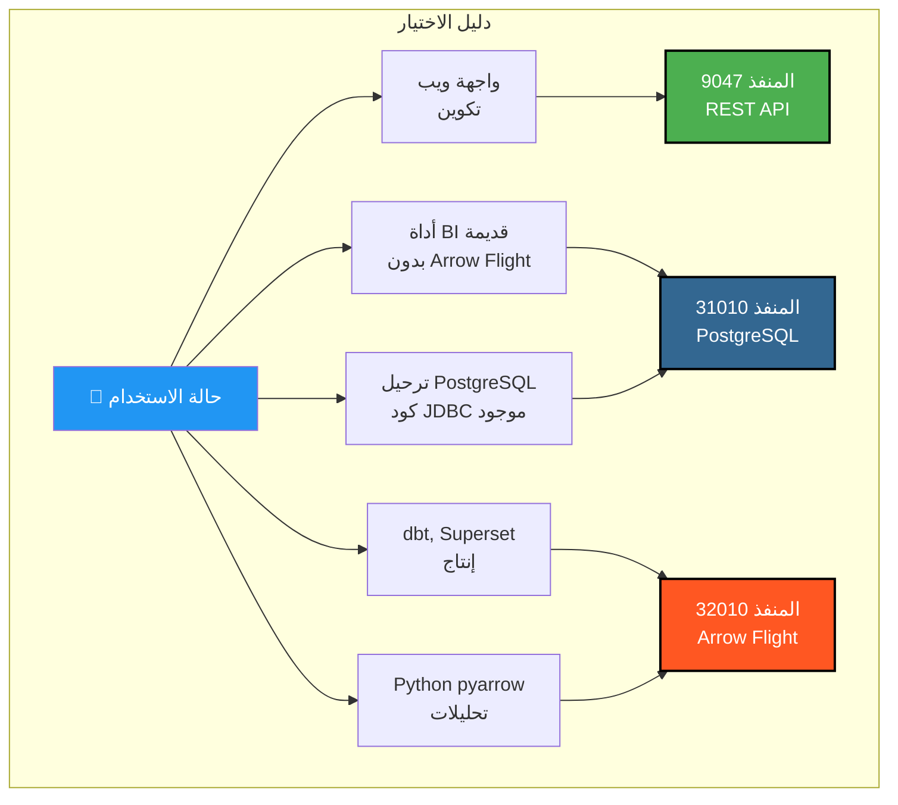

# الدليل المرئي لمنافذ Dremio

**الإصدار**: 3.2.5  
**آخر تحديث**: 16 أكتوبر 2025  
**اللغة**: العربية

---

## نظرة عامة على منافذ Dremio الثلاثة



---

## بنية وكيل PostgreSQL التفصيلية

### تدفق الاتصال العميل → Dremio



---

## مقارنة الأداء

### معيار: مسح 100 جيجابايت من البيانات

```mermaid
gantt
    title وقت التنفيذ حسب البروتوكول (ثواني)
    dateFormat X
    axisFormat %s ثانية
    
    section REST API :9047
    نقل 100 جيجابايت     :0, 180
    
    section PostgreSQL :31010
    نقل 100 جيجابايت     :0, 90
    
    section Arrow Flight :32010
    نقل 100 جيجابايت     :0, 5
```



### إنتاجية البيانات



### تأخير الاستعلام البسيط

| البروتوكول | المنفذ | التأخير المتوسط | عبء الشبكة |
|----------|------|----------------|------------------|
| **REST API** | 9047 | 50-100 مللي ثانية | JSON (مطوّل) |
| **وكيل PostgreSQL** | 31010 | 20-50 مللي ثانية | Wire Protocol (مضغوط) |
| **Arrow Flight** | 32010 | 5-10 مللي ثانية | Apache Arrow (ثنائي عمودي) |

---

## حالات الاستخدام حسب المنفذ

### المنفذ 9047 - REST API



### المنفذ 31010 - وكيل PostgreSQL



### المنفذ 32010 - Arrow Flight



---

## شجرة القرار: أي منفذ تستخدم؟



---

## أمثلة اتصال وكيل PostgreSQL

### 1. psql CLI

```bash
# اتصال بسيط
psql -h localhost -p 31010 -U admin -d datalake

# استعلام مباشر
psql -h localhost -p 31010 -U admin -d datalake \
  -c "SELECT COUNT(*) FROM MinIO.datalake.customers;"

# الوضع التفاعلي
$ psql -h localhost -p 31010 -U admin -d datalake
Password for user admin: ****
psql (16.0, server 26.0)
Type "help" for help.

datalake=> \dt
           List of relations
 Schema |   Name    | Type  | Owner 
--------+-----------+-------+-------
 public | customers | table | admin
 public | orders    | table | admin
(2 rows)

datalake=> SELECT customer_id, name, state FROM customers LIMIT 5;
```

### 2. تكوين DBeaver

```yaml
نوع الاتصال: PostgreSQL
اسم الاتصال: Dremio via PostgreSQL Proxy

الرئيسي:
  المضيف: localhost
  المنفذ: 31010
  قاعدة البيانات: datalake
  المستخدم: admin
  كلمة المرور: [كلمة-المرور-الخاصة-بك]
  
خصائص برنامج التشغيل:
  ssl: false
  
متقدم:
  مهلة الاتصال: 30000
  مهلة الاستعلام: 0
```

### 3. Python مع psycopg2

```python
import psycopg2
from psycopg2 import sql

# الاتصال
conn = psycopg2.connect(
    host="localhost",
    port=31010,
    database="datalake",
    user="admin",
    password="كلمة-المرور-الخاصة-بك"
)

# المؤشر
cursor = conn.cursor()

# استعلام بسيط
cursor.execute("SELECT * FROM MinIO.datalake.customers LIMIT 10")
rows = cursor.fetchall()

for row in rows:
    print(row)

# استعلام معلمي
query = sql.SQL("SELECT * FROM {} WHERE state = %s").format(
    sql.Identifier("MinIO", "datalake", "customers")
)
cursor.execute(query, ("CA",))

# الإغلاق
cursor.close()
conn.close()
```

### 4. Java JDBC

```java
import java.sql.*;

public class DremioPostgreSQLProxy {
    public static void main(String[] args) {
        String url = "jdbc:postgresql://localhost:31010/datalake";
        String user = "admin";
        String password = "كلمة-المرور-الخاصة-بك";
        
        try (Connection conn = DriverManager.getConnection(url, user, password)) {
            Statement stmt = conn.createStatement();
            ResultSet rs = stmt.executeQuery(
                "SELECT customer_id, name, state FROM MinIO.datalake.customers LIMIT 10"
            );
            
            while (rs.next()) {
                int id = rs.getInt("customer_id");
                String name = rs.getString("name");
                String state = rs.getString("state");
                System.out.printf("ID: %d, Name: %s, State: %s%n", id, name, state);
            }
            
            rs.close();
            stmt.close();
        } catch (SQLException e) {
            e.printStackTrace();
        }
    }
}
```

### 5. سلسلة اتصال ODBC (DSN)

```ini
[ODBC Data Sources]
Dremio_PostgreSQL=PostgreSQL Unicode Driver

[Dremio_PostgreSQL]
Driver=PostgreSQL Unicode
Description=Dremio via PostgreSQL Proxy
Server=localhost
Port=31010
Database=datalake
Username=admin
Password=كلمة-المرور-الخاصة-بك
SSLMode=disable
Protocol=7.4
```

---

## تكوين Docker Compose

### تعيين منافذ Dremio

```yaml
services:
  dremio:
    image: dremio/dremio-oss:26.0
    container_name: dremio
    ports:
      # المنفذ 9047 - REST API / Web UI
      - "9047:9047"
      
      # المنفذ 31010 - وكيل PostgreSQL (ODBC/JDBC)
      - "31010:31010"
      
      # المنفذ 32010 - Arrow Flight (الأداء)
      - "32010:32010"
    environment:
      - DREMIO_JAVA_SERVER_EXTRA_OPTS=-Xms4g -Xmx8g
    volumes:
      - ./docker-volume/dremio:/opt/dremio/data
    networks:
      - data-platform
```

### التحقق من المنافذ

```bash
# التحقق من فتح المنافذ الثلاثة
netstat -an | grep -E '9047|31010|32010'

# اختبار REST API
curl -v http://localhost:9047

# اختبار وكيل PostgreSQL
psql -h localhost -p 31010 -U admin -d datalake -c "SELECT 1;"

# اختبار Arrow Flight (مع Python)
python3 -c "
from pyarrow import flight
client = flight.connect('grpc://localhost:32010')
print('Arrow Flight OK')
"
```

---

## ملخص مرئي سريع

### المنافذ الثلاثة في لمحة

| المنفذ | البروتوكول | الاستخدام الرئيسي | الأداء | التوافق |
|------|-----------|-------------|------------|----------------|
| **9047** | REST API | 🌐 Web UI, إدارة | ⭐⭐ قياسي | ⭐⭐⭐ عالمي |
| **31010** | PostgreSQL Wire | 💼 أدوات BI, ترحيل | ⭐⭐⭐ جيد | ⭐⭐⭐ ممتاز |
| **32010** | Arrow Flight | ⚡ إنتاج, dbt, Superset | ⭐⭐⭐⭐⭐ أقصى | ⭐⭐ محدود |

### مصفوفة الاختيار



---

## موارد إضافية

### الوثائق ذات الصلة

- [البنية - المكونات](./components.md) - قسم "وكيل PostgreSQL لـ Dremio"
- [الدليل - إعداد Dremio](../guides/dremio-setup.md) - قسم "الاتصال عبر وكيل PostgreSQL"
- [التكوين - Dremio](../getting-started/configuration.md) - تكوين `dremio.conf`

### الروابط الرسمية

- **وثائق Dremio**: https://docs.dremio.com/
- **بروتوكول PostgreSQL Wire**: https://www.postgresql.org/docs/current/protocol.html
- **Apache Arrow Flight**: https://arrow.apache.org/docs/format/Flight.html

---

**الإصدار**: 3.2.5  
**آخر تحديث**: 16 أكتوبر 2025  
**الحالة**: ✅ مكتمل
