# الدليل المرئي لمنافذ Dremio

**الإصدار**: 3.2.3  
**آخر تحديث**: 16 أكتوبر 2025  
**اللغة**: الفرنسية

---

## نظرة عامة على منافذ Dremio الثلاثة

```mermaid
graph TB
    subgraph "Port 9047 - REST API"
        direction TB
        A1[🌐 Interface Web UI]
        A2[🔧 Administration]
        A3[📊 Monitoring]
        A4[🔐 Authentification]
    end
    
    subgraph "Port 31010 - Proxy PostgreSQL"
        direction TB
        B1[💼 Outils BI Legacy]
        B2[🔌 JDBC/ODBC Standard]
        B3[🐘 Compatibilité PostgreSQL]
        B4[🔄 Migration Facile]
    end
    
    subgraph "Port 32010 - Arrow Flight"
        direction TB
        C1[⚡ Performance Max]
        C2[🎯 dbt Core]
        C3[📈 Apache Superset]
        C4[🐍 Python pyarrow]
    end
    
    D[🗄️ Dremio Coordinateur<br/>Dremio 26.0 OSS]
    
    A1 & A2 & A3 & A4 --> D
    B1 & B2 & B3 & B4 --> D
    C1 & C2 & C3 & C4 --> D
    
    E1[(MinIO S3)]
    E2[(PostgreSQL)]
    E3[(Elasticsearch)]
    
    D --> E1 & E2 & E3
    
    style D fill:#FDB515,color:#000,stroke:#000,stroke-width:3px
    style A1 fill:#4CAF50,color:#fff
    style A2 fill:#4CAF50,color:#fff
    style A3 fill:#4CAF50,color:#fff
    style A4 fill:#4CAF50,color:#fff
    style B1 fill:#336791,color:#fff
    style B2 fill:#336791,color:#fff
    style B3 fill:#336791,color:#fff
    style B4 fill:#336791,color:#fff
    style C1 fill:#FF5722,color:#fff
    style C2 fill:#FF5722,color:#fff
    style C3 fill:#FF5722,color:#fff
    style C4 fill:#FF5722,color:#fff
```



---

## البنية التفصيلية لوكيل PostgreSQL

### تدفق اتصال العملاء → Dremio

```mermaid
graph LR
    subgraph "Applications Clientes"
        direction TB
        A1[psql CLI]
        A2[DBeaver]
        A3[pgAdmin]
        A4[Python psycopg2]
        A5[Java JDBC]
        A6[Tableau Desktop]
    end
    
    subgraph "Protocole PostgreSQL Wire"
        P[Port 31010<br/>Proxy PostgreSQL]
    end
    
    subgraph "Moteur Dremio"
        direction TB
        M1[Parser SQL]
        M2[Optimiseur]
        M3[Exécuteur]
    end
    
    subgraph "Sources de Données"
        direction TB
        S1[📦 Fichiers Parquet<br/>MinIO S3]
        S2[💾 Tables PostgreSQL]
        S3[🔍 Index Elasticsearch]
    end
    
    A1 & A2 & A3 --> P
    A4 & A5 & A6 --> P
    
    P --> M1
    M1 --> M2
    M2 --> M3
    
    M3 --> S1 & S2 & S3
    
    style P fill:#336791,color:#fff,stroke:#000,stroke-width:3px
    style M1 fill:#FDB515,color:#000
    style M2 fill:#FDB515,color:#000
    style M3 fill:#FDB515,color:#000
```



---

## مقارنة الأداء

### المعيار: مسح 100 جيجابايت من البيانات

```mermaid
gantt
    title Temps d'Exécution par Protocole (secondes)
    dateFormat X
    axisFormat %s sec
    
    section REST API :9047
    Transfert 100 GB     :0, 180
    
    section PostgreSQL :31010
    Transfert 100 GB     :0, 90
    
    section Arrow Flight :32010
    Transfert 100 GB     :0, 5
```



### معدل البيانات

```mermaid
graph LR
    subgraph "Débit Réseau par Protocole"
        A["Port 9047<br/>REST API<br/>📊 ~500 MB/s<br/>⏱️ Standard"]
        B["Port 31010<br/>PostgreSQL Wire<br/>📊 ~1-2 GB/s<br/>⏱️ Bon"]
        C["Port 32010<br/>Arrow Flight<br/>📊 ~20 GB/s<br/>⏱️ Excellent"]
    end
    
    style A fill:#FF9800,color:#fff
    style B fill:#4CAF50,color:#fff
    style C fill:#2196F3,color:#fff
```



### زمن استجابة الاستعلام البسيط

| البروتوكول | ميناء | متوسط ​​الكمون | الشبكة العامة |
|---------------|-----|-----------------|-----------------|
| **REST API** | 9047 | 50-100 مللي ثانية | JSON (مطول) |
| ** وكيل PostgreSQL ** | 31010 | 20-50 مللي ثانية | بروتوكول الأسلاك (مدمج) |
| ** رحلة السهم ** | 32010 | 5-10 مللي ثانية | سهم أباتشي (عمودي ثنائي) |

---

## حالة الاستخدام حسب المنفذ

### المنفذ 9047 - REST API

```mermaid
graph TB
    A[Port 9047<br/>REST API]
    
    A --> B1[🌐 Interface Web Browser]
    A --> B2[🔧 Configuration Services]
    A --> B3[👤 Gestion Utilisateurs]
    A --> B4[📊 Monitoring Dashboards]
    A --> B5[🔐 OAuth/SAML Login]
    
    B1 --> C1[Créer Spaces/Folders]
    B1 --> C2[Définir VDS]
    B1 --> C3[Explorer Datasets]
    
    B2 --> C4[Ajouter Sources]
    B2 --> C5[Configurer Reflections]
    B2 --> C6[Paramètres Système]
    
    style A fill:#4CAF50,color:#fff,stroke:#000,stroke-width:3px
    style B1 fill:#81C784,color:#fff
    style B2 fill:#81C784,color:#fff
    style B3 fill:#81C784,color:#fff
    style B4 fill:#81C784,color:#fff
    style B5 fill:#81C784,color:#fff
```



### المنفذ 31010 - وكيل PostgreSQL

```mermaid
graph TB
    A[Port 31010<br/>Proxy PostgreSQL]
    
    A --> B1[💼 Outils BI Legacy]
    A --> B2[🔄 Migration PostgreSQL]
    A --> B3[🔌 Drivers Standard]
    
    B1 --> C1[Tableau Desktop<br/>sans Arrow Flight]
    B1 --> C2[Power BI Desktop<br/>ODBC]
    B1 --> C3[QlikView<br/>JDBC PostgreSQL]
    
    B2 --> D1[Code JDBC existant<br/>aucune modification]
    B2 --> D2[Scripts psql<br/>compatibles 100%]
    B2 --> D3[Applications Python<br/>psycopg2]
    
    B3 --> E1[PostgreSQL ODBC Driver]
    B3 --> E2[PostgreSQL JDBC Driver]
    B3 --> E3[Pilotes natifs OS]
    
    style A fill:#336791,color:#fff,stroke:#000,stroke-width:3px
    style B1 fill:#5C6BC0,color:#fff
    style B2 fill:#5C6BC0,color:#fff
    style B3 fill:#5C6BC0,color:#fff
```



### المنفذ 32010 - رحلة السهم

```mermaid
graph TB
    A[Port 32010<br/>Arrow Flight]
    
    A --> B1[⚡ Performance Maximale]
    A --> B2[🎯 Outils Modernes]
    A --> B3[🐍 Python Ecosystem]
    
    B1 --> C1[Scans de TB/PB]
    B1 --> C2[Agrégations Massives]
    B1 --> C3[Transferts Zero-Copy]
    
    B2 --> D1[dbt Core<br/>profiles.yml]
    B2 --> D2[Apache Superset<br/>Database Config]
    B2 --> D3[Jupyter Notebooks<br/>pandas/polars]
    
    B3 --> E1[pyarrow Library]
    B3 --> E2[pandas via Arrow]
    B3 --> E3[Polars Integration]
    
    style A fill:#FF5722,color:#fff,stroke:#000,stroke-width:3px
    style B1 fill:#FF7043,color:#fff
    style B2 fill:#FF7043,color:#fff
    style B3 fill:#FF7043,color:#fff
```



---

## شجرة القرار: أي منفذ يجب استخدامه؟

```mermaid
graph TB
    Start[Besoin de se connecter à Dremio]
    
    Start --> Q1{Type d'application ?}
    
    Q1 -->|Interface Web<br/>Administration| Port9047[✅ Port 9047<br/>REST API]
    
    Q1 -->|Outil BI/Client SQL| Q2{Supporte Arrow Flight ?}
    
    Q2 -->|Non<br/>Legacy Tool| Port31010[✅ Port 31010<br/>Proxy PostgreSQL]
    Q2 -->|Oui<br/>Modern Tool| Q3{Performance critique ?}
    
    Q3 -->|Oui<br/>Production| Port32010[✅ Port 32010<br/>Arrow Flight]
    Q3 -->|Non<br/>Dev/Test| Port31010b[⚠️ Port 31010<br/>Plus facile]
    
    Q1 -->|Application Custom| Q4{Langage ?}
    
    Q4 -->|Python/Java| Q5{Performance importante ?}
    Q5 -->|Oui| Port32010b[✅ Port 32010<br/>Arrow Flight]
    Q5 -->|Non| Port31010c[✅ Port 31010<br/>JDBC/psycopg2]
    
    Q4 -->|Autre<br/>Go/Rust/.NET| Port31010d[✅ Port 31010<br/>PostgreSQL Wire]
    
    style Start fill:#2196F3,color:#fff
    style Port9047 fill:#4CAF50,color:#fff,stroke:#000,stroke-width:2px
    style Port31010 fill:#336791,color:#fff,stroke:#000,stroke-width:2px
    style Port31010b fill:#336791,color:#fff,stroke:#000,stroke-width:2px
    style Port31010c fill:#336791,color:#fff,stroke:#000,stroke-width:2px
    style Port31010d fill:#336791,color:#fff,stroke:#000,stroke-width:2px
    style Port32010 fill:#FF5722,color:#fff,stroke:#000,stroke-width:2px
    style Port32010b fill:#FF5722,color:#fff,stroke:#000,stroke-width:2px
```



---

## أمثلة على اتصال وكيل PostgreSQL

### 1.psql CLI

```bash
# Connexion simple
psql -h localhost -p 31010 -U admin -d datalake

# Avec requête directe
psql -h localhost -p 31010 -U admin -d datalake \
  -c "SELECT COUNT(*) FROM MinIO.datalake.customers;"

# Mode interactif
$ psql -h localhost -p 31010 -U admin -d datalake
Password for user admin: ****
psql (16.0, server 26.0)
Type "help" for help.

datalake=> \dt
           List of relations
 Schema |   Name    | Type  | Owner 
--------+-----------+-------+-------
 public | customers | table | admin
 public | orders    | table | admin
(2 rows)

datalake=> SELECT customer_id, name, state FROM customers LIMIT 5;
```

### 2. تكوين DBeaver

```yaml
Connection Type: PostgreSQL
Connection Name: Dremio via PostgreSQL Proxy

Main:
  Host: localhost
  Port: 31010
  Database: datalake
  Username: admin
  Password: [votre-mot-de-passe]
  
Driver Properties:
  ssl: false
  
Advanced:
  Connection timeout: 30000
  Query timeout: 0
```

### 3. بايثون مع psycopg2

```python
import psycopg2
from psycopg2 import sql

# Connexion
conn = psycopg2.connect(
    host="localhost",
    port=31010,
    database="datalake",
    user="admin",
    password="votre-mot-de-passe"
)

# Cursor
cursor = conn.cursor()

# Requête simple
cursor.execute("SELECT * FROM MinIO.datalake.customers LIMIT 10")
rows = cursor.fetchall()

for row in rows:
    print(row)

# Requête avec paramètres
query = sql.SQL("SELECT * FROM {} WHERE state = %s").format(
    sql.Identifier("MinIO", "datalake", "customers")
)
cursor.execute(query, ("CA",))

# Fermeture
cursor.close()
conn.close()
```

### 4. جافا JDBC

```java
import java.sql.*;

public class DremioPostgreSQLProxy {
    public static void main(String[] args) {
        String url = "jdbc:postgresql://localhost:31010/datalake";
        String user = "admin";
        String password = "votre-mot-de-passe";
        
        try (Connection conn = DriverManager.getConnection(url, user, password)) {
            Statement stmt = conn.createStatement();
            ResultSet rs = stmt.executeQuery(
                "SELECT customer_id, name, state FROM MinIO.datalake.customers LIMIT 10"
            );
            
            while (rs.next()) {
                int id = rs.getInt("customer_id");
                String name = rs.getString("name");
                String state = rs.getString("state");
                System.out.printf("ID: %d, Name: %s, State: %s%n", id, name, state);
            }
            
            rs.close();
            stmt.close();
        } catch (SQLException e) {
            e.printStackTrace();
        }
    }
}
```

### 5. سلسلة ODBC (DSN)

```ini
[ODBC Data Sources]
Dremio_PostgreSQL=PostgreSQL Unicode Driver

[Dremio_PostgreSQL]
Driver=PostgreSQL Unicode
Description=Dremio via PostgreSQL Proxy
Server=localhost
Port=31010
Database=datalake
Username=admin
Password=votre-mot-de-passe
SSLMode=disable
Protocol=7.4
```

---

## تكوين Docker Compose

### رسم خرائط منفذ دريمو

```yaml
services:
  dremio:
    image: dremio/dremio-oss:26.0
    container_name: dremio
    ports:
      # Port 9047 - REST API / Web UI
      - "9047:9047"
      
      # Port 31010 - Proxy PostgreSQL (ODBC/JDBC)
      - "31010:31010"
      
      # Port 32010 - Arrow Flight (Performance)
      - "32010:32010"
    environment:
      - DREMIO_JAVA_SERVER_EXTRA_OPTS=-Xms4g -Xmx8g
    volumes:
      - ./docker-volume/dremio:/opt/dremio/data
    networks:
      - data-platform
```

### فحص المنفذ

```bash
# Vérifier que les 3 ports sont ouverts
netstat -an | grep -E '9047|31010|32010'

# Tester REST API
curl -v http://localhost:9047

# Tester Proxy PostgreSQL
psql -h localhost -p 31010 -U admin -d datalake -c "SELECT 1;"

# Tester Arrow Flight (avec Python)
python3 -c "
from pyarrow import flight
client = flight.connect('grpc://localhost:32010')
print('Arrow Flight OK')
"
```

---

## ملخص مرئي سريع

### نظرة سريعة على المنافذ الثلاثة

| ميناء | البروتوكول | الاستخدام الرئيسي | الأداء | التوافق |
|------|----------|------------------------|-------------|--------------|
| **9047** | ريست API | 🌐 واجهة الويب، المشرف | ⭐⭐قياسي | ⭐⭐⭐عالمي |
| **31010** | سلك PostgreSQL | 💼 أدوات ذكاء الأعمال، الهجرة | ⭐⭐⭐ جيد | ⭐⭐⭐ ممتاز |
| **32010** | طيران السهم | ⚡إنتاج، دي بي تي، سوبر سيت | ⭐⭐⭐⭐⭐ الحد الأقصى | ⭐⭐ محدودة |

### مصفوفة الاختيار

```mermaid
graph TB
    subgraph "Guide de Sélection"
        A["🎯 Cas d'Usage"]
        
        A --> B1["Interface Web<br/>Configuration"]
        A --> B2["Outil BI Legacy<br/>Sans Arrow Flight"]
        A --> B3["Migration PostgreSQL<br/>Code JDBC existant"]
        A --> B4["dbt, Superset<br/>Production"]
        A --> B5["Python pyarrow<br/>Analytique"]
        
        B1 --> C1["Port 9047<br/>REST API"]
        B2 --> C2["Port 31010<br/>PostgreSQL"]
        B3 --> C2
        B4 --> C3["Port 32010<br/>Arrow Flight"]
        B5 --> C3
    end
    
    style A fill:#2196F3,color:#fff
    style C1 fill:#4CAF50,color:#fff,stroke:#000,stroke-width:2px
    style C2 fill:#336791,color:#fff,stroke:#000,stroke-width:2px
    style C3 fill:#FF5722,color:#fff,stroke:#000,stroke-width:2px
```



---

## موارد إضافية

### الوثائق ذات الصلة

- [الهندسة المعمارية - المكونات](./components.md) - قسم "وكيل PostgreSQL لـ Dremio"
- [الدليل - إعداد Dremio](../guides/dremio-setup.md) - قسم "الاتصال عبر وكيل PostgreSQL"
- [التكوين - Dremio](../getting-started/configuration.md) - المعلمات `dremio.conf`

### الروابط الرسمية

- **وثائق Dremio**: https://docs.dremio.com/
- ** بروتوكول سلك PostgreSQL **: https://www.postgresql.org/docs/current/protocol.html
- ** رحلة سهم أباتشي **: https://arrow.apache.org/docs/format/Flight.html

---

**الإصدار**: 3.2.3  
**آخر تحديث**: 16 أكتوبر 2025  
**الحالة**: ✅ مكتمل