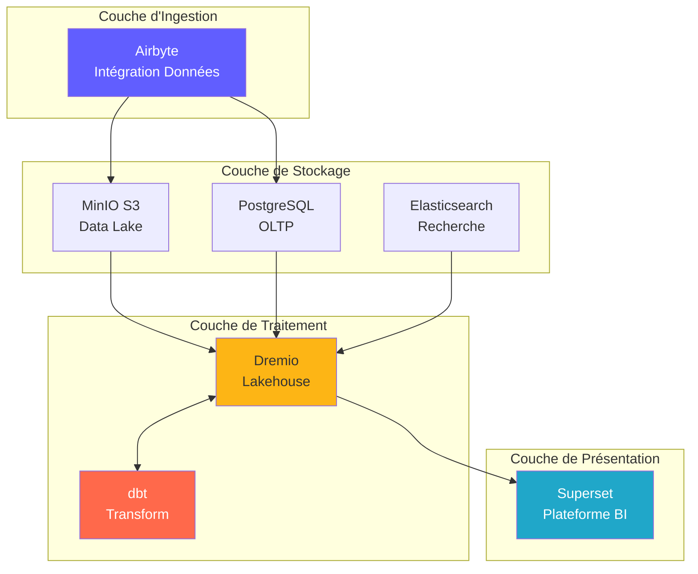
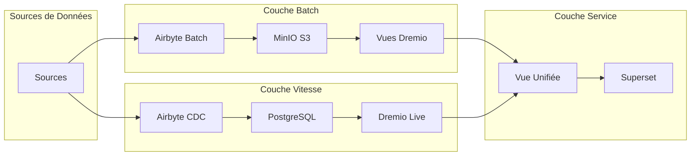
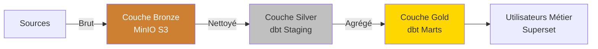
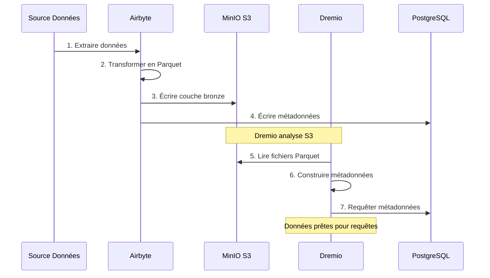
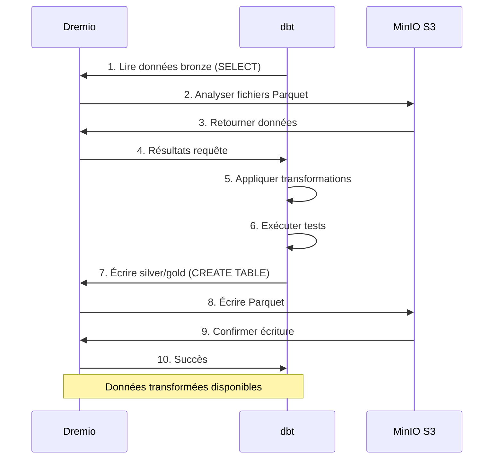
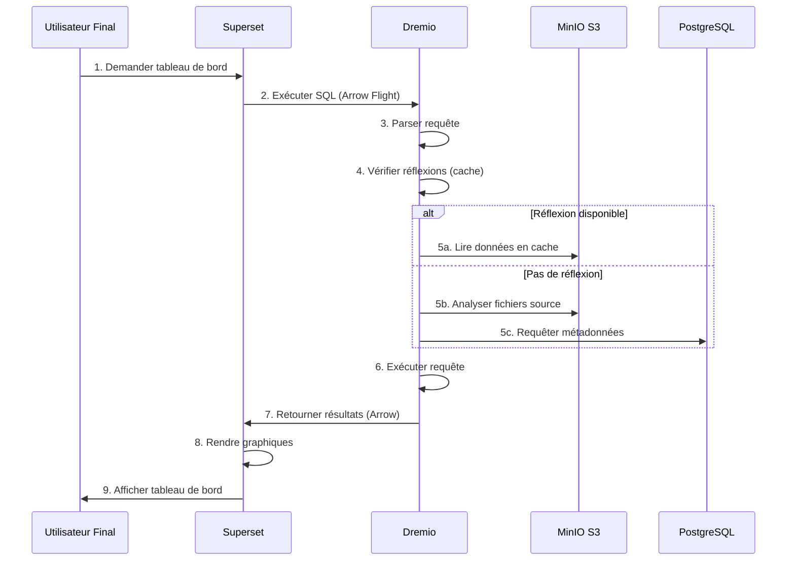
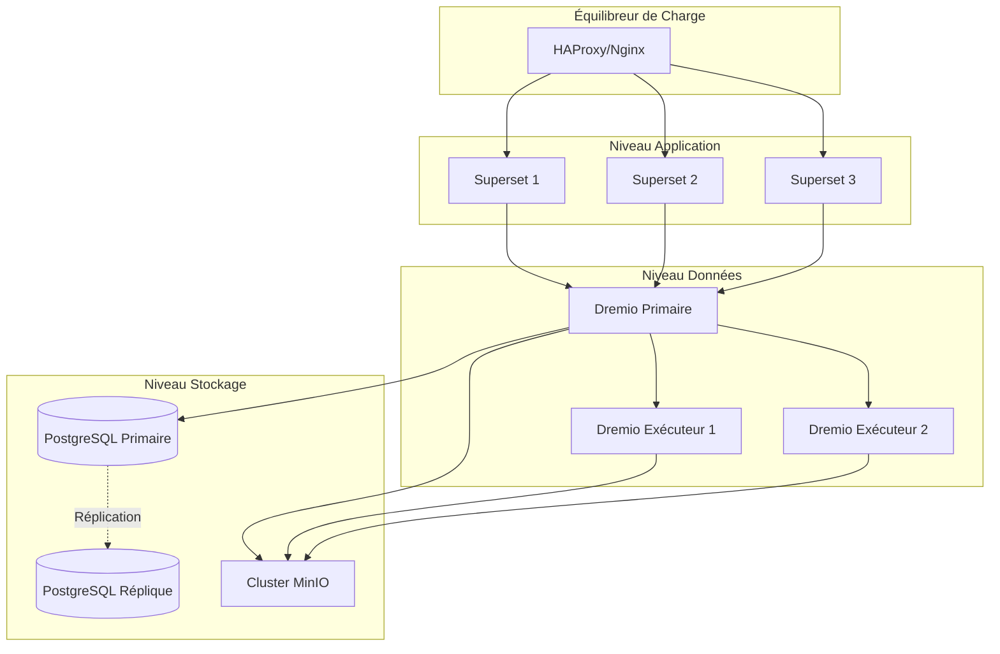
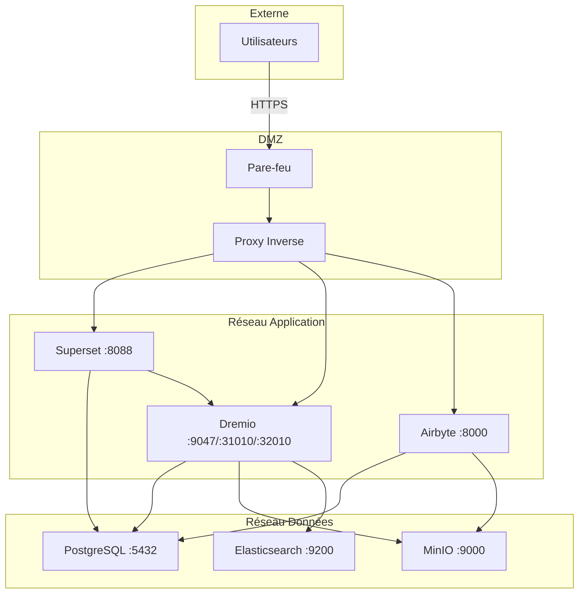
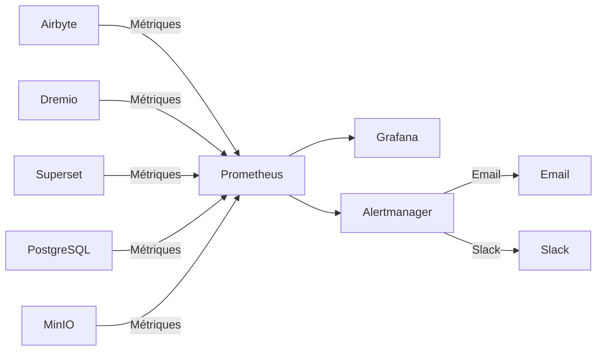

# نظرة عامة على الهندسة المعمارية

**الإصدار**: 3.2.0  
**آخر تحديث**: 16-10-2025  
**اللغة**: الفرنسية

---

## مقدمة

منصة البيانات عبارة عن بنية سحابية أصلية حديثة مبنية على تقنيات مفتوحة المصدر. فهو يوفر حلاً شاملاً لاستيعاب البيانات وتخزينها وتحويلها وتصورها، وهو مصمم لأحمال العمل التحليلية على مستوى المؤسسة.



---

## مبادئ التصميم

### 1. المصدر المفتوح أولاً

**الفلسفة**: استخدم تقنيات مفتوحة المصدر لتجنب تقييد البائع والحفاظ على المرونة.

**فوائد**:
- لا تكاليف الترخيص
- تنمية المجتمع
- القدرة على التخصيص الكامل
- تدقيق أمني شفاف
- التوافق البيئي على نطاق واسع

### 2. العمارة ذات الطبقات

**الفلسفة**: قم بفصل الاهتمامات إلى طبقات متميزة من أجل قابلية الصيانة وقابلية التوسع.

**طبقات**:
```
┌─────────────────────────────────────┐
│     Couche de Présentation          │  Superset (BI & Tableaux de Bord)
├─────────────────────────────────────┤
│     Couche Sémantique               │  Dremio (Moteur de Requête)
├─────────────────────────────────────┤
│     Couche de Transformation        │  dbt (Transformation Données)
├─────────────────────────────────────┤
│     Couche de Stockage              │  MinIO, PostgreSQL, Elasticsearch
├─────────────────────────────────────┤
│     Couche d'Ingestion              │  Airbyte (Intégration Données)
└─────────────────────────────────────┘
```

### 3. ELT بدلاً من ETL

**الفلسفة**: قم بتحميل البيانات الأولية أولاً، ثم قم بتحويلها إلى الوجهة (ELT).

**لماذا تدريس اللغة الإنجليزية؟**
- **المرونة**: تحويل البيانات بطرق متعددة دون إعادة استخراجها
- **الأداء**: استخدم حساب الوجهة للتحويلات
- **قابلية التدقيق**: البيانات الأولية متاحة دائمًا للتحقق منها
- **التكلفة**: تقليل حمل الاستخراج على الأنظمة المصدر

**تدفق**:
```
Extract → Load → Transform
(Airbyte) (MinIO/PostgreSQL) (dbt + Dremio)
```

### 4. نموذج مستودع البيانات

**الفلسفة**: الجمع بين مرونة بحيرة البيانات وأداء مستودع البيانات.

**سمات**:
- **معاملات ACID**: عمليات البيانات الموثوقة
- **تطبيق المخطط**: ضمانات جودة البيانات
- **السفر عبر الزمن**: الاستعلام عن الإصدارات التاريخية
- **الأشكال المفتوحة**: الباركيه، جبل الجليد، بحيرة الدلتا
- **الوصول المباشر إلى الملفات**: لا يوجد قفل خاص

### 5. التصميم السحابي الأصلي

**الفلسفة**: تصميم للبيئات المعبأة في حاويات والموزعة.

**تطبيق**:
- حاويات دوكر لجميع الخدمات
- قابلية التوسع الأفقي
- البنية التحتية كرمز
- عديمي الجنسية حيثما أمكن ذلك
- التكوين عبر متغيرات البيئة

---

## نماذج معمارية

### بنية لامدا (دفعة + تيار)



**طبقة الدفعة** (البيانات التاريخية):
- كميات كبيرة من البيانات
- العلاج الدوري (ساعة/يوميا)
- الكمون العالي المقبول
- إعادة المعالجة الكاملة ممكنة

**طبقة السرعة** (بيانات الوقت الحقيقي):
- تغيير التقاط البيانات (CDC)
- الكمون المنخفض مطلوب
- التحديثات التزايدية فقط
- إدارة البيانات الحديثة

**طبقة الخدمة**:
- دمج طرق عرض الدفعة والسرعة
- واجهة استعلام واحدة (Dremio)
- اختيار العرض التلقائي

### ميدالية الهندسة المعمارية (برونزية → فضية → ذهبية)



**الطبقة البرونزية** (خام):
- البيانات كما هي من المصادر
- لا يوجد تحول
- التاريخ الكامل محفوظ
- تحميل Airbyte هنا

**طبقة الفضة** (منظفة):
- جودة البيانات التطبيقية
- صيغ موحدة
- قوالب التدريج dbt
- تحليلات جاهزة

**الطبقة الذهبية** (المهنة):
- المقاييس المجمعة
- منطق الأعمال التطبيقي
- نماذج مارتس dbt
- الأمثل للاستهلاك

---

## التفاعلات بين المكونات

### تدفق استيعاب البيانات



### خط أنابيب التحويل



### تنفيذ الاستعلامات



---

## نماذج قابلية التوسع

### القياس الأفقي

**الخدمات عديمة الجنسية** (يمكن أن تتطور بحرية):
- عمال Airbyte: يتطورون من أجل المزامنة المتوازية
- منفذو Dremio: مقياس أداء الاستعلام
- مجموعة الويب الفائقة: تتطور للمستخدمين المتنافسين

**خدمات الحالة** (تتطلب التنسيق):
- PostgreSQL: النسخ المتماثل الأساسي
- MinIO: الوضع الموزع (عقد متعددة)
- Elasticsearch: مجموعة مع تقسيم

### التحجيم العمودي

** مكثفة في الذاكرة **:
- Dremio: زيادة كومة JVM للاستعلامات الكبيرة
- PostgreSQL: المزيد من ذاكرة الوصول العشوائي (RAM) للتخزين المؤقت
- Elasticsearch: المزيد من الكومة للفهرسة

**وحدة المعالجة المركزية المكثفة**:
- dbt: المزيد من النوى لنماذج البناء المتوازية
- Airbyte: تحويلات أسرع للبيانات

### تقسيم البيانات

```sql
-- Exemple: Partitionner par date
CREATE TABLE orders_partitioned (
    order_id INT,
    customer_id INT,
    amount DECIMAL,
    order_date DATE
)
PARTITION BY (DATE_TRUNC('month', order_date))
STORED AS PARQUET;

-- La requête analyse uniquement les partitions pertinentes
SELECT SUM(amount)
FROM orders_partitioned
WHERE order_date >= '2025-01-01'
  AND order_date < '2025-02-01';
-- Analyse uniquement la partition de janvier
```

---

## توفر عالي

### تكرار الخدمات



### سيناريوهات الفشل

| مكون | انهيار | الانتعاش |
|---------------|-------|---------|
| **عامل إيربايت** | تحطم حاوية | إعادة التشغيل التلقائي، استئناف المزامنة |
| **دريميو المنفذ** | فشل العقدة | طلب إعادة التوجيه إلى منفذين آخرين |
| ** بوستجريس كيو ال ** | الأساسي خارج الخدمة | ترقية النسخة المتماثلة في المرحلة الابتدائية |
| **عقدة MiniIO** | فشل القرص | ترميز المحو يعيد بناء البيانات |
| **المجموعة الشاملة** | الخدمة خارج الخدمة | يقوم الموازن بإعادة توجيه حركة المرور |

### استراتيجية النسخ الاحتياطي

```bash
# Sauvegardes automatisées quotidiennes
0 2 * * * /scripts/backup_all.sh

# backup_all.sh
#!/bin/bash

# Sauvegarder PostgreSQL
pg_dumpall -U postgres > /backups/postgres_$(date +%Y%m%d).sql

# Sauvegarder métadonnées Dremio
tar czf /backups/dremio_$(date +%Y%m%d).tar.gz /opt/dremio/data

# Synchroniser MinIO vers S3 distant
mc mirror MinIOLake/datalake s3-offsite/datalake-backup

# Conserver 30 jours
find /backups -mtime +30 -delete
```

---

##الهندسة الأمنية

### أمن الشبكات



### المصادقة والترخيص

**مصادقة الخدمة**:
- **Dremio**: تكامل LDAP/AD، وOAuth2، وSAML
- **المجموعة الفائقة**: مصادقة قاعدة البيانات، LDAP، OAuth2
- **Airbyte**: المصادقة الأساسية، OAuth2 (المؤسسة)
- **MinIO**: سياسات IAM، رموز STS

**مستويات التفويض**:
```yaml
Rôles:
  - Admin:
      - Accès complet à tous les services
      - Gestion utilisateurs
      - Modifications configuration
  
  - Data Engineer:
      - Créer/modifier sources données
      - Exécuter syncs Airbyte
      - Exécuter modèles dbt
      - Créer datasets Dremio
  
  - Analyst:
      - Accès lecture seule données
      - Créer tableaux de bord Superset
      - Requêter datasets Dremio
  
  - Viewer:
      - Voir tableaux de bord uniquement
      - Pas d'accès données
```

### تشفير البيانات

**في الاستراحة**:
- MinIO: التشفير من جانب الخادم (AES-256)
- PostgreSQL: تشفير البيانات الشفاف (TDE)
- Elasticsearch: الفهارس المشفرة

**في مرحلة انتقالية**:
- TLS 1.3 لجميع الاتصالات بين الخدمات
- رحلة السهم مع TLS لـ Dremio ↔ Superset
- HTTPS لواجهات الويب

---

## الرصد والملاحظة

### مجموعة المقاييس



**المقاييس الرئيسية**:
- **Airbyte**: معدل نجاح المزامنة، ومزامنة التسجيلات، ونقل البايتات
- **Dremio**: وقت استجابة الطلب، ومعدل ضربات ذاكرة التخزين المؤقت، واستخدام الموارد
- **dbt**: وقت بناء النموذج، وفشل الاختبار
- **المجموعة الشاملة**: وقت تحميل لوحة المعلومات، المستخدمون النشطون
- **البنية التحتية**: وحدة المعالجة المركزية، والذاكرة، والقرص، والشبكة

### التسجيل

** التسجيل المركزي **:
```yaml
Stack ELK:
  - Elasticsearch: Stocker logs
  - Logstash: Traiter logs
  - Kibana: Visualiser logs

Sources de Logs:
  - Logs application (format JSON)
  - Logs d'accès
  - Logs d'audit
  - Logs d'erreur
```

### التتبع

**التتبع الموزع**:
- تكامل Jaeger أو Zipkin
- طلبات التتبع بين الخدمات
- تحديد الاختناقات
- تصحيح مشكلات الأداء

---

## طبولوجيا النشر

### بيئة التطوير

```yaml
Hôte Unique:
  Ressources: 8 Go RAM, 4 CPUs
  Services: Tous sur une machine
  Stockage: Volumes locaux
  Réseau: Réseau bridge
  Cas d'usage: Développement, tests
```

### بيئة التدريج

```yaml
Multi-Hôtes:
  Ressources: 16 Go RAM, 8 CPUs par hôte
  Services: Répartis sur 2-3 hôtes
  Stockage: NFS partagé ou MinIO distribué
  Réseau: Réseau overlay
  Cas d'usage: Tests pré-production, UAT
```

### بيئة الإنتاج

```yaml
Cluster Kubernetes:
  Ressources: Auto-scaling selon charge
  Services: Conteneurisés, répliqués
  Stockage: Volumes persistants (SSD)
  Réseau: Service mesh (Istio)
  Haute Disponibilité: Déploiement multi-zones
  Cas d'usage: Charges production
```

---

## مبررات الاختيارات التكنولوجية

### لماذا إيربايت؟

- **أكثر من 300 موصل**: عمليات تكامل مسبقة الصنع
- **مفتوح المصدر**: لا يوجد تقييد للمورد
- **المجتمع النشط**: أكثر من 12 ألف نجم على GitHub
- **دعم مراكز السيطرة على الأمراض**: التقاط البيانات في الوقت الحقيقي
- **التوحيد القياسي**: تكامل dbt مدمج

### لماذا دريميو؟

- **تسريع الاستعلام**: الاستعلامات بشكل أسرع بمعدل 10 إلى 100 مرة
- **رحلة السهم**: نقل بيانات عالي الأداء
- **توافق بحيرة البيانات**: لا توجد حركة للبيانات
- **الخدمة الذاتية**: يستكشف مستخدمو الأعمال البيانات
- **مربحة**: خفض تكاليف المستودعات

### لماذا دي بي تي؟

- **المعتمد على SQL**: مألوف للمحللين
- **التحكم في الإصدار**: تكامل Git
- **الاختبارات**: اختبارات جودة البيانات المتكاملة
- **الوثائق**: المستندات التي يتم إنشاؤها تلقائيًا
- **المجتمع**: تتوفر حزم أكثر من 5 آلاف

### لماذا سوبرسيت؟

- **واجهة المستخدم الحديثة**: واجهة بديهية
- **SQL IDE**: إمكانيات الاستعلام المتقدمة
- **تصورات غنية**: أكثر من 50 نوعًا رسوميًا
- **قابلة للتوسيع**: مكونات إضافية مخصصة
- **مفتوح المصدر**: مؤسسة أباتشي المدعومة

### لماذا PostgreSQL؟

- **الموثوقية**: الامتثال لحمض
- **الأداء**: مثبت على نطاق واسع
- **الميزات**: JSON، البحث عن النص الكامل، الإضافات
- **المجتمع**: نظام بيئي ناضج
- **التكلفة**: مجانية ومفتوحة المصدر

### لماذا MiniIO؟

- **توافق S3**: واجهة برمجة التطبيقات القياسية الصناعية
- **الأداء**: معدل تدفق مرتفع
- **ترميز المحو**: متانة البيانات
- **السحابة المتعددة**: النشر في كل مكان
- **فعال من حيث التكلفة**: بديل مستضاف ذاتيًا

---

## التطور المستقبلي للهندسة المعمارية

### التحسينات المخططة

1. **كتالوج البيانات** (تكامل البيانات الوصفية المفتوحة)
   - إدارة البيانات الوصفية
   - تتبع النسب
   - اكتشاف البيانات

2. **جودة البيانات** (توقعات كبيرة)
   - التحقق الآلي
   - كشف الشذوذ
   - لوحات الجودة

3. **عمليات تعلم الآلة** (MLflow)
   - خطوط أنابيب التدريب النموذجية
   - تسجيل النماذج
   - أتمتة النشر

4. **معالجة الدفق** (Apache Flink)
   - التحولات في الوقت الحقيقي
   - معالجة الأحداث المعقدة
   - تدفق التحليلات

5. **إدارة البيانات** (أباتشي أطلس)
   - تطبيق السياسة
   - تدقيق الوصول
   - تقارير الامتثال

---

## مراجع

- [تفاصيل المكون](components.md)
- [تدفق البيانات](data-flow.md)
- [دليل النشر](deployment.md)
- [تكامل Airbyte](../guides/airbyte-integration.md)

---

**إصدار نظرة عامة على البنية**: 3.2.0  
**آخر تحديث**: 16-10-2025  
** تتم صيانته بواسطة **: فريق منصة البيانات