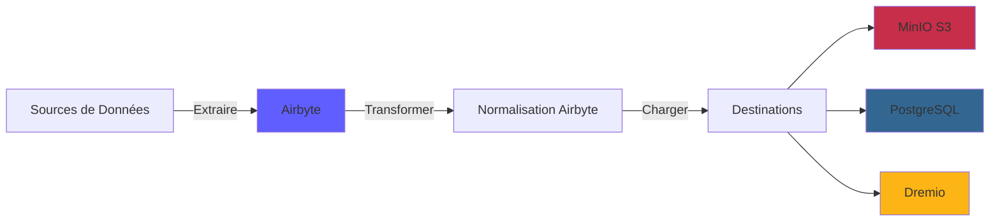
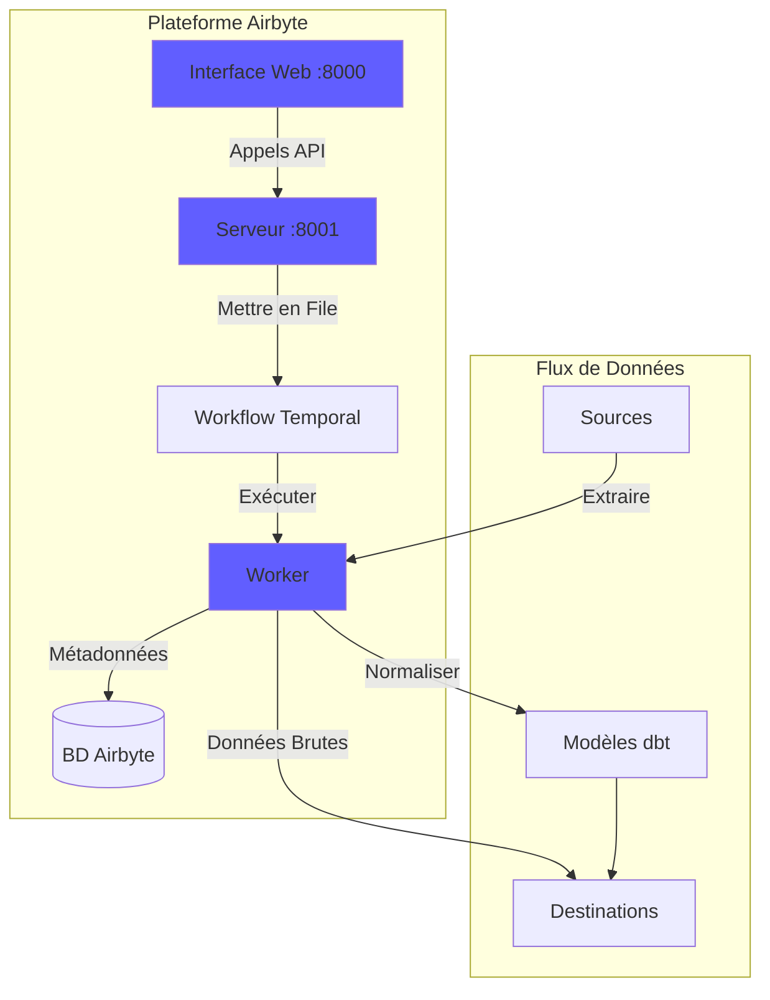
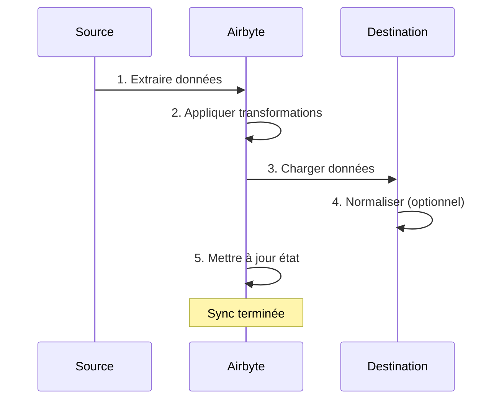
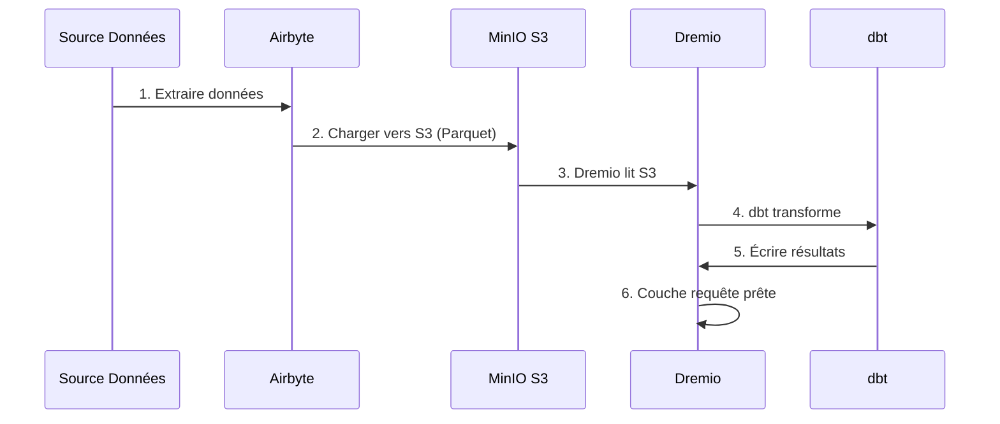

# دليل تكامل Airbyte

**الإصدار**: 3.2.0  
**آخر تحديث**: 16 أكتوبر 2025  
**اللغة**: الفرنسية

---

## ملخص

Airbyte عبارة عن منصة تكامل بيانات مفتوحة المصدر تعمل على تبسيط نقل البيانات من مصادر مختلفة إلى الوجهات. يغطي هذا الدليل دمج Airbyte في منصة البيانات، وتكوين الموصلات، وإنشاء خطوط أنابيب البيانات.



---

## ما هو إيربايت؟

### الميزات الرئيسية

- **300+ موصلات مسبقة الصنع**: واجهات برمجة التطبيقات وقواعد البيانات والملفات وتطبيقات SaaS
- **مفتوح المصدر**: مستضاف ذاتيًا مع تحكم كامل في البيانات
- ** تغيير التقاط البيانات (CDC) **: مزامنة البيانات في الوقت الحقيقي
- **الموصلات المخصصة**: أنشئ موصلات باستخدام لغة Python أو CDK ذات التعليمات البرمجية المنخفضة
- **تسوية البيانات**: تحويل JSON الخام إلى جداول منظمة
- **المراقبة والتنبيهات**: تتبع حالة المزامنة وجودة البيانات

### بنيان



---

## منشأة

### بداية سريعة

يتم تضمين Airbyte في النظام الأساسي. ابدأ بـ:

```bash
# Démarrer services Airbyte
docker-compose -f docker-compose-airbyte.yml up -d

# Vérifier statut
docker-compose -f docker-compose-airbyte.yml ps

# Voir logs
docker-compose -f docker-compose-airbyte.yml logs -f
```

### بدأت الخدمات

| الخدمات | ميناء | الوصف |
|--------|------|-------------|
| **airbyte-webapp** | 8000 | واجهة مستخدم الويب |
| **خادم airbyte** | 8001 | خادم API |
| **عامل إيربايت** | - | محرك التنفيذ الوظيفي |
| ** إيربايت مؤقت ** | 7233 | تنسيق سير العمل |
| **ايربايت-ديسيبل** | 5432 | قاعدة بيانات التعريف (PostgreSQL) |

### الوصول الأول

**واجهة الويب:**
```
http://localhost:8000
```

**المعرفات الافتراضية:**
- **البريد الإلكتروني**: `airbyte@example.com`
- **كلمة المرور**: `password`

**تغيير كلمة المرور** عند تسجيل الدخول لأول مرة لأسباب أمنية.

---

## إعدادات

### معالج التكوين

عند الوصول لأول مرة، أكمل معالج التكوين:

1. **تفضيلات البريد الإلكتروني**: قم بتكوين الإشعارات
2. **مقر البيانات**: حدد موقع تخزين البيانات
3. ** إحصائيات الاستخدام المجهولة **: قبول / رفض القياس عن بعد

### إعدادات مساحة العمل

انتقل إلى **الإعدادات > مساحة العمل**:

```yaml
Nom Workspace: Production Data Platform
ID Workspace: default
Définition Namespace: Destination Default
Format Namespace: ${SOURCE_NAMESPACE}
```

### حدود الموارد

**الملف**: `config/airbyte/config.yaml`

```yaml
# Allocation ressources par connecteur
resources:
  source:
    cpu_limit: "1.0"
    memory_limit: "1Gi"
    cpu_request: "0.25"
    memory_request: "256Mi"
  
  destination:
    cpu_limit: "1.0"
    memory_limit: "1Gi"
    cpu_request: "0.25"
    memory_request: "256Mi"
  
  orchestrator:
    cpu_limit: "0.5"
    memory_limit: "512Mi"
```

---

## موصلات

### موصلات المصدر

#### المصدر PostgreSQL

**حالة الاستخدام**: استخراج البيانات من قاعدة بيانات المعاملات

**إعدادات:**

1. انتقل إلى **المصادر > مصدر جديد**
2. حدد **PostgreSQL**
3. تكوين الاتصال:

```yaml
Host: postgres
Port: 5432
Database: source_db
Username: readonly_user
Password: [MOT_DE_PASSE_SÉCURISÉ]
SSL Mode: prefer

Méthode Réplication: Standard
  # Ou CDC pour changements temps réel:
  # Méthode Réplication: Logical Replication (CDC)
```

**اختبار الاتصال** → **إعداد المصدر**

#### مصدر REST API

**حالة الاستخدام**: استخراج البيانات من واجهات برمجة التطبيقات

**إعدادات:**

```yaml
Name: External API
URL Base: https://api.example.com/v1
Authentication:
  Type: Bearer Token
  Token: [API_TOKEN]

Endpoints:
  - name: customers
    path: /customers
    http_method: GET
    
  - name: orders
    path: /orders
    http_method: GET
    params:
      start_date: "{{ config['start_date'] }}"
```

#### الملف المصدر (CSV)

**حالة الاستخدام**: استيراد ملفات CSV

**إعدادات:**

```yaml
Dataset Name: sales_data
URL: https://storage.example.com/sales.csv
Format: CSV
Provider:
  Storage: HTTPS
  User Provided Storage:
    URL: https://storage.example.com/sales.csv
```

#### المصادر المشتركة

| المصدر | حالات الاستخدام | دعم مراكز السيطرة على الأمراض |
|--------|--------|-------------|
| ** بوستجريس كيو ال ** | كاريكاتير المعاملات | ✅ نعم |
| ** ماي إس كيو إل ** | كاريكاتير المعاملات | ✅ نعم |
| ** مونغو دي بي ** | وثائق NoSQL | ✅ نعم |
| ** قوة المبيعات ** | بيانات إدارة علاقات العملاء | ❌ لا |
| **جداول بيانات جوجل** | جداول البيانات | ❌ لا |
| **شريط** | بيانات الدفع | ❌ لا |
| **REST API** | واجهات برمجة التطبيقات المخصصة | ❌ لا |
| **S3** | تخزين الملفات | ❌ لا |

### موصلات الوجهة

#### الوجهة MinIO S3

**حالة الاستخدام**: تخزين البيانات الأولية في بحيرة البيانات

**إعدادات:**

1. انتقل إلى **الوجهات > الوجهة الجديدة**
2. حدد **S3**
3. تكوين الاتصال:

```yaml
S3 Bucket Name: datalake
S3 Bucket Path: airbyte-data/${NAMESPACE}/${STREAM_NAME}
S3 Bucket Region: us-east-1

# Point de terminaison MinIO
S3 Endpoint: http://minio:9000
Access Key ID: [MINIO_ROOT_USER]
Secret Access Key: [MINIO_ROOT_PASSWORD]

Output Format:
  Format Type: Parquet
  Compression: GZIP
  Block Size: 128MB
```

**اختبار الاتصال** → **إعداد الوجهة**

#### وجهة PostgreSQL

**حالة الاستخدام**: تحميل البيانات المحولة للتحليلات

**إعدادات:**

```yaml
Host: postgres
Port: 5432
Database: analytics_db
Username: analytics_user
Password: [MOT_DE_PASSE_SÉCURISÉ]
Default Schema: public

Normalization:
  Mode: Basic
  # Crée tables normalisées depuis JSON imbriqué
```

#### الوجهة دريميو

**حالة الاستخدام**: التحميل المباشر في مخزن البيانات

**إعدادات:**

```yaml
Host: dremio
Port: 32010
Project: Production
Dataset: airbyte_data
Username: dremio_user
Password: [DREMIO_PASSWORD]

Connection Type: Arrow Flight
SSL: false
```

---

## اتصالات

### إنشاء اتصال

يربط الاتصال المصدر بالوجهة.



#### خطوة بخطوة

1. ** انتقل إلى الاتصالات > اتصال جديد **

2. **تحديد المصدر**: اختر المصدر الذي تم تكوينه (على سبيل المثال: PostgreSQL)

3. **حدد الوجهة**: اختر الوجهة (على سبيل المثال: MinIO S3)

4. **تكوين المزامنة**:

```yaml
Nom Connexion: PostgreSQL → MinIO
Fréquence Réplication: Every 24 hours
Namespace Destination: Custom
  Format Namespace: production_${SOURCE_NAMESPACE}

Streams:
  - customers
    Mode Sync: Full Refresh | Overwrite
    Champ Curseur: updated_at
    Clé Primaire: customer_id
    
  - orders
    Mode Sync: Incremental | Append
    Champ Curseur: created_at
    Clé Primaire: order_id
    
  - products
    Mode Sync: Full Refresh | Overwrite
    Clé Primaire: product_id
```

5. **تكوين التسوية** (اختياري):

```yaml
Normalization:
  Enable: true
  Option: Basic Normalization
  # Convertit JSON imbriqué en tables plates
```

6. **اختبار الاتصال** → **إعداد الاتصال**

### أوضاع المزامنة

| أزياء | الوصف | حالات الاستخدام |
|------|------------|-------------|
| **تحديث كامل\| الكتابة الفوقية** | استبدال كافة البيانات | جداول الأبعاد |
| **تحديث كامل\| إلحاق** | إضافة كافة السجلات | التتبع التاريخي |
| **تزايدي\| إلحاق** | إضافة سجلات جديدة/محدثة | جداول الحقائق |
| **تزايدي\| مخدوع** | تحديث السجلات الموجودة | SCD النوع 1 |

### تخطيط

**خيارات التردد:**
- **يدوي**: يتم التشغيل يدويًا
- **كل ساعة**: كل ساعة
- **يوميًا**: كل 24 ساعة (حدد الوقت)
- **أسبوعيًا**: أيام محددة من الأسبوع
- **Cron**: جدولة مخصصة (على سبيل المثال: `0 2 * * *`)

**أمثلة على الجداول:**
```yaml
# Toutes les 6 heures
Cron: 0 */6 * * *

# Jours de semaine à 2h du matin
Cron: 0 2 * * 1-5

# Premier jour du mois
Cron: 0 0 1 * *
```

---

## تحويل البيانات

### التطبيع الأساسي

يتضمن Airbyte **التطبيع الأساسي** باستخدام dbt:

**ماذا تفعل:**
- تحويل JSON المتداخلة إلى جداول مسطحة
- إنشاء الجداول `_airbyte_raw_*` (JSON الخام)
- إنشاء جداول موحدة (منظمة).
- إضافة أعمدة بيانات التعريف (`_airbyte_emitted_at`, `_airbyte_normalized_at`)

**مثال:**

**خام JSON** (`_airbyte_raw_customers`):
```json
{
  "_airbyte_ab_id": "uuid-123",
  "_airbyte_emitted_at": "2025-10-16T10:00:00Z",
  "_airbyte_data": {
    "id": 1,
    "name": "Acme Corp",
    "contact": {
      "email": "info@acme.com",
      "phone": "+1234567890"
    },
    "addresses": [
      {"type": "billing", "city": "New York"},
      {"type": "shipping", "city": "Boston"}
    ]
  }
}
```

**الجداول الموحدة:**

`customers`:
```sql
id | name | contact_email | contact_phone | _airbyte_normalized_at
1 | Acme Corp | info@acme.com | +1234567890 | 2025-10-16 10:05:00
```

`customers_addresses`:
```sql
_airbyte_customers_hashid | type | city
hash-123 | billing | New York
hash-123 | shipping | Boston
```

### التحويلات المخصصة (dbt)

للتحويلات المتقدمة، استخدم dbt:

1. **تعطيل تسوية Airbyte**
2. **إنشاء نماذج dbt** الجداول المرجعية `_airbyte_raw_*`
3. ** قم بتشغيل dbt ** بعد مزامنة Airbyte

**مثال لنموذج dbt:**
```sql
-- models/staging/stg_customers.sql
with source as (
    select * from {{ source('airbyte_raw', '_airbyte_raw_customers') }}
),

parsed as (
    select
        _airbyte_ab_id,
        _airbyte_emitted_at,
        (_airbyte_data->>'id')::int as customer_id,
        _airbyte_data->>'name' as customer_name,
        _airbyte_data->'contact'->>'email' as email,
        _airbyte_data->'contact'->>'phone' as phone
    from source
)

select * from parsed
```

---

## يراقب

### حالة المزامنة

**واجهة الويب للوحة التحكم:**
- **الاتصالات**: شاهد جميع الاتصالات
- **سجل المزامنة**: وظائف المزامنة السابقة
- **سجلات المزامنة**: سجلات مفصلة لكل مهمة

**مؤشرات الحالة:**
- 🟢 **Succeeded**: اكتملت المزامنة بنجاح
- 🔴 **فشل**: فشلت المزامنة (التحقق من السجلات)
- 🟡 **قيد التشغيل**: المزامنة قيد التقدم
- ⚪ **ملغاة**: تم إلغاء المزامنة من قبل المستخدم

### السجلات

**راجع سجلات المزامنة:**
```bash
# Logs serveur Airbyte
docker-compose -f docker-compose-airbyte.yml logs airbyte-server

# Logs worker (exécution sync réelle)
docker-compose -f docker-compose-airbyte.yml logs airbyte-worker

# Logs job spécifique
# Disponible dans Interface Web: Connections > [Connection] > Job History > [Job]
```

### المقاييس

**المقاييس الرئيسية التي يجب مراقبتها:**
- **التسجيلات المتزامنة**: عدد التسجيلات لكل مزامنة
- **البايتات المتزامنة**: حجم البيانات المنقولة
- **مدة المزامنة**: الوقت المستغرق لكل مزامنة
- **معدل الفشل**: النسبة المئوية لعمليات المزامنة الفاشلة

**مقاييس التصدير:**
```bash
# API Airbyte
curl -X GET "http://localhost:8001/api/v1/jobs/list" \
  -H "Content-Type: application/json" \
  -d '{
    "configTypes": ["sync"],
    "configId": "connection-id"
  }'
```

### التنبيهات

**تكوين التنبيهات** في **الإعدادات > الإشعارات**:

```yaml
Type Notification: Slack
URL Webhook: https://hooks.slack.com/services/VOTRE/WEBHOOK/URL

Événements:
  - Échec Sync
  - Succès Sync (optionnel)
  - Connexion Désactivée

Conditions:
  - Seuil échec: 3 échecs consécutifs
```

---

## استخدام واجهة برمجة التطبيقات

### المصادقة

```bash
# Pas d'authentification requise pour localhost
# Pour production, configurez auth dans docker-compose-airbyte.yml
```

### استدعاءات واجهة برمجة التطبيقات الشائعة

#### قائمة المصادر

```bash
curl -X POST "http://localhost:8001/api/v1/sources/list" \
  -H "Content-Type: application/json" \
  -d '{
    "workspaceId": "workspace-id"
  }'
```

#### إنشاء اتصال

```bash
curl -X POST "http://localhost:8001/api/v1/connections/create" \
  -H "Content-Type: application/json" \
  -d '{
    "sourceId": "source-id",
    "destinationId": "destination-id",
    "syncCatalog": {
      "streams": [
        {
          "stream": {
            "name": "customers",
            "jsonSchema": {...}
          },
          "config": {
            "syncMode": "incremental",
            "destinationSyncMode": "append",
            "cursorField": ["updated_at"]
          }
        }
      ]
    },
    "schedule": {
      "units": 24,
      "timeUnit": "hours"
    }
  }'
```

#### مزامنة الزناد

```bash
curl -X POST "http://localhost:8001/api/v1/connections/sync" \
  -H "Content-Type: application/json" \
  -d '{
    "connectionId": "connection-id"
  }'
```

#### احصل على حالة الوظيفة

```bash
curl -X POST "http://localhost:8001/api/v1/jobs/get" \
  -H "Content-Type: application/json" \
  -d '{
    "id": "job-id"
  }'
```

---

## التكامل مع دريميو

### سير العمل



### خطوات التكوين

1. ** قم بتكوين Airbyte للشحن إلى MinIO S3 ** (انظر أعلاه)

2. ** أضف مصدر S3 في Drimio: **

```sql
-- Dans Interface Dremio: Sources > Add Source > S3
Nom Source: AirbyteData
Authentication: AWS Access Key
Clé Accès: [MINIO_ROOT_USER]
Clé Secrète: [MINIO_ROOT_PASSWORD]
Chemin Racine: /
Propriétés Connexion:
  fs.s3a.endpoint: minio:9000
  fs.s3a.path.style.access: true
  dremio.s3.compat: true
```

3. **الاستعلام عن بيانات Airbyte في Drimio:**

```sql
-- Parcourir structure S3
SELECT * FROM AirbyteData.datalake."airbyte-data"

-- Requête table spécifique
SELECT *
FROM AirbyteData.datalake."airbyte-data".production_public.customers
LIMIT 100
```

4. **إنشاء مجموعة بيانات Drimio الافتراضية:**

```sql
CREATE VDS airbyte_customers AS
SELECT
  id as customer_id,
  name as customer_name,
  contact_email as email,
  contact_phone as phone,
  _airbyte_emitted_at as last_updated
FROM AirbyteData.datalake."airbyte-data".production_public.customers
```

5. **الاستخدام في نماذج dbt:**

```yaml
# dbt/models/sources.yml
sources:
  - name: airbyte
    schema: AirbyteData.datalake."airbyte-data".production_public
    tables:
      - name: customers
      - name: orders
      - name: products
```

---

## أفضل الممارسات

### أداء

1. **استخدم المزامنات التزايدية** كلما أمكن ذلك
2. **جدول المزامنة خارج ساعات الذروة**
3. **استخدم تنسيق الباركيه** للحصول على ضغط أفضل
4. **تقسيم الجداول الكبيرة** حسب التاريخ
5. **مراقبة استخدام الموارد** وضبط الحدود

### جودة البيانات

1. **تمكين التحقق من صحة البيانات** في موصلات المصدر
2. **استخدم المفاتيح الأساسية** لاكتشاف التكرارات
3. **تكوين التنبيهات** لحالات فشل المزامنة
4. **مراقبة حداثة البيانات** المقاييس
5. **تنفيذ اختبارات dbt** على البيانات الأولية

### حماية

1. **استخدم معرفات للقراءة فقط** للمصادر
2. ** تخزين الأسرار ** في متغيرات البيئة
3. **تمكين SSL/TLS** للاتصالات
4. **قم بتجديد المعرّفات الخاصة بك** بانتظام
5. **تدقيق سجلات الوصول** بشكل دوري

### تحسين التكلفة

1. **استخدم الضغط** (GZIP، SNAPPY)
2. **إلغاء البيانات المكررة** في المصدر
3. ** أرشفة البيانات القديمة ** إلى التخزين البارد
4. **مراقبة تردد المزامنة** مقابل المتطلبات
5. **تنظيف بيانات المزامنة الفاشلة**

---

## استكشاف الأخطاء وإصلاحها

### المشاكل الشائعة

#### فشل المزامنة: انتهت مهلة الاتصال

**الأعراض:**
```
Failed to connect to source: Connection timeout
```

**حل:**
```bash
# Vérifier connectivité réseau
docker exec airbyte-worker ping postgres

# Vérifier règles pare-feu
# Vérifier hôte/port source dans configuration
```

#### خطأ نفاد الذاكرة

**الأعراض:**
```
OOMKilled: Container exceeded memory limit
```

**حل:**
```yaml
# Augmenter limites mémoire dans docker-compose-airbyte.yml
services:
  airbyte-worker:
    environment:
      - JOB_MAIN_CONTAINER_MEMORY_LIMIT=2Gi
      - JOB_MAIN_CONTAINER_MEMORY_REQUEST=1Gi
```

#### فشل التطبيع

**الأعراض:**
```
Normalization failed: dbt compilation error
```

**حل:**
```bash
# Vérifier logs dbt
docker-compose -f docker-compose-airbyte.yml logs airbyte-worker | grep dbt

# Désactiver normalisation et utiliser dbt personnalisé
# Meilleur contrôle sur logique transformation
```

#### أداء المزامنة البطيء

**تشخبص:**
```bash
# Vérifier logs sync pour goulot d'étranglement
# Causes courantes:
# - Grand volume données
# - Requête source lente
# - Latence réseau
# - Ressources insuffisantes
```

**الحلول:**
- زيادة وتيرة المزامنة المتزايدة
- إضافة فهرس إلى حقول المؤشر
- استخدم مراكز السيطرة على الأمراض (CDC) للمصادر في الوقت الحقيقي
- توسيع نطاق موارد العامل

---

## موضوعات متقدمة

### موصلات مخصصة

أنشئ موصلات مخصصة باستخدام Airbyte CDK:

```bash
# Cloner modèle connecteur
git clone https://github.com/airbytehq/airbyte.git
cd airbyte/airbyte-integrations/connector-templates/python

# Créer nouveau connecteur
./create_connector.sh MyCustomAPI

# Implémenter logique connecteur
# Éditer source.py, spec.yaml, schemas/

# Tester localement
python main.py check --config secrets/config.json
python main.py discover --config secrets/config.json
python main.py read --config secrets/config.json --catalog integration_tests/configured_catalog.json
```

### تنسيق واجهة برمجة التطبيقات

أتمتة Airbyte مع بايثون:

```python
import requests

AIRBYTE_API = "http://localhost:8001/api/v1"

def trigger_sync(connection_id: str):
    """Déclencher sync manuelle pour connexion"""
    response = requests.post(
        f"{AIRBYTE_API}/connections/sync",
        json={"connectionId": connection_id}
    )
    return response.json()

def get_sync_status(job_id: str):
    """Vérifier statut job sync"""
    response = requests.post(
        f"{AIRBYTE_API}/jobs/get",
        json={"id": job_id}
    )
    return response.json()

# Utilisation
job = trigger_sync("my-connection-id")
status = get_sync_status(job["job"]["id"])
print(f"Statut sync: {status['job']['status']}")
```

---

## موارد

### التوثيق

- **مستندات Airbyte**: https://docs.airbyte.com
- ** كتالوج الموصلات **: https://docs.airbyte.com/integrations
- **مرجع واجهة برمجة التطبيقات**: https://airbyte-public-api-docs.s3.us-east-2.amazonaws.com/rapidoc-api-docs.html

### مجتمع

- **سلاك**: https://slack.airbyte.io
- ** جيثب **: https://github.com/airbytehq/airbyte
- **المنتدى**: https://discuss.airbyte.io

---

## الخطوات التالية

بعد تكوين Airbyte:

1. **إعداد Dremio** - [دليل إعداد Dremio](dremio-setup.md)
2. **إنشاء نماذج dbt** - [دليل تطوير dbt](dbt-development.md)
3. **إنشاء لوحات المعلومات** - [دليل لوحات المعلومات Superset](superset-dashboards.md)
4. **مراقبة الجودة** - [دليل جودة البيانات](data-quality.md)

---

**إصدار دليل تكامل Airbyte**: 3.2.0  
**آخر تحديث**: 16 أكتوبر 2025  
** تتم صيانته بواسطة **: فريق منصة البيانات