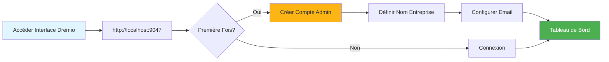
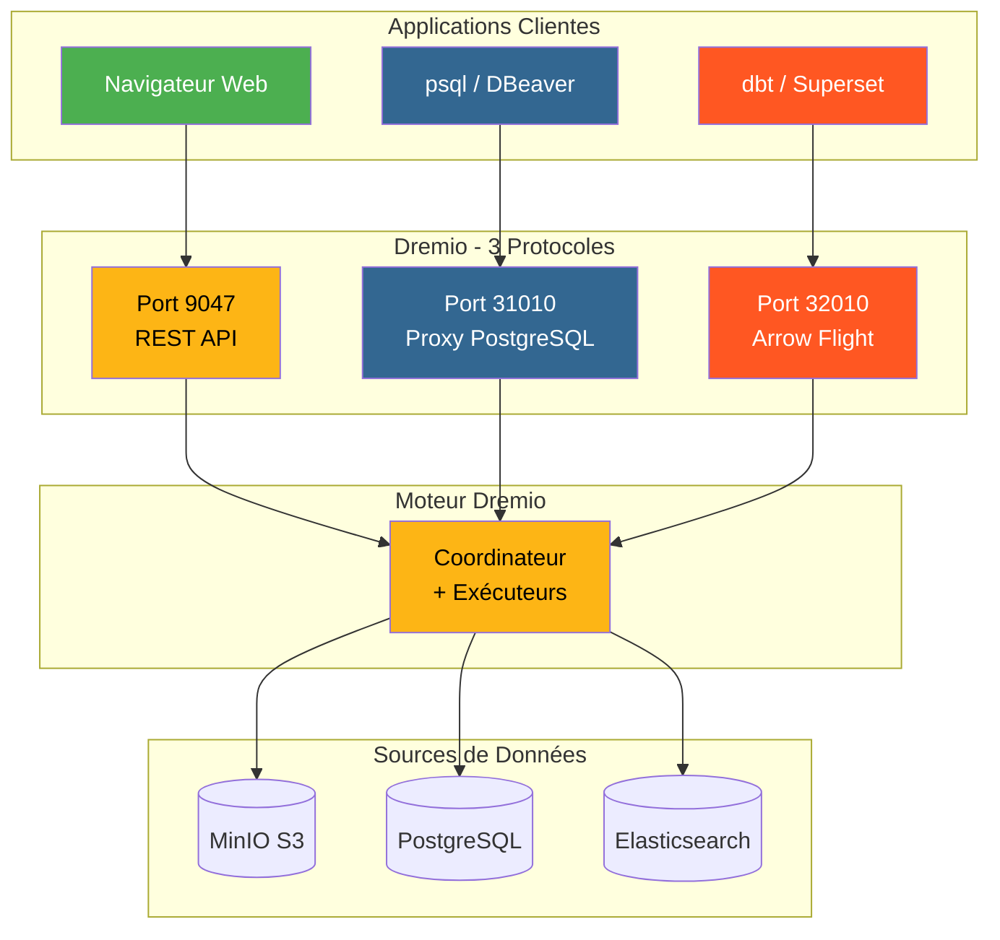
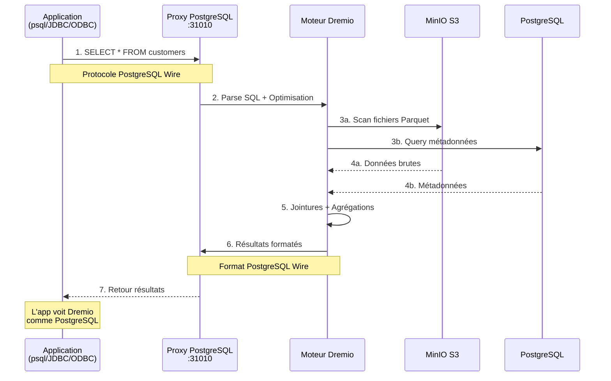
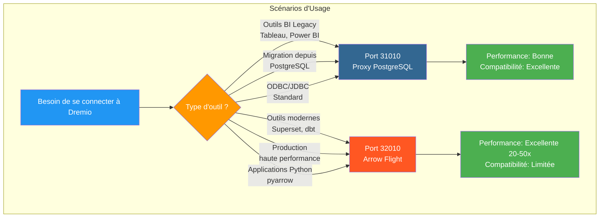
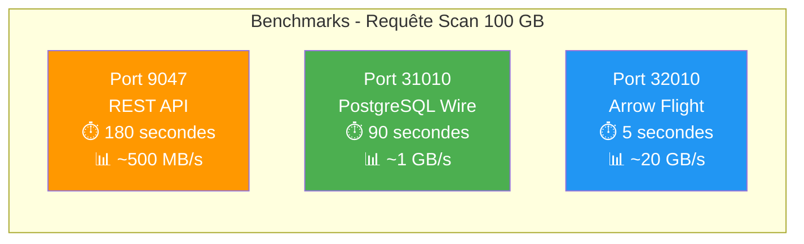
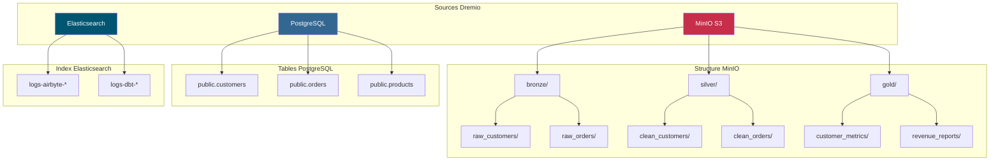
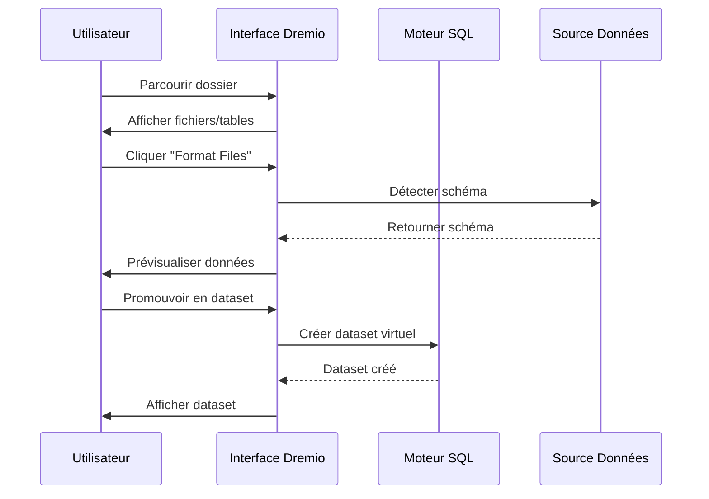
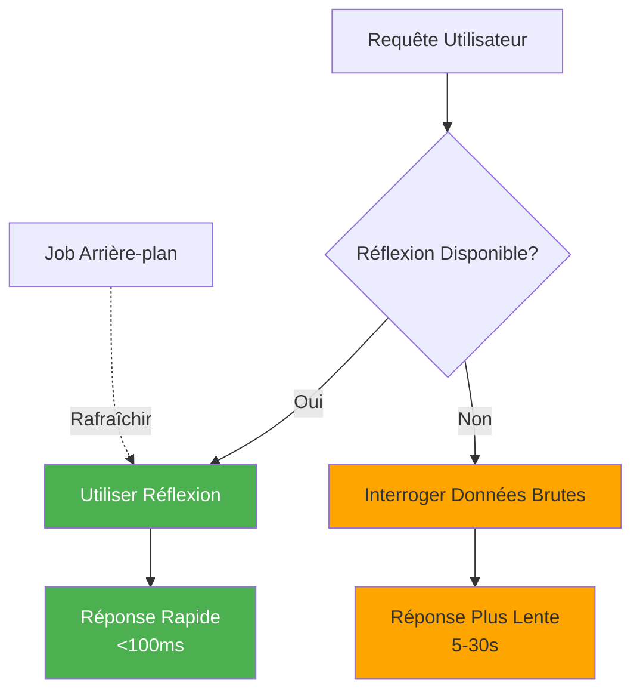

# دليل تكوين Dremio

**الإصدار**: 3.2.0  
**آخر تحديث**: 16 أكتوبر 2025  
**اللغة**: الفرنسية

## جدول المحتويات

1. [نظرة عامة](#overview)
2. [التكوين الأولي](#التكوين الأولي)
3. [تكوين مصدر البيانات](#data-source-configuration)
4. [مجموعات البيانات الافتراضية](#مجموعات البيانات الافتراضية)
5. [الأفكار (استعلامات التسريع)](#thinks-acceleration-queries)
6. [الأمن والتحكم في الوصول](#security-and-access-control)
7. [تحسين الأداء](#تحسين الأداء)
8. [التكامل مع dbt](#integration-with-dbt)
9. [المراقبة والصيانة](#المراقبة والصيانة)
10. [استكشاف الأخطاء وإصلاحها](#استكشاف الأخطاء وإصلاحها)

---

## ملخص

Dremio عبارة عن منصة لتخزين البيانات توفر واجهة موحدة للاستعلام عن البيانات عبر مصادر متعددة. يغطي هذا الدليل كل شيء بدءًا من الإعداد الأولي وحتى تقنيات التحسين المتقدمة.

### ما هو دريميو؟

يجمع Dremio بين مرونة بحيرة البيانات وأداء مستودع البيانات:

- **محاكاة البيانات الافتراضية**: الاستعلام عن البيانات دون نقلها أو نسخها
- **تسريع الاستعلام**: التخزين المؤقت التلقائي مع الانعكاسات
- **تحليلات الخدمة الذاتية**: يمكن لمستخدمي الأعمال استكشاف البيانات مباشرة
- **SQL Standard**: لا توجد لغة استعلام خاصة
- **سهم Apache**: تنسيق عمودي عالي الأداء

### الميزات الرئيسية

| ميزة | الوصف | الربح |
|----------------|---------|---------|
| **خواطر** | تسريع الاستعلام الذكي | استعلامات أسرع 10-100x |
| **المحاكاة الافتراضية للبيانات** | رؤية موحدة للمصادر | لا يوجد تكرار للبيانات |
| ** رحلة السهم ** | نقل بيانات عالي السرعة | أسرع بـ 20 إلى 50 مرة من ODBC/JDBC |
| **الطبقة الدلالية** | أسماء الحقول الموجهة للأعمال | تحليلات الخدمة الذاتية |
| ** بوابة للبيانات ** | التحكم في إصدار مجموعة البيانات | التعاون والتراجع |

---

## التكوين الأولي

### المتطلبات الأساسية

قبل أن تبدأ، تأكد من أن لديك:
- تشغيل حاوية Dremio (راجع [دليل التثبيت](../getting-started/installation.md))
- الوصول إلى مصادر البيانات (MinIO، PostgreSQL، وما إلى ذلك)
- بيانات اعتماد المشرف

### الاتصال الأول



#### الخطوة 1: الوصول إلى واجهة Drimio

افتح متصفحك وانتقل إلى:
```
http://localhost:9047
```

#### الخطوة 2: إنشاء حساب المسؤول

عند التشغيل لأول مرة، سيُطلب منك إنشاء حساب مسؤول:

```
Nom d'utilisateur: admin
Prénom: Admin
Nom: Utilisateur
Email: admin@example.com
Mot de passe: [mot de passe sécurisé]
```

**ملاحظة أمنية**: استخدم كلمة مرور قوية مكونة من 12 حرفًا على الأقل، بما في ذلك الأحرف الكبيرة والصغيرة والأرقام والأحرف الخاصة.

#### الخطوة 3: الإعداد الأولي

```json
{
  "companyName": "Votre Organisation",
  "supportEmail": "support@talentys.eu",
  "supportKey": "votre-clé-support-si-entreprise"
}
```

### ملفات التكوين

تتم إدارة تكوين Drimio عبر `dremio.conf`:

```conf
# dremio.conf

paths: {
  local: "/opt/dremio/data"
  dist: "dremioS3:///dremio-data"
}

services: {
  coordinator.enabled: true
  coordinator.master.enabled: true
  
  executor.enabled: true
  
  # Paramètres mémoire
  coordinator.master.heap_memory_mb: 4096
  executor.heap_memory_mb: 8192
}

# Configuration réseau
services.coordinator.web.port: 9047
services.coordinator.client.port: 31010
services.coordinator.flight.port: 32010

# Ajustement performance
store.plugin.max_metadata_leaf_columns: 800
planner.enable_broadcast_join: true
planner.slice_target: 100000
```

### متغيرات البيئة

```bash
# Section environment de docker-compose.yml
environment:
  - DREMIO_JAVA_SERVER_EXTRA_OPTS=-Xms2g -Xmx4g
  - DREMIO_JAVA_FLIGHT_EXTRA_OPTS=-Xms1g -Xmx2g
  - DREMIO_MAX_MEMORY_SIZE_MB=8192
  - DREMIO_HOME=/opt/dremio
```

### الاتصال عبر وكيل PostgreSQL

يعرض Dremio واجهة متوافقة مع PostgreSQL على المنفذ 31010، مما يسمح للأدوات المتوافقة مع PostgreSQL بالاتصال دون تعديلات.

#### بنية اتصالات دريميو



#### تدفق الاستعلام عبر وكيل PostgreSQL



#### تكوين الوكيل

يتم تمكين وكيل PostgreSQL تلقائيًا في `dremio.conf`:

```conf
# Configuration du proxy PostgreSQL (ODBC/JDBC)
services.coordinator.client.port: 31010
```

#### الاتصال بـ psql

```bash
# Connexion directe avec psql
psql -h localhost -p 31010 -U admin -d datalake

# Exemple de requête
psql -h localhost -p 31010 -U admin -d datalake -c "SELECT * FROM MinIO.datalake.customers LIMIT 10;"
```

#### الاتصال بـ DBeaver / pgAdmin

إعداد الاتصال:

```yaml
Type: PostgreSQL
Host: localhost
Port: 31010
Database: datalake
Username: admin
Password: <votre-mot-de-passe>
SSL: Désactivé (en développement)
```

#### قنوات الاتصال

**جدبك:**
```java
String url = "jdbc:postgresql://localhost:31010/datalake";
Properties props = new Properties();
props.setProperty("user", "admin");
props.setProperty("password", "votre-mot-de-passe");
Connection conn = DriverManager.getConnection(url, props);
```

**ODBC (DSN):**
```ini
[Dremio via PostgreSQL]
Driver=PostgreSQL Unicode
Server=localhost
Port=31010
Database=datalake
Username=admin
Password=<votre-mot-de-passe>
SSLMode=disable
```

** بايثون (psycopg2):**
```python
import psycopg2

conn = psycopg2.connect(
    host="localhost",
    port=31010,
    database="datalake",
    user="admin",
    password="votre-mot-de-passe"
)

cursor = conn.cursor()
cursor.execute("SELECT * FROM MinIO.datalake.customers LIMIT 10")
rows = cursor.fetchall()
```

#### متى يجب استخدام وكيل PostgreSQL



| السيناريو | استخدم وكيل PostgreSQL | استخدم رحلة السهم |
|---------|----------------------------------------|------|
| **أدوات BI القديمة** (لا تدعم رحلة السهم) | ✅ نعم | ❌ لا |
| **الترحيل من PostgreSQL** (رمز JDBC/ODBC الموجود) | ✅ نعم | ❌ لا |
| **إنتاج عالي الأداء** | ❌ لا | ✅ نعم (أسرع 20-50x) |
| ** سوبر سيت، دي بي تي، أدوات حديثة ** | ❌ لا | ✅ نعم |
| ** التطوير/الاختبار السريع ** | ✅ نعم (مألوف) | ⚠️ كلاهما موافق |

#### مقارنة أداء المنافذ الثلاثة



**توصية**: استخدم وكيل PostgreSQL (المنفذ 31010) من أجل **التوافق** وArrow Flight (المنفذ 32010) من أجل **أداء الإنتاج**.

---

## تكوين مصادر البيانات

### إضافة المصدر MinIO S3

MinIO هو مخزن البيانات الأساسي الخاص بك.

#### الخطوة 1: انتقل إلى المصادر

```
Interface Dremio → Datasets → Add Source → Object Storage → Amazon S3
```

#### الخطوة 2: تكوين اتصال S3

```json
{
  "name": "MinIO",
  "config": {
    "credentialType": "ACCESS_KEY",
    "accessKey": "minioadmin",
    "accessSecret": "minioadmin",
    "secure": false,
    "externalBucketList": [
      "datalake"
    ],
    "enableAsync": true,
    "compatibilityMode": true,
    "rootPath": "/",
    "defaultCtasFormat": "PARQUET",
    "propertyList": [
      {
        "name": "fs.s3a.path.style.access",
        "value": "true"
      },
      {
        "name": "fs.s3a.endpoint",
        "value": "minio:9000"
      },
      {
        "name": "dremio.s3.compat",
        "value": "true"
      }
    ]
  }
}
```

#### الخطوة 3: اختبار الاتصال

```sql
-- Requête test pour vérifier connexion MinIO
SELECT * FROM MinIO.datalake.bronze.customers LIMIT 10;
```

**النتيجة المتوقعة**:
```
customer_id | name           | email
------------|----------------|------------------
1           | John Doe       | john@example.com
2           | Jane Smith     | jane@example.com
...
```

### إضافة مصدر PostgreSQL

#### يثبت

```
Interface Dremio → Datasets → Add Source → Relational → PostgreSQL
```

```json
{
  "name": "PostgreSQL",
  "config": {
    "hostname": "postgres",
    "port": "5432",
    "databaseName": "datawarehouse",
    "username": "postgres",
    "password": "postgres",
    "authenticationType": "MASTER",
    "fetchSize": 2000,
    "encryptionValidationMode": "CERTIFICATE_AND_HOSTNAME_VALIDATION"
  }
}
```

### إضافة مصدر Elasticsearch

```json
{
  "name": "Elasticsearch",
  "config": {
    "hostList": [
      {"hostname": "elasticsearch", "port": 9200}
    ],
    "authenticationType": "ANONYMOUS",
    "scrollSize": 4000,
    "scrollTimeout": 60000,
    "scriptsEnabled": true,
    "showHiddenIndices": false,
    "showIdColumn": false
  }
}
```

### تنظيم المصادر



---

## مجموعات البيانات الافتراضية

تسمح لك مجموعات البيانات الافتراضية بإنشاء طرق عرض محولة وقابلة لإعادة الاستخدام لبياناتك.

### إنشاء مجموعات بيانات افتراضية

#### من محرر SQL

```sql
-- Créer dataset jointif
SELECT 
    c.customer_id,
    c.name,
    c.email,
    c.state,
    COUNT(o.order_id) as total_orders,
    SUM(o.amount) as lifetime_value
FROM MinIO.datalake.silver.customers c
LEFT JOIN MinIO.datalake.silver.orders o
    ON c.customer_id = o.customer_id
GROUP BY c.customer_id, c.name, c.email, c.state;

-- Sauvegarder comme dataset virtuel: "customer_summary"
```

**حفظ الموقع**:
```
@username → customer_summary
```

#### من الواجهة



**خطوات**:
1. انتقل إلى مصدر MiniIO
2. تصفح حتى `datalake/bronze/customers/`
3. انقر فوق الزر "تنسيق الملفات".
4. افحص النمط المكتشف
5. انقر فوق "حفظ" للترقية إلى مجموعة البيانات

### تنظيم مجموعات البيانات

إنشاء بنية منطقية باستخدام المسافات والمجلدات:

```
Dremio
├── @admin (Espace Personnel)
│   └── dev (Dossier)
│       ├── test_customers
│       └── test_orders
├── Production (Espace Partagé)
│   ├── Dimensions (Dossier)
│   │   ├── dim_customers
│   │   ├── dim_products
│   │   └── dim_dates
│   └── Facts (Dossier)
│       ├── fct_orders
│       ├── fct_revenue
│       └── fct_customer_lifetime_value
└── Analytics (Espace Partagé)
    ├── customer_metrics
    ├── sales_dashboard_data
    └── marketing_attribution
```

### الطبقة الدلالية

إضافة أسماء وأوصاف موجهة نحو الأعمال:

```sql
-- Noms colonnes techniques originaux
SELECT
    cust_id,
    cust_nm,
    cust_em,
    crt_dt
FROM raw.customers;

-- Créer dataset virtuel avec noms sémantiques
SELECT
    cust_id AS "ID Client",
    cust_nm AS "Nom Client",
    cust_em AS "Adresse Email",
    crt_dt AS "Date Inscription"
FROM raw.customers;
```

**إضافة الأوصاف**:
```
Interface → Dataset → Colonne → Éditer Description

ID Client: Identifiant unique pour chaque client
Nom Client: Nom complet du client
Adresse Email: Email principal pour communication
Date Inscription: Date inscription client sur plateforme
```

---

## تأملات (استعلامات التسريع)

الانعكاسات هي آلية التخزين المؤقت الذكية الخاصة بـDremio والتي تعمل على تحسين أداء الاستعلام بشكل ملحوظ.

### أنواع التأملات

#### 1. تأملات أولية

تخزين مجموعة فرعية من الأعمدة لاسترجاعها بسرعة:

```sql
-- Créer réflexion brute
CREATE REFLECTION raw_customer_base
ON Production.Dimensions.dim_customers
USING DISPLAY (
    customer_id,
    name,
    email,
    state,
    registration_date
);
```

** حالة الاستخدام **:
- لوحات المعلومات الاستعلام عن أعمدة محددة
- تقارير مع مجموعات فرعية من الأعمدة
- الاستعلامات الاستكشافية

#### 2. تأملات التجميع

حساب التجميعات مسبقًا للحصول على نتائج فورية:

```sql
-- Créer réflexion agrégation
CREATE REFLECTION agg_daily_revenue
ON Production.Facts.fct_orders
USING 
  DIMENSIONS (order_date, product_id, region)
  MEASURES (
    SUM(amount),
    COUNT(*),
    AVG(amount),
    MIN(amount),
    MAX(amount)
  );
```

** حالة الاستخدام **:
- لوحات القيادة التنفيذية
- تقارير موجزة
- تحليل الاتجاه

### انعكاس التكوين



#### سياسة المرطبات

```
Interface → Dataset → Settings → Reflections → Refresh Policy
```

**خيارات**:
- **عدم التحديث مطلقًا**: البيانات الثابتة (مثل الأرشيفات التاريخية)
- **التحديث كل [ساعة واحدة]**: تحديثات دورية
- ** التحديث عند تغيير مجموعة البيانات **: المزامنة في الوقت الحقيقي

```json
{
  "refreshPolicy": {
    "method": "PERIOD",
    "refreshPeriod": 3600000,  // 1 heure en millisecondes
    "gracePeriod": 10800000    // 3 heures
  }
}
```

#### سياسة انتهاء الصلاحية

```json
{
  "expirationPolicy": {
    "method": "NEVER",
    // ou
    "method": "AFTER_PERIOD",
    "expirationPeriod": 604800000  // 7 jours
  }
}
```

### الممارسات الجيدة للتأملات

#### 1. ابدأ بالاستعلامات ذات القيمة العالية

تحديد الاستعلامات البطيئة من التاريخ:

```sql
-- Interroger historique jobs pour trouver requêtes lentes
SELECT 
    query_text,
    execution_time_ms,
    dataset_path
FROM sys.jobs
WHERE execution_time_ms > 5000  -- Plus lent que 5 secondes
ORDER BY execution_time_ms DESC
LIMIT 100;
```

#### 2. إنشاء تأملات مستهدفة

```sql
-- Mauvais: Réflexion avec trop de dimensions
CREATE REFLECTION too_broad
USING DIMENSIONS (col1, col2, col3, col4, col5, col6)
MEASURES (SUM(amount));

-- Bon: Réflexion ciblée pour cas d'usage spécifique
CREATE REFLECTION targeted
USING DIMENSIONS (order_date, product_category)
MEASURES (SUM(revenue), COUNT(DISTINCT customer_id));
```

#### 3. انعكاس تغطية الشاشة

```sql
-- Vérifier quelles requêtes sont accélérées
SELECT 
    query_text,
    acceleration_profile.accelerated,
    acceleration_profile.reflection_ids
FROM sys.jobs
WHERE start_time > CURRENT_DATE - INTERVAL '7' DAY;
```

### أفكار الأداء المؤثر

| حجم مجموعة البيانات | اكتب الاستعلام | بلا تأمل | مع الانعكاس | تسريع |
|----------------|-------------|----------------|----------------|-------------|
| 1M خطوط | حدد بسيط | 500 مللي ثانية | 50 مللي ثانية | 10x |
| 10M خطوط | التجميع | 15 ثانية | 200 مللي ثانية | 75x |
| 100 مليون خط | انضمام مجمع | دقيقتين | 1س | 120x |
| خطوط 1B | المجموعة حسب | 10 دقائق | 5ث | 120x |

---

## الأمن والتحكم في الوصول

### إدارة المستخدم

#### إنشاء مستخدمين

```
Interface → Account Settings → Users → Add User
```

```json
{
  "username": "analyst_user",
  "firstName": "Data",
  "lastName": "Analyst",
  "email": "analyst@example.com",
  "password": "secure_password"
}
```

#### أدوار المستخدم

| الدور | أذونات | حالات الاستخدام |
|------|------------|-------------|
| **المسؤول** | الوصول الكامل | إدارة النظام |
| **المستخدم** | الاستعلام وإنشاء مجموعات البيانات الشخصية | محللون وعلماء بيانات |
| ** مستخدم محدود ** | الاستعلام فقط، وليس إنشاء مجموعة البيانات | مستخدمو الأعمال، المشاهدون |

### أذونات الفضاء

```
Interface → Space → Settings → Privileges
```

**أنواع الأذونات**:
- **عرض**: يمكنه عرض مجموعات البيانات والاستعلام عنها
- **تعديل**: يمكن تعديل تعريفات مجموعة البيانات
- **إدارة المنح**: يمكن إدارة الأذونات
- **المالك**: تحكم كامل

**مثال**:
```
Espace: Production
├── Équipe Analytics → View, Modify
├── Data Engineers → Owner
└── Exécutifs → View
```

### أمان على مستوى الخط

تنفيذ التصفية على مستوى الصف:

```sql
-- Créer vue avec filtre niveau ligne
CREATE VDS customer_data_filtered AS
SELECT *
FROM Production.Dimensions.dim_customers
WHERE 
  CASE 
    WHEN CURRENT_USER = 'admin' THEN TRUE
    WHEN region = (
      SELECT home_region 
      FROM users 
      WHERE username = CURRENT_USER
    ) THEN TRUE
    ELSE FALSE
  END;
```

### عمود مستوى الأمان

إخفاء الأعمدة الحساسة:

```sql
-- Masquer données sensibles pour utilisateurs non-admin
CREATE VDS customer_data_masked AS
SELECT
    customer_id,
    name,
    CASE 
      WHEN CURRENT_USER IN ('admin', 'data_engineer')
      THEN email
      ELSE CONCAT(SUBSTRING(email, 1, 3), '***@***.com')
    END AS email,
    state
FROM Production.Dimensions.dim_customers;
```

### تكامل OAuth

```conf
# dremio.conf
services.coordinator.web.auth.type: "oauth"
services.coordinator.web.auth.oauth.providerId: "okta"
services.coordinator.web.auth.oauth.clientId: "your-client-id"
services.coordinator.web.auth.oauth.clientSecret: "your-client-secret"
services.coordinator.web.auth.oauth.authorizeUrl: "https://your-domain.okta.com/oauth2/v1/authorize"
services.coordinator.web.auth.oauth.tokenUrl: "https://your-domain.okta.com/oauth2/v1/token"
```

---

## تحسين الأداء

### تقنيات تحسين الاستعلام

#### 1. تشذيب التقسيم

```sql
-- Mauvais: Scanne toutes les données
SELECT * FROM orders
WHERE amount > 100;

-- Bon: Élague partitions
SELECT * FROM orders
WHERE order_date >= '2025-10-01'
  AND order_date < '2025-11-01'
  AND amount > 100;
```

#### 2. تشذيب العمود

```sql
-- Mauvais: Lit toutes les colonnes
SELECT * FROM large_table LIMIT 100;

-- Bon: Lit uniquement colonnes nécessaires
SELECT customer_id, name, email 
FROM large_table 
LIMIT 100;
```

#### 3. الضغط المسند للأسفل

```sql
-- Filtres poussés vers couche stockage
SELECT c.name, o.amount
FROM customers c
JOIN orders o ON c.customer_id = o.customer_id
WHERE o.order_date >= CURRENT_DATE - INTERVAL '30' DAY;
-- Filtre appliqué avant jointure
```

#### 4. انضم إلى التحسين

```sql
-- Utiliser broadcast join pour petites dimensions
SELECT /*+ BROADCAST(d) */
    f.order_id,
    d.product_name,
    f.amount
FROM facts.orders f
JOIN dimensions.products d
    ON f.product_id = d.product_id;
```

### تكوين الذاكرة

```conf
# dremio.conf

# Augmenter mémoire pour grandes requêtes
services.executor.heap_memory_mb: 32768

# Configurer spill to disk
spill.directory: "/opt/dremio/spill"
spill.enable: true

# Limites mémoire requête
planner.memory.max_query_memory_per_node: 10737418240  # 10GB
planner.memory.query_max_cost: 1000000000
```

### حجم الكتلة

| نوع التحميل | منسق | المنفذون | مجموع الكتلة |
|-------------|---------|------------|---------------|
| **صغير** | 4 وحدة معالجة مركزية، 16 جيجابايت | 2x (8 وحدة معالجة مركزية، 32 جيجابايت) | 20 وحدة معالجة مركزية، 80 جيجابايت |
| **متوسط** | 8 وحدة معالجة مركزية، 32 جيجابايت | 4x (16 وحدة معالجة مركزية، 64 جيجابايت) | 72 وحدة معالجة مركزية، 288 جيجابايت |
| **كبير** | 16 وحدة معالجة مركزية، 64 جيجابايت | 8x (32 وحدة المعالجة المركزية، 128 جيجابايت) | 272 وحدة معالجة مركزية، 1088 جيجابايت |

### مراقبة الأداء

```sql
-- Analyser performance requête
SELECT 
    query_id,
    query_text,
    start_time,
    execution_time_ms / 1000.0 AS execution_time_seconds,
    planner_estimated_cost,
    rows_returned,
    acceleration_profile.accelerated
FROM sys.jobs
WHERE start_time > CURRENT_DATE - INTERVAL '1' DAY
ORDER BY execution_time_ms DESC
LIMIT 20;
```

---

## التكامل مع dbt

### Dremio كهدف dbt

تكوين `profiles.yml`:

```yaml
# profiles.yml
dremio_project:
  target: dev
  outputs:
    dev:
      type: dremio
      threads: 4
      host: localhost
      port: 9047
      username: admin
      password: "{{ env_var('DREMIO_PASSWORD') }}"
      use_ssl: false
      space: "@admin"
      
    prod:
      type: dremio
      threads: 8
      host: dremio.example.com
      port: 443
      username: dbt_service_account
      password: "{{ env_var('DREMIO_PASSWORD') }}"
      use_ssl: true
      space: "Production"
```

### نماذج dbt على Dremio

```sql
-- models/staging/stg_customers.sql
{{
    config(
        materialized='view',
        alias='stg_customers'
    )
}}

SELECT
    customer_id,
    TRIM(UPPER(name)) AS customer_name,
    LOWER(email) AS email,
    state,
    created_at
FROM {{ source('minio', 'raw_customers') }}
WHERE customer_id IS NOT NULL
```

### استغلال التأملات في dbt

```sql
-- models/marts/fct_customer_metrics.sql
{{
    config(
        materialized='table',
        post_hook=[
            "ALTER VDS {{ this }} ENABLE RAW REFLECTION",
            "ALTER VDS {{ this }} ENABLE AGGREGATION REFLECTION 
             USING DIMENSIONS (customer_id, registration_month) 
             MEASURES (SUM(lifetime_value), COUNT(*))"
        ]
    )
}}

SELECT
    customer_id,
    DATE_TRUNC('month', registration_date) AS registration_month,
    COUNT(DISTINCT order_id) AS total_orders,
    SUM(order_amount) AS lifetime_value
FROM {{ ref('int_customer_orders') }}
GROUP BY customer_id, DATE_TRUNC('month', registration_date)
```

---

## المراقبة والصيانة

### المقاييس الرئيسية التي يجب مراقبتها

```yaml
metrics:
  - name: Performance Requête
    query: "SELECT AVG(execution_time_ms) FROM sys.jobs WHERE start_time > NOW() - INTERVAL '1' HOUR"
    threshold: 5000  # Alerte si moyenne > 5 secondes
    
  - name: Couverture Réflexion
    query: "SELECT COUNT(*) FILTER (WHERE accelerated = true) * 100.0 / COUNT(*) FROM sys.jobs WHERE start_time > NOW() - INTERVAL '1' DAY"
    threshold: 80  # Alerte si couverture < 80%
    
  - name: Requêtes Échouées
    query: "SELECT COUNT(*) FROM sys.jobs WHERE query_state = 'FAILED' AND start_time > NOW() - INTERVAL '1' HOUR"
    threshold: 10  # Alerte si > 10 échecs par heure
```

### مهام الصيانة

#### 1. تحديث الأفكار

```sql
-- Rafraîchir manuellement réflexion
ALTER REFLECTION reflection_id REFRESH;

-- Reconstruire toutes réflexions pour dataset
ALTER VDS Production.Facts.fct_orders 
REFRESH ALL REFLECTIONS;
```

#### 2. تنظيف البيانات القديمة

```sql
-- Nettoyer historique requêtes
DELETE FROM sys.jobs
WHERE start_time < CURRENT_DATE - INTERVAL '90' DAY;

-- Compacter métadonnées (Enterprise uniquement)
VACUUM CATALOG;
```

#### 3. تحديث الإحصائيات

```sql
-- Rafraîchir statistiques table
ANALYZE TABLE MinIO.datalake.silver.customers;

-- Mettre à jour métadonnées dataset
REFRESH DATASET MinIO.datalake.silver.customers;
```

---

## استكشاف الأخطاء وإصلاحها

### المشاكل الشائعة

#### المشكلة 1: بطء أداء الاستعلام

**الأعراض**: تستغرق الاستعلامات دقائق بدلاً من ثوانٍ

**تشخبص**:
```sql
-- Vérifier profil requête
SELECT * FROM sys.jobs WHERE job_id = 'your-job-id';

-- Vérifier si réflexion utilisée
SELECT acceleration_profile FROM sys.jobs WHERE job_id = 'your-job-id';
```

**الحلول**:
1. خلق الأفكار المناسبة
2. إضافة مرشحات تشذيب التقسيم
3. زيادة ذاكرة المنفذ
4. تمكين قائمة الانتظار

#### المشكلة الثانية: لا يبني الانعكاس

**الأعراض**: الانعكاس عالق في حالة "التحديث".

**تشخبص**:
```sql
-- Vérifier statut réflexion
SELECT * FROM sys.reflections WHERE status != 'ACTIVE';

-- Vérifier erreurs réflexion
SELECT * FROM sys.reflection_dependencies;
```

**الحلول**:
1. تحقق من بيانات المصدر لمعرفة تغييرات المخطط
2. تحقق من مساحة القرص الكافية
3. زيادة انعكاس البناء المهلة
4. تعطيل وإعادة تمكين الانعكاس

#### المشكلة 3: انتهاء مهلة الاتصال

**الأعراض**: أخطاء "مهلة الاتصال" عند الاستعلام عن المصادر

**الحلول**:
```conf
# dremio.conf
store.plugin.keep_alive_ms: 30000
store.plugin.timeout_ms: 120000
```

#### المشكلة 4: نقص الذاكرة

**الأعراض**: "OutOfMemoryError" في السجلات

**الحلول**:
```conf
# Augmenter taille heap
services.executor.heap_memory_mb: 65536

# Activer spill to disk
spill.enable: true
spill.directory: "/opt/dremio/spill"
```

### الاستعلامات التشخيصية

```sql
-- Requêtes actives
SELECT query_id, query_text, start_time, user_name
FROM sys.jobs
WHERE query_state = 'RUNNING';

-- Utilisation ressources par utilisateur
SELECT 
    user_name,
    COUNT(*) as query_count,
    AVG(execution_time_ms) as avg_execution_ms,
    SUM(rows_returned) as total_rows
FROM sys.jobs
WHERE start_time > CURRENT_DATE
GROUP BY user_name;

-- Modèles accès dataset
SELECT 
    dataset_path,
    COUNT(*) as access_count,
    COUNT(DISTINCT user_name) as unique_users
FROM sys.jobs
WHERE start_time > CURRENT_DATE - INTERVAL '7' DAY
GROUP BY dataset_path
ORDER BY access_count DESC
LIMIT 20;
```

---

## ملخص

يغطي هذا الدليل الشامل ما يلي:

- **التكوين الأولي**: التكوين لأول مرة، وإنشاء حساب المسؤول، وملفات التكوين
- **مصادر البيانات**: اتصال MinIO، وPostgreSQL، وElasticsearch
- **مجموعات البيانات الافتراضية**: إنشاء طرق عرض محولة قابلة لإعادة الاستخدام باستخدام طبقة دلالية
- **التأملات**: انعكاسات أولية وتجميع لتسريع الاستعلام بمقدار 10-100x
- **الأمان**: إدارة المستخدم، وأذونات المساحة، والأمان على مستوى الصف/العمود
- **الأداء**: تحسين الاستعلام، وتكوين الذاكرة، وحجم المجموعة
- **تكامل dbt**: استخدم Dremio كهدف dbt مع إدارة الانعكاس
- **المراقبة**: المقاييس الرئيسية ومهام الصيانة وطلبات التشخيص
- **تحرّي الخلل وإصلاحه**: المشاكل والحلول الشائعة

النقاط الرئيسية التي يجب تذكرها:
- يوفر Dremio واجهة SQL موحدة عبر جميع مصادر البيانات
- أفكار أساسية لأداء الإنتاج
- يتيح تكوين الأمان المناسب تحليلات الخدمة الذاتية
- المراقبة المنتظمة تضمن الأداء الأمثل

**الوثائق ذات الصلة:**
- [مكونات البنية المعمارية](../architecture/components.md)
- [تدفق البيانات](../architecture/data-flow.md)
- [دليل تطوير dbt](./dbt-development.md)
- [تكامل Airbyte](./airbyte-integration.md)

---

**الإصدار**: 3.2.0  
**آخر تحديث**: 16 أكتوبر 2025