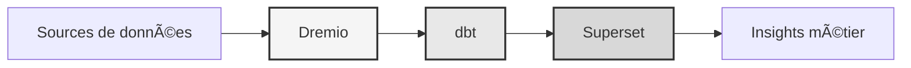

# 数据平台

<p align="center">
  <a href="https://talentys.eu" target="_blank">
    
  </a>
  <br/>
  <em>Supported by <a href="https://talentys.eu">Talentys</a> | <a href="https://www.linkedin.com/company/talentysdata">LinkedIn</a> - Data Engineering & Analytics Excellence</em>
</p>


**企业数据湖屋解决方案**

**语言**：法语（FR）  
**版本**：3.3.1  
**最后更新**：2025 年 10 月 19 日

---

＃＃ 概述

结合了 Dremio、dbt 和 Apache Superset 的专业数据平台，用于企业级数据转换、质量保证和商业智能。

该平台为现代数据工程提供了完整的解决方案，包括自动化数据管道、质量测试和交互式仪表板。



---

## 主要特点

- 与 Dremio 合作的数据湖屋架构
- 使用 dbt 自动转换
- 使用 Apache Superset 的商业智能
- 全面的数据质量测试
- 通过 Arrow Flight 实时同步

---

## 快速入门指南

### 先决条件

- Docker 20.10 或更高版本
- Docker Compose 2.0 或更高版本
- Python 3.11 或更高版本
- 至少 8 GB RAM

＃＃＃ 设施

```bash
# Installer les dépendances
pip install -r requirements.txt

# Démarrer les services
make up

# Vérifier l'installation
make status

# Exécuter les tests de qualité
make dbt-test
```

---

＃＃ 建筑学

### 系统组件

|组件|港口|描述 |
|----------------|------|-------------|
|德雷米奥 | 9047, 31010, 32010 |数据湖屋平台|
|数据库技术 | - |数据转换工具|
|超级组 | 8088 |商业智能平台|
| PostgreSQL | 5432 |交易数据库|
|迷你IO | 9000、9001 |对象存储（S3 兼容）|
|弹性搜索 | 9200 | 9200搜索与分析引擎|

详细的系统设计请参见[架构文档](architecture/)。

---

## 文档

### 启动
- [安装指南](入门/)
- [配置]（入门/）
- [入门](入门/)

### 用户指南
- [数据工程](指南/)
- [仪表板的创建]（指南/）
- [API集成](指南/)

### API 文档
- [REST API 参考](api/)
- [身份验证](api/)
- [代码示例](api/)

### 架构文档
- [系统设计](架构/)
- [数据流](架构/)
- [部署指南](架构/)
- [🎯Dremio Ports 视觉指南](architecture/dremio-ports-visual.md) ⭐ 新

---

## 可用语言

|语言 |代码|文档 |
|--------|------|----------------|
|英语 | CN | [README.md](../../../README.md) |
|法语 | CN | [docs/i18n/fr/](../fr/README.md) |
|西班牙语 |英语 | [文档/i18n/es/](../es/README.md) |
|葡萄牙语 | PT | [文档/i18n/pt/](../pt/README.md) |
|迪拜 |增强现实 | [文档/i18n/ar/](../ar/README.md) |
| 中文 |中文 | [docs/i18n/cn/](../cn/README.md) |
| 日本语 |日本 | [docs/i18n/jp/](../jp/README.md) |
| Русский | 俄罗斯英国 | [docs/i18n/ru/](../ru/README.md) |

---

＃＃ 支持

如需技术援助：
- 文档：[README main](../../../README.md)
- 问题跟踪器：GitHub 问题
- 社区论坛：GitHub 讨论
- 电子邮件：support@example.com

---

**[返回主文档](../../../README.md)**
