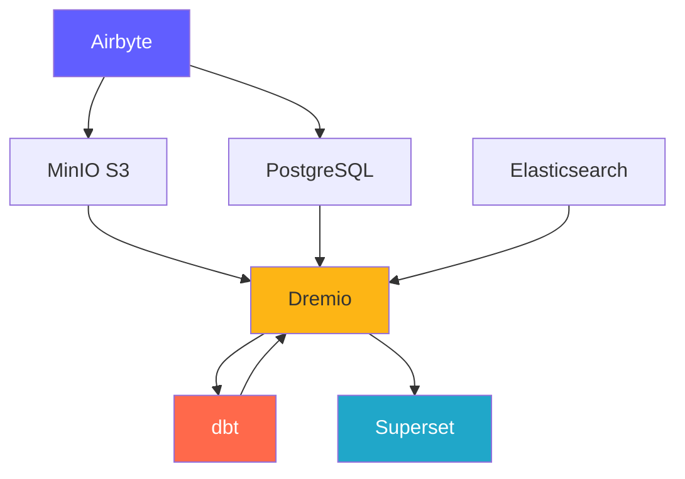
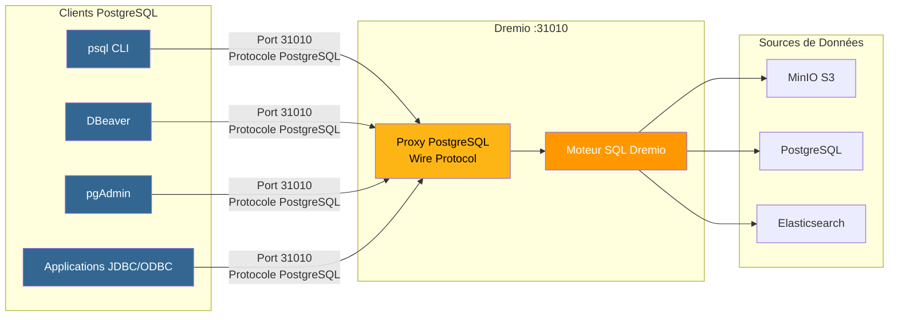
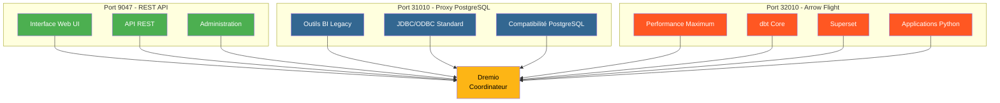
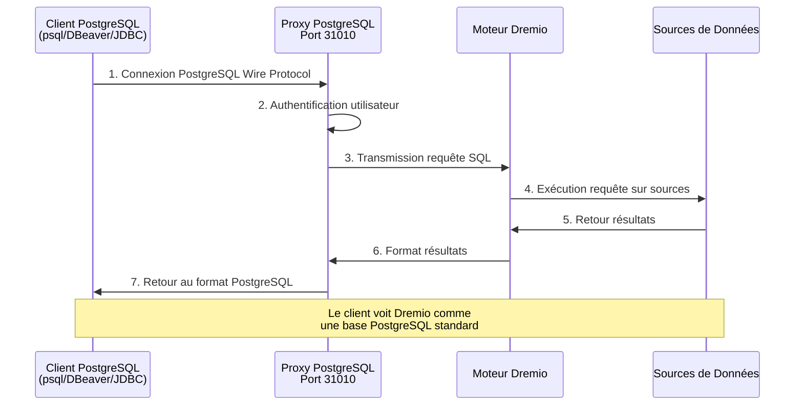
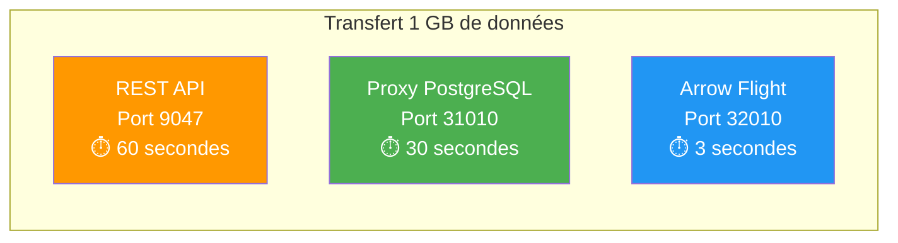

# 平台组件

**版本**：3.2.0  
**最后更新**：2025-10-16  
**语言**：法语

---

## 组件概述

数据平台由 7 个主要组件组成，它们共同提供完整的解决方案。



---

## 1. Airbyte – 数据集成平台

＃＃＃ 概述

Airbyte 是一个开源数据集成引擎，可将多个来源的数据整合到目的地。

**版本**：0.50.33  
**许可证**：麻省理工学院  
**网站**：https://airbyte.com

### 主要特点

- **300+ 预构建连接器**：数据库、API、文件、SaaS 应用程序
- **变更数据捕获 (CDC)**：实时数据复制
- **自定义连接器**：使用 Python 或低代码 CDK 构建
- **标准化**：将 JSON 转换为关系表
- **增量同步**：仅同步新的/修改的数据
- **监控**：集成跟踪状态同步

＃＃＃ 建筑学

```yaml
Composants:
  airbyte-webapp:
    Port: 8000
    Objectif: Interface utilisateur web
    
  airbyte-server:
    Port: 8001
    Objectif: Serveur API REST
    
  airbyte-worker:
    Objectif: Exécuter tâches synchronisation
    Scalabilité: Horizontale
    
  airbyte-temporal:
    Port: 7233
    Objectif: Orchestration workflows
    
  airbyte-db:
    Port: 5432
    Objectif: Stockage métadonnées (PostgreSQL)
```

### 用例

- **ELT 管道**：提取-加载-转换工作流程
- **数据库复制**：保持数据库同步
- **API 集成**：从 REST API 中提取数据
- **数据湖摄取**：将数据加载到 S3/MinIO 中
- **云迁移**：将本地数据移动到云端

＃＃＃ 设置

```yaml
# Variables d'Environnement
AIRBYTE_VERSION: "0.50.33"
AIRBYTE_HTTP_PORT: 8000
AIRBYTE_API_PORT: 8001
AIRBYTE_WORKSPACE_ROOT: /tmp/airbyte_local

# Limites Ressources
CPU_LIMIT: "2.0"
MEMORY_LIMIT: "2Gi"
```

### 整合点

- **输出到**：MinIO S3、PostgreSQL、Dremio
- **编排**：可由气流触发，Prefect
- **监控**：Prometheus 指标端点

---

## 2.Dremio – 数据 Lakehouse 平台

＃＃＃ 概述

Dremio 为所有数据源提供统一的 SQL 接口，并具有查询加速功能。

**版本**：26.0 OSS  
**许可证**：Apache 2.0  
**网站**：https://www.dremio.com

### 主要特点

- **Data Lakehouse**：将数据湖灵活性与仓库性能相结合
- **想法**：自动查询加速（速度提高 100 倍）
- **Arrow Flight**：高性能数据传输
- **数据虚拟化**：无需移动数据即可查询
- **语义层**：业务友好的数据定义
- **时间旅行**：查询给定的历史版本

＃＃＃ 建筑学

```yaml
Composants:
  Coordinateur:
    Port: 9047 (HTTP), 31010 (ODBC), 32010 (Arrow Flight)
    Objectif: Planification requêtes, gestion métadonnées
    Mémoire: 8Go heap + 8Go direct
    
  Exécuteur:
    Objectif: Exécution requêtes
    Mémoire: 4Go heap + 8Go direct
    Scalabilité: Horizontale (ajouter plus d'exécuteurs)
    
  Stockage:
    Type: Distribué (MinIO, S3, HDFS)
    Format: Parquet, Iceberg
```

### 用例

- **自助分析**：允许业务用户探索数据
- **数据网格**：联合访问数据
- **查询加速**：加速仪表板查询
- **数据目录**：发现和管理数据
- **BI 激活**：Power Tableau、Power BI、Superset

＃＃＃ 设置

```conf
# dremio.conf
paths.local: "/opt/dremio/data"
services.coordinator.enabled: true
services.executor.enabled: true

services.coordinator.web.port: 9047
services.flight.endpoint.port: 32010

services.executor.cache.pct.max: 70
```

### 整合点

- **读取自**：MinIO S3、PostgreSQL、Elasticsearch
- **转换为**：dbt
- **用于**：Superset、Tableau、Power BI

### Dremio 的 PostgreSQL 代理

Dremio 可以模拟 PostgreSQL 服务器，允许 PostgreSQL 兼容工具连接到 Dremio，就像它是标准 PostgreSQL 数据库一样。

#### PostgreSQL 代理架构



#### 3 个 Dremio 端口的比较



#### 代理配置

```yaml
Proxy PostgreSQL:
  Port: 31010 (ODBC/JDBC)
  Protocole: PostgreSQL Wire Protocol
  Compatibilité: Outils compatibles PostgreSQL (psql, pgAdmin, DBeaver)
  
Avantages:
  - Aucune modification du code client
  - Support des pilotes PostgreSQL existants
  - Connexion via JDBC/ODBC standard
  - Compatible avec la plupart des outils BI
```

#### 代理用例

1. **BI Legacy Tools**：连接不支持 Arrow Flight 的工具
2. **轻松迁移**：在不更改代码的情况下用Dremio替换PostgreSQL
3. **ODBC/JDBC兼容性**：使用标准PostgreSQL驱动程序
4. **开发**：使用熟悉的PostgreSQL工具（psql、pgAdmin）进行测试

#### 连接示例

```bash
# Via psql
psql -h localhost -p 31010 -U admin -d datalake

# Via DBeaver / pgAdmin
Host: localhost
Port: 31010
Database: datalake
Username: admin
Password: <votre-mot-de-passe>

# Chaîne JDBC
jdbc:postgresql://localhost:31010/datalake

# Chaîne ODBC
Driver=PostgreSQL Unicode;
Server=localhost;
Port=31010;
Database=datalake;
Uid=admin;
Pwd=<votre-mot-de-passe>;
```

#### 限制

- **性能**：Arrow Flight（端口 32010）速度提高 20-50 倍
- **功能**：不支持一些高级 PostgreSQL 功能
- **建议**：使用 Arrow Flight 进行生产，使用 PostgreSQL 代理实现兼容性

#### 通过 PostgreSQL 代理的连接流程



#### 协议比较

|协议|港口|性能|延迟 |使用案例 |
|----------------|------|-------------|---------|--------|
| **REST API** | 9047 | 9047标准| 〜50-100ms | Web UI、管理 |
| **ODBC/JDBC（PostgreSQL 代理）** | 31010|好 | 〜20-50ms |旧版 BI 工具的兼容性 |
| **箭飞行** | 32010|优秀 (20-50x) | 〜5-10ms |制作、超级组、dbt |

#### 性能比较



---

## 3. dbt - 数据转换工具

＃＃＃ 概述

dbt（数据构建工具）允许分析工程师使用 SQL 转换数据。

**版本**：1.10+  
**许可证**：Apache 2.0  
**网站**：https://www.getdbt.com

### 主要特点

- **基于 SQL**：用 SQL 编写转换
- **版本控制**：Git 集成以实现协作
- **测试**：集成数据质量测试
- **文档**：自动生成数据字典
- **模块化**：可重用的宏和包
- **增量模型**：仅处理新数据

＃＃＃ 建筑学

```yaml
Composants:
  dbt Core:
    Objectif: Outil CLI pour exécuter transformations
    Langage: Python
    
  Modèles:
    Objectif: Instructions SQL SELECT
    Types: Vues, Tables, Incrémental, Snapshots
    
  Tests:
    Objectif: Validation qualité données
    Types: Unique, Not Null, Relations, Personnalisés
    
  Macros:
    Objectif: Fonctions SQL réutilisables
    Langage: Jinja2
```

### 用例

- **数据建模**：构建星形/片状图
- **数据质量**：验证数据完整性
- **缓慢变化的维度**：跟踪历史变化
- **数据聚合**：创建汇总表
- **数据文档**：生成数据目录

＃＃＃ 设置

```yaml
# dbt_project.yml
name: 'dremio_dbt'
version: '1.0.0'
profile: 'dremio'

models:
  dremio_dbt:
    staging:
      +materialized: view
      +schema: staging
    marts:
      +materialized: table
      +schema: marts
```

### 整合点

- **阅读自**：Dremio 数据集
- **写给**：Dremio（通过 Arrow Flight）
- **编排**：Airflow、cron、Airbyte 后同步

---

## 4. Apache Superset – 商业智能平台

＃＃＃ 概述

Superset 是一个现代数据探索和可视化平台。

**版本**：3.0  
**许可证**：Apache 2.0  
**网站**：https://superset.apache.org

### 主要特点

- **SQL IDE**：具有自动完成功能的高级 SQL 编辑器
- **丰富的可视化**：50 多种图表类型
- **交互式仪表板**：向下钻取、过滤器、交叉过滤
- **SQL Lab**：即席查询接口
- **警报**：预定的报告和警报
- **缓存**：缓存查询结果以提高性能

＃＃＃ 建筑学

```yaml
Composants:
  Serveur Web:
    Port: 8088
    Objectif: Servir interface web
    Framework: Flask
    
  Workers Celery:
    Objectif: Exécution requêtes asynchrone
    File: Redis/RabbitMQ
    
  Celery Beat:
    Objectif: Tâches planifiées (préchauffage cache, alertes)
    
  Base de Données:
    Objectif: Stocker tableaux de bord, utilisateurs, logs requêtes
    Type: PostgreSQL
```

### 用例

- **执行仪表板**：KPI 监控
- **运营分析**：实时监控
- **BI 自助服务**：为分析师提供支持
- **嵌入式分析**：应用程序中的 iframe 集成
- **数据探索**：临时分析

＃＃＃ 设置

```python
# superset_config.py
SQLALCHEMY_DATABASE_URI = 'postgresql://...'
SECRET_KEY = '...'

FEATURE_FLAGS = {
    'DASHBOARD_NATIVE_FILTERS': True,
    'DASHBOARD_CROSS_FILTERS': True,
    'ENABLE_TEMPLATE_PROCESSING': True
}

CACHE_CONFIG = {
    'CACHE_TYPE': 'redis',
    'CACHE_DEFAULT_TIMEOUT': 300
}
```

### 整合点

- **请求**：Dremio（通过 Arrow Flight）
- **身份验证**：LDAP、OAuth2、数据库
- **警报**：电子邮件、Slack

---

## 5. PostgreSQL - 关系数据库

＃＃＃ 概述

PostgreSQL 是一个先进的开源关系数据库管理系统。

**版本**：16  
**许可证**：PostgreSQL 许可证  
**网站**：https://www.postgresql.org

### 主要特点

- **ACID 合规性**：可靠的交易
- **JSON 支持**：原生 JSON/JSONB 类型
- **全文搜索**：集成搜索功能
- **扩展**：PostGIS、pg_stat_statements、TimescaleDB
- **复制**：流式复制、逻辑复制
- **分区**：本机表分区

＃＃＃ 建筑学

```yaml
Composants:
  Serveur PostgreSQL:
    Port: 5432
    Protocole: Protocole wire PostgreSQL
    
  Bases de Données:
    - dremio_db: Métadonnées Dremio
    - superset_db: Configuration Superset
    - airbyte_db: Métadonnées Airbyte
    
  Connexions:
    Max: 200
    Pooling: PgBouncer (optionnel)
```

### 用例

- **元数据存储**：存储系统元数据
- **事务负载**：OLTP 应用程序
- **暂存表**：临时数据处理
- **存储配置**：应用程序设置
- **审核日志**：跟踪系统更改

＃＃＃ 设置

```conf
# postgresql.conf
max_connections = 200
shared_buffers = 256MB
effective_cache_size = 1GB
maintenance_work_mem = 64MB
work_mem = 4MB

# Performance
random_page_cost = 1.1
effective_io_concurrency = 200

# Journalisation
log_statement = 'mod'
log_duration = on
```

### 整合点

- **阅读者**：Dremio、Superset、Airbyte
- **作者**：Airbyte、dbt、applications
- **管理者**：自动备份、复制

---

## 6. MinIO – S3 兼容对象存储

＃＃＃ 概述

MinIO 是一个高性能、兼容 S3 的对象存储系统。

**版本**：最新  
**许可证**：AGPLv3  
**网站**：https://min.io

### 主要特点

- **S3 API**：100% 与 Amazon S3 兼容
- **高性能**：多 GB/秒吞吐量
- **纠删码**：可持续性和可用性数据
- **版本控制**：对象版本控制
- **加密**：服务器端和客户端
- **多云**：随处部署

＃＃＃ 建筑学

```yaml
Composants:
  Serveur MinIO:
    Port: 9000 (API S3), 9001 (Console)
    Mode: Nœud unique ou distribué
    
  Stockage:
    Format: Erasure coded ou brut
    Redondance: Configurable (ex: 4+2)
    
  Buckets:
    - datalake: Stockage données principal
    - raw-data: Ingestion Airbyte
    - processed-data: Sorties dbt
    - backups: Sauvegardes système
```

### 用例

- **数据湖**：存储原始数据和处理后的数据
- **对象存储**：文件、图像、视频
- **存储备份**：数据库和系统备份
- **存档**：长期数据保留
- **数据暂存**：临时处理存储

＃＃＃ 设置

```yaml
# Variables d'Environnement
MINIO_ROOT_USER: minioadmin
MINIO_ROOT_PASSWORD: minioadmin123
MINIO_VOLUMES: /data

# Politiques Buckets
- datalake: Lecture-écriture pour plateforme données
- raw-data: Écriture par Airbyte, lecture par Dremio
- processed-data: Écriture par dbt, lecture tous
```

### 整合点

- **作者**：Airbyte、dbt、applications
- **阅读者**：Dremio，数据科学家
- **管理者**：mc（MinIO 客户端）、s3cmd

---

## 7.Elasticsearch - 搜索和分析引擎

＃＃＃ 概述

Elasticsearch 是一个基于 Apache Lucene 构建的分布式搜索和分析引擎。

**版本**：8.15  
**许可证**：弹性许可证2.0  
**网站**：https://www.elastic.co

### 主要特点

- **全文搜索**：高级搜索功能
- **实时索引**：近乎实时的数据可用性
- **分布式**：水平可扩展性
- **聚合**：复杂的分析
- **RESTful API**：简单的 HTTP API
- **机器学习**：异常检测

＃＃＃ 建筑学

```yaml
Composants:
  Nœud Elasticsearch:
    Port: 9200 (HTTP), 9300 (Transport)
    Rôles: Master, Data, Ingest, ML
    
  Index:
    Objectif: Stocker documents recherchables
    Shards: Distribués entre nœuds
    Répliques: Pour haute disponibilité
    
  Cycle de Vie Index:
    Hot: Données récentes (SSD)
    Warm: Données anciennes (HDD)
    Cold: Archive (S3)
```

### 用例

- **分析日志**：集中日志记录（ELK 堆栈）
- **应用搜索**：产品目录、站点搜索
- **安全分析**：SIEM 用例
- **可观察性**：指标和痕迹
- **文本分析**：NLP 和情感分析

＃＃＃ 设置

```yaml
# elasticsearch.yml
cluster.name: "dremio-search-cluster"
node.name: "node-1"
network.host: 0.0.0.0
http.port: 9200

# Sécurité
xpack.security.enabled: true
xpack.security.transport.ssl.enabled: false

# Mémoire
bootstrap.memory_lock: true
```

### 整合点

- **索引**：Logstash、Filebeat
- **请求者**：Dremio、Kibana
- **监控者**：Elasticsearch 监控

---

## 组件比较

|组件|类型 |主要用途|可扩展性|状态|
|--------------|------|--------------------|----------|------|
| **Airbyte** |整合 |数据摄取|卧式（工人）|无国籍|
| **德雷米奥** |查询引擎 |数据访问|水平（执行者）|无国籍|
| **dbt** |转型|数据建模|垂直（心）|无国籍|
| **超级组** | BI平台|可视化|水平（网络）|无国籍|
| **PostgreSQL** |数据库|元数据存储|垂直（+复制）|有状态 |
| **MinIO** |对象存储 |数据湖|水平（分布式）|有状态 |
| **弹性搜索** |搜索引擎 |全文检索 |水平（集群）|有状态 |

---

## 资源要求

### 最低配置（开发）

```yaml
Total: 8 Go RAM, 4 CPUs, 50 Go Disque

Allocation:
  Airbyte: 1 Go RAM, 0.5 CPU
  Dremio: 2 Go RAM, 1 CPU
  Superset: 1 Go RAM, 0.5 CPU
  PostgreSQL: 1 Go RAM, 0.5 CPU
  MinIO: 1 Go RAM, 0.5 CPU
  Elasticsearch: 2 Go RAM, 1 CPU
```

### 推荐配置（生产）

```yaml
Total: 64 Go RAM, 16 CPUs, 500 Go SSD

Allocation:
  Airbyte: 4 Go RAM, 2 CPUs
  Dremio: 16 Go RAM, 4 CPUs
  Superset: 8 Go RAM, 2 CPUs
  PostgreSQL: 8 Go RAM, 2 CPUs
  MinIO: 16 Go RAM, 2 CPUs
  Elasticsearch: 12 Go RAM, 4 CPUs
```

---

## 版本兼容性矩阵

|组件|发布 |兼容 |
|----------|---------|----------------------|
|艾尔拜特 | 0.50+ |所有目的地 |
|德雷米奥 | 26.0 | 26.0 dbt 1.8+，Arrow Flight 客户 |
|数据库技术 | 1.10+ |德雷米奥 23.0+ |
|超级组 | 3.0+ | Dremio 22.0+、PostgreSQL 12+ |
| PostgreSQL | 16 | 16所有组件 |
|迷你IO |最新 | S3 兼容客户端 |
|弹性搜索 | 8.15 | 8.15 Dremio 26.0+、Logstash 8.x |

---

**组件指南版本**：3.2.0  
**最后更新**：2025-10-16  
**维护者**：数据平台团队