# 数据流架构

**版本**：3.2.0  
**最后更新**：2025 年 10 月 16 日  
**语言**：法语

＃＃ 目录

1. [概述](#overview)
2. [端到端数据流](#end-to-end-dataflow)
3. [摄取层](#ingestion-layer)
4. [存储层](#storage-layer)
5. [处理层](#processing-layer)
6. [表示层](#presentation-layer)
7. [数据流模型](#dataflow-models)
8. [性能注意事项](#performance-considerations)
9. [数据流监控](#dataflow-monitoring)
10.[良好实践](#good-practices)

---

＃＃ 概述

本文档详细介绍了平台的完整数据流架构，从初始数据摄取到最终消费。了解这些流程对于优化性能、解决问题和设计有效的数据管道至关重要。

### 数据流原理

我们的架构遵循以下基本原则：

1. **单向流**：数据以清晰且可预测的方向移动
2. **分层处理**：每一层都有特定的职责
3. **解耦组件**：服务通过定义良好的接口进行通信
4. **幂等性**：操作可以安全地重复
5. **可观察性**：每一步都会被记录和监控

### 架构层


---

## 端到端数据流

### 完整的管道序列


### 数据流步骤

|步骤|组件|入口|退出 |延迟 |
|--------|----------|--------|--------|---------|
| **摘录** |艾尔拜特 |外部 API/BD |原始 JSON/CSV | 1-60 分钟 |
| **加载** |存储层|原始文件 |精选桶 | <1 分钟 |
| **编目** |德雷米奥 |存储路径|虚拟数据集| <1 分钟 |
| **转型** |数据库技术 |青铜桌|银牌/金牌桌 | 5-30 分钟 |
| **优化** |德雷米奥的想法 |原始查询 |隐藏结果 |实时|
| **可视化** |超级组 | SQL 查询 |图表/仪表板 | <5 秒 |

---

## 摄取层

### Airbyte 数据提取

Airbyte 管理来自外部来源的所有数据摄入。

#### 源连接流程


#### 数据提取方法

**1.全面刷新**
```yaml
# Full refresh extrait toutes les données à chaque sync
sync_mode: full_refresh
destination_sync_mode: overwrite

# Cas d'usage:
# - Petits datasets (<1M lignes)
# - Pas de suivi fiable des changements
# - Snapshots complets nécessaires
```

**2.增量同步**
```yaml
# Sync incrémental extrait uniquement les données nouvelles/modifiées
sync_mode: incremental
destination_sync_mode: append_dedup
cursor_field: updated_at

# Cas d'usage:
# - Grands datasets (>1M lignes)
# - Possède champ timestamp ou curseur
# - Optimisation performance sync
```

**3.变更数据捕获 (CDC)**
```yaml
# CDC utilise les logs de transaction de la base de données
method: CDC
replication_method: LOG_BASED

# Bases de données supportées:
# - PostgreSQL (WAL)
# - MySQL (binlog)
# - MongoDB (change streams)
# - SQL Server (change tracking)
```

### Airbyte API 集成

```bash
# Déclencher sync via API
curl -X POST http://localhost:8001/api/v1/connections/sync \
  -H "Content-Type: application/json" \
  -d '{
    "connectionId": "your-connection-id"
  }'

# Vérifier statut sync
curl -X POST http://localhost:8001/api/v1/jobs/get \
  -H "Content-Type: application/json" \
  -d '{
    "id": "job-id"
  }'
```

### 提取性能

|来源类型 |流量|推荐频率 |
|----------------|--------------------|----------------------|
| PostgreSQL | 50-100k 行/秒 |每 15-60 分钟 |
|休息 API | 1-10k 请求/秒 |每 5-30 分钟 |
| CSV 文件 | 100-500 MB/秒 |每日 |
| MongoDB | 10-50k 文档/秒 |每 15-60 分钟 |
| MySQL CDC |实时 |连续 |

---

## 存储层

### MinIO S3 存储

MinIO 以分层结构存储原始数据和处理后的数据。

#### 桶组织


#### 数据路径结构

```
s3://datalake/
├── bronze/                      # Données brutes d'Airbyte
│   ├── postgres/
│   │   ├── customers/
│   │   │   └── date=2025-10-16/
│   │   │       └── data.parquet
│   │   └── orders/
│   │       └── date=2025-10-16/
│   │           └── data.parquet
│   ├── api/
│   │   └── rest_endpoint/
│   │       └── timestamp=20251016_120000/
│   │           └── response.json
│   └── files/
│       └── csv_import/
│           └── batch_001.csv
│
├── silver/                      # Données nettoyées et validées
│   ├── customers/
│   │   └── version=v2/
│   │       └── customers_cleaned.parquet
│   └── orders/
│       └── version=v2/
│           └── orders_enriched.parquet
│
└── gold/                        # Agrégats prêts pour le métier
    ├── daily_revenue/
    │   └── year=2025/month=10/
    │       └── day=16/
    │           └── revenue.parquet
    └── customer_metrics/
        └── snapshot=2025-10-16/
            └── metrics.parquet
```

### 存储格式策略

|层 |格式|压缩|分区|原因 |
|--------|--------|-------------|--------------------|--------|
| **铜牌** |实木复合地板|敏捷 |按日期 |写入快，压缩好|
| **银牌** |实木复合地板|敏捷 |按业务键 |有效查询|
| **黄金** |实木复合地板| ZSTD |按时间段 |最大压缩 |
| **日志** | JSON |压缩 |按服务/日期 |人类可读 |

### PostgreSQL 元数据存储

PostgreSQL 存储：
- Airbyte 配置和状态
- 元数据和 dbt 执行历史记录
- 超级集仪表板和用户
- 应用程序日志和指标

```sql
-- Structure table état Airbyte
CREATE TABLE airbyte_state (
    connection_id UUID PRIMARY KEY,
    state JSONB NOT NULL,
    updated_at TIMESTAMP DEFAULT NOW()
);

-- Historique exécution dbt
CREATE TABLE dbt_run_history (
    run_id UUID PRIMARY KEY,
    project_name VARCHAR(255),
    started_at TIMESTAMP,
    completed_at TIMESTAMP,
    status VARCHAR(50),
    models_run INTEGER,
    tests_run INTEGER,
    metadata JSONB
);
```

### Elasticsearch 文档存储

Elasticsearch 索引日志并允许全文搜索。

```json
{
  "index": "airbyte-logs-2025.10.16",
  "mappings": {
    "properties": {
      "timestamp": {"type": "date"},
      "level": {"type": "keyword"},
      "service": {"type": "keyword"},
      "message": {"type": "text"},
      "job_id": {"type": "keyword"},
      "connection_id": {"type": "keyword"},
      "records_synced": {"type": "integer"},
      "bytes_synced": {"type": "long"}
    }
  }
}
```

---

## 处理层

### Dremio 数据虚拟化

Dremio 创建跨所有存储源的统一视图。

#### 虚拟数据集的创建


#### 反射加速

Dremio 反射预先计算查询结果以实现即时性能。

```sql
-- Créer réflexion brute (sous-ensemble colonnes)
CREATE REFLECTION raw_customers
ON bronze.customers
USING DISPLAY (customer_id, name, email, created_at);

-- Créer réflexion agrégation
CREATE REFLECTION agg_daily_revenue
ON gold.orders
USING DIMENSIONS (order_date)
MEASURES (SUM(amount), COUNT(*), AVG(amount));

-- Les réflexions se rafraîchissent automatiquement selon la politique
ALTER REFLECTION agg_daily_revenue
SET REFRESH EVERY 1 HOUR;
```

**反射对性能的影响：**

|查询类型 |没有反思|反思 |加速 |
|----------------|----------------|----------------|---------|
|选择简单 | 500 毫秒 | 50 毫秒 | 10 倍 |
|聚合| 5秒| 100 毫秒 | 50 倍 |
|复杂的连接 | 30 多岁 | 500 毫秒 | 60 倍 |
|大扫描| 120 秒 | 2秒| 60 倍 |

### dbt 转换

dbt 将原始数据转换为业务就绪模型。

#### 转换流程


#### 转换管道示例

```sql
-- models/staging/stg_customers.sql
-- Étape 1: Nettoyage et standardisation
WITH source AS (
    SELECT * FROM bronze.raw_customers
),

cleaned AS (
    SELECT
        customer_id,
        TRIM(UPPER(name)) AS customer_name,
        LOWER(email) AS email,
        phone,
        address,
        city,
        state,
        zip_code,
        created_at,
        updated_at
    FROM source
    WHERE customer_id IS NOT NULL
)

SELECT * FROM cleaned;
```

```sql
-- models/intermediate/int_customer_orders.sql
-- Étape 2: Jointure et enrichissement
WITH customers AS (
    SELECT * FROM {{ ref('stg_customers') }}
),

orders AS (
    SELECT * FROM {{ ref('stg_orders') }}
),

joined AS (
    SELECT
        c.customer_id,
        c.customer_name,
        c.email,
        o.order_id,
        o.order_date,
        o.amount,
        o.status
    FROM customers c
    INNER JOIN orders o
        ON c.customer_id = o.customer_id
)

SELECT * FROM joined;
```

```sql
-- models/marts/fct_customer_lifetime_value.sql
-- Étape 3: Agrégation pour métriques métier
WITH customer_orders AS (
    SELECT * FROM {{ ref('int_customer_orders') }}
),

metrics AS (
    SELECT
        customer_id,
        customer_name,
        email,
        COUNT(DISTINCT order_id) AS total_orders,
        SUM(amount) AS lifetime_value,
        AVG(amount) AS average_order_value,
        MIN(order_date) AS first_order_date,
        MAX(order_date) AS last_order_date,
        DATEDIFF('day', MIN(order_date), MAX(order_date)) AS customer_lifespan_days
    FROM customer_orders
    WHERE status = 'completed'
    GROUP BY customer_id, customer_name, email
)

SELECT * FROM metrics;
```

#### dbt 执行流程

```bash
# Exécution pipeline complète
dbt run --select staging        # Exécuter modèles staging
dbt test --select staging       # Tester modèles staging
dbt run --select intermediate   # Exécuter modèles intermédiaires
dbt test --select intermediate  # Tester modèles intermédiaires
dbt run --select marts          # Exécuter modèles mart
dbt test --select marts         # Tester modèles mart

# Générer documentation
dbt docs generate
dbt docs serve
```

### 数据沿袭可追溯性


---

## 表示层

### 查询执行流程


### API 访问模型

#### 1. Superset 仪表板（BI Interactive）

```python
# Superset exécute SQL via SQLAlchemy
from superset import db

query = """
SELECT 
    order_date,
    SUM(amount) as daily_revenue
FROM gold.fct_daily_revenue
WHERE order_date >= CURRENT_DATE - INTERVAL '30 days'
GROUP BY order_date
ORDER BY order_date
"""

results = db.session.execute(query)
```

#### 2. Arrow Flight API（高性能）

```python
# Connexion Arrow Flight directe pour outils analytiques
from pyarrow import flight

client = flight.FlightClient("grpc://localhost:32010")

# Authentification
token = client.authenticate_basic_token("admin", "password123")

# Exécuter requête
descriptor = flight.FlightDescriptor.for_command(
    b"SELECT * FROM gold.customer_metrics LIMIT 1000"
)

flight_info = client.get_flight_info(descriptor)
reader = client.do_get(flight_info.endpoints[0].ticket)

# Lire comme Table Arrow (zero-copy)
table = reader.read_all()
df = table.to_pandas()
```

#### 3. REST API（外部集成）

```bash
# API REST Dremio pour automatisation
curl -X POST http://localhost:9047/api/v3/sql \
  -H "Authorization: Bearer $TOKEN" \
  -H "Content-Type: application/json" \
  -d '{
    "sql": "SELECT COUNT(*) FROM gold.customers"
  }'
```

---

## 数据流模型

### 模型 1：ETL 批量管道

```mermaid
gantt
    title Planification ETL Batch Quotidien
    dateFormat HH:mm
    axisFormat %H:%M
    
    section Ingestion
    Extraction Airbyte (PostgreSQL)     :01:00, 30m
    Extraction Airbyte (APIs)           :01:30, 45m
    
    section Chargement
    Chargement vers Bronze MinIO        :02:15, 15m
    
    section Transformation
    Modèles Staging dbt                 :02:30, 20m
    Modèles Intermédiaires dbt          :02:50, 30m
    Modèles Mart dbt                    :03:20, 40m
    
    section Tests
    Tests Qualité Données dbt           :04:00, 15m
    
    section Optimisation
    Rafraîchissement Réflexions Dremio  :04:15, 20m
    
    section Présentation
    Préchauffage Cache Tableau de Bord  :04:35, 10m
```



### 模型 2：实时流媒体


### 模式 3：增量更新

```sql
-- Modèle incrémental dbt
{{ config(
    materialized='incremental',
    unique_key='order_id',
    on_schema_change='sync_all_columns'
) }}

SELECT
    order_id,
    customer_id,
    order_date,
    amount,
    status,
    updated_at
FROM {{ source('bronze', 'orders') }}


    -- Traiter uniquement les enregistrements nouveaux ou mis à jour
    WHERE updated_at > (SELECT MAX(updated_at) FROM {{ this }})

```

### 模型 4：Lambda 架构（批处理+流）


---

## 性能考虑因素

### 摄取优化

```yaml
# Configuration connexion Airbyte
sync_mode: incremental
destination_sync_mode: append_dedup
cursor_field: updated_at

# Ajustement performance
batch_size: 10000              # Enregistrements par batch
threads: 4                     # Workers parallèles
timeout_minutes: 60           # Timeout sync
retry_on_failure: true
max_retries: 3

# Optimisation réseau
compression: gzip
buffer_size_mb: 256
```

### 存储优化

```python
# Options écriture Parquet pour compression optimale
import pyarrow.parquet as pq

pq.write_table(
    table,
    'output.parquet',
    compression='snappy',      # Compression rapide
    use_dictionary=True,       # Activer encodage dictionnaire
    row_group_size=1000000,    # 1M lignes par row group
    data_page_size=1048576,    # 1MB taille page
    write_statistics=True      # Activer statistiques pour pruning
)
```

### 查询优化

```sql
-- Bonnes pratiques requêtes Dremio

-- 1. Utiliser partition pruning
SELECT * FROM gold.orders
WHERE order_date >= '2025-10-01'  -- Élague partitions
  AND order_date < '2025-11-01';

-- 2. Exploiter les réflexions
-- Créer réflexion une fois, requêtes auto-accélérées
ALTER REFLECTION agg_orders SET ENABLED = TRUE;

-- 3. Utiliser column pruning
SELECT order_id, amount       -- Seulement colonnes nécessaires
FROM gold.orders
LIMIT 1000;

-- 4. Pousser les filtres
SELECT *
FROM gold.customers
WHERE state = 'CA'            -- Filtre poussé vers stockage
  AND lifetime_value > 1000;
```

### 转换优化

```sql
-- Techniques optimisation dbt

-- 1. Modèles incrémentaux pour grandes tables
{{ config(materialized='incremental') }}

-- 2. Tables partitionnées
{{ config(
    materialized='table',
    partition_by={
        'field': 'order_date',
        'data_type': 'date',
        'granularity': 'day'
    }
) }}

-- 3. Tables clusterisées pour meilleures jointures
{{ config(
    materialized='table',
    cluster_by=['customer_id']
) }}
```

### 性能基准

|运营|小数据集<br/>（1M行）|中型数据集<br/>（100M 行）|大型数据集<br/>（1B 行）|
|----------------------------------------|----------------------------------------|--------------------------------------------|----------------------------|
| **同步Airbyte** | 2 分钟 | 30 分钟 | 5小时|
| **dbt 执行** | 30 秒 | 10 分钟 | 2小时|
| **施工反思** | 10 秒 | 5 分钟 | 30 分钟 |
| **仪表板查询** | <100 毫秒 | <500 毫秒 | <2秒|

---

## 数据流监控

### 要跟踪的关键指标

```yaml
# Configuration métriques Prometheus
metrics:
  ingestion:
    - airbyte_records_synced_total
    - airbyte_sync_duration_seconds
    - airbyte_sync_failures_total
    
  storage:
    - minio_disk_usage_bytes
    - minio_objects_total
    - postgres_connections_active
    
  processing:
    - dremio_query_duration_seconds
    - dremio_reflection_refresh_seconds
    - dbt_model_execution_time
    
  serving:
    - superset_dashboard_load_time
    - superset_query_cache_hit_rate
    - api_requests_per_second
```

### 监控仪表板


### 日志聚合

```bash
# Requête Elasticsearch pour surveillance pipeline
curl -X GET "localhost:9200/airbyte-logs-*/_search" \
  -H 'Content-Type: application/json' \
  -d '{
    "query": {
      "bool": {
        "filter": [
          {"range": {"timestamp": {"gte": "now-1h"}}},
          {"term": {"level": "ERROR"}}
        ]
      }
    },
    "aggs": {
      "by_service": {
        "terms": {"field": "service"}
      }
    }
  }'
```

---

## 最佳实践

### 数据流设计

1. **幂等性设计**
   - 保证操作可以安全地重复进行
   - 使用唯一键进行重复数据删除
   - 实施适当的错误处理

2. **实施数据质量控制**
   ```sql
   -- Exemple test dbt
   -- tests/assert_positive_amounts.sql
   SELECT *
   FROM {{ ref('fct_orders') }}
   WHERE amount <= 0
   ```

3. **对大型数据集进行分区**
   ```python
   # Partitionner par date pour requêtes efficaces
   df.write.partitionBy('order_date').parquet('s3://bucket/orders/')
   ```

4. **使用适当的同步模式**
   - 全面刷新：小维度表
   - 增量：大型事实表
   - CDC：实时要求

### 性能调整

1. **优化Airbyte同步调度**
   ```yaml
   # Équilibrer fraîcheur vs utilisation ressources
   small_tables:
     frequency: every_15_minutes
   
   large_tables:
     frequency: every_6_hours
   
   dimension_tables:
     frequency: daily
   ```

2. **创建战略思想**
   ```sql
   -- Focus sur agrégations fréquemment requêtées
   CREATE REFLECTION common_metrics
   ON gold.orders
   USING DIMENSIONS (product_id, date_trunc('day', order_date))
   MEASURES (SUM(amount), COUNT(*));
   ```

3. **优化 dbt 模型**
   ```yaml
   # models/schema.yml
   models:
     - name: fct_large_table
       config:
         materialized: incremental
         incremental_strategy: merge
         unique_key: id
         partition_by: {field: date, data_type: date}
   ```

### 常见问题解决

|问题 |症状|解决方案 |
|---------|---------|----------|
| **Airbyte 同步速度慢** |同步时间|增加批量大小，使用增量模式 |
| **缺乏记忆** |失败的 dbt 模型 |增量实现，添加分区 |
| **查询速度慢** |超时仪表板 |创建反射，添加索引 |
| **存储已满** |写作失败|实施数据保留，压缩旧数据 |
| **数据已过时** |旧指标 |增加同步频率，检查时间表 |

### 良好的安全实践

1. **加密传输中的数据**
   ```yaml
   # docker-compose.yml
   minio:
     environment:
       MINIO_SERVER_URL: https://minio:9000
       MINIO_BROWSER_REDIRECT_URL: https://console.minio.local
   ```

2. **实施访问控制**
   ```sql
   -- ACLs Dremio
   GRANT SELECT ON gold.customer_metrics TO ROLE analyst;
   GRANT ALL ON bronze.* TO ROLE data_engineer;
   ```

3. **审核数据访问**
   ```json
   {
     "audit_log": {
       "enabled": true,
       "log_queries": true,
       "log_user_actions": true,
       "retention_days": 90
     }
   }
   ```

---

＃＃ 概括

本文档详细介绍了完整的数据流架构：

- **摄取层**：Airbyte 通过完全刷新、增量或 CDC 从各种来源提取数据
- **存储层**：MinIO、PostgreSQL 和 Elasticsearch 将原始数据和处理后的数据存储在有组织的层中
- **处理层**：Dremio 虚拟化数据，dbt 通过暂存、中间和市场模型对其进行转换
- **表示层**：Superset 仪表板和 API 提供对业务就绪数据的访问

要记住的要点：
- 数据通过明确定义的层单向流动
- 每个组件都有特定的职责和接口
- 通过反射、分区和缓存优化性能
- 监控和可观察性集成到每一层
- 良好实践保证可靠性、性能和安全性

**相关文档：**
- [架构概述](./overview.md)
- [组件](./components.md)
- [部署](./deployment.md)
- [Airbyte 集成指南](../guides/airbyte-integration.md)
- [dbt开发指南](../guides/dbt-development.md)

---

**版本**：3.2.0  
**最后更新**：2025 年 10 月 16 日