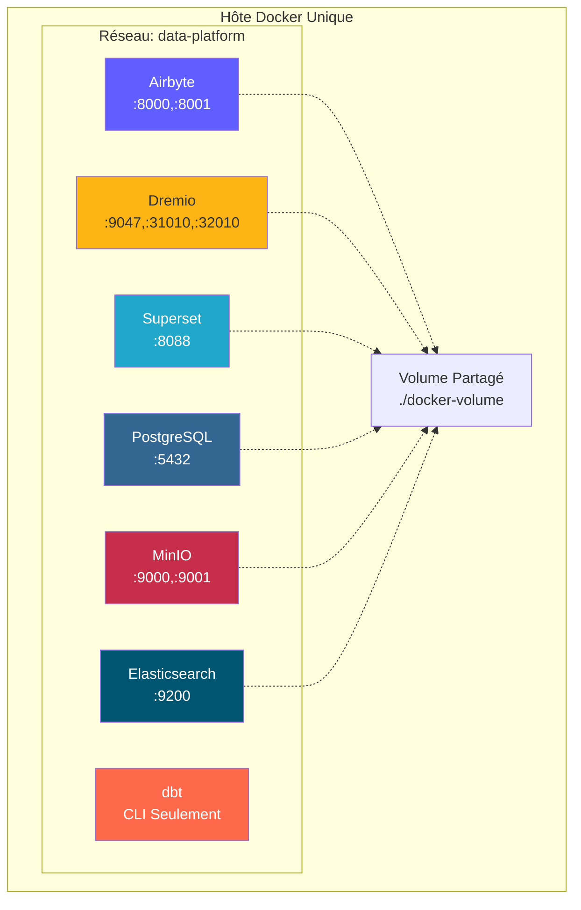
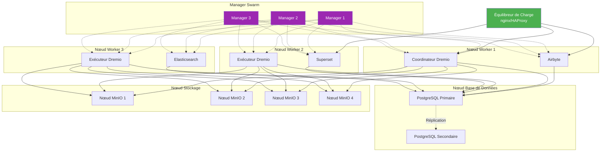
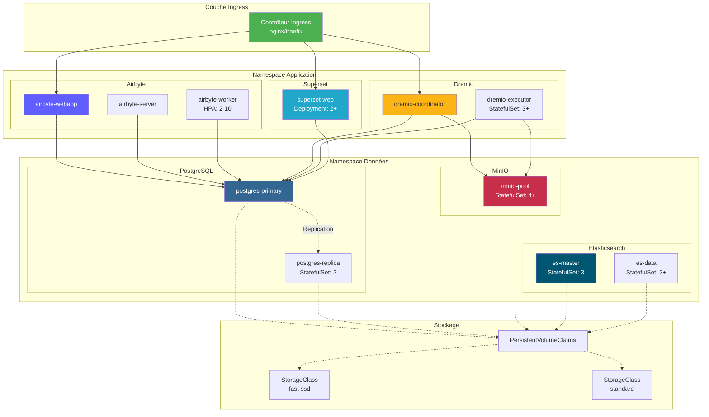
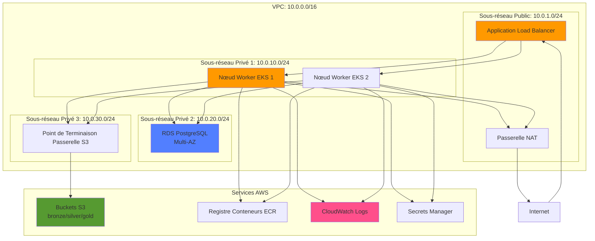
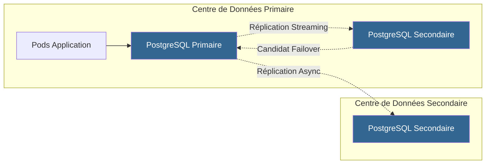

# 部署架构

**版本**：3.2.0  
**最后更新**：2025 年 10 月 16 日  
**语言**：法语

＃＃ 目录

1. [概述](#overview)
2. [部署拓扑](#deployment-topologies)
3. [Docker Compose部署](#docker-compose部署)
4. [Kubernetes部署](#kubernetes-deployment)
5. [云部署](#cloud-deployments)
6. [高可用性配置](#high-availability-configuration)
7. [扩展策略](#scaling-strategies)
8. [安全配置](#security-configuration)
9. [监控和日志记录](#monitoring-and-logging)
10. [灾难恢复](#disaster-recovery)
11.[良好实践](#good-practices)

---

＃＃ 概述

本文档提供了有关跨不同环境（从开发到生产）部署数据平台的全面指南。我们涵盖各种部署拓扑、编排策略和操作最佳实践。

### 部署目标

- **可靠性**：生产工作负载正常运行时间为 99.9%
- **可扩展性**：无需架构更改即可管理 10 倍的增长
- **安全**：通过多层安全进行深度防御
- **可维护性**：轻松更新和配置管理
- **盈利能力**：优化资源的利用

### 环境类型

|环境 |目标|规模|可用性 |
|----------------|---------|---------|---------------|
| **发展** |功能开发、测试|单节点| <95% |
| **分期** |生产前验证 |多节点 | 95-99% |
| **生产** |实时数据工作负载 |集群| >99.9% |
| **博士** |灾备站点|生产镜子|待机|

---

## 部署拓扑

### 拓扑1：单机开发



**用例**：本地开发、测试、演示

**规格**：
- CPU：4-8核
- 内存：16-32 GB
- 磁盘：100-500 GB SSD
- 网络：仅限本地主机

**好处**：
- 简单的配置（docker-compose up）
- 成本低
- 快速迭代

**缺点**：
- 无冗余
- 性能有限
- 不适合生产

### 拓扑 2：Docker Swarm 多主机



**用例**：暂存和小型生产部署

**规格**：
- 管理器节点：3x（2 个 CPU、4 GB RAM）
- 工作节点：3+（8-16 CPU，32-64 GB RAM）
- 数据库节点：1-2（4 个 CPU、16 GB RAM、SSD）
- 存储节点：4+（2 个 CPU、8 GB RAM、HDD/SSD）

**好处**：
- 高可用性
- 轻松缩放
- 集成负载平衡
- 健康监测

**缺点**：
- 比单主机更复杂
- 需要共享存储或卷
- 网络配置复杂性

### 拓扑3：Kubernetes 集群



**用例**：大规模生产部署

**规格**：
- 控制平面：3 个以上节点（托管或自托管）
-工作节点：10+节点（16-32 CPU，64-128 GB RAM）
- 存储：CSI 驱动程序（EBS、GCP PD、Azure 磁盘）
- 网络：CNI 插件（Calico、Cilium）

**好处**：
- 企业级编排
- 自动缩放和修复
- 高级网络（服务网格）
- 兼容 GitOps
- 多租户支持

**缺点**：
- 复杂的配置和管理
- 更陡峭的学习曲线
- 更高的运营开销

---

## Docker Compose 部署

### 开发环境

我们的本地开发`docker-compose.yml`标准：

```yaml
version: '3.8'

services:
  # Airbyte Platform
  airbyte-server:
    image: airbyte/server:0.50.33
    container_name: airbyte-server
    ports:
      - "8001:8001"
    environment:
      - DATABASE_USER=airbyte
      - DATABASE_PASSWORD=airbyte
      - DATABASE_DB=airbyte
      - DATABASE_HOST=postgres
      - DATABASE_PORT=5432
      - WORKSPACE_ROOT=/tmp/workspace
      - CONFIG_ROOT=/data
      - TRACKING_STRATEGY=logging
    volumes:
      - airbyte-data:/data
      - airbyte-workspace:/tmp/workspace
    depends_on:
      - postgres
    networks:
      - data-platform

  airbyte-webapp:
    image: airbyte/webapp:0.50.33
    container_name: airbyte-webapp
    ports:
      - "8000:80"
    environment:
      - AIRBYTE_SERVER_HOST=airbyte-server
      - AIRBYTE_SERVER_PORT=8001
    depends_on:
      - airbyte-server
    networks:
      - data-platform

  airbyte-worker:
    image: airbyte/worker:0.50.33
    container_name: airbyte-worker
    environment:
      - DATABASE_USER=airbyte
      - DATABASE_PASSWORD=airbyte
      - DATABASE_DB=airbyte
      - DATABASE_HOST=postgres
      - DATABASE_PORT=5432
      - WORKSPACE_ROOT=/tmp/workspace
      - LOCAL_ROOT=/tmp/airbyte_local
    volumes:
      - airbyte-workspace:/tmp/workspace
      - /var/run/docker.sock:/var/run/docker.sock
    depends_on:
      - postgres
      - airbyte-server
    networks:
      - data-platform

  # Dremio Lakehouse
  dremio:
    image: dremio/dremio-oss:26.0
    container_name: dremio
    ports:
      - "9047:9047"   # Web UI
      - "31010:31010" # ODBC/JDBC
      - "32010:32010" # Arrow Flight
    environment:
      - DREMIO_JAVA_SERVER_EXTRA_OPTS=-Xms2g -Xmx4g
    volumes:
      - dremio-data:/opt/dremio/data
      - ./config/dremio.conf:/opt/dremio/conf/dremio.conf
    networks:
      - data-platform

  # Apache Superset
  superset:
    image: apache/superset:3.0.0
    container_name: superset
    ports:
      - "8088:8088"
    environment:
      - SUPERSET_SECRET_KEY=your-secret-key-here
      - SUPERSET_LOAD_EXAMPLES=yes
    volumes:
      - superset-data:/app/superset_home
    command: >
      sh -c "superset db upgrade &&
             superset fab create-admin 
               --username admin 
               --firstname Admin 
               --lastname User 
               --email admin@example.com 
               --password admin &&
             superset init &&
             superset run -h 0.0.0.0 -p 8088"
    depends_on:
      - postgres
    networks:
      - data-platform

  # PostgreSQL Database
  postgres:
    image: postgres:16
    container_name: postgres
    ports:
      - "5432:5432"
    environment:
      - POSTGRES_USER=postgres
      - POSTGRES_PASSWORD=postgres
      - POSTGRES_DB=postgres
      - PGDATA=/var/lib/postgresql/data/pgdata
    volumes:
      - postgres-data:/var/lib/postgresql/data
      - ./scripts/init-databases.sql:/docker-entrypoint-initdb.d/init.sql
    networks:
      - data-platform
    healthcheck:
      test: ["CMD-SHELL", "pg_isready -U postgres"]
      interval: 10s
      timeout: 5s
      retries: 5

  # MinIO Object Storage
  minio:
    image: minio/minio:latest
    container_name: minio
    ports:
      - "9000:9000"  # API
      - "9001:9001"  # Console
    environment:
      - MINIO_ROOT_USER=minioadmin
      - MINIO_ROOT_PASSWORD=minioadmin
    volumes:
      - minio-data:/data
    command: server /data --console-address ":9001"
    networks:
      - data-platform
    healthcheck:
      test: ["CMD", "curl", "-f", "http://localhost:9000/minio/health/live"]
      interval: 30s
      timeout: 20s
      retries: 3

  # Elasticsearch
  elasticsearch:
    image: docker.elastic.co/elasticsearch/elasticsearch:8.15.0
    container_name: elasticsearch
    ports:
      - "9200:9200"
      - "9300:9300"
    environment:
      - discovery.type=single-node
      - xpack.security.enabled=false
      - "ES_JAVA_OPTS=-Xms1g -Xmx1g"
    volumes:
      - es-data:/usr/share/elasticsearch/data
    networks:
      - data-platform
    healthcheck:
      test: ["CMD-SHELL", "curl -f http://localhost:9200/_cluster/health || exit 1"]
      interval: 30s
      timeout: 10s
      retries: 5

volumes:
  airbyte-data:
  airbyte-workspace:
  dremio-data:
  superset-data:
  postgres-data:
  minio-data:
  es-data:

networks:
  data-platform:
    driver: bridge
```

### Docker Compose 生产开销

```yaml
# docker-compose.prod.yml
version: '3.8'

services:
  # Surcharge avec paramètres production
  dremio:
    environment:
      - DREMIO_JAVA_SERVER_EXTRA_OPTS=-Xms8g -Xmx16g
    deploy:
      resources:
        limits:
          cpus: '8'
          memory: 16G
        reservations:
          cpus: '4'
          memory: 8G

  postgres:
    environment:
      - POSTGRES_PASSWORD=${POSTGRES_PASSWORD}  # Depuis .env
    volumes:
      - /mnt/data/postgres:/var/lib/postgresql/data
    deploy:
      resources:
        limits:
          cpus: '4'
          memory: 8G

  minio:
    environment:
      - MINIO_ROOT_USER=${MINIO_ROOT_USER}
      - MINIO_ROOT_PASSWORD=${MINIO_ROOT_PASSWORD}
    volumes:
      - /mnt/data/minio:/data
    deploy:
      replicas: 4  # MinIO distribué
      resources:
        limits:
          cpus: '2'
          memory: 4G
```

**部署到生产环境**：
```bash
docker-compose -f docker-compose.yml -f docker-compose.prod.yml up -d
```

---

## Kubernetes 部署

### 命名空间配置

```yaml
# namespaces.yaml
apiVersion: v1
kind: Namespace
metadata:
  name: data-platform
  labels:
    name: data-platform
    environment: production
---
apiVersion: v1
kind: Namespace
metadata:
  name: data-storage
  labels:
    name: data-storage
    environment: production
```

### Airbyte 部署

```yaml
# airbyte-deployment.yaml
apiVersion: apps/v1
kind: Deployment
metadata:
  name: airbyte-server
  namespace: data-platform
spec:
  replicas: 2
  selector:
    matchLabels:
      app: airbyte-server
  template:
    metadata:
      labels:
        app: airbyte-server
    spec:
      containers:
      - name: server
        image: airbyte/server:0.50.33
        ports:
        - containerPort: 8001
        env:
        - name: DATABASE_USER
          valueFrom:
            secretKeyRef:
              name: airbyte-secrets
              key: db-user
        - name: DATABASE_PASSWORD
          valueFrom:
            secretKeyRef:
              name: airbyte-secrets
              key: db-password
        - name: DATABASE_HOST
          value: postgres-service.data-storage.svc.cluster.local
        resources:
          requests:
            memory: "1Gi"
            cpu: "500m"
          limits:
            memory: "2Gi"
            cpu: "1000m"
        livenessProbe:
          httpGet:
            path: /health
            port: 8001
          initialDelaySeconds: 60
          periodSeconds: 30
        readinessProbe:
          httpGet:
            path: /health
            port: 8001
          initialDelaySeconds: 30
          periodSeconds: 10
---
apiVersion: v1
kind: Service
metadata:
  name: airbyte-server
  namespace: data-platform
spec:
  selector:
    app: airbyte-server
  ports:
  - protocol: TCP
    port: 8001
    targetPort: 8001
  type: ClusterIP
```

### StatefulSet Dremio

```yaml
# dremio-statefulset.yaml
apiVersion: apps/v1
kind: StatefulSet
metadata:
  name: dremio-executor
  namespace: data-platform
spec:
  serviceName: dremio-executor
  replicas: 3
  selector:
    matchLabels:
      app: dremio
      role: executor
  template:
    metadata:
      labels:
        app: dremio
        role: executor
    spec:
      containers:
      - name: dremio
        image: dremio/dremio-oss:26.0
        ports:
        - containerPort: 9047
        - containerPort: 31010
        - containerPort: 32010
        env:
        - name: DREMIO_JAVA_SERVER_EXTRA_OPTS
          value: "-Xms8g -Xmx16g"
        - name: DREMIO_COORDINATOR
          value: "false"
        - name: DREMIO_MASTER_HOST
          value: dremio-coordinator.data-platform.svc.cluster.local
        resources:
          requests:
            memory: "16Gi"
            cpu: "4000m"
          limits:
            memory: "32Gi"
            cpu: "8000m"
        volumeMounts:
        - name: dremio-data
          mountPath: /opt/dremio/data
  volumeClaimTemplates:
  - metadata:
      name: dremio-data
    spec:
      accessModes: ["ReadWriteOnce"]
      storageClassName: fast-ssd
      resources:
        requests:
          storage: 100Gi
```

### 水平 Pod 自动缩放器

```yaml
# hpa.yaml
apiVersion: autoscaling/v2
kind: HorizontalPodAutoscaler
metadata:
  name: airbyte-worker-hpa
  namespace: data-platform
spec:
  scaleTargetRef:
    apiVersion: apps/v1
    kind: Deployment
    name: airbyte-worker
  minReplicas: 2
  maxReplicas: 10
  metrics:
  - type: Resource
    resource:
      name: cpu
      target:
        type: Utilization
        averageUtilization: 70
  - type: Resource
    resource:
      name: memory
      target:
        type: Utilization
        averageUtilization: 80
  behavior:
    scaleUp:
      stabilizationWindowSeconds: 60
      policies:
      - type: Percent
        value: 100
        periodSeconds: 60
    scaleDown:
      stabilizationWindowSeconds: 300
      policies:
      - type: Pods
        value: 1
        periodSeconds: 60
```

### 入口设置

```yaml
# ingress.yaml
apiVersion: networking.k8s.io/v1
kind: Ingress
metadata:
  name: data-platform-ingress
  namespace: data-platform
  annotations:
    kubernetes.io/ingress.class: nginx
    cert-manager.io/cluster-issuer: letsencrypt-prod
    nginx.ingress.kubernetes.io/ssl-redirect: "true"
    nginx.ingress.kubernetes.io/proxy-body-size: "500m"
spec:
  tls:
  - hosts:
    - airbyte.example.com
    - dremio.example.com
    - superset.example.com
    secretName: data-platform-tls
  rules:
  - host: airbyte.example.com
    http:
      paths:
      - path: /
        pathType: Prefix
        backend:
          service:
            name: airbyte-webapp
            port:
              number: 80
  - host: dremio.example.com
    http:
      paths:
      - path: /
        pathType: Prefix
        backend:
          service:
            name: dremio-coordinator
            port:
              number: 9047
  - host: superset.example.com
    http:
      paths:
      - path: /
        pathType: Prefix
        backend:
          service:
            name: superset-web
            port:
              number: 8088
```

### 持久存储

```yaml
# storage-class.yaml
apiVersion: storage.k8s.io/v1
kind: StorageClass
metadata:
  name: fast-ssd
provisioner: kubernetes.io/aws-ebs
parameters:
  type: gp3
  iops: "3000"
  throughput: "125"
  fsType: ext4
allowVolumeExpansion: true
volumeBindingMode: WaitForFirstConsumer
---
apiVersion: storage.k8s.io/v1
kind: StorageClass
metadata:
  name: standard
provisioner: kubernetes.io/aws-ebs
parameters:
  type: gp2
  fsType: ext4
allowVolumeExpansion: true
volumeBindingMode: WaitForFirstConsumer
```

---

## 云部署

### AWS 架构



**使用的 AWS 服务**：
- **EKS**：托管 Kubernetes 集群
- **RDS**：用于元数据的 PostgreSQL 多可用区
- **S3**：数据湖的对象存储
- **ALB**：负载均衡器应用程序
- **CloudWatch**：监控和日志记录
- **秘密管理器**：标识符管理
- **ECR**：容器寄存器
- **VPC**：网络隔离

**地形示例**：
```hcl
# main.tf
module "eks" {
  source  = "terraform-aws-modules/eks/aws"
  version = "~> 19.0"

  cluster_name    = "data-platform-prod"
  cluster_version = "1.27"

  vpc_id     = module.vpc.vpc_id
  subnet_ids = module.vpc.private_subnets

  eks_managed_node_groups = {
    general = {
      min_size     = 3
      max_size     = 10
      desired_size = 5

      instance_types = ["m5.2xlarge"]
      capacity_type  = "ON_DEMAND"
    }
  }
}

module "rds" {
  source = "terraform-aws-modules/rds/aws"

  identifier = "data-platform-db"

  engine               = "postgres"
  engine_version       = "16.1"
  family               = "postgres16"
  major_engine_version = "16"
  instance_class       = "db.r6g.xlarge"

  allocated_storage     = 100
  max_allocated_storage = 1000

  multi_az               = true
  db_subnet_group_name   = module.vpc.database_subnet_group
  vpc_security_group_ids = [module.security_group.security_group_id]

  backup_retention_period = 30
  backup_window          = "03:00-04:00"
  maintenance_window     = "sun:04:00-sun:05:00"
}

module "s3_bucket" {
  source = "terraform-aws-modules/s3-bucket/aws"

  bucket = "data-platform-datalake-prod"

  versioning = {
    enabled = true
  }

  lifecycle_rule = [
    {
      id      = "bronze-to-glacier"
      enabled = true

      transition = [
        {
          days          = 90
          storage_class = "GLACIER"
        }
      ]
    }
  ]
}
```

### Azure 架构

**Azure 服务**：
- **AKS**：Azure Kubernetes 服务
- **Azure Database for PostgreSQL**：灵活的服务器
- **Azure Blob 存储**：Data Lake Gen2
- **应用程序网关**：负载均衡器
- **Azure Monitor**：监控和日志记录
- **Key Vault**：秘密管理
- **ACR**：Azure 容器注册表

### GCP 架构

**GCP 服务**：
- **GKE**：Google Kubernetes 引擎
- **Cloud SQL**：具有 HA 的 PostgreSQL
- **云存储**：对象存储
- **云负载均衡**：全局负载均衡器
- **云日志**：集中日志记录
- **秘密管理器**：标识符管理
- **工件注册表**：容器注册表

---

## 高可用性配置

### 高可用性数据库



**PostgreSQL HA 配置**：
```yaml
# postgresql.conf pour primaire
wal_level = replica
max_wal_senders = 10
wal_keep_size = 1GB
synchronous_commit = on
synchronous_standby_names = 'standby1'

# pg_hba.conf
host replication replicator standby1-ip/32 md5
host replication replicator standby2-ip/32 md5
```

### 分布式 MinIO 配置

```bash
# MinIO distribué 4 nœuds
docker run -d \
  -p 9000:9000 -p 9001:9001 \
  -e "MINIO_ROOT_USER=admin" \
  -e "MINIO_ROOT_PASSWORD=password" \
  minio/minio server \
  http://minio-{1...4}.example.com/data{1...4} \
  --console-address ":9001"
```

**纠删码**：MinIO 通过纠删码自动保护数据（EC:4 对于 4 个以上节点）。

### Dremio 集群配置

```conf
# dremio.conf pour coordinateur
coordinator.enabled: true
coordinator.master.enabled: true

# dremio.conf pour exécuteur
coordinator.enabled: false
executor.enabled: true

# Connexion au coordinateur
zookeeper: "coordinator1:2181,coordinator2:2181,coordinator3:2181"
```

---

## 扩展策略

### 垂直缩放

**何时使用**：达到资源限制的独特组件

|组件|初始|缩放|改进|
|----------|---------|-----------------|---------|
|德雷米奥执行者 | 8 个 CPU，16 GB | 16 个 CPU，32 GB | 2 倍查询性能 |
| PostgreSQL | 4 个 CPU，8 GB | 8 个 CPU，16 GB | 2x 交易借方 |
|工人Airbyte | 2 个 CPU，4 GB | 4 个 CPU，8 GB | 2x 同步并行度 |

```yaml
# Mise à jour ressources Kubernetes
kubectl set resources deployment airbyte-worker \
  --limits=cpu=4,memory=8Gi \
  --requests=cpu=2,memory=4Gi
```

### 水平缩放

**何时使用**：需要处理更多并发工作负载

```yaml
# Mettre à l'échelle exécuteurs Dremio
kubectl scale statefulset dremio-executor --replicas=6

# Mettre à l'échelle workers Airbyte
kubectl scale deployment airbyte-worker --replicas=5

# Mettre à l'échelle serveurs web Superset
kubectl scale deployment superset-web --replicas=4
```

**自动缩放策略**：
```yaml
# Cibler 70% utilisation CPU
kubectl autoscale deployment airbyte-worker \
  --cpu-percent=70 \
  --min=2 \
  --max=10
```

### 扩展存储

**MinIO**：向分布式集群添加节点
```bash
# Étendre de 4 à 8 nœuds
minio server \
  http://minio-{1...8}.example.com/data{1...4}
```

**PostgreSQL**：使用池连接 (PgBouncer)
```ini
# pgbouncer.ini
[databases]
* = host=postgres port=5432

[pgbouncer]
listen_addr = *
listen_port = 6432
max_client_conn = 1000
default_pool_size = 25
```

---

## 安全配置

### 网络安全

```yaml
# NetworkPolicy: Restreindre trafic
apiVersion: networking.k8s.io/v1
kind: NetworkPolicy
metadata:
  name: data-platform-network-policy
  namespace: data-platform
spec:
  podSelector:
    matchLabels:
      app: dremio
  policyTypes:
  - Ingress
  - Egress
  ingress:
  - from:
    - podSelector:
        matchLabels:
          app: superset
    - podSelector:
        matchLabels:
          app: airbyte
    ports:
    - protocol: TCP
      port: 9047
    - protocol: TCP
      port: 32010
  egress:
  - to:
    - podSelector:
        matchLabels:
          app: postgres
    ports:
    - protocol: TCP
      port: 5432
  - to:
    - podSelector:
        matchLabels:
          app: minio
    ports:
    - protocol: TCP
      port: 9000
```

### 秘密管理

```yaml
# Secret Kubernetes
apiVersion: v1
kind: Secret
metadata:
  name: data-platform-secrets
  namespace: data-platform
type: Opaque
stringData:
  postgres-password: "change-me-in-production"
  minio-root-password: "change-me-in-production"
  superset-secret-key: "change-me-in-production"
---
# Utiliser dans déploiement
env:
- name: POSTGRES_PASSWORD
  valueFrom:
    secretKeyRef:
      name: data-platform-secrets
      key: postgres-password
```

**外部机密操作员**（推荐用于生产）：
```yaml
apiVersion: external-secrets.io/v1beta1
kind: ExternalSecret
metadata:
  name: data-platform-secrets
spec:
  secretStoreRef:
    name: aws-secrets-manager
    kind: SecretStore
  target:
    name: data-platform-secrets
  data:
  - secretKey: postgres-password
    remoteRef:
      key: prod/data-platform/postgres
      property: password
```

### TLS/SSL 配置

```yaml
# Certificat cert-manager
apiVersion: cert-manager.io/v1
kind: Certificate
metadata:
  name: data-platform-tls
  namespace: data-platform
spec:
  secretName: data-platform-tls
  issuerRef:
    name: letsencrypt-prod
    kind: ClusterIssuer
  dnsNames:
  - airbyte.example.com
  - dremio.example.com
  - superset.example.com
```

---

## 监控和日志记录

### 普罗米修斯指标

```yaml
# ServiceMonitor pour Dremio
apiVersion: monitoring.coreos.com/v1
kind: ServiceMonitor
metadata:
  name: dremio-metrics
  namespace: data-platform
spec:
  selector:
    matchLabels:
      app: dremio
  endpoints:
  - port: metrics
    interval: 30s
    path: /metrics
```

### Grafana 仪表板

**关键指标**：
- Airbyte：同步成功率、同步录音、同步时长
- Dremio：请求数量、请求持续时间、反射的新鲜度
- PostgreSQL：连接数、事务率、缓存命中率
- MinIO：请求率、带宽、错误率

### 集中日志记录

```yaml
# DaemonSet Fluentd
apiVersion: apps/v1
kind: DaemonSet
metadata:
  name: fluentd
  namespace: kube-system
spec:
  selector:
    matchLabels:
      app: fluentd
  template:
    metadata:
      labels:
        app: fluentd
    spec:
      containers:
      - name: fluentd
        image: fluent/fluentd-kubernetes-daemonset:v1-debian-elasticsearch
        env:
        - name: FLUENT_ELASTICSEARCH_HOST
          value: "elasticsearch.data-storage.svc.cluster.local"
        - name: FLUENT_ELASTICSEARCH_PORT
          value: "9200"
        volumeMounts:
        - name: varlog
          mountPath: /var/log
        - name: varlibdockercontainers
          mountPath: /var/lib/docker/containers
          readOnly: true
      volumes:
      - name: varlog
        hostPath:
          path: /var/log
      - name: varlibdockercontainers
        hostPath:
          path: /var/lib/docker/containers
```

---

## 灾难恢复

### 备份策略

```mermaid
gantt
    title Planification Sauvegarde
    dateFormat HH:mm
    axisFormat %H:%M
    
    section Base de Données
    Sauvegarde Complète           :00:00, 2h
    Sauvegarde Incrémentielle     :06:00, 30m
    Sauvegarde Incrémentielle     :12:00, 30m
    Sauvegarde Incrémentielle     :18:00, 30m
    
    section Stockage Objet
    Snapshot Quotidien            :01:00, 1h
    
    section Métadonnées
    Sauvegarde Configuration      :02:00, 30m
```



**PostgreSQL 备份**：
```bash
# Sauvegarde complète avec pg_basebackup
pg_basebackup -h postgres -U postgres -D /backup/full -Ft -z -P

# Archivage continu (WAL)
archive_mode = on
archive_command = 'cp %p /backup/wal/%f'
```

**MinIO 备份**：
```bash
# Réplication bucket vers site DR
mc admin bucket remote add minio/datalake \
  https://dr-minio.example.com/datalake \
  --service replication

mc replicate add minio/datalake \
  --remote-bucket datalake \
  --replicate delete,delete-marker
```

### 恢复程序

**RTO/RPO 目标**：
|环境 | RTO（恢复时间目标）| RPO（恢复点目标）|
|----------------------------|----------------------------------------------------|------------------------------------|
|发展| 24小时| 24小时|
|分期| 4小时| 4小时|
|生产| 1小时| 15 分钟 |

**恢复步骤**：
1. 评估故障范围
2.从上次备份恢复数据库
3.应用WAL日志直到故障点
4. 从快照恢复对象存储
5. 按依赖顺序重新启动服务
6. 检查数据完整性
7. 恢复运营

---

## 最佳实践

### 部署清单

- [ ] 使用基础设施即代码 (Terraform/Helm)
- [ ] 实施 GitOps 工作流程 (ArgoCD/Flux)
- [ ] 为所有服务配置健康检查
- [ ] 定义资源限制和请求
- [ ] 在适当的情况下启用自动缩放
- [ ] 实施网络政策
- [ ] 使用外部机密管理
- [ ] 为所有外部端点配置 TLS
- [ ] 设置监控和警报
- [ ] 实现日志聚合
- [ ] 配置自动备份
- [ ] 测试灾难恢复程序
- [ ] 记录常见问题的操作手册
- [ ] 设置 CI/CD 管道
- [ ] 实施蓝绿或金丝雀部署

### 性能调整

**德雷米奥**：
```conf
# Augmenter mémoire pour grandes requêtes
services.coordinator.master.heap_memory_mb: 16384
services.executor.heap_memory_mb: 32768

# Ajuster rafraîchissement réflexion
reflection.refresh.threads: 8
reflection.refresh.schedule.interval: 3600000  # 1 heure
```

**PostgreSQL**：
```conf
# Optimiser pour charge de travail lecture intensive
shared_buffers = 4GB
effective_cache_size = 12GB
work_mem = 64MB
maintenance_work_mem = 1GB

# Pooling connexions
max_connections = 200
```

**MinIO**：
```bash
# Définir classe stockage optimale pour objets
mc mb --with-lock minio/datalake
mc retention set --default GOVERNANCE 30d minio/datalake
```

### 成本优化

1. **正确调整资源大小**：监控实际使用情况并调整限制
2. **使用现货/抢占式实例**：适用于非关键工作负载
3. **实施数据生命周期策略**：将冷数据移至更便宜的存储级别
4. **规划资源扩展**：在非高峰时段减少
5. **使用预留实例**：用于基本容量（节省 40-60%）

---

＃＃ 概括

本部署架构指南涵盖：

- **拓扑**：单主机开发、多主机 Docker Swarm、Kubernetes 集群
- **编排**：Docker Compose 用于开发，Kubernetes 用于生产
- **云部署**：AWS、Azure 和 GCP 参考架构
- **高可用性**：数据库复制、分布式存储、集群服务
- **缩放**：具有自动缩放功能的垂直和水平缩放策略
- **安全**：网络策略、机密管理、TLS/SSL 配置
- **监控**：Prometheus 指标、Grafana 仪表板、集中式日志记录
- **灾难恢复**：备份策略、RTO/RPO 目标、恢复程序

要记住的要点：
- 从简单开始（单主机）并根据需要进行扩展
- Kubernetes 为生产提供了更大的灵活性
- 从第一天起实施全面监控
- 使用基础设施即代码实现一切自动化
- 定期测试灾难恢复程序

**相关文档：**
- [架构概述](./overview.md)
- [组件](./components.md)
- [数据流](./data-flow.md)
- [安装指南](../getting-started/installation.md)

---

**版本**：3.2.0  
**最后更新**：2025 年 10 月 16 日