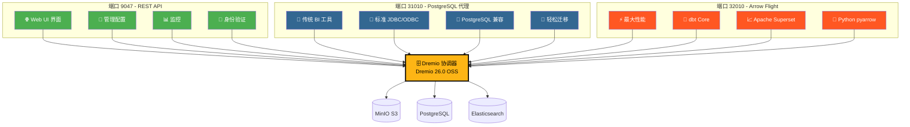
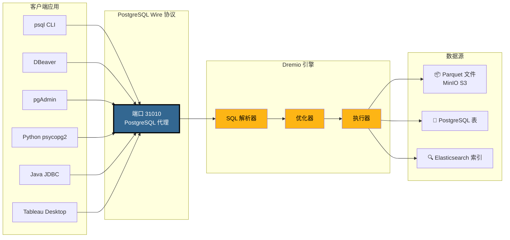
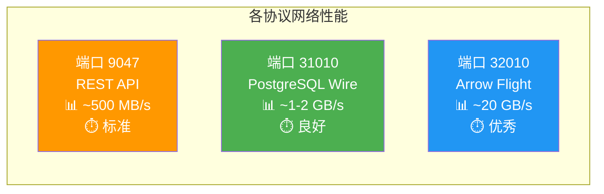
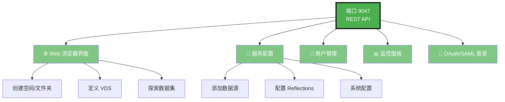
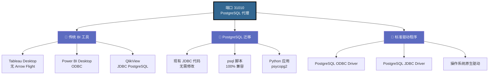
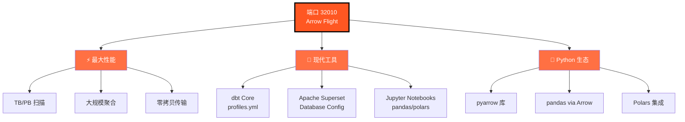
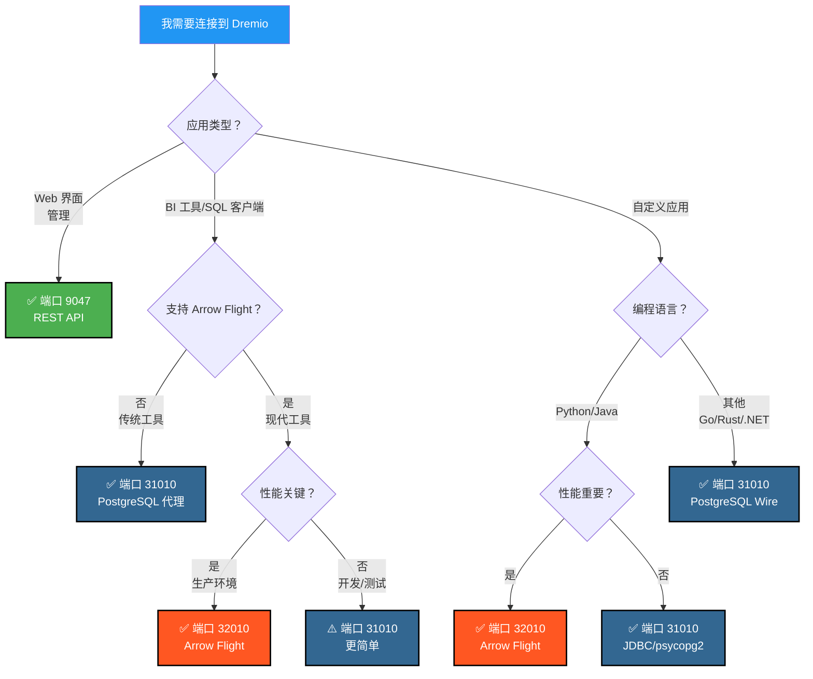
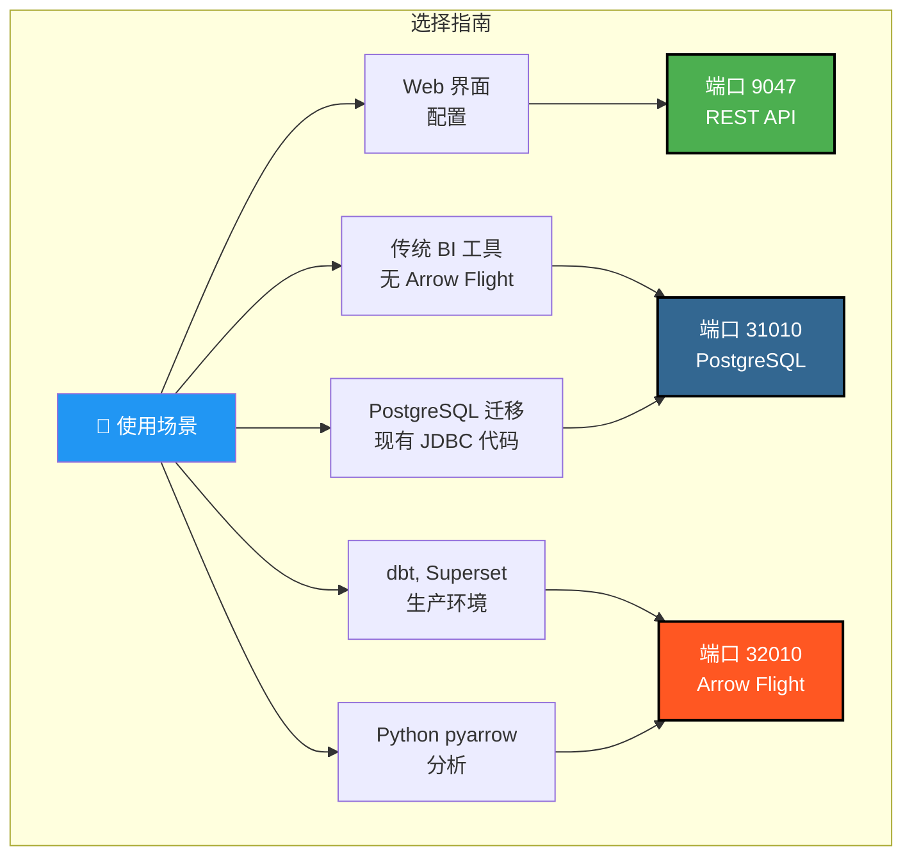

# Dremio 端口可视化指南

**版本**: 3.2.5  
**最后更新**: 2025年10月16日  
**语言**: 中文

---

## Dremio 三个端口概览



---

## PostgreSQL 代理详细架构

### 客户端 → Dremio 连接流程



---

## 性能对比

### 基准测试：扫描 100 GB 数据

```mermaid
gantt
    title 各协议执行时间（秒）
    dateFormat X
    axisFormat %s 秒
    
    section REST API :9047
    传输 100 GB     :0, 180
    
    section PostgreSQL :31010
    传输 100 GB     :0, 90
    
    section Arrow Flight :32010
    传输 100 GB     :0, 5
```



### 数据吞吐量



### 简单查询延迟

| 协议 | 端口 | 平均延迟 | 网络开销 |
|----------|------|----------------|------------------|
| **REST API** | 9047 | 50-100 毫秒 | JSON（冗长） |
| **PostgreSQL 代理** | 31010 | 20-50 毫秒 | Wire Protocol（紧凑） |
| **Arrow Flight** | 32010 | 5-10 毫秒 | Apache Arrow（二进制列式） |

---

## 各端口使用场景

### 端口 9047 - REST API



### 端口 31010 - PostgreSQL 代理



### 端口 32010 - Arrow Flight



---

## 决策树：使用哪个端口？



---

## PostgreSQL 代理连接示例

### 1. psql CLI

```bash
# 简单连接
psql -h localhost -p 31010 -U admin -d datalake

# 直接查询
psql -h localhost -p 31010 -U admin -d datalake \
  -c "SELECT COUNT(*) FROM MinIO.datalake.customers;"

# 交互模式
$ psql -h localhost -p 31010 -U admin -d datalake
Password for user admin: ****
psql (16.0, server 26.0)
Type "help" for help.

datalake=> \dt
           List of relations
 Schema |   Name    | Type  | Owner 
--------+-----------+-------+-------
 public | customers | table | admin
 public | orders    | table | admin
(2 rows)

datalake=> SELECT customer_id, name, state FROM customers LIMIT 5;
```

### 2. DBeaver 配置

```yaml
连接类型: PostgreSQL
连接名称: Dremio via PostgreSQL Proxy

主要:
  主机: localhost
  端口: 31010
  数据库: datalake
  用户名: admin
  密码: [你的密码]
  
驱动属性:
  ssl: false
  
高级:
  连接超时: 30000
  查询超时: 0
```

### 3. Python psycopg2

```python
import psycopg2
from psycopg2 import sql

# 连接
conn = psycopg2.connect(
    host="localhost",
    port=31010,
    database="datalake",
    user="admin",
    password="你的密码"
)

# 游标
cursor = conn.cursor()

# 简单查询
cursor.execute("SELECT * FROM MinIO.datalake.customers LIMIT 10")
rows = cursor.fetchall()

for row in rows:
    print(row)

# 参数化查询
query = sql.SQL("SELECT * FROM {} WHERE state = %s").format(
    sql.Identifier("MinIO", "datalake", "customers")
)
cursor.execute(query, ("CA",))

# 关闭
cursor.close()
conn.close()
```

### 4. Java JDBC

```java
import java.sql.*;

public class DremioPostgreSQLProxy {
    public static void main(String[] args) {
        String url = "jdbc:postgresql://localhost:31010/datalake";
        String user = "admin";
        String password = "你的密码";
        
        try (Connection conn = DriverManager.getConnection(url, user, password)) {
            Statement stmt = conn.createStatement();
            ResultSet rs = stmt.executeQuery(
                "SELECT customer_id, name, state FROM MinIO.datalake.customers LIMIT 10"
            );
            
            while (rs.next()) {
                int id = rs.getInt("customer_id");
                String name = rs.getString("name");
                String state = rs.getString("state");
                System.out.printf("ID: %d, Name: %s, State: %s%n", id, name, state);
            }
            
            rs.close();
            stmt.close();
        } catch (SQLException e) {
            e.printStackTrace();
        }
    }
}
```

### 5. ODBC 连接字符串 (DSN)

```ini
[ODBC Data Sources]
Dremio_PostgreSQL=PostgreSQL Unicode Driver

[Dremio_PostgreSQL]
Driver=PostgreSQL Unicode
Description=Dremio via PostgreSQL Proxy
Server=localhost
Port=31010
Database=datalake
Username=admin
Password=你的密码
SSLMode=disable
Protocol=7.4
```

---

## Docker Compose 配置

### Dremio 端口映射

```yaml
services:
  dremio:
    image: dremio/dremio-oss:26.0
    container_name: dremio
    ports:
      # 端口 9047 - REST API / Web UI
      - "9047:9047"
      
      # 端口 31010 - PostgreSQL 代理 (ODBC/JDBC)
      - "31010:31010"
      
      # 端口 32010 - Arrow Flight (高性能)
      - "32010:32010"
    environment:
      - DREMIO_JAVA_SERVER_EXTRA_OPTS=-Xms4g -Xmx8g
    volumes:
      - ./docker-volume/dremio:/opt/dremio/data
    networks:
      - data-platform
```

### 端口验证

```bash
# 检查三个端口是否开放
netstat -an | grep -E '9047|31010|32010'

# 测试 REST API
curl -v http://localhost:9047

# 测试 PostgreSQL 代理
psql -h localhost -p 31010 -U admin -d datalake -c "SELECT 1;"

# 测试 Arrow Flight (使用 Python)
python3 -c "
from pyarrow import flight
client = flight.connect('grpc://localhost:32010')
print('Arrow Flight OK')
"
```

---

## 快速视觉摘要

### 三个端口一览

| 端口 | 协议 | 主要用途 | 性能 | 兼容性 |
|------|-----------|-------------|------------|----------------|
| **9047** | REST API | 🌐 Web UI, 管理 | ⭐⭐ 标准 | ⭐⭐⭐ 通用 |
| **31010** | PostgreSQL Wire | 💼 BI 工具, 迁移 | ⭐⭐⭐ 良好 | ⭐⭐⭐ 优秀 |
| **32010** | Arrow Flight | ⚡ 生产, dbt, Superset | ⭐⭐⭐⭐⭐ 最高 | ⭐⭐ 受限 |

### 选择矩阵



---

## 附加资源

### 相关文档

- [架构 - 组件](./components.md) - "Dremio PostgreSQL 代理"部分
- [指南 - Dremio 设置](../guides/dremio-setup.md) - "通过 PostgreSQL 代理连接"部分
- [配置 - Dremio](../getting-started/configuration.md) - `dremio.conf` 配置

### 官方链接

- **Dremio 文档**: https://docs.dremio.com/
- **PostgreSQL Wire 协议**: https://www.postgresql.org/docs/current/protocol.html
- **Apache Arrow Flight**: https://arrow.apache.org/docs/format/Flight.html

---

**版本**: 3.2.5  
**最后更新**: 2025年10月16日  
**状态**: ✅ 完成
