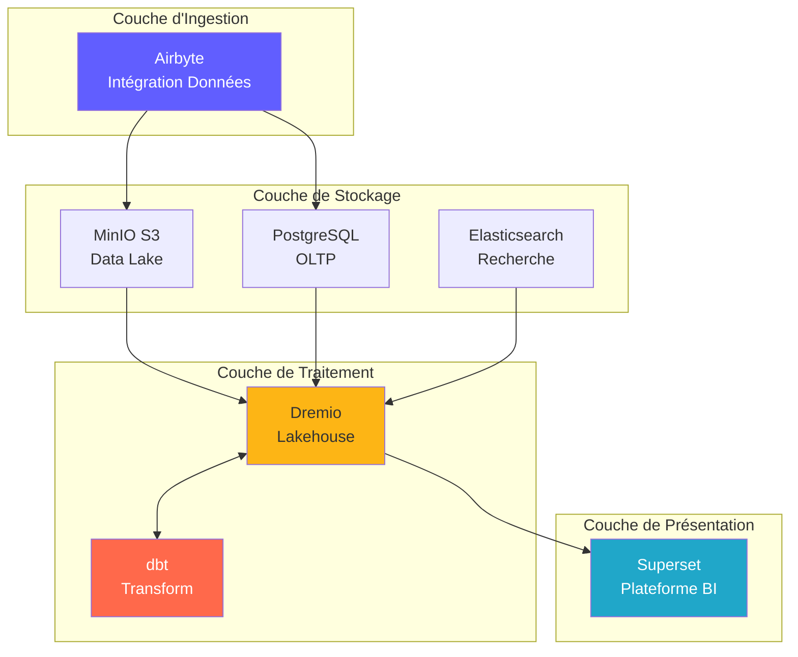
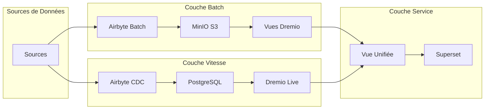
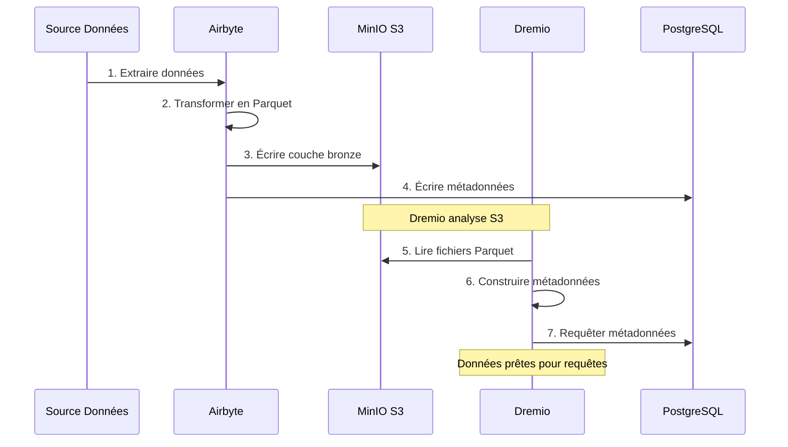
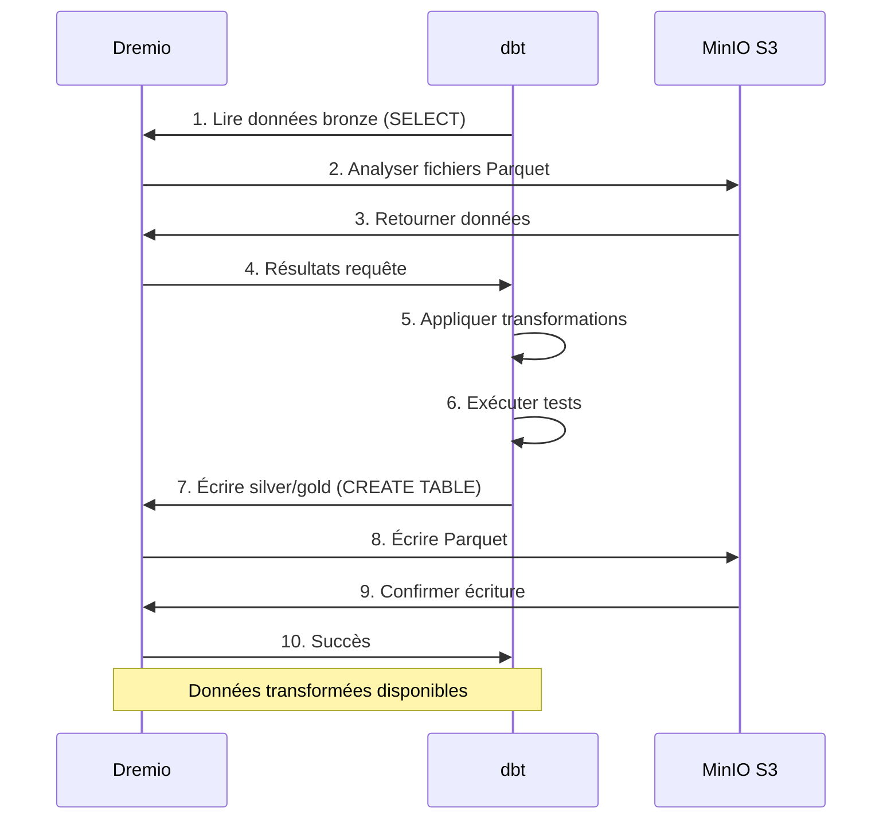
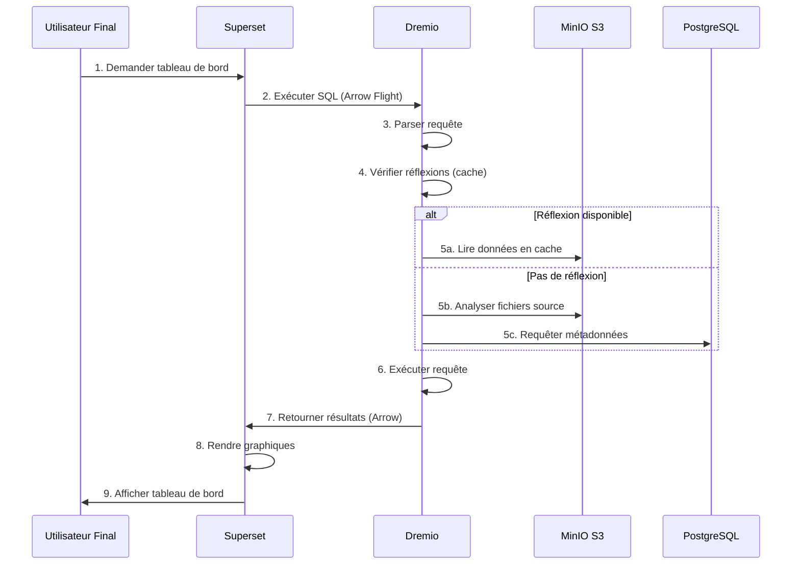
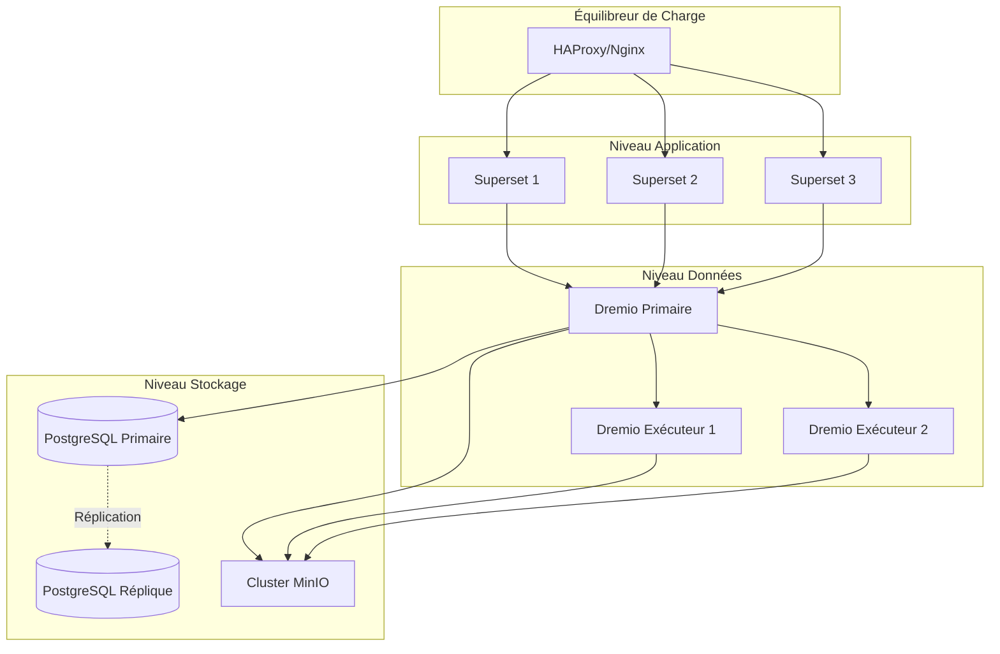
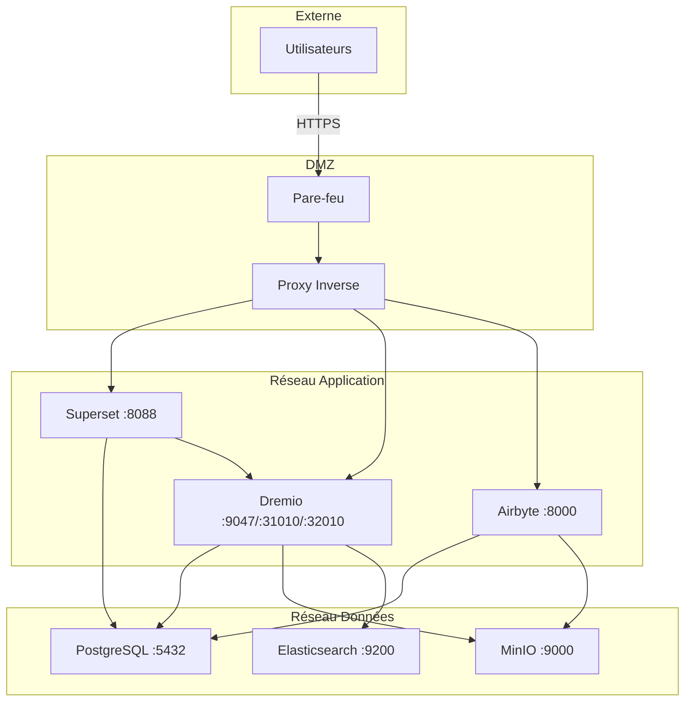
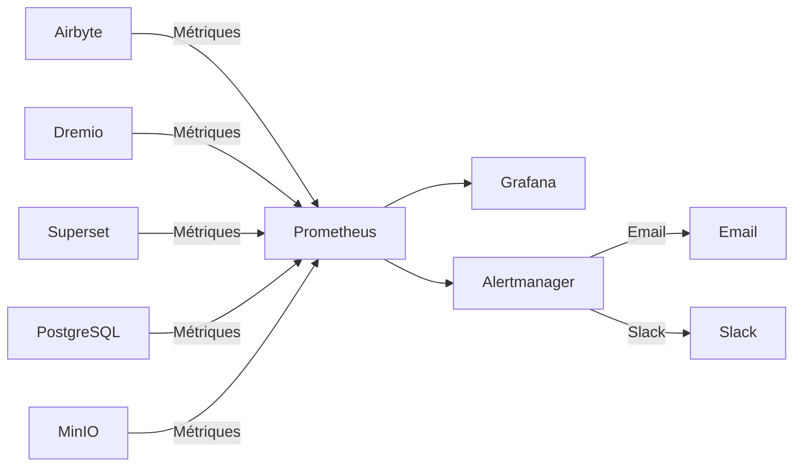

# 架构概述

**版本**：3.2.0  
**最后更新**：2025-10-16  
**语言**：法语

---

＃＃ 介绍

该数据平台是基于开源技术构建的现代云原生架构。它为数据摄取、存储、转换和可视化提供了全面的解决方案，专为企业规模的分析工作负载而设计。



---

## 设计原则

### 1. 开源第一

**理念**：使用开源技术避免供应商锁定并保持灵活性。

**好处**：
- 无许可费用
- 社区发展
- 全面的定制能力
- 透明的安全审计
- 广泛的生态系统兼容性

### 2.分层架构

**理念**：将关注点分成不同的层，以实现可维护性和可扩展性。

**层**：
```
┌─────────────────────────────────────┐
│     Couche de Présentation          │  Superset (BI & Tableaux de Bord)
├─────────────────────────────────────┤
│     Couche Sémantique               │  Dremio (Moteur de Requête)
├─────────────────────────────────────┤
│     Couche de Transformation        │  dbt (Transformation Données)
├─────────────────────────────────────┤
│     Couche de Stockage              │  MinIO, PostgreSQL, Elasticsearch
├─────────────────────────────────────┤
│     Couche d'Ingestion              │  Airbyte (Intégration Données)
└─────────────────────────────────────┘
```

### 3. ELT 而不是 ETL

**理念**：首先加载原始数据，然后转换为目标（ELT）。

**为什么选择ELT？**
- **灵活性**：以多种方式转换数据而无需重新提取
- **性能**：使用目标计算进行转换
- **可审计性**：原始数据始终可用于验证
- **成本**：减少源系统上的提取负载

**流动**：
```
Extract → Load → Transform
(Airbyte) (MinIO/PostgreSQL) (dbt + Dremio)
```

### 4.数据湖屋模型

**理念**：将数据湖的灵活性与数据仓库的性能相结合。

**特征**：
- **ACID 事务**：可信数据操作
- **模式应用**：数据质量保证
- **时光旅行**：查询历史版本
- **开放格式**：镶木地板、冰山、三角洲湖
- **直接文件访问**：无专有锁定

### 5.云原生设计

**理念**：针对容器化和分布式环境进行设计。

**执行**：
- 适用于所有服务的 Docker 容器
- 横向可扩展性
- 基础设施即代码
- 尽可能无状态
- 通过环境变量进行配置

---

## 架构模型

### Lambda架构（批处理+流）



**批次层**（历史数据）：
- 大量数据
- 定期治疗（每小时/每天）
- 可接受的高延迟
- 可进行完全再处理

**速度层**（实时数据）：
- 变更数据捕获（CDC）
- 需要低延迟
- 仅增量更新
- 管理最近的数据

**服务层**：
- 合并批次和速度视图
- 单一查询接口（Dremio）
- 自动视图选择

### 建筑奖章（铜牌 → 银牌 → 金牌）


**青铜层**（原始）：
- 数据来自来源
- 没有转变
- 保存完整的历史记录
- Airbyte 在此加载

**银层**（已清洁）：
- 应用数据质量
- 标准化格式
- dbt 分期模板
- 分析就绪

**黄金层**（职业）：
- 聚合指标
- 应用业务逻辑
- Marts dbt模型
- 针对消费进行优化

---

## 组件之间的交互

### 数据摄取流程



### 转型管道



### 执行查询



---

## 可扩展性模型

### 水平缩放

**无状态服务**（可以自由发展）：
- Airbyte Workers：为并行同步而发展
- Dremio Executors：扩展查询性能
- Web Superset：为竞争用户而进化

**有状态服务**（需要协调）：
- PostgreSQL：主副本复制
- MinIO：分布式模式（多节点）
- Elasticsearch：具有分片的集群

### 垂直缩放

**强化记忆**：
- Dremio：增加大型查询的 JVM 堆
- PostgreSQL：更多 RAM 用于缓存缓冲区
- Elasticsearch：更多的索引堆

**CPU 密集型**：
- dbt：更多内核用于并行构建模型
- Airbyte：更快的数据转换

### 数据分区

```sql
-- Exemple: Partitionner par date
CREATE TABLE orders_partitioned (
    order_id INT,
    customer_id INT,
    amount DECIMAL,
    order_date DATE
)
PARTITION BY (DATE_TRUNC('month', order_date))
STORED AS PARQUET;

-- La requête analyse uniquement les partitions pertinentes
SELECT SUM(amount)
FROM orders_partitioned
WHERE order_date >= '2025-01-01'
  AND order_date < '2025-02-01';
-- Analyse uniquement la partition de janvier
```

---

## 高可用性

### 服务冗余



### 失败场景

|组件|细分|恢复|
|----------------|--------|---------|
| **Airbyte 工人** |集装箱坠毁|自动重启，恢复同步 |
| **德雷米奥执行者** |节点故障|请求重定向到其他执行者 |
| **PostgreSQL** |主要停止服务 |在主节点中提升副本 |
| **MinIO 节点** |磁盘故障 |纠删码重构数据 |
| **超级组** |服务停止服务 |平衡器重定向流量 |

### 备份策略

```bash
# Sauvegardes automatisées quotidiennes
0 2 * * * /scripts/backup_all.sh

# backup_all.sh
#!/bin/bash

# Sauvegarder PostgreSQL
pg_dumpall -U postgres > /backups/postgres_$(date +%Y%m%d).sql

# Sauvegarder métadonnées Dremio
tar czf /backups/dremio_$(date +%Y%m%d).tar.gz /opt/dremio/data

# Synchroniser MinIO vers S3 distant
mc mirror MinIOLake/datalake s3-offsite/datalake-backup

# Conserver 30 jours
find /backups -mtime +30 -delete
```

---

## 安全架构

### 网络安全



### 身份验证和授权

**服务认证**：
- **Dremio**：LDAP/AD、OAuth2、SAML 集成
- **超级集**：数据库身份验证、LDAP、OAuth2
- **Airbyte**：基本身份验证、OAuth2（企业）
- **MinIO**：IAM 策略、STS 令牌

**授权级别**：
```yaml
Rôles:
  - Admin:
      - Accès complet à tous les services
      - Gestion utilisateurs
      - Modifications configuration
  
  - Data Engineer:
      - Créer/modifier sources données
      - Exécuter syncs Airbyte
      - Exécuter modèles dbt
      - Créer datasets Dremio
  
  - Analyst:
      - Accès lecture seule données
      - Créer tableaux de bord Superset
      - Requêter datasets Dremio
  
  - Viewer:
      - Voir tableaux de bord uniquement
      - Pas d'accès données
```

### 数据加密

**休息时**：
- MinIO：服务器端加密（AES-256）
- PostgreSQL：透明数据加密（TDE）
- Elasticsearch：加密索引

**在途中**：
- 适用于所有服务间通信的 TLS 1.3
- Dremio ↔ Superset 的带有 TLS 的 Arrow Flight
- 用于 Web 界面的 HTTPS

---

## 监控和可观察性

### 指标集合



**关键指标**：
- **Airbyte**：同步成功率、同步录音、传输字节数
- **Dremio**：请求延迟、缓存命中率、资源使用情况
- **dbt**：模型构建时间、测试失败
- **Superset**：仪表板加载时间、活跃用户
- **基础设施**：CPU、内存、磁盘、网络

### 日志记录

**集中记录**：
```yaml
Stack ELK:
  - Elasticsearch: Stocker logs
  - Logstash: Traiter logs
  - Kibana: Visualiser logs

Sources de Logs:
  - Logs application (format JSON)
  - Logs d'accès
  - Logs d'audit
  - Logs d'erreur
```

### 追踪

**分布式追踪**：
- Jaeger 或 Zipkin 集成
- 跟踪服务之间的请求
- 识别瓶颈
- 调试性能问题

---

## 部署拓扑

### 开发环境

```yaml
Hôte Unique:
  Ressources: 8 Go RAM, 4 CPUs
  Services: Tous sur une machine
  Stockage: Volumes locaux
  Réseau: Réseau bridge
  Cas d'usage: Développement, tests
```

### 暂存环境

```yaml
Multi-Hôtes:
  Ressources: 16 Go RAM, 8 CPUs par hôte
  Services: Répartis sur 2-3 hôtes
  Stockage: NFS partagé ou MinIO distribué
  Réseau: Réseau overlay
  Cas d'usage: Tests pré-production, UAT
```

### 生产环境

```yaml
Cluster Kubernetes:
  Ressources: Auto-scaling selon charge
  Services: Conteneurisés, répliqués
  Stockage: Volumes persistants (SSD)
  Réseau: Service mesh (Istio)
  Haute Disponibilité: Déploiement multi-zones
  Cas d'usage: Charges production
```

---

## 技术选择的理由

### 为什么选择 Airbyte？

- **300+ 连接器**：预构建集成
- **开源**：无供应商锁定
- **活跃社区**：12k+ GitHub star
- **CDC 支持**：实时数据捕获
- **标准化**：内置 dbt 集成

### 为什么是德雷米奥？

- **查询加速**：查询速度提高 10-100 倍
- **Arrow Flight**：高性能数据传输
- **数据湖兼容性**：无数据移动
- **自助服务**：业务用户探索数据
- **有利可图**：降低仓库成本

### 为什么是 dbt？

- **基于 SQL**：分析师熟悉
- **版本控制**：Git 集成
- **测试**：集成数据质量测试
- **文档**：自动生成的文档
- **社区**：5k+ 可用包

### 为什么是超级组？

- **现代用户界面**：直观的界面
- **SQL IDE**：高级查询功能
- **丰富的可视化**：50 多种图形类型
- **可扩展**：自定义插件
- **开源**：支持 Apache 基金会

### 为什么选择 PostgreSQL？

- **可靠性**：ACID 合规性
- **性能**：经过大规模验证
- **功能**：JSON、全文搜索、扩展
- **社区**：成熟的生态系统
- **成本**：免费且开源

### 为什么是 MinIO？

- **S3兼容性**：行业标准API
- **性能**：高流速
- **纠删码**：数据持久性
- **多云**：随处部署
- **成本效益**：自托管替代方案

---

## 架构的未来演变

### 计划的改进

1. **数据目录**（开放元数据集成）
   - 元数据管理
   - 血统追踪
   - 数据发现

2. **数据质量**（远大的期望）
   - 自动验证
   - 异常检测
   - 质量仪表板

3. **机器学习操作**（MLflow）
   - 模型训练管道
   - 模型注册
   - 部署自动化

4. **流处理** (Apache Flink)
   - 实时变换
   - 复杂事件处理
   - 流媒体分析

5. **数据治理**（Apache Atlas）
   - 政策申请
   - 访问审核
   - 合规报告

---

＃＃ 参考

- [组件详细信息](components.md)
- [数据流](data-flow.md)
- [部署指南](deployment.md)
- [Airbyte 集成](../guides/airbyte-integration.md)

---

**架构概述版本**：3.2.0  
**最后更新**：2025-10-16  
**维护者**：数据平台团队