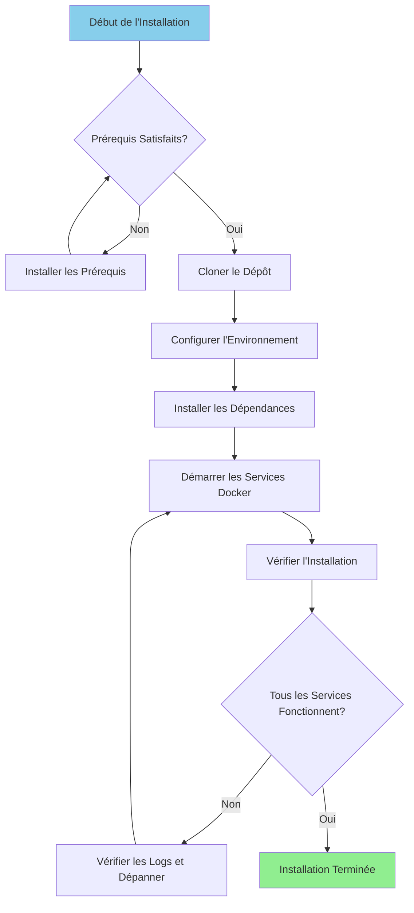

# 安装指南

**版本**：3.2.0  
**最后更新**：2025-10-16  
**语言**：法语

---

＃＃ 概述

本指南提供了安装和配置完整数据平台的分步说明，包括 Airbyte、Dremio、dbt、Apache Superset 和支持基础设施。



---

## 先决条件

### 系统要求

**最低要求：**
- **CPU**：4核（推荐8核以上）
- **RAM**：8 GB（建议 16+ GB）
- **磁盘空间**：20 GB 可用（建议 50+ GB）
- **网络**：Docker 镜像的稳定互联网连接

**操作系统：**
- Linux（Ubuntu 20.04+、CentOS 8+、Debian 11+）
- macOS (11.0+)
- 带 WSL2 的 Windows 10/11

### 所需软件

#### 1. Docker

**版本**：20.10 或更高版本

**设施：**

**Linux：**
```bash
# Installer Docker
curl -fsSL https://get.docker.com -o get-docker.sh
sudo sh get-docker.sh

# Ajouter l'utilisateur au groupe docker
sudo usermod -aG docker $USER

# Démarrer le service Docker
sudo systemctl start docker
sudo systemctl enable docker

# Vérifier l'installation
docker --version
```

**苹果系统：**
```bash
# Télécharger et installer Docker Desktop depuis:
# https://www.docker.com/products/docker-desktop

# Vérifier l'installation
docker --version
```

**视窗：**
```powershell
# Installer WSL2 d'abord
wsl --install

# Télécharger et installer Docker Desktop depuis:
# https://www.docker.com/products/docker-desktop

# Vérifier l'installation
docker --version
```

#### 2.Docker 组合

**版本**：2.0 或更高版本

**设施：**

```bash
# Linux
sudo curl -L "https://github.com/docker/compose/releases/latest/download/docker-compose-$(uname -s)-$(uname -m)" -o /usr/local/bin/docker-compose
sudo chmod +x /usr/local/bin/docker-compose

# Vérifier l'installation
docker-compose --version
```

**注意**：适用于 macOS 和 Windows 的 Docker Desktop 包括 Docker Compose。

#### 3.Python

**版本**：3.11 或更高版本

**设施：**

**Linux（Ubuntu/Debian）：**
```bash
sudo apt update
sudo apt install python3.11 python3.11-venv python3-pip
```

**苹果系统：**
```bash
brew install python@3.11
```

**视窗：**
```powershell
# Télécharger l'installateur depuis python.org
# Ou utiliser winget:
winget install Python.Python.3.11
```

**确认：**
```bash
python --version  # ou python3 --version
pip --version     # ou pip3 --version
```

#### 4. git

**设施：**

```bash
# Linux
sudo apt install git  # Ubuntu/Debian
sudo yum install git  # CentOS/RHEL

# macOS
brew install git

# Windows
winget install Git.Git
```

**确认：**
```bash
git --version
```

---

## 安装步骤

### 第 1 步：克隆存储库

```bash
# Cloner le dépôt
git clone https://github.com/your-org/dremiodbt.git

# Naviguer vers le répertoire du projet
cd dremiodbt

# Vérifier le contenu
ls -la
```

**预期结构：**
```
dremiodbt/
├── docker-compose.yml
├── docker-compose-airbyte.yml
├── README.md
├── requirements.txt
├── dbt/
├── dremio_connector/
├── docs/
└── scripts/
```

### 步骤2：配置环境

#### 创建环境文件

```bash
# Copier le fichier d'environnement exemple
cp .env.example .env

# Éditer la configuration (optionnel)
nano .env  # ou utiliser votre éditeur préféré
```

#### 环境变量

**基本配置：**
```bash
# Projet
PROJECT_NAME=dremiodbt
ENVIRONMENT=development

# Réseau Docker
NETWORK_NAME=dremio_network

# PostgreSQL
POSTGRES_HOST=postgres
POSTGRES_PORT=5432
POSTGRES_DB=dremio_db
POSTGRES_USER=postgres
POSTGRES_PASSWORD=postgres123

# Dremio
DREMIO_VERSION=26.0
DREMIO_HTTP_PORT=9047
DREMIO_FLIGHT_PORT=32010
DREMIO_ADMIN_USER=admin
DREMIO_ADMIN_PASSWORD=admin123

# Airbyte
AIRBYTE_VERSION=0.50.33
AIRBYTE_HTTP_PORT=8000
AIRBYTE_API_PORT=8001

# Superset
SUPERSET_VERSION=3.0
SUPERSET_HTTP_PORT=8088
SUPERSET_ADMIN_USER=admin
SUPERSET_ADMIN_PASSWORD=admin

# MinIO
MINIO_VERSION=latest
MINIO_API_PORT=9000
MINIO_CONSOLE_PORT=9001
MINIO_ROOT_USER=minioadmin
MINIO_ROOT_PASSWORD=minioadmin123

# Elasticsearch
ELASTIC_VERSION=8.15.0
ELASTIC_HTTP_PORT=9200
```

### 步骤 3：安装 Python 依赖项

#### 创建虚拟环境

```bash
# Créer l'environnement virtuel
python -m venv venv

# Activer l'environnement virtuel
# Linux/macOS:
source venv/bin/activate

# Windows:
.\venv\Scripts\activate
```

#### 安装要求

```bash
# Mettre à jour pip
pip install --upgrade pip

# Installer les dépendances
pip install -r requirements.txt

# Vérifier l'installation
pip list
```

**关键安装包：**
- `pyarrow>=21.0.0` - Arrow Flight 客户
- `pandas>=2.3.0` - 数据操作
- `dbt-core>=1.10.0` - 数据转换
- `sqlalchemy>=2.0.0` - 数据库连接
- `pyyaml>=6.0.0` - 配置管理

### 步骤4：启动Docker服务

#### 启动主要服务

```bash
# Démarrer tous les services
docker-compose up -d

# Ou utiliser Makefile (si disponible)
make up
```

**服务开始：**
- PostgreSQL（端口 5432）
- Dremio（端口 9047、32010）
- Apache 超级集（端口 8088）
- MinIO（端口 9000、9001）
-Elasticsearch（端口 9200）

#### 启动 Airbyte（单独撰写）

```bash
# Démarrer les services Airbyte
docker-compose -f docker-compose-airbyte.yml up -d
```

**Airbyte 服务启动：**
- Airbyte 服务器（端口 8001）
- Airbyte Web UI（端口 8000）
- Airbyte 工人
- Airbyte 时间
- Airbyte 数据库

#### 检查服务状态

```bash
# Voir les conteneurs en cours d'exécution
docker-compose ps

# Voir tous les conteneurs (incluant Airbyte)
docker ps

# Voir les logs
docker-compose logs -f

# Voir les logs Airbyte
docker-compose -f docker-compose-airbyte.yml logs -f
```

---

＃＃ 确认

### 第 5 步：检查服务

#### 1.PostgreSQL

```bash
# Tester la connexion
docker exec -it postgres psql -U postgres -d dremio_db -c "SELECT version();"
```

**预期输出：**
```
PostgreSQL 16.x on x86_64-pc-linux-gnu
```

#### 2.德雷米奥

**网页界面：**
```
http://localhost:9047
```

**第一次连接：**
- 用户名：`admin`
- 密码：`admin123`
- 首次访问时系统会提示您创建管理员帐户

**测试连接：**
```bash
# Tester le point de terminaison HTTP
curl http://localhost:9047/apiv2/login
```

#### 3.Airbyte

**网页界面：**
```
http://localhost:8000
```

**默认标识符：**
- 电子邮件：`airbyte@example.com`
- 密码：`password`

**测试API：**
```bash
# Vérification de santé
curl http://localhost:8001/health
```

**预期回应：**
```json
{
  "status": "ok",
  "timestamp": "2025-10-16T12:00:00Z"
}
```

#### 4. Apache 超集

**网页界面：**
```
http://localhost:8088
```

**默认标识符：**
- 用户名：`admin`
- 密码：`admin`

**测试连接：**
```bash
curl http://localhost:8088/health
```

#### 5.MinIO

**控制台用户界面：**
```
http://localhost:9001
```

**证书：**
- 用户名：`minioadmin`
- 密码：`minioadmin123`

**测试S3 API：**
```bash
# Installer le client MinIO
wget https://dl.min.io/client/mc/release/linux-amd64/mc
chmod +x mc

# Configurer
./mc alias set local http://localhost:9000 minioadmin minioadmin123

# Tester
./mc ls local
```

#### 6.Elasticsearch

**测试连接：**
```bash
# Vérification de santé
curl http://localhost:9200/_cluster/health

# Obtenir les informations
curl http://localhost:9200
```

**预期回应：**
```json
{
  "name": "elasticsearch",
  "cluster_name": "docker-cluster",
  "version": {
    "number": "8.15.0"
  }
}
```

### 第 6 步：运行运行状况检查

```bash
# Exécuter le script de vérification de santé complet
python scripts/health_check.py

# Ou utiliser Makefile
make health-check
```

**预期输出：**
```
✓ PostgreSQL: En cours d'exécution (port 5432)
✓ Dremio: En cours d'exécution (ports 9047, 32010)
✓ Airbyte: En cours d'exécution (ports 8000, 8001)
✓ Superset: En cours d'exécution (port 8088)
✓ MinIO: En cours d'exécution (ports 9000, 9001)
✓ Elasticsearch: En cours d'exécution (port 9200)

Tous les services sont opérationnels!
```

---

## 安装后配置

### 1.初始化Dremio

```bash
# Exécuter le script d'initialisation
python scripts/init_dremio.py
```

**创建：**
- 管理员用户
- 默认源（PostgreSQL、MinIO）
- 示例数据集

### 2. 初始化超集

```bash
# Initialiser la base de données
docker exec -it superset superset db upgrade

# Créer un utilisateur administrateur (si inexistant)
docker exec -it superset superset fab create-admin \
    --username admin \
    --firstname Admin \
    --lastname User \
    --email admin@example.com \
    --password admin

# Initialiser Superset
docker exec -it superset superset init
```

### 3.配置dbt

```bash
# Naviguer vers le répertoire dbt
cd dbt

# Tester la connexion
dbt debug

# Exécuter les modèles initiaux
dbt run

# Exécuter les tests
dbt test
```

### 4.配置Airbyte

**通过 Web 界面 (http://localhost:8000)：**

1. 完成设置向导
2.配置第一个源（例如：PostgreSQL）
3. 配置目标（例如：MinIO S3）
4. 创建连接
5. 运行第一次同步

**通过API：**
```bash
# Voir docs/i18n/fr/guides/airbyte-integration.md pour les détails
python scripts/configure_airbyte.py
```

---

## 安装后的目录结构

```
dremiodbt/
├── venv/                          # Environnement virtuel Python
├── data/                          # Stockage de données local
│   ├── dremio/                    # Métadonnées Dremio
│   ├── postgres/                  # Données PostgreSQL
│   └── minio/                     # Données MinIO
├── logs/                          # Logs applicatifs
│   ├── dremio.log
│   ├── airbyte.log
│   ├── superset.log
│   └── dbt.log
├── dbt/
│   ├── models/                    # Modèles dbt
│   ├── tests/                     # Tests dbt
│   ├── target/                    # SQL compilé
│   └── logs/                      # Logs dbt
└── docker-volume/                 # Volumes persistants Docker
    ├── db-data/                   # Données de base de données
    ├── minio-data/                # Stockage objet
    └── elastic-data/              # Index de recherche
```

---

## 故障排除

### 常见问题

#### 1. 端口已使用

**错误：**
```
Error: bind: address already in use
```

**解决方案：**
```bash
# Trouver le processus utilisant le port (exemple: 9047)
sudo lsof -i :9047

# Terminer le processus
sudo kill -9 <PID>

# Ou changer le port dans docker-compose.yml
```

#### 2.内存不足

**错误：**
```
ERROR: Insufficient memory available
```

**解决方案：**
```bash
# Augmenter l'allocation mémoire Docker
# Docker Desktop: Paramètres > Ressources > Mémoire (16Go recommandés)

# Linux: Éditer /etc/docker/daemon.json
{
  "default-ulimits": {
    "memlock": {
      "Hard": -1,
      "Name": "memlock",
      "Soft": -1
    }
  }
}

# Redémarrer Docker
sudo systemctl restart docker
```

#### 3. 服务未启动

**检查日志：**
```bash
# Voir tous les logs des services
docker-compose logs

# Voir un service spécifique
docker-compose logs dremio
docker-compose logs airbyte-server

# Suivre les logs en temps réel
docker-compose logs -f
```

#### 4. 网络问题

**重置 Docker 网络：**
```bash
# Arrêter tous les services
docker-compose down
docker-compose -f docker-compose-airbyte.yml down

# Supprimer le réseau
docker network rm dremio_network

# Redémarrer les services
docker-compose up -d
docker-compose -f docker-compose-airbyte.yml up -d
```

#### 5. 权限问题 (Linux)

**解决方案：**
```bash
# Corriger les permissions des répertoires de données
sudo chown -R $USER:$USER data/ docker-volume/

# Corriger les permissions du socket Docker
sudo chmod 666 /var/run/docker.sock
```

---

## 卸载

### 停止服务

```bash
# Arrêter les services principaux
docker-compose down

# Arrêter Airbyte
docker-compose -f docker-compose-airbyte.yml down
```

### 删除数据（可选）

```bash
# Supprimer les volumes (ATTENTION: Supprime toutes les données)
docker-compose down -v
docker-compose -f docker-compose-airbyte.yml down -v

# Supprimer les répertoires de données locaux
rm -rf data/ docker-volume/ logs/
```

### 删除 Docker 镜像

```bash
# Lister les images
docker images | grep dremio

# Supprimer des images spécifiques
docker rmi dremio/dremio-oss:24.0
docker rmi airbyte/server:0.50.33
docker rmi apache/superset:3.0

# Supprimer toutes les images non utilisées
docker image prune -a
```

---

## 后续步骤

安装成功后：

1. **配置数据源** - 参见【配置指南】(configuration.md)
2. **第一步教程** - 参见[第一步](first-steps.md)
3. **Airbyte 配置** - 请参阅[Airbyte 集成指南](../guides/airbyte-integration.md)
4. **Dremio 设置** - 请参阅 [Dremio 设置指南](../guides/dremio-setup.md)
5. **创建dbt模型** - 参见[dbt开发指南](../guides/dbt-development.md)
6. **创建仪表板** - 参见[Superset Dashboards 指南](../guides/superset-dashboards.md)

---

＃＃ 支持

对于安装问题：

- **文档**：[故障排除指南](../guides/troubleshooting.md)
- **GitHub 问题**：https://github.com/your-org/dremiodbt/issues
- **社区**：https://github.com/your-org/dremiodbt/discussions

---

**安装指南版本**：3.2.0  
**最后更新**：2025-10-16  
**维护者**：数据平台团队