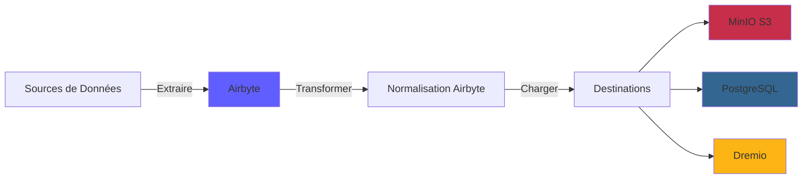
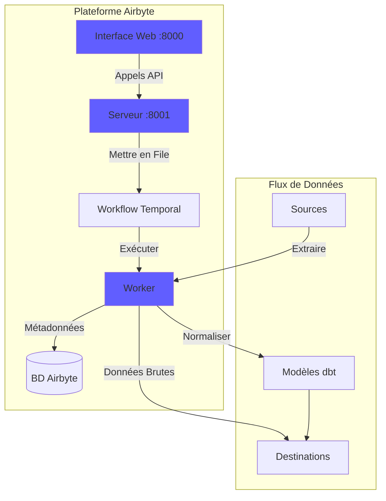
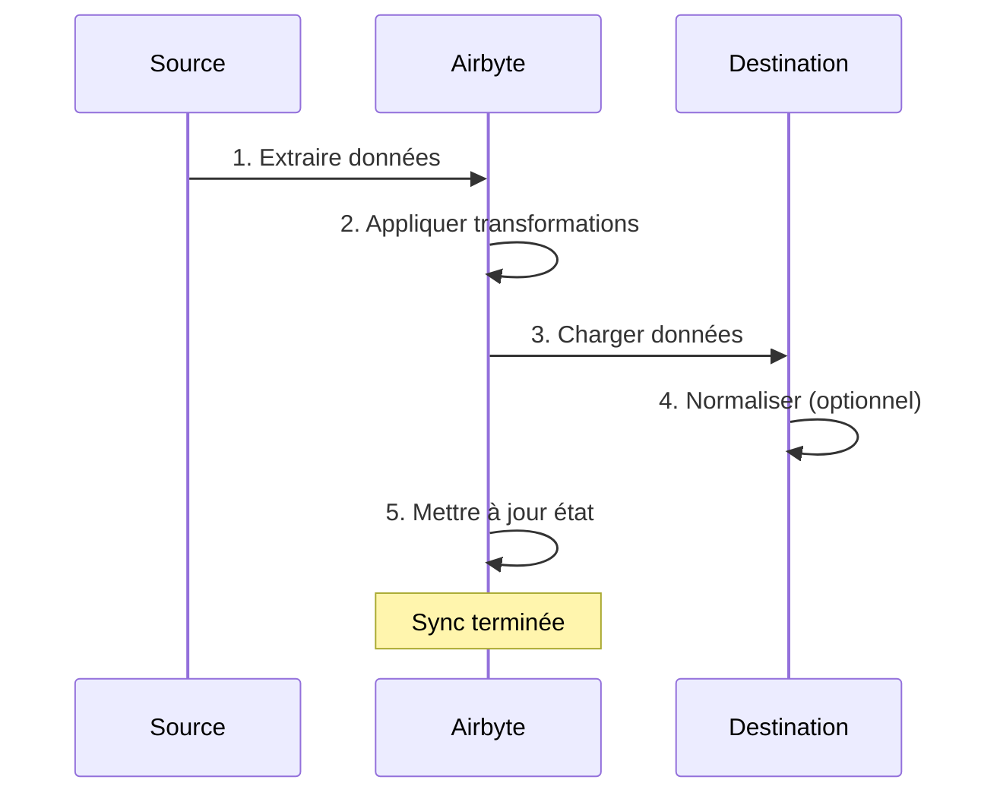
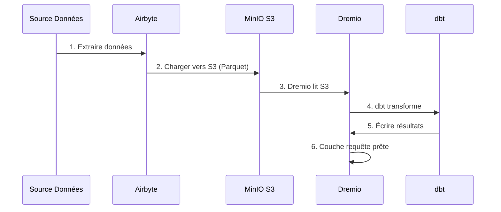

# Airbyte 集成指南

**版本**：3.2.0  
**最后更新**：2025 年 10 月 16 日  
**语言**：法语

---

＃＃ 概述

Airbyte 是一个开源数据集成平台，可简化数据从各种来源到目的地的移动。本指南涵盖将 Airbyte 集成到数据平台、配置连接器以及建立数据管道。



---

## Airbyte 是什么？

### 主要特点

- **300+ 预构建连接器**：API、数据库、文件、SaaS 应用程序
- **开源**：自托管，具有完全的数据控制
- **变更数据捕获（CDC）**：实时数据同步
- **自定义连接器**：使用 Python 或低代码 CDK 构建连接器
- **数据标准化**：将原始 JSON 转换为结构化表
- **监控和警报**：跟踪同步状态和数据质量

＃＃＃ 建筑学



---

＃＃ 设施

### 快速入门

Airbyte 包含在该平台中。开始：

```bash
# Démarrer services Airbyte
docker-compose -f docker-compose-airbyte.yml up -d

# Vérifier statut
docker-compose -f docker-compose-airbyte.yml ps

# Voir logs
docker-compose -f docker-compose-airbyte.yml logs -f
```

### 服务已启动

|服务 |港口|描述 |
|--------|------|-------------|
| **airbyte-webapp** | 8000 |网页用户界面|
| **airbyte-服务器** | 8001| API服务器|
| **airbyte-worker** | - |作业执行引擎|
| **airbyte-时间** | 7233 |工作流程编排|
| **airbyte-db** | 5432 |元数据数据库 (PostgreSQL) |

### 首次访问

**网页界面：**
```
http://localhost:8000
```

**默认标识符：**
- **电子邮件**：`airbyte@example.com`
- **密码**：`password`

**首次登录时请更改密码**以确保安全。

---

＃＃ 配置

### 配置向导

首次访问时，完成配置向导：

1. **电子邮件首选项**：配置通知
2. **Data Residency**：选择数据存储位置
3. **匿名使用统计**：接受/拒绝遥测

### 工作区设置

导航到 **设置 > 工作区**：

```yaml
Nom Workspace: Production Data Platform
ID Workspace: default
Définition Namespace: Destination Default
Format Namespace: ${SOURCE_NAMESPACE}
```

### 资源限制

**文件**：`config/airbyte/config.yaml`

```yaml
# Allocation ressources par connecteur
resources:
  source:
    cpu_limit: "1.0"
    memory_limit: "1Gi"
    cpu_request: "0.25"
    memory_request: "256Mi"
  
  destination:
    cpu_limit: "1.0"
    memory_limit: "1Gi"
    cpu_request: "0.25"
    memory_request: "256Mi"
  
  orchestrator:
    cpu_limit: "0.5"
    memory_limit: "512Mi"
```

---

## 连接器

### 源连接器

#### 源 PostgreSQL

**用例**：从事务数据库中提取数据

**配置：**

1. 导航至 **来源 > 新来源**
2. 选择**PostgreSQL**
3. 配置连接：

```yaml
Host: postgres
Port: 5432
Database: source_db
Username: readonly_user
Password: [MOT_DE_PASSE_SÉCURISÉ]
SSL Mode: prefer

Méthode Réplication: Standard
  # Ou CDC pour changements temps réel:
  # Méthode Réplication: Logical Replication (CDC)
```

**测试连接** → **设置源**

#### REST API 源

**用例**：从 API 中提取数据

**配置：**

```yaml
Name: External API
URL Base: https://api.example.com/v1
Authentication:
  Type: Bearer Token
  Token: [API_TOKEN]

Endpoints:
  - name: customers
    path: /customers
    http_method: GET
    
  - name: orders
    path: /orders
    http_method: GET
    params:
      start_date: "{{ config['start_date'] }}"
```

#### 源文件 (CSV)

**用例**：导入 CSV 文件

**配置：**

```yaml
Dataset Name: sales_data
URL: https://storage.example.com/sales.csv
Format: CSV
Provider:
  Storage: HTTPS
  User Provided Storage:
    URL: https://storage.example.com/sales.csv
```

#### 常见来源

|来源 |使用案例 |疾病预防控制中心支持|
|--------|--------|-------------|
| **PostgreSQL** |交易漫画| ✅ 是的 |
| **MySQL** |交易漫画| ✅ 是的 |
| **MongoDB** | NoSQL 文档 | ✅ 是的 |
| **销售人员** |客户关系管理数据| ❌ 否 |
| **谷歌表格** |电子表格| ❌ 否 |
| **条纹** |付款数据| ❌ 否 |
| **REST API** |定制 API | ❌ 否 |
| **S3** |文件存储 | ❌ 否 |

### 目标连接器

#### MinIO S3 目标

**用例**：将原始数据存储在数据湖中

**配置：**

1. 导航至 **目的地 > 新目的地**
2. 选择**S3**
3. 配置连接：

```yaml
S3 Bucket Name: datalake
S3 Bucket Path: airbyte-data/${NAMESPACE}/${STREAM_NAME}
S3 Bucket Region: us-east-1

# Point de terminaison MinIO
S3 Endpoint: http://minio:9000
Access Key ID: [MINIO_ROOT_USER]
Secret Access Key: [MINIO_ROOT_PASSWORD]

Output Format:
  Format Type: Parquet
  Compression: GZIP
  Block Size: 128MB
```

**测试连接** → **设置目的地**

#### PostgreSQL 目标

**用例**：加载转换后的数据进行分析

**配置：**

```yaml
Host: postgres
Port: 5432
Database: analytics_db
Username: analytics_user
Password: [MOT_DE_PASSE_SÉCURISÉ]
Default Schema: public

Normalization:
  Mode: Basic
  # Crée tables normalisées depuis JSON imbriqué
```

#### 目的地德雷米奥

**用例**：直接加载到数据湖屋

**配置：**

```yaml
Host: dremio
Port: 32010
Project: Production
Dataset: airbyte_data
Username: dremio_user
Password: [DREMIO_PASSWORD]

Connection Type: Arrow Flight
SSL: false
```

---

## 连接

### 创建连接

连接将源链接到目的地。



#### 一步一步

1. **导航到连接 > 新连接**

2. **选择源**：选择配置的源（例如：PostgreSQL）

3. **选择目的地**：选择目的地（例如：MinIO S3）

4. **配置同步**：

```yaml
Nom Connexion: PostgreSQL → MinIO
Fréquence Réplication: Every 24 hours
Namespace Destination: Custom
  Format Namespace: production_${SOURCE_NAMESPACE}

Streams:
  - customers
    Mode Sync: Full Refresh | Overwrite
    Champ Curseur: updated_at
    Clé Primaire: customer_id
    
  - orders
    Mode Sync: Incremental | Append
    Champ Curseur: created_at
    Clé Primaire: order_id
    
  - products
    Mode Sync: Full Refresh | Overwrite
    Clé Primaire: product_id
```

5. **配置标准化**（可选）：

```yaml
Normalization:
  Enable: true
  Option: Basic Normalization
  # Convertit JSON imbriqué en tables plates
```

6. **测试连接** → **设置连接**

### 同步模式

|时尚 |描述 |使用案例 |
|------|-------------|-------------|
| **全面刷新\|覆盖** |替换所有数据|尺寸表 |
| **全面刷新\|追加** |添加所有记录 |历史追踪|
| **增量\|追加** |添加新的/更新的记录 |事实表|
| **增量\|重复数据删除** |更新现有记录 | SCD 1 型 |

### 规划

**频率选项：**
- **手动**：手动触发
- **每小时**：每小时
- **每日**：每 24 小时一次（指定时间）
- **每周**：一周中的特定日期
- **Cron**：自定义调度（例如：`0 2 * * *`）

**时间表示例：**
```yaml
# Toutes les 6 heures
Cron: 0 */6 * * *

# Jours de semaine à 2h du matin
Cron: 0 2 * * 1-5

# Premier jour du mois
Cron: 0 0 1 * *
```

---

## 数据转换

### 基本标准化

Airbyte 包括使用 dbt 的**基本标准化**：

**她做什么：**
- 将嵌套 JSON 转换为平面表
- 创建表`_airbyte_raw_*`（原始 JSON）
- 创建标准化（结构化）表
- 添加元数据列（`_airbyte_emitted_at`、`_airbyte_normalized_at`）

**例子：**

**原始 JSON** (`_airbyte_raw_customers`)：
```json
{
  "_airbyte_ab_id": "uuid-123",
  "_airbyte_emitted_at": "2025-10-16T10:00:00Z",
  "_airbyte_data": {
    "id": 1,
    "name": "Acme Corp",
    "contact": {
      "email": "info@acme.com",
      "phone": "+1234567890"
    },
    "addresses": [
      {"type": "billing", "city": "New York"},
      {"type": "shipping", "city": "Boston"}
    ]
  }
}
```

**标准化表格：**

`customers`：
```sql
id | name | contact_email | contact_phone | _airbyte_normalized_at
1 | Acme Corp | info@acme.com | +1234567890 | 2025-10-16 10:05:00
```

`customers_addresses`：
```sql
_airbyte_customers_hashid | type | city
hash-123 | billing | New York
hash-123 | shipping | Boston
```

### 自定义转换 (dbt)

对于高级转换，请使用 dbt：

1. **禁用 Airbyte 标准化**
2. **创建 dbt 模型** 引用表`_airbyte_raw_*`
3. **同步Airbyte后运行dbt**

**dbt模型示例：**
```sql
-- models/staging/stg_customers.sql
with source as (
    select * from {{ source('airbyte_raw', '_airbyte_raw_customers') }}
),

parsed as (
    select
        _airbyte_ab_id,
        _airbyte_emitted_at,
        (_airbyte_data->>'id')::int as customer_id,
        _airbyte_data->>'name' as customer_name,
        _airbyte_data->'contact'->>'email' as email,
        _airbyte_data->'contact'->>'phone' as phone
    from source
)

select * from parsed
```

---

## 监控

### 同步状态

**仪表板网络界面：**
- **连接**：查看所有连接
- **同步历史记录**：过去的同步作业
- **同步日志**：每个作业的详细日志

**状态指示器：**
- 🟢 **成功**：同步成功完成
- 🔴 **失败**：同步失败（检查日志）
- 🟡 **正在运行**：同步正在进行中
- ⚪ **已取消**：同步已被用户取消

### 日志

**查看同步日志：**
```bash
# Logs serveur Airbyte
docker-compose -f docker-compose-airbyte.yml logs airbyte-server

# Logs worker (exécution sync réelle)
docker-compose -f docker-compose-airbyte.yml logs airbyte-worker

# Logs job spécifique
# Disponible dans Interface Web: Connections > [Connection] > Job History > [Job]
```

### 指标

**要监控的关键指标：**
- **同步录音**：每次同步的录音数量
- **同步字节**：传输的数据量
- **同步持续时间**：每次同步所需的时间
- **失败率**：同步失败的百分比

**导出指标：**
```bash
# API Airbyte
curl -X GET "http://localhost:8001/api/v1/jobs/list" \
  -H "Content-Type: application/json" \
  -d '{
    "configTypes": ["sync"],
    "configId": "connection-id"
  }'
```

### 警报

**在 **设置 > 通知** 中配置警报**：

```yaml
Type Notification: Slack
URL Webhook: https://hooks.slack.com/services/VOTRE/WEBHOOK/URL

Événements:
  - Échec Sync
  - Succès Sync (optionnel)
  - Connexion Désactivée

Conditions:
  - Seuil échec: 3 échecs consécutifs
```

---

## API 使用

＃＃＃ 验证

```bash
# Pas d'authentification requise pour localhost
# Pour production, configurez auth dans docker-compose-airbyte.yml
```

### 常用API调用

#### 列出来源

```bash
curl -X POST "http://localhost:8001/api/v1/sources/list" \
  -H "Content-Type: application/json" \
  -d '{
    "workspaceId": "workspace-id"
  }'
```

#### 创建连接

```bash
curl -X POST "http://localhost:8001/api/v1/connections/create" \
  -H "Content-Type: application/json" \
  -d '{
    "sourceId": "source-id",
    "destinationId": "destination-id",
    "syncCatalog": {
      "streams": [
        {
          "stream": {
            "name": "customers",
            "jsonSchema": {...}
          },
          "config": {
            "syncMode": "incremental",
            "destinationSyncMode": "append",
            "cursorField": ["updated_at"]
          }
        }
      ]
    },
    "schedule": {
      "units": 24,
      "timeUnit": "hours"
    }
  }'
```

#### 触发同步

```bash
curl -X POST "http://localhost:8001/api/v1/connections/sync" \
  -H "Content-Type: application/json" \
  -d '{
    "connectionId": "connection-id"
  }'
```

#### 获取工作状态

```bash
curl -X POST "http://localhost:8001/api/v1/jobs/get" \
  -H "Content-Type: application/json" \
  -d '{
    "id": "job-id"
  }'
```

---

## 与 Dremio 集成

### 工作流程



### 配置步骤

1. **配置 Airbyte 向 MinIO S3 充电**（见上文）

2. **在Dremio中添加S3源：**

```sql
-- Dans Interface Dremio: Sources > Add Source > S3
Nom Source: AirbyteData
Authentication: AWS Access Key
Clé Accès: [MINIO_ROOT_USER]
Clé Secrète: [MINIO_ROOT_PASSWORD]
Chemin Racine: /
Propriétés Connexion:
  fs.s3a.endpoint: minio:9000
  fs.s3a.path.style.access: true
  dremio.s3.compat: true
```

3. **在Dremio中查询Airbyte数据：**

```sql
-- Parcourir structure S3
SELECT * FROM AirbyteData.datalake."airbyte-data"

-- Requête table spécifique
SELECT *
FROM AirbyteData.datalake."airbyte-data".production_public.customers
LIMIT 100
```

4. **创建 Dremio 虚拟数据集：**

```sql
CREATE VDS airbyte_customers AS
SELECT
  id as customer_id,
  name as customer_name,
  contact_email as email,
  contact_phone as phone,
  _airbyte_emitted_at as last_updated
FROM AirbyteData.datalake."airbyte-data".production_public.customers
```

5. **用于 dbt 型号：**

```yaml
# dbt/models/sources.yml
sources:
  - name: airbyte
    schema: AirbyteData.datalake."airbyte-data".production_public
    tables:
      - name: customers
      - name: orders
      - name: products
```

---

## 最佳实践

＃＃＃ 表现

1. **尽可能使用增量同步**
2. **在非高峰时段安排同步**
3. **使用 Parquet 格式**以获得更好的压缩效果
4. **按日期对大表进行分区**
5. **监控资源使用情况**并调整限制

### 数据质量

1. **在源连接器中启用数据验证**
2. **使用主键**来检测重复项
3. **配置同步失败警报**
4. **监控数据新鲜度**指标
5. **对原始数据实施 dbt 测试**

＃＃＃ 安全

1. **对源使用只读标识符**
2. **将机密**存储在环境变量中
3. **为连接启用 SSL/TLS**
4. **定期更新您的标识符**
5. **定期审核访问日志**

### 成本优化

1. **使用压缩**（GZIP、SNAPPY）
2. **从源头删除重复数据**
3. **将旧数据**归档至冷存储
4. **监控同步频率**与要求
5. **清理失败的同步数据**

---

## 故障排除

### 常见问题

#### 同步失败：连接超时

**症状：**
```
Failed to connect to source: Connection timeout
```

**解决方案：**
```bash
# Vérifier connectivité réseau
docker exec airbyte-worker ping postgres

# Vérifier règles pare-feu
# Vérifier hôte/port source dans configuration
```

#### 内存不足错误

**症状：**
```
OOMKilled: Container exceeded memory limit
```

**解决方案：**
```yaml
# Augmenter limites mémoire dans docker-compose-airbyte.yml
services:
  airbyte-worker:
    environment:
      - JOB_MAIN_CONTAINER_MEMORY_LIMIT=2Gi
      - JOB_MAIN_CONTAINER_MEMORY_REQUEST=1Gi
```

#### 标准化失败

**症状：**
```
Normalization failed: dbt compilation error
```

**解决方案：**
```bash
# Vérifier logs dbt
docker-compose -f docker-compose-airbyte.yml logs airbyte-worker | grep dbt

# Désactiver normalisation et utiliser dbt personnalisé
# Meilleur contrôle sur logique transformation
```

#### 同步性能慢

**诊断：**
```bash
# Vérifier logs sync pour goulot d'étranglement
# Causes courantes:
# - Grand volume données
# - Requête source lente
# - Latence réseau
# - Ressources insuffisantes
```

**解决方案：**
- 增加增量同步频率
- 为光标字段添加索引
- 使用 CDC 获取实时源
- 扩展工人资源

---

## 高级主题

### 自定义连接器

使用 Airbyte CDK 构建自定义连接器：

```bash
# Cloner modèle connecteur
git clone https://github.com/airbytehq/airbyte.git
cd airbyte/airbyte-integrations/connector-templates/python

# Créer nouveau connecteur
./create_connector.sh MyCustomAPI

# Implémenter logique connecteur
# Éditer source.py, spec.yaml, schemas/

# Tester localement
python main.py check --config secrets/config.json
python main.py discover --config secrets/config.json
python main.py read --config secrets/config.json --catalog integration_tests/configured_catalog.json
```

### API 编排

使用 Python 自动化 Airbyte：

```python
import requests

AIRBYTE_API = "http://localhost:8001/api/v1"

def trigger_sync(connection_id: str):
    """Déclencher sync manuelle pour connexion"""
    response = requests.post(
        f"{AIRBYTE_API}/connections/sync",
        json={"connectionId": connection_id}
    )
    return response.json()

def get_sync_status(job_id: str):
    """Vérifier statut job sync"""
    response = requests.post(
        f"{AIRBYTE_API}/jobs/get",
        json={"id": job_id}
    )
    return response.json()

# Utilisation
job = trigger_sync("my-connection-id")
status = get_sync_status(job["job"]["id"])
print(f"Statut sync: {status['job']['status']}")
```

---

＃＃ 资源

### 文档

- **Airbyte 文档**：https://docs.airbyte.com
- **连接器目录**：https://docs.airbyte.com/integrations
- **API 参考**：https://airbyte-public-api-docs.s3.us-east-2.amazonaws.com/rapidoc-api-docs.html

＃＃＃ 社区

- **Slack**：https://slack.airbyte.io
- **GitHub**：https://github.com/airbytehq/airbyte
- **论坛**：https://discuss.airbyte.io

---

## 后续步骤

配置 Airbyte 后：

1. **设置 Dremio** - [Dremio 设置指南](dremio-setup.md)
2. **创建dbt模型** - [dbt开发指南](dbt-development.md)
3. **构建仪表板** - [Superset Dashboards 指南](superset-dashboards.md)
4. **监控质量** - [数据质量指南](data-quality.md)

---

**Airbyte 集成指南版本**：3.2.0  
**最后更新**：2025 年 10 月 16 日  
**维护者**：数据平台团队