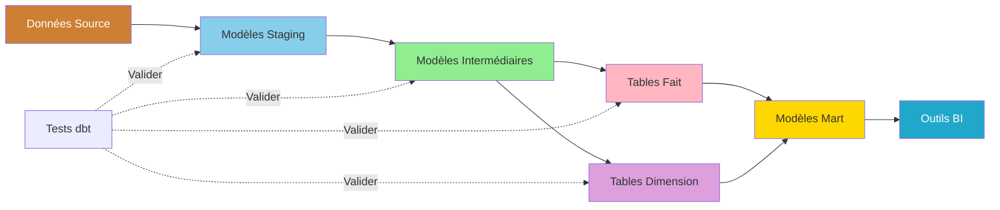
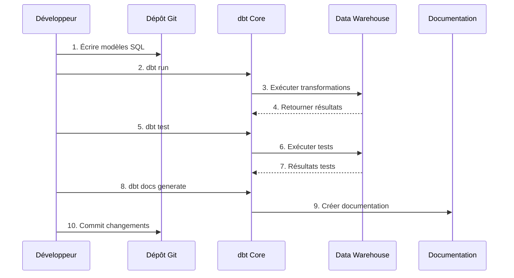

#dbt开发指南

**版本**：3.2.0  
**最后更新**：2025 年 10 月 16 日  
**语言**：法语

＃＃ 目录

1. [概述](#overview)
2. [项目配置](#project-configuration)
3.[数据建模](#data-modeling)
4. [测试框架](#test-framework)
5. [文档](#文档)
6. [宏和包](#macros-and-packages)
7. [增量模型](#incremental-models)
8. [编排工作流程](#orchestration-workflow)
9. [良好实践](#good-practices)
10. [疑难解答](#疑难解答)

---

＃＃ 概述

dbt（数据构建工具）允许分析工程师使用 SQL 和软件工程最佳实践来转换仓库中的数据。本指南涵盖了从项目初始化到高级开发技术的所有内容。

### 什么是 dbt？

dbt 使用以下方法将原始数据转换为可供分析的数据集：

- **SQL 转换**：编写 SELECT 语句，dbt 处理其余的
- **版本控制**：Git 集成以实现协作
- **测试**：集成的数据质量测试框架
- **文档**：自行生成的具有血统的文档
- **模块化**：可重用的模板和宏

### 关键概念



### dbt 工作流程



---

## 项目配置

### 初始化 dbt 项目

```bash
# Créer nouveau projet dbt
dbt init dremio_analytics

# Structure projet créée:
dremio_analytics/
├── dbt_project.yml
├── profiles.yml
├── README.md
├── models/
│   └── example/
├── tests/
├── macros/
├── snapshots/
└── analyses/
```

### 配置profiles.yml

```yaml
# ~/.dbt/profiles.yml
dremio_analytics:
  target: dev
  outputs:
    dev:
      type: dremio
      threads: 4
      host: localhost
      port: 9047
      username: "{{ env_var('DREMIO_USER') }}"
      password: "{{ env_var('DREMIO_PASSWORD') }}"
      use_ssl: false
      object_storage_source: MinIO
      object_storage_path: datalake
      datalake_name: "@{{ env_var('DREMIO_USER') }}"
      
    prod:
      type: dremio
      threads: 8
      host: dremio.production.com
      port: 443
      username: "{{ env_var('DREMIO_PROD_USER') }}"
      password: "{{ env_var('DREMIO_PROD_PASSWORD') }}"
      use_ssl: true
      object_storage_source: MinIO
      object_storage_path: datalake
      datalake_name: "Production"
```

### 配置dbt_project.yml

```yaml
# dbt_project.yml
name: 'dremio_analytics'
version: '1.0.0'
config-version: 2

profile: 'dremio_analytics'

model-paths: ["models"]
analysis-paths: ["analyses"]
test-paths: ["tests"]
seed-paths: ["seeds"]
macro-paths: ["macros"]
snapshot-paths: ["snapshots"]

target-path: "target"
clean-targets:
  - "target"
  - "dbt_packages"

# Configuration globale modèles
models:
  dremio_analytics:
    # Modèles staging - vues pour développement rapide
    staging:
      +materialized: view
      +schema: staging
      
    # Modèles intermédiaires - éphémères ou vues
    intermediate:
      +materialized: view
      +schema: intermediate
      
    # Tables fait - tables pour performance
    facts:
      +materialized: table
      +schema: facts
      
    # Tables dimension - tables pour performance
    dimensions:
      +materialized: table
      +schema: dimensions
      
    # Modèles mart - tables pour reporting
    marts:
      +materialized: table
      +schema: marts

# Documentation
docs:
  dremio_analytics:
    +enabled: true

# Configuration seed
seeds:
  dremio_analytics:
    +schema: seeds
    +quote_columns: false

# Configuration snapshot
snapshots:
  dremio_analytics:
    +target_schema: snapshots
    +strategy: timestamp
    +updated_at: updated_at

vars:
  # Variables globales
  current_year: 2025
  reporting_currency: 'USD'
```

### 环境变量

```bash
# Fichier .env (ne jamais commit sur Git!)
export DREMIO_USER=admin
export DREMIO_PASSWORD=your_secure_password
export DREMIO_PROD_USER=dbt_service_account
export DREMIO_PROD_PASSWORD=prod_password
```

### 测试连接

```bash
# Vérifier que dbt peut se connecter
dbt debug

# Sortie attendue:
# Configuration:
#   profiles.yml file [OK found and valid]
#   dbt_project.yml file [OK found and valid]
# 
# Connection:
#   host: localhost
#   port: 9047
#   user: admin
#   database: datalake
#   Connection test: [OK connection ok]
```

---

## 数据建模

### 分期模型

暂存模型清理并标准化来源的原始数据。

#### 设置来源

```yaml
# models/staging/sources.yml
version: 2

sources:
  - name: bronze
    description: Données brutes depuis ingestion Airbyte
    database: MinIO
    schema: datalake.bronze
    tables:
      - name: raw_customers
        description: Données clients brutes depuis PostgreSQL
        columns:
          - name: customer_id
            description: Clé primaire
            tests:
              - unique
              - not_null
          - name: email
            description: Adresse email client
            tests:
              - not_null
          - name: created_at
            description: Horodatage création compte
            
      - name: raw_orders
        description: Données commandes brutes
        columns:
          - name: order_id
            tests:
              - unique
              - not_null
          - name: customer_id
            tests:
              - not_null
              - relationships:
                  to: source('bronze', 'raw_customers')
                  field: customer_id
```

#### 分期模型示例

```sql
-- models/staging/stg_customers.sql
{{
    config(
        materialized='view',
        tags=['staging', 'customers']
    )
}}

WITH source AS (
    SELECT * FROM {{ source('bronze', 'raw_customers') }}
),

cleaned AS (
    SELECT
        -- Clé primaire
        customer_id,
        
        -- Standardisation nom
        TRIM(UPPER(COALESCE(first_name, ''))) AS first_name,
        TRIM(UPPER(COALESCE(last_name, ''))) AS last_name,
        TRIM(UPPER(COALESCE(first_name, ''))) || ' ' || 
        TRIM(UPPER(COALESCE(last_name, ''))) AS full_name,
        
        -- Informations contact
        LOWER(TRIM(email)) AS email,
        REGEXP_REPLACE(phone, '[^0-9]', '') AS phone_clean,
        
        -- Adresse
        TRIM(address) AS address,
        UPPER(TRIM(city)) AS city,
        UPPER(TRIM(state)) AS state,
        LPAD(CAST(zip_code AS VARCHAR), 5, '0') AS zip_code,
        UPPER(TRIM(country)) AS country,
        
        -- Horodatages
        created_at,
        updated_at,
        
        -- Métadonnées
        CURRENT_TIMESTAMP AS _dbt_loaded_at
        
    FROM source
    
    -- Filtres qualité données
    WHERE customer_id IS NOT NULL
      AND email IS NOT NULL
      AND email LIKE '%@%'
      AND created_at IS NOT NULL
)

SELECT * FROM cleaned
```

```sql
-- models/staging/stg_orders.sql
{{
    config(
        materialized='view',
        tags=['staging', 'orders']
    )
}}

WITH source AS (
    SELECT * FROM {{ source('bronze', 'raw_orders') }}
),

cleaned AS (
    SELECT
        -- Clé primaire
        order_id,
        
        -- Clés étrangères
        customer_id,
        
        -- Détails commande
        order_date,
        CAST(amount AS DECIMAL(10,2)) AS amount,
        CAST(tax AS DECIMAL(10,2)) AS tax,
        CAST(shipping AS DECIMAL(10,2)) AS shipping,
        CAST(amount + tax + shipping AS DECIMAL(10,2)) AS total_amount,
        
        -- Normalisation statut
        CASE 
            WHEN UPPER(status) IN ('COMPLETE', 'COMPLETED', 'SUCCESS') 
                THEN 'COMPLETED'
            WHEN UPPER(status) IN ('PENDING', 'PROCESSING') 
                THEN 'PENDING'
            WHEN UPPER(status) IN ('CANCEL', 'CANCELLED', 'CANCELED') 
                THEN 'CANCELLED'
            WHEN UPPER(status) IN ('FAIL', 'FAILED', 'ERROR') 
                THEN 'FAILED'
            ELSE 'UNKNOWN'
        END AS status,
        
        -- Méthode paiement
        UPPER(TRIM(payment_method)) AS payment_method,
        
        -- Horodatages
        created_at,
        updated_at,
        
        -- Métadonnées
        CURRENT_TIMESTAMP AS _dbt_loaded_at
        
    FROM source
    
    WHERE order_id IS NOT NULL
      AND customer_id IS NOT NULL
      AND order_date IS NOT NULL
      AND amount >= 0
)

SELECT * FROM cleaned
```

### 中间模型

中间模型连接并丰富数据。

```sql
-- models/intermediate/int_customer_orders.sql
{{
    config(
        materialized='view',
        tags=['intermediate', 'customer_orders']
    )
}}

WITH customers AS (
    SELECT * FROM {{ ref('stg_customers') }}
),

orders AS (
    SELECT * FROM {{ ref('stg_orders') }}
),

customer_orders AS (
    SELECT
        -- Attributs client
        c.customer_id,
        c.full_name,
        c.email,
        c.city,
        c.state,
        c.country,
        c.created_at AS customer_created_at,
        
        -- Attributs commande
        o.order_id,
        o.order_date,
        o.amount,
        o.tax,
        o.shipping,
        o.total_amount,
        o.status,
        o.payment_method,
        
        -- Champs calculés
        DATEDIFF('day', c.created_at, o.order_date) AS days_since_signup,
        CASE 
            WHEN DATEDIFF('day', c.created_at, o.order_date) <= 30 
                THEN 'New Customer'
            WHEN DATEDIFF('day', c.created_at, o.order_date) <= 180 
                THEN 'Regular Customer'
            ELSE 'Long-term Customer'
        END AS customer_segment,
        
        -- Classification commande
        CASE
            WHEN o.total_amount < 50 THEN 'Small'
            WHEN o.total_amount < 200 THEN 'Medium'
            ELSE 'Large'
        END AS order_size,
        
        CURRENT_TIMESTAMP AS _dbt_loaded_at
        
    FROM customers c
    INNER JOIN orders o
        ON c.customer_id = o.customer_id
)

SELECT * FROM customer_orders
```

### 制作的桌子

```sql
-- models/facts/fct_orders.sql
{{
    config(
        materialized='table',
        tags=['facts', 'orders']
    )
}}

WITH customer_orders AS (
    SELECT * FROM {{ ref('int_customer_orders') }}
),

order_metrics AS (
    SELECT
        -- Clés
        order_id,
        customer_id,
        
        -- Dates
        order_date,
        DATE_TRUNC('month', order_date) AS order_month,
        DATE_TRUNC('year', order_date) AS order_year,
        EXTRACT(YEAR FROM order_date) AS year,
        EXTRACT(MONTH FROM order_date) AS month,
        EXTRACT(DAY FROM order_date) AS day,
        EXTRACT(DOW FROM order_date) AS day_of_week,
        
        -- Montants
        amount,
        tax,
        shipping,
        total_amount,
        
        -- Attributs
        status,
        payment_method,
        customer_segment,
        order_size,
        
        -- Drapeaux
        CASE WHEN status = 'COMPLETED' THEN 1 ELSE 0 END AS is_completed,
        CASE WHEN status = 'CANCELLED' THEN 1 ELSE 0 END AS is_cancelled,
        
        -- Ancienneté client
        days_since_signup,
        
        -- Métadonnées
        CURRENT_TIMESTAMP AS _dbt_loaded_at
        
    FROM customer_orders
)

SELECT * FROM order_metrics
```

### 维度表

```sql
-- models/dimensions/dim_customers.sql
{{
    config(
        materialized='table',
        tags=['dimensions', 'customers']
    )
}}

WITH customers AS (
    SELECT * FROM {{ ref('stg_customers') }}
),

orders AS (
    SELECT * FROM {{ ref('stg_orders') }}
    WHERE status = 'COMPLETED'
),

customer_metrics AS (
    SELECT
        customer_id,
        COUNT(DISTINCT order_id) AS lifetime_orders,
        SUM(total_amount) AS lifetime_value,
        AVG(total_amount) AS average_order_value,
        MIN(order_date) AS first_order_date,
        MAX(order_date) AS last_order_date,
        MAX(order_date) AS most_recent_order_date
    FROM orders
    GROUP BY customer_id
),

final AS (
    SELECT
        -- Attributs client
        c.customer_id,
        c.first_name,
        c.last_name,
        c.full_name,
        c.email,
        c.phone_clean AS phone,
        c.address,
        c.city,
        c.state,
        c.zip_code,
        c.country,
        c.created_at AS registration_date,
        
        -- Métriques commande
        COALESCE(m.lifetime_orders, 0) AS lifetime_orders,
        COALESCE(m.lifetime_value, 0) AS lifetime_value,
        COALESCE(m.average_order_value, 0) AS average_order_value,
        m.first_order_date,
        m.last_order_date,
        
        -- Statut client
        CASE 
            WHEN m.customer_id IS NULL THEN 'No Orders'
            WHEN DATEDIFF('day', m.most_recent_order_date, CURRENT_DATE) <= 30 THEN 'Active'
            WHEN DATEDIFF('day', m.most_recent_order_date, CURRENT_DATE) <= 90 THEN 'At Risk'
            ELSE 'Churned'
        END AS customer_status,
        
        -- Niveau client
        CASE
            WHEN COALESCE(m.lifetime_value, 0) >= 1000 THEN 'Platinum'
            WHEN COALESCE(m.lifetime_value, 0) >= 500 THEN 'Gold'
            WHEN COALESCE(m.lifetime_value, 0) >= 100 THEN 'Silver'
            ELSE 'Bronze'
        END AS customer_tier,
        
        -- Métadonnées
        c.updated_at,
        CURRENT_TIMESTAMP AS _dbt_loaded_at
        
    FROM customers c
    LEFT JOIN customer_metrics m
        ON c.customer_id = m.customer_id
)

SELECT * FROM final
```

### 市场模型

```sql
-- models/marts/mart_customer_lifetime_value.sql
{{
    config(
        materialized='table',
        tags=['marts', 'customer_analytics']
    )
}}

WITH customers AS (
    SELECT * FROM {{ ref('dim_customers') }}
),

orders AS (
    SELECT * FROM {{ ref('fct_orders') }}
    WHERE is_completed = 1
),

customer_cohorts AS (
    SELECT
        customer_id,
        DATE_TRUNC('month', registration_date) AS cohort_month
    FROM customers
),

customer_summary AS (
    SELECT
        c.customer_id,
        c.full_name,
        c.email,
        c.city,
        c.state,
        c.registration_date,
        cc.cohort_month,
        c.customer_status,
        c.customer_tier,
        
        -- Métriques commande
        c.lifetime_orders,
        c.lifetime_value,
        c.average_order_value,
        c.first_order_date,
        c.last_order_date,
        
        -- Métriques calculées
        DATEDIFF('day', c.first_order_date, c.last_order_date) AS customer_lifespan_days,
        CASE 
            WHEN c.lifetime_orders > 1 
            THEN DATEDIFF('day', c.first_order_date, c.last_order_date) / (c.lifetime_orders - 1)
            ELSE NULL
        END AS avg_days_between_orders,
        
        -- Recency, Frequency, Monetary (RFM)
        DATEDIFF('day', c.last_order_date, CURRENT_DATE) AS recency_days,
        c.lifetime_orders AS frequency,
        c.lifetime_value AS monetary,
        
        -- Scores RFM (1-5)
        NTILE(5) OVER (ORDER BY DATEDIFF('day', c.last_order_date, CURRENT_DATE) DESC) AS recency_score,
        NTILE(5) OVER (ORDER BY c.lifetime_orders) AS frequency_score,
        NTILE(5) OVER (ORDER BY c.lifetime_value) AS monetary_score,
        
        CURRENT_TIMESTAMP AS _dbt_loaded_at
        
    FROM customers c
    LEFT JOIN customer_cohorts cc
        ON c.customer_id = cc.customer_id
)

SELECT * FROM customer_summary
```

---

## 测试框架

### 综合测试

```yaml
# models/staging/schema.yml
version: 2

models:
  - name: stg_customers
    description: Données clients nettoyées et standardisées
    columns:
      - name: customer_id
        description: Clé primaire
        tests:
          - unique
          - not_null
          
      - name: email
        description: Email client
        tests:
          - not_null
          - unique
          
      - name: state
        description: Code état US
        tests:
          - accepted_values:
              values: ['CA', 'NY', 'TX', 'FL', 'IL']
              quote: true
              
      - name: created_at
        description: Date inscription
        tests:
          - not_null
          - dbt_utils.expression_is_true:
              expression: ">= '2020-01-01'"
```

### 个性化测试

```sql
-- tests/assert_positive_order_amounts.sql
-- Test que tous les montants commande sont positifs

SELECT
    order_id,
    customer_id,
    amount
FROM {{ ref('stg_orders') }}
WHERE amount < 0
```

```sql
-- tests/assert_valid_email_format.sql
-- Test que tous les emails ont un format valide

SELECT
    customer_id,
    email
FROM {{ ref('stg_customers') }}
WHERE email NOT LIKE '%@%.%'
   OR email LIKE '%..%'
   OR email LIKE '.%'
   OR email LIKE '%.'
```

### 通用测试

```sql
-- macros/generic_tests/test_not_empty_string.sql


SELECT *
FROM {{ model }}
WHERE {{ column_name }} IS NULL
   OR TRIM({{ column_name }}) = ''


```

使用：
```yaml
# models/staging/schema.yml
columns:
  - name: full_name
    tests:
      - not_empty_string
```

### 运行测试

```bash
# Exécuter tous les tests
dbt test

# Exécuter tests pour modèle spécifique
dbt test --select stg_customers

# Exécuter tests pour tag spécifique
dbt test --select tag:staging

# Exécuter type test spécifique
dbt test --select test_type:unique
dbt test --select test_type:not_null
```

---

## 文档

### 模型文档

```yaml
# models/marts/schema.yml
version: 2

models:
  - name: mart_customer_lifetime_value
    description: |
      Analyse valeur vie client avec segmentation RFM.
      
      Ce mart combine les attributs client avec le comportement d'achat
      pour calculer la valeur vie, les scores RFM et les segments client.
      
      **Fréquence Mise à Jour**: Quotidien à 2h UTC
      
      **Sources de Données**:
      - dim_customers: Données maître client
      - fct_orders: Commandes complètes uniquement
      
      **Métriques Clés**:
      - Valeur Vie: Revenu total du client
      - Scores RFM: Recency, Frequency, Monetary (échelle 1-5)
      - Niveau Client: Bronze/Silver/Gold/Platinum
      
    columns:
      - name: customer_id
        description: Identifiant client unique (PK)
        tests:
          - unique
          - not_null
          
      - name: lifetime_value
        description: |
          Revenu total généré par le client sur toutes les commandes complètes.
          Exclut les commandes annulées et échouées.
        tests:
          - not_null
          
      - name: recency_score
        description: |
          Score RFM recency (1-5).
          5 = Achat le plus récent (meilleur)
          1 = Achat le plus ancien (pire)
          
      - name: frequency_score
        description: |
          Score RFM frequency (1-5).
          5 = Plus de commandes (meilleur)
          1 = Moins de commandes (pire)
          
      - name: monetary_score
        description: |
          Score RFM monetary (1-5).
          5 = Dépenses les plus élevées (meilleur)
          1 = Dépenses les plus faibles (pire)
```

### 添加描述

```sql
-- models/staging/stg_customers.sql
{{
    config(
        materialized='view',
        tags=['staging', 'customers']
    )
}}

-- Description: Modèle staging pour données client
-- Source: bronze.raw_customers (depuis PostgreSQL via Airbyte)
-- Transformations:
--   - Standardisation nom (UPPER TRIM)
--   - Normalisation email (minuscules)
--   - Nettoyage téléphone (chiffres uniquement)
--   - Padding code postal (5 chiffres)
-- Qualité Données: Filtre enregistrements avec IDs null ou emails invalides

WITH source AS (
    SELECT * FROM {{ source('bronze', 'raw_customers') }}
),
...
```

### 生成文档

```bash
# Générer site documentation
dbt docs generate

# Servir documentation localement
dbt docs serve

# Ouvre navigateur sur http://localhost:8080
```

**功能文档**：
- **谱系图**：模型依赖关系的可视化表示
- **列详细信息**：描述、类型、测试
- **来源新鲜度**：数据加载时
- **项目视图**：自述文件内容
- **搜索**：查找模型、列、描述

---

## 宏和包

### 自定义宏

```sql
-- macros/calculate_age.sql

    DATEDIFF('year', {{ birth_date }}, CURRENT_DATE)

```

使用：
```sql
SELECT
    customer_id,
    {{ calculate_age('birth_date') }} AS age
FROM {{ ref('stg_customers') }}
```

### 可重复使用的 SQL 片段

```sql
-- macros/generate_schema_name.sql

    
    
        {{ default_schema }}
    
        {{ custom_schema_name | trim }}
    

```

### 安装包

```yaml
# packages.yml
packages:
  - package: dbt-labs/dbt_utils
    version: 1.1.1
    
  - package: calogica/dbt_expectations
    version: 0.10.1
    
  - package: dbt-labs/codegen
    version: 0.12.1
```

安装包：
```bash
dbt deps

# Packages installés dans dbt_packages/
```

### 使用宏包

```sql
-- Utiliser dbt_utils
SELECT
    {{ dbt_utils.surrogate_key(['customer_id', 'order_id']) }} AS unique_key,
    customer_id,
    order_id
FROM {{ ref('int_customer_orders') }}
```

```yaml
# Utiliser dbt_expectations
tests:
  - dbt_expectations.expect_column_values_to_be_between:
      min_value: 0
      max_value: 10000
      
  - dbt_expectations.expect_column_values_to_match_regex:
      regex: "^[A-Z]{2}$"
```

---

## 增量模型

### 基本增量模型

```sql
-- models/facts/fct_orders_incremental.sql
{{
    config(
        materialized='incremental',
        unique_key='order_id',
        on_schema_change='sync_all_columns'
    )
}}

SELECT
    order_id,
    customer_id,
    order_date,
    amount,
    status,
    updated_at
FROM {{ ref('stg_orders') }}


    -- Traiter uniquement enregistrements nouveaux ou mis à jour
    WHERE updated_at > (SELECT MAX(updated_at) FROM {{ this }})

```

### 增量策略

#### 1. 追加策略

```sql
{{
    config(
        materialized='incremental',
        incremental_strategy='append'
    )
}}

SELECT * FROM {{ ref('stg_events') }}


    WHERE event_timestamp > (SELECT MAX(event_timestamp) FROM {{ this }})

```

#### 2. 合并策略

```sql
{{
    config(
        materialized='incremental',
        unique_key='order_id',
        incremental_strategy='merge',
        merge_update_columns=['status', 'updated_at']
    )
}}

SELECT
    order_id,
    customer_id,
    order_date,
    amount,
    status,
    updated_at
FROM {{ ref('stg_orders') }}


    WHERE updated_at > (SELECT MAX(updated_at) FROM {{ this }})

```

#### 3.删除+插入策略

```sql
{{
    config(
        materialized='incremental',
        unique_key='order_date',
        incremental_strategy='delete+insert'
    )
}}

SELECT
    order_date,
    COUNT(*) AS order_count,
    SUM(amount) AS total_revenue
FROM {{ ref('fct_orders') }}


    WHERE order_date >= CURRENT_DATE - INTERVAL '7' DAY


GROUP BY order_date
```

### 完全刷新

```bash
# Forcer rafraîchissement complet modèle incrémental
dbt run --full-refresh --select fct_orders_incremental

# Ou pour tous les modèles incrémentaux
dbt run --full-refresh --select config.materialized:incremental
```

---

## 编排工作流程

### dbt 运行命令

```bash
# Exécuter tous les modèles
dbt run

# Exécuter modèle spécifique
dbt run --select stg_customers

# Exécuter modèle et dépendances aval
dbt run --select stg_customers+

# Exécuter modèle et dépendances amont
dbt run --select +stg_customers

# Exécuter modèles par tag
dbt run --select tag:staging
dbt run --select tag:facts

# Exécuter modèles par chemin
dbt run --select models/staging/
dbt run --select models/marts/

# Exclure modèles
dbt run --exclude tag:deprecated
```

### 完整管道

```bash
#!/bin/bash
# scripts/run_dbt_pipeline.sh

set -e  # Sortir sur erreur

echo "Démarrage pipeline dbt..."

# 1. Compiler projet
echo "Compilation projet..."
dbt compile

# 2. Exécuter modèles staging
echo "Exécution modèles staging..."
dbt run --select tag:staging

# 3. Tester modèles staging
echo "Test modèles staging..."
dbt test --select tag:staging

# 4. Exécuter modèles intermédiaires
echo "Exécution modèles intermédiaires..."
dbt run --select tag:intermediate

# 5. Exécuter faits et dimensions
echo "Exécution faits et dimensions..."
dbt run --select tag:facts tag:dimensions

# 6. Tester faits et dimensions
echo "Test faits et dimensions..."
dbt test --select tag:facts tag:dimensions

# 7. Exécuter marts
echo "Exécution marts..."
dbt run --select tag:marts

# 8. Tester marts
echo "Test marts..."
dbt test --select tag:marts

# 9. Générer documentation
echo "Génération documentation..."
dbt docs generate

echo "Pipeline terminé!"
```

### 气流集成

```python
# dags/dbt_pipeline_dag.py
from airflow import DAG
from airflow.operators.bash import BashOperator
from datetime import datetime, timedelta

default_args = {
    'owner': 'data-team',
    'depends_on_past': False,
    'start_date': datetime(2025, 10, 1),
    'email_on_failure': True,
    'email_on_retry': False,
    'retries': 2,
    'retry_delay': timedelta(minutes=5),
}

dag = DAG(
    'dbt_daily_pipeline',
    default_args=default_args,
    description='Pipeline transformation dbt quotidien',
    schedule_interval='0 2 * * *',  # 2h quotidien
    catchup=False,
    tags=['dbt', 'transformation'],
)

# Tâche: Exécuter modèles staging
run_staging = BashOperator(
    task_id='run_staging',
    bash_command='cd /opt/dbt && dbt run --select tag:staging',
    dag=dag,
)

# Tâche: Tester modèles staging
test_staging = BashOperator(
    task_id='test_staging',
    bash_command='cd /opt/dbt && dbt test --select tag:staging',
    dag=dag,
)

# Tâche: Exécuter faits et dimensions
run_facts_dims = BashOperator(
    task_id='run_facts_dimensions',
    bash_command='cd /opt/dbt && dbt run --select tag:facts tag:dimensions',
    dag=dag,
)

# Tâche: Exécuter marts
run_marts = BashOperator(
    task_id='run_marts',
    bash_command='cd /opt/dbt && dbt run --select tag:marts',
    dag=dag,
)

# Tâche: Générer docs
generate_docs = BashOperator(
    task_id='generate_docs',
    bash_command='cd /opt/dbt && dbt docs generate',
    dag=dag,
)

# Définir dépendances tâches
run_staging >> test_staging >> run_facts_dims >> run_marts >> generate_docs
```

---

## 最佳实践

### 1. 命名约定

```
Staging:     stg_{source}_{table}        ex: stg_postgres_customers
Intermédiaire: int_{entity}_{verb}         ex: int_customer_orders
Faits:       fct_{entity}                ex: fct_orders
Dimensions:  dim_{entity}                ex: dim_customers
Marts:       mart_{business_area}_{entity} ex: mart_finance_revenue
```

### 2. 文件夹结构

```
models/
├── staging/
│   ├── postgres/
│   │   ├── stg_postgres_customers.sql
│   │   └── stg_postgres_orders.sql
│   ├── stripe/
│   │   └── stg_stripe_payments.sql
│   └── sources.yml
├── intermediate/
│   ├── int_customer_orders.sql
│   └── int_customer_payments.sql
├── facts/
│   ├── fct_orders.sql
│   └── fct_payments.sql
├── dimensions/
│   ├── dim_customers.sql
│   └── dim_products.sql
└── marts/
    ├── finance/
    │   └── mart_finance_revenue.sql
    └── marketing/
        └── mart_marketing_attribution.sql
```

### 3. 使用 CTE

```sql
-- Bon: CTEs claires et lisibles
WITH source_data AS (
    SELECT * FROM {{ source('bronze', 'raw_orders') }}
),

filtered_data AS (
    SELECT *
    FROM source_data
    WHERE order_date >= '2025-01-01'
),

final AS (
    SELECT
        order_id,
        SUM(amount) AS total_amount
    FROM filtered_data
    GROUP BY order_id
)

SELECT * FROM final
```

### 4. 尽早添加测试

```yaml
# Toujours tester clés primaires
tests:
  - unique
  - not_null

# Tester clés étrangères
tests:
  - relationships:
      to: ref('dim_customers')
      field: customer_id

# Tester logique métier
tests:
  - dbt_utils.expression_is_true:
      expression: "total_amount >= 0"
```

### 5.记录一切

```sql
-- Bonne documentation
-- models/marts/mart_customer_ltv.sql

-- Objectif: Calculer valeur vie client avec segmentation RFM
-- Propriétaire: Équipe Analytics (analytics@company.com)
-- Fréquence Mise à Jour: Quotidien à 2h
-- Dépendances: dim_customers, fct_orders
-- Consommateurs: Tableau de bord exécutif, campagnes marketing
-- SLA: Doit terminer avant 6h pour rapports quotidiens
```

---

## 故障排除

### 常见问题

####问题1：编译错误

**错误**：`Compilation Error: Model not found`

**解决方案**：
```bash
# Vérifier si modèle existe
ls models/staging/stg_customers.sql

# Vérifier syntaxe ref()
SELECT * FROM {{ ref('stg_customers') }}  # Correct
SELECT * FROM {{ ref('staging.stg_customers') }}  # Incorrect
```

#### 问题 2：循环依赖

**错误**：`Compilation Error: Circular dependency detected`

**解决方案**：
```bash
# Visualiser lignage
dbt docs generate
dbt docs serve

# Vérifier graphe dépendances dans interface
# Corriger en supprimant références circulaires
```

#### 问题 3：测试失败

**错误**：`ERROR test not_null_stg_customers_email (FAIL 15)`

**解决方案**：
```sql
-- Déboguer test échoué
SELECT *
FROM {{ ref('stg_customers') }}
WHERE email IS NULL;

-- Corriger données source ou ajouter filtre
WHERE email IS NOT NULL
```

#### 问题 4：增量模型不起作用

**错误**：增量模型每次都从头开始重建

**解决方案**：
```sql
-- Vérifier unique_key défini
{{
    config(
        unique_key='order_id'  -- Doit être défini
    )
}}

-- Vérifier condition if

    -- Ce bloc doit exister
    WHERE updated_at > (SELECT MAX(updated_at) FROM {{ this }})

```

---

＃＃ 概括

这份完整的 dbt 开发指南涵盖了：

- **项目配置**：初始化、配置、环境配置
- **数据建模**：暂存、中间、事实、维度和市场模型
- **框架测试**：集成测试、自定义测试、通用测试
- **文档**：模型文档、自动生成的站点文档
- **宏和包**：可重用代码、dbt_utils、期望
- **增量模型**：策略追加、合并、删除+插入
- **工作流程编排**：dbt 命令、管道脚本、Airflow 集成
- **良好实践**：命名约定、文件夹结构、文档
- **故障排除**：常见问题和解决方案

要记住的要点：
- 使用SQL SELECT语句，dbt管理DDL/DML
- 使用集成测试框架尽早并经常进行测试
- 用于自助分析的文档模型
- 对大型表使用增量模型
- 遵循一致的命名约定
- 利用通用功能包

**相关文档：**
- [Dremio 设置指南](./dremio-setup.md)
- [数据质量指南](./data-quality.md)
- [架构：数据流](../architecture/data-flow.md)
- [第一步教程](../getting-started/first-steps.md)

---

**版本**：3.2.0  
**最后更新**：2025 年 10 月 16 日