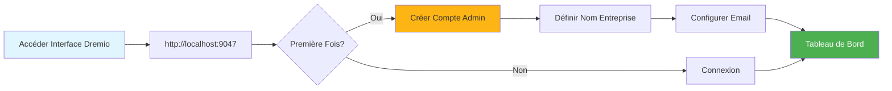
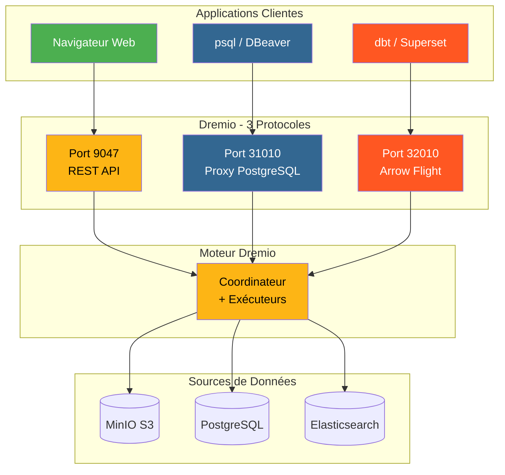
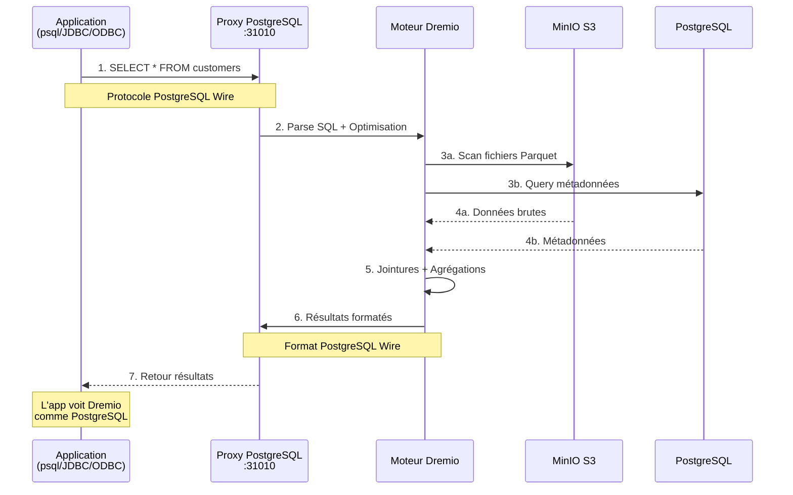
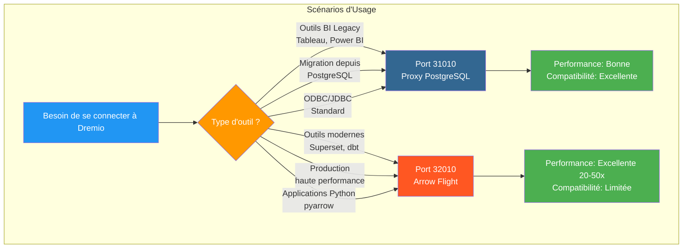
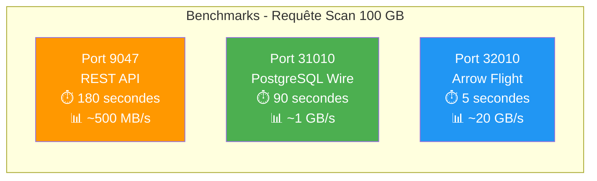
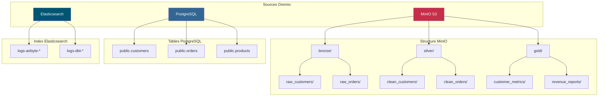
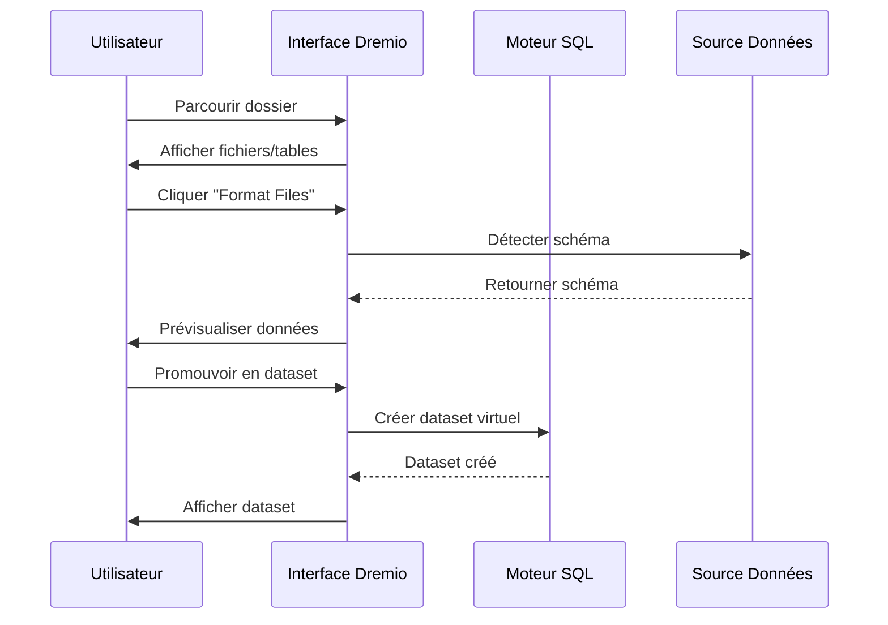
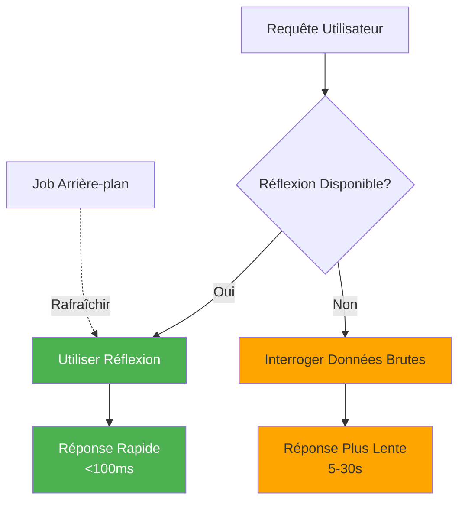

# Dremio 配置指南

**版本**：3.2.0  
**最后更新**：2025 年 10 月 16 日  
**语言**：法语

＃＃ 目录

1. [概述](#overview)
2. [初始配置](#initial-configuration)
3. [数据源配置](#data-source-configuration)
4. [虚拟数据集](#virtual-datasets)
5. [想法（加速查询）](#thoughts-acceleration-queries)
6. [安全和访问控制](#security-and-access-control)
7.【性能优化】(#performance-optimization)
8. [与 dbt 集成](#integration-with-dbt)
9. [监控和维护](#monitoring-and-maintenance)
10. [疑难解答](#疑难解答)

---

＃＃ 概述

Dremio 是数据湖屋平台，为跨多个源查询数据提供统一的界面。本指南涵盖了从初始设置到高级优化技术的所有内容。

### Dremio 是什么？

Dremio 将数据湖的灵活性与数据仓库的性能结合起来：

- **数据虚拟化**：查询数据而不移动或复制数据
- **查询加速**：使用反射自动缓存
- **自助分析**：业务用户可以直接探索数据
- **SQL 标准**：没有专有的查询语言
- **Apache Arrow**：高性能柱状格式

### 主要特点

|特色 |描述 |利润|
|----------------|---------|---------|
| **想法** |智能查询加速 |查询速度提高 10-100 倍 |
| **数据虚拟化** |来源统一观点|无数据重复 |
| **箭飞行** |高速数据传输|比 ODBC/JDBC 快 20-50 倍 |
| **语义层** |面向业务的字段名称 |自助分析 |
| **Git 数据** |数据集版本控制 |协作和回滚|

---

## 初始配置

### 先决条件

在开始之前，请确保您拥有：
- Dremio 容器正在运行（请参阅[安装指南](../getting-started/installation.md)）
- 访问数据源（MinIO、PostgreSQL等）
- 管理员凭据

### 第一次连接



#### 第 1 步：访问 Dremio 界面

打开浏览器并导航至：
```
http://localhost:9047
```

#### 第 2 步：创建管理员帐户

首次启动时，系统将提示您创建管理员帐户：

```
Nom d'utilisateur: admin
Prénom: Admin
Nom: Utilisateur
Email: admin@example.com
Mot de passe: [mot de passe sécurisé]
```

**安全注意事项**：使用至少 12 个字符的强密码，包括大写、小写、数字和特殊字符。

#### 步骤 3：初始设置

```json
{
  "companyName": "Votre Organisation",
  "supportEmail": "support@talentys.eu",
  "supportKey": "votre-clé-support-si-entreprise"
}
```

### 配置文件

Dremio 配置通过 `dremio.conf` 进行管理：

```conf
# dremio.conf

paths: {
  local: "/opt/dremio/data"
  dist: "dremioS3:///dremio-data"
}

services: {
  coordinator.enabled: true
  coordinator.master.enabled: true
  
  executor.enabled: true
  
  # Paramètres mémoire
  coordinator.master.heap_memory_mb: 4096
  executor.heap_memory_mb: 8192
}

# Configuration réseau
services.coordinator.web.port: 9047
services.coordinator.client.port: 31010
services.coordinator.flight.port: 32010

# Ajustement performance
store.plugin.max_metadata_leaf_columns: 800
planner.enable_broadcast_join: true
planner.slice_target: 100000
```

### 环境变量

```bash
# Section environment de docker-compose.yml
environment:
  - DREMIO_JAVA_SERVER_EXTRA_OPTS=-Xms2g -Xmx4g
  - DREMIO_JAVA_FLIGHT_EXTRA_OPTS=-Xms1g -Xmx2g
  - DREMIO_MAX_MEMORY_SIZE_MB=8192
  - DREMIO_HOME=/opt/dremio
```

### 通过 PostgreSQL 代理连接

Dremio 在端口 31010 上公开了 PostgreSQL 兼容接口，允许 PostgreSQL 兼容工具无需修改即可连接。

#### Dremio 连接架构



#### 通过 PostgreSQL 代理的查询流程



#### 代理配置

PostgreSQL 代理在 `dremio.conf` 中自动启用：

```conf
# Configuration du proxy PostgreSQL (ODBC/JDBC)
services.coordinator.client.port: 31010
```

#### 与 psql 的连接

```bash
# Connexion directe avec psql
psql -h localhost -p 31010 -U admin -d datalake

# Exemple de requête
psql -h localhost -p 31010 -U admin -d datalake -c "SELECT * FROM MinIO.datalake.customers LIMIT 10;"
```

#### 与 DBeaver / pgAdmin 连接

连接设置：

```yaml
Type: PostgreSQL
Host: localhost
Port: 31010
Database: datalake
Username: admin
Password: <votre-mot-de-passe>
SSL: Désactivé (en développement)
```

#### 连接通道

**数据库连接：**
```java
String url = "jdbc:postgresql://localhost:31010/datalake";
Properties props = new Properties();
props.setProperty("user", "admin");
props.setProperty("password", "votre-mot-de-passe");
Connection conn = DriverManager.getConnection(url, props);
```

**ODBC (DSN)：**
```ini
[Dremio via PostgreSQL]
Driver=PostgreSQL Unicode
Server=localhost
Port=31010
Database=datalake
Username=admin
Password=<votre-mot-de-passe>
SSLMode=disable
```

**Python (psycopg2):**
```python
import psycopg2

conn = psycopg2.connect(
    host="localhost",
    port=31010,
    database="datalake",
    user="admin",
    password="votre-mot-de-passe"
)

cursor = conn.cursor()
cursor.execute("SELECT * FROM MinIO.datalake.customers LIMIT 10")
rows = cursor.fetchall()
```

#### 何时使用 PostgreSQL 代理



|场景|使用 PostgreSQL 代理 |使用箭飞行 |
|---------|----------------------------------------|------------------------|
| **BI 旧版工具**（不支持 Arrow Flight）| ✅ 是的 | ❌ 否 |
| **从 PostgreSQL 迁移**（现有 JDBC/ODBC 代码） | ✅ 是的 | ❌ 否 |
| **高性能生产** | ❌ 否 | ✅ 是（快 20-50 倍）|
| **Superset、dbt、现代工具** | ❌ 否 | ✅ 是的 |
| **快速开发/测试** | ✅ 是（熟悉）| ⚠️都可以|

#### 3个端口的性能比较



**建议**：使用 PostgreSQL 代理（端口 31010）实现 **兼容性**，使用 Arrow Flight（端口 32010）实现 **生产性能**。

---

## 配置数据源

### 添加源 MinIO S3

MinIO 是您的主要数据湖存储。

#### 第 1 步：导航至来源

```
Interface Dremio → Datasets → Add Source → Object Storage → Amazon S3
```

#### 步骤 2：配置 S3 连接

```json
{
  "name": "MinIO",
  "config": {
    "credentialType": "ACCESS_KEY",
    "accessKey": "minioadmin",
    "accessSecret": "minioadmin",
    "secure": false,
    "externalBucketList": [
      "datalake"
    ],
    "enableAsync": true,
    "compatibilityMode": true,
    "rootPath": "/",
    "defaultCtasFormat": "PARQUET",
    "propertyList": [
      {
        "name": "fs.s3a.path.style.access",
        "value": "true"
      },
      {
        "name": "fs.s3a.endpoint",
        "value": "minio:9000"
      },
      {
        "name": "dremio.s3.compat",
        "value": "true"
      }
    ]
  }
}
```

#### 步骤 3：测试连接

```sql
-- Requête test pour vérifier connexion MinIO
SELECT * FROM MinIO.datalake.bronze.customers LIMIT 10;
```

**预期结果**：
```
customer_id | name           | email
------------|----------------|------------------
1           | John Doe       | john@example.com
2           | Jane Smith     | jane@example.com
...
```

### 添加 PostgreSQL 源

＃＃＃＃ 设置

```
Interface Dremio → Datasets → Add Source → Relational → PostgreSQL
```

```json
{
  "name": "PostgreSQL",
  "config": {
    "hostname": "postgres",
    "port": "5432",
    "databaseName": "datawarehouse",
    "username": "postgres",
    "password": "postgres",
    "authenticationType": "MASTER",
    "fetchSize": 2000,
    "encryptionValidationMode": "CERTIFICATE_AND_HOSTNAME_VALIDATION"
  }
}
```

### 添加 Elasticsearch 源

```json
{
  "name": "Elasticsearch",
  "config": {
    "hostList": [
      {"hostname": "elasticsearch", "port": 9200}
    ],
    "authenticationType": "ANONYMOUS",
    "scrollSize": 4000,
    "scrollTimeout": 60000,
    "scriptsEnabled": true,
    "showHiddenIndices": false,
    "showIdColumn": false
  }
}
```

### 来源组织



---

## 虚拟数据集

虚拟数据集允许您创建数据的转换和可重用视图。

### 创建虚拟数据集

#### 来自 SQL 编辑器

```sql
-- Créer dataset jointif
SELECT 
    c.customer_id,
    c.name,
    c.email,
    c.state,
    COUNT(o.order_id) as total_orders,
    SUM(o.amount) as lifetime_value
FROM MinIO.datalake.silver.customers c
LEFT JOIN MinIO.datalake.silver.orders o
    ON c.customer_id = o.customer_id
GROUP BY c.customer_id, c.name, c.email, c.state;

-- Sauvegarder comme dataset virtuel: "customer_summary"
```

**保存位置**：
```
@username → customer_summary
```

#### 来自界面



**步骤**：
1. 导航到 MinIO 源
2. 浏览至`datalake/bronze/customers/`
3. 单击“格式化文件”按钮
4. 检查检测到的模式
5. 点击“保存”升级为数据集

### 数据集的组织

使用空间和文件夹创建逻辑结构：

```
Dremio
├── @admin (Espace Personnel)
│   └── dev (Dossier)
│       ├── test_customers
│       └── test_orders
├── Production (Espace Partagé)
│   ├── Dimensions (Dossier)
│   │   ├── dim_customers
│   │   ├── dim_products
│   │   └── dim_dates
│   └── Facts (Dossier)
│       ├── fct_orders
│       ├── fct_revenue
│       └── fct_customer_lifetime_value
└── Analytics (Espace Partagé)
    ├── customer_metrics
    ├── sales_dashboard_data
    └── marketing_attribution
```

### 语义层

添加面向业务的名称和描述：

```sql
-- Noms colonnes techniques originaux
SELECT
    cust_id,
    cust_nm,
    cust_em,
    crt_dt
FROM raw.customers;

-- Créer dataset virtuel avec noms sémantiques
SELECT
    cust_id AS "ID Client",
    cust_nm AS "Nom Client",
    cust_em AS "Adresse Email",
    crt_dt AS "Date Inscription"
FROM raw.customers;
```

**添加说明**：
```
Interface → Dataset → Colonne → Éditer Description

ID Client: Identifiant unique pour chaque client
Nom Client: Nom complet du client
Adresse Email: Email principal pour communication
Date Inscription: Date inscription client sur plateforme
```

---

## 思考（加速查询）

反射是Dremio的智能缓存机制，可以显着提高查询性能。

### 反射类型

#### 1. 原始反射

存储列的子集以便快速检索：

```sql
-- Créer réflexion brute
CREATE REFLECTION raw_customer_base
ON Production.Dimensions.dim_customers
USING DISPLAY (
    customer_id,
    name,
    email,
    state,
    registration_date
);
```

**用例**：
- 仪表板查询特定列
- 带有列子集的报告
- 探索性查询

#### 2.聚合反射

预先计算聚合以获得即时结果：

```sql
-- Créer réflexion agrégation
CREATE REFLECTION agg_daily_revenue
ON Production.Facts.fct_orders
USING 
  DIMENSIONS (order_date, product_id, region)
  MEASURES (
    SUM(amount),
    COUNT(*),
    AVG(amount),
    MIN(amount),
    MAX(amount)
  );
```

**用例**：
- 执行仪表板
- 总结报告
- 趋势分析

### 配置反射



#### 茶点政策

```
Interface → Dataset → Settings → Reflections → Refresh Policy
```

**选项**：
- **永不刷新**：静态数据（例如历史档案）
- **每[1小时]刷新**：定期更新
- **数据集更改时刷新**：实时同步

```json
{
  "refreshPolicy": {
    "method": "PERIOD",
    "refreshPeriod": 3600000,  // 1 heure en millisecondes
    "gracePeriod": 10800000    // 3 heures
  }
}
```

#### 过期政策

```json
{
  "expirationPolicy": {
    "method": "NEVER",
    // ou
    "method": "AFTER_PERIOD",
    "expirationPeriod": 604800000  // 7 jours
  }
}
```

### 反思的良好实践

#### 1. 从高价值查询开始

从历史记录中识别慢查询：

```sql
-- Interroger historique jobs pour trouver requêtes lentes
SELECT 
    query_text,
    execution_time_ms,
    dataset_path
FROM sys.jobs
WHERE execution_time_ms > 5000  -- Plus lent que 5 secondes
ORDER BY execution_time_ms DESC
LIMIT 100;
```

#### 2. 创建有针对性的反思

```sql
-- Mauvais: Réflexion avec trop de dimensions
CREATE REFLECTION too_broad
USING DIMENSIONS (col1, col2, col3, col4, col5, col6)
MEASURES (SUM(amount));

-- Bon: Réflexion ciblée pour cas d'usage spécifique
CREATE REFLECTION targeted
USING DIMENSIONS (order_date, product_category)
MEASURES (SUM(revenue), COUNT(DISTINCT customer_id));
```

#### 3. 监控覆盖范围反映

```sql
-- Vérifier quelles requêtes sont accélérées
SELECT 
    query_text,
    acceleration_profile.accelerated,
    acceleration_profile.reflection_ids
FROM sys.jobs
WHERE start_time > CURRENT_DATE - INTERVAL '7' DAY;
```

### 影响绩效想法

|数据集大小 |类型查询 |没有反思|反思 |加速 |
|----------------|-------------|----------------|----------------|------------------------|
| 100 万条线路 |选择简单 | 500 毫秒 | 50 毫秒 | 10 倍 |
| 10M 线 |聚合| 15 秒 | 200 毫秒 | 75x |
| 100M 线路 |复杂的加入 | 2 分钟 | 1秒| 120 倍 |
| 1B线|分组依据 | 10 分钟 | 5秒| 120 倍 |

---

## 安全和访问控制

### 用户管理

#### 创建用户

```
Interface → Account Settings → Users → Add User
```

```json
{
  "username": "analyst_user",
  "firstName": "Data",
  "lastName": "Analyst",
  "email": "analyst@example.com",
  "password": "secure_password"
}
```

#### 用户角色

|角色 |权限|使用案例 |
|------|-------------|-------------|
| **管理员** |完全访问 |系统管理|
| **用户** |查询、创建个人数据集 |分析师、数据科学家 |
| **有限用户** |仅查询，不创建数据集 |商业用户、观众|

### 空间权限

```
Interface → Space → Settings → Privileges
```

**权限类型**：
- **查看**：可以查看和查询数据集
- **修改**：可以编辑数据集定义
- **管理拨款**：可以管理权限
- **所有者**：完全控制

**例子**：
```
Espace: Production
├── Équipe Analytics → View, Modify
├── Data Engineers → Owner
└── Exécutifs → View
```

### 线路级安全

实现行级过滤：

```sql
-- Créer vue avec filtre niveau ligne
CREATE VDS customer_data_filtered AS
SELECT *
FROM Production.Dimensions.dim_customers
WHERE 
  CASE 
    WHEN CURRENT_USER = 'admin' THEN TRUE
    WHEN region = (
      SELECT home_region 
      FROM users 
      WHERE username = CURRENT_USER
    ) THEN TRUE
    ELSE FALSE
  END;
```

### 安全级别栏

隐藏敏感列：

```sql
-- Masquer données sensibles pour utilisateurs non-admin
CREATE VDS customer_data_masked AS
SELECT
    customer_id,
    name,
    CASE 
      WHEN CURRENT_USER IN ('admin', 'data_engineer')
      THEN email
      ELSE CONCAT(SUBSTRING(email, 1, 3), '***@***.com')
    END AS email,
    state
FROM Production.Dimensions.dim_customers;
```

### OAuth 集成

```conf
# dremio.conf
services.coordinator.web.auth.type: "oauth"
services.coordinator.web.auth.oauth.providerId: "okta"
services.coordinator.web.auth.oauth.clientId: "your-client-id"
services.coordinator.web.auth.oauth.clientSecret: "your-client-secret"
services.coordinator.web.auth.oauth.authorizeUrl: "https://your-domain.okta.com/oauth2/v1/authorize"
services.coordinator.web.auth.oauth.tokenUrl: "https://your-domain.okta.com/oauth2/v1/token"
```

---

## 性能优化

### 查询优化技术

#### 1. 分区修剪

```sql
-- Mauvais: Scanne toutes les données
SELECT * FROM orders
WHERE amount > 100;

-- Bon: Élague partitions
SELECT * FROM orders
WHERE order_date >= '2025-10-01'
  AND order_date < '2025-11-01'
  AND amount > 100;
```

#### 2. 列修剪

```sql
-- Mauvais: Lit toutes les colonnes
SELECT * FROM large_table LIMIT 100;

-- Bon: Lit uniquement colonnes nécessaires
SELECT customer_id, name, email 
FROM large_table 
LIMIT 100;
```

#### 3. 谓词下推

```sql
-- Filtres poussés vers couche stockage
SELECT c.name, o.amount
FROM customers c
JOIN orders o ON c.customer_id = o.customer_id
WHERE o.order_date >= CURRENT_DATE - INTERVAL '30' DAY;
-- Filtre appliqué avant jointure
```

#### 4.连接优化

```sql
-- Utiliser broadcast join pour petites dimensions
SELECT /*+ BROADCAST(d) */
    f.order_id,
    d.product_name,
    f.amount
FROM facts.orders f
JOIN dimensions.products d
    ON f.product_id = d.product_id;
```

### 内存配置

```conf
# dremio.conf

# Augmenter mémoire pour grandes requêtes
services.executor.heap_memory_mb: 32768

# Configurer spill to disk
spill.directory: "/opt/dremio/spill"
spill.enable: true

# Limites mémoire requête
planner.memory.max_query_memory_per_node: 10737418240  # 10GB
planner.memory.query_max_cost: 1000000000
```

### 集群大小

|负载类型|协调员|执行者|总集群|
|------------|---------|------------|---------------|
| **小** | 4 个 CPU，16 GB | 2x（8 个 CPU，32 GB）| 20 个 CPU，80 GB |
| **中** | 8 个 CPU，32 GB | 4x（16 个 CPU，64 GB）| 72 个 CPU，288 GB |
| **大** | 16 个 CPU，64 GB | 8x（32 个 CPU，128 GB）| 272 个 CPU，1088 GB |

### 性能监控

```sql
-- Analyser performance requête
SELECT 
    query_id,
    query_text,
    start_time,
    execution_time_ms / 1000.0 AS execution_time_seconds,
    planner_estimated_cost,
    rows_returned,
    acceleration_profile.accelerated
FROM sys.jobs
WHERE start_time > CURRENT_DATE - INTERVAL '1' DAY
ORDER BY execution_time_ms DESC
LIMIT 20;
```

---

## 与 dbt 集成

### Dremio 作为目标 dbt

配置`profiles.yml`：

```yaml
# profiles.yml
dremio_project:
  target: dev
  outputs:
    dev:
      type: dremio
      threads: 4
      host: localhost
      port: 9047
      username: admin
      password: "{{ env_var('DREMIO_PASSWORD') }}"
      use_ssl: false
      space: "@admin"
      
    prod:
      type: dremio
      threads: 8
      host: dremio.example.com
      port: 443
      username: dbt_service_account
      password: "{{ env_var('DREMIO_PASSWORD') }}"
      use_ssl: true
      space: "Production"
```

### Dremio 上的 dbt 模型

```sql
-- models/staging/stg_customers.sql
{{
    config(
        materialized='view',
        alias='stg_customers'
    )
}}

SELECT
    customer_id,
    TRIM(UPPER(name)) AS customer_name,
    LOWER(email) AS email,
    state,
    created_at
FROM {{ source('minio', 'raw_customers') }}
WHERE customer_id IS NOT NULL
```

### 利用 dbt 中的反射

```sql
-- models/marts/fct_customer_metrics.sql
{{
    config(
        materialized='table',
        post_hook=[
            "ALTER VDS {{ this }} ENABLE RAW REFLECTION",
            "ALTER VDS {{ this }} ENABLE AGGREGATION REFLECTION 
             USING DIMENSIONS (customer_id, registration_month) 
             MEASURES (SUM(lifetime_value), COUNT(*))"
        ]
    )
}}

SELECT
    customer_id,
    DATE_TRUNC('month', registration_date) AS registration_month,
    COUNT(DISTINCT order_id) AS total_orders,
    SUM(order_amount) AS lifetime_value
FROM {{ ref('int_customer_orders') }}
GROUP BY customer_id, DATE_TRUNC('month', registration_date)
```

---

## 监控和维护

### 要监控的关键指标

```yaml
metrics:
  - name: Performance Requête
    query: "SELECT AVG(execution_time_ms) FROM sys.jobs WHERE start_time > NOW() - INTERVAL '1' HOUR"
    threshold: 5000  # Alerte si moyenne > 5 secondes
    
  - name: Couverture Réflexion
    query: "SELECT COUNT(*) FILTER (WHERE accelerated = true) * 100.0 / COUNT(*) FROM sys.jobs WHERE start_time > NOW() - INTERVAL '1' DAY"
    threshold: 80  # Alerte si couverture < 80%
    
  - name: Requêtes Échouées
    query: "SELECT COUNT(*) FROM sys.jobs WHERE query_state = 'FAILED' AND start_time > NOW() - INTERVAL '1' HOUR"
    threshold: 10  # Alerte si > 10 échecs par heure
```

### 维护任务

#### 1. 刷新想法

```sql
-- Rafraîchir manuellement réflexion
ALTER REFLECTION reflection_id REFRESH;

-- Reconstruire toutes réflexions pour dataset
ALTER VDS Production.Facts.fct_orders 
REFRESH ALL REFLECTIONS;
```

#### 2. 清理旧数据

```sql
-- Nettoyer historique requêtes
DELETE FROM sys.jobs
WHERE start_time < CURRENT_DATE - INTERVAL '90' DAY;

-- Compacter métadonnées (Enterprise uniquement)
VACUUM CATALOG;
```

#### 3.更新统计数据

```sql
-- Rafraîchir statistiques table
ANALYZE TABLE MinIO.datalake.silver.customers;

-- Mettre à jour métadonnées dataset
REFRESH DATASET MinIO.datalake.silver.customers;
```

---

## 故障排除

### 常见问题

#### 问题 1：查询性能缓慢

**症状**：查询需要几分钟而不是几秒

**诊断**：
```sql
-- Vérifier profil requête
SELECT * FROM sys.jobs WHERE job_id = 'your-job-id';

-- Vérifier si réflexion utilisée
SELECT acceleration_profile FROM sys.jobs WHERE job_id = 'your-job-id';
```

**解决方案**：
1. 创造适当的想法
2.添加分区剪枝过滤器
3.增加执行器内存
4.启用排队排队

#### 问题 2：反射无法构建

**症状**：反射停留在“刷新”状态

**诊断**：
```sql
-- Vérifier statut réflexion
SELECT * FROM sys.reflections WHERE status != 'ACTIVE';

-- Vérifier erreurs réflexion
SELECT * FROM sys.reflection_dependencies;
```

**解决方案**：
1. 检查源数据是否有架构更改
2.检查磁盘空间是否充足
3.增加超时构造反射
4. 禁用和重新启用反射

#### 问题 3：连接超时

**症状**：查询源时出现“连接超时”错误

**解决方案**：
```conf
# dremio.conf
store.plugin.keep_alive_ms: 30000
store.plugin.timeout_ms: 120000
```

#### 问题 4：内存不足

**症状**：日志中出现“OutOfMemoryError”

**解决方案**：
```conf
# Augmenter taille heap
services.executor.heap_memory_mb: 65536

# Activer spill to disk
spill.enable: true
spill.directory: "/opt/dremio/spill"
```

### 诊断查询

```sql
-- Requêtes actives
SELECT query_id, query_text, start_time, user_name
FROM sys.jobs
WHERE query_state = 'RUNNING';

-- Utilisation ressources par utilisateur
SELECT 
    user_name,
    COUNT(*) as query_count,
    AVG(execution_time_ms) as avg_execution_ms,
    SUM(rows_returned) as total_rows
FROM sys.jobs
WHERE start_time > CURRENT_DATE
GROUP BY user_name;

-- Modèles accès dataset
SELECT 
    dataset_path,
    COUNT(*) as access_count,
    COUNT(DISTINCT user_name) as unique_users
FROM sys.jobs
WHERE start_time > CURRENT_DATE - INTERVAL '7' DAY
GROUP BY dataset_path
ORDER BY access_count DESC
LIMIT 20;
```

---

＃＃ 概括

本综合指南涵盖：

- **初始配置**：首次配置、管理员帐户创建、配置文件
- **数据源**：MinIO 连接、PostgreSQL 和 Elasticsearch
- **虚拟数据集**：使用语义层创建可重用的转换视图
- **反射**：原始反射和聚合以实现 10-100 倍的查询加速
- **安全**：用户管理、空间权限、行/列级安全
- **性能**：查询优化、内存配置、集群大小
- **dbt 集成**：使用 Dremio 作为具有反射管理的 dbt 目标
- **监控**：关键指标、维护任务、诊断请求
- **故障排除**：常见问题和解决方案

要记住的要点：
- Dremio 提供跨所有数据源的统一 SQL 接口
- 生产绩效的基本思想
- 适当的安全配置可实现自助分析
- 定期监控确保最佳性能

**相关文档：**
- [架构组件](../architecture/components.md)
- [数据流](../architecture/data-flow.md)
- [dbt开发指南](./dbt-development.md)
- [Airbyte 集成](./airbyte-integration.md)

---

**版本**：3.2.0  
**最后更新**：2025 年 10 月 16 日