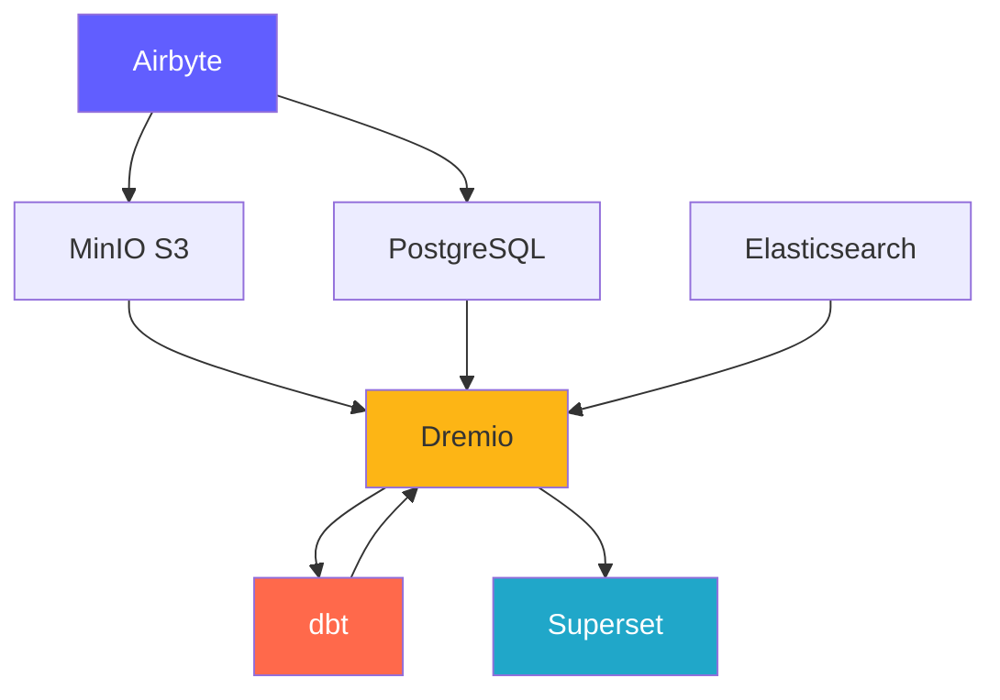
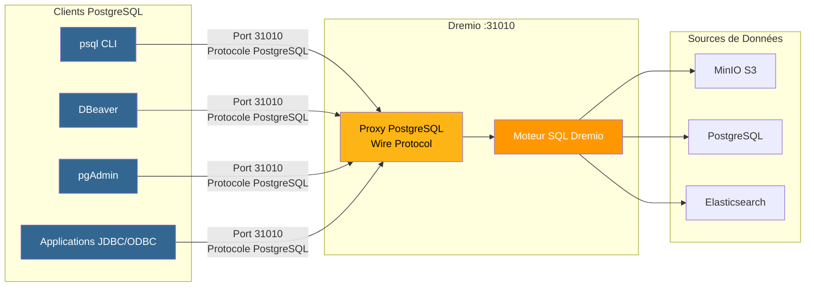
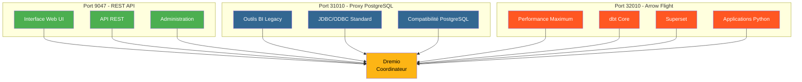
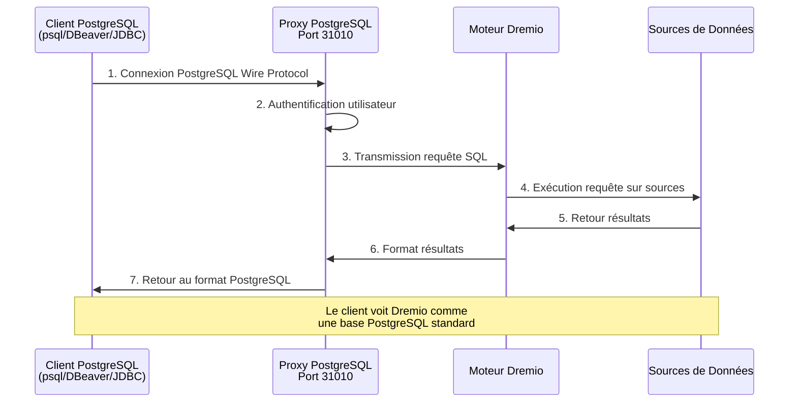
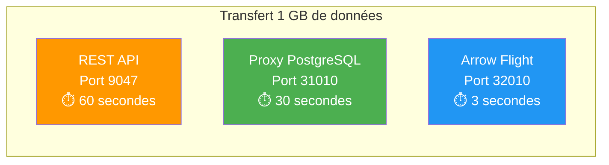

# Plattformkomponenten

**Version**: 3.2.0  
**Letzte Aktualisierung**: 16.10.2025  
**Sprache**: Französisch

---

## Komponentenübersicht

Die Datenplattform besteht aus 7 Hauptkomponenten, die zusammenarbeiten, um eine Komplettlösung bereitzustellen.



---

## 1. Airbyte – Datenintegrationsplattform

### Übersicht

Airbyte ist eine Open-Source-Datenintegrations-Engine, die Daten aus mehreren Quellen an Zielen konsolidiert.

**Version**: 0.50.33  
**Lizenz**: MIT  
**Website**: https://airbyte.com

### Hauptmerkmale

- **Über 300 vorgefertigte Konnektoren**: Datenbanken, APIs, Dateien, SaaS-Anwendungen
- **Change Data Capture (CDC)**: Datenreplikation in Echtzeit
- **Benutzerdefinierte Konnektoren**: Erstellen Sie mit Python oder Low-Code-CDK
- **Normalisierung**: JSON in relationale Tabellen umwandeln
- **Inkrementelle Synchronisierung**: Synchronisiert nur neue/geänderte Daten
- **Überwachung**: Integrierte Tracking-Statussynchronisierung

### Architektur

```yaml
Composants:
  airbyte-webapp:
    Port: 8000
    Objectif: Interface utilisateur web
    
  airbyte-server:
    Port: 8001
    Objectif: Serveur API REST
    
  airbyte-worker:
    Objectif: Exécuter tâches synchronisation
    Scalabilité: Horizontale
    
  airbyte-temporal:
    Port: 7233
    Objectif: Orchestration workflows
    
  airbyte-db:
    Port: 5432
    Objectif: Stockage métadonnées (PostgreSQL)
```

### Anwendungsfall

- **ELT-Pipelines**: Workflows zum Extrahieren, Laden und Transformieren
- **Datenbankreplikation**: Datenbanken synchron halten
- **API-Integration**: Extrahieren Sie Daten aus REST-APIs
- **Data Lake-Aufnahme**: Daten in S3/MinIO laden
- **Cloud-Migration**: Verschieben Sie Daten lokal in die Cloud

### Aufstellen

```yaml
# Variables d'Environnement
AIRBYTE_VERSION: "0.50.33"
AIRBYTE_HTTP_PORT: 8000
AIRBYTE_API_PORT: 8001
AIRBYTE_WORKSPACE_ROOT: /tmp/airbyte_local

# Limites Ressources
CPU_LIMIT: "2.0"
MEMORY_LIMIT: "2Gi"
```

### Integrationspunkte

- **Ausgaben an**: MinIO S3, PostgreSQL, Dremio
- **Orchestrierung**: Kann durch Airflow ausgelöst werden, Präfekt
- **Überwachung**: Prometheus-Metrik-Endpunkt

---

## 2. Dremio – Data Lakehouse-Plattform

### Übersicht

Dremio bietet eine einheitliche SQL-Schnittstelle für alle Datenquellen mit Abfragebeschleunigung.

**Version**: 26.0 OSS  
**Lizenz**: Apache 2.0  
**Website**: https://www.dremio.com

### Hauptmerkmale

- **Data Lakehouse**: Kombinieren Sie Lake-Flexibilität mit Lagerleistung
- **Gedanken**: Automatische Abfragebeschleunigung (bis zu 100x schneller)
- **Arrow Flight**: Hochleistungs-Datenübertragung
- **Datenvirtualisierung**: Abfrage ohne Datenverschiebung
- **Semantische Schicht**: Unternehmensfreundliche Datendefinitionen
- **Zeitreise**: Abfrage gegebener historischer Versionen

### Architektur

```yaml
Composants:
  Coordinateur:
    Port: 9047 (HTTP), 31010 (ODBC), 32010 (Arrow Flight)
    Objectif: Planification requêtes, gestion métadonnées
    Mémoire: 8Go heap + 8Go direct
    
  Exécuteur:
    Objectif: Exécution requêtes
    Mémoire: 4Go heap + 8Go direct
    Scalabilité: Horizontale (ajouter plus d'exécuteurs)
    
  Stockage:
    Type: Distribué (MinIO, S3, HDFS)
    Format: Parquet, Iceberg
```

### Anwendungsfall

- **Self-Service Analytics**: Ermöglichen Sie Geschäftsanwendern die Erkundung von Daten
- **Data Mesh**: Verbundzugriff auf Daten
- **Abfragebeschleunigung**: Beschleunigen Sie Dashboard-Abfragen
- **Datenkatalog**: Daten entdecken und verwalten
- **BI-Aktivierung**: Power Tableau, Power BI, Superset

### Aufstellen

```conf
# dremio.conf
paths.local: "/opt/dremio/data"
services.coordinator.enabled: true
services.executor.enabled: true

services.coordinator.web.port: 9047
services.flight.endpoint.port: 32010

services.executor.cache.pct.max: 70
```

### Integrationspunkte

- **Liest aus**: MinIO S3, PostgreSQL, Elasticsearch
- **Transformieren mit**: dbt
- **Verwendet für**: Superset, Tableau, Power BI

### PostgreSQL-Proxy für Dremio

Dremio kann einen PostgreSQL-Server emulieren, sodass PostgreSQL-kompatible Tools eine Verbindung zu Dremio herstellen können, als wäre es eine Standard-PostgreSQL-Datenbank.

#### PostgreSQL-Proxy-Architektur



#### Vergleich der 3 Dremio-Ports



#### Proxy-Konfiguration

```yaml
Proxy PostgreSQL:
  Port: 31010 (ODBC/JDBC)
  Protocole: PostgreSQL Wire Protocol
  Compatibilité: Outils compatibles PostgreSQL (psql, pgAdmin, DBeaver)
  
Avantages:
  - Aucune modification du code client
  - Support des pilotes PostgreSQL existants
  - Connexion via JDBC/ODBC standard
  - Compatible avec la plupart des outils BI
```

#### Proxy-Anwendungsfälle

1. **BI-Legacy-Tools**: Tools verbinden, die Arrow Flight nicht unterstützen
2. **Einfache Migration**: Ersetzen Sie PostgreSQL durch Dremio, ohne den Code zu ändern
3. **ODBC/JDBC-Kompatibilität**: Verwenden Sie Standard-PostgreSQL-Treiber
4. **Entwicklung**: Test mit bekannten PostgreSQL-Tools (psql, pgAdmin)

#### Verbindungsbeispiel

```bash
# Via psql
psql -h localhost -p 31010 -U admin -d datalake

# Via DBeaver / pgAdmin
Host: localhost
Port: 31010
Database: datalake
Username: admin
Password: <votre-mot-de-passe>

# Chaîne JDBC
jdbc:postgresql://localhost:31010/datalake

# Chaîne ODBC
Driver=PostgreSQL Unicode;
Server=localhost;
Port=31010;
Database=datalake;
Uid=admin;
Pwd=<votre-mot-de-passe>;
```

#### Einschränkungen

- **Leistung**: Arrow Flight (Port 32010) ist 20-50x schneller
- **Funktionen**: Einige erweiterte PostgreSQL-Funktionen werden nicht unterstützt
- **Empfehlung**: Verwenden Sie Arrow Flight für die Produktion, PostgreSQL-Proxy für Kompatibilität

#### Verbindungsfluss über PostgreSQL-Proxy



#### Protokollvergleich

| Protokoll | Hafen | Leistung | Latenz | Anwendungsfälle |
|---------------|------|-------------|---------|--------|
| **REST-API** | 9047 | Standard | ~50-100ms | Web-UI, Administration |
| **ODBC/JDBC (PostgreSQL-Proxy)** | 31010 | Gut | ~20-50ms | Ältere BI-Tools, Kompatibilität |
| **Pfeilflug** | 32010 | Ausgezeichnet (20-50x) | ~5-10ms | Produktion, Obermenge, dbt |

#### Vergleichende Leistung



---

## 3. dbt – Datentransformationstool

### Übersicht

Mit dbt (Data Build Tool) können Analyseingenieure Daten mithilfe von SQL transformieren.

**Version**: 1.10+  
**Lizenz**: Apache 2.0  
**Website**: https://www.getdbt.com

### Hauptmerkmale

- **SQL-basiert**: Transformationen in SQL schreiben
- **Versionskontrolle**: Git-Integration für die Zusammenarbeit
- **Tests**: Integrierte Datenqualitätstests
- **Dokumentation**: Datenwörterbücher automatisch generieren
- **Modularität**: Wiederverwendbare Makros und Pakete
- **Inkrementelle Modelle**: Nur neue Daten verarbeiten

### Architektur

```yaml
Composants:
  dbt Core:
    Objectif: Outil CLI pour exécuter transformations
    Langage: Python
    
  Modèles:
    Objectif: Instructions SQL SELECT
    Types: Vues, Tables, Incrémental, Snapshots
    
  Tests:
    Objectif: Validation qualité données
    Types: Unique, Not Null, Relations, Personnalisés
    
  Macros:
    Objectif: Fonctions SQL réutilisables
    Langage: Jinja2
```

### Anwendungsfall

- **Datenmodellierung**: Erstellen Sie Stern-/Flockendiagramme
- **Datenqualität**: Validieren Sie die Datenintegrität
- **Sich langsam ändernde Dimensionen**: Verfolgen Sie historische Änderungen
- **Datenaggregation**: Erstellen Sie Übersichtstabellen
- **Datendokumentation**: Datenkataloge erstellen

### Aufstellen

```yaml
# dbt_project.yml
name: 'dremio_dbt'
version: '1.0.0'
profile: 'dremio'

models:
  dremio_dbt:
    staging:
      +materialized: view
      +schema: staging
    marts:
      +materialized: table
      +schema: marts
```

### Integrationspunkte

- **Lesen aus**: Dremio-Datensätze
- **Geschrieben an**: Dremio (über Arrow Flight)
- **Orchestriert von**: Airflow, Cron, Airbyte Post-Sync

---

## 4. Apache Superset – Business-Intelligence-Plattform

### Übersicht

Superset ist eine moderne Datenexplorations- und Visualisierungsplattform.

**Version**: 3.0  
**Lizenz**: Apache 2.0  
**Website**: https://superset.apache.org

### Hauptmerkmale

- **SQL-IDE**: Erweiterter SQL-Editor mit automatischer Vervollständigung
- **Umfassende Visualisierungen**: Über 50 Diagrammtypen
- **Interaktive Dashboards**: Drilldown, Filter, Kreuzfilterung
- **SQL Lab**: Ad-hoc-Abfrageschnittstelle
- **Benachrichtigungen**: Geplante Berichte und Warnungen
- **Caching**: Abfrageergebnisse für die Leistung zwischenspeichern

### Architektur

```yaml
Composants:
  Serveur Web:
    Port: 8088
    Objectif: Servir interface web
    Framework: Flask
    
  Workers Celery:
    Objectif: Exécution requêtes asynchrone
    File: Redis/RabbitMQ
    
  Celery Beat:
    Objectif: Tâches planifiées (préchauffage cache, alertes)
    
  Base de Données:
    Objectif: Stocker tableaux de bord, utilisateurs, logs requêtes
    Type: PostgreSQL
```

### Anwendungsfall

- **Executive Dashboards**: KPI-Überwachung
- **Operational Analytics**: Echtzeitüberwachung
- **BI Self-Service**: Stärken Sie Analysten
- **Embedded Analytics**: Iframe-Integration in Anwendungen
- **Datenexploration**: Ad-hoc-Analyse

### Aufstellen

```python
# superset_config.py
SQLALCHEMY_DATABASE_URI = 'postgresql://...'
SECRET_KEY = '...'

FEATURE_FLAGS = {
    'DASHBOARD_NATIVE_FILTERS': True,
    'DASHBOARD_CROSS_FILTERS': True,
    'ENABLE_TEMPLATE_PROCESSING': True
}

CACHE_CONFIG = {
    'CACHE_TYPE': 'redis',
    'CACHE_DEFAULT_TIMEOUT': 300
}
```

### Integrationspunkte

- **Anfragen**: Dremio (über Arrow Flight)
- **Authentifizierung**: LDAP, OAuth2, Datenbank
- **Benachrichtigungen**: E-Mail, Slack

---

## 5. PostgreSQL – Relationale Datenbank

### Übersicht

PostgreSQL ist ein fortschrittliches relationales Open-Source-Datenbankverwaltungssystem.

**Version**: 16  
**Lizenz**: PostgreSQL-Lizenz  
**Website**: https://www.postgresql.org

### Hauptmerkmale

- **ACID-Konformität**: Zuverlässige Transaktionen
- **JSON-Unterstützung**: Native JSON/JSONB-Typen
- **Volltextsuche**: Integrierte Suchfunktionen
- **Erweiterungen**: PostGIS, pg_stat_statements, TimescaleDB
- **Replikation**: Streaming-Replikation, logische Replikation
- **Partitionierung**: Native Tabellenpartitionierung

### Architektur

```yaml
Composants:
  Serveur PostgreSQL:
    Port: 5432
    Protocole: Protocole wire PostgreSQL
    
  Bases de Données:
    - dremio_db: Métadonnées Dremio
    - superset_db: Configuration Superset
    - airbyte_db: Métadonnées Airbyte
    
  Connexions:
    Max: 200
    Pooling: PgBouncer (optionnel)
```

### Anwendungsfall

- **Metadatenspeicher**: Systemmetadaten speichern
- **Transaktionslasten**: OLTP-Anwendungen
- **Staging-Tabellen**: Temporäre Datenverarbeitung
- **Speicherkonfiguration**: Anwendungseinstellungen
- **Audit-Protokolle**: Verfolgen Sie Systemänderungen

### Aufstellen

```conf
# postgresql.conf
max_connections = 200
shared_buffers = 256MB
effective_cache_size = 1GB
maintenance_work_mem = 64MB
work_mem = 4MB

# Performance
random_page_cost = 1.1
effective_io_concurrency = 200

# Journalisation
log_statement = 'mod'
log_duration = on
```

### Integrationspunkte

- **Gelesen von**: Dremio, Superset, Airbyte
- **Geschrieben von**: Airbyte, dbt, Anwendungen
- **Verwaltet von**: Automatisierte Backups, Replikation

---

## 6. MinIO – S3-kompatibler Objektspeicher

### Übersicht

MinIO ist ein leistungsstarkes, S3-kompatibles Objektspeichersystem.

**Version**: Neueste  
**Lizenz**: AGPLv3  
**Website**: https://min.io

### Hauptmerkmale

- **S3-API**: 100 % kompatibel mit Amazon S3
- **Hohe Leistung**: Durchsatz von mehreren GB/s
- **Erasure Coding**: Nachhaltigkeits- und Verfügbarkeitsdaten
- **Versionierung**: Objektversionskontrolle
- **Verschlüsselung**: Serverseite und Clientseite
- **Multi-Cloud**: Überall bereitstellen

### Architektur

```yaml
Composants:
  Serveur MinIO:
    Port: 9000 (API S3), 9001 (Console)
    Mode: Nœud unique ou distribué
    
  Stockage:
    Format: Erasure coded ou brut
    Redondance: Configurable (ex: 4+2)
    
  Buckets:
    - datalake: Stockage données principal
    - raw-data: Ingestion Airbyte
    - processed-data: Sorties dbt
    - backups: Sauvegardes système
```

### Anwendungsfall

- **Data Lake**: Speichern Sie rohe und verarbeitete Daten
- **Objektspeicher**: Dateien, Bilder, Videos
- **Speichersicherung**: Datenbank- und Systemsicherungen
- **Archiv**: Langfristige Datenaufbewahrung
- **Data Staging**: Temporärer Verarbeitungsspeicher

### Aufstellen

```yaml
# Variables d'Environnement
MINIO_ROOT_USER: minioadmin
MINIO_ROOT_PASSWORD: minioadmin123
MINIO_VOLUMES: /data

# Politiques Buckets
- datalake: Lecture-écriture pour plateforme données
- raw-data: Écriture par Airbyte, lecture par Dremio
- processed-data: Écriture par dbt, lecture tous
```

### Integrationspunkte

- **Geschrieben von**: Airbyte, dbt, Anwendungen
- **Gelesen von**: Dremio, Datenwissenschaftler
- **Verwaltet von**: mc (MinIO Client), s3cmd

---

## 7. Elasticsearch – Such- und Analysemaschine

### Übersicht

Elasticsearch ist eine verteilte Such- und Analyse-Engine, die auf Apache Lucene basiert.

**Version**: 8.15  
**Lizenz**: Elastic License 2.0  
**Website**: https://www.elastic.co

### Hauptmerkmale

- **Volltextsuche**: Erweiterte Suchfunktionen
- **Echtzeitindizierung**: Datenverfügbarkeit nahezu in Echtzeit
- **Verteilt**: Horizontale Skalierbarkeit
- **Aggregationen**: Komplexe Analysen
- **RESTful API**: Einfache HTTP-API
- **Maschinelles Lernen**: Anomalieerkennung

### Architektur

```yaml
Composants:
  Nœud Elasticsearch:
    Port: 9200 (HTTP), 9300 (Transport)
    Rôles: Master, Data, Ingest, ML
    
  Index:
    Objectif: Stocker documents recherchables
    Shards: Distribués entre nœuds
    Répliques: Pour haute disponibilité
    
  Cycle de Vie Index:
    Hot: Données récentes (SSD)
    Warm: Données anciennes (HDD)
    Cold: Archive (S3)
```

### Anwendungsfall

- **Analytische Protokolle**: Zentralisierte Protokollierung (ELK-Stack)
- **Anwendungssuche**: Produktkataloge, Site-Suche
- **Sicherheitsanalyse**: SIEM-Anwendungsfälle
- **Beobachtbarkeit**: Metriken und Spuren
- **Textanalyse**: NLP und Stimmungsanalyse

### Aufstellen

```yaml
# elasticsearch.yml
cluster.name: "dremio-search-cluster"
node.name: "node-1"
network.host: 0.0.0.0
http.port: 9200

# Sécurité
xpack.security.enabled: true
xpack.security.transport.ssl.enabled: false

# Mémoire
bootstrap.memory_lock: true
```

### Integrationspunkte

- **Indiziert durch**: Logstash, Filebeat
- **Angefordert von**: Dremio, Kibana
- **Überwacht von**: Elasticsearch Monitoring

---

## Vergleich der Komponenten

| Komponente | Geben Sie | ein Hauptverwendung | Skalierbarkeit | Staat |
|---------------|------|-----------------|-------------|------|
| **Airbyte** | Integration | Datenaufnahme | Horizontal (Arbeiter) | Staatenlos |
| **Dremio** | Abfrage-Engine | Datenzugriff | Horizontal (Ausführende) | Staatenlos |
| **dbt** | Transformation | Datenmodellierung | Vertikal (Herzen) | Staatenlos |
| **Obermenge** | BI-Plattform | Visualisierung | Horizontal (Web) | Staatenlos |
| **PostgreSQL** | Datenbank | Metadatenspeicher | Vertikal (+ Replikation) | Zustandsbehaftet |
| **MinIO** | Objektspeicher | Datensee | Horizontal (verteilt) | Zustandsbehaftet |
| **Elasticsearch** | Suchmaschine | Volltextsuche | Horizontal (Cluster) | Zustandsbehaftet |

---

## Ressourcenanforderungen

### Mindestkonfiguration (Entwicklung)

```yaml
Total: 8 Go RAM, 4 CPUs, 50 Go Disque

Allocation:
  Airbyte: 1 Go RAM, 0.5 CPU
  Dremio: 2 Go RAM, 1 CPU
  Superset: 1 Go RAM, 0.5 CPU
  PostgreSQL: 1 Go RAM, 0.5 CPU
  MinIO: 1 Go RAM, 0.5 CPU
  Elasticsearch: 2 Go RAM, 1 CPU
```

### Empfohlene Konfiguration (Produktion)

```yaml
Total: 64 Go RAM, 16 CPUs, 500 Go SSD

Allocation:
  Airbyte: 4 Go RAM, 2 CPUs
  Dremio: 16 Go RAM, 4 CPUs
  Superset: 8 Go RAM, 2 CPUs
  PostgreSQL: 8 Go RAM, 2 CPUs
  MinIO: 16 Go RAM, 2 CPUs
  Elasticsearch: 12 Go RAM, 4 CPUs
```

---

## Versionskompatibilitätsmatrix

| Komponente | Veröffentlichung | Kompatibel mit |
|----------|---------|--------|
| Airbyte | 0,50+ | Alle Ziele |
| Dremio | 26,0 | dbt 1.8+, Arrow Flight-Kunden |
| dbt | 1.10+ | Dremio 23.0+ |
| Obermenge | 3.0+ | Dremio 22.0+, PostgreSQL 12+ |
| PostgreSQL | 16 | Alle Komponenten |
| MinIO | Neueste | S3-kompatible Clients |
| Elasticsearch | 8,15 | Dremio 26.0+, Logstash 8.x |

---

**Komponentenhandbuch-Version**: 3.2.0  
**Letzte Aktualisierung**: 16.10.2025  
**Verwaltet von**: Data Platform Team