# Datenflussarchitektur

**Version**: 3.2.0  
**Letzte Aktualisierung**: 16. Oktober 2025  
**Sprache**: Französisch

## Inhaltsverzeichnis

1. [Übersicht](#Übersicht)
2. [End-to-End-Datenfluss](#end-to-end-dataflow)
3. [Aufnahmeschicht](#ingestion-layer)
4. [Speicherschicht](#storage-layer)
5. [Verarbeitungsschicht](#Verarbeitungsschicht)
6. [Präsentationsebene](#presentation-layer)
7. [Datenflussmodelle](#dataflow-models)
8. [Leistungsüberlegungen](#leistungsüberlegungen)
9. [Datenflussüberwachung](#dataflow-monitoring)
10. [Gute Praktiken](#good-practices)

---

## Übersicht

In diesem Dokument wird die gesamte Datenflussarchitektur der Plattform detailliert beschrieben, von der ersten Datenaufnahme bis zum endgültigen Verbrauch. Das Verständnis dieser Abläufe ist entscheidend für die Optimierung der Leistung, die Fehlerbehebung und den Entwurf effektiver Datenpipelines.

### Datenflussprinzipien

Unsere Architektur folgt diesen Grundprinzipien:

1. **Unidirektionaler Fluss**: Daten bewegen sich in eine klare und vorhersehbare Richtung
2. **Schichtenverarbeitung**: Jede Schicht hat eine spezifische Verantwortung
3. **Entkoppelte Komponenten**: Dienste kommunizieren über wohldefinierte Schnittstellen
4. **Idempotenz**: Operationen können sicher wiederholt werden
5. **Beobachtbarkeit**: Jeder Schritt wird protokolliert und überwacht

### Architekturschichten


---

## End-to-End-Datenfluss

### Vollständige Pipeline-Sequenz


### Datenflussschritte

| Schritt | Komponente | Eingang | Ausstieg | Latenz |
|-------|----------|--------|--------|---------|
| **Extrahieren** | Airbyte | Externe APIs/BDs | Rohes JSON/CSV | 1-60 Min. |
| **Laden** | Speicherschicht | Rohdateien | Kuratierte Eimer | <1 Minute |
| **Katalogisierung** | Dremio | Speicherpfade | Virtuelle Datensätze | <1 Minute |
| **Transformation** | dbt | Bronzetische | Silber-/Goldtische | 5-30 Min. |
| **Optimierung** | Dremio-Gedanken | Rohabfragen | Versteckte Ergebnisse | Echtzeit |
| **Visualisierung** | Obermenge | SQL-Abfragen | Diagramme/Dashboards | <5 Sek. |

---

## Aufnahmeschicht

### Airbyte-Datenextraktion

Airbyte verwaltet die gesamte Datenaufnahme aus externen Quellen.

#### Quellverbindungsfluss


#### Datenextraktionsmethoden

**1. Vollständige Aktualisierung**
```yaml
# Full refresh extrait toutes les données à chaque sync
sync_mode: full_refresh
destination_sync_mode: overwrite

# Cas d'usage:
# - Petits datasets (<1M lignes)
# - Pas de suivi fiable des changements
# - Snapshots complets nécessaires
```

**2. Inkrementelle Synchronisierung**
```yaml
# Sync incrémental extrait uniquement les données nouvelles/modifiées
sync_mode: incremental
destination_sync_mode: append_dedup
cursor_field: updated_at

# Cas d'usage:
# - Grands datasets (>1M lignes)
# - Possède champ timestamp ou curseur
# - Optimisation performance sync
```

**3. Change Data Capture (CDC)**
```yaml
# CDC utilise les logs de transaction de la base de données
method: CDC
replication_method: LOG_BASED

# Bases de données supportées:
# - PostgreSQL (WAL)
# - MySQL (binlog)
# - MongoDB (change streams)
# - SQL Server (change tracking)
```

### Airbyte-API-Integration

```bash
# Déclencher sync via API
curl -X POST http://localhost:8001/api/v1/connections/sync \
  -H "Content-Type: application/json" \
  -d '{
    "connectionId": "your-connection-id"
  }'

# Vérifier statut sync
curl -X POST http://localhost:8001/api/v1/jobs/get \
  -H "Content-Type: application/json" \
  -d '{
    "id": "job-id"
  }'
```

### Extraktionsleistung

| Quelltyp | Fluss | Empfohlene Häufigkeit |
|----------------|-------|--------|
| PostgreSQL | 50–100.000 Zeilen/Sek. | Alle 15-60 Min. |
| REST-API | 1–10.000 Anforderungen/Sek. | Alle 5-30 Min. |
| CSV-Dateien | 100-500 MB/s | Täglich |
| MongoDB | 10–50.000 Dokumente/Sek. | Alle 15-60 Min. |
| MySQL CDC | Echtzeit | Kontinuierlich |

---

## Speicherschicht

### MinIO S3-Speicher

MinIO speichert Roh- und verarbeitete Daten in einer hierarchischen Struktur.

#### Bucket-Organisation


#### Datenpfadstruktur

```
s3://datalake/
├── bronze/                      # Données brutes d'Airbyte
│   ├── postgres/
│   │   ├── customers/
│   │   │   └── date=2025-10-16/
│   │   │       └── data.parquet
│   │   └── orders/
│   │       └── date=2025-10-16/
│   │           └── data.parquet
│   ├── api/
│   │   └── rest_endpoint/
│   │       └── timestamp=20251016_120000/
│   │           └── response.json
│   └── files/
│       └── csv_import/
│           └── batch_001.csv
│
├── silver/                      # Données nettoyées et validées
│   ├── customers/
│   │   └── version=v2/
│   │       └── customers_cleaned.parquet
│   └── orders/
│       └── version=v2/
│           └── orders_enriched.parquet
│
└── gold/                        # Agrégats prêts pour le métier
    ├── daily_revenue/
    │   └── year=2025/month=10/
    │       └── day=16/
    │           └── revenue.parquet
    └── customer_metrics/
        └── snapshot=2025-10-16/
            └── metrics.parquet
```

### Speicherformatstrategie

| Schicht | Formatieren | Komprimierung | Partitionierung | Grund |
|--------|--------|-------------|-----------------|--------|
| **Bronze** | Parkett | Bissig | Nach Datum | Schnelles Schreiben, gute Komprimierung |
| **Silber** | Parkett | Bissig | Nach Geschäftsschlüssel | Effektive Abfragen |
| **Gold** | Parkett | ZSTD | Nach Zeitraum | Maximale Komprimierung |
| **Protokolle** | JSON | Gzip | Nach Dienst/Datum | Für Menschen lesbar |

### PostgreSQL-Metadatenspeicher

PostgreSQL-Speicher:
- Airbyte-Konfiguration und -Status
- Metadaten und DBT-Ausführungsverlauf
- Superset-Dashboards und Benutzer
- Anwendungsprotokolle und -metriken

```sql
-- Structure table état Airbyte
CREATE TABLE airbyte_state (
    connection_id UUID PRIMARY KEY,
    state JSONB NOT NULL,
    updated_at TIMESTAMP DEFAULT NOW()
);

-- Historique exécution dbt
CREATE TABLE dbt_run_history (
    run_id UUID PRIMARY KEY,
    project_name VARCHAR(255),
    started_at TIMESTAMP,
    completed_at TIMESTAMP,
    status VARCHAR(50),
    models_run INTEGER,
    tests_run INTEGER,
    metadata JSONB
);
```

### Elasticsearch-Dokumentenspeicher

Elasticsearch indiziert Protokolle und ermöglicht die Volltextsuche.

```json
{
  "index": "airbyte-logs-2025.10.16",
  "mappings": {
    "properties": {
      "timestamp": {"type": "date"},
      "level": {"type": "keyword"},
      "service": {"type": "keyword"},
      "message": {"type": "text"},
      "job_id": {"type": "keyword"},
      "connection_id": {"type": "keyword"},
      "records_synced": {"type": "integer"},
      "bytes_synced": {"type": "long"}
    }
  }
}
```

---

## Verarbeitungsschicht

### Dremio-Datenvirtualisierung

Dremio erstellt eine einheitliche Ansicht über alle Speicherquellen.

#### Erstellung eines virtuellen Datensatzes


#### Beschleunigung durch Reflexionen

Dremio-Reflexionen berechnen Abfrageergebnisse vorab für sofortige Leistung.

```sql
-- Créer réflexion brute (sous-ensemble colonnes)
CREATE REFLECTION raw_customers
ON bronze.customers
USING DISPLAY (customer_id, name, email, created_at);

-- Créer réflexion agrégation
CREATE REFLECTION agg_daily_revenue
ON gold.orders
USING DIMENSIONS (order_date)
MEASURES (SUM(amount), COUNT(*), AVG(amount));

-- Les réflexions se rafraîchissent automatiquement selon la politique
ALTER REFLECTION agg_daily_revenue
SET REFRESH EVERY 1 HOUR;
```

**Auswirkungen von Reflections auf die Leistung:**

| Abfragetyp | Ohne Reflexion | Mit Reflexion | Beschleunigung |
|-----------------|----------------|----------------|---------|
| AUSWÄHLEN Einfach | 500ms | 50ms | 10x |
| Aggregationen | 5s | 100ms | 50x |
| Komplexe JOINs | 30er Jahre | 500ms | 60x |
| Große Scans | 120er | 2s | 60x |

### dbt-Transformationen

dbt wandelt Rohdaten in geschäftsfähige Modelle um.

#### Transformationsfluss


#### Beispiel für eine Transformationspipeline

```sql
-- models/staging/stg_customers.sql
-- Étape 1: Nettoyage et standardisation
WITH source AS (
    SELECT * FROM bronze.raw_customers
),

cleaned AS (
    SELECT
        customer_id,
        TRIM(UPPER(name)) AS customer_name,
        LOWER(email) AS email,
        phone,
        address,
        city,
        state,
        zip_code,
        created_at,
        updated_at
    FROM source
    WHERE customer_id IS NOT NULL
)

SELECT * FROM cleaned;
```

```sql
-- models/intermediate/int_customer_orders.sql
-- Étape 2: Jointure et enrichissement
WITH customers AS (
    SELECT * FROM {{ ref('stg_customers') }}
),

orders AS (
    SELECT * FROM {{ ref('stg_orders') }}
),

joined AS (
    SELECT
        c.customer_id,
        c.customer_name,
        c.email,
        o.order_id,
        o.order_date,
        o.amount,
        o.status
    FROM customers c
    INNER JOIN orders o
        ON c.customer_id = o.customer_id
)

SELECT * FROM joined;
```

```sql
-- models/marts/fct_customer_lifetime_value.sql
-- Étape 3: Agrégation pour métriques métier
WITH customer_orders AS (
    SELECT * FROM {{ ref('int_customer_orders') }}
),

metrics AS (
    SELECT
        customer_id,
        customer_name,
        email,
        COUNT(DISTINCT order_id) AS total_orders,
        SUM(amount) AS lifetime_value,
        AVG(amount) AS average_order_value,
        MIN(order_date) AS first_order_date,
        MAX(order_date) AS last_order_date,
        DATEDIFF('day', MIN(order_date), MAX(order_date)) AS customer_lifespan_days
    FROM customer_orders
    WHERE status = 'completed'
    GROUP BY customer_id, customer_name, email
)

SELECT * FROM metrics;
```

#### dbt-Ausführungsablauf

```bash
# Exécution pipeline complète
dbt run --select staging        # Exécuter modèles staging
dbt test --select staging       # Tester modèles staging
dbt run --select intermediate   # Exécuter modèles intermédiaires
dbt test --select intermediate  # Tester modèles intermédiaires
dbt run --select marts          # Exécuter modèles mart
dbt test --select marts         # Tester modèles mart

# Générer documentation
dbt docs generate
dbt docs serve
```

### Rückverfolgbarkeit der Datenherkunft


---

## Präsentationsebene

### Abfrageausführungsablauf


### API-Zugriffsmodelle

#### 1. Superset-Dashboards (BI Interactive)

```python
# Superset exécute SQL via SQLAlchemy
from superset import db

query = """
SELECT 
    order_date,
    SUM(amount) as daily_revenue
FROM gold.fct_daily_revenue
WHERE order_date >= CURRENT_DATE - INTERVAL '30 days'
GROUP BY order_date
ORDER BY order_date
"""

results = db.session.execute(query)
```

#### 2. Arrow Flight API (Hohe Leistung)

```python
# Connexion Arrow Flight directe pour outils analytiques
from pyarrow import flight

client = flight.FlightClient("grpc://localhost:32010")

# Authentification
token = client.authenticate_basic_token("admin", "password123")

# Exécuter requête
descriptor = flight.FlightDescriptor.for_command(
    b"SELECT * FROM gold.customer_metrics LIMIT 1000"
)

flight_info = client.get_flight_info(descriptor)
reader = client.do_get(flight_info.endpoints[0].ticket)

# Lire comme Table Arrow (zero-copy)
table = reader.read_all()
df = table.to_pandas()
```

#### 3. REST API (Externe Integrationen)

```bash
# API REST Dremio pour automatisation
curl -X POST http://localhost:9047/api/v3/sql \
  -H "Authorization: Bearer $TOKEN" \
  -H "Content-Type: application/json" \
  -d '{
    "sql": "SELECT COUNT(*) FROM gold.customers"
  }'
```

---

## Datenflussmodelle

### Modell 1: ETL-Batch-Pipeline

```mermaid
gantt
    title Planification ETL Batch Quotidien
    dateFormat HH:mm
    axisFormat %H:%M
    
    section Ingestion
    Extraction Airbyte (PostgreSQL)     :01:00, 30m
    Extraction Airbyte (APIs)           :01:30, 45m
    
    section Chargement
    Chargement vers Bronze MinIO        :02:15, 15m
    
    section Transformation
    Modèles Staging dbt                 :02:30, 20m
    Modèles Intermédiaires dbt          :02:50, 30m
    Modèles Mart dbt                    :03:20, 40m
    
    section Tests
    Tests Qualité Données dbt           :04:00, 15m
    
    section Optimisation
    Rafraîchissement Réflexions Dremio  :04:15, 20m
    
    section Présentation
    Préchauffage Cache Tableau de Bord  :04:35, 10m
```



### Modell 2: Echtzeit-Streaming


### Muster 3: Inkrementelle Updates

```sql
-- Modèle incrémental dbt
{{ config(
    materialized='incremental',
    unique_key='order_id',
    on_schema_change='sync_all_columns'
) }}

SELECT
    order_id,
    customer_id,
    order_date,
    amount,
    status,
    updated_at
FROM {{ source('bronze', 'orders') }}


    -- Traiter uniquement les enregistrements nouveaux ou mis à jour
    WHERE updated_at > (SELECT MAX(updated_at) FROM {{ this }})

```

### Modell 4: Lambda-Architektur (Batch + Stream)


---

## Leistungsüberlegungen

### Aufnahmeoptimierung

```yaml
# Configuration connexion Airbyte
sync_mode: incremental
destination_sync_mode: append_dedup
cursor_field: updated_at

# Ajustement performance
batch_size: 10000              # Enregistrements par batch
threads: 4                     # Workers parallèles
timeout_minutes: 60           # Timeout sync
retry_on_failure: true
max_retries: 3

# Optimisation réseau
compression: gzip
buffer_size_mb: 256
```

### Speicheroptimierung

```python
# Options écriture Parquet pour compression optimale
import pyarrow.parquet as pq

pq.write_table(
    table,
    'output.parquet',
    compression='snappy',      # Compression rapide
    use_dictionary=True,       # Activer encodage dictionnaire
    row_group_size=1000000,    # 1M lignes par row group
    data_page_size=1048576,    # 1MB taille page
    write_statistics=True      # Activer statistiques pour pruning
)
```

### Abfrageoptimierung

```sql
-- Bonnes pratiques requêtes Dremio

-- 1. Utiliser partition pruning
SELECT * FROM gold.orders
WHERE order_date >= '2025-10-01'  -- Élague partitions
  AND order_date < '2025-11-01';

-- 2. Exploiter les réflexions
-- Créer réflexion une fois, requêtes auto-accélérées
ALTER REFLECTION agg_orders SET ENABLED = TRUE;

-- 3. Utiliser column pruning
SELECT order_id, amount       -- Seulement colonnes nécessaires
FROM gold.orders
LIMIT 1000;

-- 4. Pousser les filtres
SELECT *
FROM gold.customers
WHERE state = 'CA'            -- Filtre poussé vers stockage
  AND lifetime_value > 1000;
```

### Optimierung von Transformationen

```sql
-- Techniques optimisation dbt

-- 1. Modèles incrémentaux pour grandes tables
{{ config(materialized='incremental') }}

-- 2. Tables partitionnées
{{ config(
    materialized='table',
    partition_by={
        'field': 'order_date',
        'data_type': 'date',
        'granularity': 'day'
    }
) }}

-- 3. Tables clusterisées pour meilleures jointures
{{ config(
    materialized='table',
    cluster_by=['customer_id']
) }}
```

### Leistungsbenchmarks

| Betrieb | Kleiner Datensatz<br/>(1 Mio. Zeilen) | Mittlerer Datensatz<br/>(100 Mio. Zeilen) | Großer Datensatz<br/>(1B Zeilen) |
|--------------|-------------|---------------------------------------------|--------------|
| **Airbyte synchronisieren** | 2 Minuten | 30 Minuten | 5 Stunden |
| **DBT-Ausführung** | 30 Sek. | 10 Minuten | 2 Stunden |
| **Konstruktionsreflexion** | 10 Sek. | 5 Minuten | 30 Minuten |
| **Dashboard-Abfrage** | <100ms | <500ms | <2s |

---

## Datenflussüberwachung

### Wichtige Kennzahlen zum Verfolgen

```yaml
# Configuration métriques Prometheus
metrics:
  ingestion:
    - airbyte_records_synced_total
    - airbyte_sync_duration_seconds
    - airbyte_sync_failures_total
    
  storage:
    - minio_disk_usage_bytes
    - minio_objects_total
    - postgres_connections_active
    
  processing:
    - dremio_query_duration_seconds
    - dremio_reflection_refresh_seconds
    - dbt_model_execution_time
    
  serving:
    - superset_dashboard_load_time
    - superset_query_cache_hit_rate
    - api_requests_per_second
```

### Überwachungs-Dashboard


### Protokollaggregation

```bash
# Requête Elasticsearch pour surveillance pipeline
curl -X GET "localhost:9200/airbyte-logs-*/_search" \
  -H 'Content-Type: application/json' \
  -d '{
    "query": {
      "bool": {
        "filter": [
          {"range": {"timestamp": {"gte": "now-1h"}}},
          {"term": {"level": "ERROR"}}
        ]
      }
    },
    "aggs": {
      "by_service": {
        "terms": {"field": "service"}
      }
    }
  }'
```

---

## Best Practices

### Datenflussdesign

1. **Design für Idempotenz**
   - Gewährleisten, dass Vorgänge sicher wiederholt werden können
   - Verwenden Sie eindeutige Schlüssel für die Deduplizierung
   - Implementieren Sie eine geeignete Fehlerbehandlung

2. **Datenqualitätskontrollen implementieren**
   ```sql
   -- Exemple test dbt
   -- tests/assert_positive_amounts.sql
   SELECT *
   FROM {{ ref('fct_orders') }}
   WHERE amount <= 0
   ```

3. **Große Datensätze partitionieren**
   ```python
   # Partitionner par date pour requêtes efficaces
   df.write.partitionBy('order_date').parquet('s3://bucket/orders/')
   ```

4. **Geeignete Synchronisierungsmodi verwenden**
   - Vollständige Aktualisierung: Kleine Dimensionstabellen
   - Inkrementell: Große Faktentabellen
   - CDC: Echtzeitanforderungen

### Leistungsanpassung

1. **Optimieren Sie die Airbyte-Synchronisierungsplanung**
   ```yaml
   # Équilibrer fraîcheur vs utilisation ressources
   small_tables:
     frequency: every_15_minutes
   
   large_tables:
     frequency: every_6_hours
   
   dimension_tables:
     frequency: daily
   ```

2. **Strategische Gedanken erstellen**
   ```sql
   -- Focus sur agrégations fréquemment requêtées
   CREATE REFLECTION common_metrics
   ON gold.orders
   USING DIMENSIONS (product_id, date_trunc('day', order_date))
   MEASURES (SUM(amount), COUNT(*));
   ```

3. **DBT-Modelle optimieren**
   ```yaml
   # models/schema.yml
   models:
     - name: fct_large_table
       config:
         materialized: incremental
         incremental_strategy: merge
         unique_key: id
         partition_by: {field: date, data_type: date}
   ```

### Häufige Problemlösung

| Problem | Symptom | Lösung |
|---------|---------|----------|
| **Airbyte-Synchronisierung langsam** | Zeiten für die Synchronisierung | Stapelgröße erhöhen, inkrementellen Modus verwenden |
| **Speichermangel** | Fehlgeschlagene DBT-Modelle | Inkrementell materialisieren, Partitionierung hinzufügen |
| **Langsame Abfragen** | Timeout-Dashboard | Reflexionen erstellen, Index hinzufügen |
| **Speicher voll** | Schreibfehler | Datenaufbewahrung umsetzen, alte Daten komprimieren |
| **Daten veraltet** | Alte Metriken | Synchronisierungshäufigkeit erhöhen, Zeitpläne überprüfen |

### Gute Sicherheitspraktiken

1. **Daten während der Übertragung verschlüsseln**
   ```yaml
   # docker-compose.yml
   minio:
     environment:
       MINIO_SERVER_URL: https://minio:9000
       MINIO_BROWSER_REDIRECT_URL: https://console.minio.local
   ```

2. **Zugriffskontrollen implementieren**
   ```sql
   -- ACLs Dremio
   GRANT SELECT ON gold.customer_metrics TO ROLE analyst;
   GRANT ALL ON bronze.* TO ROLE data_engineer;
   ```

3. **Zugriff auf Prüfdaten**
   ```json
   {
     "audit_log": {
       "enabled": true,
       "log_queries": true,
       "log_user_actions": true,
       "retention_days": 90
     }
   }
   ```

---

## Zusammenfassung

In diesem Dokument wird die vollständige Datenflussarchitektur detailliert beschrieben:

- **Ingestion Layer**: Airbyte extrahiert Daten aus verschiedenen Quellen per vollständiger Aktualisierung, inkrementell oder CDC
- **Speicherschicht**: MinIO, PostgreSQL und Elasticsearch speichern Roh- und verarbeitete Daten in organisierten Schichten
- **Verarbeitungsschicht**: Dremio virtualisiert die Daten und dbt transformiert sie über Staging-, Intermediate- und Mart-Modelle
- **Präsentationsschicht**: Superset-Dashboards und APIs bieten Zugriff auf geschäftsfähige Daten

Wichtige Punkte, die Sie beachten sollten:
- Daten fließen unidirektional durch klar definierte Schichten
- Jede Komponente hat spezifische Verantwortlichkeiten und Schnittstellen
- Die Leistung wird durch Reflexionen, Partitionierung und Caching optimiert
- Überwachung und Beobachtbarkeit sind in jede Ebene integriert
- Gute Praktiken garantieren Zuverlässigkeit, Leistung und Sicherheit

**Zugehörige Dokumentation:**
- [Architekturübersicht](./overview.md)
- [Komponenten](./components.md)
- [Bereitstellung](./deployment.md)
- [Airbyte-Integrationsleitfaden](../guides/airbyte-integration.md)
- [dbt-Entwicklungshandbuch](../guides/dbt-development.md)

---

**Version**: 3.2.0  
**Letzte Aktualisierung**: 16. Oktober 2025