# Visuelle Anleitung zu Dremio-Ports

**Version**: 3.2.5  
**Letzte Aktualisierung**: 16. Oktober 2025  
**Sprache**: Deutsch

---

## Übersicht der 3 Dremio-Ports

```mermaid
graph TB
    subgraph "Port 9047 - REST API"
        direction TB
        A1[🌐 Web-UI-Oberfläche]
        A2[🔧 Verwaltung]
        A3[📊 Überwachung]
        A4[🔐 Authentifizierung]
    end
    
    subgraph "Port 31010 - PostgreSQL-Proxy"
        direction TB
        B1[💼 Legacy-BI-Tools]
        B2[🔌 Standard JDBC/ODBC]
        B3[🐘 PostgreSQL-Kompatibilität]
        B4[🔄 Einfache Migration]
    end
    
    subgraph "Port 32010 - Arrow Flight"
        direction TB
        C1[⚡ Maximale Leistung]
        C2[🎯 dbt Core]
        C3[📈 Apache Superset]
        C4[🐍 Python pyarrow]
    end
    
    D[🗄️ Dremio-Koordinator<br/>Dremio 26.0 OSS]
    
    A1 & A2 & A3 & A4 --> D
    B1 & B2 & B3 & B4 --> D
    C1 & C2 & C3 & C4 --> D
    
    E1[(MinIO S3)]
    E2[(PostgreSQL)]
    E3[(Elasticsearch)]
    
    D --> E1 & E2 & E3
    
    style D fill:#FDB515,color:#000,stroke:#000,stroke-width:3px
    style A1 fill:#4CAF50,color:#fff
    style A2 fill:#4CAF50,color:#fff
    style A3 fill:#4CAF50,color:#fff
    style A4 fill:#4CAF50,color:#fff
    style B1 fill:#336791,color:#fff
    style B2 fill:#336791,color:#fff
    style B3 fill:#336791,color:#fff
    style B4 fill:#336791,color:#fff
    style C1 fill:#FF5722,color:#fff
    style C2 fill:#FF5722,color:#fff
    style C3 fill:#FF5722,color:#fff
    style C4 fill:#FF5722,color:#fff
```



---

## Detaillierte PostgreSQL-Proxy-Architektur

### Client → Dremio Verbindungsfluss

```mermaid
graph LR
    subgraph "Client-Anwendungen"
        direction TB
        A1[psql CLI]
        A2[DBeaver]
        A3[pgAdmin]
        A4[Python psycopg2]
        A5[Java JDBC]
        A6[Tableau Desktop]
    end
    
    subgraph "PostgreSQL Wire-Protokoll"
        P[Port 31010<br/>PostgreSQL-Proxy]
    end
    
    subgraph "Dremio-Engine"
        direction TB
        M1[SQL-Parser]
        M2[Optimierer]
        M3[Executor]
    end
    
    subgraph "Datenquellen"
        direction TB
        S1[📦 Parquet-Dateien<br/>MinIO S3]
        S2[💾 PostgreSQL-Tabellen]
        S3[🔍 Elasticsearch-Index]
    end
    
    A1 & A2 & A3 --> P
    A4 & A5 & A6 --> P
    
    P --> M1
    M1 --> M2
    M2 --> M3
    
    M3 --> S1 & S2 & S3
    
    style P fill:#336791,color:#fff,stroke:#000,stroke-width:3px
    style M1 fill:#FDB515,color:#000
    style M2 fill:#FDB515,color:#000
    style M3 fill:#FDB515,color:#000
```



---

## Leistungsvergleich

### Benchmark: 100 GB Daten-Scan


### Datendurchsatz

```mermaid
graph LR
    subgraph "Netzwerkleistung pro Protokoll"
        A["Port 9047<br/>REST API<br/>📊 ~500 MB/s<br/>⏱️ Standard"]
        B["Port 31010<br/>PostgreSQL Wire<br/>📊 ~1-2 GB/s<br/>⏱️ Gut"]
        C["Port 32010<br/>Arrow Flight<br/>📊 ~20 GB/s<br/>⏱️ Ausgezeichnet"]
    end
    
    style A fill:#FF9800,color:#fff
    style B fill:#4CAF50,color:#fff
    style C fill:#2196F3,color:#fff
```



### Latenz bei einfachen Abfragen

| Protokoll | Port | Durchschnittliche Latenz | Netzwerk-Overhead |
|----------|------|----------------|------------------|
| **REST API** | 9047 | 50-100 ms | JSON (ausführlich) |
| **PostgreSQL-Proxy** | 31010 | 20-50 ms | Wire-Protokoll (kompakt) |
| **Arrow Flight** | 32010 | 5-10 ms | Apache Arrow (binär spaltenorientiert) |

---

## Anwendungsfälle nach Port

### Port 9047 - REST API


### Port 31010 - PostgreSQL-Proxy


### Port 32010 - Arrow Flight

```mermaid
graph TB
    A[Port 32010<br/>Arrow Flight]
    
    A --> B1[⚡ Maximale Leistung]
    A --> B2[🎯 Moderne Tools]
    A --> B3[🐍 Python-Ökosystem]
    
    B1 --> C1[TB/PB-Scans]
    B1 --> C2[Massive Aggregationen]
    B1 --> C3[Zero-Copy-Transfers]
    
    B2 --> D1[dbt Core<br/>profiles.yml]
    B2 --> D2[Apache Superset<br/>Database Config]
    B2 --> D3[Jupyter Notebooks<br/>pandas/polars]
    
    B3 --> E1[pyarrow-Bibliothek]
    B3 --> E2[pandas via Arrow]
    B3 --> E3[Polars-Integration]
    
    style A fill:#FF5722,color:#fff,stroke:#000,stroke-width:3px
    style B1 fill:#FF7043,color:#fff
    style B2 fill:#FF7043,color:#fff
    style B3 fill:#FF7043,color:#fff
```



---

## Entscheidungsbaum: Welchen Port verwenden?

```mermaid
graph TB
    Start[Ich muss mich mit Dremio verbinden]
    
    Start --> Q1{Anwendungstyp?}
    
    Q1 -->|Web-Oberfläche<br/>Verwaltung| Port9047[✅ Port 9047<br/>REST API]
    
    Q1 -->|BI-Tool/SQL-Client| Q2{Arrow Flight-Unterstützung?}
    
    Q2 -->|Nein<br/>Legacy-Tool| Port31010[✅ Port 31010<br/>PostgreSQL-Proxy]
    Q2 -->|Ja<br/>Modernes Tool| Q3{Leistung kritisch?}
    
    Q3 -->|Ja<br/>Produktion| Port32010[✅ Port 32010<br/>Arrow Flight]
    Q3 -->|Nein<br/>Dev/Test| Port31010b[⚠️ Port 31010<br/>Einfacher]
    
    Q1 -->|Benutzerdefinierte Anwendung| Q4{Programmiersprache?}
    
    Q4 -->|Python/Java| Q5{Leistung wichtig?}
    Q5 -->|Ja| Port32010b[✅ Port 32010<br/>Arrow Flight]
    Q5 -->|Nein| Port31010c[✅ Port 31010<br/>JDBC/psycopg2]
    
    Q4 -->|Andere<br/>Go/Rust/.NET| Port31010d[✅ Port 31010<br/>PostgreSQL Wire]
    
    style Start fill:#2196F3,color:#fff
    style Port9047 fill:#4CAF50,color:#fff,stroke:#000,stroke-width:2px
    style Port31010 fill:#336791,color:#fff,stroke:#000,stroke-width:2px
    style Port31010b fill:#336791,color:#fff,stroke:#000,stroke-width:2px
    style Port31010c fill:#336791,color:#fff,stroke:#000,stroke-width:2px
    style Port31010d fill:#336791,color:#fff,stroke:#000,stroke-width:2px
    style Port32010 fill:#FF5722,color:#fff,stroke:#000,stroke-width:2px
    style Port32010b fill:#FF5722,color:#fff,stroke:#000,stroke-width:2px
```



---

## PostgreSQL-Proxy Verbindungsbeispiele

### 1. psql CLI

```bash
# Einfache Verbindung
psql -h localhost -p 31010 -U admin -d datalake

# Direkte Abfrage
psql -h localhost -p 31010 -U admin -d datalake \
  -c "SELECT COUNT(*) FROM MinIO.datalake.customers;"

# Interaktiver Modus
$ psql -h localhost -p 31010 -U admin -d datalake
Password for user admin: ****
psql (16.0, server 26.0)
Type "help" for help.

datalake=> \dt
           List of relations
 Schema |   Name    | Type  | Owner 
--------+-----------+-------+-------
 public | customers | table | admin
 public | orders    | table | admin
(2 rows)

datalake=> SELECT customer_id, name, state FROM customers LIMIT 5;
```

### 2. DBeaver-Konfiguration

```yaml
Verbindungstyp: PostgreSQL
Verbindungsname: Dremio via PostgreSQL Proxy

Haupt:
  Host: localhost
  Port: 31010
  Datenbank: datalake
  Benutzer: admin
  Passwort: [Ihr-Passwort]
  
Treibereigenschaften:
  ssl: false
  
Erweitert:
  Verbindungs-Timeout: 30000
  Abfrage-Timeout: 0
```

### 3. Python mit psycopg2

```python
import psycopg2
from psycopg2 import sql

# Verbindung
conn = psycopg2.connect(
    host="localhost",
    port=31010,
    database="datalake",
    user="admin",
    password="Ihr-Passwort"
)

# Cursor
cursor = conn.cursor()

# Einfache Abfrage
cursor.execute("SELECT * FROM MinIO.datalake.customers LIMIT 10")
rows = cursor.fetchall()

for row in rows:
    print(row)

# Parametrisierte Abfrage
query = sql.SQL("SELECT * FROM {} WHERE state = %s").format(
    sql.Identifier("MinIO", "datalake", "customers")
)
cursor.execute(query, ("CA",))

# Schließen
cursor.close()
conn.close()
```

### 4. Java JDBC

```java
import java.sql.*;

public class DremioPostgreSQLProxy {
    public static void main(String[] args) {
        String url = "jdbc:postgresql://localhost:31010/datalake";
        String user = "admin";
        String password = "Ihr-Passwort";
        
        try (Connection conn = DriverManager.getConnection(url, user, password)) {
            Statement stmt = conn.createStatement();
            ResultSet rs = stmt.executeQuery(
                "SELECT customer_id, name, state FROM MinIO.datalake.customers LIMIT 10"
            );
            
            while (rs.next()) {
                int id = rs.getInt("customer_id");
                String name = rs.getString("name");
                String state = rs.getString("state");
                System.out.printf("ID: %d, Name: %s, State: %s%n", id, name, state);
            }
            
            rs.close();
            stmt.close();
        } catch (SQLException e) {
            e.printStackTrace();
        }
    }
}
```

### 5. ODBC-Verbindungszeichenfolge (DSN)

```ini
[ODBC Data Sources]
Dremio_PostgreSQL=PostgreSQL Unicode Driver

[Dremio_PostgreSQL]
Driver=PostgreSQL Unicode
Description=Dremio via PostgreSQL Proxy
Server=localhost
Port=31010
Database=datalake
Username=admin
Password=Ihr-Passwort
SSLMode=disable
Protocol=7.4
```

---

## Docker Compose-Konfiguration

### Dremio-Port-Mapping

```yaml
services:
  dremio:
    image: dremio/dremio-oss:26.0
    container_name: dremio
    ports:
      # Port 9047 - REST API / Web UI
      - "9047:9047"
      
      # Port 31010 - PostgreSQL-Proxy (ODBC/JDBC)
      - "31010:31010"
      
      # Port 32010 - Arrow Flight (Leistung)
      - "32010:32010"
    environment:
      - DREMIO_JAVA_SERVER_EXTRA_OPTS=-Xms4g -Xmx8g
    volumes:
      - ./docker-volume/dremio:/opt/dremio/data
    networks:
      - data-platform
```

### Port-Überprüfung

```bash
# Überprüfen, ob alle 3 Ports geöffnet sind
netstat -an | grep -E '9047|31010|32010'

# REST API testen
curl -v http://localhost:9047

# PostgreSQL-Proxy testen
psql -h localhost -p 31010 -U admin -d datalake -c "SELECT 1;"

# Arrow Flight testen (mit Python)
python3 -c "
from pyarrow import flight
client = flight.connect('grpc://localhost:32010')
print('Arrow Flight OK')
"
```

---

## Schnelle visuelle Zusammenfassung

### Die 3 Ports auf einen Blick

| Port | Protokoll | Hauptverwendung | Leistung | Kompatibilität |
|------|-----------|-------------|------------|----------------|
| **9047** | REST API | 🌐 Web UI, Admin | ⭐⭐ Standard | ⭐⭐⭐ Universal |
| **31010** | PostgreSQL Wire | 💼 BI-Tools, Migration | ⭐⭐⭐ Gut | ⭐⭐⭐ Ausgezeichnet |
| **32010** | Arrow Flight | ⚡ Produktion, dbt, Superset | ⭐⭐⭐⭐⭐ Maximal | ⭐⭐ Begrenzt |

### Auswahlmatrix

```mermaid
graph TB
    subgraph "Auswahlhilfe"
        A["🎯 Anwendungsfall"]
        
        A --> B1["Web-Oberfläche<br/>Konfiguration"]
        A --> B2["Legacy-BI-Tool<br/>Kein Arrow Flight"]
        A --> B3["PostgreSQL-Migration<br/>Bestehender JDBC-Code"]
        A --> B4["dbt, Superset<br/>Produktion"]
        A --> B5["Python pyarrow<br/>Analytics"]
        
        B1 --> C1["Port 9047<br/>REST API"]
        B2 --> C2["Port 31010<br/>PostgreSQL"]
        B3 --> C2
        B4 --> C3["Port 32010<br/>Arrow Flight"]
        B5 --> C3
    end
    
    style A fill:#2196F3,color:#fff
    style C1 fill:#4CAF50,color:#fff,stroke:#000,stroke-width:2px
    style C2 fill:#336791,color:#fff,stroke:#000,stroke-width:2px
    style C3 fill:#FF5722,color:#fff,stroke:#000,stroke-width:2px
```



---

## Zusätzliche Ressourcen

### Verwandte Dokumentation

- [Architektur - Komponenten](./components.md) - Abschnitt "PostgreSQL-Proxy für Dremio"
- [Leitfaden - Dremio-Setup](../guides/dremio-setup.md) - Abschnitt "Verbindung über PostgreSQL-Proxy"
- [Konfiguration - Dremio](../getting-started/configuration.md) - `dremio.conf`-Konfiguration

### Offizielle Links

- **Dremio-Dokumentation**: https://docs.dremio.com/
- **PostgreSQL Wire-Protokoll**: https://www.postgresql.org/docs/current/protocol.html
- **Apache Arrow Flight**: https://arrow.apache.org/docs/format/Flight.html

---

**Version**: 3.2.5  
**Letzte Aktualisierung**: 16. Oktober 2025  
**Status**: ✅ Vollständig
