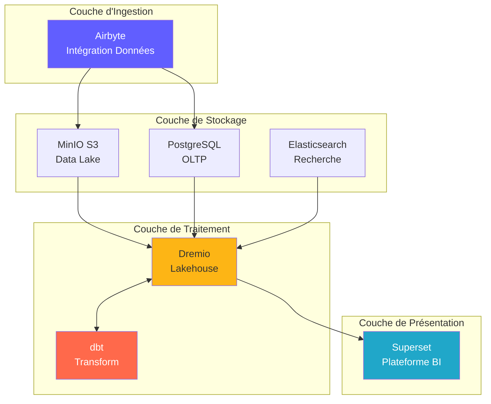
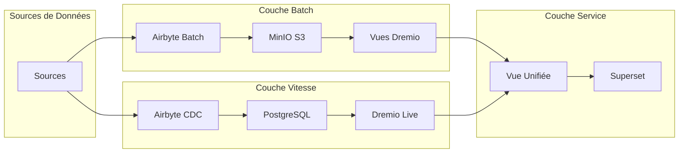
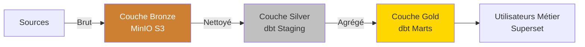
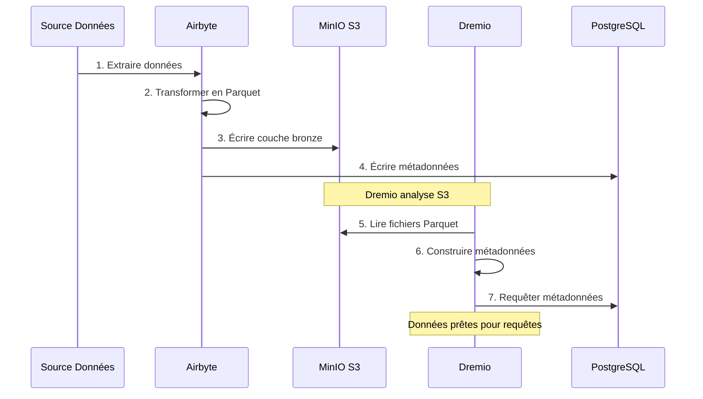
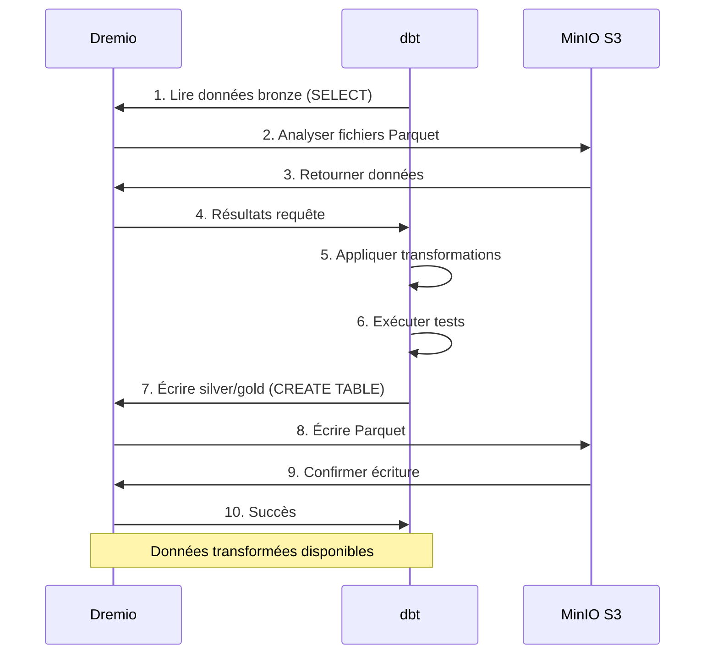
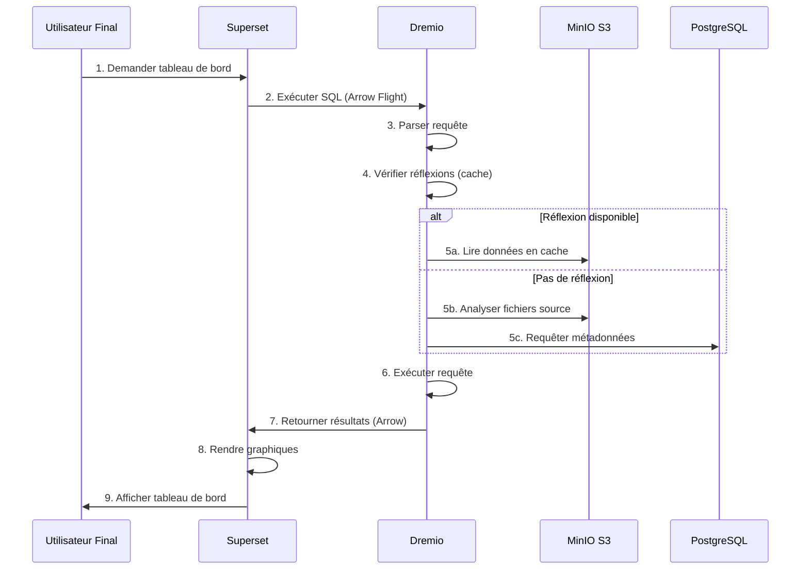
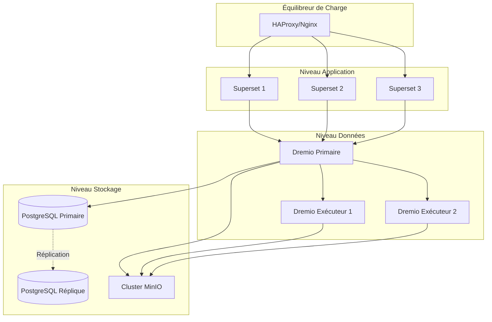
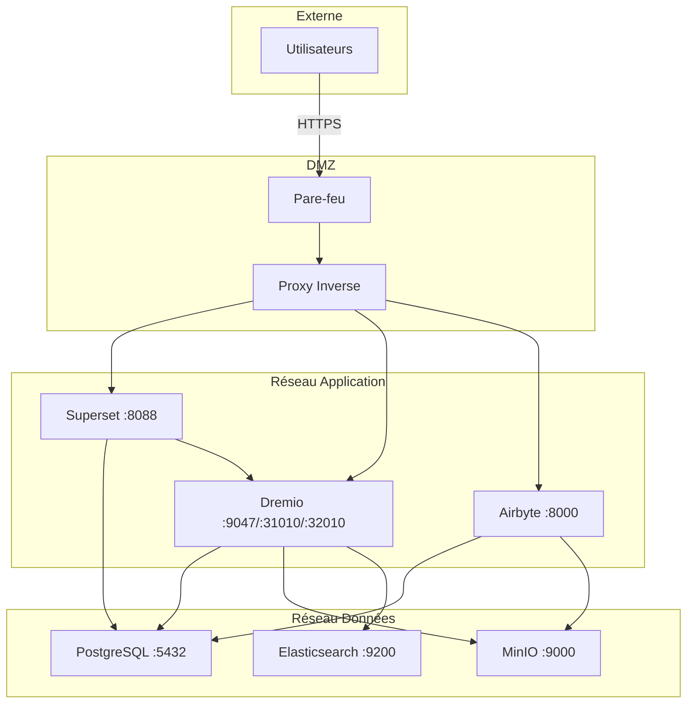
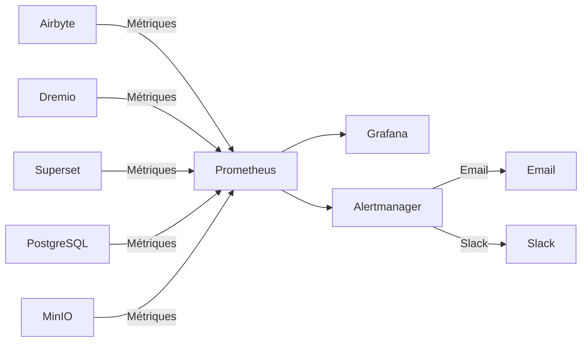

# Architekturübersicht

**Version**: 3.2.0  
**Letzte Aktualisierung**: 16.10.2025  
**Sprache**: Französisch

---

## Einführung

Die Datenplattform ist eine moderne Cloud-native Architektur, die auf Open-Source-Technologien basiert. Es bietet eine umfassende Lösung für die Datenerfassung, -speicherung, -transformation und -visualisierung, die für analytische Workloads im Unternehmensmaßstab konzipiert ist.



---

## Designprinzipien

### 1. Zuerst Open Source

**Philosophie**: Verwenden Sie Open-Source-Technologien, um eine Anbieterbindung zu vermeiden und die Flexibilität aufrechtzuerhalten.

**Vorteile**:
- Keine Lizenzkosten
- Gemeinschaftsentwicklung
- Vollständige Anpassungsfähigkeit
- Transparentes Sicherheitsaudit
- Breite Ökosystemkompatibilität

### 2. Schichtarchitektur

**Philosophie**: Unterteilen Sie Anliegen in verschiedene Ebenen, um Wartbarkeit und Skalierbarkeit zu gewährleisten.

**Ebenen**:
```
┌─────────────────────────────────────┐
│     Couche de Présentation          │  Superset (BI & Tableaux de Bord)
├─────────────────────────────────────┤
│     Couche Sémantique               │  Dremio (Moteur de Requête)
├─────────────────────────────────────┤
│     Couche de Transformation        │  dbt (Transformation Données)
├─────────────────────────────────────┤
│     Couche de Stockage              │  MinIO, PostgreSQL, Elasticsearch
├─────────────────────────────────────┤
│     Couche d'Ingestion              │  Airbyte (Intégration Données)
└─────────────────────────────────────┘
```

### 3. ELT statt ETL

**Philosophie**: Zuerst Rohdaten laden, in Ziel umwandeln (ELT).

**Warum ELT?**
- **Flexibilität**: Transformieren Sie Daten auf verschiedene Arten ohne erneute Extraktion
- **Leistung**: Zielberechnung für Transformationen verwenden
- **Überprüfbarkeit**: Rohdaten stehen immer zur Überprüfung zur Verfügung
- **Kosten**: Reduzieren Sie die Extraktionslast auf Quellsystemen

**Fließen**:
```
Extract → Load → Transform
(Airbyte) (MinIO/PostgreSQL) (dbt + Dremio)
```

### 4. Data Lakehouse-Modell

**Philosophie**: Kombinieren Sie die Flexibilität des Data Lake mit der Leistung des Data Warehouse.

**Merkmale**:
- **ACID-Transaktionen**: Vertrauenswürdige Datenoperationen
- **Schemaanwendung**: Datenqualitätsgarantien
- **Zeitreise**: Historische Versionen abfragen
- **Offene Formate**: Parkett, Eisberg, Delta Lake
- **Direkter Dateizugriff**: Keine proprietäre Sperrung

### 5. Cloud-natives Design

**Philosophie**: Design für containerisierte und verteilte Umgebungen.

**Durchführung**:
- Docker-Container für alle Dienste
- Horizontale Skalierbarkeit
- Infrastruktur als Code
- Staatenlos, wo immer möglich
- Konfiguration über Umgebungsvariablen

---

## Architekturmodelle

### Lambda-Architektur (Batch + Stream)



**Batch-Schicht** (Historische Daten):
- Große Datenmengen
- Periodische Behandlung (stündlich/täglich)
- Akzeptable hohe Latenz
- Vollständige Wiederaufbereitung möglich

**Geschwindigkeitsschicht** (Echtzeitdaten):
- Datenerfassung ändern (CDC)
- Geringe Latenz erforderlich
- Nur inkrementelle Updates
- Verwaltet aktuelle Daten

**Serviceschicht**:
- Führt Stapel- und Geschwindigkeitsansichten zusammen
- Einzelabfrageschnittstelle (Dremio)
- Automatische Ansichtsauswahl

### Architekturmedaillon (Bronze → Silber → Gold)



**Bronzeschicht** (Roh):
- Daten im Originalzustand aus Quellen
- Keine Transformation
- Komplette Historie erhalten
- Airbyte wird hier geladen

**Silberschicht** (gereinigt):
- Angewandte Datenqualität
- Standardisierte Formate
- DBT-Staging-Vorlagen
- Analysebereit

**Goldschicht** (Beruf):
- Aggregierte Metriken
- Angewandte Geschäftslogik
- Marts DBT-Modelle
- Optimiert für den Verbrauch

---

## Interaktionen zwischen Komponenten

### Datenaufnahmefluss



### Transformationspipeline



### Abfragen ausführen



---

## Skalierbarkeitsmodelle

### Horizontale Skalierung

**Zustandslose Dienste** (können sich frei weiterentwickeln):
- Airbyte Workers: Evolve für parallele Synchronisierungen
- Dremio Executors: Skalierung für Abfrageleistung
- Web-Superset: Weiterentwicklung für konkurrierende Benutzer

**Stateful Services** (Koordination erforderlich):
- PostgreSQL: Primäre Replikatreplikation
- MinIO: Verteilter Modus (mehrere Knoten)
- Elasticsearch: Cluster mit Sharding

### Vertikale Skalierung

**Intensiv im Gedächtnis**:
- Dremio: Erhöhen Sie den JVM-Heap für große Abfragen
- PostgreSQL: Mehr RAM für Cache-Puffer
- Elasticsearch: Mehr Heap für die Indizierung

**CPU-intensiv**:
- dbt: Mehr Kerne für parallele Baumodelle
- Airbyte: Schnellere Datentransformationen

### Datenpartitionierung

```sql
-- Exemple: Partitionner par date
CREATE TABLE orders_partitioned (
    order_id INT,
    customer_id INT,
    amount DECIMAL,
    order_date DATE
)
PARTITION BY (DATE_TRUNC('month', order_date))
STORED AS PARQUET;

-- La requête analyse uniquement les partitions pertinentes
SELECT SUM(amount)
FROM orders_partitioned
WHERE order_date >= '2025-01-01'
  AND order_date < '2025-02-01';
-- Analyse uniquement la partition de janvier
```

---

## Hohe Verfügbarkeit

### Redundanz der Dienste



### Fehlerszenarien

| Komponente | Aufschlüsselung | Wiederherstellung |
|---------------|-------|---------|
| **Airbyte-Worker** | Container-Absturz | Automatischer Neustart, Synchronisierung fortsetzen |
| **Dremio Executor** | Knotenfehler | Anfrage an andere Ausführende weitergeleitet |
| **PostgreSQL** | Primär außer Betrieb | Replikat im primären | hochstufen
| **MinIO-Knoten** | Festplattenfehler | Erasure Coding rekonstruiert Daten |
| **Obermenge** | Dienst außer Betrieb | Balancer leitet den Datenverkehr um |

### Backup-Strategie

```bash
# Sauvegardes automatisées quotidiennes
0 2 * * * /scripts/backup_all.sh

# backup_all.sh
#!/bin/bash

# Sauvegarder PostgreSQL
pg_dumpall -U postgres > /backups/postgres_$(date +%Y%m%d).sql

# Sauvegarder métadonnées Dremio
tar czf /backups/dremio_$(date +%Y%m%d).tar.gz /opt/dremio/data

# Synchroniser MinIO vers S3 distant
mc mirror MinIOLake/datalake s3-offsite/datalake-backup

# Conserver 30 jours
find /backups -mtime +30 -delete
```

---

## Sicherheitsarchitektur

### Netzwerksicherheit



### Authentifizierung und Autorisierung

**Dienstauthentifizierung**:
- **Dremio**: LDAP/AD, OAuth2, SAML-Integration
- **Obermenge**: Datenbankauthentifizierung, LDAP, OAuth2
- **Airbyte**: Basic Auth, OAuth2 (Unternehmen)
- **MinIO**: IAM-Richtlinien, STS-Tokens

**Autorisierungsstufen**:
```yaml
Rôles:
  - Admin:
      - Accès complet à tous les services
      - Gestion utilisateurs
      - Modifications configuration
  
  - Data Engineer:
      - Créer/modifier sources données
      - Exécuter syncs Airbyte
      - Exécuter modèles dbt
      - Créer datasets Dremio
  
  - Analyst:
      - Accès lecture seule données
      - Créer tableaux de bord Superset
      - Requêter datasets Dremio
  
  - Viewer:
      - Voir tableaux de bord uniquement
      - Pas d'accès données
```

### Datenverschlüsselung

**Im Ruhezustand**:
- MinIO: Serverseitige Verschlüsselung (AES-256)
- PostgreSQL: Transparente Datenverschlüsselung (TDE)
- Elasticsearch: Verschlüsselte Indizes

**Unterwegs**:
- TLS 1.3 für die gesamte Kommunikation zwischen Diensten
- Pfeilflug mit TLS für Dremio ↔ Superset
- HTTPS für Webschnittstellen

---

## Überwachung und Beobachtbarkeit

### Metriksammlung



**Wichtige Kennzahlen**:
- **Airbyte**: Synchronisierungserfolgsrate, synchronisierte Aufzeichnungen, übertragene Bytes
- **Dremio**: Anforderungslatenz, Cache-Trefferrate, Ressourcennutzung
- **dbt**: Modellbauzeit, Testfehler
- **Obermenge**: Ladezeit des Dashboards, aktive Benutzer
- **Infrastruktur**: CPU, Speicher, Festplatte, Netzwerk

### Protokollierung

**Zentralisierte Protokollierung**:
```yaml
Stack ELK:
  - Elasticsearch: Stocker logs
  - Logstash: Traiter logs
  - Kibana: Visualiser logs

Sources de Logs:
  - Logs application (format JSON)
  - Logs d'accès
  - Logs d'audit
  - Logs d'erreur
```

### Nachverfolgung

**Verteilte Nachverfolgung**:
- Jaeger- oder Zipkin-Integration
- Verfolgen Sie Anfragen zwischen Diensten
- Identifizieren Sie Engpässe
- Leistungsprobleme beheben

---

## Bereitstellungstopologien

### Entwicklungsumgebung

```yaml
Hôte Unique:
  Ressources: 8 Go RAM, 4 CPUs
  Services: Tous sur une machine
  Stockage: Volumes locaux
  Réseau: Réseau bridge
  Cas d'usage: Développement, tests
```

### Staging-Umgebung

```yaml
Multi-Hôtes:
  Ressources: 16 Go RAM, 8 CPUs par hôte
  Services: Répartis sur 2-3 hôtes
  Stockage: NFS partagé ou MinIO distribué
  Réseau: Réseau overlay
  Cas d'usage: Tests pré-production, UAT
```

### Produktionsumgebung

```yaml
Cluster Kubernetes:
  Ressources: Auto-scaling selon charge
  Services: Conteneurisés, répliqués
  Stockage: Volumes persistants (SSD)
  Réseau: Service mesh (Istio)
  Haute Disponibilité: Déploiement multi-zones
  Cas d'usage: Charges production
```

---

## Begründung technologischer Entscheidungen

### Warum Airbyte?

- **Über 300 Konnektoren**: Vorgefertigte Integrationen
- **Open Source**: Keine Lieferantenbindung
- **Aktive Community**: Über 12.000 GitHub-Sterne
- **CDC-Unterstützung**: Datenerfassung in Echtzeit
- **Standardisierung**: Integrierte DBT-Integration

### Warum Dremio?

- **Abfragebeschleunigung**: Abfragen 10-100x schneller
- **Arrow Flight**: Hochleistungs-Datenübertragung
- **Data-Lake-Kompatibilität**: Keine Datenverschiebung
- **Selbstbedienung**: Geschäftsanwender erkunden Daten
- **Profitabel**: Lagerkosten reduzieren

### Warum dbt?

- **SQL-basiert**: Analysten vertraut
- **Versionskontrolle**: Git-Integration
- **Tests**: Integrierte Datenqualitätstests
- **Dokumentation**: Automatisch generierte Dokumente
- **Community**: Über 5.000 Pakete verfügbar

### Warum Supersatz?

- **Moderne Benutzeroberfläche**: Intuitive Benutzeroberfläche
- **SQL IDE**: Erweiterte Abfragefunktionen
- **Umfassende Visualisierungen**: Über 50 Grafiktypen
- **Erweiterbar**: Benutzerdefinierte Plugins
- **Open Source**: Unterstützte Apache Foundation

### Warum PostgreSQL?

- **Zuverlässigkeit**: ACID-Konformität
- **Leistung**: Im Maßstab bewährt
- **Funktionen**: JSON, Volltextsuche, Erweiterungen
- **Community**: Ausgereiftes Ökosystem
- **Kosten**: Kostenlos und Open Source

### Warum MinIO?

- **S3-Kompatibilität**: Industriestandard-API
- **Leistung**: Hohe Durchflussrate
- **Löschcodierung**: Datenhaltbarkeit
- **Multi-Cloud**: Überall bereitstellen
- **Kostengünstig**: Selbstgehostete Alternative

---

## Zukünftige Entwicklung der Architektur

### Geplante Verbesserungen

1. **Datenkatalog** (OpenMetadata-Integration)
   - Metadatenverwaltung
   - Abstammungsverfolgung
   - Datenermittlung

2. **Datenqualität** (große Erwartungen)
   - Automatisierte Validierung
   - Anomalieerkennung
   - Hochwertige Dashboards

3. **ML-Operationen** (MLflow)
   - Modellieren Sie Trainingspipelines
   - Models registrieren
   - Bereitstellungsautomatisierung

4. **Stream-Verarbeitung** (Apache Flink)
   - Echtzeittransformationen
   - Komplexe Ereignisverarbeitung
   - Streaming-Analyse

5. **Data Governance** (Apache Atlas)
   - Richtlinienanwendung
   - Zugriffsprüfung
   - Compliance-Berichte

---

## Referenzen

- [Komponentendetails](components.md)
- [Datenfluss](data-flow.md)
- [Bereitstellungshandbuch](deployment.md)
- [Airbyte-Integration](../guides/airbyte-integration.md)

---

**Architekturübersichtsversion**: 3.2.0  
**Letzte Aktualisierung**: 16.10.2025  
**Verwaltet von**: Data Platform Team