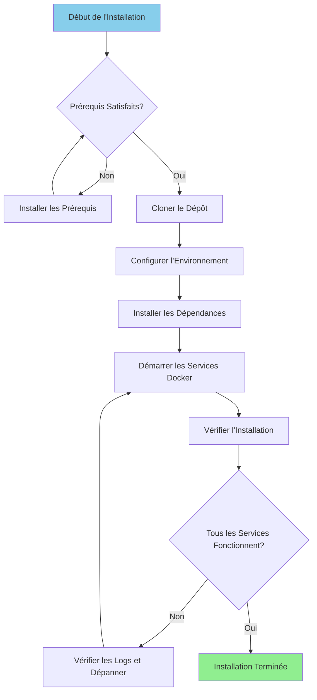

# Installationsanleitung

**Version**: 3.2.0  
**Letzte Aktualisierung**: 16.10.2025  
**Sprache**: Französisch

---

## Übersicht

Dieses Handbuch enthält Schritt-für-Schritt-Anleitungen für die Installation und Konfiguration der gesamten Datenplattform, einschließlich Airbyte, Dremio, dbt, Apache Superset und der unterstützenden Infrastruktur.



---

## Voraussetzungen

### Systemanforderungen

**Mindestanforderungen:**
- **CPU**: 4 Kerne (8+ empfohlen)
- **RAM**: 8 GB (16+ GB empfohlen)
- **Festplattenspeicher**: 20 GB verfügbar (50+ GB empfohlen)
- **Netzwerk**: Stabile Internetverbindung für Docker-Images

**Betriebssysteme:**
- Linux (Ubuntu 20.04+, CentOS 8+, Debian 11+)
- macOS (11.0+)
- Windows 10/11 mit WSL2

### Erforderliche Software

#### 1. Docker

**Version**: 20.10 oder höher

**Einrichtung:**

**Linux:**
```bash
# Installer Docker
curl -fsSL https://get.docker.com -o get-docker.sh
sudo sh get-docker.sh

# Ajouter l'utilisateur au groupe docker
sudo usermod -aG docker $USER

# Démarrer le service Docker
sudo systemctl start docker
sudo systemctl enable docker

# Vérifier l'installation
docker --version
```

**macOS:**
```bash
# Télécharger et installer Docker Desktop depuis:
# https://www.docker.com/products/docker-desktop

# Vérifier l'installation
docker --version
```

**Windows:**
```powershell
# Installer WSL2 d'abord
wsl --install

# Télécharger et installer Docker Desktop depuis:
# https://www.docker.com/products/docker-desktop

# Vérifier l'installation
docker --version
```

#### 2. Docker Compose

**Version**: 2.0 oder höher

**Einrichtung:**

```bash
# Linux
sudo curl -L "https://github.com/docker/compose/releases/latest/download/docker-compose-$(uname -s)-$(uname -m)" -o /usr/local/bin/docker-compose
sudo chmod +x /usr/local/bin/docker-compose

# Vérifier l'installation
docker-compose --version
```

**Hinweis**: Docker Desktop für macOS und Windows beinhaltet Docker Compose.

#### 3. Python

**Version**: 3.11 oder höher

**Einrichtung:**

**Linux (Ubuntu/Debian):**
```bash
sudo apt update
sudo apt install python3.11 python3.11-venv python3-pip
```

**macOS:**
```bash
brew install python@3.11
```

**Windows:**
```powershell
# Télécharger l'installateur depuis python.org
# Ou utiliser winget:
winget install Python.Python.3.11
```

**Überprüfung:**
```bash
python --version  # ou python3 --version
pip --version     # ou pip3 --version
```

#### 4. Git

**Einrichtung:**

```bash
# Linux
sudo apt install git  # Ubuntu/Debian
sudo yum install git  # CentOS/RHEL

# macOS
brew install git

# Windows
winget install Git.Git
```

**Überprüfung:**
```bash
git --version
```

---

## Installationsschritte

### Schritt 1: Klonen Sie das Repository

```bash
# Cloner le dépôt
git clone https://github.com/your-org/dremiodbt.git

# Naviguer vers le répertoire du projet
cd dremiodbt

# Vérifier le contenu
ls -la
```

**Erwartete Struktur:**
```
dremiodbt/
├── docker-compose.yml
├── docker-compose-airbyte.yml
├── README.md
├── requirements.txt
├── dbt/
├── dremio_connector/
├── docs/
└── scripts/
```

### Schritt 2: Konfigurieren Sie die Umgebung

#### Umgebungsdatei erstellen

```bash
# Copier le fichier d'environnement exemple
cp .env.example .env

# Éditer la configuration (optionnel)
nano .env  # ou utiliser votre éditeur préféré
```

#### Umgebungsvariablen

**Grundkonfiguration:**
```bash
# Projet
PROJECT_NAME=dremiodbt
ENVIRONMENT=development

# Réseau Docker
NETWORK_NAME=dremio_network

# PostgreSQL
POSTGRES_HOST=postgres
POSTGRES_PORT=5432
POSTGRES_DB=dremio_db
POSTGRES_USER=postgres
POSTGRES_PASSWORD=postgres123

# Dremio
DREMIO_VERSION=26.0
DREMIO_HTTP_PORT=9047
DREMIO_FLIGHT_PORT=32010
DREMIO_ADMIN_USER=admin
DREMIO_ADMIN_PASSWORD=admin123

# Airbyte
AIRBYTE_VERSION=0.50.33
AIRBYTE_HTTP_PORT=8000
AIRBYTE_API_PORT=8001

# Superset
SUPERSET_VERSION=3.0
SUPERSET_HTTP_PORT=8088
SUPERSET_ADMIN_USER=admin
SUPERSET_ADMIN_PASSWORD=admin

# MinIO
MINIO_VERSION=latest
MINIO_API_PORT=9000
MINIO_CONSOLE_PORT=9001
MINIO_ROOT_USER=minioadmin
MINIO_ROOT_PASSWORD=minioadmin123

# Elasticsearch
ELASTIC_VERSION=8.15.0
ELASTIC_HTTP_PORT=9200
```

### Schritt 3: Python-Abhängigkeiten installieren

#### Erstellen Sie die virtuelle Umgebung

```bash
# Créer l'environnement virtuel
python -m venv venv

# Activer l'environnement virtuel
# Linux/macOS:
source venv/bin/activate

# Windows:
.\venv\Scripts\activate
```

#### Installationsanforderungen

```bash
# Mettre à jour pip
pip install --upgrade pip

# Installer les dépendances
pip install -r requirements.txt

# Vérifier l'installation
pip list
```

**Wichtige installierte Pakete:**
- `pyarrow>=21.0.0` – Arrow Flight-Kunde
- `pandas>=2.3.0` - Datenmanipulation
- `dbt-core>=1.10.0` - Datentransformation
- `sqlalchemy>=2.0.0` - Datenbankkonnektivität
- `pyyaml>=6.0.0` - Konfigurationsverwaltung

### Schritt 4: Starten Sie die Docker-Dienste

#### Hauptdienste starten

```bash
# Démarrer tous les services
docker-compose up -d

# Ou utiliser Makefile (si disponible)
make up
```

**Dienste gestartet:**
- PostgreSQL (Port 5432)
- Dremio (Ports 9047, 32010)
- Apache Superset (Port 8088)
- MinIO (Ports 9000, 9001)
- Elasticsearch (Port 9200)

#### Airbyte starten (separat verfassen)

```bash
# Démarrer les services Airbyte
docker-compose -f docker-compose-airbyte.yml up -d
```

**Airbyte-Dienste gestartet:**
- Airbyte-Server (Port 8001)
- Airbyte-Web-Benutzeroberfläche (Port 8000)
- Airbyte-Arbeiter
- Airbyte Temporal
- Airbyte-Datenbank

#### Überprüfen Sie den Servicestatus

```bash
# Voir les conteneurs en cours d'exécution
docker-compose ps

# Voir tous les conteneurs (incluant Airbyte)
docker ps

# Voir les logs
docker-compose logs -f

# Voir les logs Airbyte
docker-compose -f docker-compose-airbyte.yml logs -f
```

---

## Verifizierung

### Schritt 5: Dienste prüfen

#### 1. PostgreSQL

```bash
# Tester la connexion
docker exec -it postgres psql -U postgres -d dremio_db -c "SELECT version();"
```

**Erwartete Ausgabe:**
```
PostgreSQL 16.x on x86_64-pc-linux-gnu
```

#### 2. Dremio

**Weboberfläche:**
```
http://localhost:9047
```

**Erste Verbindung:**
- Benutzername: `admin`
- Passwort: `admin123`
- Beim ersten Zugriff werden Sie aufgefordert, ein Administratorkonto zu erstellen

**Testen Sie die Verbindung:**
```bash
# Tester le point de terminaison HTTP
curl http://localhost:9047/apiv2/login
```

#### 3. Airbyte

**Weboberfläche:**
```
http://localhost:8000
```

**Standardkennungen:**
- E-Mail: `airbyte@example.com`
- Passwort: `password`

**Testen Sie die API:**
```bash
# Vérification de santé
curl http://localhost:8001/health
```

**Erwartete Antwort:**
```json
{
  "status": "ok",
  "timestamp": "2025-10-16T12:00:00Z"
}
```

#### 4. Apache-Superset

**Weboberfläche:**
```
http://localhost:8088
```

**Standardkennungen:**
- Benutzername: `admin`
- Passwort: `admin`

**Testen Sie die Verbindung:**
```bash
curl http://localhost:8088/health
```

#### 5. MinIO

**Konsolen-Benutzeroberfläche:**
```
http://localhost:9001
```

**Anmeldeinformationen:**
- Benutzername: `minioadmin`
- Passwort: `minioadmin123`

**Testen Sie die S3-API:**
```bash
# Installer le client MinIO
wget https://dl.min.io/client/mc/release/linux-amd64/mc
chmod +x mc

# Configurer
./mc alias set local http://localhost:9000 minioadmin minioadmin123

# Tester
./mc ls local
```

#### 6. Elasticsearch

**Testen Sie die Verbindung:**
```bash
# Vérification de santé
curl http://localhost:9200/_cluster/health

# Obtenir les informations
curl http://localhost:9200
```

**Erwartete Antwort:**
```json
{
  "name": "elasticsearch",
  "cluster_name": "docker-cluster",
  "version": {
    "number": "8.15.0"
  }
}
```

### Schritt 6: Gesundheitsprüfungen durchführen

```bash
# Exécuter le script de vérification de santé complet
python scripts/health_check.py

# Ou utiliser Makefile
make health-check
```

**Erwartete Ausgabe:**
```
✓ PostgreSQL: En cours d'exécution (port 5432)
✓ Dremio: En cours d'exécution (ports 9047, 32010)
✓ Airbyte: En cours d'exécution (ports 8000, 8001)
✓ Superset: En cours d'exécution (port 8088)
✓ MinIO: En cours d'exécution (ports 9000, 9001)
✓ Elasticsearch: En cours d'exécution (port 9200)

Tous les services sont opérationnels!
```

---

## Konfiguration nach der Installation

### 1. Dremio initialisieren

```bash
# Exécuter le script d'initialisation
python scripts/init_dremio.py
```

**Erstellt:**
- Admin-Benutzer
- Standardquellen (PostgreSQL, MinIO)
- Beispieldatensätze

### 2. Superset initialisieren

```bash
# Initialiser la base de données
docker exec -it superset superset db upgrade

# Créer un utilisateur administrateur (si inexistant)
docker exec -it superset superset fab create-admin \
    --username admin \
    --firstname Admin \
    --lastname User \
    --email admin@example.com \
    --password admin

# Initialiser Superset
docker exec -it superset superset init
```

### 3. Konfigurieren Sie dbt

```bash
# Naviguer vers le répertoire dbt
cd dbt

# Tester la connexion
dbt debug

# Exécuter les modèles initiaux
dbt run

# Exécuter les tests
dbt test
```

### 4. Airbyte konfigurieren

**Über das Webinterface (http://localhost:8000):**

1. Schließen Sie den Einrichtungsassistenten ab
2. Konfigurieren Sie die erste Quelle (z. B. PostgreSQL)
3. Konfigurieren Sie das Ziel (z. B. MinIO S3)
4. Erstellen Sie die Verbindung
5. Führen Sie die erste Synchronisierung durch

**Über API:**
```bash
# Voir docs/i18n/fr/guides/airbyte-integration.md pour les détails
python scripts/configure_airbyte.py
```

---

## Verzeichnisstruktur nach der Installation

```
dremiodbt/
├── venv/                          # Environnement virtuel Python
├── data/                          # Stockage de données local
│   ├── dremio/                    # Métadonnées Dremio
│   ├── postgres/                  # Données PostgreSQL
│   └── minio/                     # Données MinIO
├── logs/                          # Logs applicatifs
│   ├── dremio.log
│   ├── airbyte.log
│   ├── superset.log
│   └── dbt.log
├── dbt/
│   ├── models/                    # Modèles dbt
│   ├── tests/                     # Tests dbt
│   ├── target/                    # SQL compilé
│   └── logs/                      # Logs dbt
└── docker-volume/                 # Volumes persistants Docker
    ├── db-data/                   # Données de base de données
    ├── minio-data/                # Stockage objet
    └── elastic-data/              # Index de recherche
```

---

## Fehlerbehebung

### Häufige Probleme

#### 1. Port bereits verwendet

**Fehler:**
```
Error: bind: address already in use
```

**Lösung:**
```bash
# Trouver le processus utilisant le port (exemple: 9047)
sudo lsof -i :9047

# Terminer le processus
sudo kill -9 <PID>

# Ou changer le port dans docker-compose.yml
```

#### 2. Unzureichender Speicher

**Fehler:**
```
ERROR: Insufficient memory available
```

**Lösung:**
```bash
# Augmenter l'allocation mémoire Docker
# Docker Desktop: Paramètres > Ressources > Mémoire (16Go recommandés)

# Linux: Éditer /etc/docker/daemon.json
{
  "default-ulimits": {
    "memlock": {
      "Hard": -1,
      "Name": "memlock",
      "Soft": -1
    }
  }
}

# Redémarrer Docker
sudo systemctl restart docker
```

#### 3. Dienste starten nicht

**Protokolle prüfen:**
```bash
# Voir tous les logs des services
docker-compose logs

# Voir un service spécifique
docker-compose logs dremio
docker-compose logs airbyte-server

# Suivre les logs en temps réel
docker-compose logs -f
```

#### 4. Netzwerkprobleme

**Docker-Netzwerk zurücksetzen:**
```bash
# Arrêter tous les services
docker-compose down
docker-compose -f docker-compose-airbyte.yml down

# Supprimer le réseau
docker network rm dremio_network

# Redémarrer les services
docker-compose up -d
docker-compose -f docker-compose-airbyte.yml up -d
```

#### 5. Berechtigungsprobleme (Linux)

**Lösung:**
```bash
# Corriger les permissions des répertoires de données
sudo chown -R $USER:$USER data/ docker-volume/

# Corriger les permissions du socket Docker
sudo chmod 666 /var/run/docker.sock
```

---

## Deinstallation

### Stoppen Sie die Dienste

```bash
# Arrêter les services principaux
docker-compose down

# Arrêter Airbyte
docker-compose -f docker-compose-airbyte.yml down
```

### Daten löschen (optional)

```bash
# Supprimer les volumes (ATTENTION: Supprime toutes les données)
docker-compose down -v
docker-compose -f docker-compose-airbyte.yml down -v

# Supprimer les répertoires de données locaux
rm -rf data/ docker-volume/ logs/
```

### Docker-Images löschen

```bash
# Lister les images
docker images | grep dremio

# Supprimer des images spécifiques
docker rmi dremio/dremio-oss:24.0
docker rmi airbyte/server:0.50.33
docker rmi apache/superset:3.0

# Supprimer toutes les images non utilisées
docker image prune -a
```

---

## Nächste Schritte

Nach erfolgreicher Installation:

1. **Datenquellen konfigurieren** – Siehe [Konfigurationshandbuch](configuration.md)
2. **Tutorial „Erste Schritte“** – Siehe [Erste Schritte](first-steps.md)
3. **Airbyte-Konfiguration** – Siehe [Airbyte-Integrationshandbuch](../guides/airbyte-integration.md)
4. **Dremio-Setup** – Siehe [Dremio-Setup-Anleitung](../guides/dremio-setup.md)
5. **DBT-Modelle erstellen** – Siehe [DBT-Entwicklungshandbuch](../guides/dbt-development.md)
6. **Dashboards erstellen** – Siehe [Superset Dashboards Guide](../guides/superset-dashboards.md)

---

## Unterstützung

Bei Installationsproblemen:

- **Dokumentation**: [Anleitung zur Fehlerbehebung](../guides/troubleshooting.md)
- **GitHub-Probleme**: https://github.com/your-org/dremiodbt/issues
- **Community**: https://github.com/your-org/dremiodbt/discussions

---

**Version der Installationsanleitung**: 3.2.0  
**Letzte Aktualisierung**: 16.10.2025  
**Verwaltet von**: Data Platform Team