# Airbyte-Integrationshandbuch

**Version**: 3.2.0  
**Letzte Aktualisierung**: 16. Oktober 2025  
**Sprache**: Französisch

---

## Übersicht

Airbyte ist eine Open-Source-Datenintegrationsplattform, die das Verschieben von Daten von verschiedenen Quellen zu Zielen vereinfacht. Dieser Leitfaden behandelt die Integration von Airbyte in die Datenplattform, die Konfiguration von Konnektoren und die Einrichtung von Datenpipelines.


---

## Was ist Airbyte?

### Hauptmerkmale

- **Über 300 vorgefertigte Konnektoren**: APIs, Datenbanken, Dateien, SaaS-Anwendungen
- **Open Source**: Selbstgehostet mit vollständiger Datenkontrolle
- **Change Data Capture (CDC)**: Datensynchronisierung in Echtzeit
- **Benutzerdefinierte Connectors**: Erstellen Sie Connectors mit Python oder Low-Code-CDK
- **Datennormalisierung**: Roh-JSON in strukturierte Tabellen umwandeln
- **Überwachung und Warnungen**: Verfolgen Sie den Synchronisierungsstatus und die Datenqualität

### Architektur


---

## Einrichtung

### Schnellstart

Airbyte ist in der Plattform enthalten. Beginnen Sie mit:

```bash
# Démarrer services Airbyte
docker-compose -f docker-compose-airbyte.yml up -d

# Vérifier statut
docker-compose -f docker-compose-airbyte.yml ps

# Voir logs
docker-compose -f docker-compose-airbyte.yml logs -f
```

### Dienste gestartet

| Dienstleistungen | Hafen | Beschreibung |
|--------|------|-------------|
| **airbyte-webapp** | 8000 | Web-Benutzeroberfläche |
| **Airbyte-Server** | 8001 | API-Server |
| **Airbyte-Worker** | - | Job-Ausführungs-Engine |
| **airbyte-temporal** | 7233 | Workflow-Orchestrierung |
| **airbyte-db** | 5432 | Metadatendatenbank (PostgreSQL) |

### Erster Zugriff

**Weboberfläche:**
```
http://localhost:8000
```

**Standardkennungen:**
- **E-Mail**: `airbyte@example.com`
- **Passwort**: `password`

**Ändern Sie aus Sicherheitsgründen das Passwort**, wenn Sie sich zum ersten Mal anmelden.

---

## Konfiguration

### Konfigurationsassistent

Schließen Sie beim ersten Zugriff den Konfigurationsassistenten ab:

1. **E-Mail-Einstellungen**: Benachrichtigungen konfigurieren
2. **Datenresidenz**: Wählen Sie den Speicherort für die Daten aus
3. **Anonyme Nutzungsstatistik**: Telemetrie akzeptieren/ablehnen

### Arbeitsbereichseinstellungen

Navigieren Sie zu **Einstellungen > Arbeitsbereich**:

```yaml
Nom Workspace: Production Data Platform
ID Workspace: default
Définition Namespace: Destination Default
Format Namespace: ${SOURCE_NAMESPACE}
```

### Ressourcenlimits

**Datei**: `config/airbyte/config.yaml`

```yaml
# Allocation ressources par connecteur
resources:
  source:
    cpu_limit: "1.0"
    memory_limit: "1Gi"
    cpu_request: "0.25"
    memory_request: "256Mi"
  
  destination:
    cpu_limit: "1.0"
    memory_limit: "1Gi"
    cpu_request: "0.25"
    memory_request: "256Mi"
  
  orchestrator:
    cpu_limit: "0.5"
    memory_limit: "512Mi"
```

---

## Anschlüsse

### Quellanschlüsse

#### Quelle PostgreSQL

**Anwendungsfall**: Daten aus Transaktionsdatenbank extrahieren

**Konfiguration:**

1. Navigieren Sie zu **Quellen > Neue Quelle**
2. Wählen Sie **PostgreSQL**
3. Konfigurieren Sie die Verbindung:

```yaml
Host: postgres
Port: 5432
Database: source_db
Username: readonly_user
Password: [MOT_DE_PASSE_SÉCURISÉ]
SSL Mode: prefer

Méthode Réplication: Standard
  # Ou CDC pour changements temps réel:
  # Méthode Réplication: Logical Replication (CDC)
```

**Verbindung testen** → **Quelle einrichten**

#### REST-API-Quelle

**Anwendungsfall**: Daten aus APIs extrahieren

**Konfiguration:**

```yaml
Name: External API
URL Base: https://api.example.com/v1
Authentication:
  Type: Bearer Token
  Token: [API_TOKEN]

Endpoints:
  - name: customers
    path: /customers
    http_method: GET
    
  - name: orders
    path: /orders
    http_method: GET
    params:
      start_date: "{{ config['start_date'] }}"
```

#### Quelldatei (CSV)

**Anwendungsfall**: CSV-Dateien importieren

**Konfiguration:**

```yaml
Dataset Name: sales_data
URL: https://storage.example.com/sales.csv
Format: CSV
Provider:
  Storage: HTTPS
  User Provided Storage:
    URL: https://storage.example.com/sales.csv
```

#### Gemeinsame Quellen

| Quelle | Anwendungsfälle | CDC-Unterstützung |
|--------|--------|-------------|
| **PostgreSQL** | Transaktionscomics | ✅ Ja |
| **MySQL** | Transaktionscomics | ✅ Ja |
| **MongoDB** | NoSQL-Dokumente | ✅ Ja |
| **Salesforce** | CRM-Daten | ❌ Nein |
| **Google Sheets** | Tabellenkalkulationen | ❌ Nein |
| **Streifen** | Zahlungsdaten | ❌ Nein |
| **REST-API** | Benutzerdefinierte APIs | ❌ Nein |
| **S3** | Dateispeicherung | ❌ Nein |

### Zielanschlüsse

#### MinIO S3-Ziel

**Anwendungsfall**: Rohdaten im Data Lake speichern

**Konfiguration:**

1. Navigieren Sie zu **Ziele > Neues Ziel**
2. Wählen Sie **S3**
3. Konfigurieren Sie die Verbindung:

```yaml
S3 Bucket Name: datalake
S3 Bucket Path: airbyte-data/${NAMESPACE}/${STREAM_NAME}
S3 Bucket Region: us-east-1

# Point de terminaison MinIO
S3 Endpoint: http://minio:9000
Access Key ID: [MINIO_ROOT_USER]
Secret Access Key: [MINIO_ROOT_PASSWORD]

Output Format:
  Format Type: Parquet
  Compression: GZIP
  Block Size: 128MB
```

**Verbindung testen** → **Ziel einrichten**

#### PostgreSQL-Ziel

**Anwendungsfall**: Laden Sie transformierte Daten für Analysen

**Konfiguration:**

```yaml
Host: postgres
Port: 5432
Database: analytics_db
Username: analytics_user
Password: [MOT_DE_PASSE_SÉCURISÉ]
Default Schema: public

Normalization:
  Mode: Basic
  # Crée tables normalisées depuis JSON imbriqué
```

#### Reiseziel Dremio

**Anwendungsfall**: Direktes Laden in Data Lakehouse

**Konfiguration:**

```yaml
Host: dremio
Port: 32010
Project: Production
Dataset: airbyte_data
Username: dremio_user
Password: [DREMIO_PASSWORD]

Connection Type: Arrow Flight
SSL: false
```

---

## Verbindungen

### Erstellen Sie eine Verbindung

Eine Verbindung verbindet eine Quelle mit einem Ziel.

```mermaid
sequenceDiagram
    participant S as Source
    participant A as Airbyte
    participant D as Destination
    
    S->>A: 1. Extraire données
    A->>A: 2. Appliquer transformations
    A->>D: 3. Charger données
    D->>D: 4. Normaliser (optionnel)
    A->>A: 5. Mettre à jour état
    
    Note over A: Sync terminée
```



#### Schritt für Schritt

1. **Navigieren Sie zu Verbindungen > Neue Verbindung**

2. **Quelle auswählen**: Wählen Sie die konfigurierte Quelle (z. B. PostgreSQL).

3. **Ziel auswählen**: Ziel auswählen (z. B. MinIO S3)

4. **Synchronisierung konfigurieren**:

```yaml
Nom Connexion: PostgreSQL → MinIO
Fréquence Réplication: Every 24 hours
Namespace Destination: Custom
  Format Namespace: production_${SOURCE_NAMESPACE}

Streams:
  - customers
    Mode Sync: Full Refresh | Overwrite
    Champ Curseur: updated_at
    Clé Primaire: customer_id
    
  - orders
    Mode Sync: Incremental | Append
    Champ Curseur: created_at
    Clé Primaire: order_id
    
  - products
    Mode Sync: Full Refresh | Overwrite
    Clé Primaire: product_id
```

5. **Normalisierung konfigurieren** (optional):

```yaml
Normalization:
  Enable: true
  Option: Basic Normalization
  # Convertit JSON imbriqué en tables plates
```

6. **Verbindung testen** → **Verbindung einrichten**

### Synchronisationsmodi

| Mode | Beschreibung | Anwendungsfälle |
|------|-------------|-------------|
| **Vollständige Aktualisierung\| Überschreiben** | Alle Daten ersetzen | Maßtabellen |
| **Vollständige Aktualisierung\| Anhängen** | Alle Datensätze hinzufügen | Historische Verfolgung |
| **Inkrementell\| Anhängen** | Neue/aktualisierte Datensätze hinzufügen | Faktentabellen |
| **Inkrementell\| Dedupliziert** | Vorhandene Datensätze aktualisieren | SCD Typ 1 |

### Planung

**Frequenzoptionen:**
- **Manuell**: Manuell auslösen
- **Stündlich**: Jede Stunde
- **Täglich**: Alle 24 Stunden (Zeit angeben)
- **Wöchentlich**: Bestimmte Wochentage
- **Cron**: Benutzerdefinierte Planung (z. B. `0 2 * * *`)

**Beispiele für Zeitpläne:**
```yaml
# Toutes les 6 heures
Cron: 0 */6 * * *

# Jours de semaine à 2h du matin
Cron: 0 2 * * 1-5

# Premier jour du mois
Cron: 0 0 1 * *
```

---

## Datentransformation

### Grundlegende Normalisierung

Airbyte beinhaltet **Grundlegende Normalisierung** mit dbt:

**Was sie macht:**
– Konvertiert verschachteltes JSON in flache Tabellen
- Erstellen Sie Tabellen `_airbyte_raw_*` (rohes JSON)
- Erstellt standardisierte (strukturierte) Tabellen
- Metadatenspalten hinzufügen (`_airbyte_emitted_at`, `_airbyte_normalized_at`)

**Beispiel:**

**Roh-JSON** (`_airbyte_raw_customers`):
```json
{
  "_airbyte_ab_id": "uuid-123",
  "_airbyte_emitted_at": "2025-10-16T10:00:00Z",
  "_airbyte_data": {
    "id": 1,
    "name": "Acme Corp",
    "contact": {
      "email": "info@acme.com",
      "phone": "+1234567890"
    },
    "addresses": [
      {"type": "billing", "city": "New York"},
      {"type": "shipping", "city": "Boston"}
    ]
  }
}
```

**Standardisierte Tabellen:**

`customers`:
```sql
id | name | contact_email | contact_phone | _airbyte_normalized_at
1 | Acme Corp | info@acme.com | +1234567890 | 2025-10-16 10:05:00
```

`customers_addresses`:
```sql
_airbyte_customers_hashid | type | city
hash-123 | billing | New York
hash-123 | shipping | Boston
```

### Benutzerdefinierte Transformationen (dbt)

Für erweiterte Transformationen verwenden Sie dbt:

1. **Airbyte-Normalisierung deaktivieren**
2. **DBT-Modelle erstellen** mit Verweis auf Tabellen `_airbyte_raw_*`
3. **Führen Sie dbt aus** nach der Airbyte-Synchronisierung

**Beispiel für ein DBT-Modell:**
```sql
-- models/staging/stg_customers.sql
with source as (
    select * from {{ source('airbyte_raw', '_airbyte_raw_customers') }}
),

parsed as (
    select
        _airbyte_ab_id,
        _airbyte_emitted_at,
        (_airbyte_data->>'id')::int as customer_id,
        _airbyte_data->>'name' as customer_name,
        _airbyte_data->'contact'->>'email' as email,
        _airbyte_data->'contact'->>'phone' as phone
    from source
)

select * from parsed
```

---

## Überwachung

### Synchronisierungsstatus

**Dashboard-Weboberfläche:**
- **Verbindungen**: Alle Verbindungen anzeigen
- **Synchronisierungsverlauf**: Vergangene Synchronisierungsaufträge
- **Sync-Protokolle**: Detaillierte Protokolle pro Job

**Statusanzeigen:**
- 🟢 **Erfolgreich**: Synchronisierung erfolgreich abgeschlossen
- 🔴 **Fehlgeschlagen**: Synchronisierung fehlgeschlagen (Protokolle prüfen)
- 🟡 **Läuft**: Synchronisierung läuft
- ⚪ **Abgebrochen**: Synchronisierung wurde vom Benutzer abgebrochen

### Protokolle

**Siehe Synchronisierungsprotokolle:**
```bash
# Logs serveur Airbyte
docker-compose -f docker-compose-airbyte.yml logs airbyte-server

# Logs worker (exécution sync réelle)
docker-compose -f docker-compose-airbyte.yml logs airbyte-worker

# Logs job spécifique
# Disponible dans Interface Web: Connections > [Connection] > Job History > [Job]
```

### Metriken

**Wichtige zu überwachende Kennzahlen:**
- **Synchronisierte Aufnahmen**: Anzahl der Aufnahmen pro Synchronisierung
- **Synchronisierte Bytes**: Übertragene Datenmenge
- **Synchronisierungsdauer**: Zeit, die pro Synchronisierung benötigt wird
- **Fehlerrate**: Prozentsatz der fehlgeschlagenen Synchronisierungen

**Metriken exportieren:**
```bash
# API Airbyte
curl -X GET "http://localhost:8001/api/v1/jobs/list" \
  -H "Content-Type: application/json" \
  -d '{
    "configTypes": ["sync"],
    "configId": "connection-id"
  }'
```

### Warnungen

**Konfigurieren Sie Benachrichtigungen** unter **Einstellungen > Benachrichtigungen**:

```yaml
Type Notification: Slack
URL Webhook: https://hooks.slack.com/services/VOTRE/WEBHOOK/URL

Événements:
  - Échec Sync
  - Succès Sync (optionnel)
  - Connexion Désactivée

Conditions:
  - Seuil échec: 3 échecs consécutifs
```

---

## API-Nutzung

### Authentifizierung

```bash
# Pas d'authentification requise pour localhost
# Pour production, configurez auth dans docker-compose-airbyte.yml
```

### Allgemeine API-Aufrufe

#### Quellen auflisten

```bash
curl -X POST "http://localhost:8001/api/v1/sources/list" \
  -H "Content-Type: application/json" \
  -d '{
    "workspaceId": "workspace-id"
  }'
```

#### Verbindung erstellen

```bash
curl -X POST "http://localhost:8001/api/v1/connections/create" \
  -H "Content-Type: application/json" \
  -d '{
    "sourceId": "source-id",
    "destinationId": "destination-id",
    "syncCatalog": {
      "streams": [
        {
          "stream": {
            "name": "customers",
            "jsonSchema": {...}
          },
          "config": {
            "syncMode": "incremental",
            "destinationSyncMode": "append",
            "cursorField": ["updated_at"]
          }
        }
      ]
    },
    "schedule": {
      "units": 24,
      "timeUnit": "hours"
    }
  }'
```

#### Synchronisierung auslösen

```bash
curl -X POST "http://localhost:8001/api/v1/connections/sync" \
  -H "Content-Type: application/json" \
  -d '{
    "connectionId": "connection-id"
  }'
```

#### Jobstatus abrufen

```bash
curl -X POST "http://localhost:8001/api/v1/jobs/get" \
  -H "Content-Type: application/json" \
  -d '{
    "id": "job-id"
  }'
```

---

## Integration mit Dremio

### Arbeitsablauf

```mermaid
sequenceDiagram
    participant Src as Source Données
    participant Ab as Airbyte
    participant S3 as MinIO S3
    participant Dr as Dremio
    participant Dbt as dbt
    
    Src->>Ab: 1. Extraire données
    Ab->>S3: 2. Charger vers S3 (Parquet)
    S3->>Dr: 3. Dremio lit S3
    Dr->>Dbt: 4. dbt transforme
    Dbt->>Dr: 5. Écrire résultats
    Dr->>Dr: 6. Couche requête prête
```



### Konfigurationsschritte

1. **Konfigurieren Sie Airbyte zum Laden auf MinIO S3** (siehe oben)

2. **S3-Quelle in Dremio hinzufügen:**

```sql
-- Dans Interface Dremio: Sources > Add Source > S3
Nom Source: AirbyteData
Authentication: AWS Access Key
Clé Accès: [MINIO_ROOT_USER]
Clé Secrète: [MINIO_ROOT_PASSWORD]
Chemin Racine: /
Propriétés Connexion:
  fs.s3a.endpoint: minio:9000
  fs.s3a.path.style.access: true
  dremio.s3.compat: true
```

3. **Airbyte-Daten in Dremio abfragen:**

```sql
-- Parcourir structure S3
SELECT * FROM AirbyteData.datalake."airbyte-data"

-- Requête table spécifique
SELECT *
FROM AirbyteData.datalake."airbyte-data".production_public.customers
LIMIT 100
```

4. **Dremio Virtual Dataset erstellen:**

```sql
CREATE VDS airbyte_customers AS
SELECT
  id as customer_id,
  name as customer_name,
  contact_email as email,
  contact_phone as phone,
  _airbyte_emitted_at as last_updated
FROM AirbyteData.datalake."airbyte-data".production_public.customers
```

5. **Verwendung in DBT-Modellen:**

```yaml
# dbt/models/sources.yml
sources:
  - name: airbyte
    schema: AirbyteData.datalake."airbyte-data".production_public
    tables:
      - name: customers
      - name: orders
      - name: products
```

---

## Best Practices

### Leistung

1. **Verwenden Sie nach Möglichkeit inkrementelle Synchronisierungen**
2. **Planen Sie Synchronisierungen außerhalb der Hauptverkehrszeiten**
3. **Verwenden Sie das Parquet-Format** für eine bessere Komprimierung
4. **Partitionieren Sie große Tabellen** nach Datum
5. **Ressourcennutzung überwachen** und Grenzwerte anpassen

### Datenqualität

1. **Aktivieren Sie die Datenvalidierung** in Quellkonnektoren
2. **Verwenden Sie Primärschlüssel**, um Duplikate zu erkennen
3. **Konfigurieren Sie Warnungen** für Synchronisierungsfehler
4. **Überwachen Sie die Datenaktualität**-Metriken
5. **DBT-Tests implementieren** für Rohdaten

### Sicherheit

1. **Verwenden Sie schreibgeschützte Kennungen** für Quellen
2. **Geheimnisse speichern** in Umgebungsvariablen
3. **Aktivieren Sie SSL/TLS** für Verbindungen
4. **Erneuern Sie Ihre Kennungen** regelmäßig
5. **Zugriffsprotokolle regelmäßig überprüfen**

### Kostenoptimierung

1. **Komprimierung verwenden** (GZIP, SNAPPY)
2. **Daten deduplizieren** an der Quelle
3. **Archivieren Sie alte Daten** im Cold Storage
4. **Überwachen Sie die Synchronisierungshäufigkeit** im Vergleich zu den Anforderungen
5. **Fehlerhafte Synchronisierungsdaten bereinigen**

---

## Fehlerbehebung

### Häufige Probleme

#### Synchronisierungsfehler: Verbindungszeitüberschreitung

**Symptom:**
```
Failed to connect to source: Connection timeout
```

**Lösung:**
```bash
# Vérifier connectivité réseau
docker exec airbyte-worker ping postgres

# Vérifier règles pare-feu
# Vérifier hôte/port source dans configuration
```

#### Fehler wegen unzureichendem Speicher

**Symptom:**
```
OOMKilled: Container exceeded memory limit
```

**Lösung:**
```yaml
# Augmenter limites mémoire dans docker-compose-airbyte.yml
services:
  airbyte-worker:
    environment:
      - JOB_MAIN_CONTAINER_MEMORY_LIMIT=2Gi
      - JOB_MAIN_CONTAINER_MEMORY_REQUEST=1Gi
```

#### Normalisierung fehlgeschlagen

**Symptom:**
```
Normalization failed: dbt compilation error
```

**Lösung:**
```bash
# Vérifier logs dbt
docker-compose -f docker-compose-airbyte.yml logs airbyte-worker | grep dbt

# Désactiver normalisation et utiliser dbt personnalisé
# Meilleur contrôle sur logique transformation
```

#### Langsame Synchronisierungsleistung

**Diagnose:**
```bash
# Vérifier logs sync pour goulot d'étranglement
# Causes courantes:
# - Grand volume données
# - Requête source lente
# - Latence réseau
# - Ressources insuffisantes
```

**Lösungen:**
- Erhöhen Sie die inkrementelle Synchronisierungsfrequenz
- Index zu Cursorfeldern hinzufügen
- Verwenden Sie CDC für Echtzeitquellen
- Skalieren Sie die Mitarbeiterressourcen

---

## Fortgeschrittene Themen

### Benutzerdefinierte Konnektoren

Erstellen Sie benutzerdefinierte Konnektoren mit Airbyte CDK:

```bash
# Cloner modèle connecteur
git clone https://github.com/airbytehq/airbyte.git
cd airbyte/airbyte-integrations/connector-templates/python

# Créer nouveau connecteur
./create_connector.sh MyCustomAPI

# Implémenter logique connecteur
# Éditer source.py, spec.yaml, schemas/

# Tester localement
python main.py check --config secrets/config.json
python main.py discover --config secrets/config.json
python main.py read --config secrets/config.json --catalog integration_tests/configured_catalog.json
```

### API-Orchestrierung

Automatisieren Sie Airbyte mit Python:

```python
import requests

AIRBYTE_API = "http://localhost:8001/api/v1"

def trigger_sync(connection_id: str):
    """Déclencher sync manuelle pour connexion"""
    response = requests.post(
        f"{AIRBYTE_API}/connections/sync",
        json={"connectionId": connection_id}
    )
    return response.json()

def get_sync_status(job_id: str):
    """Vérifier statut job sync"""
    response = requests.post(
        f"{AIRBYTE_API}/jobs/get",
        json={"id": job_id}
    )
    return response.json()

# Utilisation
job = trigger_sync("my-connection-id")
status = get_sync_status(job["job"]["id"])
print(f"Statut sync: {status['job']['status']}")
```

---

## Ressourcen

### Dokumentation

- **Airbyte-Dokumente**: https://docs.airbyte.com
- **Connectors-Katalog**: https://docs.airbyte.com/integrations
- **API-Referenz**: https://airbyte-public-api-docs.s3.us-east-2.amazonaws.com/rapidoc-api-docs.html

### Gemeinschaft

- **Slack**: https://slack.airbyte.io
- **GitHub**: https://github.com/airbytehq/airbyte
- **Forum**: https://discuss.airbyte.io

---

## Nächste Schritte

Nach der Konfiguration von Airbyte:

1. **Dremio einrichten** – [Dremio-Setup-Anleitung](dremio-setup.md)
2. **DBT-Modelle erstellen** – [dbt-Entwicklungshandbuch](dbt-development.md)
3. **Dashboards erstellen** – [Superset Dashboards Guide](superset-dashboards.md)
4. **Qualität überwachen** – [Datenqualitätsleitfaden](data-quality.md)

---

**Version des Airbyte-Integrationshandbuchs**: 3.2.0  
**Letzte Aktualisierung**: 16. Oktober 2025  
**Verwaltet von**: Data Platform Team