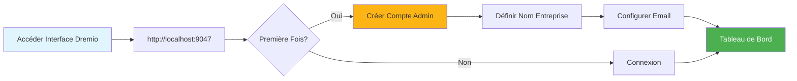
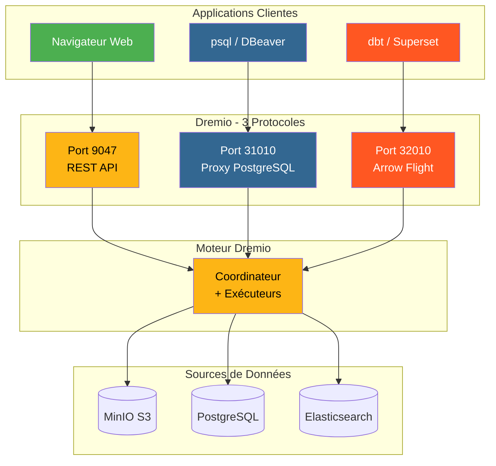
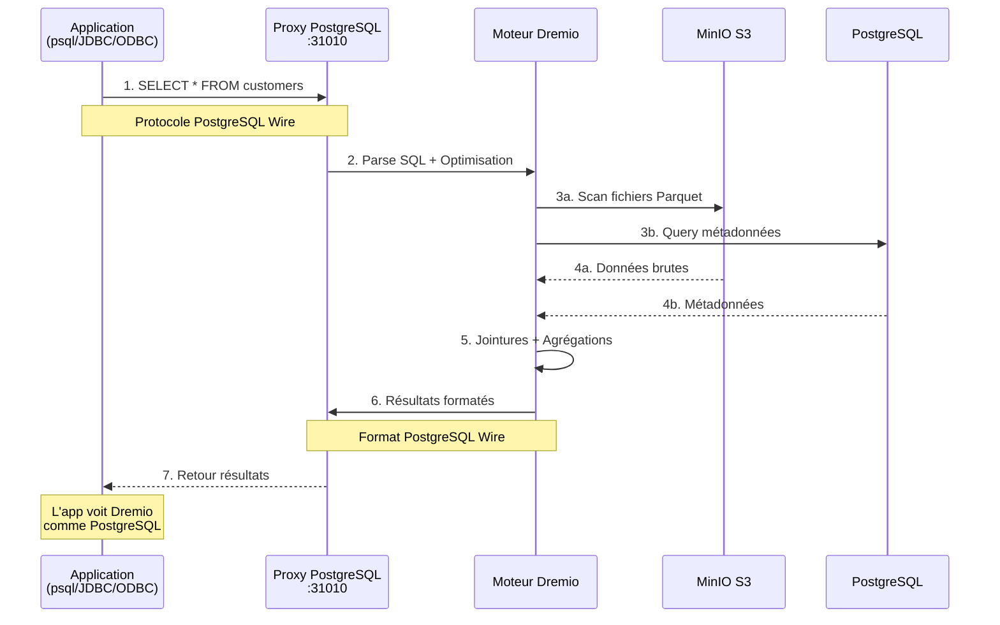
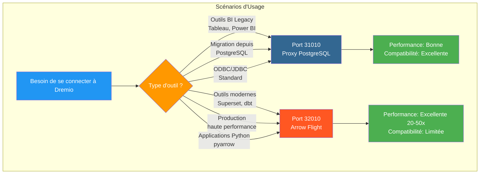
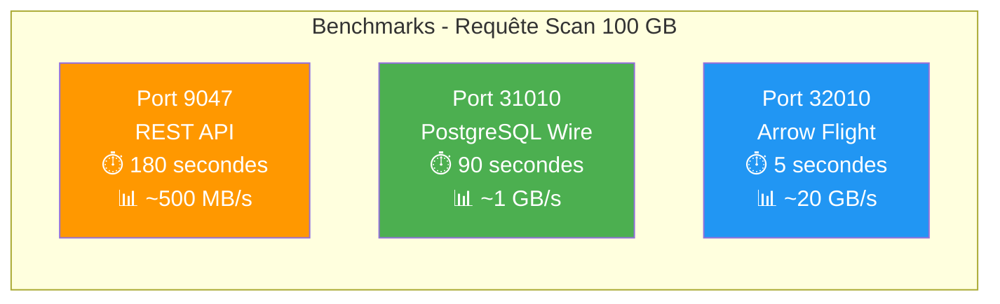
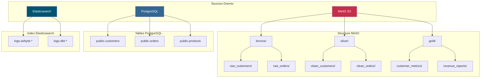
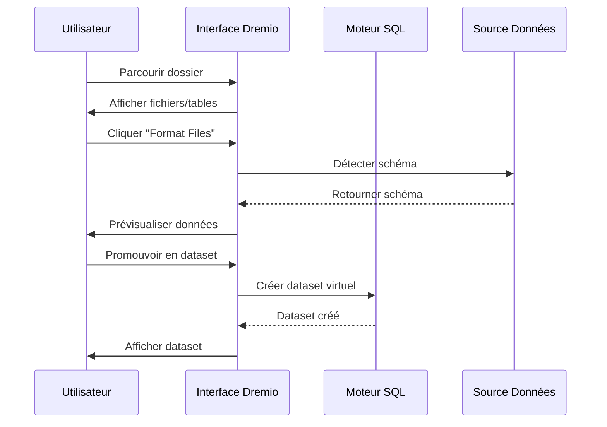
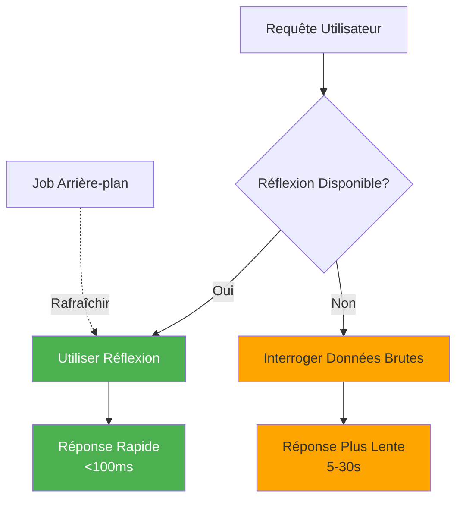

# Dremio-Konfigurationshandbuch

**Version**: 3.2.0  
**Letzte Aktualisierung**: 16. Oktober 2025  
**Sprache**: Französisch

## Inhaltsverzeichnis

1. [Übersicht](#Übersicht)
2. [Anfangskonfiguration](#initial-configuration)
3. [Datenquellenkonfiguration](#data-source-configuration)
4. [Virtuelle Datensätze](#virtual-datasets)
5. [Gedanken (Beschleunigungsabfragen)](#thoughts-acceleration-queries)
6. [Sicherheit und Zugangskontrolle](#security-and-access-control)
7. [Leistungsoptimierung](#performance-optimization)
8. [Integration mit dbt](#integration-with-dbt)
9. [Überwachung und Wartung](#monitoring-and-maintenance)
10. [Fehlerbehebung](#troubleshooting)

---

## Übersicht

Dremio ist die Data-Lakehouse-Plattform, die eine einheitliche Schnittstelle zum Abfragen von Daten aus mehreren Quellen bietet. Dieser Leitfaden deckt alles ab, von der Ersteinrichtung bis hin zu fortgeschrittenen Optimierungstechniken.

### Was ist Dremio?

Dremio kombiniert die Flexibilität eines Data Lake mit der Leistung eines Data Warehouse:

- **Datenvirtualisierung**: Daten abfragen, ohne sie zu verschieben oder zu kopieren
- **Abfragebeschleunigung**: Automatisches Caching mit Reflexionen
- **Self-Service Analytics**: Geschäftsanwender können die Daten direkt untersuchen
- **SQL-Standard**: Keine proprietäre Abfragesprache
- **Apache Arrow**: Hochleistungs-Spaltenformat

### Hauptmerkmale

| Funktion | Beschreibung | Gewinn |
|----------------|---------|---------|
| **Gedanken** | Intelligente Abfragebeschleunigung | 10-100x schnellere Abfragen |
| **Datenvirtualisierung** | Einheitliche Sicht auf Quellen | Keine Datenduplizierung |
| **Pfeilflug** | Hochgeschwindigkeits-Datenübertragung | 20-50x schneller als ODBC/JDBC |
| **Semantische Ebene** | Geschäftsorientierte Feldnamen | Self-Service-Analyse |
| **Git für Daten** | Datensatzversionskontrolle | Zusammenarbeit und Rollback |

---

## Erstkonfiguration

### Voraussetzungen

Bevor Sie beginnen, stellen Sie sicher, dass Sie Folgendes haben:
- Dremio-Container läuft (siehe [Installationsanleitung](../getting-started/installation.md))
- Zugriff auf Datenquellen (MinIO, PostgreSQL usw.)
- Administratoranmeldeinformationen

### Erste Verbindung



#### Schritt 1: Greifen Sie auf die Dremio-Schnittstelle zu

Öffnen Sie Ihren Browser und navigieren Sie zu:
```
http://localhost:9047
```

#### Schritt 2: Admin-Konto erstellen

Beim ersten Start werden Sie aufgefordert, ein Administratorkonto zu erstellen:

```
Nom d'utilisateur: admin
Prénom: Admin
Nom: Utilisateur
Email: admin@example.com
Mot de passe: [mot de passe sécurisé]
```

**Sicherheitshinweis**: Verwenden Sie ein sicheres Passwort mit mindestens 12 Zeichen, einschließlich Großbuchstaben, Kleinbuchstaben, Zahlen und Sonderzeichen.

#### Schritt 3: Ersteinrichtung

```json
{
  "companyName": "Votre Organisation",
  "supportEmail": "support@talentys.eu",
  "supportKey": "votre-clé-support-si-entreprise"
}
```

### Konfigurationsdateien

Die Dremio-Konfiguration wird über `dremio.conf` verwaltet:

```conf
# dremio.conf

paths: {
  local: "/opt/dremio/data"
  dist: "dremioS3:///dremio-data"
}

services: {
  coordinator.enabled: true
  coordinator.master.enabled: true
  
  executor.enabled: true
  
  # Paramètres mémoire
  coordinator.master.heap_memory_mb: 4096
  executor.heap_memory_mb: 8192
}

# Configuration réseau
services.coordinator.web.port: 9047
services.coordinator.client.port: 31010
services.coordinator.flight.port: 32010

# Ajustement performance
store.plugin.max_metadata_leaf_columns: 800
planner.enable_broadcast_join: true
planner.slice_target: 100000
```

### Umgebungsvariablen

```bash
# Section environment de docker-compose.yml
environment:
  - DREMIO_JAVA_SERVER_EXTRA_OPTS=-Xms2g -Xmx4g
  - DREMIO_JAVA_FLIGHT_EXTRA_OPTS=-Xms1g -Xmx2g
  - DREMIO_MAX_MEMORY_SIZE_MB=8192
  - DREMIO_HOME=/opt/dremio
```

### Verbindung über PostgreSQL-Proxy

Dremio stellt eine PostgreSQL-kompatible Schnittstelle auf Port 31010 zur Verfügung, sodass PostgreSQL-kompatible Tools ohne Änderungen eine Verbindung herstellen können.

#### Dremio Connections-Architektur



#### Abfragefluss über PostgreSQL-Proxy



#### Proxy-Konfiguration

Der PostgreSQL-Proxy ist in `dremio.conf` automatisch aktiviert:

```conf
# Configuration du proxy PostgreSQL (ODBC/JDBC)
services.coordinator.client.port: 31010
```

#### Verbindung mit psql

```bash
# Connexion directe avec psql
psql -h localhost -p 31010 -U admin -d datalake

# Exemple de requête
psql -h localhost -p 31010 -U admin -d datalake -c "SELECT * FROM MinIO.datalake.customers LIMIT 10;"
```

#### Verbindung mit DBeaver / pgAdmin

Verbindungsaufbau:

```yaml
Type: PostgreSQL
Host: localhost
Port: 31010
Database: datalake
Username: admin
Password: <votre-mot-de-passe>
SSL: Désactivé (en développement)
```

#### Verbindungskanäle

**JDBC:**
```java
String url = "jdbc:postgresql://localhost:31010/datalake";
Properties props = new Properties();
props.setProperty("user", "admin");
props.setProperty("password", "votre-mot-de-passe");
Connection conn = DriverManager.getConnection(url, props);
```

**ODBC (DSN):**
```ini
[Dremio via PostgreSQL]
Driver=PostgreSQL Unicode
Server=localhost
Port=31010
Database=datalake
Username=admin
Password=<votre-mot-de-passe>
SSLMode=disable
```

**Python (psycopg2):**
```python
import psycopg2

conn = psycopg2.connect(
    host="localhost",
    port=31010,
    database="datalake",
    user="admin",
    password="votre-mot-de-passe"
)

cursor = conn.cursor()
cursor.execute("SELECT * FROM MinIO.datalake.customers LIMIT 10")
rows = cursor.fetchall()
```

#### Wann sollte der PostgreSQL-Proxy verwendet werden?



| Szenario | Verwenden Sie den PostgreSQL-Proxy | Verwenden Sie Arrow Flight |
|---------|-------------|--------|
| **BI Legacy Tools** (unterstützt Arrow Flight nicht) | ✅ Ja | ❌ Nein |
| **Migration von PostgreSQL** (vorhandener JDBC/ODBC-Code) | ✅ Ja | ❌ Nein |
| **Hochleistungsproduktion** | ❌ Nein | ✅ Ja (20-50x schneller) |
| **Superset, DBT, moderne Tools** | ❌ Nein | ✅ Ja |
| **Schnelle Entwicklung/Test** | ✅ Ja (bekannt) | ⚠️ Beides OK |

#### Leistungsvergleich der 3 Ports



**Empfehlung**: Verwenden Sie PostgreSQL-Proxy (Port 31010) für **Kompatibilität** und Arrow Flight (Port 32010) für **Produktionsleistung**.

---

## Datenquellen konfigurieren

### Quelle MinIO S3 hinzufügen

MinIO ist Ihr primärer Data-Lake-Speicher.

#### Schritt 1: Navigieren Sie zu Quellen

```
Interface Dremio → Datasets → Add Source → Object Storage → Amazon S3
```

#### Schritt 2: S3-Verbindung konfigurieren

```json
{
  "name": "MinIO",
  "config": {
    "credentialType": "ACCESS_KEY",
    "accessKey": "minioadmin",
    "accessSecret": "minioadmin",
    "secure": false,
    "externalBucketList": [
      "datalake"
    ],
    "enableAsync": true,
    "compatibilityMode": true,
    "rootPath": "/",
    "defaultCtasFormat": "PARQUET",
    "propertyList": [
      {
        "name": "fs.s3a.path.style.access",
        "value": "true"
      },
      {
        "name": "fs.s3a.endpoint",
        "value": "minio:9000"
      },
      {
        "name": "dremio.s3.compat",
        "value": "true"
      }
    ]
  }
}
```

#### Schritt 3: Verbindung testen

```sql
-- Requête test pour vérifier connexion MinIO
SELECT * FROM MinIO.datalake.bronze.customers LIMIT 10;
```

**Erwartetes Ergebnis**:
```
customer_id | name           | email
------------|----------------|------------------
1           | John Doe       | john@example.com
2           | Jane Smith     | jane@example.com
...
```

### PostgreSQL-Quelle hinzufügen

#### Aufstellen

```
Interface Dremio → Datasets → Add Source → Relational → PostgreSQL
```

```json
{
  "name": "PostgreSQL",
  "config": {
    "hostname": "postgres",
    "port": "5432",
    "databaseName": "datawarehouse",
    "username": "postgres",
    "password": "postgres",
    "authenticationType": "MASTER",
    "fetchSize": 2000,
    "encryptionValidationMode": "CERTIFICATE_AND_HOSTNAME_VALIDATION"
  }
}
```

### Elasticsearch-Quelle hinzufügen

```json
{
  "name": "Elasticsearch",
  "config": {
    "hostList": [
      {"hostname": "elasticsearch", "port": 9200}
    ],
    "authenticationType": "ANONYMOUS",
    "scrollSize": 4000,
    "scrollTimeout": 60000,
    "scriptsEnabled": true,
    "showHiddenIndices": false,
    "showIdColumn": false
  }
}
```

### Organisation der Quellen



---

## Virtuelle Datensätze

Mit virtuellen Datensätzen können Sie transformierte und wiederverwendbare Ansichten Ihrer Daten erstellen.

### Erstellen Sie virtuelle Datensätze

#### Vom SQL-Editor

```sql
-- Créer dataset jointif
SELECT 
    c.customer_id,
    c.name,
    c.email,
    c.state,
    COUNT(o.order_id) as total_orders,
    SUM(o.amount) as lifetime_value
FROM MinIO.datalake.silver.customers c
LEFT JOIN MinIO.datalake.silver.orders o
    ON c.customer_id = o.customer_id
GROUP BY c.customer_id, c.name, c.email, c.state;

-- Sauvegarder comme dataset virtuel: "customer_summary"
```

**Standort speichern**:
```
@username → customer_summary
```

#### Von der Schnittstelle



**Schritte**:
1. Navigieren Sie zur MinIO-Quelle
2. Navigieren Sie zu `datalake/bronze/customers/`
3. Klicken Sie auf die Schaltfläche „Dateien formatieren“.
4. Untersuchen Sie das erkannte Muster
5. Klicken Sie auf „Speichern“, um zum Datensatz hochzustufen

### Organisation von Datensätzen

Erstellen Sie eine logische Struktur mit Leerzeichen und Ordnern:

```
Dremio
├── @admin (Espace Personnel)
│   └── dev (Dossier)
│       ├── test_customers
│       └── test_orders
├── Production (Espace Partagé)
│   ├── Dimensions (Dossier)
│   │   ├── dim_customers
│   │   ├── dim_products
│   │   └── dim_dates
│   └── Facts (Dossier)
│       ├── fct_orders
│       ├── fct_revenue
│       └── fct_customer_lifetime_value
└── Analytics (Espace Partagé)
    ├── customer_metrics
    ├── sales_dashboard_data
    └── marketing_attribution
```

### Semantische Ebene

Fügen Sie geschäftsorientierte Namen und Beschreibungen hinzu:

```sql
-- Noms colonnes techniques originaux
SELECT
    cust_id,
    cust_nm,
    cust_em,
    crt_dt
FROM raw.customers;

-- Créer dataset virtuel avec noms sémantiques
SELECT
    cust_id AS "ID Client",
    cust_nm AS "Nom Client",
    cust_em AS "Adresse Email",
    crt_dt AS "Date Inscription"
FROM raw.customers;
```

**Beschreibungen hinzufügen**:
```
Interface → Dataset → Colonne → Éditer Description

ID Client: Identifiant unique pour chaque client
Nom Client: Nom complet du client
Adresse Email: Email principal pour communication
Date Inscription: Date inscription client sur plateforme
```

---

## Reflexionen (Beschleunigungsabfragen)

Reflections sind der intelligente Caching-Mechanismus von Dremio, der die Abfrageleistung erheblich verbessert.

### Arten von Reflexionen

#### 1. Rohe Reflexionen

Speichern Sie eine Teilmenge der Spalten zum schnellen Abrufen:

```sql
-- Créer réflexion brute
CREATE REFLECTION raw_customer_base
ON Production.Dimensions.dim_customers
USING DISPLAY (
    customer_id,
    name,
    email,
    state,
    registration_date
);
```

**Anwendungsfall**:
- Dashboards, die bestimmte Spalten abfragen
- Berichte mit Spaltenteilmengen
- Sondierungsanfragen

#### 2. Aggregationsreflexionen

Berechnen Sie Aggregationen vorab für sofortige Ergebnisse:

```sql
-- Créer réflexion agrégation
CREATE REFLECTION agg_daily_revenue
ON Production.Facts.fct_orders
USING 
  DIMENSIONS (order_date, product_id, region)
  MEASURES (
    SUM(amount),
    COUNT(*),
    AVG(amount),
    MIN(amount),
    MAX(amount)
  );
```

**Anwendungsfall**:
- Executive-Dashboards
- Zusammenfassende Berichte
- Trendanalyse

### Konfigurationsreflexion



#### Erfrischungsrichtlinie

```
Interface → Dataset → Settings → Reflections → Refresh Policy
```

**Optionen**:
- **Nie aktualisieren**: Statische Daten (z. B. historische Archive)
- **Aktualisierung alle [1 Stunde]**: Regelmäßige Aktualisierungen
- **Aktualisieren, wenn sich der Datensatz ändert**: Echtzeitsynchronisierung

```json
{
  "refreshPolicy": {
    "method": "PERIOD",
    "refreshPeriod": 3600000,  // 1 heure en millisecondes
    "gracePeriod": 10800000    // 3 heures
  }
}
```

#### Ablaufrichtlinie

```json
{
  "expirationPolicy": {
    "method": "NEVER",
    // ou
    "method": "AFTER_PERIOD",
    "expirationPeriod": 604800000  // 7 jours
  }
}
```

### Gute Praktiken für Reflexionen

#### 1. Beginnen Sie mit Abfragen mit hohem Wert

Identifizieren Sie langsame Abfragen anhand des Verlaufs:

```sql
-- Interroger historique jobs pour trouver requêtes lentes
SELECT 
    query_text,
    execution_time_ms,
    dataset_path
FROM sys.jobs
WHERE execution_time_ms > 5000  -- Plus lent que 5 secondes
ORDER BY execution_time_ms DESC
LIMIT 100;
```

#### 2. Erstellen Sie gezielte Reflexionen

```sql
-- Mauvais: Réflexion avec trop de dimensions
CREATE REFLECTION too_broad
USING DIMENSIONS (col1, col2, col3, col4, col5, col6)
MEASURES (SUM(amount));

-- Bon: Réflexion ciblée pour cas d'usage spécifique
CREATE REFLECTION targeted
USING DIMENSIONS (order_date, product_category)
MEASURES (SUM(revenue), COUNT(DISTINCT customer_id));
```

#### 3. Überwachen Sie die Abdeckungsreflexion

```sql
-- Vérifier quelles requêtes sont accélérées
SELECT 
    query_text,
    acceleration_profile.accelerated,
    acceleration_profile.reflection_ids
FROM sys.jobs
WHERE start_time > CURRENT_DATE - INTERVAL '7' DAY;
```

### Gedanken zur Wirkungsleistung

| Datensatzgröße | Typabfrage | Ohne Reflexion | Mit Reflexion | Beschleunigung |
|----------------|-------------|----------------|----------------|-------------|
| 1 Mio. Leitungen | AUSWÄHLEN Einfach | 500ms | 50ms | 10x |
| 10 Mio. Leitungen | Aggregation | 15s | 200ms | 75x |
| 100 Mio. Leitungen | Komplexer JOIN | 2 Minuten | 1s | 120x |
| 1B-Leitungen | GRUPPE NACH | 10 Minuten | 5s | 120x |

---

## Sicherheit und Zugangskontrolle

### Benutzerverwaltung

#### Benutzer erstellen

```
Interface → Account Settings → Users → Add User
```

```json
{
  "username": "analyst_user",
  "firstName": "Data",
  "lastName": "Analyst",
  "email": "analyst@example.com",
  "password": "secure_password"
}
```

#### Benutzerrollen

| Rolle | Berechtigungen | Anwendungsfälle |
|------|-------------|-------------|
| **Administrator** | Voller Zugriff | Systemadministration |
| **Benutzer** | Persönliche Datensätze abfragen, erstellen | Analysten, Datenwissenschaftler |
| **Eingeschränkter Benutzer** | Nur Abfrage, keine Datensatzerstellung | Geschäftsnutzer, Zuschauer |

### Space-Berechtigungen

```
Interface → Space → Settings → Privileges
```

**Berechtigungstypen**:
- **Anzeigen**: Kann Datensätze anzeigen und abfragen
- **Ändern**: Kann Datensatzdefinitionen bearbeiten
- **Zuschüsse verwalten**: Kann Berechtigungen verwalten
- **Eigentümer**: Vollständige Kontrolle

**Beispiel**:
```
Espace: Production
├── Équipe Analytics → View, Modify
├── Data Engineers → Owner
└── Exécutifs → View
```

### Sicherheit auf Leitungsebene

Implementieren Sie eine Filterung auf Zeilenebene:

```sql
-- Créer vue avec filtre niveau ligne
CREATE VDS customer_data_filtered AS
SELECT *
FROM Production.Dimensions.dim_customers
WHERE 
  CASE 
    WHEN CURRENT_USER = 'admin' THEN TRUE
    WHEN region = (
      SELECT home_region 
      FROM users 
      WHERE username = CURRENT_USER
    ) THEN TRUE
    ELSE FALSE
  END;
```

### Spalte „Sicherheitsstufe“.

Vertrauliche Spalten ausblenden:

```sql
-- Masquer données sensibles pour utilisateurs non-admin
CREATE VDS customer_data_masked AS
SELECT
    customer_id,
    name,
    CASE 
      WHEN CURRENT_USER IN ('admin', 'data_engineer')
      THEN email
      ELSE CONCAT(SUBSTRING(email, 1, 3), '***@***.com')
    END AS email,
    state
FROM Production.Dimensions.dim_customers;
```

### OAuth-Integration

```conf
# dremio.conf
services.coordinator.web.auth.type: "oauth"
services.coordinator.web.auth.oauth.providerId: "okta"
services.coordinator.web.auth.oauth.clientId: "your-client-id"
services.coordinator.web.auth.oauth.clientSecret: "your-client-secret"
services.coordinator.web.auth.oauth.authorizeUrl: "https://your-domain.okta.com/oauth2/v1/authorize"
services.coordinator.web.auth.oauth.tokenUrl: "https://your-domain.okta.com/oauth2/v1/token"
```

---

## Leistungsoptimierung

### Techniken zur Abfrageoptimierung

#### 1. Partitionsbereinigung

```sql
-- Mauvais: Scanne toutes les données
SELECT * FROM orders
WHERE amount > 100;

-- Bon: Élague partitions
SELECT * FROM orders
WHERE order_date >= '2025-10-01'
  AND order_date < '2025-11-01'
  AND amount > 100;
```

#### 2. Spaltenbeschneidung

```sql
-- Mauvais: Lit toutes les colonnes
SELECT * FROM large_table LIMIT 100;

-- Bon: Lit uniquement colonnes nécessaires
SELECT customer_id, name, email 
FROM large_table 
LIMIT 100;
```

#### 3. Prädikat-Pushdown

```sql
-- Filtres poussés vers couche stockage
SELECT c.name, o.amount
FROM customers c
JOIN orders o ON c.customer_id = o.customer_id
WHERE o.order_date >= CURRENT_DATE - INTERVAL '30' DAY;
-- Filtre appliqué avant jointure
```

#### 4. Join-Optimierung

```sql
-- Utiliser broadcast join pour petites dimensions
SELECT /*+ BROADCAST(d) */
    f.order_id,
    d.product_name,
    f.amount
FROM facts.orders f
JOIN dimensions.products d
    ON f.product_id = d.product_id;
```

### Speicherkonfiguration

```conf
# dremio.conf

# Augmenter mémoire pour grandes requêtes
services.executor.heap_memory_mb: 32768

# Configurer spill to disk
spill.directory: "/opt/dremio/spill"
spill.enable: true

# Limites mémoire requête
planner.memory.max_query_memory_per_node: 10737418240  # 10GB
planner.memory.query_max_cost: 1000000000
```

### Clustergröße

| Lasttyp | Koordinator | Testamentsvollstrecker | Gesamtcluster |
|-------------|---------|------------|---------------|
| **Klein** | 4 CPU, 16 GB | 2x (8 CPU, 32 GB) | 20 CPU, 80 GB |
| **Mittel** | 8 CPU, 32 GB | 4x (16 CPU, 64 GB) | 72 CPU, 288 GB |
| **Groß** | 16 CPU, 64 GB | 8x (32 CPU, 128 GB) | 272 CPU, 1088 GB |

### Leistungsüberwachung

```sql
-- Analyser performance requête
SELECT 
    query_id,
    query_text,
    start_time,
    execution_time_ms / 1000.0 AS execution_time_seconds,
    planner_estimated_cost,
    rows_returned,
    acceleration_profile.accelerated
FROM sys.jobs
WHERE start_time > CURRENT_DATE - INTERVAL '1' DAY
ORDER BY execution_time_ms DESC
LIMIT 20;
```

---

## Integration mit dbt

### Dremio als Ziel dbt

Konfigurieren Sie `profiles.yml`:

```yaml
# profiles.yml
dremio_project:
  target: dev
  outputs:
    dev:
      type: dremio
      threads: 4
      host: localhost
      port: 9047
      username: admin
      password: "{{ env_var('DREMIO_PASSWORD') }}"
      use_ssl: false
      space: "@admin"
      
    prod:
      type: dremio
      threads: 8
      host: dremio.example.com
      port: 443
      username: dbt_service_account
      password: "{{ env_var('DREMIO_PASSWORD') }}"
      use_ssl: true
      space: "Production"
```

### dbt-Modelle auf Dremio

```sql
-- models/staging/stg_customers.sql
{{
    config(
        materialized='view',
        alias='stg_customers'
    )
}}

SELECT
    customer_id,
    TRIM(UPPER(name)) AS customer_name,
    LOWER(email) AS email,
    state,
    created_at
FROM {{ source('minio', 'raw_customers') }}
WHERE customer_id IS NOT NULL
```

### Reflections in dbt ausnutzen

```sql
-- models/marts/fct_customer_metrics.sql
{{
    config(
        materialized='table',
        post_hook=[
            "ALTER VDS {{ this }} ENABLE RAW REFLECTION",
            "ALTER VDS {{ this }} ENABLE AGGREGATION REFLECTION 
             USING DIMENSIONS (customer_id, registration_month) 
             MEASURES (SUM(lifetime_value), COUNT(*))"
        ]
    )
}}

SELECT
    customer_id,
    DATE_TRUNC('month', registration_date) AS registration_month,
    COUNT(DISTINCT order_id) AS total_orders,
    SUM(order_amount) AS lifetime_value
FROM {{ ref('int_customer_orders') }}
GROUP BY customer_id, DATE_TRUNC('month', registration_date)
```

---

## Überwachung und Wartung

### Zu überwachende Schlüsselmetriken

```yaml
metrics:
  - name: Performance Requête
    query: "SELECT AVG(execution_time_ms) FROM sys.jobs WHERE start_time > NOW() - INTERVAL '1' HOUR"
    threshold: 5000  # Alerte si moyenne > 5 secondes
    
  - name: Couverture Réflexion
    query: "SELECT COUNT(*) FILTER (WHERE accelerated = true) * 100.0 / COUNT(*) FROM sys.jobs WHERE start_time > NOW() - INTERVAL '1' DAY"
    threshold: 80  # Alerte si couverture < 80%
    
  - name: Requêtes Échouées
    query: "SELECT COUNT(*) FROM sys.jobs WHERE query_state = 'FAILED' AND start_time > NOW() - INTERVAL '1' HOUR"
    threshold: 10  # Alerte si > 10 échecs par heure
```

### Wartungsaufgaben

#### 1. Gedanken auffrischen

```sql
-- Rafraîchir manuellement réflexion
ALTER REFLECTION reflection_id REFRESH;

-- Reconstruire toutes réflexions pour dataset
ALTER VDS Production.Facts.fct_orders 
REFRESH ALL REFLECTIONS;
```

#### 2. Alte Daten bereinigen

```sql
-- Nettoyer historique requêtes
DELETE FROM sys.jobs
WHERE start_time < CURRENT_DATE - INTERVAL '90' DAY;

-- Compacter métadonnées (Enterprise uniquement)
VACUUM CATALOG;
```

#### 3. Statistiken aktualisieren

```sql
-- Rafraîchir statistiques table
ANALYZE TABLE MinIO.datalake.silver.customers;

-- Mettre à jour métadonnées dataset
REFRESH DATASET MinIO.datalake.silver.customers;
```

---

## Fehlerbehebung

### Häufige Probleme

#### Problem 1: Langsame Abfrageleistung

**Symptome**: Abfragen dauern Minuten statt Sekunden

**Diagnose**:
```sql
-- Vérifier profil requête
SELECT * FROM sys.jobs WHERE job_id = 'your-job-id';

-- Vérifier si réflexion utilisée
SELECT acceleration_profile FROM sys.jobs WHERE job_id = 'your-job-id';
```

**Lösungen**:
1. Erstellen Sie geeignete Gedanken
2. Fügen Sie Partitionsbereinigungsfilter hinzu
3. Erhöhen Sie den Executor-Speicher
4. Aktivieren Sie Warteschlangen

#### Problem 2: Reflexion baut sich nicht auf

**Symptome**: Reflection bleibt im Status „ERFRISCHEND“ hängen

**Diagnose**:
```sql
-- Vérifier statut réflexion
SELECT * FROM sys.reflections WHERE status != 'ACTIVE';

-- Vérifier erreurs réflexion
SELECT * FROM sys.reflection_dependencies;
```

**Lösungen**:
1. Überprüfen Sie die Quelldaten auf Schemaänderungen
2. Prüfen Sie, ob ausreichend Speicherplatz vorhanden ist
3. Erhöhen Sie die Timeout-Konstruktionsreflexion
4. Deaktivieren Sie die Reflexion und aktivieren Sie sie erneut

#### Problem 3: Verbindungs-Timeout

**Symptome**: „Verbindungszeitüberschreitung“-Fehler beim Abfragen von Quellen

**Lösungen**:
```conf
# dremio.conf
store.plugin.keep_alive_ms: 30000
store.plugin.timeout_ms: 120000
```

#### Problem 4: Mangel an Speicher

**Symptome**: „OutOfMemoryError“ in Protokollen

**Lösungen**:
```conf
# Augmenter taille heap
services.executor.heap_memory_mb: 65536

# Activer spill to disk
spill.enable: true
spill.directory: "/opt/dremio/spill"
```

### Diagnoseabfragen

```sql
-- Requêtes actives
SELECT query_id, query_text, start_time, user_name
FROM sys.jobs
WHERE query_state = 'RUNNING';

-- Utilisation ressources par utilisateur
SELECT 
    user_name,
    COUNT(*) as query_count,
    AVG(execution_time_ms) as avg_execution_ms,
    SUM(rows_returned) as total_rows
FROM sys.jobs
WHERE start_time > CURRENT_DATE
GROUP BY user_name;

-- Modèles accès dataset
SELECT 
    dataset_path,
    COUNT(*) as access_count,
    COUNT(DISTINCT user_name) as unique_users
FROM sys.jobs
WHERE start_time > CURRENT_DATE - INTERVAL '7' DAY
GROUP BY dataset_path
ORDER BY access_count DESC
LIMIT 20;
```

---

## Zusammenfassung

Dieser umfassende Leitfaden behandelt:

- **Erstkonfiguration**: Erstkonfiguration, Erstellung eines Administratorkontos, Konfigurationsdateien
- **Datenquellen**: MinIO-Verbindung, PostgreSQL und Elasticsearch
- **Virtuelle Datensätze**: Erstellung wiederverwendbarer transformierter Ansichten mit semantischer Ebene
- **Reflexionen**: Rohreflexionen und Aggregation für eine 10- bis 100-fache Abfragebeschleunigung
- **Sicherheit**: Benutzerverwaltung, Speicherplatzberechtigungen, Sicherheit auf Zeilen-/Spaltenebene
- **Leistung**: Abfrageoptimierung, Speicherkonfiguration, Clustergröße
- **DBT-Integration**: Verwenden Sie Dremio als DBT-Ziel mit Reflexionsmanagement
- **Überwachung**: Schlüsselmetriken, Wartungsaufgaben, Diagnoseanfragen
- **Fehlerbehebung**: Häufige Probleme und Lösungen

Wichtige Punkte, die Sie beachten sollten:
- Dremio bietet eine einheitliche SQL-Schnittstelle für alle Datenquellen
- Wesentliche Gedanken zur Produktionsleistung
- Die richtige Sicherheitskonfiguration ermöglicht Self-Service-Analysen
- Regelmäßige Überwachung gewährleistet optimale Leistung

**Zugehörige Dokumentation:**
- [Architekturkomponenten](../architecture/components.md)
- [Datenfluss](../architecture/data-flow.md)
- [dbt-Entwicklungshandbuch](./dbt-development.md)
- [Airbyte-Integration](./airbyte-integration.md)

---

**Version**: 3.2.0  
**Letzte Aktualisierung**: 16. Oktober 2025