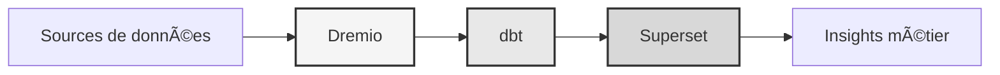

# Data platform

<p align="center">
  <a href="https://talentys.eu" target="_blank">
    
  </a>
  <br/>
  <em>Supported by <a href="https://talentys.eu">Talentys</a> | <a href="https://www.linkedin.com/company/talentysdata">LinkedIn</a> - Data Engineering & Analytics Excellence</em>
</p>


**Enterprise data lakehouse solution**

**Language**: French (FR)  
**Version**: 3.3.1  
**Last updated**: October 19, 2025

---

## Overview

Professional data platform combining Dremio, dbt and Apache Superset for enterprise-grade data transformation, quality assurance and business intelligence.

This platform provides a complete solution for modern data engineering, including automated data pipelines, quality testing and interactive dashboards.



---

## Key Features

- Data lakehouse architecture with Dremio
- Automated transformations with dbt
- Business intelligence with Apache Superset
- Comprehensive data quality testing
- Real-time synchronization via Arrow Flight

---

## Quick Start Guide

### Prerequisites

- Docker 20.10 or higher
- Docker Compose 2.0 or higher
- Python 3.11 or higher
- Minimum 8 GB of RAM

### Facility

```bash
# Installer les dépendances
pip install -r requirements.txt

# Démarrer les services
make up

# Vérifier l'installation
make status

# Exécuter les tests de qualité
make dbt-test
```

---

## Architecture

### System components

| Component | Port | Description |
|---------------|------|-------------|
| Dremio | 9047, 31010, 32010 | Data lakehouse platform |
| dbt | - | Data Transformation Tool |
| Superset | 8088 | Business Intelligence Platform |
| PostgreSQL | 5432 | Transactional database |
| MinIO | 9000, 9001 | Object storage (S3 compatible) |
| Elasticsearch | 9200 | Search and analysis engine |

See the [architecture documentation](architecture/) for detailed system design.

---

## Documentation

### Startup
- [Installation Guide](getting-started/)
- [Configuration](getting-started/)
- [Getting started](getting-started/)

### User guides
- [Data engineering](guides/)
- [Creation of dashboards](guides/)
- [API integration](guides/)

### API Documentation
- [REST API reference](api/)
- [Authentication](api/)
- [Code examples](api/)

### Architecture documentation
- [System design](architecture/)
- [Data flow](architecture/)
- [Deployment guide](architecture/)
- [🎯 Dremio Ports Visual Guide](architecture/dremio-ports-visual.md) ⭐ NEW

---

## Available languages

| Language | Code | Documentation |
|--------|------|---------------|
| English | EN | [README.md](../../../README.md) |
| French | EN | [docs/i18n/fr/](../fr/README.md) |
| Spanish | ES | [docs/i18n/es/](../es/README.md) |
| Portuguese | PT | [docs/i18n/pt/](../pt/README.md) |
| العربية | AR | [docs/i18n/ar/](../ar/README.md) |
| 中文 | CN | [docs/i18n/cn/](../cn/README.md) |
| 日本語 | JP | [docs/i18n/jp/](../jp/README.md) |
| Русский | UK | [docs/i18n/ru/](../ru/README.md) |

---

## Support

For technical assistance:
- Documentation: [README main](../../../README.md)
- Issue Tracker: GitHub Issues
- Community forum: GitHub Discussions
- Email: support@talentys.eu

---

**[Return to main documentation](../../../README.md)**
