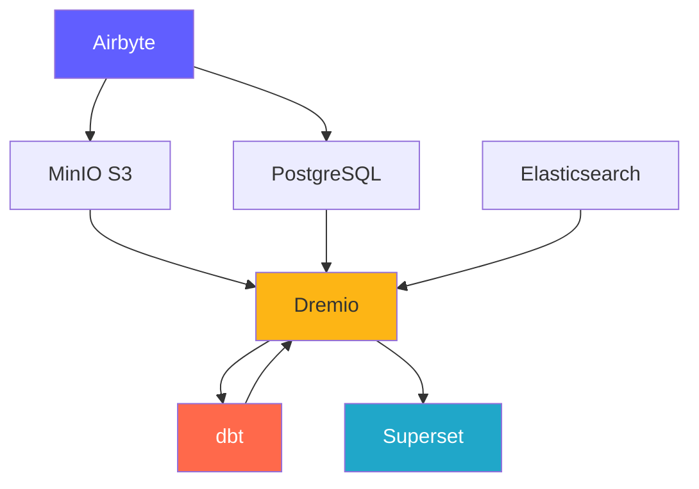
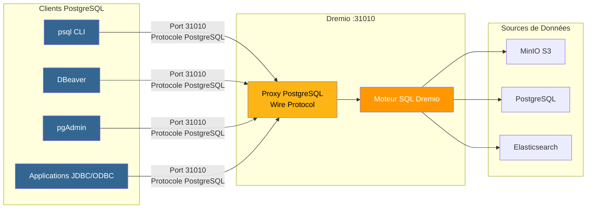
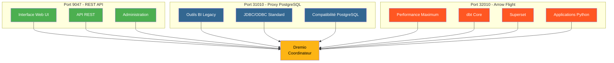
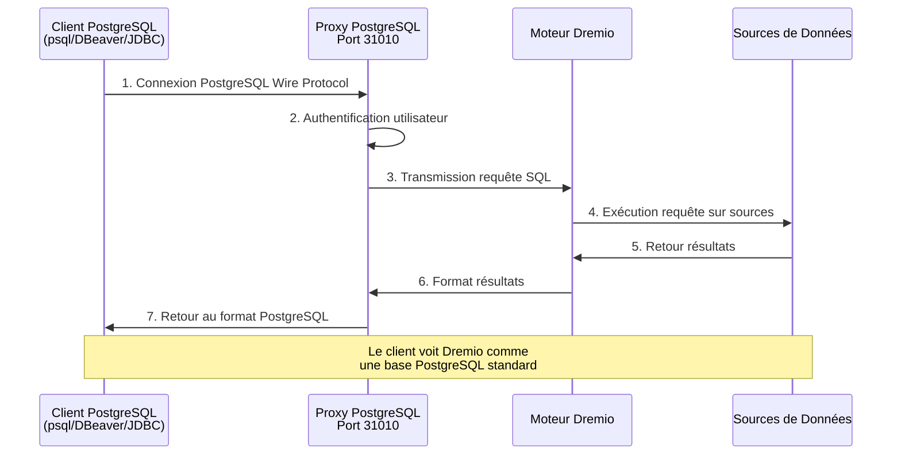
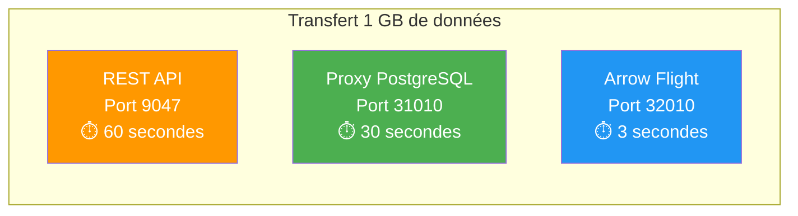

# Platform Components

**Version**: 3.2.0  
**Last updated**: 2025-10-16  
**Language**: French

---

## Components Overview

The Data Platform consists of 7 main components working together to provide a complete solution.



---

## 1. Airbyte – Data Integration Platform

### Overview

Airbyte is an open source data integration engine that consolidates data from multiple sources to destinations.

**Version**: 0.50.33  
**License**: MIT  
**Website**: https://airbyte.com

### Key Features

- **300+ Pre-built Connectors**: Databases, APIs, files, SaaS applications
- **Change Data Capture (CDC)**: Real-time data replication
- **Custom Connectors**: Build with Python or low-code CDK
- **Normalization**: Transform JSON into relational tables
- **Incremental Synchronization**: Synchronize only new/modified data
- **Monitoring**: Integrated tracking status synchronization

### Architecture

```yaml
Composants:
  airbyte-webapp:
    Port: 8000
    Objectif: Interface utilisateur web
    
  airbyte-server:
    Port: 8001
    Objectif: Serveur API REST
    
  airbyte-worker:
    Objectif: Exécuter tâches synchronisation
    Scalabilité: Horizontale
    
  airbyte-temporal:
    Port: 7233
    Objectif: Orchestration workflows
    
  airbyte-db:
    Port: 5432
    Objectif: Stockage métadonnées (PostgreSQL)
```

### Use Case

- **ELT Pipelines**: Extract-Load-Transform Workflows
- **Database Replication**: Keep databases synchronized
- **API integration**: Extract data from REST APIs
- **Data Lake ingestion**: Load data into S3/MinIO
- **Cloud Migration**: Move data on-premises to cloud

### Setup

```yaml
# Variables d'Environnement
AIRBYTE_VERSION: "0.50.33"
AIRBYTE_HTTP_PORT: 8000
AIRBYTE_API_PORT: 8001
AIRBYTE_WORKSPACE_ROOT: /tmp/airbyte_local

# Limites Ressources
CPU_LIMIT: "2.0"
MEMORY_LIMIT: "2Gi"
```

### Integration Points

- **Outputs to**: MinIO S3, PostgreSQL, Dremio
- **Orchestration**: Can be triggered by Airflow, Prefect
- **Monitoring**: Prometheus metrics endpoint

---

## 2. Dremio – Data Lakehouse Platform

### Overview

Dremio provides a unified SQL interface for all data sources with query acceleration.

**Version**: 26.0 OSS  
**License**: Apache 2.0  
**Website**: https://www.dremio.com

### Key Features

- **Data Lakehouse**: Combine lake flexibility with warehouse performance
- **Thoughts**: Automatic query acceleration (up to 100x faster)
- **Arrow Flight**: High performance data transfer
- **Data Virtualization**: Query without moving data
- **Semantic Layer**: Business-friendly data definitions
- **Time Travel**: Query given historical versions

### Architecture

```yaml
Composants:
  Coordinateur:
    Port: 9047 (HTTP), 31010 (ODBC), 32010 (Arrow Flight)
    Objectif: Planification requêtes, gestion métadonnées
    Mémoire: 8Go heap + 8Go direct
    
  Exécuteur:
    Objectif: Exécution requêtes
    Mémoire: 4Go heap + 8Go direct
    Scalabilité: Horizontale (ajouter plus d'exécuteurs)
    
  Stockage:
    Type: Distribué (MinIO, S3, HDFS)
    Format: Parquet, Iceberg
```

### Use Case

- **Self-Service Analytics**: Allow business users to explore data
- **Data Mesh**: Federated access to data
- **Query Acceleration**: Accelerate dashboard queries
- **Data Catalog**: Discover and manage data
- **BI Activation**: Power Tableau, Power BI, Superset

### Setup

```conf
# dremio.conf
paths.local: "/opt/dremio/data"
services.coordinator.enabled: true
services.executor.enabled: true

services.coordinator.web.port: 9047
services.flight.endpoint.port: 32010

services.executor.cache.pct.max: 70
```

### Integration Points

- **Reads from**: MinIO S3, PostgreSQL, Elasticsearch
- **Transform with**: dbt
- **Used for**: Superset, Tableau, Power BI

### PostgreSQL Proxy for Dremio

Dremio can emulate a PostgreSQL server, allowing PostgreSQL-compatible tools to connect to Dremio as if it were a standard PostgreSQL database.

#### PostgreSQL Proxy Architecture



#### Comparison of the 3 Dremio Ports



#### Proxy Configuration

```yaml
Proxy PostgreSQL:
  Port: 31010 (ODBC/JDBC)
  Protocole: PostgreSQL Wire Protocol
  Compatibilité: Outils compatibles PostgreSQL (psql, pgAdmin, DBeaver)
  
Avantages:
  - Aucune modification du code client
  - Support des pilotes PostgreSQL existants
  - Connexion via JDBC/ODBC standard
  - Compatible avec la plupart des outils BI
```

#### Proxy Use Cases

1. **BI Legacy Tools**: Connect tools that do not support Arrow Flight
2. **Easy Migration**: Replace PostgreSQL with Dremio without changing the code
3. **ODBC/JDBC compatibility**: Use standard PostgreSQL drivers
4. **Development**: Test with familiar PostgreSQL tools (psql, pgAdmin)

#### Connection Example

```bash
# Via psql
psql -h localhost -p 31010 -U admin -d datalake

# Via DBeaver / pgAdmin
Host: localhost
Port: 31010
Database: datalake
Username: admin
Password: <votre-mot-de-passe>

# Chaîne JDBC
jdbc:postgresql://localhost:31010/datalake

# Chaîne ODBC
Driver=PostgreSQL Unicode;
Server=localhost;
Port=31010;
Database=datalake;
Uid=admin;
Pwd=<votre-mot-de-passe>;
```

#### Limitations

- **Performance**: Arrow Flight (port 32010) is 20-50x faster
- **Features**: Some advanced PostgreSQL functions not supported
- **Recommendation**: Use Arrow Flight for production, PostgreSQL proxy for compatibility

#### Connection Flow via PostgreSQL Proxy



#### Protocol Comparison

| Protocol | Port | Performance | Latency | Use Cases |
|---------------|------|-------------|---------|--------|
| **REST API** | 9047 | Standard | ~50-100ms | Web UI, administration |
| **ODBC/JDBC (PostgreSQL Proxy)** | 31010 | Good | ~20-50ms | Legacy BI tools, compatibility |
| **Arrow Flight** | 32010 | Excellent (20-50x) | ~5-10ms | Production, Superset, dbt |

#### Comparative Performance



---

## 3. dbt - Data Transformation Tool

### Overview

dbt (data build tool) allows analytical engineers to transform data using SQL.

**Version**: 1.10+  
**License**: Apache 2.0  
**Website**: https://www.getdbt.com

### Key Features

- **SQL Based**: Write transformations in SQL
- **Version Control**: Git integration for collaboration
- **Tests**: Integrated data quality tests
- **Documentation**: Auto-generate data dictionaries
- **Modularity**: Reusable macros and packages
- **Incremental Models**: Process only new data

### Architecture

```yaml
Composants:
  dbt Core:
    Objectif: Outil CLI pour exécuter transformations
    Langage: Python
    
  Modèles:
    Objectif: Instructions SQL SELECT
    Types: Vues, Tables, Incrémental, Snapshots
    
  Tests:
    Objectif: Validation qualité données
    Types: Unique, Not Null, Relations, Personnalisés
    
  Macros:
    Objectif: Fonctions SQL réutilisables
    Langage: Jinja2
```

### Use Case

- **Data Modeling**: Build star/flake diagrams
- **Data Quality**: Validate data integrity
- **Slowly Changing Dimensions**: Track historical changes
- **Data Aggregation**: Create summary tables
- **Data Documentation**: Generate data catalogs

### Setup

```yaml
# dbt_project.yml
name: 'dremio_dbt'
version: '1.0.0'
profile: 'dremio'

models:
  dremio_dbt:
    staging:
      +materialized: view
      +schema: staging
    marts:
      +materialized: table
      +schema: marts
```

### Integration Points

- **Reading from**: Dremio Datasets
- **Written to**: Dremio (via Arrow Flight)
- **Orchestrated by**: Airflow, cron, Airbyte post-sync

---

## 4. Apache Superset – Business Intelligence Platform

### Overview

Superset is a modern data exploration and visualization platform.

**Version**: 3.0  
**License**: Apache 2.0  
**Website**: https://superset.apache.org

### Key Features

- **SQL IDE**: Advanced SQL editor with autocompletion
- **Rich Visualizations**: 50+ chart types
- **Interactive Dashboards**: Drill-down, filters, cross-filtering
- **SQL Lab**: Ad-hoc query interface
- **Alerts**: Scheduled reports and alerts
- **Caching**: Cache query results for performance

### Architecture

```yaml
Composants:
  Serveur Web:
    Port: 8088
    Objectif: Servir interface web
    Framework: Flask
    
  Workers Celery:
    Objectif: Exécution requêtes asynchrone
    File: Redis/RabbitMQ
    
  Celery Beat:
    Objectif: Tâches planifiées (préchauffage cache, alertes)
    
  Base de Données:
    Objectif: Stocker tableaux de bord, utilisateurs, logs requêtes
    Type: PostgreSQL
```

### Use Case

- **Executive Dashboards**: KPI monitoring
- **Operational Analytics**: Real-time monitoring
- **BI Self-Service**: Empower analysts
- **Embedded Analytics**: iframe integration in applications
- **Data Exploration**: Ad-hoc analysis

### Setup

```python
# superset_config.py
SQLALCHEMY_DATABASE_URI = 'postgresql://...'
SECRET_KEY = '...'

FEATURE_FLAGS = {
    'DASHBOARD_NATIVE_FILTERS': True,
    'DASHBOARD_CROSS_FILTERS': True,
    'ENABLE_TEMPLATE_PROCESSING': True
}

CACHE_CONFIG = {
    'CACHE_TYPE': 'redis',
    'CACHE_DEFAULT_TIMEOUT': 300
}
```

### Integration Points

- **Requests**: Dremio (via Arrow Flight)
- **Authentication**: LDAP, OAuth2, Database
- **Alerts**: Email, Slack

---

## 5. PostgreSQL - Relational Database

### Overview

PostgreSQL is an advanced open source relational database management system.

**Version**: 16  
**License**: PostgreSQL License  
**Website**: https://www.postgresql.org

### Key Features

- **ACID Compliance**: Reliable transactions
- **JSON support**: Native JSON/JSONB types
- **Full Text Search**: Integrated search capabilities
- **Extensions**: PostGIS, pg_stat_statements, TimescaleDB
- **Replication**: Streaming replication, logical replication
- **Partitioning**: Native table partitioning

### Architecture

```yaml
Composants:
  Serveur PostgreSQL:
    Port: 5432
    Protocole: Protocole wire PostgreSQL
    
  Bases de Données:
    - dremio_db: Métadonnées Dremio
    - superset_db: Configuration Superset
    - airbyte_db: Métadonnées Airbyte
    
  Connexions:
    Max: 200
    Pooling: PgBouncer (optionnel)
```

### Use Case

- **Metadata Storage**: Store system metadata
- **Transactional Loads**: OLTP Applications
- **Staging Tables**: Temporary data processing
- **Storage Configuration**: Application settings
- **Audit Logs**: Track system changes

### Setup

```conf
# postgresql.conf
max_connections = 200
shared_buffers = 256MB
effective_cache_size = 1GB
maintenance_work_mem = 64MB
work_mem = 4MB

# Performance
random_page_cost = 1.1
effective_io_concurrency = 200

# Journalisation
log_statement = 'mod'
log_duration = on
```

### Integration Points

- **Read by**: Dremio, Superset, Airbyte
- **Written by**: Airbyte, dbt, applications
- **Managed by**: Automated backups, replication

---

## 6. MinIO – S3 Compatible Object Storage

### Overview

MinIO is a high-performance, S3-compatible object storage system.

**Version**: Latest  
**License**: AGPLv3  
**Website**: https://min.io

### Key Features

- **S3 API**: 100% compatible with Amazon S3
- **High Performance**: Multi-GB/s throughput
- **Erasure Coding**: Sustainability and availability data
- **Versioning**: Object version control
- **Encryption**: Server side and client side
- **Multi-Cloud**: Deploy everywhere

### Architecture

```yaml
Composants:
  Serveur MinIO:
    Port: 9000 (API S3), 9001 (Console)
    Mode: Nœud unique ou distribué
    
  Stockage:
    Format: Erasure coded ou brut
    Redondance: Configurable (ex: 4+2)
    
  Buckets:
    - datalake: Stockage données principal
    - raw-data: Ingestion Airbyte
    - processed-data: Sorties dbt
    - backups: Sauvegardes système
```

### Use Case

- **Data Lake**: Store raw and processed data
- **Object Storage**: Files, images, videos
- **Storage Backup**: Database and system backups
- **Archive**: Long-term data retention
- **Data Staging**: Temporary processing storage

### Setup

```yaml
# Variables d'Environnement
MINIO_ROOT_USER: minioadmin
MINIO_ROOT_PASSWORD: minioadmin123
MINIO_VOLUMES: /data

# Politiques Buckets
- datalake: Lecture-écriture pour plateforme données
- raw-data: Écriture par Airbyte, lecture par Dremio
- processed-data: Écriture par dbt, lecture tous
```

### Integration Points

- **Written by**: Airbyte, dbt, applications
- **Read by**: Dremio, data scientists
- **Managed by**: mc (MinIO Client), s3cmd

---

## 7. Elasticsearch - Search and Analytics Engine

### Overview

Elasticsearch is a distributed search and analytics engine built on Apache Lucene.

**Version**: 8.15  
**License**: Elastic License 2.0  
**Website**: https://www.elastic.co

### Key Features

- **Full Text Search**: Advanced search capabilities
- **Real Time Indexing**: Near real-time data availability
- **Distributed**: Horizontal scalability
- **Aggregations**: Complex analytics
- **RESTful API**: Simple HTTP API
- **Machine Learning**: Anomaly detection

### Architecture

```yaml
Composants:
  Nœud Elasticsearch:
    Port: 9200 (HTTP), 9300 (Transport)
    Rôles: Master, Data, Ingest, ML
    
  Index:
    Objectif: Stocker documents recherchables
    Shards: Distribués entre nœuds
    Répliques: Pour haute disponibilité
    
  Cycle de Vie Index:
    Hot: Données récentes (SSD)
    Warm: Données anciennes (HDD)
    Cold: Archive (S3)
```

### Use Case

- **Analytical Logs**: Centralized logging (ELK stack)
- **Application Search**: Product catalogs, site search
- **Security Analytics**: SIEM use cases
- **Observability**: Metrics and traces
- **Text Analytics**: NLP and sentiment analysis

### Setup

```yaml
# elasticsearch.yml
cluster.name: "dremio-search-cluster"
node.name: "node-1"
network.host: 0.0.0.0
http.port: 9200

# Sécurité
xpack.security.enabled: true
xpack.security.transport.ssl.enabled: false

# Mémoire
bootstrap.memory_lock: true
```

### Integration Points

- **Indexed by**: Logstash, Filebeat
- **Requested by**: Dremio, Kibana
- **Monitored by**: Elasticsearch Monitoring

---

## Comparison of Components

| Component | Type | Main Use | Scalability | State |
|---------------|------|-----------------|-------------|------|
| **Airbyte** | Integration | Data ingestion | Horizontal (workers) | Stateless |
| **Dremio** | Query Engine | Data access | Horizontal (executors) | Stateless |
| **dbt** | Transformation | Data modeling | Vertical (hearts) | Stateless |
| **Superset** | BI platform | Visualization | Horizontal (web) | Stateless |
| **PostgreSQL** | Database | Metadata storage | Vertical (+ replication) | Stateful |
| **MinIO** | Object Storage | Data lake | Horizontal (distributed) | Stateful |
| **Elasticsearch** | Search Engine | Full text search | Horizontal (cluster) | Stateful |

---

## Resource Requirements

### Minimum Configuration (Development)

```yaml
Total: 8 Go RAM, 4 CPUs, 50 Go Disque

Allocation:
  Airbyte: 1 Go RAM, 0.5 CPU
  Dremio: 2 Go RAM, 1 CPU
  Superset: 1 Go RAM, 0.5 CPU
  PostgreSQL: 1 Go RAM, 0.5 CPU
  MinIO: 1 Go RAM, 0.5 CPU
  Elasticsearch: 2 Go RAM, 1 CPU
```

### Recommended Configuration (Production)

```yaml
Total: 64 Go RAM, 16 CPUs, 500 Go SSD

Allocation:
  Airbyte: 4 Go RAM, 2 CPUs
  Dremio: 16 Go RAM, 4 CPUs
  Superset: 8 Go RAM, 2 CPUs
  PostgreSQL: 8 Go RAM, 2 CPUs
  MinIO: 16 Go RAM, 2 CPUs
  Elasticsearch: 12 Go RAM, 4 CPUs
```

---

## Version Compatibility Matrix

| Component | Release | Compatible With |
|----------|---------|----------------------|
| Airbyte | 0.50+ | All destinations |
| Dremio | 26.0 | dbt 1.8+, Arrow Flight customers |
| dbt | 1.10+ | Dremio 23.0+ |
| Superset | 3.0+ | Dremio 22.0+, PostgreSQL 12+ |
| PostgreSQL | 16 | All components |
| MinIO | Latest | S3 compatible clients |
| Elasticsearch | 8.15 | Dremio 26.0+, Logstash 8.x |

---

**Component Guide Version**: 3.2.0  
**Last Updated**: 2025-10-16  
**Maintained By**: Data Platform Team