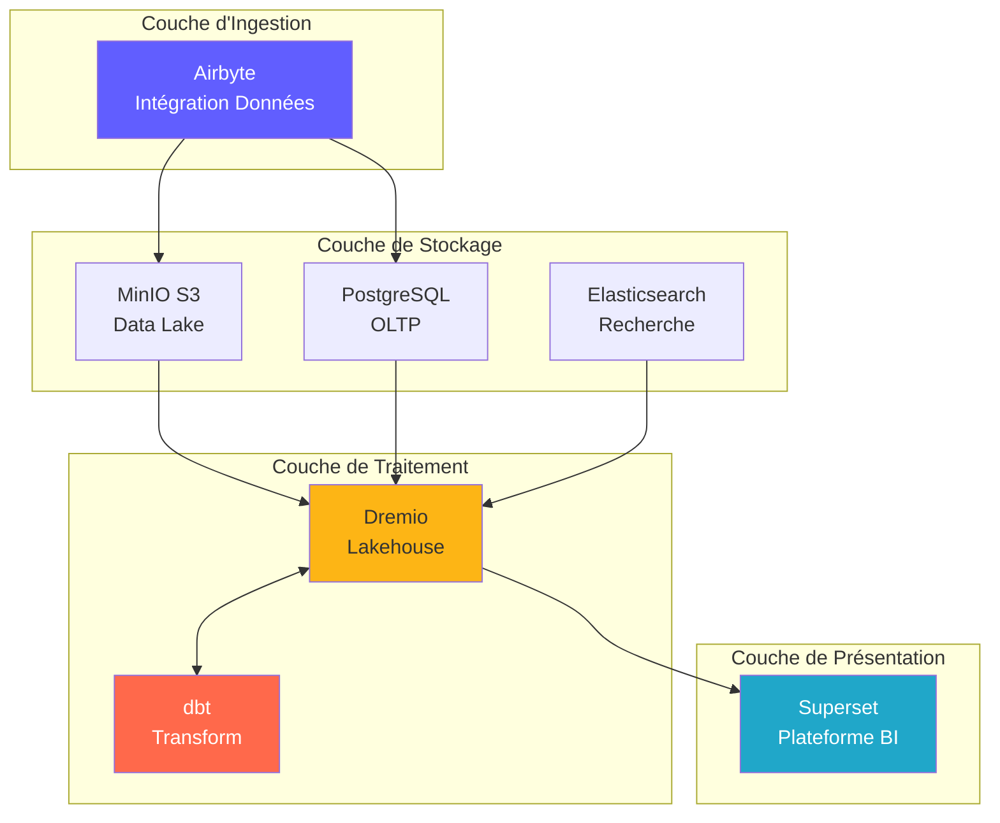
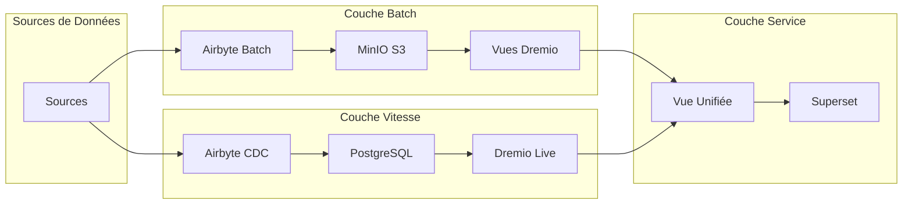
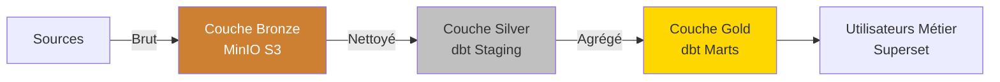
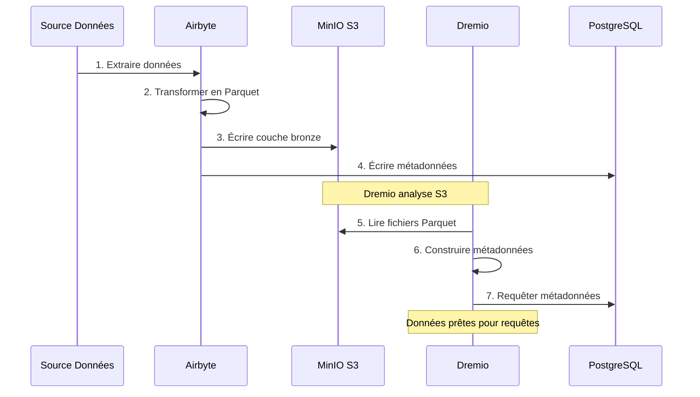
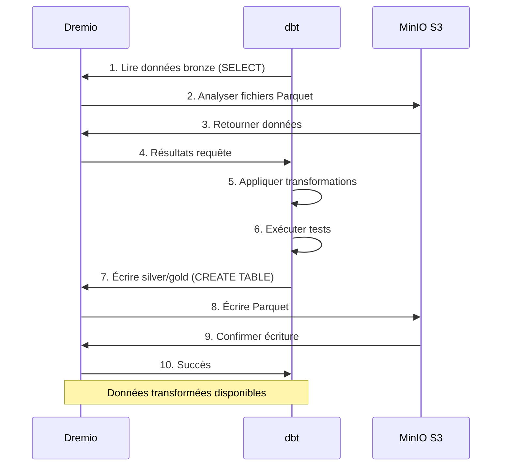
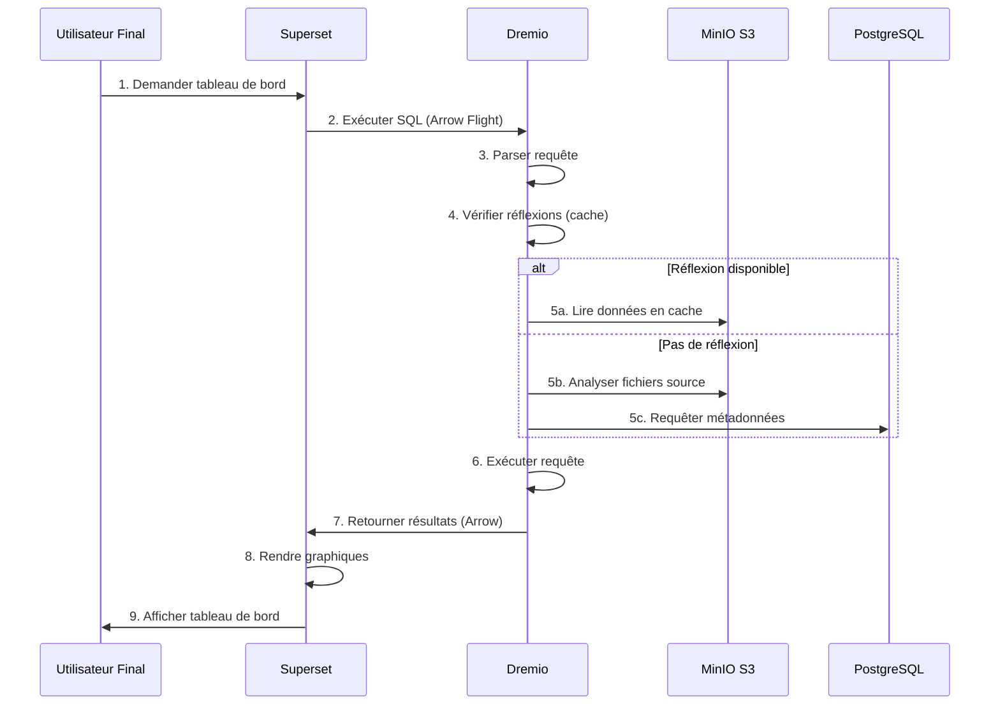
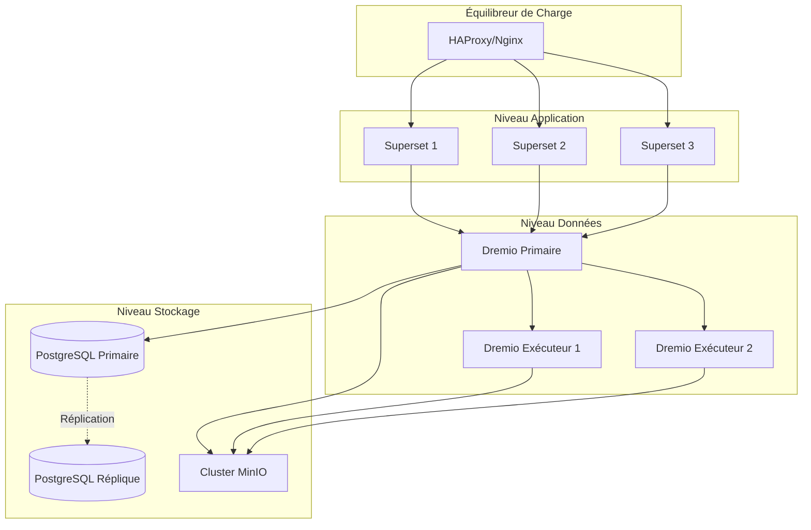
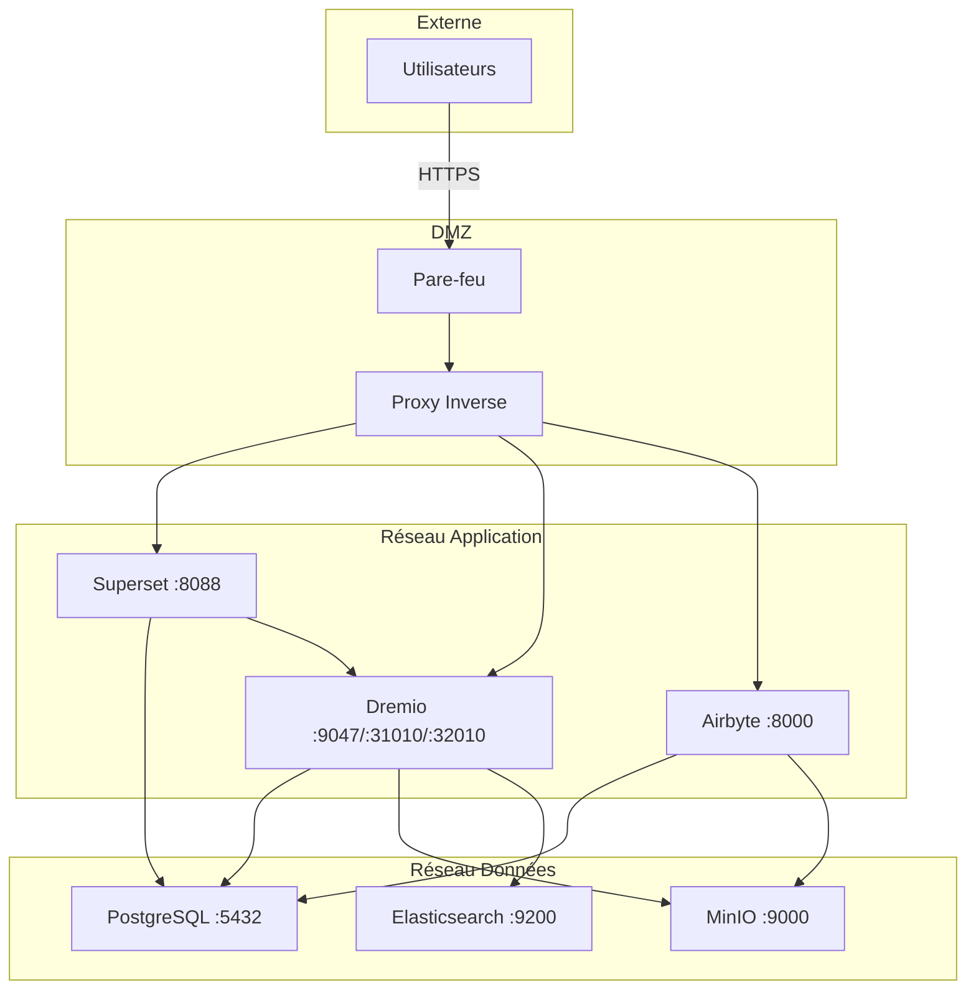
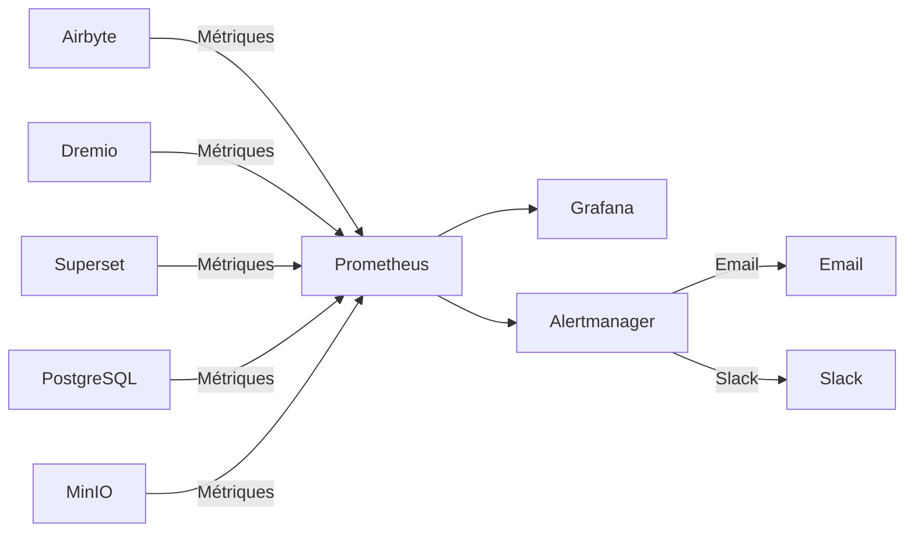

# Architecture Overview

**Version**: 3.2.0  
**Last updated**: 2025-10-16  
**Language**: French

---

## Introduction

The data platform is a modern cloud-native architecture built on open source technologies. It provides a comprehensive solution for data ingestion, storage, transformation and visualization, designed for enterprise-scale analytical workloads.



---

## Design Principles

### 1. Open Source First

**Philosophy**: Use open source technologies to avoid vendor lock-in and maintain flexibility.

**Benefits**:
- No licensing costs
- Community development
- Full customization capability
- Transparent security audit
- Wide ecosystem compatibility

### 2. Layered Architecture

**Philosophy**: Separate concerns into distinct layers for maintainability and scalability.

**Layers**:
```
┌─────────────────────────────────────┐
│     Couche de Présentation          │  Superset (BI & Tableaux de Bord)
├─────────────────────────────────────┤
│     Couche Sémantique               │  Dremio (Moteur de Requête)
├─────────────────────────────────────┤
│     Couche de Transformation        │  dbt (Transformation Données)
├─────────────────────────────────────┤
│     Couche de Stockage              │  MinIO, PostgreSQL, Elasticsearch
├─────────────────────────────────────┤
│     Couche d'Ingestion              │  Airbyte (Intégration Données)
└─────────────────────────────────────┘
```

### 3. ELT rather than ETL

**Philosophy**: Load raw data first, transform into destination (ELT).

**Why ELT?**
- **Flexibility**: Transform data in multiple ways without re-extraction
- **Performance**: Use destination calculation for transformations
- **Auditability**: Raw data always available for verification
- **Cost**: Reduce the extraction load on source systems

**Flow**:
```
Extract → Load → Transform
(Airbyte) (MinIO/PostgreSQL) (dbt + Dremio)
```

### 4. Data Lakehouse Model

**Philosophy**: Combine the flexibility of the data lake with the performance of the data warehouse.

**Features**:
- **ACID Transactions**: Trusted Data Operations
- **Schema application**: Data quality guarantees
- **Time travel**: Query historical versions
- **Open formats**: Parquet, Iceberg, Delta Lake
- **Direct file access**: No proprietary locking

### 5. Cloud-Native Design

**Philosophy**: Design for containerized and distributed environments.

**Implementation**:
- Docker containers for all services
- Horizontal scalability
- Infrastructure as code
- Stateless wherever possible
- Configuration via environment variables

---

## Architecture Models

### Lambda architecture (Batch + Stream)



**Batch Layer** (Historical Data):
- Large volumes of data
- Periodic treatment (hourly/daily)
- Acceptable high latency
- Complete reprocessing possible

**Speed ​​Layer** (Real Time Data):
- Change Data Capture (CDC)
- Low latency required
- Incremental updates only
- Manages recent data

**Service Layer**:
- Merges batch and speed views
- Single query interface (Dremio)
- Automatic view selection

### Architecture Medallion (Bronze → Silver → Gold)



**Bronze layer** (Raw):
- Data as is from sources
- No transformation
- Complete history preserved
- Airbyte loads here

**Silver layer** (Cleaned):
- Applied data quality
- Standardized formats
- dbt staging templates
- Analytics ready

**Gold Layer** (Profession):
- Aggregated metrics
- Applied business logic
- Marts dbt models
- Optimized for consumption

---

## Interactions between Components

### Data Ingestion Flow



### Transformation Pipeline



### Executing Queries



---

## Scalability Models

### Horizontal Scaling

**Stateless Services** (can evolve freely):
- Airbyte Workers: Evolve for parallel synchronizations
- Dremio Executors: Scale for query performance
- Web Superset: Evolve for competing users

**Stateful Services** (require coordination):
- PostgreSQL: Primary-replica replication
- MinIO: Distributed mode (multiple nodes)
- Elasticsearch: Cluster with sharding

### Vertical Scaling

**Intensive in Memory**:
- Dremio: Increase JVM heap for large queries
- PostgreSQL: More RAM for cache buffer
- Elasticsearch: More heap for indexing

**CPU intensive**:
- dbt: More cores for parallel construction models
- Airbyte: Faster data transformations

### Data Partitioning

```sql
-- Exemple: Partitionner par date
CREATE TABLE orders_partitioned (
    order_id INT,
    customer_id INT,
    amount DECIMAL,
    order_date DATE
)
PARTITION BY (DATE_TRUNC('month', order_date))
STORED AS PARQUET;

-- La requête analyse uniquement les partitions pertinentes
SELECT SUM(amount)
FROM orders_partitioned
WHERE order_date >= '2025-01-01'
  AND order_date < '2025-02-01';
-- Analyse uniquement la partition de janvier
```

---

## High Availability

### Redundancy of Services



### Failure Scenarios

| Component | Breakdown | Recovery |
|---------------|-------|---------|
| **Airbyte Worker** | Container crash | Auto restart, resume sync |
| **Dremio Executor** | Node failure | Request redirected to other executors |
| **PostgreSQL** | Primary out of service | Promote replica in primary |
| **MinIO Node** | Disk failure | Erasure coding reconstructs data |
| **Superset** | Service out of service | Balancer redirects traffic |

### Backup Strategy

```bash
# Sauvegardes automatisées quotidiennes
0 2 * * * /scripts/backup_all.sh

# backup_all.sh
#!/bin/bash

# Sauvegarder PostgreSQL
pg_dumpall -U postgres > /backups/postgres_$(date +%Y%m%d).sql

# Sauvegarder métadonnées Dremio
tar czf /backups/dremio_$(date +%Y%m%d).tar.gz /opt/dremio/data

# Synchroniser MinIO vers S3 distant
mc mirror MinIOLake/datalake s3-offsite/datalake-backup

# Conserver 30 jours
find /backups -mtime +30 -delete
```

---

## Security Architecture

### Network Security



### Authentication and Authorization

**Service Authentication**:
- **Dremio**: LDAP/AD, OAuth2, SAML integration
- **Superset**: Database Auth, LDAP, OAuth2
- **Airbyte**: Basic Auth, OAuth2 (enterprise)
- **MinIO**: IAM policies, STS tokens

**Authorization Levels**:
```yaml
Rôles:
  - Admin:
      - Accès complet à tous les services
      - Gestion utilisateurs
      - Modifications configuration
  
  - Data Engineer:
      - Créer/modifier sources données
      - Exécuter syncs Airbyte
      - Exécuter modèles dbt
      - Créer datasets Dremio
  
  - Analyst:
      - Accès lecture seule données
      - Créer tableaux de bord Superset
      - Requêter datasets Dremio
  
  - Viewer:
      - Voir tableaux de bord uniquement
      - Pas d'accès données
```

### Data Encryption

**At Rest**:
- MinIO: Server-side encryption (AES-256)
- PostgreSQL: Transparent Data Encryption (TDE)
- Elasticsearch: Encrypted indexes

**In transit**:
- TLS 1.3 for all inter-service communication
- Arrow Flight with TLS for Dremio ↔ Superset
- HTTPS for web interfaces

---

## Monitoring and Observability

### Metrics Collection



**Key Metrics**:
- **Airbyte**: Sync success rate, recordings synchronized, bytes transferred
- **Dremio**: Request latency, cache hit rate, resource usage
- **dbt**: Model construction time, test failures
- **Superset**: Dashboard loading time, active users
- **Infrastructure**: CPU, memory, disk, network

### Logging

**Centralized Logging**:
```yaml
Stack ELK:
  - Elasticsearch: Stocker logs
  - Logstash: Traiter logs
  - Kibana: Visualiser logs

Sources de Logs:
  - Logs application (format JSON)
  - Logs d'accès
  - Logs d'audit
  - Logs d'erreur
```

### Tracing

**Distributed Tracing**:
- Jaeger or Zipkin integration
- Trace requests between services
- Identify bottlenecks
- Debug performance issues

---

## Deployment Topologies

### Development Environment

```yaml
Hôte Unique:
  Ressources: 8 Go RAM, 4 CPUs
  Services: Tous sur une machine
  Stockage: Volumes locaux
  Réseau: Réseau bridge
  Cas d'usage: Développement, tests
```

### Staging Environment

```yaml
Multi-Hôtes:
  Ressources: 16 Go RAM, 8 CPUs par hôte
  Services: Répartis sur 2-3 hôtes
  Stockage: NFS partagé ou MinIO distribué
  Réseau: Réseau overlay
  Cas d'usage: Tests pré-production, UAT
```

### Production Environment

```yaml
Cluster Kubernetes:
  Ressources: Auto-scaling selon charge
  Services: Conteneurisés, répliqués
  Stockage: Volumes persistants (SSD)
  Réseau: Service mesh (Istio)
  Haute Disponibilité: Déploiement multi-zones
  Cas d'usage: Charges production
```

---

## Justification of Technological Choices

### Why Airbyte?

- **300+ connectors**: Pre-built integrations
- **Open source**: No supplier lock-in
- **Active community**: 12k+ GitHub stars
- **CDC support**: Real-time data capture
- **Standardization**: Built-in dbt integration

### Why Dremio?

- **Query acceleration**: Queries 10-100x faster
- **Arrow Flight**: High performance data transfer
- **Data lake compatibility**: No data movement
- **Self-service**: Business users explore data
- **Profitable**: Reduce warehouse costs

### Why dbt?

- **SQL Based**: Familiar to analysts
- **Version control**: Git integration
- **Tests**: Integrated data quality tests
- **Documentation**: Auto-generated Docs
- **Community**: 5k+ packages available

### Why Superset?

- **Modern UI**: Intuitive interface
- **SQL IDE**: Advanced query capabilities
- **Rich visualizations**: 50+ graphic types
- **Extensible**: Custom plugins
- **Open source**: Supported Apache Foundation

### Why PostgreSQL?

- **Reliability**: ACID compliance
- **Performance**: Proven at scale
- **Features**: JSON, full text search, extensions
- **Community**: Mature ecosystem
- **Cost**: Free and open source

### Why MinIO?

- **S3 compatibility**: industry standard API
- **Performance**: High flow rate
- **Erasure coding**: Data durability
- **Multi-cloud**: Deploy everywhere
- **Cost effective**: Self-hosted alternative

---

## Future Evolution of Architecture

### Planned Improvements

1. **Data Catalog** (OpenMetadata Integration)
   - Metadata management
   - Lineage tracking
   - Data discovery

2. **Data Quality** (Great Expectations)
   - Automated validation
   - Anomaly detection
   - Quality dashboards

3. **ML Operations** (MLflow)
   - Model training pipelines
   - Models register
   - Deployment automation

4. **Stream processing** (Apache Flink)
   - Real-time transformations
   - Complex event processing
   - Streaming analytics

5. **Data Governance** (Apache Atlas)
   - Policy application
   - Access audit
   - Compliance reports

---

## References

- [Component Details](components.md)
- [Data Flow](data-flow.md)
- [Deployment Guide](deployment.md)
- [Airbyte Integration](../guides/airbyte-integration.md)

---

**Architecture Overview Version**: 3.2.0  
**Last Updated**: 2025-10-16  
**Maintained By**: Data Platform Team