# Airbyte Integration Guide

**Version**: 3.2.0  
**Last Update**: October 16, 2025  
**Language**: French

---

## Overview

Airbyte is an open source data integration platform that simplifies moving data from various sources to destinations. This guide covers integrating Airbyte into the data platform, configuring connectors, and establishing data pipelines.


---

## What is Airbyte?

### Key Features

- **300+ Pre-built Connectors**: APIs, databases, files, SaaS applications
- **Open Source**: Self-hosted with full data control
- **Change Data Capture (CDC)**: Real-time data synchronization
- **Custom Connectors**: Build connectors with Python or low-code CDK
- **Data Normalization**: Transform raw JSON into structured tables
- **Monitoring & Alerts**: Track sync status and data quality

### Architecture


---

## Facility

### Quick Start

Airbyte is included in the platform. Start it with:

```bash
# Démarrer services Airbyte
docker-compose -f docker-compose-airbyte.yml up -d

# Vérifier statut
docker-compose -f docker-compose-airbyte.yml ps

# Voir logs
docker-compose -f docker-compose-airbyte.yml logs -f
```

### Services Started

| Services | Port | Description |
|--------|------|-------------|
| **airbyte-webapp** | 8000 | Web user interface |
| **airbyte-server** | 8001 | API Server |
| **airbyte-worker** | - | Job execution engine |
| **airbyte-temporal** | 7233 | Workflow orchestration |
| **airbyte-db** | 5432 | Metadata database (PostgreSQL) |

### First Access

**Web Interface:**
```
http://localhost:8000
```

**Default identifiers:**
- **Email**: `airbyte@example.com`
- **Password**: `password`

**Change password** when logging in for the first time for security.

---

## Configuration

### Configuration Wizard

On first access, complete the configuration wizard:

1. **Email Preferences**: Configure notifications
2. **Data Residency**: Select data storage location
3. **Anonymous Usage Statistics**: Accept/refuse telemetry

### Workspace settings

Navigate to **Settings > Workspace**:

```yaml
Nom Workspace: Production Data Platform
ID Workspace: default
Définition Namespace: Destination Default
Format Namespace: ${SOURCE_NAMESPACE}
```

### Resource Limits

**File**: `config/airbyte/config.yaml`

```yaml
# Allocation ressources par connecteur
resources:
  source:
    cpu_limit: "1.0"
    memory_limit: "1Gi"
    cpu_request: "0.25"
    memory_request: "256Mi"
  
  destination:
    cpu_limit: "1.0"
    memory_limit: "1Gi"
    cpu_request: "0.25"
    memory_request: "256Mi"
  
  orchestrator:
    cpu_limit: "0.5"
    memory_limit: "512Mi"
```

---

## Connectors

### Source Connectors

#### Source PostgreSQL

**Use Case**: Extract data from transactional database

**Configuration:**

1. Navigate to **Sources > New Source**
2. Select **PostgreSQL**
3. Configure the connection:

```yaml
Host: postgres
Port: 5432
Database: source_db
Username: readonly_user
Password: [MOT_DE_PASSE_SÉCURISÉ]
SSL Mode: prefer

Méthode Réplication: Standard
  # Ou CDC pour changements temps réel:
  # Méthode Réplication: Logical Replication (CDC)
```

**Test Connection** → **Set up source**

#### REST API source

**Use Case**: Extract data from APIs

**Configuration:**

```yaml
Name: External API
URL Base: https://api.example.com/v1
Authentication:
  Type: Bearer Token
  Token: [API_TOKEN]

Endpoints:
  - name: customers
    path: /customers
    http_method: GET
    
  - name: orders
    path: /orders
    http_method: GET
    params:
      start_date: "{{ config['start_date'] }}"
```

#### Source File (CSV)

**Use Case**: Import CSV files

**Configuration:**

```yaml
Dataset Name: sales_data
URL: https://storage.example.com/sales.csv
Format: CSV
Provider:
  Storage: HTTPS
  User Provided Storage:
    URL: https://storage.example.com/sales.csv
```

#### Common Sources

| Source | Use Cases | CDC Support |
|--------|--------|-------------|
| **PostgreSQL** | Transactional comics | ✅ Yes |
| **MySQL** | Transactional comics | ✅ Yes |
| **MongoDB** | NoSQL Documents | ✅ Yes |
| **Salesforce** | CRM data | ❌ No |
| **Google Sheets** | Spreadsheets | ❌ No |
| **Stripe** | Payment data | ❌ No |
| **REST API** | Custom APIs | ❌ No |
| **S3** | File storage | ❌ No |

### Destination Connectors

#### MinIO S3 Destination

**Use Case**: Store raw data in data lake

**Configuration:**

1. Navigate to **Destinations > New Destination**
2. Select **S3**
3. Configure the connection:

```yaml
S3 Bucket Name: datalake
S3 Bucket Path: airbyte-data/${NAMESPACE}/${STREAM_NAME}
S3 Bucket Region: us-east-1

# Point de terminaison MinIO
S3 Endpoint: http://minio:9000
Access Key ID: [MINIO_ROOT_USER]
Secret Access Key: [MINIO_ROOT_PASSWORD]

Output Format:
  Format Type: Parquet
  Compression: GZIP
  Block Size: 128MB
```

**Test Connection** → **Set up destination**

#### PostgreSQL destination

**Use Case**: Load transformed data for analytics

**Configuration:**

```yaml
Host: postgres
Port: 5432
Database: analytics_db
Username: analytics_user
Password: [MOT_DE_PASSE_SÉCURISÉ]
Default Schema: public

Normalization:
  Mode: Basic
  # Crée tables normalisées depuis JSON imbriqué
```

#### Destination Dremio

**Use Case**: Direct loading into data lakehouse

**Configuration:**

```yaml
Host: dremio
Port: 32010
Project: Production
Dataset: airbyte_data
Username: dremio_user
Password: [DREMIO_PASSWORD]

Connection Type: Arrow Flight
SSL: false
```

---

## Connections

### Create a Connection

A connection links a source to a destination.

```mermaid
sequenceDiagram
    participant S as Source
    participant A as Airbyte
    participant D as Destination
    
    S->>A: 1. Extraire données
    A->>A: 2. Appliquer transformations
    A->>D: 3. Charger données
    D->>D: 4. Normaliser (optionnel)
    A->>A: 5. Mettre à jour état
    
    Note over A: Sync terminée
```



#### Step by Step

1. **Navigate to Connections > New Connection**

2. **Select Source**: Choose configured source (ex: PostgreSQL)

3. **Select Destination**: Choose destination (ex: MinIO S3)

4. **Configure Sync**:

```yaml
Nom Connexion: PostgreSQL → MinIO
Fréquence Réplication: Every 24 hours
Namespace Destination: Custom
  Format Namespace: production_${SOURCE_NAMESPACE}

Streams:
  - customers
    Mode Sync: Full Refresh | Overwrite
    Champ Curseur: updated_at
    Clé Primaire: customer_id
    
  - orders
    Mode Sync: Incremental | Append
    Champ Curseur: created_at
    Clé Primaire: order_id
    
  - products
    Mode Sync: Full Refresh | Overwrite
    Clé Primaire: product_id
```

5. **Configure Normalization** (optional):

```yaml
Normalization:
  Enable: true
  Option: Basic Normalization
  # Convertit JSON imbriqué en tables plates
```

6. **Test Connection** → **Set up connection**

### Synchronization Modes

| Fashion | Description | Use Cases |
|------|-------------|-------------|
| **Full Refresh\| Overwrite** | Replace all data | Dimension tables |
| **Full Refresh\| Append** | Add all records | Historical tracking |
| **Incremental\| Append** | Add new/updated records | Fact tables |
| **Incremental\| Deduped** | Update existing records | SCD Type 1 |

### Planning

**Frequency Options:**
- **Manual**: Trigger manually
- **Hourly**: Every hour
- **Daily**: Every 24 hours (specify time)
- **Weekly**: Specific days of the week
- **Cron**: Custom scheduling (ex: `0 2 * * *`)

**Examples of Schedules:**
```yaml
# Toutes les 6 heures
Cron: 0 */6 * * *

# Jours de semaine à 2h du matin
Cron: 0 2 * * 1-5

# Premier jour du mois
Cron: 0 0 1 * *
```

---

## Data Transformation

### Basic Normalization

Airbyte includes **Basic Normalization** using dbt:

**What she does:**
- Converts nested JSON to flat tables
- Create tables `_airbyte_raw_*` (raw JSON)
- Creates standardized (structured) tables
- Add metadata columns (`_airbyte_emitted_at`, `_airbyte_normalized_at`)

**Example:**

**Raw JSON** (`_airbyte_raw_customers`):
```json
{
  "_airbyte_ab_id": "uuid-123",
  "_airbyte_emitted_at": "2025-10-16T10:00:00Z",
  "_airbyte_data": {
    "id": 1,
    "name": "Acme Corp",
    "contact": {
      "email": "info@acme.com",
      "phone": "+1234567890"
    },
    "addresses": [
      {"type": "billing", "city": "New York"},
      {"type": "shipping", "city": "Boston"}
    ]
  }
}
```

**Standardized Tables:**

`customers`:
```sql
id | name | contact_email | contact_phone | _airbyte_normalized_at
1 | Acme Corp | info@acme.com | +1234567890 | 2025-10-16 10:05:00
```

`customers_addresses`:
```sql
_airbyte_customers_hashid | type | city
hash-123 | billing | New York
hash-123 | shipping | Boston
```

### Custom Transformations (dbt)

For advanced transformations, use dbt:

1. **Disable Airbyte Normalization**
2. **Create dbt models** referencing tables `_airbyte_raw_*`
3. **Run dbt** after sync Airbyte

**Example of dbt model:**
```sql
-- models/staging/stg_customers.sql
with source as (
    select * from {{ source('airbyte_raw', '_airbyte_raw_customers') }}
),

parsed as (
    select
        _airbyte_ab_id,
        _airbyte_emitted_at,
        (_airbyte_data->>'id')::int as customer_id,
        _airbyte_data->>'name' as customer_name,
        _airbyte_data->'contact'->>'email' as email,
        _airbyte_data->'contact'->>'phone' as phone
    from source
)

select * from parsed
```

---

## Monitoring

### Sync Status

**Dashboard Web Interface:**
- **Connections**: See all connections
- **Sync History**: Past sync jobs
- **Sync Logs**: Detailed logs per job

**Status Indicators:**
- 🟢 **Succeeded**: Sync completed successfully
- 🔴 **Failed**: Sync failed (check logs)
- 🟡 **Running**: Sync in progress
- ⚪ **Cancelled**: Sync canceled by user

### Logs

**See sync logs:**
```bash
# Logs serveur Airbyte
docker-compose -f docker-compose-airbyte.yml logs airbyte-server

# Logs worker (exécution sync réelle)
docker-compose -f docker-compose-airbyte.yml logs airbyte-worker

# Logs job spécifique
# Disponible dans Interface Web: Connections > [Connection] > Job History > [Job]
```

### Metrics

**Key Metrics to Monitor:**
- **Synchronized Recordings**: Number of recordings per sync
- **Synchronized Bytes**: Volume of data transferred
- **Sync Duration**: Time taken per sync
- **Failure Rate**: Percentage of failed syncs

**Export Metrics:**
```bash
# API Airbyte
curl -X GET "http://localhost:8001/api/v1/jobs/list" \
  -H "Content-Type: application/json" \
  -d '{
    "configTypes": ["sync"],
    "configId": "connection-id"
  }'
```

### Alerts

**Configure alerts** in **Settings > Notifications**:

```yaml
Type Notification: Slack
URL Webhook: https://hooks.slack.com/services/VOTRE/WEBHOOK/URL

Événements:
  - Échec Sync
  - Succès Sync (optionnel)
  - Connexion Désactivée

Conditions:
  - Seuil échec: 3 échecs consécutifs
```

---

## API usage

### Authentication

```bash
# Pas d'authentification requise pour localhost
# Pour production, configurez auth dans docker-compose-airbyte.yml
```

### Common API Calls

#### List Sources

```bash
curl -X POST "http://localhost:8001/api/v1/sources/list" \
  -H "Content-Type: application/json" \
  -d '{
    "workspaceId": "workspace-id"
  }'
```

#### Create Connection

```bash
curl -X POST "http://localhost:8001/api/v1/connections/create" \
  -H "Content-Type: application/json" \
  -d '{
    "sourceId": "source-id",
    "destinationId": "destination-id",
    "syncCatalog": {
      "streams": [
        {
          "stream": {
            "name": "customers",
            "jsonSchema": {...}
          },
          "config": {
            "syncMode": "incremental",
            "destinationSyncMode": "append",
            "cursorField": ["updated_at"]
          }
        }
      ]
    },
    "schedule": {
      "units": 24,
      "timeUnit": "hours"
    }
  }'
```

#### Trigger Sync

```bash
curl -X POST "http://localhost:8001/api/v1/connections/sync" \
  -H "Content-Type: application/json" \
  -d '{
    "connectionId": "connection-id"
  }'
```

#### Get Job Status

```bash
curl -X POST "http://localhost:8001/api/v1/jobs/get" \
  -H "Content-Type: application/json" \
  -d '{
    "id": "job-id"
  }'
```

---

## Integration with Dremio

### Workflow

```mermaid
sequenceDiagram
    participant Src as Source Données
    participant Ab as Airbyte
    participant S3 as MinIO S3
    participant Dr as Dremio
    participant Dbt as dbt
    
    Src->>Ab: 1. Extraire données
    Ab->>S3: 2. Charger vers S3 (Parquet)
    S3->>Dr: 3. Dremio lit S3
    Dr->>Dbt: 4. dbt transforme
    Dbt->>Dr: 5. Écrire résultats
    Dr->>Dr: 6. Couche requête prête
```



### Configuration Steps

1. **Configure Airbyte to charge to MinIO S3** (see above)

2. **Add S3 source in Dremio:**

```sql
-- Dans Interface Dremio: Sources > Add Source > S3
Nom Source: AirbyteData
Authentication: AWS Access Key
Clé Accès: [MINIO_ROOT_USER]
Clé Secrète: [MINIO_ROOT_PASSWORD]
Chemin Racine: /
Propriétés Connexion:
  fs.s3a.endpoint: minio:9000
  fs.s3a.path.style.access: true
  dremio.s3.compat: true
```

3. **Query Airbyte data in Dremio:**

```sql
-- Parcourir structure S3
SELECT * FROM AirbyteData.datalake."airbyte-data"

-- Requête table spécifique
SELECT *
FROM AirbyteData.datalake."airbyte-data".production_public.customers
LIMIT 100
```

4. **Create Dremio Virtual Dataset:**

```sql
CREATE VDS airbyte_customers AS
SELECT
  id as customer_id,
  name as customer_name,
  contact_email as email,
  contact_phone as phone,
  _airbyte_emitted_at as last_updated
FROM AirbyteData.datalake."airbyte-data".production_public.customers
```

5. **Use in dbt models:**

```yaml
# dbt/models/sources.yml
sources:
  - name: airbyte
    schema: AirbyteData.datalake."airbyte-data".production_public
    tables:
      - name: customers
      - name: orders
      - name: products
```

---

## Best Practices

### Performance

1. **Use Incremental Syncs** whenever possible
2. **Schedule syncs during off-peak hours**
3. **Use Parquet format** for better compression
4. **Partition large tables** by date
5. **Monitor resource usage** and adjust limits

### Data Quality

1. **Enable data validation** in source connectors
2. **Use primary keys** to detect duplicates
3. **Configure alerts** for sync failures
4. **Monitor data freshness** metrics
5. **Implement dbt tests** on raw data

### Security

1. **Use read-only identifiers** for sources
2. **Store secrets** in environment variables
3. **Enable SSL/TLS** for connections
4. **Renew your identifiers** regularly
5. **Audit access logs** periodically

### Cost Optimization

1. **Use compression** (GZIP, SNAPPY)
2. **Deduplicate data** at source
3. **Archive old data** to cold storage
4. **Monitor sync frequency** vs requirements
5. **Clean failed sync data**

---

## Troubleshooting

### Common Problems

#### Sync Failure: Connection Timeout

**Symptom:**
```
Failed to connect to source: Connection timeout
```

**Solution:**
```bash
# Vérifier connectivité réseau
docker exec airbyte-worker ping postgres

# Vérifier règles pare-feu
# Vérifier hôte/port source dans configuration
```

#### Out of Memory Error

**Symptom:**
```
OOMKilled: Container exceeded memory limit
```

**Solution:**
```yaml
# Augmenter limites mémoire dans docker-compose-airbyte.yml
services:
  airbyte-worker:
    environment:
      - JOB_MAIN_CONTAINER_MEMORY_LIMIT=2Gi
      - JOB_MAIN_CONTAINER_MEMORY_REQUEST=1Gi
```

#### Normalization Failed

**Symptom:**
```
Normalization failed: dbt compilation error
```

**Solution:**
```bash
# Vérifier logs dbt
docker-compose -f docker-compose-airbyte.yml logs airbyte-worker | grep dbt

# Désactiver normalisation et utiliser dbt personnalisé
# Meilleur contrôle sur logique transformation
```

#### Slow Sync Performance

**Diagnosis:**
```bash
# Vérifier logs sync pour goulot d'étranglement
# Causes courantes:
# - Grand volume données
# - Requête source lente
# - Latence réseau
# - Ressources insuffisantes
```

**Solutions:**
- Increase incremental sync frequency
- Add index to cursor fields
- Use CDC for real-time sources
- Scale worker resources

---

## Advanced Topics

### Custom Connectors

Build custom connectors with Airbyte CDK:

```bash
# Cloner modèle connecteur
git clone https://github.com/airbytehq/airbyte.git
cd airbyte/airbyte-integrations/connector-templates/python

# Créer nouveau connecteur
./create_connector.sh MyCustomAPI

# Implémenter logique connecteur
# Éditer source.py, spec.yaml, schemas/

# Tester localement
python main.py check --config secrets/config.json
python main.py discover --config secrets/config.json
python main.py read --config secrets/config.json --catalog integration_tests/configured_catalog.json
```

### API Orchestration

Automate Airbyte with Python:

```python
import requests

AIRBYTE_API = "http://localhost:8001/api/v1"

def trigger_sync(connection_id: str):
    """Déclencher sync manuelle pour connexion"""
    response = requests.post(
        f"{AIRBYTE_API}/connections/sync",
        json={"connectionId": connection_id}
    )
    return response.json()

def get_sync_status(job_id: str):
    """Vérifier statut job sync"""
    response = requests.post(
        f"{AIRBYTE_API}/jobs/get",
        json={"id": job_id}
    )
    return response.json()

# Utilisation
job = trigger_sync("my-connection-id")
status = get_sync_status(job["job"]["id"])
print(f"Statut sync: {status['job']['status']}")
```

---

## Resources

### Documentation

- **Airbyte Docs**: https://docs.airbyte.com
- **Connectors Catalog**: https://docs.airbyte.com/integrations
- **API Reference**: https://airbyte-public-api-docs.s3.us-east-2.amazonaws.com/rapidoc-api-docs.html

### Community

- **Slack**: https://slack.airbyte.io
- **GitHub**: https://github.com/airbytehq/airbyte
- **Forum**: https://discuss.airbyte.io

---

## Next Steps

After configuring Airbyte:

1. **Set up Dremio** - [Dremio Setup Guide](dremio-setup.md)
2. **Create dbt Models** - [dbt Development Guide](dbt-development.md)
3. **Build Dashboards** - [Superset Dashboards Guide](superset-dashboards.md)
4. **Monitor Quality** - [Data Quality Guide](data-quality.md)

---

**Airbyte Integration Guide Version**: 3.2.0  
**Last Update**: October 16, 2025  
**Maintained By**: Data Platform Team