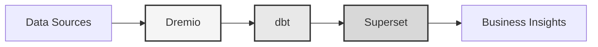

# Data Platform

**Enterprise Data Lakehouse Solution**

**Language**: English (EN)  
**Version**: 3.1.0  
**Last Updated**: 2025-10-15

---

## Overview

Professional data platform combining Dremio, dbt, and Apache Superset for enterprise-grade data transformation, quality assurance, and business intelligence.

This platform provides a comprehensive solution for modern data engineering, featuring automated data pipelines, quality testing, and interactive dashboards.



---

## Key Features

- Data lakehouse architecture with Dremio
- Automated transformations with dbt
- Business intelligence with Apache Superset
- Comprehensive data quality testing
- Real-time synchronization via Arrow Flight

---

## Quick Start Guide

### Prerequisites

- Docker 20.10 or higher
- Docker Compose 2.0 or higher
- Python 3.11 or higher
- Minimum 8 GB RAM

### Installation

```bash
# Install dependencies
pip install -r requirements.txt

# Start services
make up

# Verify installation
make status

# Run quality tests
make dbt-test
```

---

## Architecture

### System Components

| Component | Port | Description |
|-----------|------|-------------|
| Dremio | 9047, 31010, 32010 | Data lakehouse platform |
| dbt | - | Data transformation tool |
| Superset | 8088 | Business intelligence platform |
| PostgreSQL | 5432 | Transactional database |
| MinIO | 9000, 9001 | Object storage (S3-compatible) |
| Elasticsearch | 9200 | Search and analytics engine |

See [architecture documentation](architecture/) for detailed system design.

---

## Documentation

### Getting Started
- [Installation Guide](getting-started/)
- [Configuration](getting-started/)
- [First Steps](getting-started/)

### User Guides
- [Data Engineering](guides/)
- [Dashboard Creation](guides/)
- [API Integration](guides/)

### API Documentation
- [REST API Reference](api/)
- [Authentication](api/)
- [Code Examples](api/)

### Architecture Documentation
- [System Design](architecture/)
- [Data Flow](architecture/)
- [Deployment Guide](architecture/)
- [🎯 Visual Guide to Dremio Ports](architecture/dremio-ports-visual.md) ⭐ NEW

---

## Available Languages

| Language | Code | Documentation |
|----------|------|---------------|
| English | EN | [docs/i18n/en/](../en/README.md) |
| Français | FR | [docs/i18n/fr/](../fr/README.md) |
| Español | ES | [docs/i18n/es/](../es/README.md) |
| Português | PT | [docs/i18n/pt/](../pt/README.md) |
| العربية | AR | [docs/i18n/ar/](../ar/README.md) |
| 中文 | CN | [docs/i18n/cn/](../cn/README.md) |
| 日本語 | JP | [docs/i18n/jp/](../jp/README.md) |
| Русский | RU | [docs/i18n/ru/](../ru/README.md) |

---

## Support

For technical assistance:
- Documentation: [Main README](../../../README.md)
- Issue Tracking: GitHub Issues
- Community Forum: GitHub Discussions
- Email: support@example.com

---

**[Return to main documentation](../../../README.md)**
