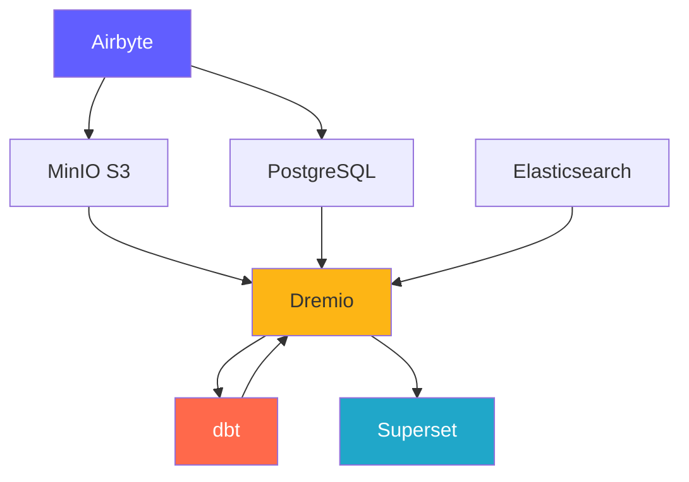
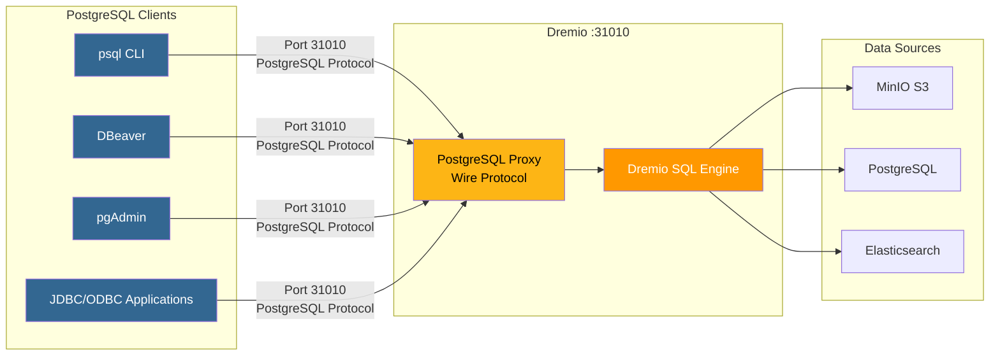
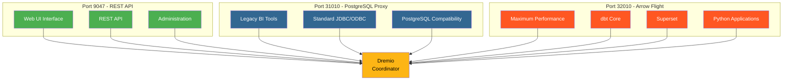
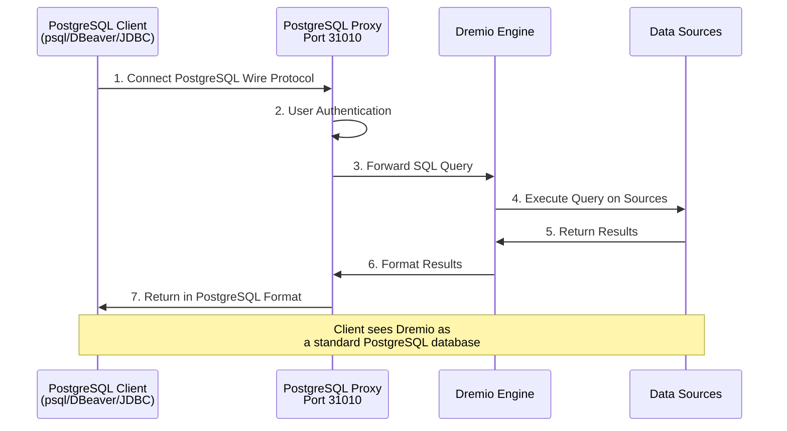
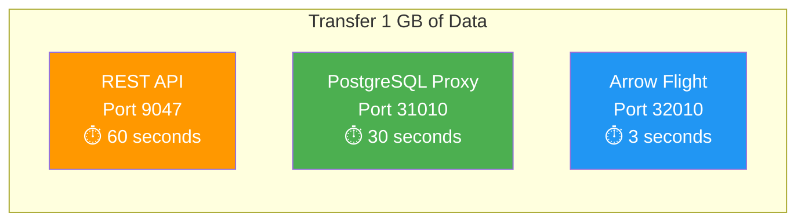

# Platform Components

**Version**: 3.2.0  
**Last Updated**: 2025-10-16  
**Language**: English

---
Dremio provides a unified SQL interface across all data sources with query acceleration.

**Version**: 26.0 OSS  
**License**: Apache 2.0  
**Website**: https://www.dremio.comComponent Overview

The data platform consists of 7 core components working together to provide a complete data solution.



---

## 1. Airbyte - Data Integration Platform

### Overview

Airbyte is an open-source data integration engine that consolidates data from multiple sources into destinations.

**Version**: 0.50.33  
**License**: MIT  
**Website**: https://airbyte.com

### Key Features

- **300+ Pre-built Connectors**: Databases, APIs, files, SaaS apps
- **Change Data Capture (CDC)**: Real-time data replication
- **Custom Connectors**: Build using Python or low-code CDK
- **Normalization**: Transform JSON to relational tables
- **Incremental Sync**: Only sync new/changed data
- **Monitoring**: Built-in sync status tracking

### Architecture

```yaml
Components:
  airbyte-webapp:
    Port: 8000
    Purpose: Web user interface
    
  airbyte-server:
    Port: 8001
    Purpose: REST API server
    
  airbyte-worker:
    Purpose: Execute sync jobs
    Scaling: Horizontal
    
  airbyte-temporal:
    Port: 7233
    Purpose: Workflow orchestration
    
  airbyte-db:
    Port: 5432
    Purpose: Metadata storage (PostgreSQL)
```

### Use Cases

- **ELT Pipelines**: Extract-Load-Transform workflows
- **Database Replication**: Keep databases in sync
- **API Integration**: Pull data from REST APIs
- **Data Lake Ingestion**: Load data into S3/MinIO
- **Cloud Migration**: Move on-prem data to cloud

### Configuration

```yaml
# Environment Variables
AIRBYTE_VERSION: "0.50.33"
AIRBYTE_HTTP_PORT: 8000
AIRBYTE_API_PORT: 8001
AIRBYTE_WORKSPACE_ROOT: /tmp/airbyte_local

# Resource Limits
CPU_LIMIT: "2.0"
MEMORY_LIMIT: "2Gi"
```

### Integration Points

- **Outputs to**: MinIO S3, PostgreSQL, Dremio
- **Orchestration**: Can be triggered by Airflow, Prefect
- **Monitoring**: Prometheus metrics endpoint

---

## 2. Dremio - Data Lakehouse Platform

### Overview

Dremio provides a unified SQL interface across data sources with query acceleration.

**Version**: 24.0  
**License**: Apache 2.0  
**Website**: https://www.dremio.com

### Key Features

- **Data Lakehouse**: Combine lake flexibility with warehouse performance
- **Reflections**: Automatic query acceleration (up to 100x faster)
- **Arrow Flight**: High-performance data transfer
- **Data Virtualization**: Query without moving data
- **Semantic Layer**: Business-friendly data definitions
- **Time Travel**: Query historical data versions

### Architecture

```yaml
Components:
  Coordinator:
    Port: 9047 (HTTP), 31010 (ODBC), 32010 (Arrow Flight)
    Purpose: Query planning, metadata management
    Memory: 8GB heap + 8GB direct
    
  Executor:
    Purpose: Query execution
    Memory: 4GB heap + 8GB direct
    Scaling: Horizontal (add more executors)
    
  Storage:
    Type: Distributed (MinIO, S3, HDFS)
    Format: Parquet, Iceberg
```

### Use Cases

- **Self-Service Analytics**: Enable business users to explore data
- **Data Mesh**: Federated data access
- **Query Acceleration**: Speed up dashboard queries
- **Data Catalog**: Discover and govern data
- **BI Enablement**: Power Tableau, Power BI, Superset

### Configuration

```conf
# dremio.conf
paths.local: "/opt/dremio/data"
services.coordinator.enabled: true
services.executor.enabled: true

services.coordinator.web.port: 9047
services.flight.endpoint.port: 32010

services.executor.cache.pct.max: 70
```

### Integration Points

- **Reads from**: MinIO S3, PostgreSQL, Elasticsearch
- **Transforms with**: dbt
- **Serves to**: Superset, Tableau, Power BI

### PostgreSQL Proxy for Dremio

Dremio can emulate a PostgreSQL server, allowing PostgreSQL-compatible tools to connect to Dremio as if it were a standard PostgreSQL database.

#### PostgreSQL Proxy Architecture



#### Comparison of 3 Dremio Ports



#### Proxy Configuration

```yaml
PostgreSQL Proxy:
  Port: 31010 (ODBC/JDBC)
  Protocol: PostgreSQL Wire Protocol
  Compatibility: PostgreSQL-compatible tools (psql, pgAdmin, DBeaver)
  
Benefits:
  - No client code modifications needed
  - Support for existing PostgreSQL drivers
  - Standard JDBC/ODBC connection
  - Compatible with most BI tools
```

#### Proxy Use Cases

1. **Legacy BI Tools**: Connect tools that don't support Arrow Flight
2. **Easy Migration**: Replace PostgreSQL with Dremio without code changes
3. **ODBC/JDBC Compatibility**: Use standard PostgreSQL drivers
4. **Development**: Test with familiar PostgreSQL tools (psql, pgAdmin)

#### Connection Example

```bash
# Via psql
psql -h localhost -p 31010 -U admin -d datalake

# Via DBeaver / pgAdmin
Host: localhost
Port: 31010
Database: datalake
Username: admin
Password: <your-password>

# JDBC String
jdbc:postgresql://localhost:31010/datalake

# ODBC String
Driver=PostgreSQL Unicode;
Server=localhost;
Port=31010;
Database=datalake;
Uid=admin;
Pwd=<your-password>;
```

#### Limitations

- **Performance**: Arrow Flight (port 32010) is 20-50x faster
- **Features**: Some advanced PostgreSQL functions not supported
- **Recommendation**: Use Arrow Flight for production, PostgreSQL proxy for compatibility

#### Connection Flow via PostgreSQL Proxy



#### Protocol Comparison

| Protocol | Port | Performance | Latency | Use Case |
|----------|------|-------------|---------|----------|
| **REST API** | 9047 | Standard | ~50-100ms | Web UI, administration |
| **ODBC/JDBC (PostgreSQL Proxy)** | 31010 | Good | ~20-50ms | Legacy BI tools, compatibility |
| **Arrow Flight** | 32010 | Excellent (20-50x) | ~5-10ms | Production, Superset, dbt |

#### Performance Comparison



---

## 3. dbt - Data Transformation Tool

### Overview

dbt (data build tool) enables analytics engineers to transform data using SQL.

**Version**: 1.10+  
**License**: Apache 2.0  
**Website**: https://www.getdbt.com

### Key Features

- **SQL-Based**: Write transformations in SQL
- **Version Control**: Git integration for collaboration
- **Testing**: Built-in data quality tests
- **Documentation**: Auto-generate data dictionaries
- **Modularity**: Reusable macros and packages
- **Incremental Models**: Process only new data

### Architecture

```yaml
Components:
  dbt Core:
    Purpose: CLI tool for running transformations
    Language: Python
    
  Models:
    Purpose: SQL SELECT statements
    Types: Views, Tables, Incremental, Snapshots
    
  Tests:
    Purpose: Data quality validation
    Types: Unique, Not Null, Relationships, Custom
    
  Macros:
    Purpose: Reusable SQL functions
    Language: Jinja2
```

### Use Cases

- **Data Modeling**: Build star/snowflake schemas
- **Data Quality**: Validate data integrity
- **Slowly Changing Dimensions**: Track historical changes
- **Data Aggregation**: Create summary tables
- **Data Documentation**: Generate data catalogs

### Configuration

```yaml
# dbt_project.yml
name: 'dremio_dbt'
version: '1.0.0'
profile: 'dremio'

models:
  dremio_dbt:
    staging:
      +materialized: view
      +schema: staging
    marts:
      +materialized: table
      +schema: marts
```

### Integration Points

- **Reads from**: Dremio datasets
- **Writes to**: Dremio (via Arrow Flight)
- **Orchestrated by**: Airflow, cron, Airbyte post-sync

---

## 4. Apache Superset - Business Intelligence Platform

### Overview

Superset is a modern data exploration and visualization platform.

**Version**: 3.0  
**License**: Apache 2.0  
**Website**: https://superset.apache.org

### Key Features

- **SQL IDE**: Advanced SQL editor with autocomplete
- **Rich Visualizations**: 50+ chart types
- **Interactive Dashboards**: Drill-down, filters, cross-filtering
- **SQL Lab**: Ad-hoc querying interface
- **Alerting**: Scheduled reports and alerts
- **Caching**: Query result caching for performance

### Architecture

```yaml
Components:
  Web Server:
    Port: 8088
    Purpose: Serve web interface
    Framework: Flask
    
  Celery Workers:
    Purpose: Async query execution
    Queue: Redis/RabbitMQ
    
  Celery Beat:
    Purpose: Scheduled tasks (cache warmup, alerts)
    
  Database:
    Purpose: Store dashboards, users, query logs
    Type: PostgreSQL
```

### Use Cases

- **Executive Dashboards**: KPI tracking
- **Operational Analytics**: Real-time monitoring
- **Self-Service BI**: Empower analysts
- **Embedded Analytics**: Iframe embedding in apps
- **Data Exploration**: Ad-hoc analysis

### Configuration

```python
# superset_config.py
SQLALCHEMY_DATABASE_URI = 'postgresql://...'
SECRET_KEY = '...'

FEATURE_FLAGS = {
    'DASHBOARD_NATIVE_FILTERS': True,
    'DASHBOARD_CROSS_FILTERS': True,
    'ENABLE_TEMPLATE_PROCESSING': True
}

CACHE_CONFIG = {
    'CACHE_TYPE': 'redis',
    'CACHE_DEFAULT_TIMEOUT': 300
}
```

### Integration Points

- **Queries**: Dremio (via Arrow Flight)
- **Authentication**: LDAP, OAuth2, Database
- **Alerts**: Email, Slack

---

## 5. PostgreSQL - Relational Database

### Overview

PostgreSQL is an advanced open-source relational database management system.

**Version**: 16  
**License**: PostgreSQL License  
**Website**: https://www.postgresql.org

### Key Features

- **ACID Compliance**: Reliable transactions
- **JSON Support**: Native JSON/JSONB types
- **Full-Text Search**: Built-in search capabilities
- **Extensions**: PostGIS, pg_stat_statements, TimescaleDB
- **Replication**: Streaming replication, logical replication
- **Partitioning**: Native table partitioning

### Architecture

```yaml
Components:
  PostgreSQL Server:
    Port: 5432
    Protocol: PostgreSQL wire protocol
    
  Databases:
    - dremio_db: Dremio metadata
    - superset_db: Superset configuration
    - airbyte_db: Airbyte metadata
    
  Connections:
    Max: 200
    Pooling: PgBouncer (optional)
```

### Use Cases

- **Metadata Storage**: Store system metadata
- **Transactional Workloads**: OLTP applications
- **Staging Tables**: Temporary data processing
- **Configuration Storage**: Application settings
- **Audit Logs**: Track system changes

### Configuration

```conf
# postgresql.conf
max_connections = 200
shared_buffers = 256MB
effective_cache_size = 1GB
maintenance_work_mem = 64MB
work_mem = 4MB

# Performance
random_page_cost = 1.1
effective_io_concurrency = 200

# Logging
log_statement = 'mod'
log_duration = on
```

### Integration Points

- **Read by**: Dremio, Superset, Airbyte
- **Written by**: Airbyte, dbt, applications
- **Managed by**: Automated backups, replication

---

## 6. MinIO - S3-Compatible Object Storage

### Overview

MinIO is a high-performance, S3-compatible object storage system.

**Version**: Latest  
**License**: AGPLv3  
**Website**: https://min.io

### Key Features

- **S3 API**: 100% compatible with Amazon S3
- **High Performance**: Multi-GB/s throughput
- **Erasure Coding**: Data durability and availability
- **Versioning**: Object version control
- **Encryption**: Server-side and client-side
- **Multi-Cloud**: Deploy anywhere

### Architecture

```yaml
Components:
  MinIO Server:
    Port: 9000 (S3 API), 9001 (Console)
    Mode: Single-node or distributed
    
  Storage:
    Format: Erasure coded or raw
    Redundancy: Configurable (e.g., 4+2)
    
  Buckets:
    - datalake: Main data storage
    - raw-data: Airbyte ingestion
    - processed-data: dbt outputs
    - backups: System backups
```

### Use Cases

- **Data Lake**: Store raw and processed data
- **Object Storage**: Files, images, videos
- **Backup Storage**: Database and system backups
- **Archive**: Long-term data retention
- **Data Staging**: Temporary processing storage

### Configuration

```yaml
# Environment Variables
MINIO_ROOT_USER: minioadmin
MINIO_ROOT_PASSWORD: minioadmin123
MINIO_VOLUMES: /data

# Bucket Policies
- datalake: Read-write for data platform
- raw-data: Write by Airbyte, read by Dremio
- processed-data: Write by dbt, read all
```

### Integration Points

- **Written by**: Airbyte, dbt, applications
- **Read by**: Dremio, data scientists
- **Managed by**: mc (MinIO Client), s3cmd

---

## 7. Elasticsearch - Search and Analytics Engine

### Overview

Elasticsearch is a distributed search and analytics engine built on Apache Lucene.

**Version**: 8.15  
**License**: Elastic License 2.0  
**Website**: https://www.elastic.co

### Key Features

- **Full-Text Search**: Advanced search capabilities
- **Real-Time Indexing**: Near real-time data availability
- **Distributed**: Horizontal scalability
- **Aggregations**: Complex analytics
- **RESTful API**: Simple HTTP API
- **Machine Learning**: Anomaly detection

### Architecture

```yaml
Components:
  Elasticsearch Node:
    Port: 9200 (HTTP), 9300 (Transport)
    Roles: Master, Data, Ingest, ML
    
  Indices:
    Purpose: Store searchable documents
    Shards: Distributed across nodes
    Replicas: For high availability
    
  Index Lifecycle:
    Hot: Recent data (SSD)
    Warm: Older data (HDD)
    Cold: Archive (S3)
```

### Use Cases

- **Log Analytics**: Centralized logging (ELK stack)
- **Application Search**: Product catalogs, site search
- **Security Analytics**: SIEM use cases
- **Observability**: Metrics and traces
- **Text Analytics**: NLP and sentiment analysis

### Configuration

```yaml
# elasticsearch.yml
cluster.name: "dremio-search-cluster"
node.name: "node-1"
network.host: 0.0.0.0
http.port: 9200

# Security
xpack.security.enabled: true
xpack.security.transport.ssl.enabled: false

# Memory
bootstrap.memory_lock: true
```

### Integration Points

- **Indexed by**: Logstash, Filebeat
- **Queried by**: Dremio, Kibana
- **Monitored by**: Elasticsearch monitoring

---

## Component Comparison

| Component | Type | Primary Use | Scaling | Statefulness |
|-----------|------|-------------|---------|--------------|
| **Airbyte** | Integration | Data ingestion | Horizontal (workers) | Stateless |
| **Dremio** | Query Engine | Data access | Horizontal (executors) | Stateless |
| **dbt** | Transform | Data modeling | Vertical (cores) | Stateless |
| **Superset** | BI Platform | Visualization | Horizontal (web) | Stateless |
| **PostgreSQL** | Database | Metadata storage | Vertical (+ replication) | Stateful |
| **MinIO** | Object Storage | Data lake | Horizontal (distributed) | Stateful |
| **Elasticsearch** | Search Engine | Full-text search | Horizontal (cluster) | Stateful |

---

## Resource Requirements

### Minimum Configuration (Development)

```yaml
Total: 8 GB RAM, 4 CPUs, 50 GB Disk

Allocation:
  Airbyte: 1 GB RAM, 0.5 CPU
  Dremio: 2 GB RAM, 1 CPU
  Superset: 1 GB RAM, 0.5 CPU
  PostgreSQL: 1 GB RAM, 0.5 CPU
  MinIO: 1 GB RAM, 0.5 CPU
  Elasticsearch: 2 GB RAM, 1 CPU
```

### Recommended Configuration (Production)

```yaml
Total: 64 GB RAM, 16 CPUs, 500 GB SSD

Allocation:
  Airbyte: 4 GB RAM, 2 CPUs
  Dremio: 16 GB RAM, 4 CPUs
  Superset: 8 GB RAM, 2 CPUs
  PostgreSQL: 8 GB RAM, 2 CPUs
  MinIO: 16 GB RAM, 2 CPUs
  Elasticsearch: 12 GB RAM, 4 CPUs
```

---

## Version Compatibility Matrix

| Component | Version | Compatible With |
|-----------|---------|-----------------|
| Airbyte | 0.50+ | All destinations |
| Dremio | 26.0 | dbt 1.8+, Arrow Flight clients |
| dbt | 1.10+ | Dremio 23.0+ |
| Superset | 3.0+ | Dremio 22.0+, PostgreSQL 12+ |
| PostgreSQL | 16 | All components |
| MinIO | Latest | S3-compatible clients |
| Elasticsearch | 8.15 | Dremio 26.0+, Logstash 8.x |

---

**Components Guide Version**: 3.2.0  
**Last Updated**: 2025-10-16  
**Maintained By**: Data Platform Team
