# Data Flow Architecture

**Version**: 3.2.0  
**Last Updated**: October 16, 2025  
**Language**: English

## Table of Contents

1. [Overview](#overview)
2. [End-to-End Data Flow](#end-to-end-data-flow)
3. [Ingestion Layer](#ingestion-layer)
4. [Storage Layer](#storage-layer)
5. [Processing Layer](#processing-layer)
6. [Serving Layer](#serving-layer)
7. [Data Flow Patterns](#data-flow-patterns)
8. [Performance Considerations](#performance-considerations)
9. [Monitoring Data Flow](#monitoring-data-flow)
10. [Best Practices](#best-practices)

---

## Overview

This document details the complete data flow architecture of the platform, from initial data ingestion through final consumption. Understanding these flows is essential for optimizing performance, troubleshooting issues, and designing efficient data pipelines.

### Data Flow Principles

Our architecture follows these core principles:

1. **Unidirectional Flow**: Data moves in a clear, predictable direction
2. **Layered Processing**: Each layer has a specific responsibility
3. **Decoupled Components**: Services communicate through well-defined interfaces
4. **Idempotency**: Operations can be safely repeated
5. **Observability**: Every step is logged and monitored

### Architecture Layers


---

## End-to-End Data Flow

### Complete Pipeline Sequence


### Data Flow Stages

| Stage | Component | Input | Output | Latency |
|-------|-----------|-------|--------|---------|
| **Extraction** | Airbyte | External APIs/DBs | Raw JSON/CSV | 1-60 min |
| **Loading** | Storage Layer | Raw files | Organized buckets | <1 min |
| **Cataloging** | Dremio | Storage paths | Virtual datasets | <1 min |
| **Transformation** | dbt | Bronze tables | Silver/Gold tables | 5-30 min |
| **Optimization** | Dremio Reflections | Raw queries | Cached results | Real-time |
| **Visualization** | Superset | SQL queries | Charts/Dashboards | <5 sec |

---

## Ingestion Layer

### Airbyte Data Extraction

Airbyte handles all data ingestion from external sources.

#### Source Connection Flow


#### Data Extraction Methods

**1. Full Refresh**
```yaml
# Full refresh extracts all data every sync
sync_mode: full_refresh
destination_sync_mode: overwrite

# Use cases:
# - Small datasets (<1M rows)
# - No reliable change tracking
# - Complete data snapshots needed
```

**2. Incremental Sync**
```yaml
# Incremental sync extracts only new/modified data
sync_mode: incremental
destination_sync_mode: append_dedup
cursor_field: updated_at

# Use cases:
# - Large datasets (>1M rows)
# - Has timestamp or cursor field
# - Optimizing sync performance
```

**3. Change Data Capture (CDC)**
```yaml
# CDC uses database transaction logs
method: CDC
replication_method: LOG_BASED

# Supported databases:
# - PostgreSQL (WAL)
# - MySQL (binlog)
# - MongoDB (change streams)
# - SQL Server (change tracking)
```

### Airbyte API Integration

```bash
# Trigger sync via API
curl -X POST http://localhost:8001/api/v1/connections/sync \
  -H "Content-Type: application/json" \
  -d '{
    "connectionId": "your-connection-id"
  }'

# Check sync status
curl -X POST http://localhost:8001/api/v1/jobs/get \
  -H "Content-Type: application/json" \
  -d '{
    "id": "job-id"
  }'
```

### Extraction Performance

| Source Type | Throughput | Recommended Frequency |
|-------------|------------|----------------------|
| PostgreSQL | 50-100k rows/sec | Every 15-60 min |
| REST API | 1-10k req/sec | Every 5-30 min |
| CSV Files | 100-500 MB/sec | Daily |
| MongoDB | 10-50k docs/sec | Every 15-60 min |
| MySQL CDC | Real-time | Continuous |

---

## Storage Layer

### MinIO S3 Storage

MinIO stores raw and processed data in a hierarchical structure.

#### Bucket Organization


#### Data Path Structure

```
s3://datalake/
├── bronze/                      # Raw data from Airbyte
│   ├── postgres/
│   │   ├── customers/
│   │   │   └── date=2025-10-16/
│   │   │       └── data.parquet
│   │   └── orders/
│   │       └── date=2025-10-16/
│   │           └── data.parquet
│   ├── api/
│   │   └── rest_endpoint/
│   │       └── timestamp=20251016_120000/
│   │           └── response.json
│   └── files/
│       └── csv_import/
│           └── batch_001.csv
│
├── silver/                      # Cleaned and validated
│   ├── customers/
│   │   └── version=v2/
│   │       └── customers_cleaned.parquet
│   └── orders/
│       └── version=v2/
│           └── orders_enriched.parquet
│
└── gold/                        # Business-ready aggregates
    ├── daily_revenue/
    │   └── year=2025/month=10/
    │       └── day=16/
    │           └── revenue.parquet
    └── customer_metrics/
        └── snapshot=2025-10-16/
            └── metrics.parquet
```

### Storage Format Strategy

| Layer | Format | Compression | Partitioning | Reason |
|-------|--------|-------------|--------------|--------|
| **Bronze** | Parquet | Snappy | By date | Fast write, good compression |
| **Silver** | Parquet | Snappy | By business key | Efficient queries |
| **Gold** | Parquet | ZSTD | By time period | Maximum compression |
| **Logs** | JSON | Gzip | By service/date | Human readable |

### PostgreSQL Metadata Storage

PostgreSQL stores:
- Airbyte configuration and state
- dbt metadata and run history
- Superset dashboards and users
- Application logs and metrics

```sql
-- Airbyte state table structure
CREATE TABLE airbyte_state (
    connection_id UUID PRIMARY KEY,
    state JSONB NOT NULL,
    updated_at TIMESTAMP DEFAULT NOW()
);

-- dbt run history
CREATE TABLE dbt_run_history (
    run_id UUID PRIMARY KEY,
    project_name VARCHAR(255),
    started_at TIMESTAMP,
    completed_at TIMESTAMP,
    status VARCHAR(50),
    models_run INTEGER,
    tests_run INTEGER,
    metadata JSONB
);
```

### Elasticsearch Document Storage

Elasticsearch indexes logs and enables full-text search.

```json
{
  "index": "airbyte-logs-2025.10.16",
  "mappings": {
    "properties": {
      "timestamp": {"type": "date"},
      "level": {"type": "keyword"},
      "service": {"type": "keyword"},
      "message": {"type": "text"},
      "job_id": {"type": "keyword"},
      "connection_id": {"type": "keyword"},
      "records_synced": {"type": "integer"},
      "bytes_synced": {"type": "long"}
    }
  }
}
```

---

## Processing Layer

### Dremio Data Virtualization

Dremio creates a unified view across all storage sources.

#### Virtual Dataset Creation


#### Reflection Acceleration

Dremio reflections pre-compute query results for instant performance.

```sql
-- Create raw reflection (column subset)
CREATE REFLECTION raw_customers
ON bronze.customers
USING DISPLAY (customer_id, name, email, created_at);

-- Create aggregation reflection
CREATE REFLECTION agg_daily_revenue
ON gold.orders
USING DIMENSIONS (order_date)
MEASURES (SUM(amount), COUNT(*), AVG(amount));

-- Reflections refresh automatically based on policy
ALTER REFLECTION agg_daily_revenue
SET REFRESH EVERY 1 HOUR;
```

**Reflection Performance Impact:**

| Query Type | Without Reflection | With Reflection | Speedup |
|------------|-------------------|-----------------|---------|
| Simple SELECT | 500ms | 50ms | 10x |
| Aggregations | 5s | 100ms | 50x |
| Complex JOINs | 30s | 500ms | 60x |
| Large scans | 120s | 2s | 60x |

### dbt Transformations

dbt transforms raw data into business-ready models.

#### Transformation Flow


#### Sample Transformation Pipeline

```sql
-- models/staging/stg_customers.sql
-- Stage 1: Clean and standardize
WITH source AS (
    SELECT * FROM bronze.raw_customers
),

cleaned AS (
    SELECT
        customer_id,
        TRIM(UPPER(name)) AS customer_name,
        LOWER(email) AS email,
        phone,
        address,
        city,
        state,
        zip_code,
        created_at,
        updated_at
    FROM source
    WHERE customer_id IS NOT NULL
)

SELECT * FROM cleaned;
```

```sql
-- models/intermediate/int_customer_orders.sql
-- Stage 2: Join and enrich
WITH customers AS (
    SELECT * FROM {{ ref('stg_customers') }}
),

orders AS (
    SELECT * FROM {{ ref('stg_orders') }}
),

joined AS (
    SELECT
        c.customer_id,
        c.customer_name,
        c.email,
        o.order_id,
        o.order_date,
        o.amount,
        o.status
    FROM customers c
    INNER JOIN orders o
        ON c.customer_id = o.customer_id
)

SELECT * FROM joined;
```

```sql
-- models/marts/fct_customer_lifetime_value.sql
-- Stage 3: Aggregate for business metrics
WITH customer_orders AS (
    SELECT * FROM {{ ref('int_customer_orders') }}
),

metrics AS (
    SELECT
        customer_id,
        customer_name,
        email,
        COUNT(DISTINCT order_id) AS total_orders,
        SUM(amount) AS lifetime_value,
        AVG(amount) AS average_order_value,
        MIN(order_date) AS first_order_date,
        MAX(order_date) AS last_order_date,
        DATEDIFF('day', MIN(order_date), MAX(order_date)) AS customer_lifespan_days
    FROM customer_orders
    WHERE status = 'completed'
    GROUP BY customer_id, customer_name, email
)

SELECT * FROM metrics;
```

#### dbt Run Flow

```bash
# Full pipeline execution
dbt run --select staging        # Run staging models
dbt test --select staging       # Test staging models
dbt run --select intermediate   # Run intermediate models
dbt test --select intermediate  # Test intermediate models
dbt run --select marts          # Run mart models
dbt test --select marts         # Test mart models

# Generate documentation
dbt docs generate
dbt docs serve
```

### Data Lineage Tracking


---

## Serving Layer

### Query Execution Flow


### API Access Patterns

#### 1. Superset Dashboards (Interactive BI)

```python
# Superset executes SQL through SQLAlchemy
from superset import db

query = """
SELECT 
    order_date,
    SUM(amount) as daily_revenue
FROM gold.fct_daily_revenue
WHERE order_date >= CURRENT_DATE - INTERVAL '30 days'
GROUP BY order_date
ORDER BY order_date
"""

results = db.session.execute(query)
```

#### 2. Arrow Flight API (High Performance)

```python
# Direct Arrow Flight connection for analytics tools
from pyarrow import flight

client = flight.FlightClient("grpc://localhost:32010")

# Authenticate
token = client.authenticate_basic_token("admin", "password123")

# Execute query
descriptor = flight.FlightDescriptor.for_command(
    b"SELECT * FROM gold.customer_metrics LIMIT 1000"
)

flight_info = client.get_flight_info(descriptor)
reader = client.do_get(flight_info.endpoints[0].ticket)

# Read as Arrow Table (zero-copy)
table = reader.read_all()
df = table.to_pandas()
```

#### 3. REST API (External Integrations)

```bash
# Dremio REST API for automation
curl -X POST http://localhost:9047/api/v3/sql \
  -H "Authorization: Bearer $TOKEN" \
  -H "Content-Type: application/json" \
  -d '{
    "sql": "SELECT COUNT(*) FROM gold.customers"
  }'
```

---

## Data Flow Patterns

### Pattern 1: Batch ETL Pipeline

```mermaid
gantt
    title Daily Batch ETL Schedule
    dateFormat HH:mm
    axisFormat %H:%M
    
    section Ingestion
    Airbyte Extract (PostgreSQL)     :01:00, 30m
    Airbyte Extract (APIs)           :01:30, 45m
    
    section Loading
    Load to MinIO Bronze             :02:15, 15m
    
    section Transformation
    dbt Staging Models               :02:30, 20m
    dbt Intermediate Models          :02:50, 30m
    dbt Mart Models                  :03:20, 40m
    
    section Testing
    dbt Data Quality Tests           :04:00, 15m
    
    section Optimization
    Refresh Dremio Reflections       :04:15, 20m
    
    section Serving
    Dashboard Cache Warm-up          :04:35, 10m
```



### Pattern 2: Real-Time Streaming


### Pattern 3: Incremental Updates

```sql
-- dbt incremental model
{{ config(
    materialized='incremental',
    unique_key='order_id',
    on_schema_change='sync_all_columns'
) }}

SELECT
    order_id,
    customer_id,
    order_date,
    amount,
    status,
    updated_at
FROM {{ source('bronze', 'orders') }}


    -- Only process new or updated records
    WHERE updated_at > (SELECT MAX(updated_at) FROM {{ this }})

```

### Pattern 4: Lambda Architecture (Batch + Stream)


---

## Performance Considerations

### Ingestion Optimization

```yaml
# Airbyte connection configuration
sync_mode: incremental
destination_sync_mode: append_dedup
cursor_field: updated_at

# Performance tuning
batch_size: 10000              # Records per batch
threads: 4                     # Parallel workers
timeout_minutes: 60           # Sync timeout
retry_on_failure: true
max_retries: 3

# Network optimization
compression: gzip
buffer_size_mb: 256
```

### Storage Optimization

```python
# Parquet write options for optimal compression
import pyarrow.parquet as pq

pq.write_table(
    table,
    'output.parquet',
    compression='snappy',      # Fast compression
    use_dictionary=True,       # Enable dictionary encoding
    row_group_size=1000000,    # 1M rows per row group
    data_page_size=1048576,    # 1MB page size
    write_statistics=True      # Enable statistics for pruning
)
```

### Query Optimization

```sql
-- Best practices for Dremio queries

-- 1. Use partition pruning
SELECT * FROM gold.orders
WHERE order_date >= '2025-10-01'  -- Prunes partitions
  AND order_date < '2025-11-01';

-- 2. Leverage reflections
-- Create reflection once, queries auto-accelerate
ALTER REFLECTION agg_orders SET ENABLED = TRUE;

-- 3. Use column pruning
SELECT order_id, amount       -- Only needed columns
FROM gold.orders
LIMIT 1000;

-- 4. Push down filters
SELECT *
FROM gold.customers
WHERE state = 'CA'            -- Filter pushed to storage
  AND lifetime_value > 1000;
```

### Transformation Optimization

```sql
-- dbt optimization techniques

-- 1. Incremental models for large tables
{{ config(materialized='incremental') }}

-- 2. Partitioned tables
{{ config(
    materialized='table',
    partition_by={
        'field': 'order_date',
        'data_type': 'date',
        'granularity': 'day'
    }
) }}

-- 3. Clustered tables for better joins
{{ config(
    materialized='table',
    cluster_by=['customer_id']
) }}
```

### Performance Benchmarks

| Operation | Small Dataset<br/>(1M rows) | Medium Dataset<br/>(100M rows) | Large Dataset<br/>(1B rows) |
|-----------|---------------------------|-------------------------------|---------------------------|
| **Airbyte Sync** | 2 min | 30 min | 5 hours |
| **dbt Run** | 30 sec | 10 min | 2 hours |
| **Reflection Build** | 10 sec | 5 min | 30 min |
| **Dashboard Query** | <100ms | <500ms | <2s |

---

## Monitoring Data Flow

### Key Metrics to Track

```yaml
# Prometheus metrics configuration
metrics:
  ingestion:
    - airbyte_records_synced_total
    - airbyte_sync_duration_seconds
    - airbyte_sync_failures_total
    
  storage:
    - minio_disk_usage_bytes
    - minio_objects_total
    - postgres_connections_active
    
  processing:
    - dremio_query_duration_seconds
    - dremio_reflection_refresh_seconds
    - dbt_model_execution_time
    
  serving:
    - superset_dashboard_load_time
    - superset_query_cache_hit_rate
    - api_requests_per_second
```

### Monitoring Dashboard


### Log Aggregation

```bash
# Elasticsearch query for pipeline monitoring
curl -X GET "localhost:9200/airbyte-logs-*/_search" \
  -H 'Content-Type: application/json' \
  -d '{
    "query": {
      "bool": {
        "filter": [
          {"range": {"timestamp": {"gte": "now-1h"}}},
          {"term": {"level": "ERROR"}}
        ]
      }
    },
    "aggs": {
      "by_service": {
        "terms": {"field": "service"}
      }
    }
  }'
```

---

## Best Practices

### Data Flow Design

1. **Design for Idempotency**
   - Ensure operations can be safely repeated
   - Use unique keys for deduplication
   - Implement proper error handling

2. **Implement Data Quality Checks**
   ```sql
   -- dbt test example
   -- tests/assert_positive_amounts.sql
   SELECT *
   FROM {{ ref('fct_orders') }}
   WHERE amount <= 0
   ```

3. **Partition Large Datasets**
   ```python
   # Partition by date for efficient queries
   df.write.partitionBy('order_date').parquet('s3://bucket/orders/')
   ```

4. **Use Appropriate Sync Modes**
   - Full Refresh: Small dimension tables
   - Incremental: Large fact tables
   - CDC: Real-time requirements

### Performance Tuning

1. **Optimize Airbyte Sync Schedule**
   ```yaml
   # Balance freshness vs resource usage
   small_tables:
     frequency: every_15_minutes
   
   large_tables:
     frequency: every_6_hours
   
   dimension_tables:
     frequency: daily
   ```

2. **Create Strategic Reflections**
   ```sql
   -- Focus on frequently-queried aggregations
   CREATE REFLECTION common_metrics
   ON gold.orders
   USING DIMENSIONS (product_id, date_trunc('day', order_date))
   MEASURES (SUM(amount), COUNT(*));
   ```

3. **Optimize dbt Models**
   ```yaml
   # models/schema.yml
   models:
     - name: fct_large_table
       config:
         materialized: incremental
         incremental_strategy: merge
         unique_key: id
         partition_by: {field: date, data_type: date}
   ```

### Troubleshooting Common Issues

| Issue | Symptom | Solution |
|-------|---------|----------|
| **Slow Airbyte Sync** | Hours to sync | Increase batch size, use incremental mode |
| **Out of Memory** | dbt models fail | Materialize as incremental, add partitioning |
| **Slow Queries** | Dashboard timeout | Create reflections, add indexes |
| **Storage Full** | Write failures | Implement data retention, compress old data |
| **Stale Data** | Old metrics | Increase sync frequency, check schedules |

### Security Best Practices

1. **Encrypt Data in Transit**
   ```yaml
   # docker-compose.yml
   minio:
     environment:
       MINIO_SERVER_URL: https://minio:9000
       MINIO_BROWSER_REDIRECT_URL: https://console.minio.local
   ```

2. **Implement Access Controls**
   ```sql
   -- Dremio ACLs
   GRANT SELECT ON gold.customer_metrics TO ROLE analyst;
   GRANT ALL ON bronze.* TO ROLE data_engineer;
   ```

3. **Audit Data Access**
   ```json
   {
     "audit_log": {
       "enabled": true,
       "log_queries": true,
       "log_user_actions": true,
       "retention_days": 90
     }
   }
   ```

---

## Summary

This document detailed the complete data flow architecture:

- **Ingestion Layer**: Airbyte extracts data from various sources using full refresh, incremental, or CDC methods
- **Storage Layer**: MinIO, PostgreSQL, and Elasticsearch store raw and processed data in organized layers
- **Processing Layer**: Dremio virtualizes data and dbt transforms it through staging, intermediate, and mart models
- **Serving Layer**: Superset dashboards and APIs provide access to business-ready data

Key takeaways:
- Data flows unidirectionally through clearly defined layers
- Each component has specific responsibilities and interfaces
- Performance is optimized through reflections, partitioning, and caching
- Monitoring and observability are built into every layer
- Best practices ensure reliability, performance, and security

**Related Documentation:**
- [Architecture Overview](./overview.md)
- [Components](./components.md)
- [Deployment](./deployment.md)
- [Airbyte Integration Guide](../guides/airbyte-integration.md)
- [dbt Development Guide](../guides/dbt-development.md)

---

**Version**: 3.2.0  
**Last Updated**: October 16, 2025
