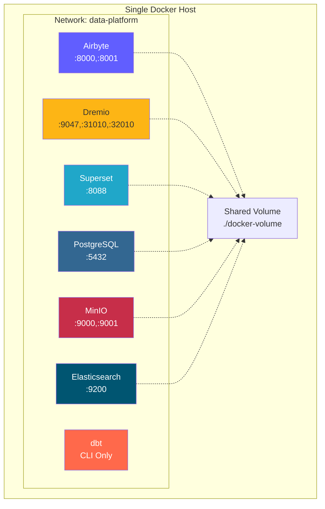
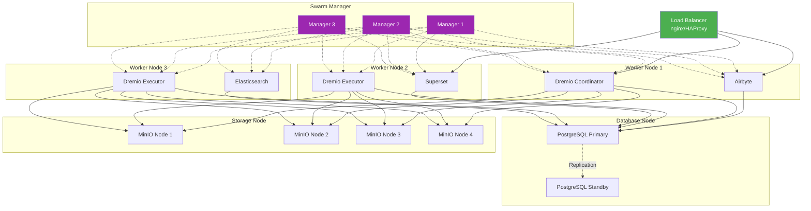
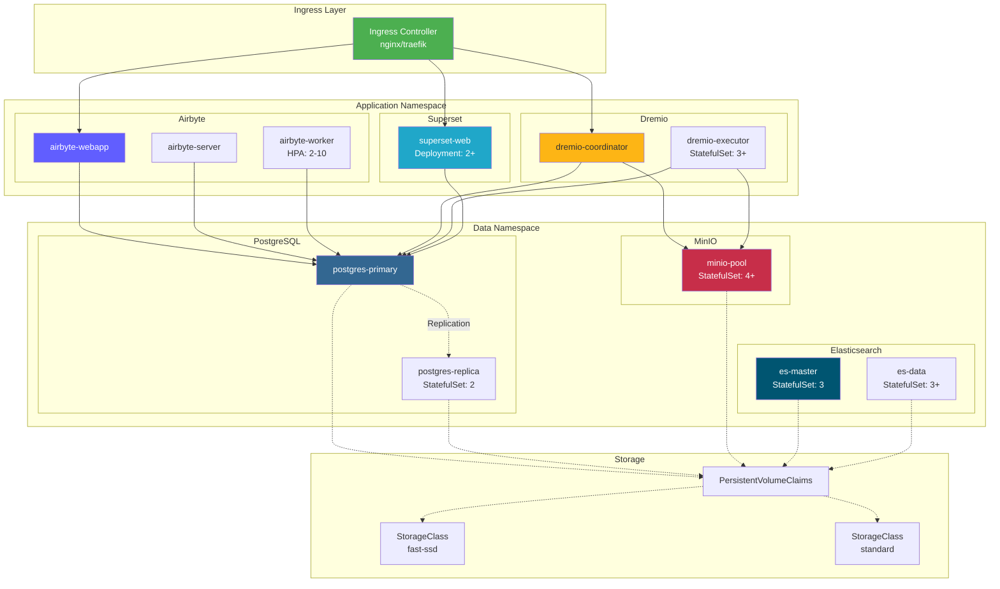
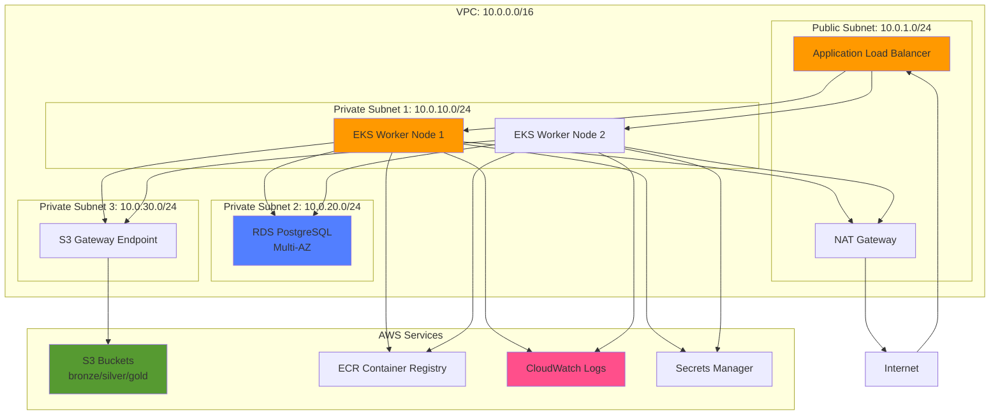
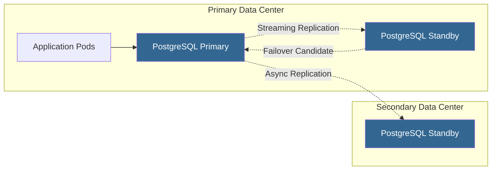

# Deployment Architecture

**Version**: 3.2.0  
**Last Updated**: October 16, 2025  
**Language**: English

## Table of Contents

1. [Overview](#overview)
2. [Deployment Topologies](#deployment-topologies)
3. [Docker Compose Deployment](#docker-compose-deployment)
4. [Kubernetes Deployment](#kubernetes-deployment)
5. [Cloud Deployments](#cloud-deployments)
6. [High Availability Setup](#high-availability-setup)
7. [Scaling Strategies](#scaling-strategies)
8. [Security Configuration](#security-configuration)
9. [Monitoring and Logging](#monitoring-and-logging)
10. [Disaster Recovery](#disaster-recovery)
11. [Best Practices](#best-practices)

---

## Overview

This document provides comprehensive guidance on deploying the data platform across different environments, from development to production. We cover various deployment topologies, orchestration strategies, and operational best practices.

### Deployment Goals

- **Reliability**: 99.9% uptime for production workloads
- **Scalability**: Handle 10x growth without architecture changes
- **Security**: Defense-in-depth with multiple security layers
- **Maintainability**: Easy updates and configuration management
- **Cost-Efficiency**: Optimize resource utilization

### Environment Types

| Environment | Purpose | Scale | Availability |
|-------------|---------|-------|--------------|
| **Development** | Feature development, testing | Single node | <95% |
| **Staging** | Pre-production validation | Multi-node | 95-99% |
| **Production** | Live data workloads | Clustered | >99.9% |
| **DR** | Disaster recovery site | Mirror of prod | Standby |

---

## Deployment Topologies

### Topology 1: Single-Host Development



**Use Case**: Local development, testing, demos

**Specifications**:
- CPU: 4-8 cores
- RAM: 16-32 GB
- Disk: 100-500 GB SSD
- Network: Localhost only

**Pros**:
- Simple setup (docker-compose up)
- Low cost
- Fast iteration

**Cons**:
- No redundancy
- Limited performance
- Not suitable for production

### Topology 2: Multi-Host Docker Swarm



**Use Case**: Staging and small production deployments

**Specifications**:
- Manager nodes: 3x (2 CPU, 4 GB RAM)
- Worker nodes: 3+ (8-16 CPU, 32-64 GB RAM)
- Database node: 1-2 (4 CPU, 16 GB RAM, SSD)
- Storage nodes: 4+ (2 CPU, 8 GB RAM, HDD/SSD)

**Pros**:
- High availability
- Easy scaling
- Built-in load balancing
- Health monitoring

**Cons**:
- More complex than single-host
- Requires shared storage or volumes
- Network configuration complexity

### Topology 3: Kubernetes Cluster



**Use Case**: Production deployments at scale

**Specifications**:
- Control plane: 3+ nodes (managed or self-hosted)
- Worker nodes: 10+ nodes (16-32 CPU, 64-128 GB RAM)
- Storage: CSI driver (EBS, GCP PD, Azure Disk)
- Network: CNI plugin (Calico, Cilium)

**Pros**:
- Enterprise-grade orchestration
- Automated scaling and healing
- Advanced networking (service mesh)
- GitOps-friendly
- Multi-tenancy support

**Cons**:
- Complex setup and management
- Steeper learning curve
- Higher operational overhead

---

## Docker Compose Deployment

### Development Environment

Our standard `docker-compose.yml` for local development:

```yaml
version: '3.8'

services:
  # Airbyte Platform
  airbyte-server:
    image: airbyte/server:0.50.33
    container_name: airbyte-server
    ports:
      - "8001:8001"
    environment:
      - DATABASE_USER=airbyte
      - DATABASE_PASSWORD=airbyte
      - DATABASE_DB=airbyte
      - DATABASE_HOST=postgres
      - DATABASE_PORT=5432
      - WORKSPACE_ROOT=/tmp/workspace
      - CONFIG_ROOT=/data
      - TRACKING_STRATEGY=logging
    volumes:
      - airbyte-data:/data
      - airbyte-workspace:/tmp/workspace
    depends_on:
      - postgres
    networks:
      - data-platform

  airbyte-webapp:
    image: airbyte/webapp:0.50.33
    container_name: airbyte-webapp
    ports:
      - "8000:80"
    environment:
      - AIRBYTE_SERVER_HOST=airbyte-server
      - AIRBYTE_SERVER_PORT=8001
    depends_on:
      - airbyte-server
    networks:
      - data-platform

  airbyte-worker:
    image: airbyte/worker:0.50.33
    container_name: airbyte-worker
    environment:
      - DATABASE_USER=airbyte
      - DATABASE_PASSWORD=airbyte
      - DATABASE_DB=airbyte
      - DATABASE_HOST=postgres
      - DATABASE_PORT=5432
      - WORKSPACE_ROOT=/tmp/workspace
      - LOCAL_ROOT=/tmp/airbyte_local
    volumes:
      - airbyte-workspace:/tmp/workspace
      - /var/run/docker.sock:/var/run/docker.sock
    depends_on:
      - postgres
      - airbyte-server
    networks:
      - data-platform

  # Dremio Lakehouse
  dremio:
    image: dremio/dremio-oss:26.0
    container_name: dremio
    ports:
      - "9047:9047"   # Web UI
      - "31010:31010" # ODBC/JDBC
      - "32010:32010" # Arrow Flight
    environment:
      - DREMIO_JAVA_SERVER_EXTRA_OPTS=-Xms2g -Xmx4g
    volumes:
      - dremio-data:/opt/dremio/data
      - ./config/dremio.conf:/opt/dremio/conf/dremio.conf
    networks:
      - data-platform

  # Apache Superset
  superset:
    image: apache/superset:3.0.0
    container_name: superset
    ports:
      - "8088:8088"
    environment:
      - SUPERSET_SECRET_KEY=your-secret-key-here
      - SUPERSET_LOAD_EXAMPLES=yes
    volumes:
      - superset-data:/app/superset_home
    command: >
      sh -c "superset db upgrade &&
             superset fab create-admin 
               --username admin 
               --firstname Admin 
               --lastname User 
               --email admin@example.com 
               --password admin &&
             superset init &&
             superset run -h 0.0.0.0 -p 8088"
    depends_on:
      - postgres
    networks:
      - data-platform

  # PostgreSQL Database
  postgres:
    image: postgres:16
    container_name: postgres
    ports:
      - "5432:5432"
    environment:
      - POSTGRES_USER=postgres
      - POSTGRES_PASSWORD=postgres
      - POSTGRES_DB=postgres
      - PGDATA=/var/lib/postgresql/data/pgdata
    volumes:
      - postgres-data:/var/lib/postgresql/data
      - ./scripts/init-databases.sql:/docker-entrypoint-initdb.d/init.sql
    networks:
      - data-platform
    healthcheck:
      test: ["CMD-SHELL", "pg_isready -U postgres"]
      interval: 10s
      timeout: 5s
      retries: 5

  # MinIO Object Storage
  minio:
    image: minio/minio:latest
    container_name: minio
    ports:
      - "9000:9000"  # API
      - "9001:9001"  # Console
    environment:
      - MINIO_ROOT_USER=minioadmin
      - MINIO_ROOT_PASSWORD=minioadmin
    volumes:
      - minio-data:/data
    command: server /data --console-address ":9001"
    networks:
      - data-platform
    healthcheck:
      test: ["CMD", "curl", "-f", "http://localhost:9000/minio/health/live"]
      interval: 30s
      timeout: 20s
      retries: 3

  # Elasticsearch
  elasticsearch:
    image: docker.elastic.co/elasticsearch/elasticsearch:8.15.0
    container_name: elasticsearch
    ports:
      - "9200:9200"
      - "9300:9300"
    environment:
      - discovery.type=single-node
      - xpack.security.enabled=false
      - "ES_JAVA_OPTS=-Xms1g -Xmx1g"
    volumes:
      - es-data:/usr/share/elasticsearch/data
    networks:
      - data-platform
    healthcheck:
      test: ["CMD-SHELL", "curl -f http://localhost:9200/_cluster/health || exit 1"]
      interval: 30s
      timeout: 10s
      retries: 5

volumes:
  airbyte-data:
  airbyte-workspace:
  dremio-data:
  superset-data:
  postgres-data:
  minio-data:
  es-data:

networks:
  data-platform:
    driver: bridge
```

### Production Docker Compose Overrides

```yaml
# docker-compose.prod.yml
version: '3.8'

services:
  # Override with production settings
  dremio:
    environment:
      - DREMIO_JAVA_SERVER_EXTRA_OPTS=-Xms8g -Xmx16g
    deploy:
      resources:
        limits:
          cpus: '8'
          memory: 16G
        reservations:
          cpus: '4'
          memory: 8G

  postgres:
    environment:
      - POSTGRES_PASSWORD=${POSTGRES_PASSWORD}  # From .env
    volumes:
      - /mnt/data/postgres:/var/lib/postgresql/data
    deploy:
      resources:
        limits:
          cpus: '4'
          memory: 8G

  minio:
    environment:
      - MINIO_ROOT_USER=${MINIO_ROOT_USER}
      - MINIO_ROOT_PASSWORD=${MINIO_ROOT_PASSWORD}
    volumes:
      - /mnt/data/minio:/data
    deploy:
      replicas: 4  # Distributed MinIO
      resources:
        limits:
          cpus: '2'
          memory: 4G
```

**Deploy to production**:
```bash
docker-compose -f docker-compose.yml -f docker-compose.prod.yml up -d
```

---

## Kubernetes Deployment

### Namespace Setup

```yaml
# namespaces.yaml
apiVersion: v1
kind: Namespace
metadata:
  name: data-platform
  labels:
    name: data-platform
    environment: production
---
apiVersion: v1
kind: Namespace
metadata:
  name: data-storage
  labels:
    name: data-storage
    environment: production
```

### Airbyte Deployment

```yaml
# airbyte-deployment.yaml
apiVersion: apps/v1
kind: Deployment
metadata:
  name: airbyte-server
  namespace: data-platform
spec:
  replicas: 2
  selector:
    matchLabels:
      app: airbyte-server
  template:
    metadata:
      labels:
        app: airbyte-server
    spec:
      containers:
      - name: server
        image: airbyte/server:0.50.33
        ports:
        - containerPort: 8001
        env:
        - name: DATABASE_USER
          valueFrom:
            secretKeyRef:
              name: airbyte-secrets
              key: db-user
        - name: DATABASE_PASSWORD
          valueFrom:
            secretKeyRef:
              name: airbyte-secrets
              key: db-password
        - name: DATABASE_HOST
          value: postgres-service.data-storage.svc.cluster.local
        resources:
          requests:
            memory: "1Gi"
            cpu: "500m"
          limits:
            memory: "2Gi"
            cpu: "1000m"
        livenessProbe:
          httpGet:
            path: /health
            port: 8001
          initialDelaySeconds: 60
          periodSeconds: 30
        readinessProbe:
          httpGet:
            path: /health
            port: 8001
          initialDelaySeconds: 30
          periodSeconds: 10
---
apiVersion: v1
kind: Service
metadata:
  name: airbyte-server
  namespace: data-platform
spec:
  selector:
    app: airbyte-server
  ports:
  - protocol: TCP
    port: 8001
    targetPort: 8001
  type: ClusterIP
```

### Dremio StatefulSet

```yaml
# dremio-statefulset.yaml
apiVersion: apps/v1
kind: StatefulSet
metadata:
  name: dremio-executor
  namespace: data-platform
spec:
  serviceName: dremio-executor
  replicas: 3
  selector:
    matchLabels:
      app: dremio
      role: executor
  template:
    metadata:
      labels:
        app: dremio
        role: executor
    spec:
      containers:
      - name: dremio
        image: dremio/dremio-oss:26.0
        ports:
        - containerPort: 9047
        - containerPort: 31010
        - containerPort: 32010
        env:
        - name: DREMIO_JAVA_SERVER_EXTRA_OPTS
          value: "-Xms8g -Xmx16g"
        - name: DREMIO_COORDINATOR
          value: "false"
        - name: DREMIO_MASTER_HOST
          value: dremio-coordinator.data-platform.svc.cluster.local
        resources:
          requests:
            memory: "16Gi"
            cpu: "4000m"
          limits:
            memory: "32Gi"
            cpu: "8000m"
        volumeMounts:
        - name: dremio-data
          mountPath: /opt/dremio/data
  volumeClaimTemplates:
  - metadata:
      name: dremio-data
    spec:
      accessModes: ["ReadWriteOnce"]
      storageClassName: fast-ssd
      resources:
        requests:
          storage: 100Gi
```

### Horizontal Pod Autoscaler

```yaml
# hpa.yaml
apiVersion: autoscaling/v2
kind: HorizontalPodAutoscaler
metadata:
  name: airbyte-worker-hpa
  namespace: data-platform
spec:
  scaleTargetRef:
    apiVersion: apps/v1
    kind: Deployment
    name: airbyte-worker
  minReplicas: 2
  maxReplicas: 10
  metrics:
  - type: Resource
    resource:
      name: cpu
      target:
        type: Utilization
        averageUtilization: 70
  - type: Resource
    resource:
      name: memory
      target:
        type: Utilization
        averageUtilization: 80
  behavior:
    scaleUp:
      stabilizationWindowSeconds: 60
      policies:
      - type: Percent
        value: 100
        periodSeconds: 60
    scaleDown:
      stabilizationWindowSeconds: 300
      policies:
      - type: Pods
        value: 1
        periodSeconds: 60
```

### Ingress Configuration

```yaml
# ingress.yaml
apiVersion: networking.k8s.io/v1
kind: Ingress
metadata:
  name: data-platform-ingress
  namespace: data-platform
  annotations:
    kubernetes.io/ingress.class: nginx
    cert-manager.io/cluster-issuer: letsencrypt-prod
    nginx.ingress.kubernetes.io/ssl-redirect: "true"
    nginx.ingress.kubernetes.io/proxy-body-size: "500m"
spec:
  tls:
  - hosts:
    - airbyte.example.com
    - dremio.example.com
    - superset.example.com
    secretName: data-platform-tls
  rules:
  - host: airbyte.example.com
    http:
      paths:
      - path: /
        pathType: Prefix
        backend:
          service:
            name: airbyte-webapp
            port:
              number: 80
  - host: dremio.example.com
    http:
      paths:
      - path: /
        pathType: Prefix
        backend:
          service:
            name: dremio-coordinator
            port:
              number: 9047
  - host: superset.example.com
    http:
      paths:
      - path: /
        pathType: Prefix
        backend:
          service:
            name: superset-web
            port:
              number: 8088
```

### Persistent Storage

```yaml
# storage-class.yaml
apiVersion: storage.k8s.io/v1
kind: StorageClass
metadata:
  name: fast-ssd
provisioner: kubernetes.io/aws-ebs
parameters:
  type: gp3
  iops: "3000"
  throughput: "125"
  fsType: ext4
allowVolumeExpansion: true
volumeBindingMode: WaitForFirstConsumer
---
apiVersion: storage.k8s.io/v1
kind: StorageClass
metadata:
  name: standard
provisioner: kubernetes.io/aws-ebs
parameters:
  type: gp2
  fsType: ext4
allowVolumeExpansion: true
volumeBindingMode: WaitForFirstConsumer
```

---

## Cloud Deployments

### AWS Architecture



**AWS Services Used**:
- **EKS**: Managed Kubernetes cluster
- **RDS**: PostgreSQL Multi-AZ for metadata
- **S3**: Object storage for data lake
- **ALB**: Application load balancer
- **CloudWatch**: Monitoring and logging
- **Secrets Manager**: Credentials management
- **ECR**: Container registry
- **VPC**: Network isolation

**Terraform Example**:
```hcl
# main.tf
module "eks" {
  source  = "terraform-aws-modules/eks/aws"
  version = "~> 19.0"

  cluster_name    = "data-platform-prod"
  cluster_version = "1.27"

  vpc_id     = module.vpc.vpc_id
  subnet_ids = module.vpc.private_subnets

  eks_managed_node_groups = {
    general = {
      min_size     = 3
      max_size     = 10
      desired_size = 5

      instance_types = ["m5.2xlarge"]
      capacity_type  = "ON_DEMAND"
    }
  }
}

module "rds" {
  source = "terraform-aws-modules/rds/aws"

  identifier = "data-platform-db"

  engine               = "postgres"
  engine_version       = "16.1"
  family               = "postgres16"
  major_engine_version = "16"
  instance_class       = "db.r6g.xlarge"

  allocated_storage     = 100
  max_allocated_storage = 1000

  multi_az               = true
  db_subnet_group_name   = module.vpc.database_subnet_group
  vpc_security_group_ids = [module.security_group.security_group_id]

  backup_retention_period = 30
  backup_window          = "03:00-04:00"
  maintenance_window     = "sun:04:00-sun:05:00"
}

module "s3_bucket" {
  source = "terraform-aws-modules/s3-bucket/aws"

  bucket = "data-platform-datalake-prod"

  versioning = {
    enabled = true
  }

  lifecycle_rule = [
    {
      id      = "bronze-to-glacier"
      enabled = true

      transition = [
        {
          days          = 90
          storage_class = "GLACIER"
        }
      ]
    }
  ]
}
```

### Azure Architecture

**Azure Services**:
- **AKS**: Azure Kubernetes Service
- **Azure Database for PostgreSQL**: Flexible Server
- **Azure Blob Storage**: Data Lake Gen2
- **Application Gateway**: Load balancer
- **Azure Monitor**: Monitoring and logging
- **Key Vault**: Secrets management
- **ACR**: Azure Container Registry

### GCP Architecture

**GCP Services**:
- **GKE**: Google Kubernetes Engine
- **Cloud SQL**: PostgreSQL with HA
- **Cloud Storage**: Object storage
- **Cloud Load Balancing**: Global load balancer
- **Cloud Logging**: Centralized logging
- **Secret Manager**: Credentials management
- **Artifact Registry**: Container registry

---

## High Availability Setup

### Database High Availability



**PostgreSQL HA Configuration**:
```yaml
# postgresql.conf for primary
wal_level = replica
max_wal_senders = 10
wal_keep_size = 1GB
synchronous_commit = on
synchronous_standby_names = 'standby1'

# pg_hba.conf
host replication replicator standby1-ip/32 md5
host replication replicator standby2-ip/32 md5
```

### MinIO Distributed Setup

```bash
# 4-node distributed MinIO
docker run -d \
  -p 9000:9000 -p 9001:9001 \
  -e "MINIO_ROOT_USER=admin" \
  -e "MINIO_ROOT_PASSWORD=password" \
  minio/minio server \
  http://minio-{1...4}.example.com/data{1...4} \
  --console-address ":9001"
```

**Erasure Coding**: MinIO automatically protects data with erasure coding (EC:4 for 4+ nodes).

### Dremio Cluster Configuration

```conf
# dremio.conf for coordinator
coordinator.enabled: true
coordinator.master.enabled: true

# dremio.conf for executor
coordinator.enabled: false
executor.enabled: true

# Connection to coordinator
zookeeper: "coordinator1:2181,coordinator2:2181,coordinator3:2181"
```

---

## Scaling Strategies

### Vertical Scaling

**When to use**: Single components hitting resource limits

| Component | Initial | Scaled | Improvement |
|-----------|---------|--------|-------------|
| Dremio Executor | 8 CPU, 16 GB | 16 CPU, 32 GB | 2x query performance |
| PostgreSQL | 4 CPU, 8 GB | 8 CPU, 16 GB | 2x transaction throughput |
| Airbyte Worker | 2 CPU, 4 GB | 4 CPU, 8 GB | 2x sync parallelism |

```yaml
# Kubernetes resource update
kubectl set resources deployment airbyte-worker \
  --limits=cpu=4,memory=8Gi \
  --requests=cpu=2,memory=4Gi
```

### Horizontal Scaling

**When to use**: Need to handle more concurrent workloads

```yaml
# Scale Dremio executors
kubectl scale statefulset dremio-executor --replicas=6

# Scale Airbyte workers
kubectl scale deployment airbyte-worker --replicas=5

# Scale Superset web servers
kubectl scale deployment superset-web --replicas=4
```

**Autoscaling Policy**:
```yaml
# Target 70% CPU utilization
kubectl autoscale deployment airbyte-worker \
  --cpu-percent=70 \
  --min=2 \
  --max=10
```

### Storage Scaling

**MinIO**: Add nodes to the distributed cluster
```bash
# Expand from 4 to 8 nodes
minio server \
  http://minio-{1...8}.example.com/data{1...4}
```

**PostgreSQL**: Use connection pooling (PgBouncer)
```ini
# pgbouncer.ini
[databases]
* = host=postgres port=5432

[pgbouncer]
listen_addr = *
listen_port = 6432
max_client_conn = 1000
default_pool_size = 25
```

---

## Security Configuration

### Network Security

```yaml
# NetworkPolicy: Restrict traffic
apiVersion: networking.k8s.io/v1
kind: NetworkPolicy
metadata:
  name: data-platform-network-policy
  namespace: data-platform
spec:
  podSelector:
    matchLabels:
      app: dremio
  policyTypes:
  - Ingress
  - Egress
  ingress:
  - from:
    - podSelector:
        matchLabels:
          app: superset
    - podSelector:
        matchLabels:
          app: airbyte
    ports:
    - protocol: TCP
      port: 9047
    - protocol: TCP
      port: 32010
  egress:
  - to:
    - podSelector:
        matchLabels:
          app: postgres
    ports:
    - protocol: TCP
      port: 5432
  - to:
    - podSelector:
        matchLabels:
          app: minio
    ports:
    - protocol: TCP
      port: 9000
```

### Secrets Management

```yaml
# Kubernetes Secret
apiVersion: v1
kind: Secret
metadata:
  name: data-platform-secrets
  namespace: data-platform
type: Opaque
stringData:
  postgres-password: "change-me-in-production"
  minio-root-password: "change-me-in-production"
  superset-secret-key: "change-me-in-production"
---
# Use in deployment
env:
- name: POSTGRES_PASSWORD
  valueFrom:
    secretKeyRef:
      name: data-platform-secrets
      key: postgres-password
```

**External Secrets Operator** (recommended for production):
```yaml
apiVersion: external-secrets.io/v1beta1
kind: ExternalSecret
metadata:
  name: data-platform-secrets
spec:
  secretStoreRef:
    name: aws-secrets-manager
    kind: SecretStore
  target:
    name: data-platform-secrets
  data:
  - secretKey: postgres-password
    remoteRef:
      key: prod/data-platform/postgres
      property: password
```

### TLS/SSL Configuration

```yaml
# cert-manager Certificate
apiVersion: cert-manager.io/v1
kind: Certificate
metadata:
  name: data-platform-tls
  namespace: data-platform
spec:
  secretName: data-platform-tls
  issuerRef:
    name: letsencrypt-prod
    kind: ClusterIssuer
  dnsNames:
  - airbyte.example.com
  - dremio.example.com
  - superset.example.com
```

---

## Monitoring and Logging

### Prometheus Metrics

```yaml
# ServiceMonitor for Dremio
apiVersion: monitoring.coreos.com/v1
kind: ServiceMonitor
metadata:
  name: dremio-metrics
  namespace: data-platform
spec:
  selector:
    matchLabels:
      app: dremio
  endpoints:
  - port: metrics
    interval: 30s
    path: /metrics
```

### Grafana Dashboards

**Key Metrics**:
- Airbyte: Sync success rate, records synced, sync duration
- Dremio: Query count, query duration, reflection freshness
- PostgreSQL: Connection count, transaction rate, cache hit ratio
- MinIO: Request rate, bandwidth, error rate

### Centralized Logging

```yaml
# Fluentd DaemonSet
apiVersion: apps/v1
kind: DaemonSet
metadata:
  name: fluentd
  namespace: kube-system
spec:
  selector:
    matchLabels:
      app: fluentd
  template:
    metadata:
      labels:
        app: fluentd
    spec:
      containers:
      - name: fluentd
        image: fluent/fluentd-kubernetes-daemonset:v1-debian-elasticsearch
        env:
        - name: FLUENT_ELASTICSEARCH_HOST
          value: "elasticsearch.data-storage.svc.cluster.local"
        - name: FLUENT_ELASTICSEARCH_PORT
          value: "9200"
        volumeMounts:
        - name: varlog
          mountPath: /var/log
        - name: varlibdockercontainers
          mountPath: /var/lib/docker/containers
          readOnly: true
      volumes:
      - name: varlog
        hostPath:
          path: /var/log
      - name: varlibdockercontainers
        hostPath:
          path: /var/lib/docker/containers
```

---

## Disaster Recovery

### Backup Strategy

```mermaid
gantt
    title Backup Schedule
    dateFormat HH:mm
    axisFormat %H:%M
    
    section Database
    Full Backup           :00:00, 2h
    Incremental Backup    :06:00, 30m
    Incremental Backup    :12:00, 30m
    Incremental Backup    :18:00, 30m
    
    section Object Storage
    Daily Snapshot        :01:00, 1h
    
    section Metadata
    Configuration Backup  :02:00, 30m
```



**PostgreSQL Backup**:
```bash
# Full backup with pg_basebackup
pg_basebackup -h postgres -U postgres -D /backup/full -Ft -z -P

# Continuous archiving (WAL)
archive_mode = on
archive_command = 'cp %p /backup/wal/%f'
```

**MinIO Backup**:
```bash
# Bucket replication to DR site
mc admin bucket remote add minio/datalake \
  https://dr-minio.example.com/datalake \
  --service replication

mc replicate add minio/datalake \
  --remote-bucket datalake \
  --replicate delete,delete-marker
```

### Recovery Procedures

**RTO/RPO Targets**:
| Environment | RTO (Recovery Time Objective) | RPO (Recovery Point Objective) |
|-------------|------------------------------|-------------------------------|
| Development | 24 hours | 24 hours |
| Staging | 4 hours | 4 hours |
| Production | 1 hour | 15 minutes |

**Recovery Steps**:
1. Assess scope of failure
2. Restore database from latest backup
3. Apply WAL logs up to failure point
4. Restore object storage from snapshot
5. Restart services in dependency order
6. Verify data integrity
7. Resume operations

---

## Best Practices

### Deployment Checklist

- [ ] Use infrastructure as code (Terraform/Helm)
- [ ] Implement GitOps workflow (ArgoCD/Flux)
- [ ] Configure health checks for all services
- [ ] Set up resource limits and requests
- [ ] Enable autoscaling where appropriate
- [ ] Implement network policies
- [ ] Use external secrets management
- [ ] Configure TLS for all external endpoints
- [ ] Set up monitoring and alerting
- [ ] Implement log aggregation
- [ ] Configure automated backups
- [ ] Test disaster recovery procedures
- [ ] Document runbooks for common issues
- [ ] Set up CI/CD pipelines
- [ ] Implement blue-green or canary deployments

### Performance Tuning

**Dremio**:
```conf
# Increase memory for large queries
services.coordinator.master.heap_memory_mb: 16384
services.executor.heap_memory_mb: 32768

# Tune reflection refresh
reflection.refresh.threads: 8
reflection.refresh.schedule.interval: 3600000  # 1 hour
```

**PostgreSQL**:
```conf
# Optimize for read-heavy workload
shared_buffers = 4GB
effective_cache_size = 12GB
work_mem = 64MB
maintenance_work_mem = 1GB

# Connection pooling
max_connections = 200
```

**MinIO**:
```bash
# Set optimal storage class for objects
mc mb --with-lock minio/datalake
mc retention set --default GOVERNANCE 30d minio/datalake
```

### Cost Optimization

1. **Right-size resources**: Monitor actual usage and adjust limits
2. **Use spot/preemptible instances**: For non-critical workloads
3. **Implement data lifecycle policies**: Move cold data to cheaper storage tiers
4. **Schedule resource scaling**: Scale down during off-hours
5. **Use reserved instances**: For baseline capacity (40-60% savings)

---

## Summary

This deployment architecture guide covered:

- **Topologies**: Single-host development, multi-host Docker Swarm, Kubernetes cluster
- **Orchestration**: Docker Compose for dev, Kubernetes for production
- **Cloud Deployments**: AWS, Azure, and GCP reference architectures
- **High Availability**: Database replication, distributed storage, clustered services
- **Scaling**: Vertical and horizontal scaling strategies with autoscaling
- **Security**: Network policies, secrets management, TLS/SSL configuration
- **Monitoring**: Prometheus metrics, Grafana dashboards, centralized logging
- **Disaster Recovery**: Backup strategies, RTO/RPO targets, recovery procedures

Key takeaways:
- Start simple (single-host) and scale as needed
- Kubernetes provides the most flexibility for production
- Implement comprehensive monitoring from day one
- Automate everything with infrastructure as code
- Test disaster recovery procedures regularly

**Related Documentation:**
- [Architecture Overview](./overview.md)
- [Components](./components.md)
- [Data Flow](./data-flow.md)
- [Installation Guide](../getting-started/installation.md)

---

**Version**: 3.2.0  
**Last Updated**: October 16, 2025
