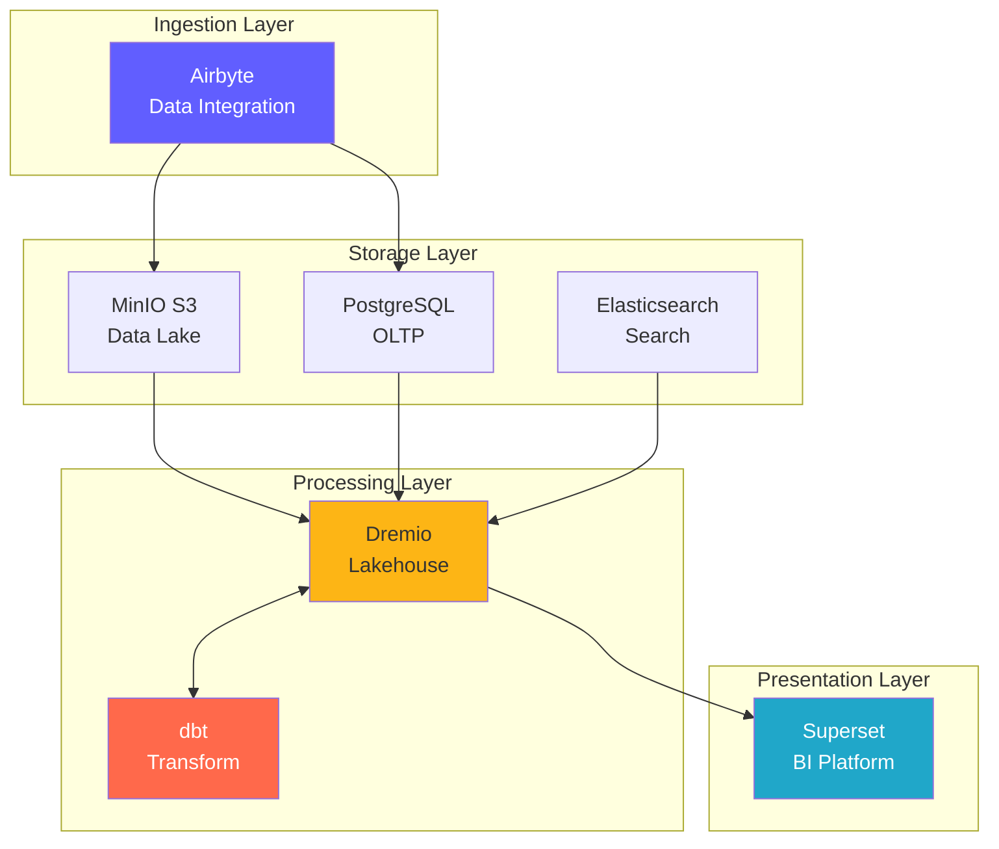
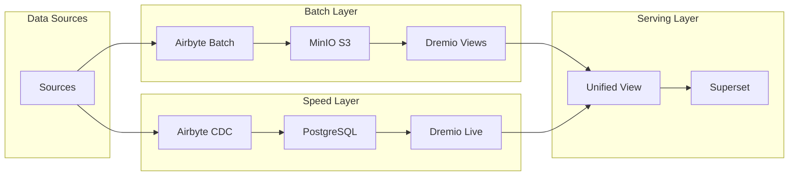
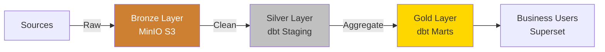
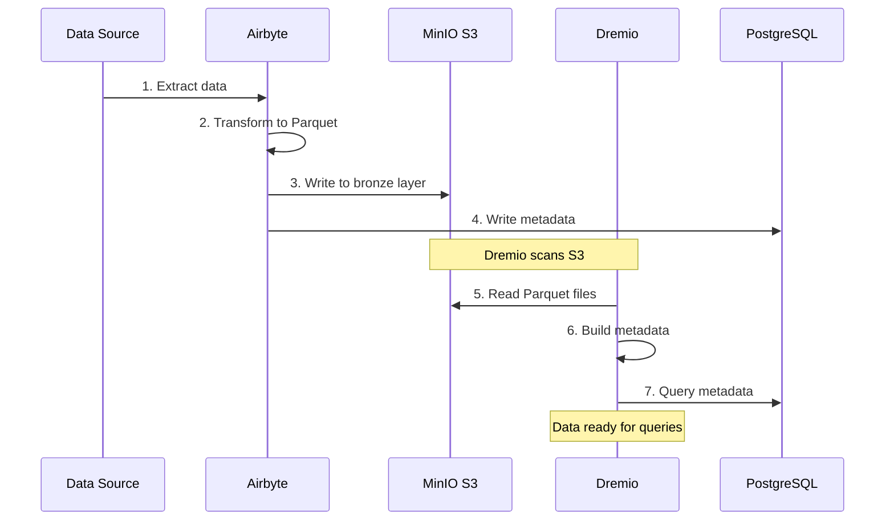
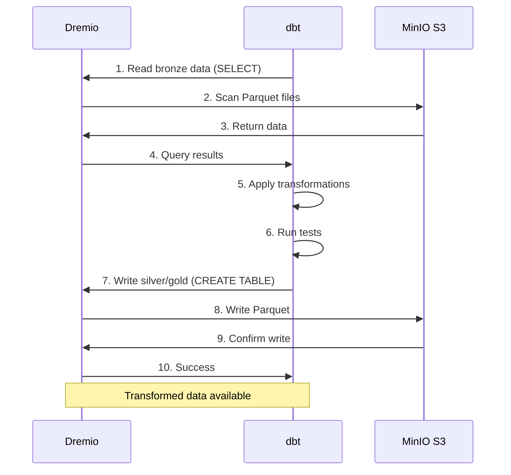
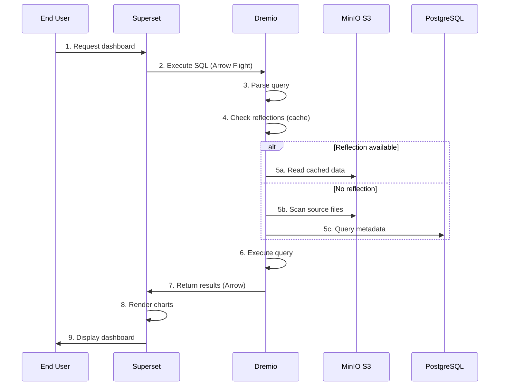
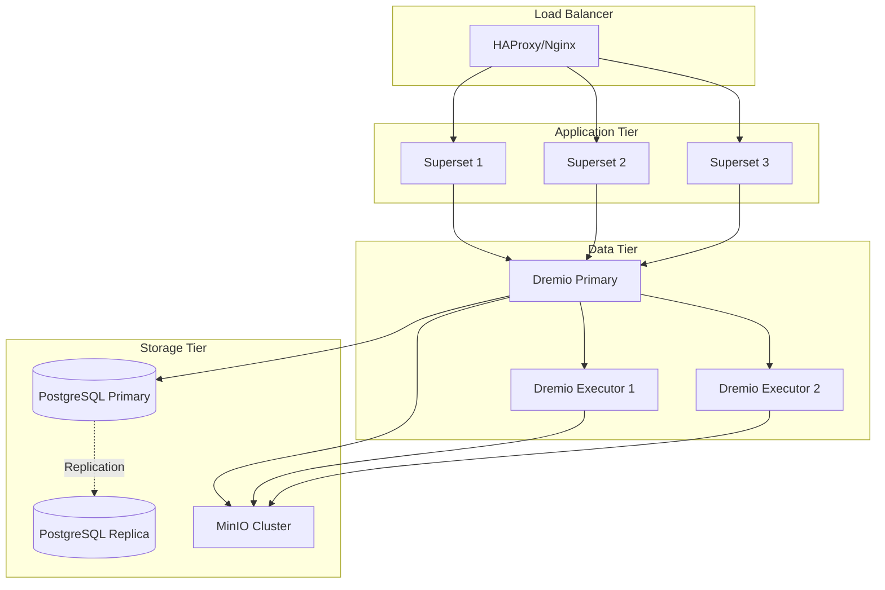
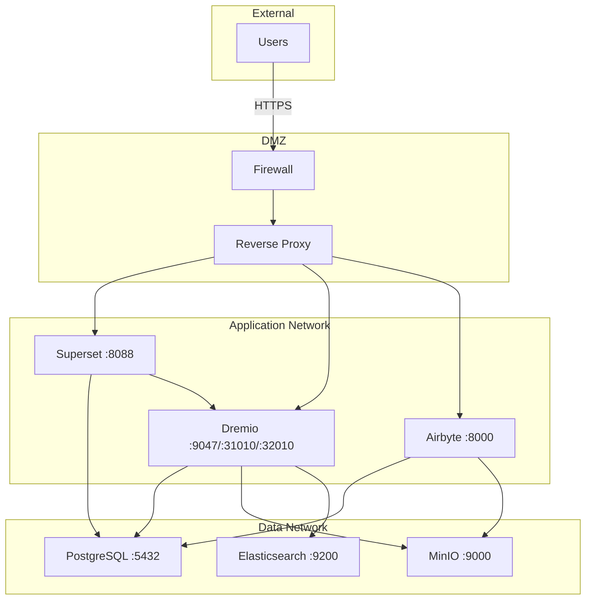
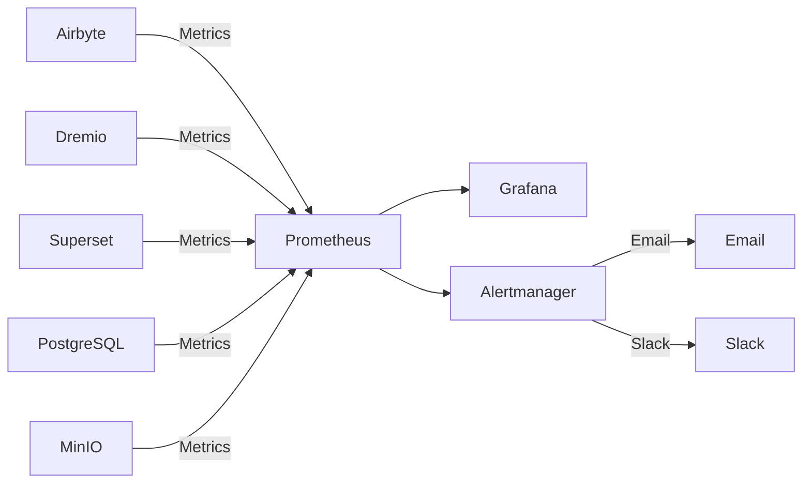

# Architecture Overview

**Version**: 3.2.0  
**Last Updated**: 2025-10-16  
**Language**: English

---

## Introduction

The data platform is a modern, cloud-native architecture built on open-source technologies. It provides a complete solution for data ingestion, storage, transformation, and visualization, designed for enterprise-scale analytics workloads.



---

## Design Principles

### 1. Open Source First

**Philosophy**: Use open-source technologies to avoid vendor lock-in and maintain flexibility.

**Benefits**:
- No licensing costs
- Community-driven development
- Full customization capability
- Transparent security auditing
- Wide ecosystem compatibility

### 2. Layered Architecture

**Philosophy**: Separate concerns into distinct layers for maintainability and scalability.

**Layers**:
```
┌─────────────────────────────────────┐
│     Presentation Layer              │  Superset (BI & Dashboards)
├─────────────────────────────────────┤
│     Semantic Layer                  │  Dremio (Query Engine)
├─────────────────────────────────────┤
│     Transformation Layer            │  dbt (Data Transformation)
├─────────────────────────────────────┤
│     Storage Layer                   │  MinIO, PostgreSQL, Elasticsearch
├─────────────────────────────────────┤
│     Ingestion Layer                 │  Airbyte (Data Integration)
└─────────────────────────────────────┘
```

### 3. ELT over ETL

**Philosophy**: Load raw data first, transform in the destination (ELT).

**Why ELT?**
- **Flexibility**: Transform data multiple ways without re-extraction
- **Performance**: Leverage destination compute for transformations
- **Auditability**: Raw data always available for verification
- **Cost**: Reduce extraction load on source systems

**Flow**:
```
Extract → Load → Transform
(Airbyte) (MinIO/PostgreSQL) (dbt + Dremio)
```

### 4. Data Lakehouse Pattern

**Philosophy**: Combine data lake flexibility with data warehouse performance.

**Characteristics**:
- **ACID transactions**: Reliable data operations
- **Schema enforcement**: Data quality guarantees
- **Time travel**: Query historical versions
- **Open formats**: Parquet, Iceberg, Delta Lake
- **Direct file access**: No proprietary lock-in

### 5. Cloud-Native Design

**Philosophy**: Design for containerized, distributed environments.

**Implementation**:
- Docker containers for all services
- Horizontal scalability
- Infrastructure as code
- Stateless where possible
- Configuration via environment variables

---

## Architecture Patterns

### Lambda Architecture (Batch + Stream)



**Batch Layer** (Historical Data):
- Large volumes of data
- Processed periodically (hourly/daily)
- High latency acceptable
- Complete reprocessing possible

**Speed Layer** (Real-time Data):
- Change Data Capture (CDC)
- Low latency required
- Incremental updates only
- Handles recent data

**Serving Layer**:
- Merges batch and speed views
- Single query interface (Dremio)
- Automatic view selection

### Medallion Architecture (Bronze → Silver → Gold)



**Bronze Layer** (Raw):
- Data as-is from sources
- No transformations
- Full history retained
- Airbyte loads here

**Silver Layer** (Cleaned):
- Data quality applied
- Standardized formats
- dbt staging models
- Ready for analytics

**Gold Layer** (Business):
- Aggregated metrics
- Business logic applied
- dbt mart models
- Optimized for consumption

---

## Component Interactions

### Data Ingestion Flow



### Transformation Pipeline



### Query Execution



---

## Scalability Patterns

### Horizontal Scaling

**Stateless Services** (can scale freely):
- Airbyte Workers: Scale for parallel syncs
- Dremio Executors: Scale for query performance
- Superset Web: Scale for user concurrency

**Stateful Services** (require coordination):
- PostgreSQL: Primary-replica replication
- MinIO: Distributed mode (multiple nodes)
- Elasticsearch: Cluster with sharding

### Vertical Scaling

**Memory-Intensive**:
- Dremio: Increase JVM heap for large queries
- PostgreSQL: More RAM for buffer cache
- Elasticsearch: More heap for indexing

**CPU-Intensive**:
- dbt: More cores for parallel model builds
- Airbyte: Faster data transformations

### Data Partitioning

```sql
-- Example: Partition by date
CREATE TABLE orders_partitioned (
    order_id INT,
    customer_id INT,
    amount DECIMAL,
    order_date DATE
)
PARTITION BY (DATE_TRUNC('month', order_date))
STORED AS PARQUET;

-- Query scans only relevant partitions
SELECT SUM(amount)
FROM orders_partitioned
WHERE order_date >= '2025-01-01'
  AND order_date < '2025-02-01';
-- Scans only January partition
```

---

## High Availability

### Service Redundancy



### Failure Scenarios

| Component | Failure | Recovery |
|-----------|---------|----------|
| **Airbyte Worker** | Container crash | Automatic restart, resume sync |
| **Dremio Executor** | Node failure | Query re-routes to other executors |
| **PostgreSQL** | Primary down | Promote replica to primary |
| **MinIO Node** | Disk failure | Erasure coding reconstructs data |
| **Superset** | Service down | Load balancer redirects traffic |

### Backup Strategy

```bash
# Daily automated backups
0 2 * * * /scripts/backup_all.sh

# backup_all.sh
#!/bin/bash

# Backup PostgreSQL
pg_dumpall -U postgres > /backups/postgres_$(date +%Y%m%d).sql

# Backup Dremio metadata
tar czf /backups/dremio_$(date +%Y%m%d).tar.gz /opt/dremio/data

# Sync MinIO to offsite S3
mc mirror MinIOLake/datalake s3-offsite/datalake-backup

# Retain 30 days
find /backups -mtime +30 -delete
```

---

## Security Architecture

### Network Security



### Authentication & Authorization

**Service Authentication**:
- **Dremio**: LDAP/AD integration, OAuth2, SAML
- **Superset**: Database auth, LDAP, OAuth2
- **Airbyte**: Basic auth, OAuth2 (enterprise)
- **MinIO**: IAM policies, STS tokens

**Authorization Levels**:
```yaml
Roles:
  - Admin:
      - Full access to all services
      - User management
      - Configuration changes
  
  - Data Engineer:
      - Create/modify data sources
      - Run Airbyte syncs
      - Execute dbt models
      - Create Dremio datasets
  
  - Analyst:
      - Read-only data access
      - Create Superset dashboards
      - Query Dremio datasets
  
  - Viewer:
      - View dashboards only
      - No data access
```

### Data Encryption

**At Rest**:
- MinIO: Server-side encryption (AES-256)
- PostgreSQL: Transparent data encryption (TDE)
- Elasticsearch: Encrypted indices

**In Transit**:
- TLS 1.3 for all inter-service communication
- Arrow Flight with TLS for Dremio ↔ Superset
- HTTPS for web interfaces

---

## Monitoring & Observability

### Metrics Collection



**Key Metrics**:
- **Airbyte**: Sync success rate, records synced, bytes transferred
- **Dremio**: Query latency, cache hit rate, resource utilization
- **dbt**: Model build time, test failures
- **Superset**: Dashboard load time, active users
- **Infrastructure**: CPU, memory, disk, network

### Logging

**Centralized Logging**:
```yaml
ELK Stack:
  - Elasticsearch: Store logs
  - Logstash: Process logs
  - Kibana: Visualize logs

Log Sources:
  - Application logs (JSON format)
  - Access logs
  - Audit logs
  - Error logs
```

### Tracing

**Distributed Tracing**:
- Jaeger or Zipkin integration
- Trace requests across services
- Identify bottlenecks
- Debug performance issues

---

## Deployment Topologies

### Development Environment

```yaml
Single Host:
  Resources: 8 GB RAM, 4 CPUs
  Services: All on one machine
  Storage: Local volumes
  Networking: Bridge network
  Use Case: Development, testing
```

### Staging Environment

```yaml
Multi-Host:
  Resources: 16 GB RAM, 8 CPUs per host
  Services: Split across 2-3 hosts
  Storage: Shared NFS or distributed MinIO
  Networking: Overlay network
  Use Case: Pre-production testing, UAT
```

### Production Environment

```yaml
Kubernetes Cluster:
  Resources: Auto-scaling based on load
  Services: Containerized, replicated
  Storage: Persistent volumes (SSD)
  Networking: Service mesh (Istio)
  High Availability: Multi-zone deployment
  Use Case: Production workloads
```

---

## Technology Selection Rationale

### Why Airbyte?

- **300+ connectors**: Pre-built integrations
- **Open source**: No vendor lock-in
- **Active community**: 12k+ GitHub stars
- **CDC support**: Real-time data capture
- **Normalization**: Built-in dbt integration

### Why Dremio?

- **Query acceleration**: 10-100x faster queries
- **Arrow Flight**: High-performance data transfer
- **Data lake compatibility**: No data movement
- **Self-service**: Business users can explore data
- **Cost-effective**: Reduce warehouse costs

### Why dbt?

- **SQL-based**: Familiar to analysts
- **Version control**: Git integration
- **Testing**: Built-in data quality tests
- **Documentation**: Auto-generated docs
- **Community**: 5k+ packages available

### Why Superset?

- **Modern UI**: Intuitive interface
- **SQL IDE**: Advanced query capabilities
- **Rich visualizations**: 50+ chart types
- **Extensible**: Custom plugins
- **Open source**: Apache foundation backed

### Why PostgreSQL?

- **Reliability**: ACID compliance
- **Performance**: Proven at scale
- **Features**: JSON, full-text search, extensions
- **Community**: Mature ecosystem
- **Cost**: Free and open source

### Why MinIO?

- **S3 compatibility**: Industry standard API
- **Performance**: High throughput
- **Erasure coding**: Data durability
- **Multi-cloud**: Deploy anywhere
- **Cost-effective**: Self-hosted alternative

---

## Future Architecture Evolution

### Planned Enhancements

1. **Data Catalog** (OpenMetadata integration)
   - Metadata management
   - Lineage tracking
   - Data discovery

2. **Data Quality** (Great Expectations)
   - Automated validation
   - Anomaly detection
   - Quality dashboards

3. **ML Operations** (MLflow)
   - Model training pipelines
   - Model registry
   - Deployment automation

4. **Stream Processing** (Apache Flink)
   - Real-time transformations
   - Complex event processing
   - Streaming analytics

5. **Data Governance** (Apache Atlas)
   - Policy enforcement
   - Access auditing
   - Compliance reporting

---

## References

- [Component Details](components.md)
- [Data Flow](data-flow.md)
- [Deployment Guide](deployment.md)
- [Airbyte Integration](../guides/airbyte-integration.md)

---

**Architecture Overview Version**: 3.2.0  
**Last Updated**: 2025-10-16  
**Maintained By**: Data Platform Team
