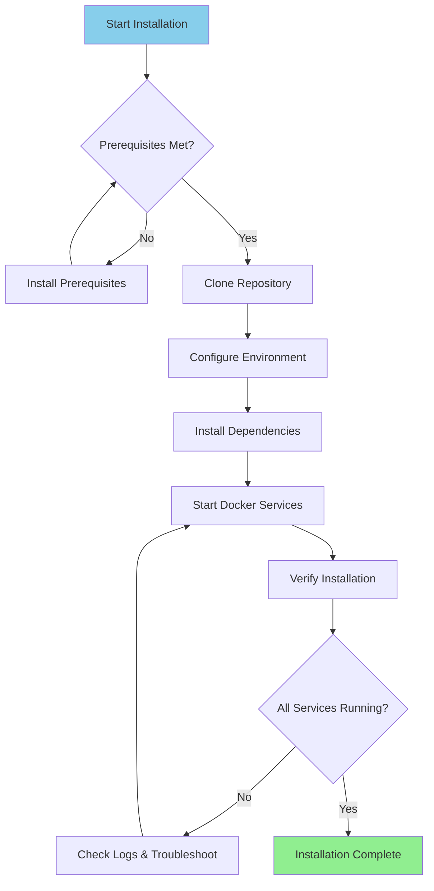

# Installation Guide

**Version**: 3.2.0  
**Last Updated**: 2025-10-16  
**Language**: English

---

## Overview

This guide provides step-by-step instructions for installing and setting up the complete data platform, including Airbyte, Dremio, dbt, Apache Superset, and supporting infrastructure.



---

## Prerequisites

### System Requirements

**Minimum Requirements:**
- **CPU**: 4 cores (8+ recommended)
- **RAM**: 8 GB (16+ GB recommended)
- **Disk Space**: 20 GB available (50+ GB recommended)
- **Network**: Stable internet connection for Docker images

**Operating Systems:**
- Linux (Ubuntu 20.04+, CentOS 8+, Debian 11+)
- macOS (11.0+)
- Windows 10/11 with WSL2

### Software Requirements

#### 1. Docker

**Version**: 20.10 or higher

**Installation:**

**Linux:**
```bash
# Install Docker
curl -fsSL https://get.docker.com -o get-docker.sh
sudo sh get-docker.sh

# Add user to docker group
sudo usermod -aG docker $USER

# Start Docker service
sudo systemctl start docker
sudo systemctl enable docker

# Verify installation
docker --version
```

**macOS:**
```bash
# Download and install Docker Desktop from:
# https://www.docker.com/products/docker-desktop

# Verify installation
docker --version
```

**Windows:**
```powershell
# Install WSL2 first
wsl --install

# Download and install Docker Desktop from:
# https://www.docker.com/products/docker-desktop

# Verify installation
docker --version
```

#### 2. Docker Compose

**Version**: 2.0 or higher

**Installation:**

```bash
# Linux
sudo curl -L "https://github.com/docker/compose/releases/latest/download/docker-compose-$(uname -s)-$(uname -m)" -o /usr/local/bin/docker-compose
sudo chmod +x /usr/local/bin/docker-compose

# Verify installation
docker-compose --version
```

**Note**: Docker Desktop for macOS and Windows includes Docker Compose.

#### 3. Python

**Version**: 3.11 or higher

**Installation:**

**Linux (Ubuntu/Debian):**
```bash
sudo apt update
sudo apt install python3.11 python3.11-venv python3-pip
```

**macOS:**
```bash
brew install python@3.11
```

**Windows:**
```powershell
# Download installer from python.org
# Or use winget:
winget install Python.Python.3.11
```

**Verify:**
```bash
python --version  # or python3 --version
pip --version     # or pip3 --version
```

#### 4. Git

**Installation:**

```bash
# Linux
sudo apt install git  # Ubuntu/Debian
sudo yum install git  # CentOS/RHEL

# macOS
brew install git

# Windows
winget install Git.Git
```

**Verify:**
```bash
git --version
```

---

## Installation Steps

### Step 1: Clone Repository

```bash
# Clone the repository
git clone https://github.com/your-org/dremiodbt.git

# Navigate to project directory
cd dremiodbt

# Verify contents
ls -la
```

**Expected structure:**
```
dremiodbt/
├── docker-compose.yml
├── docker-compose-airbyte.yml
├── README.md
├── requirements.txt
├── dbt/
├── dremio_connector/
├── docs/
└── scripts/
```

### Step 2: Configure Environment

#### Create Environment File

```bash
# Copy example environment file
cp .env.example .env

# Edit configuration (optional)
nano .env  # or use your preferred editor
```

#### Environment Variables

**Core Configuration:**
```bash
# Project
PROJECT_NAME=dremiodbt
ENVIRONMENT=development

# Docker Network
NETWORK_NAME=dremio_network

# PostgreSQL
POSTGRES_HOST=postgres
POSTGRES_PORT=5432
POSTGRES_DB=dremio_db
POSTGRES_USER=postgres
POSTGRES_PASSWORD=postgres123

# Dremio
DREMIO_VERSION=26.0
DREMIO_HTTP_PORT=9047
DREMIO_FLIGHT_PORT=32010
DREMIO_ADMIN_USER=admin
DREMIO_ADMIN_PASSWORD=admin123

# Airbyte
AIRBYTE_VERSION=0.50.33
AIRBYTE_HTTP_PORT=8000
AIRBYTE_API_PORT=8001

# Superset
SUPERSET_VERSION=3.0
SUPERSET_HTTP_PORT=8088
SUPERSET_ADMIN_USER=admin
SUPERSET_ADMIN_PASSWORD=admin

# MinIO
MINIO_VERSION=latest
MINIO_API_PORT=9000
MINIO_CONSOLE_PORT=9001
MINIO_ROOT_USER=minioadmin
MINIO_ROOT_PASSWORD=minioadmin123

# Elasticsearch
ELASTIC_VERSION=8.15.0
ELASTIC_HTTP_PORT=9200
```

### Step 3: Install Python Dependencies

#### Create Virtual Environment

```bash
# Create virtual environment
python -m venv venv

# Activate virtual environment
# Linux/macOS:
source venv/bin/activate

# Windows:
.\venv\Scripts\activate
```

#### Install Requirements

```bash
# Upgrade pip
pip install --upgrade pip

# Install dependencies
pip install -r requirements.txt

# Verify installation
pip list
```

**Key packages installed:**
- `pyarrow>=21.0.0` - Arrow Flight client
- `pandas>=2.3.0` - Data manipulation
- `dbt-core>=1.10.0` - Data transformation
- `sqlalchemy>=2.0.0` - Database connectivity
- `pyyaml>=6.0.0` - Configuration management

### Step 4: Start Docker Services

#### Start Core Services

```bash
# Start all services
docker-compose up -d

# Or use Makefile (if available)
make up
```

**Services started:**
- PostgreSQL (port 5432)
- Dremio (ports 9047, 32010)
- Apache Superset (port 8088)
- MinIO (ports 9000, 9001)
- Elasticsearch (port 9200)

#### Start Airbyte (Separate Compose)

```bash
# Start Airbyte services
docker-compose -f docker-compose-airbyte.yml up -d
```

**Airbyte services started:**
- Airbyte Server (port 8001)
- Airbyte Web UI (port 8000)
- Airbyte Worker
- Airbyte Temporal
- Airbyte Database

#### Check Service Status

```bash
# View running containers
docker-compose ps

# View all containers (including Airbyte)
docker ps

# View logs
docker-compose logs -f

# View Airbyte logs
docker-compose -f docker-compose-airbyte.yml logs -f
```

---

## Verification

### Step 5: Verify Services

#### 1. PostgreSQL

```bash
# Test connection
docker exec -it postgres psql -U postgres -d dremio_db -c "SELECT version();"
```

**Expected output:**
```
PostgreSQL 16.x on x86_64-pc-linux-gnu
```

#### 2. Dremio

**Web UI:**
```
http://localhost:9047
```

**First login:**
- Username: `admin`
- Password: `admin123`
- You'll be prompted to create an admin account on first access

**Test connection:**
```bash
# Test HTTP endpoint
curl http://localhost:9047/apiv2/login
```

#### 3. Airbyte

**Web UI:**
```
http://localhost:8000
```

**Default credentials:**
- Email: `airbyte@example.com`
- Password: `password`

**Test API:**
```bash
# Health check
curl http://localhost:8001/health
```

**Expected response:**
```json
{
  "status": "ok",
  "timestamp": "2025-10-16T12:00:00Z"
}
```

#### 4. Apache Superset

**Web UI:**
```
http://localhost:8088
```

**Default credentials:**
- Username: `admin`
- Password: `admin`

**Test connection:**
```bash
curl http://localhost:8088/health
```

#### 5. MinIO

**Console UI:**
```
http://localhost:9001
```

**Credentials:**
- Username: `minioadmin`
- Password: `minioadmin123`

**Test S3 API:**
```bash
# Install MinIO client
wget https://dl.min.io/client/mc/release/linux-amd64/mc
chmod +x mc

# Configure
./mc alias set local http://localhost:9000 minioadmin minioadmin123

# Test
./mc ls local
```

#### 6. Elasticsearch

**Test connection:**
```bash
# Health check
curl http://localhost:9200/_cluster/health

# Get info
curl http://localhost:9200
```

**Expected response:**
```json
{
  "name": "elasticsearch",
  "cluster_name": "docker-cluster",
  "version": {
    "number": "8.15.0"
  }
}
```

### Step 6: Run Health Checks

```bash
# Run comprehensive health check script
python scripts/health_check.py

# Or use Makefile
make health-check
```

**Expected output:**
```
✓ PostgreSQL: Running (port 5432)
✓ Dremio: Running (ports 9047, 32010)
✓ Airbyte: Running (ports 8000, 8001)
✓ Superset: Running (port 8088)
✓ MinIO: Running (ports 9000, 9001)
✓ Elasticsearch: Running (port 9200)

All services are healthy!
```

---

## Post-Installation Configuration

### 1. Initialize Dremio

```bash
# Run initialization script
python scripts/init_dremio.py
```

**Creates:**
- Admin user
- Default sources (PostgreSQL, MinIO)
- Sample datasets

### 2. Initialize Superset

```bash
# Initialize database
docker exec -it superset superset db upgrade

# Create admin user (if not exists)
docker exec -it superset superset fab create-admin \
    --username admin \
    --firstname Admin \
    --lastname User \
    --email admin@example.com \
    --password admin

# Initialize Superset
docker exec -it superset superset init
```

### 3. Configure dbt

```bash
# Navigate to dbt directory
cd dbt

# Test connection
dbt debug

# Run initial models
dbt run

# Run tests
dbt test
```

### 4. Configure Airbyte

**Via Web UI (http://localhost:8000):**

1. Complete setup wizard
2. Configure first source (e.g., PostgreSQL)
3. Configure destination (e.g., MinIO S3)
4. Create connection
5. Run first sync

**Via API:**
```bash
# See docs/i18n/en/guides/airbyte-integration.md for details
python scripts/configure_airbyte.py
```

---

## Directory Structure After Installation

```
dremiodbt/
├── venv/                          # Python virtual environment
├── data/                          # Local data storage
│   ├── dremio/                    # Dremio metadata
│   ├── postgres/                  # PostgreSQL data
│   └── minio/                     # MinIO data
├── logs/                          # Application logs
│   ├── dremio.log
│   ├── airbyte.log
│   ├── superset.log
│   └── dbt.log
├── dbt/
│   ├── models/                    # dbt models
│   ├── tests/                     # dbt tests
│   ├── target/                    # Compiled SQL
│   └── logs/                      # dbt logs
└── docker-volume/                 # Docker persistent volumes
    ├── db-data/                   # Database data
    ├── minio-data/                # Object storage
    └── elastic-data/              # Search index
```

---

## Troubleshooting

### Common Issues

#### 1. Port Already in Use

**Error:**
```
Error: bind: address already in use
```

**Solution:**
```bash
# Find process using port (example: 9047)
sudo lsof -i :9047

# Kill process
sudo kill -9 <PID>

# Or change port in docker-compose.yml
```

#### 2. Insufficient Memory

**Error:**
```
ERROR: Insufficient memory available
```

**Solution:**
```bash
# Increase Docker memory allocation
# Docker Desktop: Settings > Resources > Memory (16GB recommended)

# Linux: Edit /etc/docker/daemon.json
{
  "default-ulimits": {
    "memlock": {
      "Hard": -1,
      "Name": "memlock",
      "Soft": -1
    }
  }
}

# Restart Docker
sudo systemctl restart docker
```

#### 3. Services Not Starting

**Check logs:**
```bash
# View all service logs
docker-compose logs

# View specific service
docker-compose logs dremio
docker-compose logs airbyte-server

# Follow logs in real-time
docker-compose logs -f
```

#### 4. Network Issues

**Reset Docker network:**
```bash
# Stop all services
docker-compose down
docker-compose -f docker-compose-airbyte.yml down

# Remove network
docker network rm dremio_network

# Restart services
docker-compose up -d
docker-compose -f docker-compose-airbyte.yml up -d
```

#### 5. Permission Issues (Linux)

**Solution:**
```bash
# Fix data directory permissions
sudo chown -R $USER:$USER data/ docker-volume/

# Fix Docker socket permissions
sudo chmod 666 /var/run/docker.sock
```

---

## Uninstallation

### Stop Services

```bash
# Stop main services
docker-compose down

# Stop Airbyte
docker-compose -f docker-compose-airbyte.yml down
```

### Remove Data (Optional)

```bash
# Remove volumes (WARNING: Deletes all data)
docker-compose down -v
docker-compose -f docker-compose-airbyte.yml down -v

# Remove local data directories
rm -rf data/ docker-volume/ logs/
```

### Remove Docker Images

```bash
# List images
docker images | grep dremio

# Remove specific images
docker rmi dremio/dremio-oss:24.0
docker rmi airbyte/server:0.50.33
docker rmi apache/superset:3.0

# Remove all unused images
docker image prune -a
```

---

## Next Steps

After successful installation:

1. **Configure Data Sources** - See [Configuration Guide](configuration.md)
2. **First Steps Tutorial** - See [First Steps](first-steps.md)
3. **Airbyte Setup** - See [Airbyte Integration Guide](../guides/airbyte-integration.md)
4. **Dremio Setup** - See [Dremio Setup Guide](../guides/dremio-setup.md)
5. **Create dbt Models** - See [dbt Development Guide](../guides/dbt-development.md)
6. **Build Dashboards** - See [Superset Dashboards Guide](../guides/superset-dashboards.md)

---

## Support

For installation issues:

- **Documentation**: [Troubleshooting Guide](../guides/troubleshooting.md)
- **GitHub Issues**: https://github.com/your-org/dremiodbt/issues
- **Community**: https://github.com/your-org/dremiodbt/discussions

---

**Installation Guide Version**: 3.2.0  
**Last Updated**: 2025-10-16  
**Maintained By**: Data Platform Team
