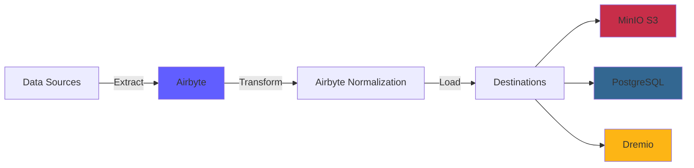
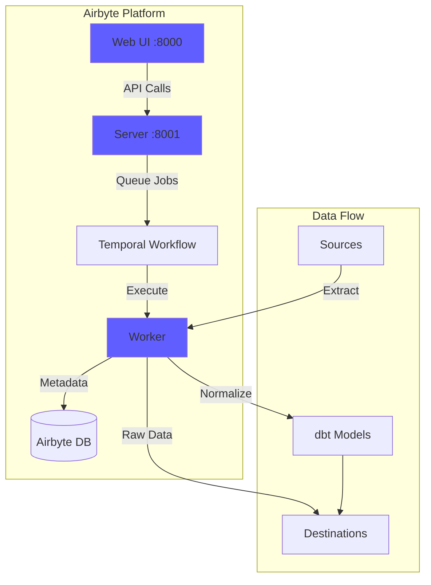
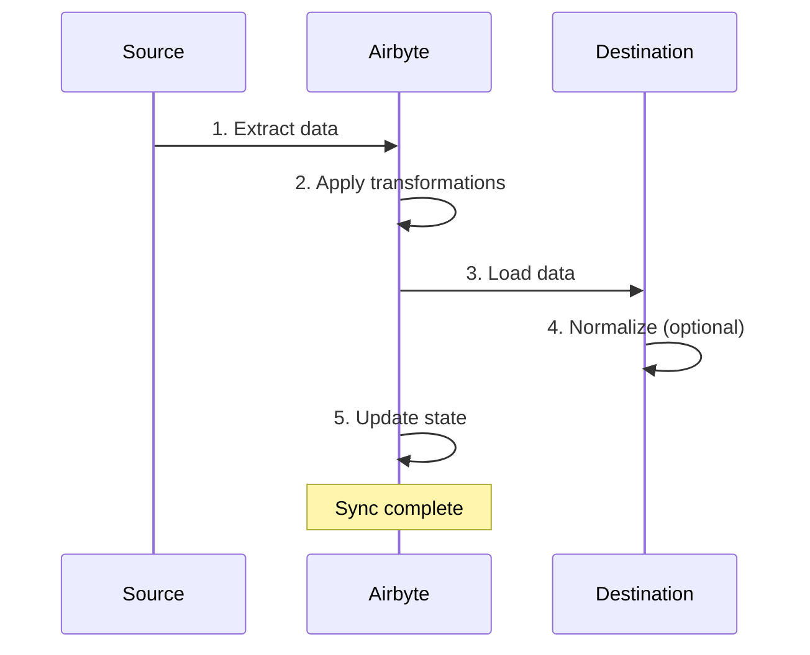
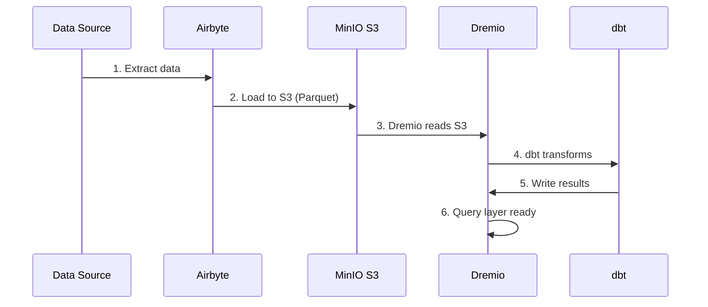

# Airbyte Integration Guide

**Version**: 3.2.0  
**Last Updated**: 2025-10-16  
**Language**: English

---

## Overview

Airbyte is an open-source data integration platform that simplifies moving data from various sources to destinations. This guide covers integrating Airbyte into the data platform, configuring connectors, and establishing data pipelines.



---

## What is Airbyte?

### Key Features

- **300+ Pre-built Connectors**: APIs, databases, files, SaaS applications
- **Open Source**: Self-hosted with full control over data
- **Change Data Capture (CDC)**: Real-time data synchronization
- **Custom Connectors**: Build connectors using Python or low-code CDK
- **Data Normalization**: Transform raw JSON into structured tables
- **Monitoring & Alerting**: Track sync status and data quality

### Architecture



---

## Installation

### Quick Start

Airbyte is included in the platform. Start it with:

```bash
# Start Airbyte services
docker-compose -f docker-compose-airbyte.yml up -d

# Check status
docker-compose -f docker-compose-airbyte.yml ps

# View logs
docker-compose -f docker-compose-airbyte.yml logs -f
```

### Services Started

| Service | Port | Description |
|---------|------|-------------|
| **airbyte-webapp** | 8000 | Web user interface |
| **airbyte-server** | 8001 | API server |
| **airbyte-worker** | - | Job execution engine |
| **airbyte-temporal** | 7233 | Workflow orchestration |
| **airbyte-db** | 5432 | Metadata database (PostgreSQL) |

### First Access

**Web UI:**
```
http://localhost:8000
```

**Default credentials:**
- **Email**: `airbyte@example.com`
- **Password**: `password`

**Change password** on first login for security.

---

## Configuration

### Setup Wizard

On first access, complete the setup wizard:

1. **Email Preferences**: Configure notifications
2. **Data Residency**: Select data storage location
3. **Anonymous Usage Stats**: Opt-in/out of telemetry

### Workspace Settings

Navigate to **Settings > Workspace**:

```yaml
Workspace Name: Production Data Platform
Workspace ID: default
Namespace Definition: Destination Default
Namespace Format: ${SOURCE_NAMESPACE}
```

### Resource Limits

**File**: `config/airbyte/config.yaml`

```yaml
# Resource allocation per connector
resources:
  source:
    cpu_limit: "1.0"
    memory_limit: "1Gi"
    cpu_request: "0.25"
    memory_request: "256Mi"
  
  destination:
    cpu_limit: "1.0"
    memory_limit: "1Gi"
    cpu_request: "0.25"
    memory_request: "256Mi"
  
  orchestrator:
    cpu_limit: "0.5"
    memory_limit: "512Mi"
```

---

## Connectors

### Source Connectors

#### PostgreSQL Source

**Use Case**: Extract data from transactional database

**Configuration:**

1. Navigate to **Sources > New Source**
2. Select **PostgreSQL**
3. Configure connection:

```yaml
Host: postgres
Port: 5432
Database: source_db
Username: readonly_user
Password: [SECURE_PASSWORD]
SSL Mode: prefer

Replication Method: Standard
  # Or CDC for real-time changes:
  # Replication Method: Logical Replication (CDC)
```

**Test Connection** → **Set up source**

#### REST API Source

**Use Case**: Extract data from APIs

**Configuration:**

```yaml
Name: External API
URL Base: https://api.example.com/v1
Authentication:
  Type: Bearer Token
  Token: [API_TOKEN]

Endpoints:
  - name: customers
    path: /customers
    http_method: GET
    
  - name: orders
    path: /orders
    http_method: GET
    params:
      start_date: "{{ config['start_date'] }}"
```

#### File Source (CSV)

**Use Case**: Import CSV files

**Configuration:**

```yaml
Dataset Name: sales_data
URL: https://storage.example.com/sales.csv
Format: CSV
Provider:
  Storage: HTTPS
  User Provided Storage:
    URL: https://storage.example.com/sales.csv
```

#### Common Sources

| Source | Use Case | CDC Support |
|--------|----------|-------------|
| **PostgreSQL** | Transactional DB | ✅ Yes |
| **MySQL** | Transactional DB | ✅ Yes |
| **MongoDB** | NoSQL documents | ✅ Yes |
| **Salesforce** | CRM data | ❌ No |
| **Google Sheets** | Spreadsheets | ❌ No |
| **Stripe** | Payment data | ❌ No |
| **REST API** | Custom APIs | ❌ No |
| **S3** | File storage | ❌ No |

### Destination Connectors

#### MinIO S3 Destination

**Use Case**: Store raw data in data lake

**Configuration:**

1. Navigate to **Destinations > New Destination**
2. Select **S3**
3. Configure connection:

```yaml
S3 Bucket Name: datalake
S3 Bucket Path: airbyte-data/${NAMESPACE}/${STREAM_NAME}
S3 Bucket Region: us-east-1

# MinIO endpoint
S3 Endpoint: http://minio:9000
Access Key ID: [MINIO_ROOT_USER]
Secret Access Key: [MINIO_ROOT_PASSWORD]

Output Format:
  Format Type: Parquet
  Compression: GZIP
  Block Size: 128MB
```

**Test Connection** → **Set up destination**

#### PostgreSQL Destination

**Use Case**: Load transformed data for analytics

**Configuration:**

```yaml
Host: postgres
Port: 5432
Database: analytics_db
Username: analytics_user
Password: [SECURE_PASSWORD]
Default Schema: public

Normalization:
  Mode: Basic
  # Creates normalized tables from nested JSON
```

#### Dremio Destination

**Use Case**: Direct load into data lakehouse

**Configuration:**

```yaml
Host: dremio
Port: 32010
Project: Production
Dataset: airbyte_data
Username: dremio_user
Password: [DREMIO_PASSWORD]

Connection Type: Arrow Flight
SSL: false
```

---

## Connections

### Create Connection

A connection links a source to a destination.



#### Step-by-Step

1. **Navigate to Connections > New Connection**

2. **Select Source**: Choose configured source (e.g., PostgreSQL)

3. **Select Destination**: Choose destination (e.g., MinIO S3)

4. **Configure Sync**:

```yaml
Connection Name: PostgreSQL → MinIO
Replication Frequency: Every 24 hours
Destination Namespace: Custom
  Namespace Format: production_${SOURCE_NAMESPACE}

Streams:
  - customers
    Sync Mode: Full Refresh | Overwrite
    Cursor Field: updated_at
    Primary Key: customer_id
    
  - orders
    Sync Mode: Incremental | Append
    Cursor Field: created_at
    Primary Key: order_id
    
  - products
    Sync Mode: Full Refresh | Overwrite
    Primary Key: product_id
```

5. **Configure Normalization** (optional):

```yaml
Normalization:
  Enable: true
  Option: Basic Normalization
  # Converts nested JSON to flat tables
```

6. **Test Connection** → **Set up connection**

### Sync Modes

| Mode | Description | Use Case |
|------|-------------|----------|
| **Full Refresh \| Overwrite** | Replace all data | Dimension tables |
| **Full Refresh \| Append** | Add all records | Historical tracking |
| **Incremental \| Append** | Add new/updated records | Fact tables |
| **Incremental \| Deduped** | Update existing records | SCD Type 1 |

### Scheduling

**Frequency Options:**
- **Manual**: Trigger manually
- **Hourly**: Every hour
- **Daily**: Every 24 hours (specify time)
- **Weekly**: Specific days of week
- **Cron**: Custom schedule (e.g., `0 2 * * *`)

**Example Schedules:**
```yaml
# Every 6 hours
Cron: 0 */6 * * *

# Weekdays at 2 AM
Cron: 0 2 * * 1-5

# First day of month
Cron: 0 0 1 * *
```

---

## Data Transformation

### Basic Normalization

Airbyte includes **Basic Normalization** using dbt:

**What it does:**
- Converts nested JSON to flat tables
- Creates `_airbyte_raw_*` tables (raw JSON)
- Creates normalized tables (structured)
- Adds metadata columns (`_airbyte_emitted_at`, `_airbyte_normalized_at`)

**Example:**

**Raw JSON** (`_airbyte_raw_customers`):
```json
{
  "_airbyte_ab_id": "uuid-123",
  "_airbyte_emitted_at": "2025-10-16T10:00:00Z",
  "_airbyte_data": {
    "id": 1,
    "name": "Acme Corp",
    "contact": {
      "email": "info@acme.com",
      "phone": "+1234567890"
    },
    "addresses": [
      {"type": "billing", "city": "New York"},
      {"type": "shipping", "city": "Boston"}
    ]
  }
}
```

**Normalized Tables:**

`customers`:
```sql
id | name | contact_email | contact_phone | _airbyte_normalized_at
1 | Acme Corp | info@acme.com | +1234567890 | 2025-10-16 10:05:00
```

`customers_addresses`:
```sql
_airbyte_customers_hashid | type | city
hash-123 | billing | New York
hash-123 | shipping | Boston
```

### Custom Transformations (dbt)

For advanced transformations, use dbt:

1. **Disable Airbyte Normalization**
2. **Create dbt models** referencing `_airbyte_raw_*` tables
3. **Run dbt** after Airbyte sync

**Example dbt model:**
```sql
-- models/staging/stg_customers.sql
with source as (
    select * from {{ source('airbyte_raw', '_airbyte_raw_customers') }}
),

parsed as (
    select
        _airbyte_ab_id,
        _airbyte_emitted_at,
        (_airbyte_data->>'id')::int as customer_id,
        _airbyte_data->>'name' as customer_name,
        _airbyte_data->'contact'->>'email' as email,
        _airbyte_data->'contact'->>'phone' as phone
    from source
)

select * from parsed
```

---

## Monitoring

### Sync Status

**Web UI Dashboard:**
- **Connections**: View all connections
- **Sync History**: Past sync jobs
- **Sync Logs**: Detailed logs per job

**Status Indicators:**
- 🟢 **Succeeded**: Sync completed successfully
- 🔴 **Failed**: Sync failed (check logs)
- 🟡 **Running**: Sync in progress
- ⚪ **Cancelled**: Sync cancelled by user

### Logs

**View sync logs:**
```bash
# Airbyte server logs
docker-compose -f docker-compose-airbyte.yml logs airbyte-server

# Worker logs (actual sync execution)
docker-compose -f docker-compose-airbyte.yml logs airbyte-worker

# Specific job logs
# Available in Web UI: Connections > [Connection] > Job History > [Job]
```

### Metrics

**Key metrics to monitor:**
- **Records Synced**: Number of records per sync
- **Bytes Synced**: Data volume transferred
- **Sync Duration**: Time taken per sync
- **Failure Rate**: Percentage of failed syncs

**Export metrics:**
```bash
# Airbyte API
curl -X GET "http://localhost:8001/api/v1/jobs/list" \
  -H "Content-Type: application/json" \
  -d '{
    "configTypes": ["sync"],
    "configId": "connection-id"
  }'
```

### Alerting

**Configure alerts** in **Settings > Notifications**:

```yaml
Notification Type: Slack
Webhook URL: https://hooks.slack.com/services/YOUR/WEBHOOK/URL

Events:
  - Sync Failed
  - Sync Succeeded (optional)
  - Connection Disabled

Conditions:
  - Failure threshold: 3 consecutive failures
```

---

## API Usage

### Authentication

```bash
# No authentication required for localhost
# For production, configure auth in docker-compose-airbyte.yml
```

### Common API Calls

#### List Sources

```bash
curl -X POST "http://localhost:8001/api/v1/sources/list" \
  -H "Content-Type: application/json" \
  -d '{
    "workspaceId": "workspace-id"
  }'
```

#### Create Connection

```bash
curl -X POST "http://localhost:8001/api/v1/connections/create" \
  -H "Content-Type: application/json" \
  -d '{
    "sourceId": "source-id",
    "destinationId": "destination-id",
    "syncCatalog": {
      "streams": [
        {
          "stream": {
            "name": "customers",
            "jsonSchema": {...}
          },
          "config": {
            "syncMode": "incremental",
            "destinationSyncMode": "append",
            "cursorField": ["updated_at"]
          }
        }
      ]
    },
    "schedule": {
      "units": 24,
      "timeUnit": "hours"
    }
  }'
```

#### Trigger Sync

```bash
curl -X POST "http://localhost:8001/api/v1/connections/sync" \
  -H "Content-Type: application/json" \
  -d '{
    "connectionId": "connection-id"
  }'
```

#### Get Job Status

```bash
curl -X POST "http://localhost:8001/api/v1/jobs/get" \
  -H "Content-Type: application/json" \
  -d '{
    "id": "job-id"
  }'
```

---

## Integration with Dremio

### Workflow



### Configuration Steps

1. **Configure Airbyte to load to MinIO S3** (see above)

2. **Add S3 source in Dremio:**

```sql
-- In Dremio UI: Sources > Add Source > S3
Source Name: AirbyteData
Authentication: AWS Access Key
Access Key: [MINIO_ROOT_USER]
Secret Key: [MINIO_ROOT_PASSWORD]
Root Path: /
Connection Properties:
  fs.s3a.endpoint: minio:9000
  fs.s3a.path.style.access: true
  dremio.s3.compat: true
```

3. **Query Airbyte data in Dremio:**

```sql
-- Browse S3 structure
SELECT * FROM AirbyteData.datalake."airbyte-data"

-- Query specific table
SELECT *
FROM AirbyteData.datalake."airbyte-data".production_public.customers
LIMIT 100
```

4. **Create Dremio Virtual Dataset:**

```sql
CREATE VDS airbyte_customers AS
SELECT
  id as customer_id,
  name as customer_name,
  contact_email as email,
  contact_phone as phone,
  _airbyte_emitted_at as last_updated
FROM AirbyteData.datalake."airbyte-data".production_public.customers
```

5. **Use in dbt models:**

```yaml
# dbt/models/sources.yml
sources:
  - name: airbyte
    schema: AirbyteData.datalake."airbyte-data".production_public
    tables:
      - name: customers
      - name: orders
      - name: products
```

---

## Best Practices

### Performance

1. **Use Incremental Syncs** where possible
2. **Schedule syncs during off-peak hours**
3. **Use Parquet format** for better compression
4. **Partition large tables** by date
5. **Monitor resource usage** and adjust limits

### Data Quality

1. **Enable data validation** in source connectors
2. **Use primary keys** to detect duplicates
3. **Set up alerts** for sync failures
4. **Monitor data freshness** metrics
5. **Implement dbt tests** on raw data

### Security

1. **Use read-only credentials** for sources
2. **Store secrets** in environment variables
3. **Enable SSL/TLS** for connections
4. **Rotate credentials** regularly
5. **Audit access logs** periodically

### Cost Optimization

1. **Use compression** (GZIP, SNAPPY)
2. **Deduplicate data** at source
3. **Archive old data** to cold storage
4. **Monitor sync frequency** vs. requirements
5. **Clean up failed sync data**

---

## Troubleshooting

### Common Issues

#### Sync Failure: Connection Timeout

**Symptom:**
```
Failed to connect to source: Connection timeout
```

**Solution:**
```bash
# Check network connectivity
docker exec airbyte-worker ping postgres

# Check firewall rules
# Verify source host/port in configuration
```

#### Out of Memory Error

**Symptom:**
```
OOMKilled: Container exceeded memory limit
```

**Solution:**
```yaml
# Increase memory limits in docker-compose-airbyte.yml
services:
  airbyte-worker:
    environment:
      - JOB_MAIN_CONTAINER_MEMORY_LIMIT=2Gi
      - JOB_MAIN_CONTAINER_MEMORY_REQUEST=1Gi
```

#### Normalization Fails

**Symptom:**
```
Normalization failed: dbt compilation error
```

**Solution:**
```bash
# Check dbt logs
docker-compose -f docker-compose-airbyte.yml logs airbyte-worker | grep dbt

# Disable normalization and use custom dbt
# Better control over transformation logic
```

#### Slow Sync Performance

**Diagnosis:**
```bash
# Check sync logs for bottleneck
# Common causes:
# - Large data volume
# - Slow source query
# - Network latency
# - Insufficient resources
```

**Solutions:**
- Increase incremental sync frequency
- Add indexes on cursor fields
- Use CDC for real-time sources
- Scale worker resources

---

## Advanced Topics

### Custom Connectors

Build custom connectors using Airbyte CDK:

```bash
# Clone connector template
git clone https://github.com/airbytehq/airbyte.git
cd airbyte/airbyte-integrations/connector-templates/python

# Create new connector
./create_connector.sh MyCustomAPI

# Implement connector logic
# Edit source.py, spec.yaml, schemas/

# Test locally
python main.py check --config secrets/config.json
python main.py discover --config secrets/config.json
python main.py read --config secrets/config.json --catalog integration_tests/configured_catalog.json
```

### API Orchestration

Automate Airbyte with Python:

```python
import requests

AIRBYTE_API = "http://localhost:8001/api/v1"

def trigger_sync(connection_id: str):
    """Trigger manual sync for connection"""
    response = requests.post(
        f"{AIRBYTE_API}/connections/sync",
        json={"connectionId": connection_id}
    )
    return response.json()

def get_sync_status(job_id: str):
    """Check sync job status"""
    response = requests.post(
        f"{AIRBYTE_API}/jobs/get",
        json={"id": job_id}
    )
    return response.json()

# Usage
job = trigger_sync("my-connection-id")
status = get_sync_status(job["job"]["id"])
print(f"Sync status: {status['job']['status']}")
```

---

## Resources

### Documentation

- **Airbyte Docs**: https://docs.airbyte.com
- **Connector Catalog**: https://docs.airbyte.com/integrations
- **API Reference**: https://airbyte-public-api-docs.s3.us-east-2.amazonaws.com/rapidoc-api-docs.html

### Community

- **Slack**: https://slack.airbyte.io
- **GitHub**: https://github.com/airbytehq/airbyte
- **Forum**: https://discuss.airbyte.io

---

## Next Steps

After setting up Airbyte:

1. **Configure Dremio** - [Dremio Setup Guide](dremio-setup.md)
2. **Create dbt Models** - [dbt Development Guide](dbt-development.md)
3. **Build Dashboards** - [Superset Dashboards Guide](superset-dashboards.md)
4. **Monitor Quality** - [Data Quality Guide](data-quality.md)

---

**Airbyte Integration Guide Version**: 3.2.0  
**Last Updated**: 2025-10-16  
**Maintained By**: Data Platform Team
