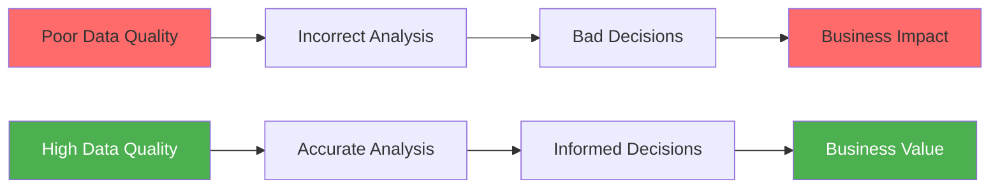
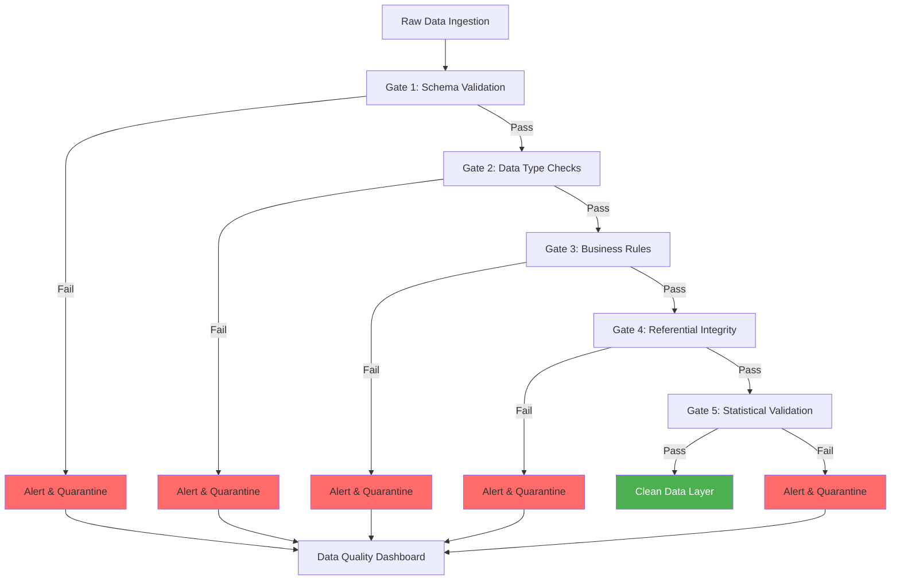

# Data Quality Guide

**Version**: 3.2.0  
**Last Updated**: October 16, 2025  
**Language**: English

## Table of Contents

1. [Overview](#overview)
2. [Data Quality Framework](#data-quality-framework)
3. [dbt Testing](#dbt-testing)
4. [Great Expectations Integration](#great-expectations-integration)
5. [Data Validation Rules](#data-validation-rules)
6. [Monitoring and Alerting](#monitoring-and-alerting)
7. [Data Quality Metrics](#data-quality-metrics)
8. [Remediation Strategies](#remediation-strategies)
9. [Best Practices](#best-practices)
10. [Case Studies](#case-studies)

---

## Overview

Data quality is critical for reliable analytics and decision-making. This guide covers comprehensive strategies for ensuring, monitoring, and improving data quality across the entire platform.

### Why Data Quality Matters



### Data Quality Dimensions

| Dimension | Description | Example Check |
|-----------|-------------|---------------|
| **Accuracy** | Data correctly represents reality | Email format validation |
| **Completeness** | No missing required values | NOT NULL checks |
| **Consistency** | Data matches across systems | Foreign key relationships |
| **Timeliness** | Data is current and available when needed | Freshness checks |
| **Validity** | Data conforms to business rules | Value range checks |
| **Uniqueness** | No duplicate records | Primary key uniqueness |

---

## Data Quality Framework

### Quality Gates Architecture



### Quality Layers

```
Bronze Layer (Raw)
├── Schema validation only
└── All data accepted

Silver Layer (Cleaned)
├── Data type validation
├── Format standardization
├── Null handling
└── Duplicate removal

Gold Layer (Curated)
├── Business rule validation
├── Referential integrity
├── Metric validation
└── Quality scoring
```

---

## dbt Testing

### Built-in Tests

#### Generic Tests

```yaml
# models/staging/schema.yml
version: 2

models:
  - name: stg_customers
    description: Cleaned customer data
    columns:
      - name: customer_id
        description: Primary key
        tests:
          - unique:
              config:
                severity: error
                error_if: ">= 1"
          - not_null:
              config:
                severity: error
                
      - name: email
        description: Customer email address
        tests:
          - not_null
          - unique
          - dbt_utils.expression_is_true:
              expression: "LIKE '%@%.%'"
              config:
                severity: warn
                
      - name: state
        description: US state code
        tests:
          - accepted_values:
              values: ['AL', 'AK', 'AZ', 'AR', 'CA', 'CO', 'CT', 'DE', 'FL', 'GA',
                       'HI', 'ID', 'IL', 'IN', 'IA', 'KS', 'KY', 'LA', 'ME', 'MD',
                       'MA', 'MI', 'MN', 'MS', 'MO', 'MT', 'NE', 'NV', 'NH', 'NJ',
                       'NM', 'NY', 'NC', 'ND', 'OH', 'OK', 'OR', 'PA', 'RI', 'SC',
                       'SD', 'TN', 'TX', 'UT', 'VT', 'VA', 'WA', 'WV', 'WI', 'WY']
              quote: true
              config:
                severity: warn
                
      - name: created_at
        description: Account creation timestamp
        tests:
          - not_null
          - dbt_utils.expression_is_true:
              expression: ">= '2020-01-01'"
              config:
                severity: error
          - dbt_utils.expression_is_true:
              expression: "<= CURRENT_TIMESTAMP"
              config:
                severity: error
                
      - name: lifetime_value
        description: Total customer spend
        tests:
          - dbt_utils.expression_is_true:
              expression: ">= 0"
              config:
                severity: error
```

#### Relationship Tests

```yaml
# models/staging/schema.yml
models:
  - name: stg_orders
    columns:
      - name: customer_id
        tests:
          - relationships:
              to: ref('stg_customers')
              field: customer_id
              config:
                severity: error
                error_if: ">= 1"
                warn_if: ">= 0"
```

### Custom Tests

#### Singular Tests

```sql
-- tests/assert_positive_revenue.sql
-- Test that daily revenue is always positive

SELECT
    revenue_date,
    total_revenue
FROM {{ ref('mart_daily_revenue') }}
WHERE total_revenue < 0
```

```sql
-- tests/assert_order_amount_consistency.sql
-- Test that order total matches sum of components

SELECT
    order_id,
    amount,
    tax,
    shipping,
    total_amount,
    (amount + tax + shipping) AS calculated_total
FROM {{ ref('fct_orders') }}
WHERE ABS(total_amount - (amount + tax + shipping)) > 0.01
```

```sql
-- tests/assert_no_future_orders.sql
-- Test that no orders have future dates

SELECT
    order_id,
    order_date
FROM {{ ref('fct_orders') }}
WHERE order_date > CURRENT_DATE
```

#### Generic Test Macros

```sql
-- macros/tests/test_valid_email.sql


WITH validation AS (
    SELECT
        {{ column_name }} AS email
    FROM {{ model }}
    WHERE {{ column_name }} IS NOT NULL
)

SELECT email
FROM validation
WHERE email NOT LIKE '%@%.%'
   OR email LIKE '%..%'
   OR email LIKE '@%'
   OR email LIKE '%@'
   OR LENGTH(email) < 5
   OR LENGTH(email) > 254


```

```sql
-- macros/tests/test_within_range.sql


SELECT *
FROM {{ model }}
WHERE {{ column_name }} < {{ min_value }}
   OR {{ column_name }} > {{ max_value }}


```

```sql
-- macros/tests/test_no_gaps_in_sequence.sql


WITH numbered AS (
    SELECT
        {{ column_name }},
        ROW_NUMBER() OVER (
            
            PARTITION BY {{ partition_by }}
            
            ORDER BY {{ column_name }}
        ) AS row_num
    FROM {{ model }}
),

gaps AS (
    SELECT
        {{ column_name }},
        {{ column_name }} - row_num AS gap_check
    FROM numbered
    GROUP BY {{ column_name }}, gap_check
    HAVING COUNT(*) > 1
)

SELECT * FROM gaps


```

Usage:
```yaml
# models/schema.yml
columns:
  - name: email
    tests:
      - valid_email
      
  - name: age
    tests:
      - within_range:
          min_value: 18
          max_value: 120
          
  - name: order_sequence
    tests:
      - no_gaps_in_sequence:
          partition_by: customer_id
```

### Test Execution

```bash
# Run all tests
dbt test

# Run tests for specific model
dbt test --select stg_customers

# Run only schema tests
dbt test --select test_type:schema

# Run only data tests
dbt test --select test_type:data

# Run tests with specific severity
dbt test --select test_type:schema,config.severity:error

# Run tests and store failures
dbt test --store-failures

# Run tests in fail-fast mode
dbt test --fail-fast
```

### Test Configuration

```yaml
# dbt_project.yml
tests:
  +store_failures: true
  +schema: dbt_test_failures
  
  data_quality:
    +severity: error
    +error_if: ">= 1"
    +warn_if: ">= 0"
```

---

## Great Expectations Integration

### Installation

```bash
# Install Great Expectations
pip install great-expectations

# Install dbt-Great Expectations adapter
pip install dbt-expectations
```

### Configuration

```yaml
# packages.yml
packages:
  - package: calogica/dbt_expectations
    version: 0.10.1
```

Install packages:
```bash
dbt deps
```

### Expectations Tests

```yaml
# models/staging/schema.yml
models:
  - name: stg_customers
    tests:
      # Row count expectations
      - dbt_expectations.expect_table_row_count_to_be_between:
          min_value: 1000
          max_value: 1000000
          
      # Column expectations
      - dbt_expectations.expect_table_column_count_to_equal:
          value: 12
          
    columns:
      - name: email
        tests:
          # Value expectations
          - dbt_expectations.expect_column_values_to_match_regex:
              regex: '^[a-zA-Z0-9_.+-]+@[a-zA-Z0-9-]+\.[a-zA-Z0-9-.]+$'
              
          - dbt_expectations.expect_column_values_to_not_be_null:
              row_condition: "customer_status = 'Active'"
              
      - name: lifetime_value
        tests:
          # Numeric expectations
          - dbt_expectations.expect_column_values_to_be_between:
              min_value: 0
              max_value: 1000000
              strictly: false
              
          - dbt_expectations.expect_column_mean_to_be_between:
              min_value: 100
              max_value: 5000
              
          - dbt_expectations.expect_column_quantile_values_to_be_between:
              quantile: 0.95
              min_value: 1000
              max_value: 50000
              
      - name: state
        tests:
          # Categorical expectations
          - dbt_expectations.expect_column_distinct_count_to_equal:
              value: 50
              
          - dbt_expectations.expect_column_proportion_of_unique_values_to_be_between:
              min_value: 0.01
              max_value: 0.1
              
      - name: order_count
        tests:
          # Statistical expectations
          - dbt_expectations.expect_column_stdev_to_be_between:
              min_value: 0
              max_value: 100
              
  - name: stg_orders
    columns:
      - name: order_date
        tests:
          # Date expectations
          - dbt_expectations.expect_column_values_to_be_between:
              min_value: "'2020-01-01'"
              max_value: "CURRENT_DATE"
              parse_strings_as_datetimes: true
              
          - dbt_expectations.expect_column_values_to_be_increasing:
              sort_column: created_at
              
      - name: amount
        tests:
          # Multi-column expectations
          - dbt_expectations.expect_multicolumn_sum_to_equal:
              column_list: ["amount", "tax", "shipping"]
              sum_total: total_amount
              tolerance: 0.01
```

### Custom Expectations

```sql
-- macros/custom_expectations/expect_column_values_to_be_on_weekend.sql


SELECT *
FROM {{ model }}
WHERE EXTRACT(DOW FROM {{ column_name }}) NOT IN (0, 6)  -- 0=Sunday, 6=Saturday


```

---

## Data Validation Rules

### Business Logic Validation

```sql
-- models/staging/stg_orders_with_validation.sql
{{
    config(
        materialized='view',
        tags=['staging', 'validated']
    )
}}

WITH source AS (
    SELECT * FROM {{ source('bronze', 'raw_orders') }}
),

validated AS (
    SELECT
        *,
        -- Validation flags
        CASE WHEN order_id IS NULL THEN 1 ELSE 0 END AS missing_order_id,
        CASE WHEN customer_id IS NULL THEN 1 ELSE 0 END AS missing_customer_id,
        CASE WHEN order_date IS NULL THEN 1 ELSE 0 END AS missing_order_date,
        CASE WHEN amount < 0 THEN 1 ELSE 0 END AS negative_amount,
        CASE WHEN order_date > CURRENT_DATE THEN 1 ELSE 0 END AS future_order_date,
        CASE WHEN ABS(total_amount - (amount + tax + shipping)) > 0.01 THEN 1 ELSE 0 END AS amount_mismatch,
        
        -- Overall quality score (0-100)
        100 - (
            (CASE WHEN order_id IS NULL THEN 20 ELSE 0 END) +
            (CASE WHEN customer_id IS NULL THEN 20 ELSE 0 END) +
            (CASE WHEN order_date IS NULL THEN 15 ELSE 0 END) +
            (CASE WHEN amount < 0 THEN 15 ELSE 0 END) +
            (CASE WHEN order_date > CURRENT_DATE THEN 15 ELSE 0 END) +
            (CASE WHEN ABS(total_amount - (amount + tax + shipping)) > 0.01 THEN 15 ELSE 0 END)
        ) AS quality_score
        
    FROM source
),

final AS (
    SELECT
        *,
        CASE 
            WHEN quality_score >= 90 THEN 'Excellent'
            WHEN quality_score >= 70 THEN 'Good'
            WHEN quality_score >= 50 THEN 'Fair'
            ELSE 'Poor'
        END AS quality_grade
    FROM validated
)

SELECT * FROM final
```

### Data Quality Monitoring Table

```sql
-- models/monitoring/data_quality_summary.sql
{{
    config(
        materialized='table',
        tags=['monitoring', 'data_quality']
    )
}}

WITH order_quality AS (
    SELECT
        'orders' AS table_name,
        COUNT(*) AS total_records,
        SUM(missing_order_id) AS missing_ids,
        SUM(negative_amount) AS negative_values,
        SUM(future_order_date) AS future_dates,
        SUM(amount_mismatch) AS calculation_errors,
        AVG(quality_score) AS avg_quality_score,
        CURRENT_TIMESTAMP AS checked_at
    FROM {{ ref('stg_orders_with_validation') }}
),

customer_quality AS (
    SELECT
        'customers' AS table_name,
        COUNT(*) AS total_records,
        SUM(CASE WHEN email IS NULL THEN 1 ELSE 0 END) AS missing_emails,
        SUM(CASE WHEN email NOT LIKE '%@%.%' THEN 1 ELSE 0 END) AS invalid_emails,
        SUM(CASE WHEN state NOT IN (SELECT state_code FROM ref('dim_states')) THEN 1 ELSE 0 END) AS invalid_states,
        0 AS calculation_errors,
        100 * (1 - (
            SUM(CASE WHEN email IS NULL THEN 1 ELSE 0 END) +
            SUM(CASE WHEN email NOT LIKE '%@%.%' THEN 1 ELSE 0 END)
        ) / NULLIF(COUNT(*), 0)) AS avg_quality_score,
        CURRENT_TIMESTAMP AS checked_at
    FROM {{ ref('stg_customers') }}
),

combined AS (
    SELECT * FROM order_quality
    UNION ALL
    SELECT 
        table_name,
        total_records,
        missing_emails AS missing_ids,
        invalid_emails AS negative_values,
        invalid_states AS future_dates,
        calculation_errors,
        avg_quality_score,
        checked_at
    FROM customer_quality
)

SELECT * FROM combined
```

---

## Monitoring and Alerting

### Quality Metrics Dashboard

```sql
-- models/monitoring/daily_quality_metrics.sql
WITH daily_summary AS (
    SELECT
        DATE_TRUNC('day', checked_at) AS check_date,
        table_name,
        AVG(avg_quality_score) AS daily_quality_score,
        SUM(total_records) AS daily_record_count,
        SUM(missing_ids + negative_values + future_dates + calculation_errors) AS daily_error_count
    FROM {{ ref('data_quality_summary') }}
    WHERE checked_at >= CURRENT_DATE - INTERVAL '30' DAY
    GROUP BY DATE_TRUNC('day', checked_at), table_name
)

SELECT
    check_date,
    table_name,
    daily_quality_score,
    daily_record_count,
    daily_error_count,
    daily_error_count * 100.0 / NULLIF(daily_record_count, 0) AS error_rate_pct
FROM daily_summary
ORDER BY check_date DESC, table_name
```

### Automated Alerts

```python
# scripts/data_quality_alerts.py
import smtplib
from email.mime.text import MIMEText
from email.mime.multipart import MIMEMultipart

def check_data_quality_thresholds(connection):
    """Check data quality metrics and send alerts"""
    
    query = """
    SELECT 
        table_name,
        avg_quality_score,
        total_records,
        (missing_ids + negative_values + future_dates + calculation_errors) AS total_errors
    FROM data_quality_summary
    WHERE checked_at >= CURRENT_DATE
    """
    
    results = connection.execute(query).fetchall()
    
    alerts = []
    for row in results:
        table_name, score, records, errors = row
        
        # Alert if quality score drops below 80%
        if score < 80:
            alerts.append({
                'severity': 'HIGH',
                'table': table_name,
                'score': score,
                'message': f"Quality score dropped to {score:.1f}%"
            })
        
        # Alert if error rate > 5%
        error_rate = (errors / records * 100) if records > 0 else 0
        if error_rate > 5:
            alerts.append({
                'severity': 'MEDIUM',
                'table': table_name,
                'error_rate': error_rate,
                'message': f"Error rate increased to {error_rate:.1f}%"
            })
    
    if alerts:
        send_alert_email(alerts)
    
    return alerts

def send_alert_email(alerts):
    """Send email notification for quality issues"""
    
    msg = MIMEMultipart()
    msg['From'] = 'data-quality@company.com'
    msg['To'] = 'data-team@company.com'
    msg['Subject'] = f'Data Quality Alert - {len(alerts)} Issues Detected'
    
    body = "Data Quality Issues Detected:\n\n"
    for alert in alerts:
        body += f"[{alert['severity']}] {alert['table']}: {alert['message']}\n"
    
    msg.attach(MIMEText(body, 'plain'))
    
    server = smtplib.SMTP('smtp.company.com', 587)
    server.starttls()
    server.login('alerts@company.com', 'password')
    server.send_message(msg)
    server.quit()
```

### Airflow Data Quality Checks

```python
# dags/data_quality_checks_dag.py
from airflow import DAG
from airflow.operators.python import PythonOperator
from airflow.providers.common.sql.operators.sql import SQLCheckOperator
from datetime import datetime, timedelta

default_args = {
    'owner': 'data-quality-team',
    'depends_on_past': False,
    'start_date': datetime(2025, 10, 1),
    'email_on_failure': True,
    'email': ['data-team@company.com'],
    'retries': 1,
    'retry_delay': timedelta(minutes=5),
}

dag = DAG(
    'data_quality_checks',
    default_args=default_args,
    description='Daily data quality validation',
    schedule_interval='0 6 * * *',  # 6 AM daily
    catchup=False,
    tags=['data-quality', 'monitoring'],
)

# Check 1: No null primary keys
check_null_pks = SQLCheckOperator(
    task_id='check_null_primary_keys',
    conn_id='dremio_connection',
    sql="""
        SELECT COUNT(*) = 0
        FROM staging.stg_customers
        WHERE customer_id IS NULL
    """,
    dag=dag,
)

# Check 2: Valid email formats
check_valid_emails = SQLCheckOperator(
    task_id='check_valid_emails',
    conn_id='dremio_connection',
    sql="""
        SELECT 
            SUM(CASE WHEN email NOT LIKE '%@%.%' THEN 1 ELSE 0 END) * 100.0 / COUNT(*) < 1
        FROM staging.stg_customers
    """,
    dag=dag,
)

# Check 3: No future order dates
check_future_dates = SQLCheckOperator(
    task_id='check_future_dates',
    conn_id='dremio_connection',
    sql="""
        SELECT COUNT(*) = 0
        FROM staging.stg_orders
        WHERE order_date > CURRENT_DATE
    """,
    dag=dag,
)

# Check 4: Revenue calculation accuracy
check_revenue_calc = SQLCheckOperator(
    task_id='check_revenue_calculation',
    conn_id='dremio_connection',
    sql="""
        SELECT 
            SUM(CASE WHEN ABS(total_amount - (amount + tax + shipping)) > 0.01 THEN 1 ELSE 0 END) = 0
        FROM staging.stg_orders
    """,
    dag=dag,
)

# Run checks in parallel
[check_null_pks, check_valid_emails, check_future_dates, check_revenue_calc]
```

---

## Data Quality Metrics

### Key Performance Indicators

```sql
-- models/monitoring/quality_kpis.sql
WITH latest_metrics AS (
    SELECT 
        table_name,
        avg_quality_score,
        total_records,
        (missing_ids + negative_values + future_dates + calculation_errors) AS total_errors
    FROM {{ ref('data_quality_summary') }}
    WHERE checked_at >= CURRENT_DATE
),

kpis AS (
    SELECT
        -- Overall metrics
        AVG(avg_quality_score) AS overall_quality_score,
        SUM(total_records) AS total_records_processed,
        SUM(total_errors) AS total_errors_found,
        
        -- By table
        MAX(CASE WHEN table_name = 'orders' THEN avg_quality_score END) AS orders_quality_score,
        MAX(CASE WHEN table_name = 'customers' THEN avg_quality_score END) AS customers_quality_score,
        
        -- Error rates
        SUM(total_errors) * 100.0 / NULLIF(SUM(total_records), 0) AS overall_error_rate,
        
        -- Data completeness
        100 - (SUM(missing_ids) * 100.0 / NULLIF(SUM(total_records), 0)) AS completeness_score,
        
        CURRENT_TIMESTAMP AS calculated_at
    FROM latest_metrics
)

SELECT * FROM kpis
```

### Trend Analysis

```sql
-- models/monitoring/quality_trends.sql
WITH daily_quality AS (
    SELECT
        DATE_TRUNC('day', checked_at) AS date,
        AVG(avg_quality_score) AS daily_score
    FROM {{ ref('data_quality_summary') }}
    WHERE checked_at >= CURRENT_DATE - INTERVAL '30' DAY
    GROUP BY DATE_TRUNC('day', checked_at)
),

with_lag AS (
    SELECT
        date,
        daily_score,
        LAG(daily_score, 1) OVER (ORDER BY date) AS previous_day_score,
        LAG(daily_score, 7) OVER (ORDER BY date) AS week_ago_score
    FROM daily_quality
)

SELECT
    date,
    daily_score,
    daily_score - previous_day_score AS day_over_day_change,
    daily_score - week_ago_score AS week_over_week_change,
    CASE 
        WHEN daily_score - previous_day_score > 5 THEN 'Improving'
        WHEN daily_score - previous_day_score < -5 THEN 'Degrading'
        ELSE 'Stable'
    END AS trend
FROM with_lag
WHERE date >= CURRENT_DATE - INTERVAL '30' DAY
ORDER BY date DESC
```

---

## Remediation Strategies

### Data Cleansing Rules

```sql
-- models/staging/stg_customers_remediated.sql
WITH source AS (
    SELECT * FROM {{ ref('stg_customers_with_validation') }}
),

remediated AS (
    SELECT
        -- Fix null values
        COALESCE(customer_id, 'UNKNOWN_' || ROW_NUMBER() OVER ()) AS customer_id,
        
        -- Standardize formats
        REGEXP_REPLACE(LOWER(TRIM(email)), '\s+', '') AS email,
        
        -- Fix invalid values
        CASE 
            WHEN phone ~ '^\d{10}$' THEN phone
            WHEN phone ~ '^\d{3}-\d{3}-\d{4}$' THEN REPLACE(phone, '-', '')
            ELSE NULL
        END AS phone,
        
        -- Standardize state codes
        CASE
            WHEN LENGTH(state) = 2 THEN UPPER(state)
            WHEN state IN ('California') THEN 'CA'
            WHEN state IN ('New York') THEN 'NY'
            WHEN state IN ('Texas') THEN 'TX'
            ELSE NULL
        END AS state,
        
        -- Fix date issues
        CASE
            WHEN created_at > CURRENT_TIMESTAMP THEN CURRENT_TIMESTAMP
            WHEN created_at < '2020-01-01' THEN '2020-01-01'
            ELSE created_at
        END AS created_at,
        
        -- Flag remediated records
        CASE 
            WHEN quality_score < 90 THEN TRUE 
            ELSE FALSE 
        END AS was_remediated,
        
        quality_score,
        quality_grade
        
    FROM source
)

SELECT * FROM remediated
```

### Quarantine Process

```sql
-- models/monitoring/quarantined_records.sql
{{
    config(
        materialized='incremental',
        unique_key='quarantine_id'
    )
}}

WITH failed_quality AS (
    SELECT
        MD5(CAST(order_id AS VARCHAR) || CAST(CURRENT_TIMESTAMP AS VARCHAR)) AS quarantine_id,
        'orders' AS table_name,
        order_id AS record_id,
        'Quality score below threshold' AS reason,
        quality_score,
        CURRENT_TIMESTAMP AS quarantined_at
    FROM {{ ref('stg_orders_with_validation') }}
    WHERE quality_score < 50
    
    UNION ALL
    
    SELECT
        MD5(CAST(customer_id AS VARCHAR) || CAST(CURRENT_TIMESTAMP AS VARCHAR)) AS quarantine_id,
        'customers' AS table_name,
        customer_id AS record_id,
        'Invalid email format' AS reason,
        NULL AS quality_score,
        CURRENT_TIMESTAMP AS quarantined_at
    FROM {{ ref('stg_customers') }}
    WHERE email NOT LIKE '%@%.%'
)

SELECT * FROM failed_quality


    WHERE quarantined_at > (SELECT MAX(quarantined_at) FROM {{ this }})

```

---

## Best Practices

### 1. Test Early and Often

```bash
# Run tests after every model change
dbt run --select +stg_customers
dbt test --select stg_customers
```

### 2. Use Severity Levels

```yaml
tests:
  - not_null:
      config:
        severity: error  # Pipeline fails
  - valid_email:
      config:
        severity: warn   # Pipeline continues, logs warning
```

### 3. Document Data Quality Rules

```yaml
# models/schema.yml
columns:
  - name: lifetime_value
    description: |
      Total customer spend across all completed orders.
      
      **Quality Rules:**
      - Must be >= 0
      - Should be <= $1,000,000 (escalate if exceeded)
      - Must equal sum of order amounts
      
      **Remediation:**
      - Negative values set to 0
      - Missing values calculated from orders
```

### 4. Monitor Trends, Not Just Points

```sql
-- Alert on degrading trends, not single failures
SELECT 
    AVG(quality_score) OVER (ORDER BY date ROWS BETWEEN 6 PRECEDING AND CURRENT ROW) AS rolling_7day_avg
FROM daily_quality
HAVING rolling_7day_avg < 85  -- Alert if trend drops
```

### 5. Automate Remediation When Possible

```sql
-- Automated fixes for common issues
CASE 
    WHEN email LIKE '% %' THEN REPLACE(email, ' ', '')  -- Remove spaces
    WHEN state IN ('California', 'Calif') THEN 'CA'     -- Standardize
    WHEN amount < 0 THEN ABS(amount)                     -- Fix sign
    ELSE original_value
END
```

---

## Case Studies

### Case Study 1: Email Validation

**Problem**: 15% of customer emails were invalid (missing @, wrong format)

**Solution**:
```yaml
tests:
  - dbt_expectations.expect_column_values_to_match_regex:
      regex: '^[a-zA-Z0-9_.+-]+@[a-zA-Z0-9-]+\.[a-zA-Z0-9-.]+$'
```

**Remediation**:
```sql
-- Attempt to fix common errors
CASE
    WHEN email LIKE '% %' THEN REPLACE(email, ' ', '')
    WHEN email LIKE '%@@%' THEN REPLACE(email, '@@', '@')
    WHEN email NOT LIKE '%@%' AND email LIKE '%.%' 
        THEN SPLIT_PART(email, '.', 1) || '@' || SPLIT_PART(email, '.', 2) || '.' || SPLIT_PART(email, '.', 3)
    ELSE email
END
```

**Result**: Invalid emails reduced from 15% to 2%

### Case Study 2: Revenue Calculation Errors

**Problem**: 5% of orders had total_amount ≠ amount + tax + shipping

**Solution**:
```yaml
tests:
  - dbt_expectations.expect_multicolumn_sum_to_equal:
      column_list: ["amount", "tax", "shipping"]
      sum_total: total_amount
      tolerance: 0.01
```

**Remediation**:
```sql
-- Recalculate total from components
CASE 
    WHEN ABS(total_amount - (amount + tax + shipping)) > 0.01
    THEN amount + tax + shipping
    ELSE total_amount
END AS total_amount_corrected
```

**Result**: Calculation errors reduced to <0.1%

---

## Summary

This comprehensive data quality guide covered:

- **Framework**: Quality gates, layers, and architecture
- **dbt Testing**: Built-in tests, custom tests, generic test macros
- **Great Expectations**: Advanced validation with 50+ expectation types
- **Validation Rules**: Business logic, quality scoring, monitoring tables
- **Monitoring**: Automated alerts, Airflow integration, dashboards
- **Metrics**: KPIs, trend analysis, quality scoring
- **Remediation**: Cleansing rules, quarantine process, automated fixes
- **Best Practices**: Test early, use severity levels, monitor trends
- **Case Studies**: Real-world examples and solutions

Key takeaways:
- Implement quality checks at every layer (Bronze → Silver → Gold)
- Use dbt tests for structural validation, Great Expectations for statistical validation
- Monitor trends over time, not just point-in-time metrics
- Automate remediation for common, predictable issues
- Alert on quality degradation before it impacts business
- Document quality rules and remediation strategies

**Related Documentation:**
- [dbt Development Guide](./dbt-development.md)
- [Architecture: Data Flow](../architecture/data-flow.md)
- [Dremio Setup Guide](./dremio-setup.md)
- [Troubleshooting Guide](./troubleshooting.md)

---

**Version**: 3.2.0  
**Last Updated**: October 16, 2025
