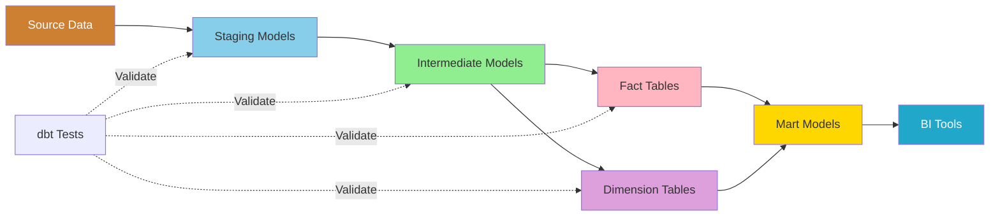
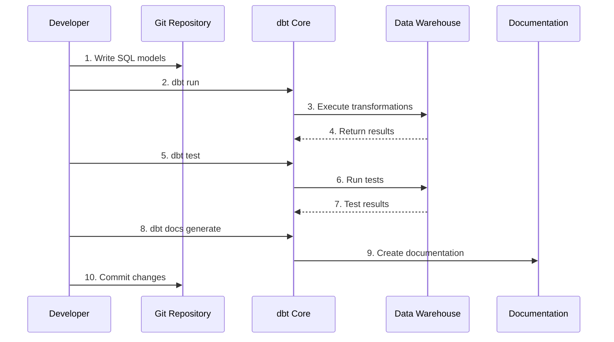

# dbt Development Guide

**Version**: 3.2.0  
**Last Updated**: October 16, 2025  
**Language**: English

## Table of Contents

1. [Overview](#overview)
2. [Project Setup](#project-setup)
3. [Data Modeling](#data-modeling)
4. [Testing Framework](#testing-framework)
5. [Documentation](#documentation)
6. [Macros and Packages](#macros-and-packages)
7. [Incremental Models](#incremental-models)
8. [Workflow Orchestration](#workflow-orchestration)
9. [Best Practices](#best-practices)
10. [Troubleshooting](#troubleshooting)

---

## Overview

dbt (data build tool) enables analytics engineers to transform data in the warehouse using SQL and software engineering best practices. This guide covers everything from project initialization to advanced development techniques.

### What is dbt?

dbt transforms raw data into analytics-ready datasets through:

- **SQL-Based Transformations**: Write SELECT statements, dbt handles the rest
- **Version Control**: Git integration for collaboration
- **Testing**: Built-in data quality testing framework
- **Documentation**: Auto-generated documentation with lineage
- **Modularity**: Reusable models and macros

### Core Concepts



### dbt Workflow



---

## Project Setup

### Initialize dbt Project

```bash
# Create new dbt project
dbt init dremio_analytics

# Project structure created:
dremio_analytics/
├── dbt_project.yml
├── profiles.yml
├── README.md
├── models/
│   └── example/
├── tests/
├── macros/
├── snapshots/
└── analyses/
```

### Configure profiles.yml

```yaml
# ~/.dbt/profiles.yml
dremio_analytics:
  target: dev
  outputs:
    dev:
      type: dremio
      threads: 4
      host: localhost
      port: 9047
      username: "{{ env_var('DREMIO_USER') }}"
      password: "{{ env_var('DREMIO_PASSWORD') }}"
      use_ssl: false
      object_storage_source: MinIO
      object_storage_path: datalake
      datalake_name: "@{{ env_var('DREMIO_USER') }}"
      
    prod:
      type: dremio
      threads: 8
      host: dremio.production.com
      port: 443
      username: "{{ env_var('DREMIO_PROD_USER') }}"
      password: "{{ env_var('DREMIO_PROD_PASSWORD') }}"
      use_ssl: true
      object_storage_source: MinIO
      object_storage_path: datalake
      datalake_name: "Production"
```

### Configure dbt_project.yml

```yaml
# dbt_project.yml
name: 'dremio_analytics'
version: '1.0.0'
config-version: 2

profile: 'dremio_analytics'

model-paths: ["models"]
analysis-paths: ["analyses"]
test-paths: ["tests"]
seed-paths: ["seeds"]
macro-paths: ["macros"]
snapshot-paths: ["snapshots"]

target-path: "target"
clean-targets:
  - "target"
  - "dbt_packages"

# Global model configuration
models:
  dremio_analytics:
    # Staging models - views for fast development
    staging:
      +materialized: view
      +schema: staging
      
    # Intermediate models - ephemeral or views
    intermediate:
      +materialized: view
      +schema: intermediate
      
    # Fact tables - tables for performance
    facts:
      +materialized: table
      +schema: facts
      
    # Dimension tables - tables for performance
    dimensions:
      +materialized: table
      +schema: dimensions
      
    # Mart models - tables for reporting
    marts:
      +materialized: table
      +schema: marts

# Documentation
docs:
  dremio_analytics:
    +enabled: true

# Seed configuration
seeds:
  dremio_analytics:
    +schema: seeds
    +quote_columns: false

# Snapshot configuration
snapshots:
  dremio_analytics:
    +target_schema: snapshots
    +strategy: timestamp
    +updated_at: updated_at

vars:
  # Global variables
  current_year: 2025
  reporting_currency: 'USD'
```

### Environment Variables

```bash
# .env file (never commit to Git!)
export DREMIO_USER=admin
export DREMIO_PASSWORD=your_secure_password
export DREMIO_PROD_USER=dbt_service_account
export DREMIO_PROD_PASSWORD=prod_password
```

### Test Connection

```bash
# Verify dbt can connect
dbt debug

# Expected output:
# Configuration:
#   profiles.yml file [OK found and valid]
#   dbt_project.yml file [OK found and valid]
# 
# Connection:
#   host: localhost
#   port: 9047
#   user: admin
#   database: datalake
#   Connection test: [OK connection ok]
```

---

## Data Modeling

### Staging Models

Staging models clean and standardize raw data from sources.

#### Define Sources

```yaml
# models/staging/sources.yml
version: 2

sources:
  - name: bronze
    description: Raw data from Airbyte ingestion
    database: MinIO
    schema: datalake.bronze
    tables:
      - name: raw_customers
        description: Raw customer data from PostgreSQL
        columns:
          - name: customer_id
            description: Primary key
            tests:
              - unique
              - not_null
          - name: email
            description: Customer email address
            tests:
              - not_null
          - name: created_at
            description: Account creation timestamp
            
      - name: raw_orders
        description: Raw order data
        columns:
          - name: order_id
            tests:
              - unique
              - not_null
          - name: customer_id
            tests:
              - not_null
              - relationships:
                  to: source('bronze', 'raw_customers')
                  field: customer_id
```

#### Staging Model Example

```sql
-- models/staging/stg_customers.sql
{{
    config(
        materialized='view',
        tags=['staging', 'customers']
    )
}}

WITH source AS (
    SELECT * FROM {{ source('bronze', 'raw_customers') }}
),

cleaned AS (
    SELECT
        -- Primary key
        customer_id,
        
        -- Name standardization
        TRIM(UPPER(COALESCE(first_name, ''))) AS first_name,
        TRIM(UPPER(COALESCE(last_name, ''))) AS last_name,
        TRIM(UPPER(COALESCE(first_name, ''))) || ' ' || 
        TRIM(UPPER(COALESCE(last_name, ''))) AS full_name,
        
        -- Contact information
        LOWER(TRIM(email)) AS email,
        REGEXP_REPLACE(phone, '[^0-9]', '') AS phone_clean,
        
        -- Address
        TRIM(address) AS address,
        UPPER(TRIM(city)) AS city,
        UPPER(TRIM(state)) AS state,
        LPAD(CAST(zip_code AS VARCHAR), 5, '0') AS zip_code,
        UPPER(TRIM(country)) AS country,
        
        -- Timestamps
        created_at,
        updated_at,
        
        -- Metadata
        CURRENT_TIMESTAMP AS _dbt_loaded_at
        
    FROM source
    
    -- Data quality filters
    WHERE customer_id IS NOT NULL
      AND email IS NOT NULL
      AND email LIKE '%@%'
      AND created_at IS NOT NULL
)

SELECT * FROM cleaned
```

```sql
-- models/staging/stg_orders.sql
{{
    config(
        materialized='view',
        tags=['staging', 'orders']
    )
}}

WITH source AS (
    SELECT * FROM {{ source('bronze', 'raw_orders') }}
),

cleaned AS (
    SELECT
        -- Primary key
        order_id,
        
        -- Foreign keys
        customer_id,
        
        -- Order details
        order_date,
        CAST(amount AS DECIMAL(10,2)) AS amount,
        CAST(tax AS DECIMAL(10,2)) AS tax,
        CAST(shipping AS DECIMAL(10,2)) AS shipping,
        CAST(amount + tax + shipping AS DECIMAL(10,2)) AS total_amount,
        
        -- Status normalization
        CASE 
            WHEN UPPER(status) IN ('COMPLETE', 'COMPLETED', 'SUCCESS') 
                THEN 'COMPLETED'
            WHEN UPPER(status) IN ('PENDING', 'PROCESSING') 
                THEN 'PENDING'
            WHEN UPPER(status) IN ('CANCEL', 'CANCELLED', 'CANCELED') 
                THEN 'CANCELLED'
            WHEN UPPER(status) IN ('FAIL', 'FAILED', 'ERROR') 
                THEN 'FAILED'
            ELSE 'UNKNOWN'
        END AS status,
        
        -- Payment method
        UPPER(TRIM(payment_method)) AS payment_method,
        
        -- Timestamps
        created_at,
        updated_at,
        
        -- Metadata
        CURRENT_TIMESTAMP AS _dbt_loaded_at
        
    FROM source
    
    WHERE order_id IS NOT NULL
      AND customer_id IS NOT NULL
      AND order_date IS NOT NULL
      AND amount >= 0
)

SELECT * FROM cleaned
```

### Intermediate Models

Intermediate models join and enrich data.

```sql
-- models/intermediate/int_customer_orders.sql
{{
    config(
        materialized='view',
        tags=['intermediate', 'customer_orders']
    )
}}

WITH customers AS (
    SELECT * FROM {{ ref('stg_customers') }}
),

orders AS (
    SELECT * FROM {{ ref('stg_orders') }}
),

customer_orders AS (
    SELECT
        -- Customer attributes
        c.customer_id,
        c.full_name,
        c.email,
        c.city,
        c.state,
        c.country,
        c.created_at AS customer_created_at,
        
        -- Order attributes
        o.order_id,
        o.order_date,
        o.amount,
        o.tax,
        o.shipping,
        o.total_amount,
        o.status,
        o.payment_method,
        
        -- Calculated fields
        DATEDIFF('day', c.created_at, o.order_date) AS days_since_signup,
        CASE 
            WHEN DATEDIFF('day', c.created_at, o.order_date) <= 30 
                THEN 'New Customer'
            WHEN DATEDIFF('day', c.created_at, o.order_date) <= 180 
                THEN 'Regular Customer'
            ELSE 'Long-term Customer'
        END AS customer_segment,
        
        -- Order classification
        CASE
            WHEN o.total_amount < 50 THEN 'Small'
            WHEN o.total_amount < 200 THEN 'Medium'
            ELSE 'Large'
        END AS order_size,
        
        CURRENT_TIMESTAMP AS _dbt_loaded_at
        
    FROM customers c
    INNER JOIN orders o
        ON c.customer_id = o.customer_id
)

SELECT * FROM customer_orders
```

### Fact Tables

```sql
-- models/facts/fct_orders.sql
{{
    config(
        materialized='table',
        tags=['facts', 'orders']
    )
}}

WITH customer_orders AS (
    SELECT * FROM {{ ref('int_customer_orders') }}
),

order_metrics AS (
    SELECT
        -- Keys
        order_id,
        customer_id,
        
        -- Dates
        order_date,
        DATE_TRUNC('month', order_date) AS order_month,
        DATE_TRUNC('year', order_date) AS order_year,
        EXTRACT(YEAR FROM order_date) AS year,
        EXTRACT(MONTH FROM order_date) AS month,
        EXTRACT(DAY FROM order_date) AS day,
        EXTRACT(DOW FROM order_date) AS day_of_week,
        
        -- Amounts
        amount,
        tax,
        shipping,
        total_amount,
        
        -- Attributes
        status,
        payment_method,
        customer_segment,
        order_size,
        
        -- Flags
        CASE WHEN status = 'COMPLETED' THEN 1 ELSE 0 END AS is_completed,
        CASE WHEN status = 'CANCELLED' THEN 1 ELSE 0 END AS is_cancelled,
        
        -- Customer tenure
        days_since_signup,
        
        -- Metadata
        CURRENT_TIMESTAMP AS _dbt_loaded_at
        
    FROM customer_orders
)

SELECT * FROM order_metrics
```

### Dimension Tables

```sql
-- models/dimensions/dim_customers.sql
{{
    config(
        materialized='table',
        tags=['dimensions', 'customers']
    )
}}

WITH customers AS (
    SELECT * FROM {{ ref('stg_customers') }}
),

orders AS (
    SELECT * FROM {{ ref('stg_orders') }}
    WHERE status = 'COMPLETED'
),

customer_metrics AS (
    SELECT
        customer_id,
        COUNT(DISTINCT order_id) AS lifetime_orders,
        SUM(total_amount) AS lifetime_value,
        AVG(total_amount) AS average_order_value,
        MIN(order_date) AS first_order_date,
        MAX(order_date) AS last_order_date,
        MAX(order_date) AS most_recent_order_date
    FROM orders
    GROUP BY customer_id
),

final AS (
    SELECT
        -- Customer attributes
        c.customer_id,
        c.first_name,
        c.last_name,
        c.full_name,
        c.email,
        c.phone_clean AS phone,
        c.address,
        c.city,
        c.state,
        c.zip_code,
        c.country,
        c.created_at AS registration_date,
        
        -- Order metrics
        COALESCE(m.lifetime_orders, 0) AS lifetime_orders,
        COALESCE(m.lifetime_value, 0) AS lifetime_value,
        COALESCE(m.average_order_value, 0) AS average_order_value,
        m.first_order_date,
        m.last_order_date,
        
        -- Customer status
        CASE 
            WHEN m.customer_id IS NULL THEN 'No Orders'
            WHEN DATEDIFF('day', m.most_recent_order_date, CURRENT_DATE) <= 30 THEN 'Active'
            WHEN DATEDIFF('day', m.most_recent_order_date, CURRENT_DATE) <= 90 THEN 'At Risk'
            ELSE 'Churned'
        END AS customer_status,
        
        -- Customer tier
        CASE
            WHEN COALESCE(m.lifetime_value, 0) >= 1000 THEN 'Platinum'
            WHEN COALESCE(m.lifetime_value, 0) >= 500 THEN 'Gold'
            WHEN COALESCE(m.lifetime_value, 0) >= 100 THEN 'Silver'
            ELSE 'Bronze'
        END AS customer_tier,
        
        -- Metadata
        c.updated_at,
        CURRENT_TIMESTAMP AS _dbt_loaded_at
        
    FROM customers c
    LEFT JOIN customer_metrics m
        ON c.customer_id = m.customer_id
)

SELECT * FROM final
```

### Mart Models

```sql
-- models/marts/mart_customer_lifetime_value.sql
{{
    config(
        materialized='table',
        tags=['marts', 'customer_analytics']
    )
}}

WITH customers AS (
    SELECT * FROM {{ ref('dim_customers') }}
),

orders AS (
    SELECT * FROM {{ ref('fct_orders') }}
    WHERE is_completed = 1
),

customer_cohorts AS (
    SELECT
        customer_id,
        DATE_TRUNC('month', registration_date) AS cohort_month
    FROM customers
),

customer_summary AS (
    SELECT
        c.customer_id,
        c.full_name,
        c.email,
        c.city,
        c.state,
        c.registration_date,
        cc.cohort_month,
        c.customer_status,
        c.customer_tier,
        
        -- Order metrics
        c.lifetime_orders,
        c.lifetime_value,
        c.average_order_value,
        c.first_order_date,
        c.last_order_date,
        
        -- Calculated metrics
        DATEDIFF('day', c.first_order_date, c.last_order_date) AS customer_lifespan_days,
        CASE 
            WHEN c.lifetime_orders > 1 
            THEN DATEDIFF('day', c.first_order_date, c.last_order_date) / (c.lifetime_orders - 1)
            ELSE NULL
        END AS avg_days_between_orders,
        
        -- Recency, Frequency, Monetary (RFM)
        DATEDIFF('day', c.last_order_date, CURRENT_DATE) AS recency_days,
        c.lifetime_orders AS frequency,
        c.lifetime_value AS monetary,
        
        -- RFM Scores (1-5)
        NTILE(5) OVER (ORDER BY DATEDIFF('day', c.last_order_date, CURRENT_DATE) DESC) AS recency_score,
        NTILE(5) OVER (ORDER BY c.lifetime_orders) AS frequency_score,
        NTILE(5) OVER (ORDER BY c.lifetime_value) AS monetary_score,
        
        CURRENT_TIMESTAMP AS _dbt_loaded_at
        
    FROM customers c
    LEFT JOIN customer_cohorts cc
        ON c.customer_id = cc.customer_id
)

SELECT * FROM customer_summary
```

---

## Testing Framework

### Built-in Tests

```yaml
# models/staging/schema.yml
version: 2

models:
  - name: stg_customers
    description: Cleaned and standardized customer data
    columns:
      - name: customer_id
        description: Primary key
        tests:
          - unique
          - not_null
          
      - name: email
        description: Customer email
        tests:
          - not_null
          - unique
          
      - name: state
        description: US state code
        tests:
          - accepted_values:
              values: ['CA', 'NY', 'TX', 'FL', 'IL']
              quote: true
              
      - name: created_at
        description: Registration date
        tests:
          - not_null
          - dbt_utils.expression_is_true:
              expression: ">= '2020-01-01'"
```

### Custom Tests

```sql
-- tests/assert_positive_order_amounts.sql
-- Test that all order amounts are positive

SELECT
    order_id,
    customer_id,
    amount
FROM {{ ref('stg_orders') }}
WHERE amount < 0
```

```sql
-- tests/assert_valid_email_format.sql
-- Test that all emails have valid format

SELECT
    customer_id,
    email
FROM {{ ref('stg_customers') }}
WHERE email NOT LIKE '%@%.%'
   OR email LIKE '%..%'
   OR email LIKE '.%'
   OR email LIKE '%.'
```

### Generic Tests

```sql
-- macros/generic_tests/test_not_empty_string.sql


SELECT *
FROM {{ model }}
WHERE {{ column_name }} IS NULL
   OR TRIM({{ column_name }}) = ''


```

Usage:
```yaml
# models/staging/schema.yml
columns:
  - name: full_name
    tests:
      - not_empty_string
```

### Run Tests

```bash
# Run all tests
dbt test

# Run tests for specific model
dbt test --select stg_customers

# Run tests for specific tag
dbt test --select tag:staging

# Run specific test type
dbt test --select test_type:unique
dbt test --select test_type:not_null
```

---

## Documentation

### Model Documentation

```yaml
# models/marts/schema.yml
version: 2

models:
  - name: mart_customer_lifetime_value
    description: |
      Customer lifetime value analysis with RFM segmentation.
      
      This mart combines customer attributes with purchase behavior
      to calculate lifetime value, RFM scores, and customer segments.
      
      **Update Frequency**: Daily at 2 AM UTC
      
      **Data Sources**:
      - dim_customers: Customer master data
      - fct_orders: Completed orders only
      
      **Key Metrics**:
      - Lifetime Value: Total revenue from customer
      - RFM Scores: Recency, Frequency, Monetary (1-5 scale)
      - Customer Tier: Bronze/Silver/Gold/Platinum
      
    columns:
      - name: customer_id
        description: Unique customer identifier (PK)
        tests:
          - unique
          - not_null
          
      - name: lifetime_value
        description: |
          Total revenue generated by customer across all completed orders.
          Excludes cancelled and failed orders.
        tests:
          - not_null
          
      - name: recency_score
        description: |
          RFM recency score (1-5).
          5 = Most recent purchase (best)
          1 = Oldest purchase (worst)
          
      - name: frequency_score
        description: |
          RFM frequency score (1-5).
          5 = Most orders (best)
          1 = Fewest orders (worst)
          
      - name: monetary_score
        description: |
          RFM monetary score (1-5).
          5 = Highest spend (best)
          1 = Lowest spend (worst)
```

### Add Descriptions

```sql
-- models/staging/stg_customers.sql
{{
    config(
        materialized='view',
        tags=['staging', 'customers']
    )
}}

-- Description: Staging model for customer data
-- Source: bronze.raw_customers (from PostgreSQL via Airbyte)
-- Transformations:
--   - Name standardization (UPPER TRIM)
--   - Email normalization (lowercase)
--   - Phone cleaning (digits only)
--   - Zip code padding (5 digits)
-- Data Quality: Filters out records with null IDs or invalid emails

WITH source AS (
    SELECT * FROM {{ source('bronze', 'raw_customers') }}
),
...
```

### Generate Documentation

```bash
# Generate documentation site
dbt docs generate

# Serve documentation locally
dbt docs serve

# Opens browser at http://localhost:8080
```

**Documentation Features**:
- **Lineage Graphs**: Visual representation of model dependencies
- **Column Details**: Descriptions, types, tests
- **Source Freshness**: When data was last loaded
- **Project Overview**: README content
- **Search**: Find models, columns, descriptions

---

## Macros and Packages

### Custom Macros

```sql
-- macros/calculate_age.sql

    DATEDIFF('year', {{ birth_date }}, CURRENT_DATE)

```

Usage:
```sql
SELECT
    customer_id,
    {{ calculate_age('birth_date') }} AS age
FROM {{ ref('stg_customers') }}
```

### Reusable SQL Snippets

```sql
-- macros/generate_schema_name.sql

    
    
        {{ default_schema }}
    
        {{ custom_schema_name | trim }}
    

```

### Install Packages

```yaml
# packages.yml
packages:
  - package: dbt-labs/dbt_utils
    version: 1.1.1
    
  - package: calogica/dbt_expectations
    version: 0.10.1
    
  - package: dbt-labs/codegen
    version: 0.12.1
```

Install packages:
```bash
dbt deps

# Packages installed to dbt_packages/
```

### Use Package Macros

```sql
-- Using dbt_utils
SELECT
    {{ dbt_utils.surrogate_key(['customer_id', 'order_id']) }} AS unique_key,
    customer_id,
    order_id
FROM {{ ref('int_customer_orders') }}
```

```yaml
# Using dbt_expectations
tests:
  - dbt_expectations.expect_column_values_to_be_between:
      min_value: 0
      max_value: 10000
      
  - dbt_expectations.expect_column_values_to_match_regex:
      regex: "^[A-Z]{2}$"
```

---

## Incremental Models

### Basic Incremental Model

```sql
-- models/facts/fct_orders_incremental.sql
{{
    config(
        materialized='incremental',
        unique_key='order_id',
        on_schema_change='sync_all_columns'
    )
}}

SELECT
    order_id,
    customer_id,
    order_date,
    amount,
    status,
    updated_at
FROM {{ ref('stg_orders') }}


    -- Only process new or updated records
    WHERE updated_at > (SELECT MAX(updated_at) FROM {{ this }})

```

### Incremental Strategies

#### 1. Append Strategy

```sql
{{
    config(
        materialized='incremental',
        incremental_strategy='append'
    )
}}

SELECT * FROM {{ ref('stg_events') }}


    WHERE event_timestamp > (SELECT MAX(event_timestamp) FROM {{ this }})

```

#### 2. Merge Strategy

```sql
{{
    config(
        materialized='incremental',
        unique_key='order_id',
        incremental_strategy='merge',
        merge_update_columns=['status', 'updated_at']
    )
}}

SELECT
    order_id,
    customer_id,
    order_date,
    amount,
    status,
    updated_at
FROM {{ ref('stg_orders') }}


    WHERE updated_at > (SELECT MAX(updated_at) FROM {{ this }})

```

#### 3. Delete+Insert Strategy

```sql
{{
    config(
        materialized='incremental',
        unique_key='order_date',
        incremental_strategy='delete+insert'
    )
}}

SELECT
    order_date,
    COUNT(*) AS order_count,
    SUM(amount) AS total_revenue
FROM {{ ref('fct_orders') }}


    WHERE order_date >= CURRENT_DATE - INTERVAL '7' DAY


GROUP BY order_date
```

### Full Refresh

```bash
# Force full refresh of incremental model
dbt run --full-refresh --select fct_orders_incremental

# Or for all incremental models
dbt run --full-refresh --select config.materialized:incremental
```

---

## Workflow Orchestration

### dbt Run Commands

```bash
# Run all models
dbt run

# Run specific model
dbt run --select stg_customers

# Run model and its downstream dependencies
dbt run --select stg_customers+

# Run model and its upstream dependencies
dbt run --select +stg_customers

# Run models by tag
dbt run --select tag:staging
dbt run --select tag:facts

# Run models by path
dbt run --select models/staging/
dbt run --select models/marts/

# Exclude models
dbt run --exclude tag:deprecated
```

### Complete Pipeline

```bash
#!/bin/bash
# scripts/run_dbt_pipeline.sh

set -e  # Exit on error

echo "Starting dbt pipeline..."

# 1. Compile project
echo "Compiling project..."
dbt compile

# 2. Run staging models
echo "Running staging models..."
dbt run --select tag:staging

# 3. Test staging models
echo "Testing staging models..."
dbt test --select tag:staging

# 4. Run intermediate models
echo "Running intermediate models..."
dbt run --select tag:intermediate

# 5. Run facts and dimensions
echo "Running facts and dimensions..."
dbt run --select tag:facts tag:dimensions

# 6. Test facts and dimensions
echo "Testing facts and dimensions..."
dbt test --select tag:facts tag:dimensions

# 7. Run marts
echo "Running marts..."
dbt run --select tag:marts

# 8. Test marts
echo "Testing marts..."
dbt test --select tag:marts

# 9. Generate documentation
echo "Generating documentation..."
dbt docs generate

echo "Pipeline complete!"
```

### Airflow Integration

```python
# dags/dbt_pipeline_dag.py
from airflow import DAG
from airflow.operators.bash import BashOperator
from datetime import datetime, timedelta

default_args = {
    'owner': 'data-team',
    'depends_on_past': False,
    'start_date': datetime(2025, 10, 1),
    'email_on_failure': True,
    'email_on_retry': False,
    'retries': 2,
    'retry_delay': timedelta(minutes=5),
}

dag = DAG(
    'dbt_daily_pipeline',
    default_args=default_args,
    description='Daily dbt transformation pipeline',
    schedule_interval='0 2 * * *',  # 2 AM daily
    catchup=False,
    tags=['dbt', 'transformation'],
)

# Task: Run staging models
run_staging = BashOperator(
    task_id='run_staging',
    bash_command='cd /opt/dbt && dbt run --select tag:staging',
    dag=dag,
)

# Task: Test staging models
test_staging = BashOperator(
    task_id='test_staging',
    bash_command='cd /opt/dbt && dbt test --select tag:staging',
    dag=dag,
)

# Task: Run facts and dimensions
run_facts_dims = BashOperator(
    task_id='run_facts_dimensions',
    bash_command='cd /opt/dbt && dbt run --select tag:facts tag:dimensions',
    dag=dag,
)

# Task: Run marts
run_marts = BashOperator(
    task_id='run_marts',
    bash_command='cd /opt/dbt && dbt run --select tag:marts',
    dag=dag,
)

# Task: Generate docs
generate_docs = BashOperator(
    task_id='generate_docs',
    bash_command='cd /opt/dbt && dbt docs generate',
    dag=dag,
)

# Define task dependencies
run_staging >> test_staging >> run_facts_dims >> run_marts >> generate_docs
```

---

## Best Practices

### 1. Naming Conventions

```
Staging:     stg_{source}_{table}        e.g., stg_postgres_customers
Intermediate: int_{entity}_{verb}         e.g., int_customer_orders
Facts:       fct_{entity}                e.g., fct_orders
Dimensions:  dim_{entity}                e.g., dim_customers
Marts:       mart_{business_area}_{entity} e.g., mart_finance_revenue
```

### 2. Folder Structure

```
models/
├── staging/
│   ├── postgres/
│   │   ├── stg_postgres_customers.sql
│   │   └── stg_postgres_orders.sql
│   ├── stripe/
│   │   └── stg_stripe_payments.sql
│   └── sources.yml
├── intermediate/
│   ├── int_customer_orders.sql
│   └── int_customer_payments.sql
├── facts/
│   ├── fct_orders.sql
│   └── fct_payments.sql
├── dimensions/
│   ├── dim_customers.sql
│   └── dim_products.sql
└── marts/
    ├── finance/
    │   └── mart_finance_revenue.sql
    └── marketing/
        └── mart_marketing_attribution.sql
```

### 3. Use CTEs

```sql
-- Good: Clear, readable CTEs
WITH source_data AS (
    SELECT * FROM {{ source('bronze', 'raw_orders') }}
),

filtered_data AS (
    SELECT *
    FROM source_data
    WHERE order_date >= '2025-01-01'
),

final AS (
    SELECT
        order_id,
        SUM(amount) AS total_amount
    FROM filtered_data
    GROUP BY order_id
)

SELECT * FROM final
```

### 4. Add Tests Early

```yaml
# Always test primary keys
tests:
  - unique
  - not_null

# Test foreign keys
tests:
  - relationships:
      to: ref('dim_customers')
      field: customer_id

# Test business logic
tests:
  - dbt_utils.expression_is_true:
      expression: "total_amount >= 0"
```

### 5. Document Everything

```sql
-- Good documentation
-- models/marts/mart_customer_ltv.sql

-- Purpose: Calculate customer lifetime value with RFM segmentation
-- Owner: Analytics Team (analytics@company.com)
-- Update Frequency: Daily at 2 AM
-- Dependencies: dim_customers, fct_orders
-- Consumers: Executive dashboard, marketing campaigns
-- SLA: Must complete before 6 AM for daily reports
```

---

## Troubleshooting

### Common Issues

#### Issue 1: Compilation Error

**Error**: `Compilation Error: Model not found`

**Solution**:
```bash
# Check if model exists
ls models/staging/stg_customers.sql

# Verify ref() syntax
SELECT * FROM {{ ref('stg_customers') }}  # Correct
SELECT * FROM {{ ref('staging.stg_customers') }}  # Wrong
```

#### Issue 2: Circular Dependencies

**Error**: `Compilation Error: Circular dependency detected`

**Solution**:
```bash
# Visualize lineage
dbt docs generate
dbt docs serve

# Check dependency graph in UI
# Fix by removing circular references
```

#### Issue 3: Test Failures

**Error**: `ERROR test not_null_stg_customers_email (FAIL 15)`

**Solution**:
```sql
-- Debug failing test
SELECT *
FROM {{ ref('stg_customers') }}
WHERE email IS NULL;

-- Fix source data or add filter
WHERE email IS NOT NULL
```

#### Issue 4: Incremental Model Not Working

**Error**: Incremental model rebuilding from scratch every time

**Solution**:
```sql
-- Verify unique_key is set
{{
    config(
        unique_key='order_id'  -- Must be defined
    )
}}

-- Check if condition

    -- This block must exist
    WHERE updated_at > (SELECT MAX(updated_at) FROM {{ this }})

```

---

## Summary

This comprehensive dbt development guide covered:

- **Project Setup**: Initialization, configuration, environment setup
- **Data Modeling**: Staging, intermediate, fact, dimension, and mart models
- **Testing Framework**: Built-in tests, custom tests, generic tests
- **Documentation**: Model documentation, auto-generated docs site
- **Macros and Packages**: Reusable code, dbt_utils, expectations
- **Incremental Models**: Append, merge, delete+insert strategies
- **Workflow Orchestration**: dbt commands, pipeline scripts, Airflow integration
- **Best Practices**: Naming conventions, folder structure, documentation
- **Troubleshooting**: Common issues and solutions

Key takeaways:
- Use SQL SELECT statements, dbt handles DDL/DML
- Test early and often with built-in test framework
- Document models for self-service analytics
- Use incremental models for large tables
- Follow consistent naming conventions
- Leverage packages for common functionality

**Related Documentation:**
- [Dremio Setup Guide](./dremio-setup.md)
- [Data Quality Guide](./data-quality.md)
- [Architecture: Data Flow](../architecture/data-flow.md)
- [First Steps Tutorial](../getting-started/first-steps.md)

---

**Version**: 3.2.0  
**Last Updated**: October 16, 2025
