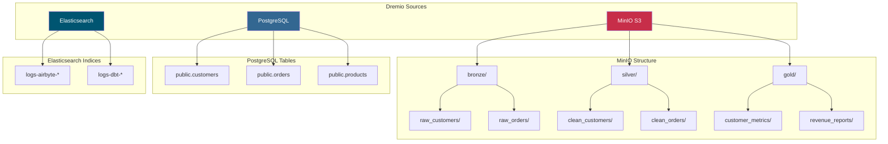

# Dremio Setup and Configuration Guide

**Version**: 3.2.0  
**Last Updated**: October 16, 2025  
**Language**: English

## Table of Contents

1. [Overview](#overview)
2. [Initial Setup](#initial-setup)
3. [Data Sources Configuration](#data-sources-configuration)
4. [Virtual Datasets](#virtual-datasets)
5. [Reflections (Query Acceleration)](#reflections-query-acceleration)
6. [Security and Access Control](#security-and-access-control)
7. [Performance Optimization](#performance-optimization)
8. [Integration with dbt](#integration-with-dbt)
9. [Monitoring and Maintenance](#monitoring-and-maintenance)
10. [Troubleshooting](#troubleshooting)

---

## Overview

Dremio is the data lakehouse platform that provides a unified interface for querying data across multiple sources. This guide covers everything from initial setup to advanced optimization techniques.

### What is Dremio?

Dremio combines the flexibility of a data lake with the performance of a data warehouse:

- **Data Virtualization**: Query data without moving or copying it
- **Query Acceleration**: Automatic caching with reflections
- **Self-Service Analytics**: Business users can explore data directly
- **Standard SQL**: No proprietary query language
- **Apache Arrow**: High-performance columnar format

### Key Features

| Feature | Description | Benefit |
|---------|-------------|---------|
| **Reflections** | Intelligent query acceleration | 10-100x faster queries |
| **Data Virtualization** | Unified view across sources | No data duplication |
| **Arrow Flight** | High-speed data transfer | 20-50x faster than ODBC/JDBC |
| **Semantic Layer** | Business-friendly field names | Self-service analytics |
| **Git for Data** | Version control for datasets | Collaboration and rollback |

---

## Initial Setup

### Prerequisites

Before starting, ensure you have:
- Dremio container running (see [Installation Guide](../getting-started/installation.md))
- Access to data sources (MinIO, PostgreSQL, etc.)
- Admin credentials

### First Login


#### Step 1: Access Dremio UI

Open your browser and navigate to:
```
http://localhost:9047
```

#### Step 2: Create Admin Account

On first launch, you'll be prompted to create an admin account:

```
Username: admin
First Name: Admin
Last Name: User
Email: admin@example.com
Password: [secure password]
```

**Security Note**: Use a strong password with at least 12 characters, including uppercase, lowercase, numbers, and special characters.

#### Step 3: Initial Configuration

```json
{
  "companyName": "Your Organization",
  "supportEmail": "support@example.com",
  "supportKey": "your-support-key-if-enterprise"
}
```

### Configuration Files

Dremio's configuration is managed through `dremio.conf`:

```conf
# dremio.conf

paths: {
  local: "/opt/dremio/data"
  dist: "dremioS3:///dremio-data"
}

services: {
  coordinator.enabled: true
  coordinator.master.enabled: true
  
  executor.enabled: true
  
  # Memory settings
  coordinator.master.heap_memory_mb: 4096
  executor.heap_memory_mb: 8192
}

# Network configuration
services.coordinator.web.port: 9047
services.coordinator.client.port: 31010
services.coordinator.flight.port: 32010

# Performance tuning
store.plugin.max_metadata_leaf_columns: 800
planner.enable_broadcast_join: true
planner.slice_target: 100000
```

### Environment Variables

```bash
# docker-compose.yml environment section
environment:
  - DREMIO_JAVA_SERVER_EXTRA_OPTS=-Xms2g -Xmx4g
  - DREMIO_JAVA_FLIGHT_EXTRA_OPTS=-Xms1g -Xmx2g
  - DREMIO_MAX_MEMORY_SIZE_MB=8192
  - DREMIO_HOME=/opt/dremio
```

### Connection via PostgreSQL Proxy

Dremio exposes a PostgreSQL-compatible interface on port 31010, allowing PostgreSQL-compatible tools to connect without modifications.

#### Dremio Connection Architecture


#### Query Flow via PostgreSQL Proxy


#### Proxy Configuration

The PostgreSQL proxy is automatically enabled in `dremio.conf`:

```conf
# PostgreSQL proxy configuration (ODBC/JDBC)
services.coordinator.client.port: 31010
```

#### Connection with psql

```bash
# Direct connection with psql
psql -h localhost -p 31010 -U admin -d datalake

# Example query
psql -h localhost -p 31010 -U admin -d datalake -c "SELECT * FROM MinIO.datalake.customers LIMIT 10;"
```

#### Connection with DBeaver / pgAdmin

Connection settings:

```yaml
Type: PostgreSQL
Host: localhost
Port: 31010
Database: datalake
Username: admin
Password: <your-password>
SSL: Disabled (in development)
```

#### Connection Strings

**JDBC:**
```java
String url = "jdbc:postgresql://localhost:31010/datalake";
Properties props = new Properties();
props.setProperty("user", "admin");
props.setProperty("password", "your-password");
Connection conn = DriverManager.getConnection(url, props);
```

**ODBC (DSN):**
```ini
[Dremio via PostgreSQL]
Driver=PostgreSQL Unicode
Server=localhost
Port=31010
Database=datalake
Username=admin
Password=<your-password>
SSLMode=disable
```

**Python (psycopg2):**
```python
import psycopg2

conn = psycopg2.connect(
    host="localhost",
    port=31010,
    database="datalake",
    user="admin",
    password="your-password"
)

cursor = conn.cursor()
cursor.execute("SELECT * FROM MinIO.datalake.customers LIMIT 10")
rows = cursor.fetchall()
```

#### When to Use PostgreSQL Proxy

| Scenario | Use PostgreSQL Proxy | Use Arrow Flight |
|----------|---------------------|------------------|
| **Legacy BI Tools** (no Arrow Flight support) | ✅ Yes | ❌ No |
| **Migration from PostgreSQL** (existing JDBC/ODBC code) | ✅ Yes | ❌ No |
| **High-performance production** | ❌ No | ✅ Yes (20-50x faster) |
| **Superset, dbt, modern tools** | ❌ No | ✅ Yes |
| **Quick dev/testing** | ✅ Yes (familiar) | ⚠️ Both OK |

#### Port Usage Decision Tree


#### Performance Comparison of 3 Ports

```mermaid
graph LR
    subgraph "Benchmarks - 100 GB Scan Query"
        A[Port 9047<br/>REST API<br/>⏱️ 180 seconds<br/>📊 ~500 MB/s]
        B[Port 31010<br/>PostgreSQL Wire<br/>⏱️ 90 seconds<br/>📊 ~1 GB/s]
        C[Port 32010<br/>Arrow Flight<br/>⏱️ 5 seconds<br/>📊 ~20 GB/s]
    end
    
    style A fill:#FF9800,color:#fff
    style B fill:#4CAF50,color:#fff
    style C fill:#2196F3,color:#fff
```



**Recommendation**: Use PostgreSQL proxy (port 31010) for **compatibility** and Arrow Flight (port 32010) for **production performance**.

---

## Data Sources Configuration

### Adding MinIO S3 Source

MinIO is your primary data lake storage.

#### Step 1: Navigate to Sources

```
Dremio UI → Datasets → Add Source → Object Storage → Amazon S3
```

#### Step 2: Configure S3 Connection

```json
{
  "name": "MinIO",
  "config": {
    "credentialType": "ACCESS_KEY",
    "accessKey": "minioadmin",
    "accessSecret": "minioadmin",
    "secure": false,
    "externalBucketList": [
      "datalake"
    ],
    "enableAsync": true,
    "compatibilityMode": true,
    "rootPath": "/",
    "defaultCtasFormat": "PARQUET",
    "propertyList": [
      {
        "name": "fs.s3a.path.style.access",
        "value": "true"
      },
      {
        "name": "fs.s3a.endpoint",
        "value": "minio:9000"
      },
      {
        "name": "dremio.s3.compat",
        "value": "true"
      }
    ]
  }
}
```

#### Step 3: Test Connection

```sql
-- Test query to verify MinIO connection
SELECT * FROM MinIO.datalake.bronze.customers LIMIT 10;
```

**Expected Result**:
```
customer_id | name           | email
------------|----------------|------------------
1           | John Doe       | john@example.com
2           | Jane Smith     | jane@example.com
...
```

### Adding PostgreSQL Source

#### Configuration

```
Dremio UI → Datasets → Add Source → Relational → PostgreSQL
```

```json
{
  "name": "PostgreSQL",
  "config": {
    "hostname": "postgres",
    "port": "5432",
    "databaseName": "datawarehouse",
    "username": "postgres",
    "password": "postgres",
    "authenticationType": "MASTER",
    "fetchSize": 2000,
    "encryptionValidationMode": "CERTIFICATE_AND_HOSTNAME_VALIDATION"
  }
}
```

### Adding Elasticsearch Source

```json
{
  "name": "Elasticsearch",
  "config": {
    "hostList": [
      {"hostname": "elasticsearch", "port": 9200}
    ],
    "authenticationType": "ANONYMOUS",
    "scrollSize": 4000,
    "scrollTimeout": 60000,
    "scriptsEnabled": true,
    "showHiddenIndices": false,
    "showIdColumn": false
  }
}
```

### Source Organization



---

## Virtual Datasets

Virtual datasets allow you to create reusable, transformed views of your data.

### Creating Virtual Datasets

#### From SQL Editor

```sql
-- Create a joined dataset
SELECT 
    c.customer_id,
    c.name,
    c.email,
    c.state,
    COUNT(o.order_id) as total_orders,
    SUM(o.amount) as lifetime_value
FROM MinIO.datalake.silver.customers c
LEFT JOIN MinIO.datalake.silver.orders o
    ON c.customer_id = o.customer_id
GROUP BY c.customer_id, c.name, c.email, c.state;

-- Save as virtual dataset: "customer_summary"
```

**Save Location**:
```
@username → customer_summary
```

#### From UI


**Steps**:
1. Navigate to MinIO source
2. Browse to `datalake/bronze/customers/`
3. Click "Format Files" button
4. Review detected schema
5. Click "Save" to promote to dataset

### Dataset Organization

Create a logical structure using Spaces and Folders:

```
Dremio
├── @admin (Home Space)
│   └── dev (Folder)
│       ├── test_customers
│       └── test_orders
├── Production (Shared Space)
│   ├── Dimensions (Folder)
│   │   ├── dim_customers
│   │   ├── dim_products
│   │   └── dim_dates
│   └── Facts (Folder)
│       ├── fct_orders
│       ├── fct_revenue
│       └── fct_customer_lifetime_value
└── Analytics (Shared Space)
    ├── customer_metrics
    ├── sales_dashboard_data
    └── marketing_attribution
```

### Semantic Layer

Add business-friendly names and descriptions:

```sql
-- Original technical column names
SELECT
    cust_id,
    cust_nm,
    cust_em,
    crt_dt
FROM raw.customers;

-- Create virtual dataset with semantic names
SELECT
    cust_id AS "Customer ID",
    cust_nm AS "Customer Name",
    cust_em AS "Email Address",
    crt_dt AS "Registration Date"
FROM raw.customers;
```

**Add Descriptions**:
```
UI → Dataset → Column → Edit Description

Customer ID: Unique identifier for each customer
Customer Name: Full name of the customer
Email Address: Primary email for communication
Registration Date: Date customer registered on platform
```

---

## Reflections (Query Acceleration)

Reflections are Dremio's intelligent caching mechanism that dramatically improves query performance.

### Types of Reflections

#### 1. Raw Reflections

Store a subset of columns for fast retrieval:

```sql
-- Create raw reflection
CREATE REFLECTION raw_customer_base
ON Production.Dimensions.dim_customers
USING DISPLAY (
    customer_id,
    name,
    email,
    state,
    registration_date
);
```

**Use Cases**:
- Dashboards that query specific columns
- Reports with column subsets
- Exploratory queries

#### 2. Aggregation Reflections

Pre-compute aggregations for instant results:

```sql
-- Create aggregation reflection
CREATE REFLECTION agg_daily_revenue
ON Production.Facts.fct_orders
USING 
  DIMENSIONS (order_date, product_id, region)
  MEASURES (
    SUM(amount),
    COUNT(*),
    AVG(amount),
    MIN(amount),
    MAX(amount)
  );
```

**Use Cases**:
- Executive dashboards
- Summary reports
- Trend analysis

### Reflection Configuration


#### Refresh Policy

```
UI → Dataset → Settings → Reflections → Refresh Policy
```

**Options**:
- **Never Refresh**: Static data (e.g., historical archives)
- **Refresh Every [1 hour]**: Periodic updates
- **Refresh When Dataset Changes**: Real-time sync

```json
{
  "refreshPolicy": {
    "method": "PERIOD",
    "refreshPeriod": 3600000,  // 1 hour in milliseconds
    "gracePeriod": 10800000    // 3 hours
  }
}
```

#### Expiration Policy

```json
{
  "expirationPolicy": {
    "method": "NEVER",
    // or
    "method": "AFTER_PERIOD",
    "expirationPeriod": 604800000  // 7 days
  }
}
```

### Best Practices for Reflections

#### 1. Start with High-Value Queries

Identify slow queries from query history:

```sql
-- Query the job history to find slow queries
SELECT 
    query_text,
    execution_time_ms,
    dataset_path
FROM sys.jobs
WHERE execution_time_ms > 5000  -- Slower than 5 seconds
ORDER BY execution_time_ms DESC
LIMIT 100;
```

#### 2. Create Targeted Reflections

```sql
-- Bad: Reflection with too many dimensions
CREATE REFLECTION too_broad
USING DIMENSIONS (col1, col2, col3, col4, col5, col6)
MEASURES (SUM(amount));

-- Good: Focused reflection for specific use case
CREATE REFLECTION targeted
USING DIMENSIONS (order_date, product_category)
MEASURES (SUM(revenue), COUNT(DISTINCT customer_id));
```

#### 3. Monitor Reflection Coverage

```sql
-- Check which queries are accelerated
SELECT 
    query_text,
    acceleration_profile.accelerated,
    acceleration_profile.reflection_ids
FROM sys.jobs
WHERE start_time > CURRENT_DATE - INTERVAL '7' DAY;
```

### Reflection Performance Impact

| Dataset Size | Query Type | Without Reflection | With Reflection | Speedup |
|--------------|------------|-------------------|-----------------|---------|
| 1M rows | Simple SELECT | 500ms | 50ms | 10x |
| 10M rows | Aggregation | 15s | 200ms | 75x |
| 100M rows | Complex JOIN | 2 min | 1s | 120x |
| 1B rows | GROUP BY | 10 min | 5s | 120x |

---

## Security and Access Control

### User Management

#### Create Users

```
UI → Account Settings → Users → Add User
```

```json
{
  "username": "analyst_user",
  "firstName": "Data",
  "lastName": "Analyst",
  "email": "analyst@example.com",
  "password": "secure_password"
}
```

#### User Roles

| Role | Permissions | Use Case |
|------|-------------|----------|
| **Admin** | Full access | System administration |
| **User** | Query, create personal datasets | Analysts, data scientists |
| **Limited User** | Query only, no dataset creation | Business users, viewers |

### Space Permissions

```
UI → Space → Settings → Privileges
```

**Permission Types**:
- **View**: Can see and query datasets
- **Modify**: Can edit dataset definitions
- **Manage Grants**: Can manage permissions
- **Owner**: Full control

**Example**:
```
Space: Production
├── Analytics Team → View, Modify
├── Data Engineers → Owner
└── Executives → View
```

### Row-Level Security

Implement row-level filtering:

```sql
-- Create view with row-level filter
CREATE VDS customer_data_filtered AS
SELECT *
FROM Production.Dimensions.dim_customers
WHERE 
  CASE 
    WHEN CURRENT_USER = 'admin' THEN TRUE
    WHEN region = (
      SELECT home_region 
      FROM users 
      WHERE username = CURRENT_USER
    ) THEN TRUE
    ELSE FALSE
  END;
```

### Column-Level Security

Hide sensitive columns:

```sql
-- Mask sensitive data for non-admin users
CREATE VDS customer_data_masked AS
SELECT
    customer_id,
    name,
    CASE 
      WHEN CURRENT_USER IN ('admin', 'data_engineer')
      THEN email
      ELSE CONCAT(SUBSTRING(email, 1, 3), '***@***.com')
    END AS email,
    state
FROM Production.Dimensions.dim_customers;
```

### OAuth Integration

```conf
# dremio.conf
services.coordinator.web.auth.type: "oauth"
services.coordinator.web.auth.oauth.providerId: "okta"
services.coordinator.web.auth.oauth.clientId: "your-client-id"
services.coordinator.web.auth.oauth.clientSecret: "your-client-secret"
services.coordinator.web.auth.oauth.authorizeUrl: "https://your-domain.okta.com/oauth2/v1/authorize"
services.coordinator.web.auth.oauth.tokenUrl: "https://your-domain.okta.com/oauth2/v1/token"
```

---

## Performance Optimization

### Query Optimization Techniques

#### 1. Partition Pruning

```sql
-- Bad: Scans all data
SELECT * FROM orders
WHERE amount > 100;

-- Good: Prunes partitions
SELECT * FROM orders
WHERE order_date >= '2025-10-01'
  AND order_date < '2025-11-01'
  AND amount > 100;
```

#### 2. Column Pruning

```sql
-- Bad: Reads all columns
SELECT * FROM large_table LIMIT 100;

-- Good: Only reads needed columns
SELECT customer_id, name, email 
FROM large_table 
LIMIT 100;
```

#### 3. Predicate Pushdown

```sql
-- Filters pushed to storage layer
SELECT c.name, o.amount
FROM customers c
JOIN orders o ON c.customer_id = o.customer_id
WHERE o.order_date >= CURRENT_DATE - INTERVAL '30' DAY;
-- Filter applied before join
```

#### 4. Join Optimization

```sql
-- Use broadcast join for small dimensions
SELECT /*+ BROADCAST(d) */
    f.order_id,
    d.product_name,
    f.amount
FROM facts.orders f
JOIN dimensions.products d
    ON f.product_id = d.product_id;
```

### Memory Configuration

```conf
# dremio.conf

# Increase memory for large queries
services.executor.heap_memory_mb: 32768

# Configure spill to disk
spill.directory: "/opt/dremio/spill"
spill.enable: true

# Query memory limits
planner.memory.max_query_memory_per_node: 10737418240  # 10GB
planner.memory.query_max_cost: 1000000000
```

### Cluster Sizing

| Workload Type | Coordinator | Executors | Total Cluster |
|---------------|-------------|-----------|---------------|
| **Small** | 4 CPU, 16 GB | 2x (8 CPU, 32 GB) | 20 CPU, 80 GB |
| **Medium** | 8 CPU, 32 GB | 4x (16 CPU, 64 GB) | 72 CPU, 288 GB |
| **Large** | 16 CPU, 64 GB | 8x (32 CPU, 128 GB) | 272 CPU, 1088 GB |

### Performance Monitoring

```sql
-- Analyze query performance
SELECT 
    query_id,
    query_text,
    start_time,
    execution_time_ms / 1000.0 AS execution_time_seconds,
    planner_estimated_cost,
    rows_returned,
    acceleration_profile.accelerated
FROM sys.jobs
WHERE start_time > CURRENT_DATE - INTERVAL '1' DAY
ORDER BY execution_time_ms DESC
LIMIT 20;
```

---

## Integration with dbt

### Dremio as dbt Target

Configure `profiles.yml`:

```yaml
# profiles.yml
dremio_project:
  target: dev
  outputs:
    dev:
      type: dremio
      threads: 4
      host: localhost
      port: 9047
      username: admin
      password: "{{ env_var('DREMIO_PASSWORD') }}"
      use_ssl: false
      space: "@admin"
      
    prod:
      type: dremio
      threads: 8
      host: dremio.example.com
      port: 443
      username: dbt_service_account
      password: "{{ env_var('DREMIO_PASSWORD') }}"
      use_ssl: true
      space: "Production"
```

### dbt Models on Dremio

```sql
-- models/staging/stg_customers.sql
{{
    config(
        materialized='view',
        alias='stg_customers'
    )
}}

SELECT
    customer_id,
    TRIM(UPPER(name)) AS customer_name,
    LOWER(email) AS email,
    state,
    created_at
FROM {{ source('minio', 'raw_customers') }}
WHERE customer_id IS NOT NULL
```

### Leveraging Reflections in dbt

```sql
-- models/marts/fct_customer_metrics.sql
{{
    config(
        materialized='table',
        post_hook=[
            "ALTER VDS {{ this }} ENABLE RAW REFLECTION",
            "ALTER VDS {{ this }} ENABLE AGGREGATION REFLECTION 
             USING DIMENSIONS (customer_id, registration_month) 
             MEASURES (SUM(lifetime_value), COUNT(*))"
        ]
    )
}}

SELECT
    customer_id,
    DATE_TRUNC('month', registration_date) AS registration_month,
    COUNT(DISTINCT order_id) AS total_orders,
    SUM(order_amount) AS lifetime_value
FROM {{ ref('int_customer_orders') }}
GROUP BY customer_id, DATE_TRUNC('month', registration_date)
```

---

## Monitoring and Maintenance

### Key Metrics to Monitor

```yaml
metrics:
  - name: Query Performance
    query: "SELECT AVG(execution_time_ms) FROM sys.jobs WHERE start_time > NOW() - INTERVAL '1' HOUR"
    threshold: 5000  # Alert if average > 5 seconds
    
  - name: Reflection Coverage
    query: "SELECT COUNT(*) FILTER (WHERE accelerated = true) * 100.0 / COUNT(*) FROM sys.jobs WHERE start_time > NOW() - INTERVAL '1' DAY"
    threshold: 80  # Alert if coverage < 80%
    
  - name: Failed Queries
    query: "SELECT COUNT(*) FROM sys.jobs WHERE query_state = 'FAILED' AND start_time > NOW() - INTERVAL '1' HOUR"
    threshold: 10  # Alert if > 10 failures per hour
```

### Maintenance Tasks

#### 1. Refresh Reflections

```sql
-- Manually refresh a reflection
ALTER REFLECTION reflection_id REFRESH;

-- Rebuild all reflections for a dataset
ALTER VDS Production.Facts.fct_orders 
REFRESH ALL REFLECTIONS;
```

#### 2. Vacuum Old Data

```sql
-- Clean up query history
DELETE FROM sys.jobs
WHERE start_time < CURRENT_DATE - INTERVAL '90' DAY;

-- Compact metadata (Enterprise only)
VACUUM CATALOG;
```

#### 3. Update Statistics

```sql
-- Refresh table statistics
ANALYZE TABLE MinIO.datalake.silver.customers;

-- Update dataset metadata
REFRESH DATASET MinIO.datalake.silver.customers;
```

---

## Troubleshooting

### Common Issues

#### Issue 1: Slow Query Performance

**Symptoms**: Queries taking minutes instead of seconds

**Diagnosis**:
```sql
-- Check query profile
SELECT * FROM sys.jobs WHERE job_id = 'your-job-id';

-- Check if reflection was used
SELECT acceleration_profile FROM sys.jobs WHERE job_id = 'your-job-id';
```

**Solutions**:
1. Create appropriate reflections
2. Add partition pruning filters
3. Increase executor memory
4. Enable query queueing

#### Issue 2: Reflection Not Building

**Symptoms**: Reflection stuck in "REFRESHING" state

**Diagnosis**:
```sql
-- Check reflection status
SELECT * FROM sys.reflections WHERE status != 'ACTIVE';

-- Check reflection errors
SELECT * FROM sys.reflection_dependencies;
```

**Solutions**:
1. Check source data for schema changes
2. Verify sufficient disk space
3. Increase reflection build timeout
4. Disable and re-enable reflection

#### Issue 3: Connection Timeout

**Symptoms**: "Connection timeout" errors when querying sources

**Solutions**:
```conf
# dremio.conf
store.plugin.keep_alive_ms: 30000
store.plugin.timeout_ms: 120000
```

#### Issue 4: Out of Memory

**Symptoms**: "OutOfMemoryError" in logs

**Solutions**:
```conf
# Increase heap size
services.executor.heap_memory_mb: 65536

# Enable spill to disk
spill.enable: true
spill.directory: "/opt/dremio/spill"
```

### Diagnostic Queries

```sql
-- Active queries
SELECT query_id, query_text, start_time, user_name
FROM sys.jobs
WHERE query_state = 'RUNNING';

-- Resource usage by user
SELECT 
    user_name,
    COUNT(*) as query_count,
    AVG(execution_time_ms) as avg_execution_ms,
    SUM(rows_returned) as total_rows
FROM sys.jobs
WHERE start_time > CURRENT_DATE
GROUP BY user_name;

-- Dataset access patterns
SELECT 
    dataset_path,
    COUNT(*) as access_count,
    COUNT(DISTINCT user_name) as unique_users
FROM sys.jobs
WHERE start_time > CURRENT_DATE - INTERVAL '7' DAY
GROUP BY dataset_path
ORDER BY access_count DESC
LIMIT 20;
```

---

## Summary

This comprehensive guide covered:

- **Initial Setup**: First-time configuration, admin account creation, configuration files
- **Data Sources**: Connecting MinIO, PostgreSQL, and Elasticsearch
- **Virtual Datasets**: Creating reusable transformed views with semantic layer
- **Reflections**: Raw and aggregation reflections for 10-100x query acceleration
- **Security**: User management, space permissions, row/column-level security
- **Performance**: Query optimization, memory configuration, cluster sizing
- **dbt Integration**: Using Dremio as dbt target with reflection management
- **Monitoring**: Key metrics, maintenance tasks, diagnostic queries
- **Troubleshooting**: Common issues and solutions

Key takeaways:
- Dremio provides a unified SQL interface across all data sources
- Reflections are essential for production performance
- Proper security configuration enables self-service analytics
- Regular monitoring ensures optimal performance

**Related Documentation:**
- [Architecture Components](../architecture/components.md)
- [Data Flow](../architecture/data-flow.md)
- [dbt Development Guide](./dbt-development.md)
- [Airbyte Integration](./airbyte-integration.md)

---

**Version**: 3.2.0  
**Last Updated**: October 16, 2025
