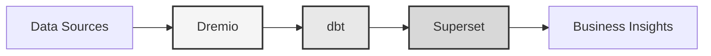

# Plataforma de Datos

**Solución de Lakehouse de Datos Empresarial**

**Language**: Español (ES)  
**Version**: 3.2.5  
**Last Updated**: 2025-10-15

---

## Descripción general

Plataforma de datos profesional que combina Dremio, dbt y Apache Superset para transformación de datos, garantía de calidad e inteligencia empresarial de nivel empresarial.

Esta plataforma proporciona una solución integral para la ingeniería de datos moderna, con pipelines de datos automatizados, pruebas de calidad y paneles interactivos.



---

## Características principales

- Arquitectura de lakehouse de datos con Dremio
- Transformaciones automatizadas con dbt
- Inteligencia empresarial con Apache Superset
- Pruebas completas de calidad de datos
- Sincronización en tiempo real a través de Arrow Flight

---

## Guía de inicio rápido

### Requisitos previos

- Docker 20.10 o superior
- Docker Compose 2.0 o superior
- Python 3.11 o superior
- Mínimo 8 GB de RAM

### Instalación

```bash
# Install dependencies
pip install -r requirements.txt

# Start services
make up

# Verify installation
make status

# Run quality tests
make dbt-test
```

---

## Arquitectura

### Componentes del sistema

| Componente | Puerto | Descripción |
|-----------|------|-------------|
| Dremio | 9047, 31010, 32010 | Plataforma de lakehouse de datos |
| dbt | - | Herramienta de transformación de datos |
| Superset | 8088 | Business intelligence platform |
| PostgreSQL | 5432 | Transactional database |
| MinIO | 9000, 9001 | Object storage (S3-compatible) |
| Elasticsearch | 9200 | Search and analytics engine |

### 📚 Documentación de Arquitectura

- 📘 [Documentación de Arquitectura](architecture/) - Diseño detallado del sistema
- 🎯 [Guía Visual de Puertos Dremio](architecture/dremio-ports-visual.md) ⭐ **NUEVO** - Guía visual completa de los 3 puertos de Dremio

---

## Documentación

### Primeros pasos
- [Installation Guide](getting-started/)
- [Configuration](getting-started/)
- [First Steps](getting-started/)

### Guías de usuario
- [Data Engineering](guides/)
- [Dashboard Creation](guides/)
- [API Integration](guides/)

### Documentación API
- [REST API Reference](api/)
- [Authentication](api/)
- [Code Examples](api/)

### Documentación de arquitectura
- [System Design](architecture/)
- [Data Flow](architecture/)
- [Deployment Guide](architecture/)

---

## Idiomas disponibles

| Language | Code | Documentation |
|----------|------|---------------|
| English | EN | [README.md](../../../README.md) |
| Français | FR | [docs/i18n/fr/](../fr/README.md) |
| Español | ES | [docs/i18n/es/](../es/README.md) |
| Português | PT | [docs/i18n/pt/](../pt/README.md) |
| العربية | AR | [docs/i18n/ar/](../ar/README.md) |
| 中文 | CN | [docs/i18n/cn/](../cn/README.md) |
| 日本語 | JP | [docs/i18n/jp/](../jp/README.md) |
| Русский | RU | [docs/i18n/ru/](../ru/README.md) |

---

## Soporte

For technical assistance:
- Documentation: [Main README](../../../README.md)
- Issue Tracking: GitHub Issues
- Community Forum: GitHub Discussions
- Email: support@example.com

---

**[Volver a la documentación principal](../../../README.md)**
