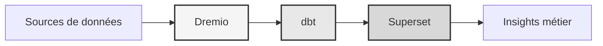

# Plataforma de datos

<p align="center">
  <a href="https://talentys.eu" target="_blank">
    
  </a>
  <br/>
  <em>Supported by <a href="https://talentys.eu">Talentys</a> | <a href="https://www.linkedin.com/company/talentysdata">LinkedIn</a> - Data Engineering & Analytics Excellence</em>
</p>


**Solución de lago de datos empresariales**

**Idioma**: Francés (FR)  
**Versión**: 3.3.1  
**Última actualización**: 19 de octubre de 2025

---

## Descripción general

Plataforma de datos profesional que combina Dremio, dbt y Apache Superset para transformación de datos de nivel empresarial, control de calidad e inteligencia empresarial.

Esta plataforma proporciona una solución completa para la ingeniería de datos moderna, que incluye canalizaciones de datos automatizadas, pruebas de calidad y paneles interactivos.



---

## Características clave

- Arquitectura de la casa del lago de datos con Dremio
- Transformaciones automatizadas con dbt.
- Inteligencia de negocios con Apache Superset
- Pruebas integrales de calidad de datos.
- Sincronización en tiempo real a través de Arrow Flight

---

## Guía de inicio rápido

### Requisitos previos

- Docker 20.10 o superior
- Docker Compose 2.0 o superior
- Python 3.11 o superior
- Mínimo 8 GB de RAM

### Instalación

```bash
# Installer les dépendances
pip install -r requirements.txt

# Démarrer les services
make up

# Vérifier l'installation
make status

# Exécuter les tests de qualité
make dbt-test
```

---

## Arquitectura

### Componentes del sistema

| Componente | Puerto | Descripción |
|---------------|------|-------------|
| Dremio | 9047, 31010, 32010 | Plataforma de datos del lago |
| dbt | - | Herramienta de transformación de datos |
| Superconjunto | 8088 | Plataforma de Inteligencia Empresarial |
| PostgreSQL | 5432 | Base de datos transaccional |
| MinIO | 9000, 9001 | Almacenamiento de objetos (compatible con S3) |
| Búsqueda elástica | 9200 | Motor de búsqueda y análisis |

Consulte la [documentación de arquitectura](arquitectura/) para obtener un diseño detallado del sistema.

---

## Documentación

### Puesta en marcha
- [Guía de instalación](introducción/)
- [Configuración](primeros pasos/)
- [Primeros pasos](primeros pasos/)

### Guías de usuario
- [Ingeniería de datos](guías/)
- [Creación de cuadros de mando](guías/)
- [Integración API](guías/)

### Documentación API
- [Referencia de API REST](api/)
- [Autenticación](api/)
- [Ejemplos de código](api/)

### Documentación de arquitectura
- [Diseño del sistema](arquitectura/)
- [Flujo de datos](arquitectura/)
- [Guía de implementación](arquitectura/)
- [🎯 Guía visual de puertos de Dremio] (arquitectura/dremio-ports-visual.md) ⭐ NUEVO

---

## Idiomas disponibles

| Idioma | Código | Documentación |
|--------|------|-----------------------|
| Inglés | ES | [README.md](../../../README.md) |
| francés | ES | [docs/i18n/fr/](../fr/README.md) |
| Español | ES | [docs/i18n/es/](../es/README.md) |
| portugués | PT | [docs/i18n/pt/](../pt/README.md) |
| العربية | RA | [docs/i18n/ar/](../ar/README.md) |
| 中文 | CN | [docs/i18n/cn/](../cn/README.md) |
| 日本語 | Japón | [docs/i18n/jp/](../jp/README.md) |
| ruso | Reino Unido | [docs/i18n/ru/](../ru/README.md) |

---

## Apoyo

Para asistencia técnica:
- Documentación: [README principal](../../../README.md)
- Seguimiento de problemas: problemas de GitHub
- Foro de la comunidad: Discusiones de GitHub
- Correo electrónico: soporte@ejemplo.com

---

**[Volver a la documentación principal](../../../README.md)**
