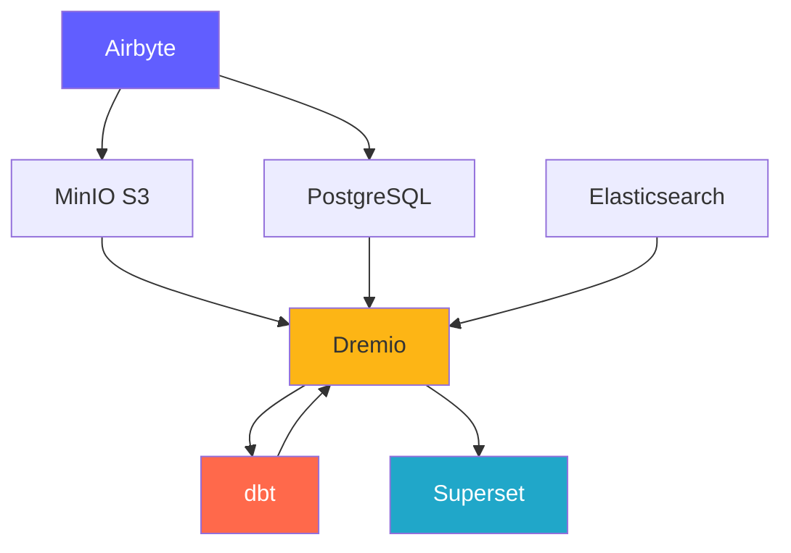
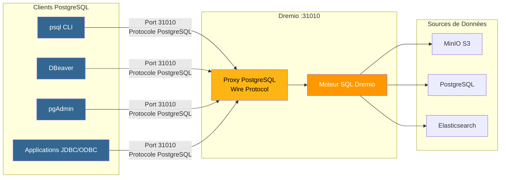
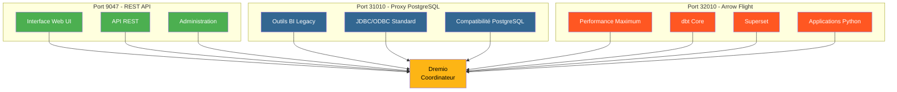
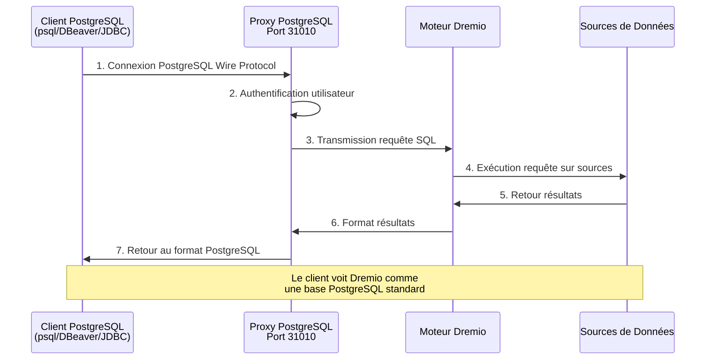
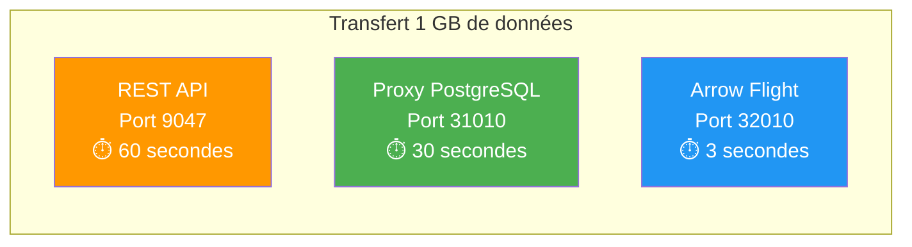

# Componentes de la plataforma

**Versión**: 3.2.0  
**Última actualización**: 2025-10-16  
**Idioma**: Francés

---

## Descripción general de los componentes

La plataforma de datos consta de 7 componentes principales que trabajan juntos para proporcionar una solución completa.



---

## 1. Airbyte – Plataforma de integración de datos

### Descripción general

Airbyte es un motor de integración de datos de código abierto que consolida datos de múltiples fuentes en destinos.

**Versión**: 0.50.33  
**Licencia**: MIT  
**Sitio web**: https://airbyte.com

### Características clave

- **Más de 300 conectores prediseñados**: bases de datos, API, archivos, aplicaciones SaaS
- **Captura de datos modificados (CDC)**: replicación de datos en tiempo real
- **Conectores personalizados**: compilado con Python o CDK de código bajo
- **Normalización**: Transformar JSON en tablas relacionales
- **Sincronización incremental**: sincroniza solo datos nuevos/modificados
- **Monitoreo**: sincronización integrada del estado del seguimiento

### Arquitectura

```yaml
Composants:
  airbyte-webapp:
    Port: 8000
    Objectif: Interface utilisateur web
    
  airbyte-server:
    Port: 8001
    Objectif: Serveur API REST
    
  airbyte-worker:
    Objectif: Exécuter tâches synchronisation
    Scalabilité: Horizontale
    
  airbyte-temporal:
    Port: 7233
    Objectif: Orchestration workflows
    
  airbyte-db:
    Port: 5432
    Objectif: Stockage métadonnées (PostgreSQL)
```

### Caso de uso

- **ELT Pipelines**: flujos de trabajo de extracción, carga y transformación
- **Replicación de bases de datos**: mantenga las bases de datos sincronizadas
- **Integración de API**: extraiga datos de las API REST
- **Ingestión de Data Lake**: cargar datos en S3/MinIO
- **Migración a la nube**: traslade datos locales a la nube

### Configuración

```yaml
# Variables d'Environnement
AIRBYTE_VERSION: "0.50.33"
AIRBYTE_HTTP_PORT: 8000
AIRBYTE_API_PORT: 8001
AIRBYTE_WORKSPACE_ROOT: /tmp/airbyte_local

# Limites Ressources
CPU_LIMIT: "2.0"
MEMORY_LIMIT: "2Gi"
```

### Puntos de integración

- **Salidas a**: MinIO S3, PostgreSQL, Dremio
- **Orquestación**: Puede ser activada por Airflow, Prefecto
- **Monitoreo**: punto final de métricas de Prometheus

---

## 2. Dremio – Plataforma Data Lakehouse

### Descripción general

Dremio proporciona una interfaz SQL unificada para todas las fuentes de datos con aceleración de consultas.

**Versión**: 26.0 OSS  
**Licencia**: Apache 2.0  
**Sitio web**: https://www.dremio.com

### Características clave

- **Data Lakehouse**: combine la flexibilidad del lago con el rendimiento del almacén
- **Reflexiones**: Aceleración automática de consultas (hasta 100 veces más rápida)
- **Arrow Flight**: transferencia de datos de alto rendimiento
- **Virtualización de datos**: Consulta sin mover datos
- **Capa semántica**: definiciones de datos amigables para las empresas
- **Viaje en el tiempo**: consulta de versiones históricas dadas

### Arquitectura

```yaml
Composants:
  Coordinateur:
    Port: 9047 (HTTP), 31010 (ODBC), 32010 (Arrow Flight)
    Objectif: Planification requêtes, gestion métadonnées
    Mémoire: 8Go heap + 8Go direct
    
  Exécuteur:
    Objectif: Exécution requêtes
    Mémoire: 4Go heap + 8Go direct
    Scalabilité: Horizontale (ajouter plus d'exécuteurs)
    
  Stockage:
    Type: Distribué (MinIO, S3, HDFS)
    Format: Parquet, Iceberg
```

### Caso de uso

- **Análisis de autoservicio**: permite a los usuarios empresariales explorar datos
- **Data Mesh**: acceso federado a los datos
- **Aceleración de consultas**: acelere las consultas del panel
- **Catálogo de datos**: descubra y administre datos
- **Activación de BI**: Power Tableau, Power BI, Superconjunto

### Configuración

```conf
# dremio.conf
paths.local: "/opt/dremio/data"
services.coordinator.enabled: true
services.executor.enabled: true

services.coordinator.web.port: 9047
services.flight.endpoint.port: 32010

services.executor.cache.pct.max: 70
```

### Puntos de integración

- **Lecturas de**: MinIO S3, PostgreSQL, Elasticsearch
- **Transformar con**: dbt
- **Usado para**: Superconjunto, Tableau, Power BI

### Proxy PostgreSQL para Dremio

Dremio puede emular un servidor PostgreSQL, lo que permite que las herramientas compatibles con PostgreSQL se conecten a Dremio como si fuera una base de datos PostgreSQL estándar.

#### Arquitectura de proxy PostgreSQL



#### Comparación de los 3 puertos Dremio



#### Configuración de proxy

```yaml
Proxy PostgreSQL:
  Port: 31010 (ODBC/JDBC)
  Protocole: PostgreSQL Wire Protocol
  Compatibilité: Outils compatibles PostgreSQL (psql, pgAdmin, DBeaver)
  
Avantages:
  - Aucune modification du code client
  - Support des pilotes PostgreSQL existants
  - Connexion via JDBC/ODBC standard
  - Compatible avec la plupart des outils BI
```

#### Casos de uso de proxy

1. **BI Legacy Tools**: conecte herramientas que no son compatibles con Arrow Flight
2. **Migración sencilla**: reemplace PostgreSQL con Dremio sin cambiar el código
3. **Compatibilidad ODBC/JDBC**: utilice controladores PostgreSQL estándar
4. **Desarrollo**: Prueba con herramientas familiares de PostgreSQL (psql, pgAdmin)

#### Ejemplo de conexión

```bash
# Via psql
psql -h localhost -p 31010 -U admin -d datalake

# Via DBeaver / pgAdmin
Host: localhost
Port: 31010
Database: datalake
Username: admin
Password: <votre-mot-de-passe>

# Chaîne JDBC
jdbc:postgresql://localhost:31010/datalake

# Chaîne ODBC
Driver=PostgreSQL Unicode;
Server=localhost;
Port=31010;
Database=datalake;
Uid=admin;
Pwd=<votre-mot-de-passe>;
```

#### Limitaciones

- **Rendimiento**: Arrow Flight (puerto 32010) es entre 20 y 50 veces más rápido
- **Características**: algunas funciones avanzadas de PostgreSQL no son compatibles
- **Recomendación**: use Arrow Flight para producción, proxy PostgreSQL para compatibilidad

#### Flujo de conexión a través del proxy PostgreSQL



#### Comparación de protocolos

| Protocolo | Puerto | Rendimiento | Latencia | Casos de uso |
|---------------|------|-------------|---------|--------|
| **API RESTO** | 9047 | Estándar | ~50-100ms | Interfaz de usuario web, administración |
| **ODBC/JDBC (Proxy PostgreSQL)** | 31010 | Bueno | ~20-50ms | Herramientas de BI heredadas, compatibilidad |
| **Vuelo de flecha** | 32010 | Excelente (20-50x) | ~5-10ms | Producción, Superserie, dbt |

#### Rendimiento comparativo



---

## 3. dbt - Herramienta de transformación de datos

### Descripción general

dbt (herramienta de creación de datos) permite a los ingenieros analíticos transformar datos utilizando SQL.

**Versión**: 1.10+  
**Licencia**: Apache 2.0  
**Sitio web**: https://www.getdbt.com

### Características clave

- **Basado en SQL**: escribir transformaciones en SQL
- **Control de versiones**: integración de Git para colaboración
- **Pruebas**: pruebas de calidad de datos integradas
- **Documentación**: generar automáticamente diccionarios de datos
- **Modularidad**: macros y paquetes reutilizables
- **Modelos incrementales**: procesa solo datos nuevos

### Arquitectura

```yaml
Composants:
  dbt Core:
    Objectif: Outil CLI pour exécuter transformations
    Langage: Python
    
  Modèles:
    Objectif: Instructions SQL SELECT
    Types: Vues, Tables, Incrémental, Snapshots
    
  Tests:
    Objectif: Validation qualité données
    Types: Unique, Not Null, Relations, Personnalisés
    
  Macros:
    Objectif: Fonctions SQL réutilisables
    Langage: Jinja2
```

### Caso de uso

- **Modelado de datos**: crear diagramas de estrella/escamas
- **Calidad de datos**: validar la integridad de los datos
- **Dimensiones que cambian lentamente**: realice un seguimiento de los cambios históricos
- **Agregación de datos**: crear tablas de resumen
- **Documentación de datos**: Generar catálogos de datos

### Configuración

```yaml
# dbt_project.yml
name: 'dremio_dbt'
version: '1.0.0'
profile: 'dremio'

models:
  dremio_dbt:
    staging:
      +materialized: view
      +schema: staging
    marts:
      +materialized: table
      +schema: marts
```

### Puntos de integración

- **Leyendo de**: Conjuntos de datos de Dremio
- **Escrito a**: Dremio (a través de Arrow Flight)
- **Orquestado por**: Airflow, cron, post-sincronización de Airbyte

---

## 4. Apache Superset: plataforma de inteligencia empresarial

### Descripción general

Superset es una plataforma moderna de exploración y visualización de datos.

**Versión**: 3.0  
**Licencia**: Apache 2.0  
**Sitio web**: https://superset.apache.org

### Características clave

- **SQL IDE**: editor SQL avanzado con autocompletado
- **Visualizaciones enriquecidas**: más de 50 tipos de gráficos
- **Paneles interactivos**: desglose, filtros, filtrado cruzado
- **SQL Lab**: interfaz de consulta ad-hoc
- **Alertas**: informes y alertas programados
- **Almacenamiento en caché**: resultados de consultas en caché para rendimiento

### Arquitectura

```yaml
Composants:
  Serveur Web:
    Port: 8088
    Objectif: Servir interface web
    Framework: Flask
    
  Workers Celery:
    Objectif: Exécution requêtes asynchrone
    File: Redis/RabbitMQ
    
  Celery Beat:
    Objectif: Tâches planifiées (préchauffage cache, alertes)
    
  Base de Données:
    Objectif: Stocker tableaux de bord, utilisateurs, logs requêtes
    Type: PostgreSQL
```

### Caso de uso

- **Paneles ejecutivos**: seguimiento de KPI
- **Análisis Operacional**: Monitoreo en tiempo real
- **Autoservicio de BI**: empoderar a los analistas
- **Análisis integrado**: integración de iframe en aplicaciones
- **Exploración de datos**: análisis ad-hoc

### Configuración

```python
# superset_config.py
SQLALCHEMY_DATABASE_URI = 'postgresql://...'
SECRET_KEY = '...'

FEATURE_FLAGS = {
    'DASHBOARD_NATIVE_FILTERS': True,
    'DASHBOARD_CROSS_FILTERS': True,
    'ENABLE_TEMPLATE_PROCESSING': True
}

CACHE_CONFIG = {
    'CACHE_TYPE': 'redis',
    'CACHE_DEFAULT_TIMEOUT': 300
}
```

### Puntos de integración

- **Solicitudes**: Dremio (a través de Arrow Flight)
- **Autenticación**: LDAP, OAuth2, base de datos
- **Alertas**: correo electrónico, Slack

---

## 5. PostgreSQL - Base de datos relacional

### Descripción general

PostgreSQL es un avanzado sistema de gestión de bases de datos relacionales de código abierto.

**Versión**: 16  
**Licencia**: Licencia PostgreSQL  
**Sitio web**: https://www.postgresql.org

### Características clave

- **Cumplimiento ACID**: transacciones confiables
- **Soporte JSON**: tipos JSON/JSONB nativos
- **Búsqueda de texto completo**: capacidades de búsqueda integradas
- **Extensiones**: PostGIS, pg_stat_statements, TimescaleDB
- **Replicación**: replicación en streaming, replicación lógica
- **Particionamiento**: particionamiento de tablas nativas

### Arquitectura

```yaml
Composants:
  Serveur PostgreSQL:
    Port: 5432
    Protocole: Protocole wire PostgreSQL
    
  Bases de Données:
    - dremio_db: Métadonnées Dremio
    - superset_db: Configuration Superset
    - airbyte_db: Métadonnées Airbyte
    
  Connexions:
    Max: 200
    Pooling: PgBouncer (optionnel)
```

### Caso de uso

- **Almacenamiento de metadatos**: almacenar metadatos del sistema
- **Cargas transaccionales**: Aplicaciones OLTP
- **Tablas de preparación**: procesamiento de datos temporales
- **Configuración de almacenamiento**: configuración de la aplicación
- **Registros de auditoría**: seguimiento de cambios en el sistema

### Configuración

```conf
# postgresql.conf
max_connections = 200
shared_buffers = 256MB
effective_cache_size = 1GB
maintenance_work_mem = 64MB
work_mem = 4MB

# Performance
random_page_cost = 1.1
effective_io_concurrency = 200

# Journalisation
log_statement = 'mod'
log_duration = on
```

### Puntos de integración

- **Leído por**: Dremio, Superset, Airbyte
- **Escrito por**: Airbyte, dbt, aplicaciones
- **Administrado por**: copias de seguridad automatizadas, replicación

---

## 6. MinIO: almacenamiento de objetos compatible con S3

### Descripción general

MinIO es un sistema de almacenamiento de objetos de alto rendimiento compatible con S3.

**Versión**: Última  
**Licencia**: AGPLv3  
**Sitio web**: https://min.io

### Características clave

- **API S3**: 100% compatible con Amazon S3
- **Alto rendimiento**: rendimiento de varios GB/s
- **Código de borrado**: datos de sostenibilidad y disponibilidad
- **Versionamiento**: control de versión del objeto
- **Cifrado**: lado del servidor y lado del cliente
- **Nube múltiple**: implementación en todas partes

### Arquitectura

```yaml
Composants:
  Serveur MinIO:
    Port: 9000 (API S3), 9001 (Console)
    Mode: Nœud unique ou distribué
    
  Stockage:
    Format: Erasure coded ou brut
    Redondance: Configurable (ex: 4+2)
    
  Buckets:
    - datalake: Stockage données principal
    - raw-data: Ingestion Airbyte
    - processed-data: Sorties dbt
    - backups: Sauvegardes système
```

### Caso de uso

- **Lago de datos**: almacena datos sin procesar y procesados
- **Almacenamiento de objetos**: archivos, imágenes, vídeos
- **Copia de seguridad de almacenamiento**: copias de seguridad de bases de datos y sistemas
- **Archivo**: retención de datos a largo plazo
- **Estadificación de datos**: almacenamiento de procesamiento temporal

### Configuración

```yaml
# Variables d'Environnement
MINIO_ROOT_USER: minioadmin
MINIO_ROOT_PASSWORD: minioadmin123
MINIO_VOLUMES: /data

# Politiques Buckets
- datalake: Lecture-écriture pour plateforme données
- raw-data: Écriture par Airbyte, lecture par Dremio
- processed-data: Écriture par dbt, lecture tous
```

### Puntos de integración

- **Escrito por**: Airbyte, dbt, aplicaciones
- **Leído por**: Dremio, científicos de datos
- **Administrado por**: mc (Cliente MinIO), s3cmd

---

## 7. Elasticsearch - Motor de búsqueda y análisis

### Descripción general

Elasticsearch es un motor de análisis y búsqueda distribuido construido sobre Apache Lucene.

**Versión**: 8.15  
**Licencia**: Licencia elástica 2.0  
**Sitio web**: https://www.elastic.co

### Características clave

- **Búsqueda de texto completo**: capacidades de búsqueda avanzada
- **Indexación en tiempo real**: disponibilidad de datos casi en tiempo real
- **Distribuido**: escalabilidad horizontal
- **Agregaciones**: análisis complejos
- **API REST**: API HTTP simple
- **Aprendizaje automático**: Detección de anomalías

### Arquitectura

```yaml
Composants:
  Nœud Elasticsearch:
    Port: 9200 (HTTP), 9300 (Transport)
    Rôles: Master, Data, Ingest, ML
    
  Index:
    Objectif: Stocker documents recherchables
    Shards: Distribués entre nœuds
    Répliques: Pour haute disponibilité
    
  Cycle de Vie Index:
    Hot: Données récentes (SSD)
    Warm: Données anciennes (HDD)
    Cold: Archive (S3)
```

### Caso de uso

- **Registros analíticos**: registro centralizado (pila ELK)
- **Búsqueda de aplicaciones**: catálogos de productos, búsqueda de sitios
- **Análisis de seguridad**: casos de uso de SIEM
- **Observabilidad**: métricas y seguimientos
- **Análisis de texto**: PNL y análisis de sentimiento

### Configuración

```yaml
# elasticsearch.yml
cluster.name: "dremio-search-cluster"
node.name: "node-1"
network.host: 0.0.0.0
http.port: 9200

# Sécurité
xpack.security.enabled: true
xpack.security.transport.ssl.enabled: false

# Mémoire
bootstrap.memory_lock: true
```

### Puntos de integración

- **Indexado por**: Logstash, Filebeat
- **Solicitado por**: Dremio, Kibana
- **Monitoreado por**: Monitoreo de Elasticsearch

---

## Comparación de componentes

| Componente | Tipo | Uso principal | Escalabilidad | Estado |
|---------------|------|-----------------|-------------|------|
| **Airbyte** | Integración | Ingestión de datos | Horizontales (trabajadores) | Apátrida |
| **Dremio** | Motor de consultas | Acceso a datos | Horizontal (ejecutores) | Apátrida |
| **dbt** | Transformación | Modelado de datos | Verticales (corazones) | Apátrida |
| **Superconjunto** | Plataforma de BI | Visualización | Horizontal (web) | Apátrida |
| **PostgreSQL** | Base de datos | Almacenamiento de metadatos | Vertical (+ replicación) | Con estado |
| **MinIO** | Almacenamiento de objetos | Lago de datos | Horizontales (distribuidos) | Con estado |
| **Búsqueda elástica** | Motor de búsqueda | Búsqueda de texto completo | Horizontal (racimo) | Con estado |

---

## Requisitos de recursos

### Configuración mínima (Desarrollo)

```yaml
Total: 8 Go RAM, 4 CPUs, 50 Go Disque

Allocation:
  Airbyte: 1 Go RAM, 0.5 CPU
  Dremio: 2 Go RAM, 1 CPU
  Superset: 1 Go RAM, 0.5 CPU
  PostgreSQL: 1 Go RAM, 0.5 CPU
  MinIO: 1 Go RAM, 0.5 CPU
  Elasticsearch: 2 Go RAM, 1 CPU
```

### Configuración recomendada (Producción)

```yaml
Total: 64 Go RAM, 16 CPUs, 500 Go SSD

Allocation:
  Airbyte: 4 Go RAM, 2 CPUs
  Dremio: 16 Go RAM, 4 CPUs
  Superset: 8 Go RAM, 2 CPUs
  PostgreSQL: 8 Go RAM, 2 CPUs
  MinIO: 16 Go RAM, 2 CPUs
  Elasticsearch: 12 Go RAM, 4 CPUs
```

---

## Matriz de compatibilidad de versiones

| Componente | Lanzamiento | Compatible con |
|----------|---------|----------------------|
| Airbyte | 0,50+ | Todos los destinos |
| Dremio | 26.0 | dbt 1.8+, clientes de Arrow Flight |
| dbt | 1.10+ | Dremio 23.0+ |
| Superconjunto | 3.0+ | Dremio 22.0+, PostgreSQL 12+ |
| PostgreSQL | 16 | Todos los componentes |
| MinIO | Lo último | Clientes compatibles con S3 |
| Búsqueda elástica | 8.15 | Dremio 26.0+, Logstash 8.x |

---

**Versión de la guía de componentes**: 3.2.0  
**Última actualización**: 2025-10-16  
**Mantenido por**: Equipo de plataforma de datos